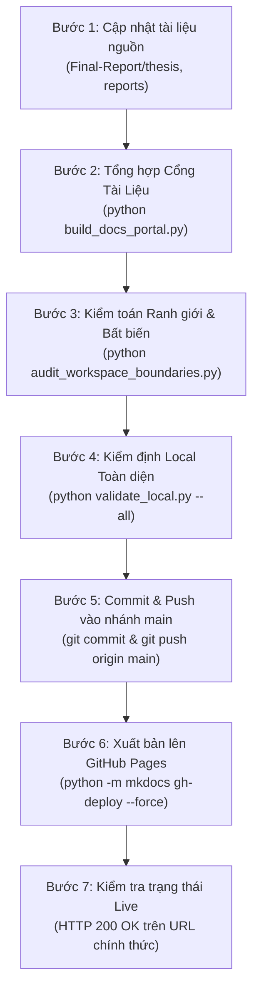

# 📖 Documentation Portal Synchronization & Deployment Skill

Skill này định nghĩa quy trình chuẩn hóa, bộ công cụ tự động hóa và các tiêu chuẩn kiểm định nghiêm ngặt để **đồng bộ hóa toàn bộ tài liệu nghiên cứu, chuyên đề khoa học và luận văn tốt nghiệp** từ cây thư mục repository (`Final-Report/thesis/`, `Final-Report/reports/`, `Final-Report/References/`) sang **Cổng Tài Liệu Web UI** (`Github-Page/`), đồng thời biên dịch và xuất bản tự động lên **GitHub Pages** (`https://nvtruongops.github.io/pi-guard/`).

---

## 🎯 1. Các Nguyên Tắc Bất Biến Bắt Buộc (Core Invariants)

Mọi AI Agent và thành viên nhóm khi vận hành đồng bộ tài liệu BẮT BUỘC tuân thủ 6 nguyên tắc cốt lõi sau:

### Invariant 1: ZERO DEAD LINKS & YOUTUBE OEMBED VERIFICATION
- Mọi URL (website, GitHub repo, bài báo, tài liệu) trước khi ghi vào cổng tài liệu **PHẢI** được xác minh tồn tại thực tế (`HTTP 200` hoặc `302/301`). Tuyệt đối không đưa liên kết suy đoán hoặc hallucinate.
- Mọi video YouTube phải được kiểm tra qua endpoint oEmbed chính thức (`https://www.youtube.com/oembed?url=...&format=json`) để bảo đảm video mở công khai và không bị gỡ bỏ.

### Invariant 2: MANDATORY OPEN-ACCESS PDF (CHỐNG TƯỜNG PHÍ / ZERO PAYWALL)
- Tuyệt đối **KHÔNG ĐƯỢC CHỈ CUNG CẤP DOI BỊ PAYWALL** (khiến người đọc bị chặn bởi thông báo *"You do not currently have access to this content"* từ IEEE, ACM, Springer, Elsevier, Emerald).
- Bắt buộc phải tìm và dẫn kèm liên kết đọc/tải PDF bản mở (Open-Access) từ arXiv, OpenAlex, Semantic Scholar hoặc kho tài liệu mở của trường đại học tác giả.
- Đối với các bài báo thuộc nhà xuất bản có tường phí/chặn bot: Không đặt hyperlink trực tiếp vào DOI để tránh lỗi HTTP 403. Ghi DOI dạng inline code/text (ví dụ: `DOI: 10.1145/xxxx`) và dẫn kèm link tải Open-Access PDF.

### Invariant 3: ON-PAGE CITATION ANCHOR INTEGRITY (ZERO BROKEN ANCHORS)
- Khi sử dụng trích dẫn trong văn bản dạng `[[N]](#refN)`, trang tài liệu đó **BẮT BUỘC** phải có mục *Tài Liệu Tham Khảo (References)* với neo HTML chuẩn `<a id="refN"></a>` tương ứng trên cùng trang.
- Trình biên dịch MkDocs Material phải biên dịch ở chế độ nghiêm ngặt (`--strict`) đạt 100% sạch, không có bất kỳ cảnh báo thiếu neo (*missing anchor / unrecognized link*).

### Invariant 4: REVIEW 1 ZERO-CODE INVARIANT TRONG `Final-Report/`
- Theo quy chuẩn học thuật FPT University (IAP491), tại cột mốc **Review 1 (Tuần 1–4)**, phân hệ `Final-Report/` tuân thủ nguyên tắc **100% Nghiên cứu lý thuyết & y văn**.
- Tuyệt đối không đưa mã nguồn nháp, pipeline hay file thử nghiệm sớm vào `Final-Report/src/`, `Final-Report/tests/` hay `Final-Report/notebooks/`. Toàn bộ hoạt động code của 4 thành viên diễn ra trong `workspaces/<thành_viên>/`.

### Invariant 5: PROHIBITION OF "THỜI GIAN THỰC" (REAL-TIME) TERMINOLOGY
- Tuyệt đối không sử dụng cụm từ *"vận hành thời gian thực"* hoặc *"thời gian thực" (Real-Time)* để miêu tả độ trễ hay hiệu năng suy luận của Guardrail API.
- Thuật ngữ bắt buộc: *"Độ trễ thấp" / "Low-Latency"* (ví dụ: $P95 < 22\text{ms}$ trên CPU), *"Bảo vệ trực tuyến" / "Inline Guardrail Proxy"*, *"Độ trễ suy luận"*.

### Invariant 6: STRICT WORKSPACE BOUNDARY & LEADER MERGE GOVERNANCE
- Thành viên nhóm (Đức, Việt, Phương) chỉ được thao tác trong sandbox `workspaces/<member>/`.
- Chỉ duy nhất Leader (`nvtruongops` / Nguyễn Văn Trường) có thẩm quyền chạy script đồng bộ, merge tài liệu vào `Final-Report/` và `Github-Page/`, và xuất bản lên nhánh `main` / `gh-pages`.

---

## 🛠️ 2. Bộ Công Cụ Tự Động Hóa Trong Phân Hệ `scripts/`

| Script | Đường dẫn thực thi | Chức năng chính |
| :--- | :--- | :--- |
| **Build Docs Portal** | [`Final-Report/scripts/build_docs_portal.py`](file:///d:/Work/Do-an/Final-Report/scripts/build_docs_portal.py) | Quét và tổng hợp 8 chuyên đề khoa học, luận văn (`FINAL_THESIS.md`), Review 1, sơ đồ kiến trúc vào `Github-Page/` |
| **Local QA Suite** | [`Final-Report/scripts/validate_local.py`](file:///d:/Work/Do-an/Final-Report/scripts/validate_local.py) | Bộ kiểm định chất lượng toàn diện: Ranh giới thư mục, JSON manifest, linting, MkDocs strict build |
| **Audit Boundaries** | [`Final-Report/scripts/audit_workspace_boundaries.py`](file:///d:/Work/Do-an/Final-Report/scripts/audit_workspace_boundaries.py) | Kiểm toán phân quyền Git và bảo vệ file bất biến (`CAPSTONE PROJECT REGISTER.md`, `docs/fpt_capstone_guide/`) |
| **Verify URL & DOI** | [`Final-Report/scripts/verify_resource_url.py`](file:///d:/Work/Do-an/Final-Report/scripts/verify_resource_url.py) | Kiểm tra HTTP status của URL, verify YouTube oEmbed và tự động tra cứu Open-Access PDF từ DOI |

---

## 📋 3. Quy Trình Vận Hành Chuẩn 7 Bước (7-Step SOP)

Khi có bất kỳ thay đổi nào trong báo cáo, luận văn, hoặc tài liệu nghiên cứu, thực hiện tuần tự 7 bước sau:



### Bước 1: Cập nhật tài liệu nguồn
Chỉnh sửa hoặc bổ sung tài liệu tại các thư mục chuẩn hóa:
- Luận văn & Chương: [`Final-Report/thesis/FINAL_THESIS.md`](file:///d:/Work/Do-an/Final-Report/thesis/FINAL_THESIS.md), [`Final-Report/thesis/chapters/`](file:///d:/Work/Do-an/Final-Report/thesis/chapters/)
- Báo cáo mốc Review: [`Final-Report/thesis/Review1_Problem_Definition_and_Threat_Model.md`](file:///d:/Work/Do-an/Final-Report/thesis/Review1_Problem_Definition_and_Threat_Model.md)
- Báo cáo tiến độ & slide: [`Final-Report/reports/`](file:///d:/Work/Do-an/Final-Report/reports/)
- Tài liệu y văn tham chiếu: [`Final-Report/References/REFERENCES_LOG.md`](file:///d:/Work/Do-an/Final-Report/References/REFERENCES_LOG.md)

### Bước 2: Tổng hợp Cổng Tài Liệu vào `Github-Page/`
Chạy script tổng hợp tự động để sao chép, định dạng lại đường dẫn ảnh và tạo file `dev/src_architecture.md`:
```bash
python Final-Report/scripts/build_docs_portal.py
```
*Kết quả kỳ vọng*: `🎉 Tổng hợp cổng tài liệu hoàn tất thành công! Sẵn sàng xuất bản!` (đầy đủ 53+ trang tài liệu trong `Github-Page/`).

### Bước 3: Kiểm toán Ranh giới và File Bất Biến
```bash
python Final-Report/scripts/audit_workspace_boundaries.py
```
*Kết quả kỳ vọng*: `✔ [PASS] Workspace boundaries and immutable invariants verified successfully.`

### Bước 4: Kiểm định Chất Lượng Cục Bộ Toàn Diện (Full Local QA)
```bash
python Final-Report/scripts/validate_local.py --all
```
*Kết quả kỳ vọng*: Bảng Local QA Scorecard đạt 100% PASS trên tất cả các tiêu chí (Ranh giới, Manifests, Linting, MkDocs Build 100% clean).

### Bước 5: Staging, Pre-Commit Hook & Push `main`
```bash
git add -A
python Final-Report/scripts/validate_local.py --mode pre-commit
git commit -m "docs(portal): sync research documentation and update github pages"
git push origin main
```

### Bước 6: Xuất bản lên GitHub Pages (`gh-pages` branch)
```bash
python -m mkdocs gh-deploy --force
```
*Lưu ý*: Lệnh này sẽ biên dịch toàn bộ cổng tài liệu từ `Github-Page/` theo cấu hình `mkdocs.yml`, cập nhật nhánh `gh-pages` và đẩy trực tiếp lên remote GitHub.

### Bước 7: Kiểm tra Trạng Thái Trực Tuyến (Live Health Check)
Kiểm tra phản hồi HTTP từ website chính thức:
```bash
python -c "import urllib.request; res = urllib.request.urlopen('https://nvtruongops.github.io/pi-guard/'); print('Live Site Status:', res.status)"
```
*Kết quả kỳ vọng*: `Live Site Status: 200`

---

## 🔧 4. Hướng Dẫn Xử Lý Lỗi Thường Gặp (Troubleshooting)

### 1. Lỗi Cảnh Báo Thiếu Neo (Missing Anchor Warning)
- **Triệu chứng**: MkDocs build báo lỗi `Doc file '...' contains a reference to '...#refN', but the target '...#refN' is not found`.
- **Khắc phục**:
  1. Mở file Markdown bị báo lỗi.
  2. Tìm trích dẫn `[[N]](#refN)`.
  3. Kiểm tra phần *Tài Liệu Tham Khảo* ở cuối file, bảo đảm có thẻ HTML neo tương ứng:
     ```markdown
     - <a id="refN"></a>**[N]** Tác giả (Năm), *Tên bài báo*...
     ```

### 2. Lỗi Paywalled DOI (HTTP 403 Forbidden Khi Kiểm Tra URL)
- **Triệu chứng**: `verify_resource_url.py` trả về mã lỗi 403 khi quét qua link DOI của ACM hoặc IEEE.
- **Khắc phục**: Không đặt hyperlink vào DOI mà chỉ ghi text code `DOI: 10.xxxx/yyyy`, đồng thời bổ sung link Open-Access PDF từ arXiv hoặc Semantic Scholar.

### 3. Lỗi Trùng Lặp Cấu Trúc File Khi Merge Git `gh-pages`
- **Triệu chứng**: `gh-deploy` gặp xung đột nhánh hoặc cảnh báo force push.
- **Khắc phục**: Luôn dùng cờ `--force` (`python -m mkdocs gh-deploy --force`) vì nhánh `gh-pages` là nhánh chứa mã biên dịch tĩnh sinh tự động từ nhánh `main`.
