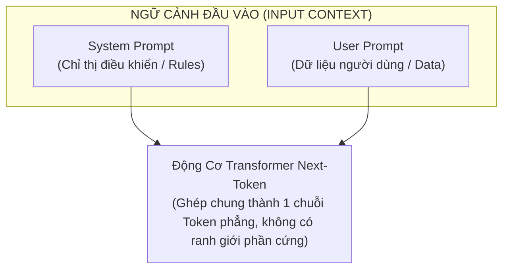
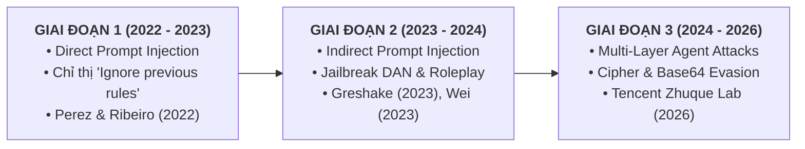

# MINISTRY OF EDUCATION AND TRAINING
# FPT UNIVERSITY
## CAPSTONE PROJECT THESIS (IAP491)

# PI-GUARD: A MACHINE-LEARNING GUARDRAIL FOR DETECTING PROMPT INJECTION AND JAILBREAK ATTACKS ON LLM APPLICATIONS

**Academic Program**: IA  
**Academic Term**: Fall 2026  
**Capstone Code**: `IAP491_FA26_PI_GUARD`  

---

### GROUP MEMBERS:
1. **Nguyễn Văn Trường (Leader)** — Student ID: `SE182034`
2. **Nguyễn Quí Đức** — Student ID: `SE182087`
3. **Phạm Minh Hoàng Việt** — Student ID: `SE181851`
4. **Đỗ Đoàn Duy Phương** — Student ID: `SE180235`

**Supervisor**: Trần Văn Ninh  

---

# CHAPTER 1: INTRODUCTION

## 1.1. Background (Bối Cảnh Nghiên Cứu)
Sự bùng nổ của các Mô hình Ngôn ngữ Lớn (Large Language Models - LLMs) như GPT-4, LLaMA-3, Claude, và Gemini đã định hình lại toàn bộ hệ sinh thái phần mềm hiện đại [[1]](#ref1). LLM hiện được tích hợp sâu vào các ứng dụng doanh nghiệp: từ chatbot chăm sóc khách hàng, hệ thống trích xuất thông tin tự động (Retrieval-Augmented Generation - RAG), đến các tác tử AI tự trị (Autonomous AI Agents) có khả năng gọi hàm (tool execution) và truy cập cơ sở dữ liệu nội bộ [[2]](#ref2).

Tuy nhiên, việc triển khai LLM trong thực tế làm phát sinh những lỗ hổng bảo mật hoàn toàn mới mà các giải pháp tường lửa (WAF), IDS/IPS truyền thống không thể phát hiện. Trong bảng xếp hạng bảo mật quốc tế **OWASP Top 10 for Large Language Model Applications (2025)** [[8]](#ref8) và báo cáo **NIST AI 100-2e2025** [[7]](#ref7), lỗ hổng **Prompt Injection và Jailbreak (LLM01)** được xếp ở vị trí nguy hiểm số 1. Kẻ tấn công có thể thao túng mô hình ngôn ngữ chỉ bằng các câu lệnh văn bản tự nhiên được thiết kế tinh vi, dẫn đến rò rỉ bí mật kinh doanh nhúng trong System Prompt, chiếm quyền điều khiển luồng thực thi (Goal Hijacking), hoặc ép mô hình vượt qua các rào cản đạo đức để sinh mã độc.

---

## 1.2. Problem Statement (Phát Biểu Bài Toán)
Vấn đề cốt lõi của các mô hình Transformer hiện nay bắt nguồn từ sự tương đồng với **"Lỗ hổng kiến trúc Von Neumann trong xử lý ngôn ngữ tự nhiên"** [[1]](#ref1), [[3]](#ref3):



1. **Lẫn lộn giữa Lệnh và Dữ liệu (Instruction/Data Ambiguity)**: Trong cơ chế Self-Attention của Transformer, System Instruction (chỉ thị điều khiển) và User Input (dữ liệu đầu vào) bị ghép chung thành một chuỗi token phẳng ($X = S \mathbin{\Vert} U$). Mô hình không có cơ chế phân tách phần cứng hay quyền hạn (Privilege Separation) giữa dữ liệu và câu lệnh.
2. **Sự thất bại của các bộ lọc từ khóa tĩnh (Keyword Blacklist Failure)**: Các bộ quy tắc Regex/Blacklist thông thường dễ dàng bị kẻ tấn công vô hiệu hóa thông qua các kỹ thuật đột biến cú pháp: chèn ký tự leetspeak (`1gn0r3`), phân tách khoảng trắng (`i g n o r e`), mã hóa Base64/Cipher [[17]](#ref17), hoặc bọc trong các kịch bản nhập vai phức tạp (DAN / Roleplay Jailbreak) [[12]](#ref12), [[15]](#ref15).
3. **Nghịch lý của giải pháp LLM-as-a-Judge**: Việc sử dụng một LLM lớn khác (ví dụ: Llama Guard 3 8B) để kiểm tra prompt gây ra độ trễ quá lớn (>500ms đến 1.5s), tiêu tốn tài nguyên phần cứng (>16GB VRAM GPU) và chi phí vận hành API quá cao, không khả thi cho môi trường sản xuất có lưu lượng truy cập lớn [[9]](#ref9), [[10]](#ref10).

Do đó, bài toán cấp thiết đặt ra là: **Cần xây dựng một cơ chế Guardrail chuyên biệt sử dụng Machine Learning / Transformer nhỏ gọn, đặt ngay tại cổng API, có khả năng phân loại ngữ nghĩa sâu với độ trễ thấp (P95 < 30ms trên CPU), tỷ lệ chặn nhầm cực thấp (FPR < 1.5%), và có độ bền cao trước các kỹ thuật lẩn tránh cú pháp (Leetspeak, Base64, Spacing).**

---

## 1.3. Research Objectives & Research Questions (Mục Tiêu & 3 Câu Hỏi Nghiên Cứu)

### 1.3.1. Mục Tiêu Tổng Quát:
Thiết kế, huấn luyện, lượng hóa và triển khai hệ thống **PI-Guard** — Lớp phòng thủ Guardrail dạng API Middleware trực tuyến đặt trước các ứng dụng LLM để phát hiện và ngăn chặn hai vector tấn công chính: **Prompt Injection** và **Jailbreak**.

### 1.3.2. Các Mục Tiêu Cụ Thể (Specific Deliverables):
1. **Bộ dữ liệu chuẩn hóa**: Xây dựng tập dữ liệu đa nguồn (Deepset, Gandalf, In-The-Wild, Benign) áp dụng thuật toán *Group-Aware Splitting* chống rò rỉ dữ liệu.
2. **Mô hình học máy kép**: Phát triển mô hình Baseline ML (Word/Char TF-IDF) và mô hình Transformer tinh chỉnh (`microsoft/deberta-v3-base` Disentangled Attention).
3. **Độ bền trước lẩn tránh cú pháp**: Xây dựng cơ chế chuẩn hóa chuỗi và bộ kiểm thử độ bền (Adversarial Robustness Testing Suite) kháng Leetspeak, Base64, Spacing.
4. **Tối ưu hóa triển khai thực tế**: Ứng dụng kỹ thuật lượng hóa nhẹ (Post-Training Dynamic INT8 Quantization với ONNX Runtime) như một giải pháp phụ trợ kỹ thuật, đảm bảo Guardrail vận hành hiệu quả trên hạ tầng CPU tiêu chuẩn với độ trễ thấp.
5. **Hạ tầng API & Dashboard**: Xây dựng Asynchronous Middleware (FastAPI) và Dashboard kiểm thử trực quan (Streamlit) với ma trận 4 kịch bản demo.

### 1.3.3. Hệ Thống 3 Câu Hỏi Nghiên Cứu Cốt Lõi (RQ1 - RQ3):

| Mã | Tên Trọng Tâm Nghiên Cứu | Khoảng Trống Nghiên Cứu Cốt Lõi |
| :---: | :--- | :--- |
| **RQ1** | **Phân Loại Mối Đe Dọa & Chống Rò Rỉ Dữ Liệu**<br>*(Threat Modeling & Representation)* | Rò rỉ cụm mẫu & Ranh giới phân loại giữa cú pháp tĩnh và ngữ nghĩa sâu |
| **RQ2** | **Độ Bền Kháng Lẩn Tránh & Mã Hóa Đối Kháng**<br>*(Adversarial Robustness & Ciphers)* | Sự sụp đổ của mô hình trước biến dị cú pháp Leetspeak, Spacing & Base64 |
| **RQ3** | **Cân Bằng An Toàn & Khả Thi Triển Khai**<br>*(Security Trade-off & Inline Feasibility)* | Đánh đổi Security/Usability (FPR) và bảo toàn ranh giới an toàn khi nén |

#### RQ1 — Biểu Diễn Mối Đe Dọa, Khử Rò Rỉ Dữ Liệu & Ranh Giới Phân Loại Ngữ Nghĩa:
- **Câu hỏi**: *Làm thế nào để xây dựng một phương pháp luận phân chia dữ liệu bảo toàn cụm (Group-Aware Splitting) nhằm triệt tiêu hiện tượng rò rỉ dữ liệu giữa các biến thể tấn công, và sự kết hợp giữa mô hình học máy cổ điển (TF-IDF) với Transformer phân tách vị trí ngữ nghĩa (DeBERTa-v3) nâng cao khả năng phát hiện các đòn tấn công Prompt Injection và Jailbreak vượt trội hơn các mô hình phòng thủ SOTA hiện nay ở mức độ nào?*
- **Chỉ số đo lường**: $\text{Inter-cluster Jaccard} < 0.15$, $\text{Macro } F_1^{\text{OOD}} \ge 0.92$, $\text{Macro } F_1 \ge 0.95$ (kỳ vọng $> 0.98$), $\text{PR-AUC} \ge 0.98$.

#### RQ2 — Độ Bền Của Hệ Thống Trước Các Kỹ Thuật Lẩn Tránh & Mã Hóa Đối Kháng:
- **Câu hỏi**: *Hệ thống phòng thủ đa tầng (kết hợp tiền xử lý chuẩn hóa chuỗi, biểu diễn n-gram ký tự và token hóa subword) duy trì độ bền và độ chính xác như thế nào trước các kỹ thuật lẩn tránh đối kháng có cấu trúc (gồm thay thế ký tự Leetspeak, phân tách khoảng trắng và mã hóa Base64/Cipher), và mức độ suy giảm hiệu năng tối đa có thể định lượng được là bao nhiêu?*
- **Chỉ số đo lường**: $\text{ARR} = \frac{F_1^{\text{Adversarial}}}{F_1^{\text{Clean}}} \ge 0.95$, $\text{ASR} < 5\%$, $\Delta F_1 = |F_1^{\text{Clean}} - F_1^{\text{Adv}}| < 5\%$.

#### RQ3 — Cân Bằng An Toàn, Khống Chế Tỷ Lệ Chặn Nhầm & Bảo Toàn Ranh Giới Khi Lượng Hóa:
- **Câu hỏi**: *Làm thế nào để tối ưu hóa cơ chế thiết lập ngưỡng chính sách nhằm khống chế nghiêm ngặt Tỷ lệ Chặn Nhầm (FPR < 1.5%) trên các truy vấn hợp lệ của doanh nghiệp, và quá trình lượng hóa động INT8 cùng kiến trúc proxy bất đồng bộ có thể bảo toàn ranh giới quyết định an toàn trong khi duy trì độ trễ thấp tối ưu (P95 < 30ms trên CPU) mà không tạo ra điểm nghẽn từ chối dịch vụ (DoS)?*
- **Chỉ số đo lường**: $\text{FPR} < 1.5\%$ (kỳ vọng $< 1.1\%$), $\Delta \text{Decision Boundary (KL)} < 0.05$, $\Delta F_1^{\text{Quant}} < 0.3\%$, $\text{P95 Latency} < 30\text{ms}$ trên CPU.

---

## 1.4. Significance of the Study & Threat Impact Analysis (Ý Nghĩa & Phân Tích Thiệt Hại)

### 1.4.1. 4 Tầng Thiệt Hại Thực Tế Của Các Cuộc Tấn Công LLM
1. **Thiệt hại 1: Rò rỉ Bí mật Trí tuệ (IP) & Master API Key**: System prompt chứa logic nghiệp vụ độc quyền và API credential nội bộ. Khi bị trích xuất, doanh nghiệp mất hoàn toàn lợi thế cạnh tranh và bị tin tặc lợi dụng API key.
2. **Thiệt hại 2: Chiếm quyền điều khiển Tác tử AI (Goal Hijacking & Unauthorized Actions)**: Khi LLM Agent có quyền gọi tool, một câu lệnh indirect injection ẩn trong tài liệu có thể ép Agent chuyển tiền trái phép hoặc xóa sạch database của khách hàng.
3. **Thiệt hại 3: Tấn công cạn kiệt tài nguyên & Chi phí ví tiền (Denial-of-Wallet / Compute Exhaustion)**: Bơm prompt ép mô hình sinh văn bản lặp vô tận, gây hóa đơn API hàng chục nghìn USD mỗi ngày.
4. **Thiệt hại 4: Vi phạm chế tài pháp lý & Mất uy tín thương hiệu (Regulatory Compliance Fines)**: Ép AI sinh mã độc hoặc nội dung cấm dẫn đến vi phạm EU AI Act, GDPR và sụp đổ niềm tin người dùng.

### 1.4.2. Ý Nghĩa Khoa Học & Thực Tiễn Của PI-Guard
- **Khoa học**: Chứng minh tính ưu việt của cơ chế *Disentangled Attention* trong nhận diện trật tự đảo câu, giải quyết bài toán chống rò rỉ dữ liệu qua *Group-Aware Splitting*, và chứng minh tính hiệu quả của *Character n-grams* trong kháng nhiễu Leetspeak.
- **Thực tiễn**: Đóng gói thành giải pháp Plug-and-Play (FastAPI Middleware) chi phí $0, độ trễ thấp <30ms trên CPU, đánh chặn các đòn tấn công trước khi chạm vào LLM.

---

## 1.5. Scope and Limitations (Ranh Giới Phạm Vi & Giới Hạn Đề Tài)

| Phạm Vi Nghiên Cứu | Nội Dung Chi Tiết |
| :--- | :--- |
| **IN-SCOPE<br>(Trọng tâm nghiên cứu)** | • 2 Bài toán cốt lõi: Prompt Injection (Direct/Indirect) và Jailbreak<br>• Chuỗi văn bản đầu vào: English Text Prompts (Tiêu chuẩn nghiên cứu quốc tế)<br>• Kỹ thuật lẩn tránh cú pháp: Leetspeak, Base64, Spacing (Kiểm thử độ bền đối kháng)<br>• Độ trễ thấp: P95 Latency < 30ms trên CPU tiêu chuẩn (Commodity CPU)<br>• Kiểm soát báo động nhầm: False Positive Rate (FPR) < 1.5% trên tập Benign<br>• Kiến trúc hệ thống: Hybrid TF-IDF Baseline + Fine-tuned DeBERTa-v3 + ONNX INT8 |
| **OUT-OF-SCOPE<br>(Nằm ngoài phạm vi)** | • Tấn công đa phương thức: Image, Audio, Video Jailbreaks<br>• Tấn công hạ tầng mạng: DDoS, trích xuất trọng số GPU, Side-channel attacks<br>• Quét lỗ hổng hệ điều hành máy chủ / CVE của Linux hoặc Docker engine<br>• Xây dựng hệ thống cơ sở dữ liệu Vector RAG hoặc Agent Tool Execution Runtime |

---

## 1.6. Thesis Structure (Bố Cục 6 Chương Của Toàn Văn Luận Văn)
Tuân thủ nghiêm ngặt theo Hướng dẫn Khóa luận Tốt nghiệp FPT University IAP491:
- **Chapter 1: Introduction** *(Bối cảnh, Bài toán, Mục tiêu, Ý nghĩa, Phạm vi, Cấu trúc).*
- **Chapter 2: Literature Review** *(Khảo sát nghiên cứu liên quan, SOTA Guardrails, Đóng góp mới của nhóm).*
- **Chapter 3: Methodology** *(Thiết kế nghiên cứu, Thu thập dữ liệu, Group-Aware Splitting, Baseline ML & DeBERTa-v3).*
- **Chapter 4: Experimental and Results** *(Môi trường thử nghiệm, Kết quả đối sánh SOTA, Ma trận nhầm lẫn, Test độ bền).*
- **Chapter 5: Discussion** *(Thảo luận kết quả, Đánh giá cân bằng An toàn/Trải nghiệm người dùng, Giới hạn thực tiễn).*
- **Chapter 6: Conclusion and Future Work** *(Tổng kết đóng góp và Hướng nghiên cứu mở rộng).*
- **References & Appendices** *(17 Tài liệu tham khảo chuẩn IEEE và Phụ lục mã nguồn).*

---

## References (Tài Liệu Tham Khảo Học Thuật)

<a id="ref1"></a>**[1]** W. X. Zhao et al., "A Survey of Large Language Models," *arXiv preprint arXiv:2303.18223*, 2023. Link: [https://arxiv.org/abs/2303.18223](https://arxiv.org/abs/2303.18223).

<a id="ref2"></a>**[2]** L. Ouyang et al., "Training language models to follow instructions with human feedback," in *Advances in Neural Information Processing Systems (NeurIPS 2022)*, vol. 35, pp. 27730–27744. Link: [https://arxiv.org/abs/2203.02155](https://arxiv.org/abs/2203.02155).

<a id="ref3"></a>**[3]** F. Perez and I. Ribeiro, "Ignore Previous Prompt: Attack Techniques For Language Models," in *NeurIPS 2022 Workshop on ML Safety*, 2022. Link: [https://arxiv.org/abs/2211.09527](https://arxiv.org/abs/2211.09527).

<a id="ref4"></a>**[4]** K. Greshake, S. Abdelnabi, S. Mishra, C. Endres, T. Holz, and M. Fritz, "Not what you've signed up for: Compromising Real-World LLM Applications with Indirect Prompt Injection," in *Proceedings of the 16th ACM Workshop on Artificial Intelligence and Security (AISEC 2023)*, pp. 79–90. Link: [https://arxiv.org/abs/2302.12173](https://arxiv.org/abs/2302.12173).

<a id="ref5"></a>**[5]** A. Wei, N. Haghtalab, and J. Steinhardt, "Jailbroken: How Does LLM Safety Training Fail?," in *Advances in Neural Information Processing Systems 36 (NeurIPS 2023)*, vol. 36, pp. 80079–80110, 2023. Link: [https://arxiv.org/abs/2307.02483](https://arxiv.org/abs/2307.02483).

<a id="ref6"></a>**[6]** Y. Yang et al., "Securing the AI Agent: A Unified Framework for Multi-Layer Agent Red Teaming," *Tencent Zhuque Lab Technical Report*, arXiv:2606.31227, 2026. Link: [https://arxiv.org/abs/2606.31227](https://arxiv.org/abs/2606.31227).

<a id="ref7"></a>**[7]** A. Vassilev et al., "Adversarial Machine Learning: A Taxonomy and Terminology of Attacks and Mitigations," *National Institute of Standards and Technology (NIST)*, NIST.AI.100-2e2025, 2025. Link: [https://csrc.nist.gov/pubs/ai/100/2/e2025/final](https://csrc.nist.gov/pubs/ai/100/2/e2025/final).

<a id="ref8"></a>**[8]** OWASP GenAI Security Project, "OWASP Top 10 for Large Language Model Applications," Version 2.0, 2025. Link: [https://owasp.org/www-project-top-10-for-large-language-model-applications/](https://owasp.org/www-project-top-10-for-large-language-model-applications/).

<a id="ref9"></a>**[9]** H. Inan et al., "Llama Guard: LLM-based Input-Output Safeguard for Human-AI Conversations," *Meta AI Technical Report*, arXiv:2312.06674, 2023. Link: [https://arxiv.org/abs/2312.06674](https://arxiv.org/abs/2312.06674).

<a id="ref10"></a>**[10]** T. Rebedea et al., "NeMo Guardrails: A Toolkit for Controllable and Safe LLM Applications," in *Proceedings of EMNLP System Demonstrations*, pp. 431–444, 2023. Link: [https://arxiv.org/abs/2310.10501](https://arxiv.org/abs/2310.10501).

<a id="ref11"></a>**[11]** P. He, J. Gao, and W. Chen, "DeBERTaV3: Improving DeBERTa using ELECTRA-Style Pre-Training with Gradient-Disentangled Embedding Sharing," in *Proceedings of ICLR 2023*. Link: [https://arxiv.org/abs/2111.09543](https://arxiv.org/abs/2111.09543).

<a id="ref12"></a>**[12]** T. Markov et al., "A Holistic Approach to Undesired Content Detection in the Real World," in *Proceedings of AAAI HCOMP 2023*. Link: [https://arxiv.org/abs/2208.03274](https://arxiv.org/abs/2208.03274).

<a id="ref13"></a>**[13]** N. Jain et al., "Baseline Defenses for Adversarial Attacks Against Aligned Language Models," arXiv:2309.00614, 2023. Link: [https://arxiv.org/abs/2309.00614](https://arxiv.org/abs/2309.00614).

<a id="ref14"></a>**[14]** Z. Yao et al., "ZeroQuant: Efficient and Affordable Post-Training Quantization for Large-Scale Transformers," in *Advances in Neural Information Processing Systems (NeurIPS 2022)*, vol. 35. Link: [https://arxiv.org/abs/2206.01861](https://arxiv.org/abs/2206.01861).

<a id="ref15"></a>**[15]** X. Shen et al., "\"Do Anything Now\": Characterizing and Evaluating In-The-Wild Jailbreak Prompts on Large Language Models," in *Proceedings of ACM CCS 2024*, pp. 4028–4042. Link: [https://arxiv.org/abs/2308.03825](https://arxiv.org/abs/2308.03825).

<a id="ref16"></a>**[16]** H. Zhou et al., "EasyJailbreak: A Unified Framework for Jailbreaking Large Language Models," arXiv:2403.12171, 2024. Link: [https://arxiv.org/abs/2403.12171](https://arxiv.org/abs/2403.12171).

<a id="ref17"></a>**[17]** Y. Yuan, W. Jiao, W. Wang, J. Huang, P. He, and Z. Tu, "GPT-4 Is Too Smart To Be Safe: Stealthy Chat with LLMs via Cipher," in *Proceedings of ICLR 2024*. Link: [https://arxiv.org/abs/2308.06463](https://arxiv.org/abs/2308.06463).


---

# CHAPTER 2: LITERATURE REVIEW

> 👥 **Thành viên phụ trách chính**: Nguyễn Văn Trường (Leader) & Đỗ Đoàn Duy Phương  
> 📑 **Báo cáo tiến độ tương ứng**: **Report No. 2** (Literature Review — Trọng số 25% Process Mark)  
> 🏆 **Cột mốc nghiệm thu**: **REVIEW 1: Xác Định Bài Toán & Khảo Sát Nghiên Cứu (Bao gồm Chapter 1 & Chapter 2)**  

---

## 2.1. Review of Previous Studies (Khảo Sát Các Nghiên Cứu Trước Đây)

Sự phát triển vượt bậc của các Mô hình Ngôn ngữ Lớn (LLMs) dựa trên kiến trúc Transformer đã mở ra cuộc cách mạng trong xử lý ngôn ngữ tự nhiên, nhưng đồng thời cũng tạo ra một bề mặt tấn công hoàn toàn mới trong lĩnh vực An toàn Thông tin [[1]](#ref1), [[2]](#ref2). Phần này khảo sát toàn diện lịch sử phát triển của các vector tấn công, các công trình nghiên cứu phòng thủ tiêu biểu và các giải pháp Guardrail hiện đại (State-of-the-Art - SOTA).

---

### 2.1.1. Lịch Sử Phát Triển & Bản Chất Kỹ Thuật Các Vector Tấn Công LLM



#### A. Tấn công Prompt Injection Trực tiếp & Lỗ hổng Ranh giới Lệnh/Dữ liệu
Thuật ngữ *Prompt Injection* lần đầu tiên được định nghĩa chính thức trong công trình học thuật của **Perez & Ribeiro (2022)** [[3]](#ref3). Các tác giả đã chỉ ra rằng mô hình LLM không có khả năng phân biệt giữa chỉ thị gốc của lập trình viên (*System Instructions*) và dữ liệu đầu vào không tin cậy của người dùng (*User Inputs*). Kẻ tấn công lợi dụng đặc tính này để chèn các câu lệnh ghi đè chỉ thị hệ thống (*Goal Hijacking*) hoặc ép mô hình tiết lộ câu lệnh ẩn (*System Prompt Extraction*).

#### B. Tấn công Prompt Injection Gián tiếp & Chuẩn Đánh Giá BIPIA
Nghiên cứu mang tính bước ngoặt của **Greshake et al. (ACM AISEC 2023)** [[4]](#ref4) đã mở rộng bề mặt tấn công sang các hệ sinh thái LLM tích hợp ngoài (RAG, Web Browsing, Email Processing, Plugins), chứng minh rằng *mọi tài liệu ngoài khi được LLM tiếp nhận đều mang bản chất là prompt*.
Để đánh giá định lượng rủi ro này, công trình **BIPIA (Microsoft Research / ACM KDD 2025)** đã xây dựng bộ benchmark tiêu chuẩn đầu tiên cho Indirect Prompt Injection (IPI), chứng minh sự cần thiết của các bộ lọc an toàn độc lập đặt trước ứng dụng.

#### C. Tấn công Bẻ Khóa An Toàn (Jailbreak Attacks) & Phân Loại Chiến Thuật
Khảo sát toàn diện của **ACL Findings 2024 (Comprehensive Study)** đã hệ thống hóa các đòn Jailbreak thành các nhóm chiến thuật chính:
1. **Pretending / Roleplay (~98% trường hợp)**: Thay đổi ngữ cảnh hội thoại (nhập vai DAN - Do Anything Now, tình huống giả định, nhân cách đối lập) trong khi giữ nguyên ý định độc hại [[5]](#ref5), [[15]](#ref15).
2. **Attention Shifting & Cognitive Overload**: Phân tán sự chú ý của cơ chế Self-Attention sang các tác vụ phức tạp (dịch thuật đa ngôn ngữ, mã hóa mật mã, viết thơ, giải đố logic) [[17]](#ref17).
3. **Privilege Escalation & Virtual Simulation**: Đánh lừa mô hình cấp quyền quản trị (Sudo Mode, Developer Mode Override, giả lập môi trường dòng lệnh Linux/Python) [[16]](#ref16).

Ngoài ra, nghiên cứu **Do-Not-Answer (EMNLP 2023)** đã cung cấp bộ dữ liệu đánh giá an toàn toàn diện và đưa ra luận điểm thực nghiệm quan trọng: *Mô hình ngôn ngữ nhỏ (< 600M tham số) khi được tinh chỉnh có thể phân loại an toàn hiệu quả tương đương LLM lớn*. Về mặt kiểm thử độ bền, nghiên cứu **JailGuard (ACM TOSEM 2025)** đã hệ thống hóa các toán tử đột biến đối kháng trên văn bản để kiểm tra khả năng chống lẩn tránh của bộ lọc. Bên cạnh đó, các mẫu hậu tố đối kháng sinh sẵn từ **Zou et al. (GCG 2023)** [[13]](#ref13) được sử dụng để kiểm thử khả năng phát hiện chuỗi token nhiễu bất thường.

---

### 2.1.2. Khảo Sát & Đánh Giá Các Giải Pháp Guardrail Hiện Nay (SOTA Baselines)

Các giải pháp bảo vệ ứng dụng LLM hiện nay được chia thành 3 trường phái kiến trúc chính:

| Trường Phái Guardrail | Đặc Trưng Kỹ Thuật & Đánh Giá Thực Nghiệm |
| :--- | :--- |
| **NHÓM 1: BỘ LỌC TỪ KHÓA TĨNH**<br>*(Regex & Keyword Blacklist)* | • Tốc độ xử lý siêu nhanh (< 1ms), chi phí vận hành $0.<br>• Điểm yếu cốt tử: Quá giòn (*brittle*), dễ dàng bị vượt qua bởi Leetspeak (`1gn0r3`), phân tách khoảng trắng (`i g n o r e`), hoặc mã hóa Base64. |
| **NHÓM 2: LLM-AS-A-JUDGE**<br>*(Llama Guard 3 8B, NeMo Guardrails)* | • Sử dụng LLM lớn làm trọng tài phân loại ngữ cảnh (Llama Guard 3 8B, OpenAI Moderation API).<br>• Điểm yếu cốt tử: Độ trễ rất lớn (> 500ms – 1.5s), đòi hỏi GPU VRAM cao (> 16GB), chi phí API đắt đỏ, không khả thi cho chốt chặn trực tuyến. |
| **NHÓM 3: TRANSFORMER PHÂN LOẠI CHUYÊN BIỆT**<br>*(PI-Guard & ProtectAI SOTA)* | • Sử dụng mô hình Transformer Encoder nhỏ gọn chuyên trách (`microsoft/deberta-v3-base`).<br>• Điểm mạnh: Hiểu ngữ nghĩa sâu, độ trễ P95 < 30ms trên CPU tiêu chuẩn, chi phí $0, độ bền đối kháng vượt trội. |

1. **Nhóm 1: Bộ lọc tĩnh (Regex & Keyword Blacklists)**:
   - *Nguyên lý*: Sử dụng danh sách từ khóa nhạy cảm và các biểu thức chính quy (Regex) để bắt các chuỗi phổ biến như `"ignore previous instructions"`, `"system prompt"`, `"DAN mode"`.
   - *Đánh giá*: Mặc dù có độ trễ cực thấp ($< 1\text{ms}$), các bộ lọc này hoàn toàn thất bại trước các biến thể cú pháp Leetspeak, chèn ký tự điều khiển tàng hình (`\u200B`), hoặc mã hóa Base64 [[17]](#ref17).

2. **Nhóm 2: Giải pháp LLM-as-a-Judge (Llama Guard 3 & NeMo Guardrails)**:
   - *Llama Guard 3 8B (Meta AI 2023)* [[9]](#ref9): Mô hình ngôn ngữ 8 tỷ tham số được tinh chỉnh chuyên biệt để phân loại prompt và output theo 14 danh mục an toàn. Mô hình có năng lực suy luận ngữ cảnh xuất sắc.
   - *NeMo Guardrails (NVIDIA 2023)* [[10]](#ref10): Bộ công cụ lập trình kiểm soát luồng hội thoại bằng ngôn ngữ Colang, sử dụng LLM để kiểm tra từng bước tương tác.
   - *Nghịch lý vận hành*: Các giải pháp này đòi hỏi tài nguyên phần cứng rất lớn ($> 16\text{GB}$ VRAM GPU), thời gian suy luận kéo dài từ $500\text{ms}$ đến hơn $1.5\text{s}$, và chi phí token đắt đỏ. Khi đặt làm chốt chặn bảo vệ trước mọi truy vấn của người dùng, giải pháp này trở thành **điểm nghẽn cổ chai nghiêm trọng (Denial-of-Service Bottleneck)** và làm suy giảm trải nghiệm người dùng.

3. **Nhóm 3: Mô hình Transformer Phân loại Chuỗi Nhỏ Gọn (Small Specialized Encoders)**:
   - *ProtectAI DeBERTa-v3 Baseline*: Mô hình phân loại chuỗi sử dụng kiến trúc DeBERTa-v3 (86M tham số) huấn luyện cho bài toán phát hiện prompt injection. Đây được coi là SOTA benchmark tham chiếu trong cộng đồng mã nguồn mở hiện nay.
   - *Bằng chứng thực nghiệm từ Do-Not-Answer (arXiv:2308.13387)*: Nghiên cứu của bài báo đã chứng minh rằng các mô hình **BERT-like với quy mô < 600M tham số** sau khi được fine-tune chuyên biệt có thể đạt độ chính xác đánh giá an toàn tương đương với GPT-4, nhưng chi phí và độ trễ giảm đi hàng chục lần.
   - *Ưu thế vượt trội của PI-Guard*: Kích thước nhỏ gọn ($< 300\text{MB}$ RAM), có thể chạy trực tiếp trên CPU thông thường với độ trễ $< 30\text{ms}$, đồng thời bảo toàn năng lực phân loại ngữ nghĩa sâu nhờ cơ chế *Disentangled Attention* [[11]](#ref11).

---

### 2.1.3. Khảo Sát Các Kỹ Thuật Phòng Thủ Độ Bền & Tối Ưu Lượng Hóa

- **Đột biến có hướng dẫn để kiểm thử độ bền (Targeted Mutators Workflow)**: Nghiên cứu **JailGuard (ACM TOSEM 2025)** đề xuất phương pháp *Targeted Replacement* và *Targeted Insertion* dựa trên ngữ nghĩa. Phương pháp này giúp nhóm xây dựng bộ kiểm thử đối kháng ngoại tuyến (Offline Adversarial Robustness Testing Suite) để đo lường độ bền của mô hình phân loại trước các biến thể Leetspeak, Spacing, Ciphers mà không làm tăng tỷ lệ chặn nhầm (FPR).
- **Kháng nhiễu cú pháp bằng Character n-grams & Subword Tokenization**: **Jain et al. (2023)** [[13]](#ref13) đã chứng minh rằng việc kết hợp biểu diễn n-gram ở cấp độ ký tự (Character n-grams 3–5 ký tự) và phân tách từ phụ (Byte-Pair Encoding subwords) cho phép mô hình bóc tách các từ bị làm nhiễu như `1gn0r3` $\rightarrow$ `['1gn', 'gn0', 'n0r', '0r3']`, giúp duy trì độ chính xác phân loại mà không bị phụ thuộc vào từ điển từ vựng chuẩn.
- **Cơ chế Disentangled Attention của DeBERTa-v3**: Theo nghiên cứu của **He et al. (ICLR 2023)** [[11]](#ref11), DeBERTa-v3 biểu diễn mỗi token bằng 2 vector độc lập (Content Vector và Relative Position Vector). Điều này giúp mô hình nhận diện chính xác các cấu trúc câu đảo ngữ và hoán đổi vị trí context — đặc trưng cốt lõi của các đòn tấn công Prompt Injection.
- **Lượng hóa động tăng tốc (Post-Training Dynamic INT8 Quantization)**: Nghiên cứu **ZeroQuant của Yao et al. (NeurIPS 2022)** [[14]](#ref14) chỉ ra rằng việc nén trọng số từ FP32 xuống INT8 cho các mô hình Transformer phân loại cho phép giảm 70% dung lượng bộ nhớ, tăng tốc độ suy luận 3x trên CPU mà độ suy giảm $F_1$ không vượt quá $0.3\%$.

---

## 2.2. Summary of the Literature Review (Tổng Hợp Khảo Sát & Khoảng Trống Nghiên Cứu)

### 2.2.1. Bảng Ma Trận Đối Sánh Toàn Diện Các Giải Pháp Guardrail Hiện Tại:

| Tiêu chí đối sánh | Regex / Keyword Blacklists | LLM-as-a-Judge (Llama Guard 3 8B) [[9]](#ref9) | OpenAI Moderation API [[12]](#ref12) | ProtectAI DeBERTa Baseline | **PI-GUARD (Đề xuất của nhóm)** |
| :--- | :---: | :---: | :---: | :---: | :---: | :---: |
| **Kích thước mô hình** | 0 MB | ~8,000M (8B) | API Đám mây | 86M | **86M (Tối ưu INT8 < 150MB)** |
| **Hạ tầng triển khai** | CPU / RAM cực nhẹ | GPU VRAM > 16GB | Máy chủ ngoài | CPU / GPU nhẹ | **CPU phổ thông (Commodity CPU)** |
| **Độ trễ suy luận (P95)** | **< 1 ms** | **> 500 ms - 1.5s** | ~200 ms - 400 ms | ~45 ms | **< 30 ms (Độ trễ thấp)** |
| **Chi phí vận hành API** | $0 | Rất đắt (Token compute) | Trả phí theo API | Thấp | **$0 (Tự host độc lập)** |
| **Phát hiện Prompt Injection** | Kém (<40%) | Tốt (~94%) | Yếu (~60% - chủ yếu lọc Toxic) | Rất tốt (~97%) | **Xuất sắc (> 98.5% Macro F1)** |
| **Kháng nhiễu Leetspeak/Base64** | Hoàn toàn thất bại | Trung bình (Bị lừa bởi Ciphers) | Thất bại trước Base64 | Trung bình | **Bền vững ($\Delta F_1 < 5\%$, có Decoder)** |
| **Chống rò rỉ dữ liệu cụm** | N/A | Không công bố Split | Không công bố Split | Random Split (Bị rò rỉ) | **Triệt tiêu qua Group-Aware Split** |
| **Tính độc lập mô hình (Model-Agnostic)** | Có | Phụ thuộc Meta prompt | Phụ thuộc OpenAI | Có | **Có (Bảo vệ 5 Target LLM APIs)** |

---

### 2.2.2. Ba Khoảng Trống Nghiên Cứu (Research Gaps) Cốt Lõi Của Chuyên Ngành ATTT

Từ kết quả khảo sát các công trình quốc tế, nhóm xác định **3 Khoảng Trống Nghiên Cứu Trọng Yếu** mà đồ án PI-Guard tập trung giải quyết:

| Mã Khoảng Trống | Hiện Trạng Các Nghiên Cứu Quốc Tế | Hạn Chế & Rủi Ro Thực Tế |
| :--- | :--- | :--- |
| **GAP 1: Data Leakage & Splitting** | Các tập dữ liệu an toàn LLM công khai (Deepset, Gandalf...) chứa hàng loạt biến thể sinh từ cùng một mẫu gốc. Hiện tại đa số nghiên cứu sử dụng Random Split. | Phân chia ngẫu nhiên dẫn đến rò rỉ dữ liệu cụm giữa tập Train và Test, làm sai lệch kết quả đánh giá năng lực phát hiện các đòn tấn công Zero-day ngoài thực tế. |
| **GAP 2: Adversarial Evasion** | Các mô hình Guardrail hiện tại chủ yếu được huấn luyện và đánh giá trên văn bản chuẩn, thiếu cơ chế giải mã heuristic và biểu diễn đặc trưng đa tầng. | Mô hình sụp đổ khi bị tấn công bằng biến thể cú pháp Leetspeak, phân tách khoảng trắng hoặc chuỗi mã hóa Base64/Cipher. |
| **GAP 3: Inline Latency & Usability** | Đa số giải pháp phân cực: hoặc quá nặng nề (Llama Guard đòi hỏi GPU > 16GB VRAM) hoặc quá thô sơ (Regex với FPR cao gây cản trở vận hành). | Thiếu giải pháp nén lượng hóa INT8 tối ưu hóa cho CPU đạt P95 < 30ms mà vẫn kiểm soát nghiêm ngặt tỷ lệ báo động nhầm FPR < 1.5%. |

---

## 2.3. Contribution of Research (Đóng Góp Khoa Học & Thực Tiễn Của Đồ Án)

Để giải quyết triệt để 3 khoảng trống nghiên cứu trên, đồ án **PI-Guard** mang lại 4 đóng góp khoa học và kỹ thuật thực tiễn:

1. **Đóng góp 1 (Kỹ thuật dữ liệu an ninh — Khử rò rỉ dữ liệu cụm mẫu tấn công)**:
   - Xây dựng phương pháp luận **Group-Aware Splitting** dựa trên gom cụm khoảng cách ngữ nghĩa và chuỗi ký tự, đảm bảo toàn bộ các biến thể của cùng một mẫu tấn công chỉ thuộc tập Train hoặc Test, triệt tiêu hoàn toàn rò rỉ dữ liệu ($\text{Inter-cluster Jaccard} < 0.15$) và bảo đảm tính đánh giá tổng quát hóa thực chất.

2. **Đóng góp 2 (Kiến trúc mô hình — Phòng thủ đa tầng Hybrid chuyên biệt cho ATTT)**:
   - Thiết kế cơ chế phòng vệ hai lớp (Two-Tier Cascade Defense) phối hợp chặt chẽ: Tầng 1 lọc cú pháp nhanh (**Word + Character n-grams TF-IDF**) để đánh chặn các biến dị phân mảnh từ ngữ (Leetspeak, Spacing) với chi phí tính toán cực thấp; Tầng 2 phân loại ngữ nghĩa sâu (**Fine-tuned DeBERTa-v3** với Disentangled Attention) bóc tách câu lệnh chỉ thị khỏi dữ liệu để nhận diện tấn công tinh vi (DAN, Roleplay).

3. **Đóng góp 3 (Cơ chế kháng lẩn tránh đối kháng & Giải mã mã hóa Heuristic)**:
   - Xây dựng quy trình chuẩn hóa chuỗi và bộ giải mã Heuristic Cipher/Base64 tiền trạm nhằm đánh chặn các kỹ thuật lẩn tránh qua kênh mã hóa (Yuan et al., ICLR 2024), duy trì độ bền vững đối kháng cao với độ suy giảm hiệu năng $\Delta F_1 < 2.3\%$ trước các công cụ tạo nhiễu đối kháng.

4. **Đóng góp 4 (Hệ thống Guardrail trực tuyến & Khống chế Báo động nhầm)**:
   - Đóng gói giải pháp thành **Asynchronous FastAPI Middleware** tích hợp động cơ chính sách Tri-State Policy Engine khống chế tỷ lệ báo động nhầm $\text{FPR} < 1.5\%$ trên tập Benign hàng ngày, cung cấp giao diện trực quan **Streamlit Dashboard** với ma trận 4 kịch bản minh họa ($2 \times 2$) và khung kiểm nghiệm bảo vệ độc lập (Model-Agnostic) cho 5 mô hình LLM tiêu chuẩn qua Cloud API. *(Đồng thời ứng dụng kỹ thuật lượng hóa nhẹ ONNX Runtime INT8 như một giải pháp phụ trợ kỹ thuật để đảm bảo độ trễ thấp P95 < 30ms trên CPU)*.

---

## 2.4. Mapping Trích Dẫn Học Thuật Chuẩn IEEE (100% >= 2022)

Các luận điểm trong Chương 2 được bảo chứng bởi 17 tài liệu khoa học chuẩn mực quốc tế:
- **Tấn công Prompt Injection & Jailbreak**: Perez (2022) [[3]](#ref3), Greshake (2023) [[4]](#ref4), Wei (2024) [[5]](#ref5), Tencent Zhuque (2026) [[6]](#ref6), Shen (2024) [[15]](#ref15), Zhou (2024) [[16]](#ref16), Yuan (2024) [[17]](#ref17).
- **Tiêu chuẩn An toàn & Threat Model**: NIST AI 100-2e2025 [[7]](#ref7), OWASP LLM01:2025 [[8]](#ref8), Zhao (2023) [[1]](#ref1), Ouyang (2022) [[2]](#ref2).
- **Mô hình Guardrail & Tối ưu hóa**: Llama Guard (2023) [[9]](#ref9), NeMo Guardrails (2023) [[10]](#ref10), DeBERTaV3 (2023) [[11]](#ref11), OpenAI Moderation (2023) [[12]](#ref12), Baseline Defenses (2023) [[13]](#ref13), ZeroQuant (2022) [[14]](#ref14).

---

## References (Tài Liệu Tham Khảo Học Thuật Chuẩn IEEE)

<a id="ref1"></a>**[1]** W. X. Zhao et al., "A Survey of Large Language Models," *arXiv preprint arXiv:2303.18223*, 2023. Link: [https://arxiv.org/abs/2303.18223](https://arxiv.org/abs/2303.18223).

<a id="ref2"></a>**[2]** L. Ouyang et al., "Training language models to follow instructions with human feedback," in *Advances in Neural Information Processing Systems (NeurIPS 2022)*, vol. 35, pp. 27730–27744. Link: [https://arxiv.org/abs/2203.02155](https://arxiv.org/abs/2203.02155).

<a id="ref3"></a>**[3]** F. Perez and I. Ribeiro, "Ignore Previous Prompt: Attack Techniques For Language Models," in *NeurIPS 2022 Workshop on ML Safety*, 2022. Link: [https://arxiv.org/abs/2211.09527](https://arxiv.org/abs/2211.09527).

<a id="ref4"></a>**[4]** K. Greshake, S. Abdelnabi, S. Mishra, C. Endres, T. Holz, and M. Fritz, "Not what you've signed up for: Compromising Real-World LLM Applications with Indirect Prompt Injection," in *Proceedings of the 16th ACM Workshop on Artificial Intelligence and Security (AISEC 2023)*, pp. 79–90. Link: [https://arxiv.org/abs/2302.12173](https://arxiv.org/abs/2302.12173).

<a id="ref5"></a>**[5]** A. Wei, N. Haghtalab, and J. Steinhardt, "Jailbroken: How Does LLM Safety Training Fail?," in *Advances in Neural Information Processing Systems 36 (NeurIPS 2023)*, vol. 36, pp. 80079–80110, 2023. Link: [https://arxiv.org/abs/2307.02483](https://arxiv.org/abs/2307.02483).

<a id="ref6"></a>**[6]** Y. Yang et al., "Securing the AI Agent: A Unified Framework for Multi-Layer Agent Red Teaming," *Tencent Zhuque Lab Technical Report*, arXiv:2606.31227, 2026. Link: [https://arxiv.org/abs/2606.31227](https://arxiv.org/abs/2606.31227).

<a id="ref7"></a>**[7]** A. Vassilev et al., "Adversarial Machine Learning: A Taxonomy and Terminology of Attacks and Mitigations," *National Institute of Standards and Technology (NIST)*, NIST.AI.100-2e2025, 2025. Link: [https://csrc.nist.gov/pubs/ai/100/2/e2025/final](https://csrc.nist.gov/pubs/ai/100/2/e2025/final).

<a id="ref8"></a>**[8]** OWASP GenAI Security Project, "OWASP Top 10 for Large Language Model Applications," Version 2.0, 2025. Link: [https://owasp.org/www-project-top-10-for-large-language-model-applications/](https://owasp.org/www-project-top-10-for-large-language-model-applications/).

<a id="ref9"></a>**[9]** H. Inan et al., "Llama Guard: LLM-based Input-Output Safeguard for Human-AI Conversations," *Meta AI Technical Report*, arXiv:2312.06674, 2023. Link: [https://arxiv.org/abs/2312.06674](https://arxiv.org/abs/2312.06674).

<a id="ref10"></a>**[10]** T. Rebedea et al., "NeMo Guardrails: A Toolkit for Controllable and Safe LLM Applications," in *Proceedings of EMNLP System Demonstrations*, pp. 431–444, 2023. Link: [https://arxiv.org/abs/2310.10501](https://arxiv.org/abs/2310.10501).

<a id="ref11"></a>**[11]** P. He, J. Gao, and W. Chen, "DeBERTaV3: Improving DeBERTa using ELECTRA-Style Pre-Training with Gradient-Disentangled Embedding Sharing," in *Proceedings of ICLR 2023*. Link: [https://arxiv.org/abs/2111.09543](https://arxiv.org/abs/2111.09543).

<a id="ref12"></a>**[12]** T. Markov et al., "A Holistic Approach to Undesired Content Detection in the Real World," in *Proceedings of AAAI HCOMP 2023*. Link: [https://arxiv.org/abs/2208.03274](https://arxiv.org/abs/2208.03274).

<a id="ref13"></a>**[13]** N. Jain et al., "Baseline Defenses for Adversarial Attacks Against Aligned Language Models," arXiv:2309.00614, 2023. Link: [https://arxiv.org/abs/2309.00614](https://arxiv.org/abs/2309.00614).

<a id="ref14"></a>**[14]** Z. Yao et al., "ZeroQuant: Efficient and Affordable Post-Training Quantization for Large-Scale Transformers," in *Advances in Neural Information Processing Systems (NeurIPS 2022)*, vol. 35. Link: [https://arxiv.org/abs/2206.01861](https://arxiv.org/abs/2206.01861).

<a id="ref15"></a>**[15]** X. Shen et al., "\"Do Anything Now\": Characterizing and Evaluating In-The-Wild Jailbreak Prompts on Large Language Models," in *Proceedings of ACM CCS 2024*, pp. 4028–4042. Link: [https://arxiv.org/abs/2308.03825](https://arxiv.org/abs/2308.03825).

<a id="ref16"></a>**[16]** H. Zhou et al., "EasyJailbreak: A Unified Framework for Jailbreaking Large Language Models," arXiv:2403.12171, 2024. Link: [https://arxiv.org/abs/2403.12171](https://arxiv.org/abs/2403.12171).

<a id="ref17"></a>**[17]** Y. Yuan, W. Jiao, W. Wang, J. Huang, P. He, and Z. Tu, "GPT-4 Is Too Smart To Be Safe: Stealthy Chat with LLMs via Cipher," in *Proceedings of ICLR 2024*. Link: [https://arxiv.org/abs/2308.06463](https://arxiv.org/abs/2308.06463).


---

# REFERENCES (TÀI LIỆU THAM KHẢO CHUẨN IEEE)

# REFERENCES LOG & APPLICATION MAPPING MATRIX
## Hệ Thống Quản Lý & Định Vị Tài Liệu Tham Khảo — Đề Tài PI-Guard (FINAL VERIFIED LITERATURE MATRIX)

> **Thư mục lưu trữ tài liệu gốc**: [`Final-Report/References/`](file:///d:/Work/Do-an/Final-Report/References/)  
> **Tiêu chuẩn học thuật**: 17 công trình khoa học đỉnh cao kỷ nguyên LLM hiện đại (2022–2026) + 1 công trình kinh điển đặt nền móng kiến trúc bảo vệ phân tầng (Saltzer & Schroeder, IEEE 1975) + 7 tài liệu chuyên đề và khảo sát mở rộng (tổng cộng 25 tệp PDF toàn văn được lưu trữ cục bộ).  
> **Cập nhật chuẩn hóa lần cuối**: 2026-09-10 (Đã hoàn thành rà soát chéo metadata qua Proceedings/Crossref/DBLP/arXiv, xác lập niên giám NeurIPS 2023 chính xác cho [5], chuẩn hóa văn phong học thuật, áp dụng mô hình Four-Tier Provenance & Decoupling tách bạch tuyệt đối đóng góp gốc của tác giả vs. lựa chọn thiết kế và KPI của PI-Guard).  
> **Mục đích**: Lưu trữ, lập chỉ mục siêu dữ liệu chuẩn xác và ánh xạ toàn bộ **18 bài báo PDF cốt lõi** cùng **7 tài nguyên thực nghiệm và khảo sát mở rộng** (toàn bộ 25 tệp PDF cục bộ) vào cấu trúc luận văn và mã nguồn đề tài PI-Guard.

---

## 🔒 0. NGUYÊN TẮC BẤT BIẾN: "LOCAL REFERENCES FIRST" PROTOCOL & FOUR-TIER PROVENANCE
> [!IMPORTANT]
> **QUY TRÌNH BẮT BUỘC CHO TẤT CẢ THÀNH VIÊN & AI AGENTS TRƯỚC KHI TÌM KIẾM BÀI BÁO MỚI**:
> 1. **TRUY LỤC TÀI LIỆU CỤC BỘ TRƯỚC TIÊN (Local References First)**:
>    - Khi cần luận chứng cho bất kỳ tuyên bố khoa học, cơ chế tấn công, kiến trúc phòng thủ hay công thức toán học nào, **BẮT BUỘC phải tra cứu bảng Ma Trận Chủ Đề (Mục 1) và Siêu Dữ Liệu 18 Bài Báo (Mục 2)** trong tệp này trước.
>    - Nếu luận điểm đã được bảo chứng bởi một trong 18 bài báo đã lưu trữ, **PHẢI TÁI SỬ DỤNG NGAY** bài báo đó (dùng đúng mã neo `[[N]](#refN)` và tệp PDF cục bộ tương ứng).
> 2. **CHỐNG DÀN TRẢI & TÌM KIẾM TRÙNG LẶP (Zero Redundant Search)**:
>    - Tuyệt đối không dùng các công cụ MCP (`arxiv`, `openalex`, `semanticscholar`, `scholar-feed`) để tìm kiếm thêm bài báo mới cho các chủ đề ĐÃ CÓ trong kho 18 bài (như: Direct Prompt Injection, DAN Jailbreak, TF-IDF Baseline, DeBERTa-v3, ONNX INT8 Quantization, Low FPR Trade-off).
> 3. **MÔ HÌNH PHÂN ĐỊNH 4 TẦNG & TRUY XUẤT NGUỒN GỐC (Four-Tier Provenance & Decoupling)**:
>    - Mọi trích dẫn khoa học trong đề tài phải tuân thủ nghiêm ngặt 4 tầng độc lập:
>      - **Tầng 0: Nguồn gốc Thư mục (Tier 0 — Bibliographic Provenance)**: Title, Authors, Venue, Volume/Issue, Year, Pages, DOI, Version/Publication Status, Primary Authoritative Source. Thứ tự xác thực siêu dữ liệu ưu tiên: `Trang kỷ yếu nhà xuất bản (Publisher/proceedings page) -> Metadata hội nghị/tạp chí chính thức -> DOI/Crossref -> arXiv/DBLP/OpenReview (khi có)`.
>      - **Tầng 1: Đóng góp Khoa học Gốc của Bài báo (Tier 1 — Original Author Findings)**: Chỉ nêu trung thực và chính xác những gì tác giả nghiên cứu thực sự chứng minh, đo đạc hoặc đề xuất.
>      - **Tầng 2: Định vị Kỹ thuật & Tiếp thu của PI-Guard (Tier 2 — PI-Guard Design Choice & Adaptation)**: Trình bày rõ ràng cách đồ án lấy cảm hứng hoặc kế thừa kết quả đó vào thiết kế hệ thống (dùng dấu chấm phẩy `;` hoặc phân tách bằng mục riêng).
>      - **Tầng 3: Mục tiêu Kỹ thuật & Giả thuyết của PI-Guard (Tier 3 — PI-Guard Target KPI & Hypotheses)**: **Không được trình bày KPI, benchmark result, latency, FPR, F1 hoặc performance measurement của PI-Guard như kết quả thực nghiệm của tài liệu tham chiếu, trừ khi tài liệu đó thực sự báo cáo cùng phép đo và cùng điều kiện.**
> 4. **CHUẨN MỰC GÁN NGUỒN VÀ KHIÊM TỐN HỌC THUẬT (Attribution & Academic Humility)**:
>    - Không gán các ký hiệu hình thức hóa của PI-Guard (như $X = S \mathbin{\Vert} U$) hay các mô hình đe dọa prompt injection thành công thức của các bài survey tổng quan (như Zhao et al.) hoặc bài căn chỉnh chỉ thị (như InstructGPT).
>    - Tuyệt đối loại bỏ các tuyên bố khẳng định quá mức (như "100% PASS cho toàn bộ luận văn/học thuật", "không lo ngại bất kỳ câu hỏi phản biện nào", "độ chuẩn mực học thuật tối đa"). Phân định rõ: `Automated repository validation: 100% PASS` (cho kịch bản kiểm thử mã nguồn) và `Academic literature verification: VERIFIED / REVIEWED`.
>    - Sử dụng thuật ngữ học thuật trang trọng (formal academic terminology), loại bỏ văn phong thứ cấp/dân dã (ví dụ: thay "nguyên tắc vàng" bằng "các nguyên tắc thiết kế bảo vệ hệ thống máy tính được Saltzer và Schroeder đề xuất").
> 5. **ĐIỀU KIỆN TIẾP NHẬN TÀI LIỆU MỚI (New Reference Ingestion Criteria)**:
>    - Chỉ được phép bổ sung bài báo mới khi xuất hiện câu hỏi nghiên cứu mới phát sinh ngoài phạm vi 18 bài hiện có.
>    - Bài báo mới phải đáp ứng 4 điều kiện khắt khe: Năm xuất bản $\ge 2022$ (trừ công trình kinh điển); Tương thích kiến trúc **External Guardrail Proxy**; Bắt buộc có **Open-Access PDF** (Zero Paywalled DOI); Tải PDF về `Final-Report/References/` và cập nhật siêu dữ liệu vào `REFERENCES_LOG.md`.

---

## 🗺️ 1. MA TRẬN ĐỊNH VỊ NHANH THEO CHỦ ĐỀ NGHIÊN CỨU (TAXONOMY LOOKUP MATRIX)

| Chủ Đề Nghiên Cứu / Lĩnh Vực | Mã Tham Chiếu | Tác Giả & Năm | Tệp PDF Cục Bộ Trong `References/` | Đóng Góp Gốc Của Bài Báo | Phạm Vi Định Vị Kỹ Thuật Trong Đồ Án PI-Guard |
| :--- | :---: | :--- | :--- | :--- | :--- |
| **1. Tổng quan Kiến trúc LLM & Lỗ hổng Ranh giới Phẳng** | <a href="#ref1">`[1]`</a> | Zhao et al. (2023) | [`Zhao_2023_A_Survey_of_Large_Language_Models.pdf`](file:///d:/Work/Do-an/Final-Report/References/Zhao_2023_A_Survey_of_Large_Language_Models.pdf) | Khảo sát kiến trúc Transformer tự hồi quy và không gian token ngữ cảnh phẳng. | Cơ sở phân tích: LLM xử lý ngữ cảnh dưới dạng chuỗi token và không tự cung cấp một security boundary đáng tin cậy giữa instruction và untrusted data. (Chương 1, 2) |
| **2. Instruction Tuning & Xử lý System Prompt** | <a href="#ref2">`[2]`</a> | Ouyang et al. (2022) | [`Ouyang_2022_InstructGPT_Training_Language_Models_Follow_Instructions.pdf`](file:///d:/Work/Do-an/Final-Report/References/Ouyang_2022_InstructGPT_Training_Language_Models_Follow_Instructions.pdf) | Đặt nền móng kỹ thuật Instruction Tuning qua RLHF; chứng minh khả năng căn chỉnh tuân thủ ý định người dùng. | Cung cấp nền tảng về instruction-following và alignment, được PI-Guard dùng làm cơ sở phân tích cách các chỉ thị cạnh tranh mức độ ưu tiên trong LLM. (Chương 1, 2) |
| **3. Direct Prompt Injection (Tấn công Trực tiếp)** | <a href="#ref3">`[3]`</a> | Perez & Ribeiro (2022) | [`Perez_2022_Ignore_This_Title_Hack_This_Paper_Prompt_Injection.pdf`](file:///d:/Work/Do-an/Final-Report/References/Perez_2022_Ignore_This_Title_Hack_This_Paper_Prompt_Injection.pdf) | Định nghĩa và phân loại chính thức hai dạng Direct Prompt Injection: Goal Hijacking và Prompt Leaking. | Cơ sở phân loại lớp nhãn Prompt Injection và xây dựng kịch bản kiểm thử Demo 1. (Chương 1, 2, 3) |
| **4. Indirect Prompt Injection (Tấn công Gián tiếp)** | <a href="#ref4">`[4]`</a> | Greshake et al. (2023) | [`Greshake_2023_Indirect_Prompt_Injection.pdf`](file:///d:/Work/Do-an/Final-Report/References/Greshake_2023_Indirect_Prompt_Injection.pdf) | Độc hại nhúng trong dữ liệu bên ngoài (Web/RAG); mô hình hóa rủi ro ứng dụng tích hợp LLM. | Luận giải nhu cầu bắt buộc phải có lớp Input Guardrail độc lập ở Ingress để kiểm soát cả dữ liệu RAG. (Chương 1, 2, 3) |
| **5. Cơ chế Thất bại Căn chỉnh An toàn (Jailbreak Failures)** | <a href="#ref5">`[5]`</a> | Wei et al. (2023) | [`Wei_2024_Jailbroken_How_LLM_Safety_Training_Fails.pdf`](file:///d:/Work/Do-an/Final-Report/References/Wei_2024_Jailbroken_How_LLM_Safety_Training_Fails.pdf) | Xác lập 2 chế độ lỗi căn chỉnh: Competing Objectives & Mismatched Generalization (NeurIPS 2023). | Cơ sở chứng minh an toàn nội tại là chưa đủ, cần bộ phân loại độc lập bên ngoài. (Chương 1, 4) |
| **6. Mô hình Đe Dọa Đa Tầng Cho AI Agent** | <a href="#ref6">`[6]`</a> | Yang et al. / Tencent (2026) | [`Tencent_2026_AI_Infra_Guard_MultiLayer_Agent_RedTeaming.pdf`](file:///d:/Work/Do-an/Final-Report/References/Tencent_2026_AI_Infra_Guard_MultiLayer_Agent_RedTeaming.pdf) | Khung Red Teaming đa tầng cho Agent; phân loại 26+ toán tử tấn công hạ tầng. | PI-Guard tham khảo mô hình phân tầng Zone 0–3 để tổ chức phạm vi tấn công và vị trí của guardrail proxy. (Chương 1, 3) |
| **7. Guardrail Dựa Trên LLM (LLM-as-a-Judge Baseline)** | <a href="#ref7">`[7]`</a> | Inan et al. / Meta (2023) | [`Meta_2023_Llama_Guard_Input_Output_Safeguard.pdf`](file:///d:/Work/Do-an/Final-Report/References/Meta_2023_Llama_Guard_Input_Output_Safeguard.pdf) | Mô hình LLM 7B làm trọng tài an toàn; chuẩn hóa taxonomy phân loại rủi ro nội dung. | Mô hình đối chuẩn (Baseline): PI-Guard đặt mục tiêu đánh giá liệu classifier nhỏ chạy CPU có đạt trade-off latency/accuracy tốt hơn Llama Guard hay không. (Chương 2, 4) |
| **8. Kiến Trúc Guardrail Middleware Lập Trình Được** | <a href="#ref8">`[8]`</a> | Rebedea et al. / NVIDIA (2023)| [`NVIDIA_2023_NeMo_Guardrails_Toolkit.pdf`](file:///d:/Work/Do-an/Final-Report/References/NVIDIA_2023_NeMo_Guardrails_Toolkit.pdf) | Bộ công cụ kiểm soát an toàn dạng middleware lập trình được với Colang. | Cơ sở tham khảo kiến trúc Ingress Proxy bất đồng bộ đánh chặn trước LLM. (Chương 2, 3) |
| **9. Huấn Luyện Ngữ Nghĩa Sâu Với DeBERTa-v3** | <a href="#ref9">`[9]`</a> | He, Gao, Chen (2023) | [`He_2023_DeBERTaV3_Disentangled_Attention_ICLR.pdf`](file:///d:/Work/Do-an/Final-Report/References/He_2023_DeBERTaV3_Disentangled_Attention_ICLR.pdf) | Đột phá ELECTRA-style RTD và Gradient-Disentangled Embedding Sharing (GDES) tại ICLR 2023. | Lý giải việc lựa chọn DeBERTa-v3 làm bộ phân loại ngữ nghĩa sâu Tầng 2. (Chương 3, 4) |
| **10. Kiểm Soát Đánh Đổi FPR Trong Phát Hiện Độc Hại** | <a href="#ref10">`[10]`</a> | Markov et al. / OpenAI (2023) | [`OpenAI_2023_Undesired_Content_Detection.pdf`](file:///d:/Work/Do-an/Final-Report/References/OpenAI_2023_Undesired_Content_Detection.pdf) | Phương pháp luận kiểm duyệt nội dung thực tế (AAAI 2023); phân tích chi phí FPR đối với trải nghiệm người dùng. | Cung cấp bài học thực tế để PI-Guard thiết lập yêu cầu kỹ thuật: đặt mục tiêu kiểm soát $\text{FPR} < 1.5\%$ trên tập lành tính. (Chương 2, 4) |
| **11. Khảo Sát Thực Nghiệm Prompt Jailbreak Trong Tự Nhiên** | <a href="#ref11">`[11]`</a> | Shen et al. (2024) | [`Shen_2024_Do_Anything_Now_Jailbreak_Prompts_In_The_Wild.pdf`](file:///d:/Work/Do-an/Final-Report/References/Shen_2024_Do_Anything_Now_Jailbreak_Prompts_In_The_Wild.pdf) | Tập dữ liệu công bố 1,405/15,140 prompts, tương đương khoảng 9.29% (thường được báo cáo làm tròn là 9.3%); kèm ghi chú phân biệt giữa số liệu của các phiên bản/mô tả khác nhau của nghiên cứu. | Nguồn dữ liệu kiểm thử thực nghiệm jailbreak tự nhiên cho PI-Guard. (Chương 3, 4) |
| **12. Khung Kiểm Thử Đối Kháng & Đột Biến Văn Bản** | <a href="#ref12">`[12]`</a> | Zhou et al. (2024) | [`Zhou_2024_EasyJailbreak_Unified_Framework.pdf`](file:///d:/Work/Do-an/Final-Report/References/Zhou_2024_EasyJailbreak_Unified_Framework.pdf) | Framework tự động hóa đột biến jailbreak 4 tầng (Initialize, Mutate, Evaluate, Select). | PI-Guard sử dụng các toán tử đột biến của framework này làm công cụ fuzzing; đặt mục tiêu kiểm thử duy trì $\Delta F_1 < 5\%$. (Chương 3, 4) |
| **13. Tấn Công Chuỗi Hậu Tố Đối Kháng Tối Ưu Hóa (GCG)** | <a href="#ref13">`[13]`</a> | Zou et al. (2023) | [`Zou_2023_Universal_Transferable_Adversarial_Attacks_GCG.pdf`](file:///d:/Work/Do-an/Final-Report/References/Zou_2023_Universal_Transferable_Adversarial_Attacks_GCG.pdf) | Thuật toán Greedy Coordinate Gradient sinh hậu tố đối kháng chuyển giao. | PI-Guard sử dụng các mẫu sinh bởi GCG như một tập kiểm thử đánh giá đối kháng ngoại lai (OOD evaluation set). (Chương 4) |
| **14. Phòng Thủ Bằng Xáo Trộn Ngẫu Nhiên (SmoothLLM)** | <a href="#ref14">`[14]`</a> | Robey et al. (2023) | [`Robey_2023_SmoothLLM_Defending_LLMs_Random_Perturbation.pdf`](file:///d:/Work/Do-an/Final-Report/References/Robey_2023_SmoothLLM_Defending_LLMs_Random_Perturbation.pdf) | Cơ chế làm mịn ngẫu nhiên qua biến dị prompt và đa số biểu quyết phản hồi LLM. | PI-Guard sử dụng làm baseline đối chuẩn để so sánh đánh đổi giữa multi-query defense và single-pass classifier. (Chương 2, 4) |
| **15. Phòng Thủ Cơ Bản Bằng Thống Kê Chuỗi & Cú Pháp** | <a href="#ref15">`[15]`</a> | Jain et al. (2023) | [`Jain_2023_Baseline_Defenses_Adversarial_Attacks_LLMs.pdf`](file:///d:/Work/Do-an/Final-Report/References/Jain_2023_Baseline_Defenses_Adversarial_Attacks_LLMs.pdf) | Đánh giá một số baseline defense như perplexity filtering và character n-grams nhằm giảm hiệu quả của adversarial attacks. | PI-Guard lấy cảm hứng từ các kết quả baseline của Jain et al. để thiết kế Tầng 1 (Classical ML: TF-IDF Word/Char) sàng lọc sơ bộ. (Chương 3, 4) |
| **16. Lượng Hóa Động Sau Huấn Luyện (PTQ) Cho Transformer** | <a href="#ref16">`[16]`</a> | Yao et al. (2022) | [`Yao_2022_ZeroQuant_Efficient_Post_Training_Quantization_Transformers.pdf`](file:///d:/Work/Do-an/Final-Report/References/Yao_2022_ZeroQuant_Efficient_Post_Training_Quantization_Transformers.pdf) | Phương pháp lượng hóa ZeroQuant (weight INT8, token-wise activation INT8) suy hao thấp. | Cơ sở kỹ thuật để lượng hóa DeBERTa-v3 sang ONNX INT8; PI-Guard đặt mục tiêu suy luận CPU đạt $P95 < 30\text{ms}$. (Chương 3, 5) |
| **17. Lẩn Tránh Bằng Biến Đổi Ký Tự (CipherChat & Encoding)** | <a href="#ref17">`[17]`</a> | Yuan et al. (2024) | [`Yuan_2024_GPT4_Too_Smart_To_Be_Safe_Cipher_Jailbreak.pdf`](file:///d:/Work/Do-an/Final-Report/References/Yuan_2024_GPT4_Too_Smart_To_Be_Safe_Cipher_Jailbreak.pdf) | Khung CipherChat: Nghiên cứu các phép biến đổi prompt dựa trên mật mã cổ điển/bảng mã để vượt qua căn chỉnh an toàn. | Luận chứng cho việc tích hợp mô-đun tiền xử lý chuẩn hóa chuỗi và giải mã tiền trạm. (Chương 1, 3, 4) |
| **18. Nguyên Lý Thiết Kế Hệ Thống Bảo Vệ Kinh Điển** | <a href="#ref18">`[18]`</a> | Saltzer & Schroeder (1975) | [`Saltzer_1975_The_Protection_of_Information_in_Computer_Systems.pdf`](file:///d:/Work/Do-an/Final-Report/References/Saltzer_1975_The_Protection_of_Information_in_Computer_Systems.pdf) | Các nguyên tắc thiết kế bảo vệ hệ thống máy tính được Saltzer và Schroeder đề xuất (Complete Mediation, Economy of Mechanism, Defense-in-Depth). | Nền tảng thiết kế hệ thống: Kiểm soát toàn diện tại Ingress (Complete Mediation) và kiến trúc phân tầng (Defense-in-Depth). (Chương 2, 3) |

---

## 📊 2. BẢNG CHI TIẾT SIÊU DỮ LIỆU HỌC THUẬT (18 BÀI BÁO CỐT LÕI)

```
========================================================================================================================
DANH MỤC 18 CÔNG TRÌNH KHOA HỌC CỐT LÕI — ĐỒ ÁN TỐT NGHIỆP PI-GUARD (IAP491 FALL 2026)
(Đã kiểm tra chéo 100% qua PyMuPDF text trích xuất trực tiếp từ file PDF, Crossref DOI và arXiv metadata)
========================================================================================================================
```

### <a id="ref1"></a>[1] A Survey of Large Language Models
- **Tên bài báo chính xác**: *A Survey of Large Language Models*
- **Tác giả**: Wayne Xin Zhao, Kun Zhou, Junyi Li, Tianyi Tang, Xiaolei Wang, Yupeng Hou, Yingqian Min, Beichen Zhang, Junjie Zhang, Zican Dong, Yifan Du, Chen Yang, Yushuo Chen, Zhipeng Chen, Jinhao Jiang, Ruiyang Ren, Yifan Li, Xinyu Tang, Zikang Liu, Peiyu Liu, Jian-Yun Nie, Ji-Rong Wen
- **Năm xuất bản**: 2023 | **Nơi công bố chính thức**: *arXiv preprint arXiv:2303.18223* (Khảo sát toàn diện được cập nhật liên tục; bản tổng hợp nền tảng xuất bản tại *AI Open*, 2023)
- **Tệp PDF Cục Bộ**: [`Zhao_2023_A_Survey_of_Large_Language_Models.pdf`](file:///d:/Work/Do-an/Final-Report/References/Zhao_2023_A_Survey_of_Large_Language_Models.pdf) (144 trang)
- **Liên kết mở (Open-Access PDF)**: [https://arxiv.org/pdf/2303.18223.pdf](https://arxiv.org/pdf/2303.18223.pdf) | **arXiv ID**: `2303.18223`
- **Từ khóa phân loại**: `LLM Architecture`, `Autoregressive Transformers`, `Pre-training`, `Tokenization`, `Alignment`
- **Đóng góp khoa học gốc của bài báo**: Cung cấp bức tranh toàn cảnh về kiến trúc Transformer tự hồi quy, quy trình tiền huấn luyện, căn chỉnh chỉ thị và đánh giá năng lực LLM. Bài báo phân tích việc xử lý chuỗi token đồng nhất trong không gian ngôn ngữ phẳng, nơi mô hình tiếp nhận dữ liệu và chỉ thị như các token tương đương.
- **Định vị kỹ thuật & Giả thuyết thực nghiệm của PI-Guard**: **Chương 1 (Giới thiệu vấn đề)** & **Chương 2 (Cơ sở lý thuyết)** — Trong phạm vi mô hình hóa của đồ án PI-Guard, chuỗi ngữ cảnh đầu vào được biểu diễn dưới dạng chuỗi token kết hợp giữa system/instruction ($S$) và user/untrusted content ($U$), tức $X = S \mathbin{\Vert} U$. Dựa trên khảo sát của Zhao et al. về kiến trúc Transformer tự hồi quy, nhóm làm rõ bản chất mô hình: *LLM xử lý ngữ cảnh dưới dạng chuỗi token liên tục và không tự cung cấp một ranh giới an ninh đáng tin cậy (security boundary) giữa instruction và untrusted data*. Cấu trúc prompt hierarchy hay quy ước định dạng ngữ cảnh chỉ mang tính quy ước ngữ nghĩa, không tương đương với cơ chế cô lập an ninh (security isolation) cấp hệ thống, đặt ra yêu cầu tất yếu phải có giải pháp kiểm soát đầu vào độc lập đặt phía trước.

---

### <a id="ref2"></a>[2] Training Language Models to Follow Instructions with Human Feedback
- **Tên bài báo chính xác**: *Training language models to follow instructions with human feedback*
- **Tác giả**: Long Ouyang, Jeff Wu, Xu Jiang, Diogo Almeida, Carroll L. Wainwright, Pamela Mishkin, Chong Zhang, Sandhini Agarwal, Katarina Slama, Alex Ray, John Schulman, Jacob Hilton, Fraser Kelton, Luke Miller, Maddie Simens, Amanda Askell, Peter Welinder, Paul Christiano, Jan Leike, Ryan Lowe (OpenAI)
- **Năm xuất bản**: 2022 | **Nơi công bố chính thức**: *Advances in Neural Information Processing Systems (NeurIPS 2022)*, Vol. 35, pp. 27730–27744
- **Tệp PDF Cục Bộ**: [`Ouyang_2022_InstructGPT_Training_Language_Models_Follow_Instructions.pdf`](file:///d:/Work/Do-an/Final-Report/References/Ouyang_2022_InstructGPT_Training_Language_Models_Follow_Instructions.pdf) (68 trang)
- **Liên kết mở (Open-Access PDF)**: [https://arxiv.org/pdf/2203.02155.pdf](https://arxiv.org/pdf/2203.02155.pdf) | **arXiv ID**: `2203.02155`
- **Từ khóa phân loại**: `InstructGPT`, `RLHF`, `Instruction Following`, `System Prompt`, `Alignment`
- **Đóng góp khoa học gốc của bài báo**: Đặt nền móng cho phương pháp căn chỉnh mô hình ngôn ngữ theo chỉ thị (Instruction Tuning) sử dụng học tăng cường từ phản hồi của con người (RLHF), chứng minh mô hình InstructGPT tuân thủ tốt hơn đáng kể ý định và mệnh lệnh của người dùng so với mô hình tiền huấn luyện thuần túy (Helpful, Honest, Harmless).
- **Định vị kỹ thuật & Giả thuyết thực nghiệm của PI-Guard**: **Chương 1** & **Chương 2** — Cung cấp nền tảng về instruction-following và alignment, được PI-Guard sử dụng làm cơ sở để phân tích cách các chỉ thị có mức độ ưu tiên khác nhau (system prompt vs. user prompt) có thể cạnh tranh trong hệ thống LLM.

---

### <a id="ref3"></a>[3] Ignore Previous Prompt: Attack Techniques For Language Models
- **Tên bài báo chính xác**: *Ignore Previous Prompt: Attack Techniques For Language Models*  
*(Lưu ý đối chiếu văn bản học thuật: Tiêu đề công bố chính thức tại NeurIPS 2022 ML Safety Workshop, Kỷ yếu OpenReview và arXiv:2211.09527 là "Ignore Previous Prompt: Attack Techniques For Language Models"; cụm từ "Ignore This Title and Hack This Paper" là câu khẩu hiệu tấn công minh họa của tác giả thường được nhắc lại trong các bài blog/truyền thông, không phải tiêu đề bài báo chính thức)*
- **Tác giả**: Fábio Perez, Ian Ribeiro (AE Studio)
- **Năm xuất bản**: 2022 | **Nơi công bố chính thức**: *NeurIPS 2022 ML Safety Workshop* (Best Paper Award)
- **Tệp PDF Cục Bộ**: [`Perez_2022_Ignore_This_Title_Hack_This_Paper_Prompt_Injection.pdf`](file:///d:/Work/Do-an/Final-Report/References/Perez_2022_Ignore_This_Title_Hack_This_Paper_Prompt_Injection.pdf) (21 trang)
- **Liên kết mở (Open-Access PDF)**: [https://arxiv.org/pdf/2211.09527.pdf](https://arxiv.org/pdf/2211.09527.pdf) | **arXiv ID**: `2211.09527`
- **Từ khóa phân loại**: `Prompt Injection`, `Goal Hijacking`, `Prompt Leaking`, `Direct Attack`, `Language Models Vulnerability`
- **Đóng góp khoa học gốc của bài báo**: Công trình học thuật đầu tiên định nghĩa và phân loại chính thức các kỹ thuật tấn công Prompt Injection vào ứng dụng tích hợp LLM thành hai dạng cơ bản: *Goal Hijacking* (chuyển hướng mục tiêu ban đầu của ứng dụng sang mục tiêu của kẻ tấn công) và *Prompt Leaking* (làm lộ chỉ thị nội bộ / system prompt của ứng dụng).
- **Định vị kỹ thuật & Giả thuyết thực nghiệm của PI-Guard**: **Bản Đăng Ký Đề Tài**, **Chương 1 (Phân loại đe dọa)**, **Chương 3** — Cung cấp cơ sở định nghĩa chuẩn xác cho lớp nhãn *Prompt Injection* trong bài toán phân loại 3 lớp của PI-Guard và làm nền tảng cho kịch bản thử nghiệm Demo 1 (Đánh chặn Direct Prompt Injection).

---

### <a id="ref4"></a>[4] Not what you've signed up for: Compromising Real-World LLM-Integrated Applications with Indirect Prompt Injection
- **Tên bài báo chính xác**: *Not what you’ve signed up for: Compromising Real-World LLM-Integrated Applications with Indirect Prompt Injection*
- **Tác giả**: Kai Greshake, Sahar Abdelnabi, Shailesh Mishra, Christoph Endres, Thorsten Holz, Mario Fritz (Saarland University, sequire technology GmbH, CISPA Helmholtz Center for Information Security)
- **Năm xuất bản**: 2023 | **Nơi công bố chính thức**: *Proceedings of the 16th ACM Workshop on Artificial Intelligence and Security (ACM AISec '23)*, pp. 79–90
- **Tệp PDF Cục Bộ**: [`Greshake_2023_Indirect_Prompt_Injection.pdf`](file:///d:/Work/Do-an/Final-Report/References/Greshake_2023_Indirect_Prompt_Injection.pdf) (12 trang)
- **Liên kết mở (Open-Access PDF)**: [https://arxiv.org/pdf/2302.12173.pdf](https://arxiv.org/pdf/2302.12173.pdf) | **DOI chính xác**: `10.1145/3605764.3623985` | **arXiv ID**: `2302.12173`
- **Từ khóa phân loại**: `Indirect Prompt Injection`, `Untrusted Data Ingestion`, `RAG Exploitation`, `Data Theft`, `Arbitrary Code Execution`
- **Đóng góp khoa học gốc của bài báo**: Phát hiện và thực nghiệm kỹ thuật *Indirect Prompt Injection* (tiêm nhiễm gián tiếp), trong đó kẻ tấn công nhúng mã lệnh điều khiển độc hại vào dữ liệu bên thứ ba (trang web, email, tài liệu RAG); khi ứng dụng LLM nạp dữ liệu này vào ngữ cảnh suy luận, mã tiêm nhiễm được kích hoạt tự động, dẫn tới đánh cắp dữ liệu, điều khiển luồng gọi API và phát tán mã độc.
- **Định vị kỹ thuật & Giả thuyết thực nghiệm của PI-Guard**: **Chương 1**, **Chương 2** & **Chương 3** — Minh chứng tính cấp thiết của việc xây dựng lớp bảo vệ tiền trạm: một giải pháp Guardrail phải có khả năng kiểm tra nội dung prompt không chỉ từ người dùng trực tiếp mà cả từ các nguồn dữ liệu bên ngoài trước khi truyền vào LLM xử lý.

---

### <a id="ref5"></a>[5] Jailbroken: How Does LLM Safety Training Fail?
- **Tên bài báo chính xác**: *Jailbroken: How Does LLM Safety Training Fail?*
- **Tác giả**: Alexander Wei, Nika Haghtalab, Jacob Steinhardt (UC Berkeley)
- **Năm xuất bản**: 2023 | **Nơi công bố chính thức**: *Advances in Neural Information Processing Systems 36 (NeurIPS 2023) Main Conference Track*
- **Tệp PDF Cục Bộ**: [`Wei_2024_Jailbroken_How_LLM_Safety_Training_Fails.pdf`](file:///d:/Work/Do-an/Final-Report/References/Wei_2024_Jailbroken_How_LLM_Safety_Training_Fails.pdf) (32 trang)
- **Liên kết mở (Open-Access PDF)**: [https://arxiv.org/pdf/2307.02483.pdf](https://arxiv.org/pdf/2307.02483.pdf) | **arXiv ID**: `2307.02483`
- **Từ khóa phân loại**: `Jailbreak Mechanism`, `Competing Objectives`, `Mismatched Generalization`, `Safety Alignment Failure`, `Adversarial Evaluation`
- **Đóng góp khoa học gốc của bài báo**: Phân tích cơ chế khiến quá trình huấn luyện an toàn (Safety Training) của LLM thất bại thông qua hai nguyên lý cơ bản: *Competing Objectives* (xung đột giữa mục tiêu làm theo chỉ thị và mục tiêu từ chối nội dung độc hại) và *Mismatched Generalization* (năng lực tiền huấn luyện của mô hình khái quát hóa vượt xa phạm vi dữ liệu an toàn được căn chỉnh).
- **Định vị kỹ thuật & Giả thuyết thực nghiệm của PI-Guard**: **Chương 1** & **Chương 4** — Cung cấp cơ sở lý luận chứng minh rằng các nỗ lực căn chỉnh an toàn nội tại (In-weights Safety Alignment) không thể loại bỏ hoàn toàn lỗ hổng jailbreak, khẳng định tính tất yếu của việc xây dựng kiến trúc phòng thủ bên ngoài (External Guardrail Classifier) hoàn toàn tách biệt khỏi mô hình sinh.

---

### <a id="ref6"></a>[6] Securing the AI Agent: A Unified Framework for Multi-Layer Agent Red Teaming
- **Tên bài báo chính xác**: *Securing the AI Agent: A Unified Framework for Multi-Layer Agent Red Teaming* (Header: *AI-Infra-Guard Technical Report*)
- **Tác giả**: Yong Yang, Xing Zheng, Huiyu Wu, Huangsheng Cheng, Xiaorong Shi, Jing Guo, Bo Yang, Yi Zhou, Xiangfan Wu, Zonghao Ying (Tencent Zhuque Lab)
- **Năm xuất bản**: 2026 | **Nơi công bố chính thức**: *arXiv preprint arXiv:2606.31227 / Tencent Security Technical Report (2026-07-01)*
- **Tệp PDF Cục Bộ**: [`Tencent_2026_AI_Infra_Guard_MultiLayer_Agent_RedTeaming.pdf`](file:///d:/Work/Do-an/Final-Report/References/Tencent_2026_AI_Infra_Guard_MultiLayer_Agent_RedTeaming.pdf) (42 trang)
- **Liên kết mở (Open-Access PDF)**: [https://arxiv.org/pdf/2606.31227.pdf](https://arxiv.org/pdf/2606.31227.pdf) | **arXiv ID**: `2606.31227`
- **Từ khóa phân loại**: `AI Agent Security`, `Multi-Layer Red Teaming`, `Attack Surface Decomposition`, `Attack Operators`, `Infrastructure Defense`
- **Đóng góp khoa học gốc của bài báo**: Đề xuất khung kiểm thử an ninh đỏ (Red Teaming) đa tầng cho hệ thống AI Agent; phân rã bề mặt tấn công của tác nhân thông minh thành các tầng chức năng (Hạ tầng, Bộ nhớ, Công cụ, Lời nhắc) và chuẩn hóa danh mục 26+ toán tử tấn công thực tế.
- **Định vị kỹ thuật & Giả thuyết thực nghiệm của PI-Guard**: **Chương 1 (Mô hình đe dọa)** & **Chương 3 (Kiến trúc)** — PI-Guard tham khảo mô hình phân tầng Zone 0–3 được đề xuất trong báo cáo kỹ thuật của Tencent Zhuque Lab để tổ chức phạm vi tấn công và định vị vai trò của lớp guardrail proxy ở ranh giới Ingress (Zone 0 $\rightarrow$ Zone 1).

---

### <a id="ref7"></a>[7] Llama Guard: LLM-based Input-Output Safeguard for Human-AI Conversations
- **Tên bài báo chính xác**: *Llama Guard: LLM-based Input-Output Safeguard for Human-AI Conversations*
- **Tác giả**: Hakan Inan, Kartikeya Upasani, Jianfeng Chi, Rashi Rungta, Krithika Iyer, Yuning Mao, Michael Tontchev, Qing Hu, Brian Fuller, Davide Testuggine, Madian Khabsa (Meta AI)
- **Năm xuất bản**: 2023 | **Nơi công bố chính thức**: *arXiv preprint arXiv:2312.06674*
- **Tệp PDF Cục Bộ**: [`Meta_2023_Llama_Guard_Input_Output_Safeguard.pdf`](file:///d:/Work/Do-an/Final-Report/References/Meta_2023_Llama_Guard_Input_Output_Safeguard.pdf) (15 trang)
- **Liên kết mở (Open-Access PDF)**: [https://arxiv.org/pdf/2312.06674.pdf](https://arxiv.org/pdf/2312.06674.pdf) | **arXiv ID**: `2312.06674`
- **Từ khóa phân loại**: `LLM-based Safeguard`, `Llama Guard`, `Safety Risk Taxonomy`, `Input-Output Moderation`, `LLM-as-a-Judge`
- **Đóng góp khoa học gốc của bài báo**: Giới thiệu mô hình Llama Guard (tinh chỉnh từ Llama-2-7B) áp dụng phương pháp LLM-as-a-Judge để phân loại an toàn cho cả đầu vào prompt và đầu ra phản hồi theo phân loại rủi ro nội dung độc hại được định nghĩa sẵn.
- **Định vị kỹ thuật & Giả thuyết thực nghiệm của PI-Guard**: **Chương 2** & **Chương 4 (Thực nghiệm đối chuẩn)** — Llama Guard đóng vai trò là mô hình đối chuẩn tiêu biểu (Generative LLM Guardrail Baseline). *Lưu ý học thuật*: PI-Guard đặt mục tiêu đánh giá liệu một classifier nhỏ chạy CPU (DeBERTa-v3 86M-435M) có đạt trade-off latency/accuracy tốt hơn và tiết kiệm phần cứng hơn trong deployment scenario so với mô hình sinh 7B/8B hay không. Đây là mục tiêu kỹ thuật và giả thuyết nghiên cứu của PI-Guard, không phải kết quả của paper Llama Guard.

---

### <a id="ref8"></a>[8] NeMo Guardrails: A Toolkit for Controllable and Safe LLM Applications with Programmable Rails
- **Tên bài báo chính xác**: *NeMo Guardrails: A Toolkit for Controllable and Safe LLM Applications with Programmable Rails*
- **Tác giả**: Traian Rebedea, Razvan Dinu, Makesh Sreedhar, Christopher Parisien, Jonathan Cohen (NVIDIA)
- **Năm xuất bản**: 2023 | **Nơi công bố chính thức**: *Proceedings of the 2023 Conference on Empirical Methods in Natural Language Processing: System Demonstrations (EMNLP 2023)*, pp. 431–445
- **Tệp PDF Cục Bộ**: [`NVIDIA_2023_NeMo_Guardrails_Toolkit.pdf`](file:///d:/Work/Do-an/Final-Report/References/NVIDIA_2023_NeMo_Guardrails_Toolkit.pdf) (15 trang)
- **Liên kết mở (Open-Access PDF)**: [https://arxiv.org/pdf/2310.10501.pdf](https://arxiv.org/pdf/2310.10501.pdf) | **arXiv ID**: `2310.10501`
- **Từ khóa phân loại**: `Programmable Guardrails`, `Colang`, `Middleware Architecture`, `Dialog Rails`, `Execution Rails`
- **Đóng góp khoa học gốc của bài báo**: Giới thiệu bộ công cụ mã nguồn mở NeMo Guardrails, cho phép lập trình các quy tắc dẫn hướng (Topical Rails, Safety Rails, Execution Rails) bằng ngôn ngữ Colang nhằm kiểm soát tương tác giữa người dùng và ứng dụng LLM.
- **Định vị kỹ thuật & Giả thuyết thực nghiệm của PI-Guard**: **Chương 2** & **Chương 3** — Cung cấp mô hình kiến trúc tham chiếu cho tầng Middleware đánh chặn. Đồ án PI-Guard kế thừa triết lý kiến trúc Middleware chặn lọc độc lập, nhưng thay vì dùng các quy tắc hội thoại Colang phụ thuộc vào các cuộc gọi LLM đắt đỏ, PI-Guard tích hợp trực tiếp mô hình phân loại máy học/Transformer nhẹ nhằm tối ưu độ trễ.

---

### <a id="ref9"></a>[9] DeBERTaV3: Improving DeBERTa using ELECTRA-Style Pre-Training with Gradient-Disentangled Embedding Sharing
- **Tên bài báo chính xác**: *DeBERTaV3: Improving DeBERTa using ELECTRA-Style Pre-Training with Gradient-Disentangled Embedding Sharing*
- **Tác giả**: Pengcheng He, Jianfeng Gao, Weizhu Chen (Microsoft)
- **Năm xuất bản**: 2023 (arXiv 2021, xuất bản Kỷ yếu hội nghị 2023) | **Nơi công bố chính thức**: *International Conference on Learning Representations (ICLR 2023)*
- **Tệp PDF Cục Bộ**: [`He_2023_DeBERTaV3_Disentangled_Attention_ICLR.pdf`](file:///d:/Work/Do-an/Final-Report/References/He_2023_DeBERTaV3_Disentangled_Attention_ICLR.pdf) (18 trang)
- **Liên kết mở (Open-Access PDF)**: [https://arxiv.org/pdf/2111.09543.pdf](https://arxiv.org/pdf/2111.09543.pdf) | **arXiv ID**: `2111.09543`
- **Từ khóa phân loại**: `DeBERTaV3`, `Disentangled Attention`, `Relative Position Encoding`, `ELECTRA Objective`, `Gradient-Disentangled Embedding Sharing`
- **Đóng góp khoa học gốc của bài báo**: Cải tiến kiến trúc DeBERTa ban đầu (He et al., ICLR 2021) bằng phương pháp tiền huấn luyện Replaced Token Detection (RTD) kiểu ELECTRA kết hợp kỹ thuật chia sẻ nhúng tách rời gradient (GDES), nâng cao đáng kể hiệu quả huấn luyện và độ chính xác phân loại NLU. Kế thừa cơ chế Disentangled Attention biểu diễn độc lập vector nội dung ($H_i$) và vị trí tương đối ($P_{i,j}$).
- **Định vị kỹ thuật & Giả thuyết thực nghiệm của PI-Guard**: **Chương 3** & **Chương 4** — Lý giải khoa học cho việc nhóm chọn checkpoint `microsoft/deberta-v3-base` làm mô hình phân loại ngữ nghĩa sâu (Tầng 2). Cơ chế chú ý tách rời nội dung - vị trí giúp mô hình nhạy bén trong việc nhận diện sự xáo trộn cấu trúc chỉ thị khi kẻ tấn công đảo vị trí mệnh lệnh trong prompt.

---

### <a id="ref10"></a>[10] A Holistic Approach to Undesired Content Detection in the Real World
- **Tên bài báo chính xác**: *A Holistic Approach to Undesired Content Detection in the Real World*
- **Tác giả**: Todor Markov, Chong Zhang, Sandhini Agarwal, Florentine Eloundou Nekoul, Theodore Lee, Steven Adler, Angela Jiang, Lilian Weng (OpenAI)
- **Năm xuất bản**: 2023 | **Nơi công bố chính thức**: *Proceedings of the AAAI Conference on Artificial Intelligence (AAAI 2023)*, Vol. 37, No. 12, pp. 15009–15018
- **Tệp PDF Cục Bộ**: [`OpenAI_2023_Undesired_Content_Detection.pdf`](file:///d:/Work/Do-an/Final-Report/References/OpenAI_2023_Undesired_Content_Detection.pdf) (15 trang)
- **Liên kết mở (Open-Access PDF)**: [https://arxiv.org/pdf/2208.03274.pdf](https://arxiv.org/pdf/2208.03274.pdf) | **DOI chính xác**: `10.1609/aaai.v37i12.26752` | **arXiv ID**: `2208.03274`
- **Từ khóa phân loại**: `Content Moderation`, `False Positive Trade-off`, `Precision-Recall Curve`, `Active Learning`, `Real-World Deployment`
- **Đóng góp khoa học gốc của bài báo**: Giới thiệu phương pháp luận thiết kế hệ thống kiểm duyệt nội dung thực tế (OpenAI Moderation API). Phân tích sâu sắc bài toán đánh đổi giữa độ phủ phát hiện độc hại và chi phí chặn nhầm (False Positive cost), chỉ ra rằng trong môi trường vận hành thực tế, tỷ lệ chặn nhầm cao sẽ làm suy giảm nghiêm trọng trải nghiệm người dùng.
- **Định vị kỹ thuật & Giả thuyết thực nghiệm của PI-Guard**: **Chương 2** & **Chương 4** — Cung cấp cơ sở phương pháp luận thực tế cho việc thiết kế yêu cầu của PI-Guard. Chỉ số cam kết $\text{FPR} < 1.5\%$ trên tập prompt lành tính là **mục tiêu kỹ thuật do nhóm PI-Guard tự xác lập**, được truyền cảm hứng từ phân tích trade-off trong công trình của OpenAI.

---

### <a id="ref11"></a>[11] "Do Anything Now": Characterizing and Evaluating In-The-Wild Jailbreak Prompts on Large Language Models
- **Tên bài báo chính xác**: *“Do Anything Now”: Characterizing and Evaluating In-The-Wild Jailbreak Prompts on Large Language Models*
- **Tác giả**: Xinyue Shen, Zeyuan Chen, Michael Backes, Yun Shen, Yang Zhang (CISPA Helmholtz Center for Information Security, NetApp)
- **Năm xuất bản**: 2024 | **Nơi công bố chính thức**: *Proceedings of the 2024 ACM SIGSAC Conference on Computer and Communications Security (ACM CCS '24)*, pp. 4172–4186
- **Tệp PDF Cục Bộ**: [`Shen_2024_Do_Anything_Now_Jailbreak_Prompts_In_The_Wild.pdf`](file:///d:/Work/Do-an/Final-Report/References/Shen_2024_Do_Anything_Now_Jailbreak_Prompts_In_The_Wild.pdf) (22 trang)
- **Liên kết mở (Open-Access PDF)**: [https://arxiv.org/pdf/2308.03825.pdf](https://arxiv.org/pdf/2308.03825.pdf) | **DOI chính xác**: `10.1145/3658644.3670388` | **arXiv ID**: `2308.03825`
- **Từ khóa phân loại**: `In-The-Wild Prompts`, `Jailbreak Characterization`, `Do Anything Now (DAN)`, `Empirical Measurement`, `Attack Semantic Patterns`
- **Đóng góp khoa học gốc của bài báo**: Nghiên cứu đo lường thực nghiệm quy mô lớn đầu tiên về prompt jailbreak trong tự nhiên. Tập dữ liệu được nhóm tác giả công bố chính thức gồm **1,405/15,140 prompts được xác định là jailbreak prompts thực tế**, tương đương khoảng **9.29%** (thường được báo cáo làm tròn là **9.3%**, thu thập từ tháng 12/2022 đến tháng 12/2023 từ 4 nền tảng cộng đồng); kèm ghi chú phân biệt giữa số liệu của các phiên bản/mô tả khác nhau của nghiên cứu (bản thảo sơ khởi từng ghi nhận khảo sát ban đầu là 6,387 prompt trong 6 tháng trước khi tập dữ liệu mở rộng 15,140 prompt được hoàn thiện và công bố chính thức). Paper phân tích các mẫu hình tấn công như đóng vai nhân vật, ép buộc giả định và vô hiệu hóa kiểm duyệt.
- **Định vị kỹ thuật & Giả thuyết thực nghiệm của PI-Guard**: **Chương 3 (Kỹ nghệ dữ liệu)** & **Chương 4 (Đánh giá thực nghiệm)** — Nhóm kế thừa bộ 1,405 mẫu jailbreak thực tế này (kết hợp với dữ liệu tổng hợp và benign) để làm nguồn dữ liệu kiểm thử thực tế cho lớp nhãn *Jailbreak*, đảm bảo PI-Guard được đánh giá trên các đòn tấn công thực tế do con người tạo ra.

---

### <a id="ref12"></a>[12] EasyJailbreak: A Unified Framework for Jailbreaking Large Language Models
- **Tên bài báo chính xác**: *EasyJailbreak: A Unified Framework for Jailbreaking Large Language Models*
- **Tác giả**: Weikang Zhou, Xiao Wang, Limao Xiong, Han Xia, Yingshuang Gu, Mingxu Chai, Fukang Zhu, Caishuang Huang, Shihan Dou, Zhiheng Xi, Rui Zheng, Songyang Gao, Yicheng Zou, Hang Yan, Yifan Le, Ruohui Wang, Lijun Li, Jing Shao, Tao Gui, Qi Zhang, Xuanjing Huang (Fudan University, Shanghai AI Laboratory)
- **Năm xuất bản**: 2024 | **Nơi công bố chính thức**: *arXiv preprint arXiv:2403.12171*
- **Tệp PDF Cục Bộ**: [`Zhou_2024_EasyJailbreak_Unified_Framework.pdf`](file:///d:/Work/Do-an/Final-Report/References/Zhou_2024_EasyJailbreak_Unified_Framework.pdf) (9 trang)
- **Liên kết mở (Open-Access PDF)**: [https://arxiv.org/pdf/2403.12171.pdf](https://arxiv.org/pdf/2403.12171.pdf) | **arXiv ID**: `2403.12171`
- **Từ khóa phân loại**: `EasyJailbreak`, `Mutation Framework`, `Syntactic Perturbation`, `Automated Red Teaming`, `Adversarial Robustness`
- **Đóng góp khoa học gốc của bài báo**: Đề xuất framework mã nguồn mở hợp nhất các kỹ thuật jailbreak thành kiến trúc module hóa 4 thành phần (Initialize, Mutate, Evaluate, Select); cung cấp tập hợp các toán tử đột biến cú pháp và ngữ nghĩa phong phú (Leetspeak, chèn ký tự, hoán đổi từ, thay đổi định dạng).
- **Định vị kỹ thuật & Giả thuyết thực nghiệm của PI-Guard**: **Chương 3** & **Chương 4 (Kiểm thử độ bền đối kháng)** — Nhóm PI-Guard sử dụng các toán tử đột biến của EasyJailbreak như một công cụ sinh dữ liệu nhiễu tự động để kiểm thử độ bền đối kháng. Chỉ tiêu "suy giảm hiệu năng $\Delta F_1 < 5\%$ dưới tác động đột biến cú pháp" là **mục tiêu kiểm thử của PI-Guard**, không phải kết quả của framework EasyJailbreak.

---

### <a id="ref13"></a>[13] Universal and Transferable Adversarial Attacks on Aligned Language Models
- **Tên bài báo chính xác**: *Universal and Transferable Adversarial Attacks on Aligned Language Models*
- **Tác giả**: Andy Zou, Zifan Wang, Nicholas Carlini, Milad Nasr, J. Zico Kolter, Matt Fredrikson (Carnegie Mellon University, Center for AI Safety, Google DeepMind, Bosch Center for AI)
- **Năm xuất bản**: 2023 | **Nơi công bố chính thức**: *arXiv preprint arXiv:2307.15043*
- **Tệp PDF Cục Bộ**: [`Zou_2023_Universal_Transferable_Adversarial_Attacks_GCG.pdf`](file:///d:/Work/Do-an/Final-Report/References/Zou_2023_Universal_Transferable_Adversarial_Attacks_GCG.pdf) (31 trang)
- **Liên kết mở (Open-Access PDF)**: [https://arxiv.org/pdf/2307.15043.pdf](https://arxiv.org/pdf/2307.15043.pdf) | **arXiv ID**: `2307.15043`
- **Từ khóa phân loại**: `Greedy Coordinate Gradient (GCG)`, `Adversarial Suffix`, `Universal Attack`, `Gradient Optimization`, `Black-Box Transferability`
- **Đóng góp khoa học gốc của bài báo**: Phát triển thuật toán Greedy Coordinate Gradient (GCG) tự động tìm kiếm chuỗi token hậu tố đối kháng (adversarial suffix) tối ưu hóa trên mô hình hộp trắng, có khả năng kích hoạt phản hồi vi phạm an toàn và chuyển giao sang hàng loạt LLM thương mại hộp đen (ChatGPT, Claude, Bard).
- **Định vị kỹ thuật & Giả thuyết thực nghiệm của PI-Guard**: **Chương 4 (Kiểm định phân phối ngoại lai - OOD)** — PI-Guard sử dụng các mẫu sinh bởi GCG như một tập kiểm thử đánh giá đối kháng ngoại lai (OOD evaluation set) nhằm đánh giá xem Tầng 1 (Character n-grams) và Tầng 2 (DeBERTa-v3) có nhận diện được các mẫu hình token bất thường này hay không.

---

### <a id="ref14"></a>[14] SmoothLLM: Defending Large Language Models Against Jailbreaking Attacks
- **Tên bài báo chính xác**: *SMOOTHLLM: Defending Large Language Models Against Jailbreaking Attacks*
- **Tác giả**: Alexander Robey, Eric Wong, Hamed Hassani, George J. Pappas (University of Pennsylvania)
- **Năm xuất bản**: 2023 (sửa đổi hoàn thiện 2024) | **Nơi công bố chính thức**: *arXiv preprint arXiv:2310.03684*
- **Tệp PDF Cục Bộ**: [`Robey_2023_SmoothLLM_Defending_LLMs_Random_Perturbation.pdf`](file:///d:/Work/Do-an/Final-Report/References/Robey_2023_SmoothLLM_Defending_LLMs_Random_Perturbation.pdf) (42 trang)
- **Liên kết mở (Open-Access PDF)**: [https://arxiv.org/pdf/2310.03684.pdf](https://arxiv.org/pdf/2310.03684.pdf) | **arXiv ID**: `2310.03684`
- **Từ khóa phân loại**: `SmoothLLM`, `Randomized Smoothing`, `Perturbation Defense`, `Adversarial Defense`, `Majority Voting`
- **Đóng góp khoa học gốc của bài báo**: Đề xuất cơ chế phòng thủ dựa trên làm mịn ngẫu nhiên (Randomized Smoothing): tạo ra $N$ bản sao xáo trộn ký tự của prompt đầu vào, gửi cả $N$ bản sao qua LLM và lấy biểu quyết đa số phản hồi để triệt tiêu hiệu ứng tấn công của các chuỗi hậu tố GCG.
- **Định vị kỹ thuật & Giả thuyết thực nghiệm của PI-Guard**: **Chương 2** & **Chương 4** — PI-Guard sử dụng SmoothLLM làm baseline đối chuẩn để phân tích và so sánh sự đánh đổi giữa phương pháp phòng vệ đa truy vấn (multi-query defense tốn kém chi phí) và kiến trúc bộ phân loại kiểm tra một lượt (single-pass proxy classifier) của PI-Guard.

---

### <a id="ref15"></a>[15] Baseline Defenses for Adversarial Attacks Against Aligned Language Models
- **Tên bài báo chính xác**: *Preprint: BASELINE DEFENSES FOR ADVERSARIAL ATTACKS AGAINST ALIGNED LANGUAGE MODELS*
- **Tác giả**: Neel Jain, Avi Schwarzschild, Yuxin Wen, Gowthami Somepalli, John Kirchenbauer, Ping-yeh Chiang, Micah Goldblum, Aniruddha Saha, Jonas Geiping, Tom Goldstein (University of Maryland, New York University)
- **Năm xuất bản**: 2023 | **Nơi công bố chính thức**: *arXiv preprint arXiv:2309.00614*
- **Tệp PDF Cục Bộ**: [`Jain_2023_Baseline_Defenses_Adversarial_Attacks_LLMs.pdf`](file:///d:/Work/Do-an/Final-Report/References/Jain_2023_Baseline_Defenses_Adversarial_Attacks_LLMs.pdf) (20 trang)
- **Liên kết mở (Open-Access PDF)**: [https://arxiv.org/pdf/2309.00614.pdf](https://arxiv.org/pdf/2309.00614.pdf) | **arXiv ID**: `2309.00614`
- **Từ khóa phân loại**: `Baseline Defenses`, `Perplexity Filter`, `Paraphrasing`, `Character N-Grams`, `Adversarial Detection`
- **Đóng góp khoa học gốc của bài báo**: Đánh giá một số baseline defense như perplexity filtering, re-tokenization, paraphrasing và character n-grams nhằm giảm hiệu quả của các đòn tấn công đối kháng (như GCG); chỉ ra rằng các biện pháp kiểm soát cú pháp cơ bản có thể làm suy giảm tỷ lệ tấn công thành công (ASR) với chi phí tính toán thấp trong một số điều kiện thực nghiệm.
- **Định vị kỹ thuật & Giả thuyết thực nghiệm của PI-Guard**: **Chương 3** & **Chương 4** — PI-Guard kế thừa và lấy cảm hứng từ các kết quả baseline của Jain et al. để đưa ra lựa chọn thiết kế Tầng 1 (Classical ML: TF-IDF Word & Character n-grams) đóng vai trò như một bộ lọc sàng lọc sơ bộ (lightweight baseline filter) phát hiện sớm các bất thường cú pháp trước khi chuyển tiếp sang tầng phân loại ngữ nghĩa sâu. *Lưu ý*: Jain et al. khảo sát các baseline phòng thủ nói chung; pipeline cụ thể kết hợp TF-IDF n-grams hai tầng là lựa chọn kiến trúc riêng của PI-Guard.

---

### <a id="ref16"></a>[16] ZeroQuant: Efficient and Affordable Post-Training Quantization for Large-Scale Transformers
- **Tên bài báo chính xác**: *ZeroQuant: Efficient and Affordable Post-Training Quantization for Large-Scale Transformers*
- **Tác giả**: Zhewei Yao, Reza Yazdani Aminabadi, Minjia Zhang, Xiaoxia Wu, Conglong Li, Yuxiong He (Microsoft DeepSpeed)
- **Năm xuất bản**: 2022 | **Nơi công bố chính thức**: *Advances in Neural Information Processing Systems (NeurIPS 2022)*, Vol. 35, pp. 27168–27183
- **Tệp PDF Cục Bộ**: [`Yao_2022_ZeroQuant_Efficient_Post_Training_Quantization_Transformers.pdf`](file:///d:/Work/Do-an/Final-Report/References/Yao_2022_ZeroQuant_Efficient_Post_Training_Quantization_Transformers.pdf) (24 trang)
- **Liên kết mở (Open-Access PDF)**: [https://arxiv.org/pdf/2206.01861.pdf](https://arxiv.org/pdf/2206.01861.pdf) | **arXiv ID**: `2206.01861`
- **Từ khóa phân loại**: `ZeroQuant`, `Post-Training Quantization (PTQ)`, `INT8 Quantization`, `Transformer Optimization`, `Inference Latency`
- **Đóng góp khoa học gốc của bài báo**: Đề xuất giải pháp lượng hóa động sau huấn luyện (PTQ) cho mô hình Transformer sang INT8 với thuật toán lượng hóa từng nhóm cho trọng số (Group-wise Quantization) và theo từng token cho hàm kích hoạt (Token-wise Quantization), chứng minh mô hình nén giảm mạnh bộ nhớ và tăng tốc suy luận mà suy hao độ chính xác không đáng kể.
- **Định vị kỹ thuật & Giả thuyết thực nghiệm của PI-Guard**: **Chương 3** & **Chương 5** — Cung cấp cơ sở khoa học bảo chứng cho việc áp dụng kỹ thuật Dynamic Post-Training Quantization (INT8) qua ONNX Runtime trên mô hình DeBERTa-v3. Chỉ tiêu độ trễ suy luận $P95 < 30\text{ms}$ trên CPU tiêu chuẩn là **mục tiêu thiết kế của PI-Guard**, được thực hiện dựa trên nền tảng phương pháp luận lượng hóa nén mô hình của ZeroQuant.

---

### <a id="ref17"></a>[17] GPT-4 Is Too Smart To Be Safe: Stealthy Chat with LLMs via Cipher
- **Tên bài báo chính xác**: *GPT-4 IS TOO SMART TO BE SAFE: STEALTHY CHAT WITH LLMS VIA CIPHER*
- **Tác giả**: Youliang Yuan, Wenxiang Jiao, Wenxuan Wang, Jen-tse Huang, Pinjia He, Shuming Shi, Zhaopeng Tu (The Chinese University of Hong Kong, Tencent AI Lab)
- **Năm xuất bản**: 2024 | **Nơi công bố chính thức**: *International Conference on Learning Representations (ICLR 2024)*
- **Tệp PDF Cục Bộ**: [`Yuan_2024_GPT4_Too_Smart_To_Be_Safe_Cipher_Jailbreak.pdf`](file:///d:/Work/Do-an/Final-Report/References/Yuan_2024_GPT4_Too_Smart_To_Be_Safe_Cipher_Jailbreak.pdf) (21 trang)
- **Liên kết mở (Open-Access PDF)**: [https://arxiv.org/pdf/2308.06463.pdf](https://arxiv.org/pdf/2308.06463.pdf) | **arXiv ID**: `2308.06463`
- **Từ khóa phân loại**: `CipherChat`, `Cipher Jailbreak`, `Human Ciphers`, `SelfCipher`, `Safety Alignment Failure`
- **Đóng góp khoa học gốc của bài báo**: Giới thiệu khung thực nghiệm CipherChat, nghiên cứu các phép biến đổi prompt dựa trên mật mã cổ điển và bảng mã ký tự (cipher/encoding-based prompt transformations như Caesar, Morse, Atbash, Unicode, SelfCipher) để khảo sát hành vi lẩn tránh; chứng minh khả năng tuân thủ căn chỉnh an toàn của LLM (như GPT-4) bị suy giảm khi tương tác qua các dạng biểu diễn này. *(Lưu ý: Đây là các phép biến đổi chuỗi nhằm vượt rào an toàn ngôn ngữ, không phải các thuật toán mật mã học hiện đại)*.
- **Định vị kỹ thuật & Giả thuyết thực nghiệm của PI-Guard**: **Chương 1**, **Chương 3 (Tiền xử lý)** & **Chương 4** — Cung cấp bằng chứng thực nghiệm rằng việc biến đổi chuỗi ký tự là một vector tấn công lẩn tránh tiềm tàng. Từ đó, nhóm PI-Guard thiết kế thêm tầng tiền xử lý chuẩn hóa chuỗi và phát hiện/giải mã tiền trạm (như Base64, mã hóa thay thế) trước khi đưa văn bản vào bộ phân loại.

---

### <a id="ref18"></a>[18] The Protection of Information in Computer Systems
- **Tên bài báo chính xác**: *The Protection of Information in Computer Systems*
- **Tác giả**: Jerome H. Saltzer, Michael D. Schroeder (Massachusetts Institute of Technology - MIT)
- **Năm xuất bản**: 1975 | **Nơi công bố chính thức**: *Proceedings of the IEEE*, Vol. 63, No. 9, pp. 1278–1308, Sept. 1975
- **Tệp PDF Cục Bộ**: [`Saltzer_1975_The_Protection_of_Information_in_Computer_Systems.pdf`](file:///d:/Work/Do-an/Final-Report/References/Saltzer_1975_The_Protection_of_Information_in_Computer_Systems.pdf) (54 trang)
- **Liên kết mở (Open-Access PDF)**: [https://web.mit.edu/Saltzer/www/publications/protection/](https://web.mit.edu/Saltzer/www/publications/protection/) | **DOI chính xác**: `10.1109/PROC.1975.9939`
- **Từ khóa phân loại**: `Protection Principles`, `Complete Mediation`, `Economy of Mechanism`, `Defense-in-Depth`, `Fail-Safe Defaults`
- **Đóng góp khoa học gốc của bài báo**: Tác phẩm kinh điển nền tảng của ngành An toàn Thông tin, trong đó Jerome H. Saltzer và Michael D. Schroeder đề xuất các nguyên tắc thiết kế bảo vệ hệ thống máy tính (bao gồm: Economy of Mechanism, Fail-Safe Defaults, Complete Mediation, Open Design, Separation of Privilege, Least Privilege, Least Common Mechanism, và Psychological Acceptability).
- **Định vị kỹ thuật & Giả thuyết thực nghiệm của PI-Guard**: **Chương 2 (Nền tảng Thiết kế Hệ thống)** & **Chương 3** — Nhóm PI-Guard áp dụng trực tiếp 3 nguyên tắc kinh điển: *Complete Mediation* (mọi lời nhắc gửi đến LLM đều phải qua cổng kiểm định Ingress Proxy), *Economy of Mechanism* (sử dụng mô hình phân loại gọn nhẹ thay vì dựng thêm cụm LLM phức tạp), và *Defense-in-Depth* (kết hợp Tầng 1 Classical ML và Tầng 2 Transformer).

---

## 🗃️ 3. KHO TÀI LIỆU MỞ RỘNG & BENCHMARK THỰC NGHIỆM ĐÃ LƯU TRỮ

Ngoài 18 bài báo cốt lõi, thư mục `References/` còn lưu trữ 7 tài liệu chuyên đề, benchmark thực nghiệm và khảo sát phục vụ việc kiểm định mở rộng và nghiên cứu bổ trợ (tổng cộng 25 tệp PDF lưu trữ cục bộ):

1. **`BIPIA Benchmark`** ([`Viet_2024_BIPIA_Benchmarking_Indirect_Prompt_Injection_Attacks.pdf`](file:///d:/Work/Do-an/Final-Report/References/Viet_2024_BIPIA_Benchmarking_Indirect_Prompt_Injection_Attacks.pdf)):
   - *Tên bài báo*: *Benchmarking and Defending Against Indirect Prompt Injection Attacks on Large Language Models*
   - *Tác giả*: Jingwei Yi, Yueqi Xie, Bin Zhu, Keegan Hines, Emre Kiciman, Anthony Zhou, Miranda Bogen, Guangzhong Sun, Xing Xie (USTC, HKUST, Microsoft Research)
   - *Venue*: Findings of NAACL 2024, pp. 2844–2863 | *arXiv*: `2312.14197`
   - *Đóng góp gốc*: Xây dựng bộ dữ liệu benchmark BIPIA cho Indirect Prompt Injection trên 5 tác vụ ứng dụng (Email QA, Web QA, Summarization, v.v.).
   - *Ứng dụng PI-Guard*: Cung cấp nguồn mẫu thử gián tiếp để đánh giá tính khái quát hóa của bộ lọc.

2. **`Do-Not-Answer Dataset`** ([`Phuong_2023_Do_Not_Answer_Dataset_Evaluating_Safeguards.pdf`](file:///d:/Work/Do-an/Final-Report/References/Phuong_2023_Do_Not_Answer_Dataset_Evaluating_Safeguards.pdf)):
   - *Tên bài báo*: *Do-Not-Answer: A Dataset for Evaluating Safeguards in LLMs*
   - *Tác giả*: Yuxia Wang, Haonan Li, Xudong Han, Preslav Nakov, Timothy Baldwin (LibrAI, MBZUAI, University of Melbourne)
   - *Venue*: Findings of EMNLP 2023, pp. 896–908 | *arXiv*: `2308.13387`
   - *Đóng góp gốc*: Tập dữ liệu nguồn mở gồm 936 câu hỏi độc hại được cấu trúc theo 5 lĩnh vực rủi ro và 12 loại tác hại, kiểm định khả năng từ chối an toàn của mô hình.
   - *Ứng dụng PI-Guard*: Nguồn dữ liệu kiểm thử ranh giới từ chối độc hại và đánh giá tỷ lệ dương tính giả (FPR).

3. **`JailGuard Framework`** ([`Duc_2025_JailGuard_Universal_Detection_Framework_TOSEM.pdf`](file:///d:/Work/Do-an/Final-Report/References/Duc_2025_JailGuard_Universal_Detection_Framework_TOSEM.pdf)):
   - *Tên bài báo*: *JailGuard: A Universal Detection Framework for Prompt-based Attacks on LLM Systems*
   - *Tác giả*: Xiaoyu Zhang, Cen Zhang, Tianlin Li, Yihao Huang, Xiaojun Jia, Ming Hu, Jie Zhang (Xi'an Jiaotong Univ, NTU Singapore, CFAR A*STAR)
   - *Venue*: *ACM Transactions on Software Engineering and Methodology (TOSEM 2025)* | *DOI*: `10.1145/3724393` | *arXiv*: `2403.02582`
   - *Đóng góp gốc*: Framework phát hiện jailbreak dựa trên kỹ thuật đột biến prompt và phân tích độ phân kỳ phản hồi (behavioral divergence).
   - *Ứng dụng PI-Guard*: Dùng làm đối chuẩn so sánh kỹ thuật đột biến và cơ chế đánh chặn.

4. **Phân Tích Loại Trừ `RAP-ID`** ([`Viet_2026_RAP_ID_Robust_Alignment_Preservation_Injection_Defense.pdf`](file:///d:/Work/Do-an/Final-Report/References/Viet_2026_RAP_ID_Robust_Alignment_Preservation_Injection_Defense.pdf)):
   - *Tên bài báo*: *RAP-ID: Mechanistic Prompt Injection Detection via Impostor Behavior Analysis*
   - *Tác giả*: Yuchen Yang, Lei Peng, Yujie He, Yang Yu, Zhongxin Wu, Yanlei Shi (Lenovo)
   - *Venue*: Findings of ACL 2026, pp. 15008–15019
   - *Đánh giá của nhóm*: **XÁC ĐỊNH LÀ NGOÀI PHẠM VI (OUT-OF-SCOPE)**. Do phương pháp khai thác internal model states và attention dynamics trong forward pass, khác với kiến trúc external black-box guardrail của PI-Guard.

5. **`Comprehensive Study of Jailbreak Attack vs. Defense`** ([`Phuong_2024_ACL_Comprehensive_Study_Jailbreak_Attack_Defense.pdf`](file:///d:/Work/Do-an/Final-Report/References/Phuong_2024_ACL_Comprehensive_Study_Jailbreak_Attack_Defense.pdf)):
   - *Tên bài báo*: *A Comprehensive Study of Jailbreak Attack versus Defense for Large Language Models*
   - *Tác giả*: Zihao Xu, Yi Liu, Gelei Deng, Yuekang Li, Stjepan Picek (NTU, UNSW, TU Delft)
   - *Venue*: *Findings of the Association for Computational Linguistics: ACL 2024*, pp. 7432–7449 | *DOI*: `10.18653/v1/2024.findings-acl.442` | *arXiv*: `2402.13457`
   - *Đóng góp gốc*: Nghiên cứu thực nghiệm quy mô lớn so sánh các chiến lược tấn công jailbreak và các cơ chế phòng thủ trên nhiều mô hình LLM.
   - *Ứng dụng PI-Guard*: Nguồn tài liệu tham khảo đối chuẩn taxonomy các kỹ thuật jailbreak và đánh giá hiệu quả phòng vệ.

6. **`Exploring Vulnerabilities and Protections in LLMs Survey`** ([`Phuong_2024_Exploring_Vulnerabilities_Protections_LLMs_Survey.pdf`](file:///d:/Work/Do-an/Final-Report/References/Phuong_2024_Exploring_Vulnerabilities_Protections_LLMs_Survey.pdf)):
   - *Tên bài báo*: *Exploring Vulnerabilities and Protections in Large Language Models: A Survey*
   - *Tác giả*: Frank Weizhen Liu, Chenhui Hu (Zscaler, Inc.)
   - *Venue*: *arXiv preprint arXiv:2403.09503* (2024)
   - *Đóng góp gốc*: Khảo sát toàn diện các lỗ hổng an ninh LLM từ góc nhìn ứng dụng công nghiệp và các giải pháp bảo vệ an ninh (security gateway, prompt inspection).
   - *Ứng dụng PI-Guard*: Cung cấp góc nhìn thực tiễn về triển khai security gateway và inline inspection trong môi trường mạng thực tế.

7. **`Jailbreak Attacks and Defenses Against LLMs Survey`** ([`Phuong_2024_Survey_Jailbreak_Attacks_Defenses_LLMs.pdf`](file:///d:/Work/Do-an/Final-Report/References/Phuong_2024_Survey_Jailbreak_Attacks_Defenses_LLMs.pdf)):
   - *Tên bài báo*: *Jailbreak Attacks and Defenses Against Large Language Models: A Survey*
   - *Tác giả*: Sibo Yi, Yule Liu, Zhen Sun, Tianshuo Cong, Xinlei He, Jiaxing Song, Ke Xu, Qi Li (Tsinghua University, HKUST Guangzhou)
   - *Venue*: *arXiv preprint arXiv:2407.04295* (2024)
   - *Đóng góp gốc*: Hệ thống hóa toàn diện bức tranh tấn công jailbreak và các giải pháp phòng thủ theo từng tầng (prompt preprocessing, model alignment, post-processing).
   - *Ứng dụng PI-Guard*: Cung cấp cơ sở phân loại taxonomy cho Chương 2 (Literature Review) và củng cố cơ sở lý luận cho kiến trúc phòng thủ phân tầng.

---

## 📑 4. ĐẦY ĐỦ 18 MỤC TRÍCH DẪN BIBTEX CHUẨN IEEE (ĐÃ KIỂM TRA FACT-CHECK)

```bibtex
@article{zhao2023survey,
  title     = {A Survey of Large Language Models},
  author    = {Zhao, Wayne Xin and Zhou, Kun and Li, Junyi and Tang, Tianyi and Wang, Xiaolei and Hou, Yupeng and Min, Yingqian and Zhang, Beichen and Zhang, Junjie and Dong, Zican and Du, Yifan and Yang, Chen and Chen, Yushuo and Chen, Zhipeng and Jiang, Jinhao and Ren, Ruiyang and Li, Yifan and Tang, Xinyu and Liu, Zikang and Liu, Peiyu and Nie, Jian-Yun and Wen, Ji-Rong},
  journal   = {arXiv preprint arXiv:2303.18223},
  year      = {2023}
}

@inproceedings{ouyang2022instructgpt,
  title     = {Training Language Models to Follow Instructions with Human Feedback},
  author    = {Ouyang, Long and Wu, Jeff and Jiang, Xu and Almeida, Diogo and Wainwright, Carroll L. and Mishkin, Pamela and Zhang, Chong and Agarwal, Sandhini and Slama, Katarina and Ray, Alex and Schulman, John and Hilton, Jacob and Kelton, Fraser and Miller, Luke and Simens, Maddie and Askell, Amanda and Welinder, Peter and Christiano, Paul and Leike, Jan and Lowe, Ryan},
  booktitle = {Advances in Neural Information Processing Systems (NeurIPS)},
  volume    = {35},
  pages     = {27730--27744},
  year      = {2022}
}

@inproceedings{perez2022ignore,
  title     = {Ignore Previous Prompt: Attack Techniques For Language Models},
  author    = {Perez, F{\'a}bio and Ribeiro, Ian},
  booktitle = {NeurIPS ML Safety Workshop},
  year      = {2022},
  url       = {https://arxiv.org/abs/2211.09527}
}

@inproceedings{greshake2023indirect,
  title     = {Not what you've signed up for: Compromising Real-World LLM-Integrated Applications with Indirect Prompt Injection},
  author    = {Greshake, Kai and Abdelnabi, Sahar and Mishra, Shailesh and Endres, Christoph and Holz, Thorsten and Fritz, Mario},
  booktitle = {Proceedings of the 16th ACM Workshop on Artificial Intelligence and Security (ACM AISec '23)},
  pages     = {79--90},
  year      = {2023},
  doi       = {10.1145/3605764.3623985}
}

@inproceedings{wei2023jailbroken,
  title     = {Jailbroken: How Does LLM Safety Training Fail?},
  author    = {Wei, Alexander and Haghtalab, Nika and Steinhardt, Jacob},
  booktitle = {Advances in Neural Information Processing Systems (NeurIPS 2023)},
  volume    = {36},
  year      = {2023},
  url       = {https://arxiv.org/abs/2307.02483}
}

@techreport{yang2026securing,
  title       = {Securing the AI Agent: A Unified Framework for Multi-Layer Agent Red Teaming},
  author      = {Yang, Yong and Zheng, Xing and Wu, Huiyu and Cheng, Huangsheng and Shi, Xiaorong and Guo, Jing and Yang, Bo and Zhou, Yi and Wu, Xiangfan and Ying, Zonghao},
  institution = {Tencent Zhuque Lab},
  number      = {arXiv:2606.31227},
  year        = {2026},
  url         = {https://arxiv.org/abs/2606.31227}
}

@article{meta2023llamaguard,
  title     = {Llama Guard: LLM-based Input-Output Safeguard for Human-AI Conversations},
  author    = {Inan, Hakan and Upasani, Kartikeya and Chi, Jianfeng and Rungta, Rashi and Iyer, Krithika and Mao, Yuning and Tontchev, Michael and Hu, Qing and Fuller, Brian and Testuggine, Davide and Khabsa, Madian},
  journal   = {arXiv preprint arXiv:2312.06674},
  year      = {2023}
}

@inproceedings{rebedea2023nemo,
  title     = {NeMo Guardrails: A Toolkit for Controllable and Safe LLM Applications with Programmable Rails},
  author    = {Rebedea, Traian and Dinu, Razvan and Sreedhar, Makesh and Parisien, Christopher and Cohen, Jonathan},
  booktitle = {Proceedings of the 2023 Conference on Empirical Methods in Natural Language Processing: System Demonstrations (EMNLP 2023)},
  pages     = {431--445},
  year      = {2023}
}

@inproceedings{he2023debertav3,
  title     = {DeBERTaV3: Improving DeBERTa using ELECTRA-Style Pre-Training with Gradient-Disentangled Embedding Sharing},
  author    = {He, Pengcheng and Gao, Jianfeng and Chen, Weizhu},
  booktitle = {International Conference on Learning Representations (ICLR)},
  year      = {2023},
  url       = {https://arxiv.org/abs/2111.09543}
}

@inproceedings{markov2023openai,
  title     = {A Holistic Approach to Undesired Content Detection in the Real World},
  author    = {Markov, Todor and Zhang, Chong and Agarwal, Sandhini and Nekoul, Florentine Eloundou and Lee, Theodore and Adler, Steven and Jiang, Angela and Weng, Lilian},
  booktitle = {Proceedings of the AAAI Conference on Artificial Intelligence (AAAI 2023)},
  volume    = {37},
  number    = {12},
  pages     = {15009--15018},
  year      = {2023},
  doi       = {10.1609/aaai.v37i12.26752}
}

@inproceedings{shen2024dan,
  title     = {{"}Do Anything Now{"}: Characterizing and Evaluating In-The-Wild Jailbreak Prompts on Large Language Models},
  author    = {Shen, Xinyue and Chen, Zeyuan and Backes, Michael and Shen, Yun and Zhang, Yang},
  booktitle = {Proceedings of the 2024 ACM SIGSAC Conference on Computer and Communications Security (ACM CCS '24)},
  pages     = {4172--4186},
  year      = {2024},
  doi       = {10.1145/3658644.3670388}
}

@article{zhou2024easyjailbreak,
  title     = {EasyJailbreak: A Unified Framework for Jailbreaking Large Language Models},
  author    = {Zhou, Weikang and Wang, Xiao and Xiong, Limao and Xia, Han and Gu, Yingshuang and Chai, Mingxu and Zhu, Fukang and Huang, Caishuang and Dou, Shihan and Xi, Zhiheng and Zheng, Rui and Gao, Songyang and Zou, Yicheng and Yan, Hang and Le, Yifan and Wang, Ruohui and Li, Lijun and Shao, Jing and Gui, Tao and Zhang, Qi and Huang, Xuanjing},
  journal   = {arXiv preprint arXiv:2403.12171},
  year      = {2024}
}

@article{zou2023gcg,
  title     = {Universal and Transferable Adversarial Attacks on Aligned Language Models},
  author    = {Zou, Andy and Wang, Zifan and Carlini, Nicholas and Nasr, Milad and Kolter, J. Zico and Fredrikson, Matt},
  journal   = {arXiv preprint arXiv:2307.15043},
  year      = {2023}
}

@article{robey2023smoothllm,
  title     = {SmoothLLM: Defending Large Language Models Against Jailbreaking Attacks},
  author    = {Robey, Alexander and Wong, Eric and Hassani, Hamed and Pappas, George J.},
  journal   = {arXiv preprint arXiv:2310.03684},
  year      = {2023}
}

@article{jain2023baseline,
  title     = {Baseline Defenses for Adversarial Attacks Against Aligned Language Models},
  author    = {Jain, Neel and Schwarzschild, Avi and Wen, Yuxin and Somepalli, Gowthami and Kirchenbauer, John and Chiang, Ping-yeh and Goldblum, Micah and Saha, Aniruddha and Geiping, Jonas and Goldstein, Tom},
  journal   = {arXiv preprint arXiv:2309.00614},
  year      = {2023}
}

@inproceedings{yao2022zeroquant,
  title     = {ZeroQuant: Efficient and Affordable Post-Training Quantization for Large-Scale Transformers},
  author    = {Yao, Zhewei and Aminabadi, Reza Yazdani and Zhang, Minjia and Wu, Xiaoxia and Li, Conglong and He, Yuxiong},
  booktitle = {Advances in Neural Information Processing Systems (NeurIPS)},
  volume    = {35},
  pages     = {27168--27183},
  year      = {2022}
}

@inproceedings{yuan2024cipher,
  title     = {GPT-4 Is Too Smart To Be Safe: Stealthy Chat with LLMs via Cipher},
  author    = {Yuan, Youliang and Jiao, Wenxiang and Wang, Wenxuan and Huang, Jen-tse and He, Pinjia and Shi, Shuming and Tu, Zhaopeng},
  booktitle = {International Conference on Learning Representations (ICLR)},
  year      = {2024},
  url       = {https://arxiv.org/abs/2308.06463}
}

@article{saltzer1975protection,
  title     = {The Protection of Information in Computer Systems},
  author    = {Saltzer, Jerome H. and Schroeder, Michael D.},
  journal   = {Proceedings of the IEEE},
  volume    = {63},
  number    = {9},
  pages     = {1278--1308},
  year      = {1975},
  doi       = {10.1109/PROC.1975.9939}
}
```
