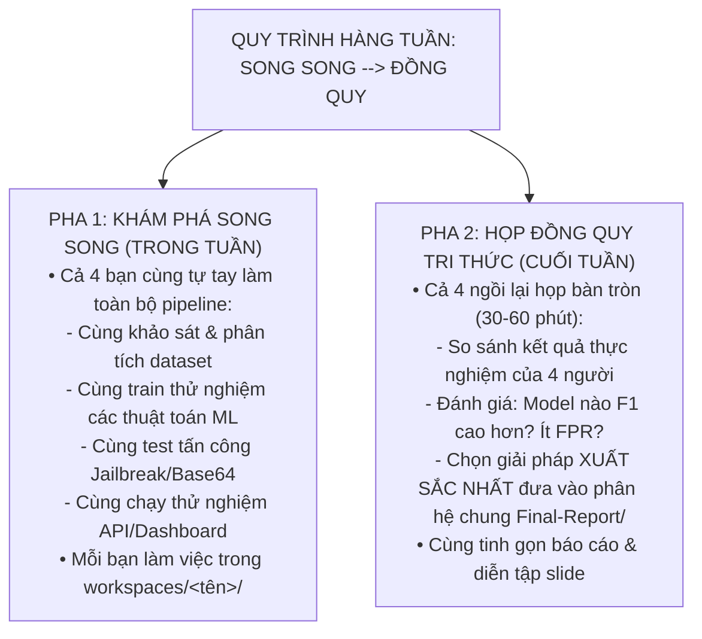

# QUY CHẾ LÀM VIỆC NHÓM 4 THÀNH VIÊN: "CẢ 4 CÙNG LÀM SONG SONG — HỌP ĐỒNG QUY TRI THỨC"
## Parallel Full-Pipeline Exploration & Knowledge Convergence Paradigm
### Căn cứ học thuật: **FPT IAP491 Capstone Guidelines & Rubrics Summary**

Trong đề tài **PI-Guard** (FPT University IAP491), nhóm áp dụng mô hình **Cả 4 cùng làm toàn diện (Full-Stack AI Security Collaboration)** để đảm bảo **ai cũng có kinh nghiệm thực chiến sâu sắc, không ai phải ngồi chờ ai, và tự tin bảo vệ trước Hội đồng**:

---

### 1. QUY TRÌNH 2 PHA HÀNG TUẦN (SPRINT WORKFLOW)



---

### 2. KẾ HOẠCH HÀNH ĐỘNG SONG SONG 4 THÀNH VIÊN THEO TỪNG CỘT MỐC (BÁM SÁT FPT IAP491)

> [!IMPORTANT]
> **QUY TẮC NGHIỆM THU ĐẦU RA (DELIVERABLE ACCEPTANCE RULE)**:
> - **Giai đoạn hiện tại (Review 1: Tuần 1–4)**: Phân hệ nghiệm thu chính thức **`Final-Report/`** **CHỈ BÁO CÁO CÁC SẢN PHẨM ĐÃ CÓ THỰC TẾ** (Hồ sơ chuyên đề, Luận văn dự thảo Chương 1-2, Slide báo cáo GVHD, Sổ tiến độ, 18 bài báo khoa học PDF, Khung cấu hình YAML tái lập và Khung thư mục Scaffolding).
> - **Mã nguồn, Notebooks và Test Scripts**: Hiện đang được cả 4 thành viên phát triển song song độc lập trong các sandbox cá nhân **`workspaces/<thành_viên>/`** và sẽ được Leader đồng quy tích hợp vào **`Final-Report/`** tại các cột mốc Review 2 và Hội Đồng Giữa Kỳ sau khi nghiệm thu.

| Cột Mốc Đánh Giá (FPT IAP491) | Trọng Số Điểm | Hoạt Động Song Song Của Cả 4 Thành Viên | Phiên Họp Tổng Kết & Đồng Quy Tri Thức | Sản Phẩm Đầu Ra Nghiệm Thu (Chỉ báo cáo các phần đã có thực tế) |
| :--- | :---: | :--- | :--- | :--- |
| **Sprint Tiền Đề**<br>*(29/08 – 06/09/2026)* | **Duyệt Đề Tài** | - Cả 4 cùng thảo luận ý tưởng, khảo sát các vụ tấn công prompt injection thực tế.<br>- Cùng họp thống nhất phương hướng với GVHD. | - Thống nhất phạm vi đề tài External Guardrail Proxy.<br>- Phân bổ không gian làm việc `workspaces/<thành_viên>/`. | **ĐÃ HOÀN TẤT TRONG REPO:**<br>- **`CAPSTONE PROJECT REGISTER.md`**<br>- **`Meeting 1, 2`** |
| **🎯 CỘT MỐC 1: REVIEW 1 (HIỆN TẠI)**<br>*(với GVHD — Tuần 1–4 / 07/09 – 04/10/2026)* | **35% Process**<br>(*Report 1: 10%*<br>*Report 2: 25%*) | - Cả 4 bạn cùng đọc 18 papers chuẩn IEEE/ACM/NeurIPS.<br>- Cùng phân tích các kỹ thuật tấn công thực tế (DAN, Base64, Leetspeak, Token Smuggling).<br>- Cùng thử nghiệm các prompt injection trong sandbox cá nhân.<br>- Soạn thảo dự thảo Chương 1 & Chương 2. | - Thống nhất mô hình đe dọa STRIDE & NIST AI 100-2e2025.<br>- Thống nhất 3 Câu hỏi nghiên cứu RQ1–RQ3 chuẩn IEEE.<br>- Phân vai thuyết trình 22 slide báo cáo GVHD ngày 10/09/2026.<br>- Leader nghiệm thu **Report No.1** (Intro) & **Report No.2** (Lit Review). | **ĐÃ HOÀN TẤT TRONG REPO:**<br>- **`Review1_Problem_Definition_and_Threat_Model.md`**<br>- **`FINAL_THESIS.md`** (Chương 1, 2 & References)<br>- **`01_Introduction.md`** & **`02_Literature_Review.md`**<br>- **`PI-GUARD-Present-109.pptx`** (Slide báo cáo GVHD ngày 10/09/2026)<br>- **`PI_GUARD_PROCESS_REPORT.xlsx`** (Sổ tiến độ IAP491)<br>- **`Meeting 1, 2, 3`** (Biên bản họp GVHD & nhóm)<br>- **`References/`** (18 PDF toàn văn & REFERENCES_LOG.md)<br>- **`notebooks/configs/`** (`data.yaml`, `evaluation.yaml`, `models.yaml`, `training.yaml`)<br>- Khung thư mục Scaffolding (`notebooks/`, `src/`, `tests/` kèm `.gitkeep`) |
| **🎯 CỘT MỐC 2: REVIEW 2**<br>*(với GVHD — Tuần 5–8 / 05/10 – 01/11/2026)* | **20% Process**<br>(*Report 3: 20%*) | - Cả 4 bạn cùng tải dataset HF (`deepset`, `Lakera`, `TrustAIRLab`).<br>- Cùng thử nghiệm thuật toán gom cụm Group-Aware Splitting (MinHash / Jaccard).<br>- Cùng huấn luyện mô hình Baseline (LinearSVC, LogisticRegression, XGBoost).<br>- Soạn thảo dự thảo Chương 3 (Methodology) trong workspace cá nhân. | - Đối sánh F1-score, Precision, Recall và FPR giữa các giải pháp của 4 bạn.<br>- Chọn pipeline Baseline tối ưu nhất đưa vào `Final-Report/src/models/baseline/`.<br>- Chốt dữ liệu chuẩn vào `Final-Report/notebooks/data/`.<br>- Nghiệm thu **Report No.3 (Methodology & Baseline ML)**; diễn tập bảo vệ Review 2 Tuần 8. | *(Kế hoạch nghiệm thu Review 2 — Đang chạy nháp trong workspaces cá nhân)*:<br>- `Final-Report/thesis/chapters/03_Methodology.md`<br>- `Final-Report/notebooks/01_dataset_analysis.ipynb`<br>- `Final-Report/notebooks/02_baseline.ipynb`<br>- `Final-Report/notebooks/data/manifests/`<br>- `Final-Report/src/datasets/` & `Final-Report/src/models/baseline/` |
| **🏛️ CỘT MỐC 3: HỘI ĐỒNG 1 / HỘI ĐỒNG GIỮA KỲ**<br>*(Tuần 9–13 / 02/11 – 06/12/2026)* | **25% Process**<br>(*Report 4: 25%*) | - Cả 4 cùng thử fine-tune `microsoft/deberta-v3-base`.<br>- Cùng thử các kỹ thuật nén lượng hóa INT8 ONNX Engine.<br>- Cùng viết payload lẩn tránh đối kháng (Base64, Leetspeak, Spacing) để chéo cánh kiểm thử độ bền (Robustness) của nhau.<br>- Cùng dựng prototype FastAPI và Streamlit Dashboard cục bộ. | - Chọn checkpoint mô hình có F1 cao nhất (> 0.95), độ trễ P95 < 15ms và kháng lẩn tránh tốt nhất.<br>- Leader đồng quy mã nguồn xuất sắc nhất vào `Final-Report/src/` và `Final-Report/tests/`.<br>- Nghiệm thu **Report No.4 (Experimental and Results)**; tổng duyệt slide và bảo vệ Hội đồng Giữa kỳ tại Tuần 13. | *(Kế hoạch nghiệm thu Hội đồng Giữa kỳ — Đang thử nghiệm trong workspaces)*:<br>- `Final-Report/thesis/chapters/04_Experimental_and_Results.md`<br>- `Final-Report/notebooks/03_transformer_training.ipynb`<br>- `Final-Report/notebooks/04_ablation.ipynb`<br>- `Final-Report/src/api/` & `Final-Report/src/dashboard/`<br>- `Final-Report/tests/adversarial/`<br>- Slide Thuyết trình Hội Đồng Giữa Kỳ (IAP491) |
| **🎓 CỘT MỐC 4: HỘI ĐỒNG FINAL / BẢO VỆ TỐT NGHIỆP**<br>*(Tuần 14–15 / 07/12 – 20/12/2026)* | **20% Process còn lại**<br>(*Report 5: 15%*<br>*Report 6: 5%*)<br>+ **50% Presentation** | - Cả 4 cùng rà soát toàn văn 6 chương luận văn.<br>- Cùng đặt các câu hỏi phản biện giả định của Hội đồng để diễn tập vấn đáp (Mock Defense).<br>- Cùng tối ưu hóa hiệu năng và kiểm thử tải cho toàn bộ hệ thống Guardrail Proxy. | - Chạy script biên dịch `compile_thesis.py` xuất bản toàn văn khóa luận.<br>- Quét trùng lặp Turnitin (< 20%).<br>- Nghiệm thu **Report No.5 (Discussion)** & **Report No.6 (Conclusion)**.<br>- Tổng duyệt slide bảo vệ tốt nghiệp chính thức trước Hội đồng chấm FPT. | *(Kế hoạch nghiệm thu Tốt nghiệp — Đóng gói cuối khóa)*:<br>- `Final-Report/thesis/FINAL_THESIS.md` (Hoàn chỉnh 6 chương và phụ lục PDF)<br>- `Final-Report/notebooks/05_error_analysis.ipynb`<br>- Gói Docker container triển khai Guardrail Proxy hoàn chỉnh<br>- Báo cáo kiểm định Turnitin chính thức (< 20%)<br>- Slide PPT & Buổi Bảo Vệ Tốt Nghiệp Chính Thức |

---

### 3. PHÂN CÔNG VAI TRÒ VÀ KHÔNG GIAN LÀM VIỆC CÁ NHÂN (`workspaces/<thành_viên>/`)

Mỗi thành viên làm việc độc lập trong thư mục sandbox được chỉ định, chịu trách nhiệm toàn trình cho module chuyên sâu và chủ trì phần báo cáo tương ứng theo chuẩn học thuật FPT IAP491:

| Thành Viên | MSSV | Trọng Tâm Chuyên Sâu | Vai Trò Chủ Trì Báo Cáo FPT (Continuous Assessment) | Workspace Cá Nhân |
| :--- | :--- | :--- | :--- | :--- |
| **Nguyễn Văn Trường (Leader)** | SE182034 | Data Engineering, Kiến trúc Guardrail, Quản trị Repository & Đồng quy Tri thức | Chủ trì **Report No.1** (Intro) & **Report No.2** (Lit Review); Tổng duyệt toàn văn Luận văn & Điều phối Bảo vệ | **`workspaces/truongnv/`** |
| **Nguyễn Quí Đức** | SE182087 | Classical ML Baseline (TF-IDF Word/Char), Trích xuất đặc trưng & Bề mặt tấn công | Phản biện Threat Model & Chủ trì **Report No.3** (Methodology & Baseline ML) | **`workspaces/ducnq/`** |
| **Phạm Minh Hoàng Việt** | SE181851 | Transformer DeBERTa-v3 Fine-tuning, Lượng hóa INT8 ONNX & Evasion Robustness | Phản biện Deep Learning & Chủ trì **Report No.4** (Experimental and Results) | **`workspaces/vietpmh/`** |
| **Đỗ Đoàn Duy Phương** | SE180235 | FastAPI Guardrail Middleware Proxy, Streamlit Dashboard & Kịch bản Demo | Phản biện Attack Taxonomy & Chủ trì **Report No.5** (Discussion) & **Report No.6** (Conclusion and Future Work) | **`workspaces/phuongddd/`** |

---

### 4. QUY TẮC PHÂN QUYỀN WORKSPACE & KIỂM TOÁN TỰ ĐỘNG

1. **Ranh giới bất biến đối với Thành viên (Đức, Việt, Phương)**:
   - Các thành viên **CHỈ ĐƯỢC PHÉP** tạo, sửa đổi và commit các file bên trong thư mục sandbox cá nhân (`workspaces/<tên_thành_viên>/`).
   - Tuyệt đối không chỉnh sửa trực tiếp các file chung ngoài `workspaces/` (như `Final-Report/`, `Github-Page/`, `.agents/`).
2. **Quyền độc quyền đồng quy của Trưởng nhóm (Leader: `nvtruongops`)**:
   - Trưởng nhóm là người duy nhất có quyền chọn lọc các module xuất sắc nhất từ `workspaces/` của 4 bạn để merge vào cây thư mục chính thức `Final-Report/` trong các buổi họp cuối tuần.
3. **Các file bất biến tuyệt đối (Read-Only cho TẤT CẢ thành viên)**:
   - **`CAPSTONE PROJECT REGISTER.md`** (Phiếu đăng ký đề tài đã ký duyệt của Nhà trường).
   - Nghiêm cấm mọi hành vi sửa đổi, ghi đè, xóa hoặc sao chép ra các thư mục công khai đối với các tài nguyên này.


---

### 5. QUY TRÌNH KIỂM ĐỊNH CHẤT LƯỢNG THUẦN CỤC BỘ (LOCAL-FIRST QA)

Toàn bộ quy trình kiểm định chất lượng được thực hiện trên máy local thông qua bộ công cụ **`Final-Report/scripts/validate_local.py`**:

1. **Cài đặt Git Pre-commit Hook (Bắt buộc cho cả 4 bạn)**:
   ```bash
   python Final-Report/scripts/validate_local.py --install-hook
   ```
   *Tác dụng*: Tự động chặn commit vi phạm ranh giới workspace hoặc lỗi cú pháp ngay tại máy trạm.

2. **Chạy kiểm định nhanh trước khi commit**:
   ```bash
   python Final-Report/scripts/validate_local.py
   ```
   *Kiểm tra*: Ranh giới workspace, JSON manifests, Ruff linting (hoàn tất trong ~1 giây).

3. **Chạy kiểm định toàn diện 100% trước buổi họp Đồng Quy Tri Thức**:
   ```bash
   python Final-Report/scripts/validate_local.py --all
   ```
   *Kiểm tra*: Ranh giới workspace, JSON manifests, Linting, Pytest test suites và biên dịch cổng tài liệu MkDocs.

4. **Biên dịch và duyệt Cổng Tài Liệu Web UI**:
   ```bash
   python Final-Report/scripts/build_docs_portal.py
   mkdocs serve
   ```
   *Xem bản xuất bản trực tuyến chính thức tại*: [https://nvtruongops.github.io/pi-guard/](https://nvtruongops.github.io/pi-guard/).