# PI-Guard: LLM Security Guardrail
## Hệ Thống 8 Chuyên Đề Nghiên Cứu Khoa Học & Báo Cáo Khóa Luận

> **Đồ án Khóa luận Tốt nghiệp Đại học FPT** — Chuyên ngành An toàn Thông tin (IA) 
> **Mã đề tài**: `IAP491_FA26_PI_GUARD` | **Học kỳ**: Fall 2026 
> **Chủ đề**: A Machine-Learning Guardrail for Detecting Prompt Injection and Jailbreak Attacks on LLM Applications

---

## Giới Thiệu & Mục Tiêu Đề Tài

**PI-Guard** là hệ thống bảo vệ (guardrail) độc lập đặt trước các ứng dụng mô hình ngôn ngữ lớn (LLM), hoạt động theo cơ chế **hai tầng bảo vệ (Two-Tier Cascade Architecture)**:

1. **Tier 1 (Bộ lọc Cú pháp - Syntactic Baseline)**: Sử dụng phương pháp vector hóa TF-IDF kết hợp mô hình phân loại tuyến tính siêu nhẹ (Linear Classifier) nhằm nhận diện các mẫu prompt injection phổ biến với độ trễ cực thấp (**P95 < 1.0 ms**).
2. **Tier 2 (Bộ lọc Ngữ nghĩa Sâu - Semantic Transformer)**: Sử dụng Transformer tiên tiến (**DeBERTa-v3**) với cơ chế Disentangled Attention, được lượng hóa sau huấn luyện qua **ONNX Runtime INT8** nhằm phát hiện các biến thể tấn công tinh vi, jailbreak ẩn ngữ cảnh với độ trễ mục tiêu **P95 < 25 ms**.

---

## Kiến Trúc Luồng Phòng Thủ Hai Tầng (Two-Tier Cascade)

```mermaid
flowchart TD
    subgraph Ingress["1. Ingress & Preprocessing"]
        UserPrompt(["User Prompt (x)"]) --> P1["Tiền xử lý & Chuẩn hóa Unicode NFKC"]
    end

    subgraph Tier1["2. Tier 1: Syntactic Baseline (TF-IDF)"]
        P1 --> T1{"TF-IDF Syntactic Classifier"}
        T1 -- "Nguy hiểm (Score >= 0.85)" --> Block1["Chặn sớm (P95 < 1ms)"]
        T1 -- "Lành tính tin cậy (Score <= 0.15)" --> Pass1["Fast Pass trực tiếp tới LLM"]
    end

    subgraph Tier2["3. Tier 2: Semantic Transformer (DeBERTa-v3 INT8)"]
        T1 -- "Vùng nghi vấn (0.15 < Score < 0.85)" --> T2{"DeBERTa-v3 ONNX Runtime"}
        T2 -- "Phát hiện Injection / Jailbreak" --> Block2["Chặn tấn công ngữ nghĩa"]
        T2 -- "Độ tin cậy lành tính cao" --> Pass2["Chấp thuận cho phép"]
    end

    subgraph TargetLLM["4. Downstream Application"]
        Pass1 --> LLM["Target Downstream LLM"]
        Pass2 --> LLM
        LLM --> OutFilter["Output Guardrail & Filter"]
        OutFilter --> SafeResponse(["Phản hồi an toàn đến người dùng"])
    end

    style Block1 fill:#c62828,color:#fff,stroke:#b71c1c,stroke-width:1.5px;
    style Block2 fill:#c62828,color:#fff,stroke:#b71c1c,stroke-width:1.5px;
    style Pass1 fill:#2e7d32,color:#fff,stroke:#1b5e20,stroke-width:1.5px;
    style Pass2 fill:#2e7d32,color:#fff,stroke:#1b5e20,stroke-width:1.5px;
    style T1 fill:#1565c0,color:#fff,stroke:#0d47a1,stroke-width:1.5px;
    style T2 fill:#4527a0,color:#fff,stroke:#311b92,stroke-width:1.5px;
    style LLM fill:#37474f,color:#fff,stroke:#263238,stroke-width:1.5px;
```

---

## Hệ Thống 8 Chuyên Đề Nghiên Cứu Khoa Học Trọng Điểm

| Chuyên Đề Khoa Học | Trọng Tâm Nghiên Cứu | Đường Dẫn Tra Cứu |
| :--- | :--- | :--- |
| **1. Prompt Study** | Bản chất LLM, Attention, Ranh giới phẳng và Thất bại Phân cấp Chỉ thị (Instruction Hierarchy) | [Xem Prompt Study](prompt_study/llm_foundations.md) |
| **2. Attack Study** | Phân loại toàn diện Prompt Injection & 4 trường phái Jailbreak (DAN, Roleplay, VM, Cipher) | [Xem Attack Study](attacks/history_and_evolution.md) |
| **3. Threat & Defense** | Mô hình hóa đe dọa NIST AI 100-2e2025, STRIDE, Kiến trúc phòng thủ đa tầng (Defense-in-Depth) | [Xem Threat & Defense](threat_defense/threat_model_and_attack_surface.md) |
| **4. Dataset & Benchmark** | Tuyển chọn dữ liệu 3 lớp, Khử trùng lặp MinHash, Group-Aware Splitting & Đánh giá OOD | [Xem Dataset Study](dataset_study/data_curation.md) |
| **5. Model Study** | Toán học TF-IDF, Transformer DeBERTa-v3 Disentangled Attention & Định tuyến bất định 2 tầng | [Xem Model Study](models/two_tier_architecture.md) |
| **6. Robustness Study** | Chống chịu kỹ thuật làm mờ (Leetspeak, Homoglyphs, Base64) & Tiền xử lý chuẩn hóa 4 bước | [Xem Robustness Study](robustness/theory_and_evasion_mechanisms.md) |
| **7. Optimization Study** | Lý thuyết lượng tử hóa INT8 PTQ, Tăng tốc ONNX Runtime Graph & Phân vị độ trễ P95/P99 | [Xem Optimization Study](optimization/quantization_math.md) |
| **8. Evaluation & Trade-offs** | Kinh tế học cảnh báo sai (FPR Economics), Điểm hoạt động Recall@FPR1% & Đường cong biên Pareto | [Xem Evaluation Study](evaluation_study/false_positive_economics.md) |

---

## Đội Ngũ Thực Hiện Đề Tài

> **Phương châm làm việc toàn đội**: **Ai cũng làm $
ightarrow$ Tham khảo nhau $
ightarrow$ Chốt kết quả**  
> Cả 4 thành viên đều trực tiếp thực hiện toàn trình (Full-Pipeline Hands-on) từ tiền xử lý dữ liệu, thử nghiệm Baseline ML, huấn luyện Transformer, đo đạc độ bền Evasion đến tích hợp API/Dashboard và bảo vệ Luận văn.

| STT | Thành Viên | Mã Sinh Viên | Khám Phá Toàn Trình & Đầu Mối Điều Phối |
| :---: | :--- | :--- :---: | :--- |
| 1 | **Nguyễn Văn Trường (Leader)** | `SE182034` | **Toàn trình Full-Pipeline** — Điều phối chung, Chuẩn hóa dữ liệu & Kiến trúc |
| 2 | **Nguyễn Quí Đức** | `SE182087` | **Toàn trình Full-Pipeline** — Đối sánh mô hình Baseline ML & Threat Model |
| 3 | **Phạm Minh Hoàng Việt** | `SE181851` | **Toàn trình Full-Pipeline** — Tối ưu Transformer & Thực nghiệm Robustness |
| 4 | **Đỗ Đoàn Duy Phương** | `SE180235` | **Toàn trình Full-Pipeline** — Tích hợp hệ thống API/Dashboard & Luận văn |

**Giảng viên hướng dẫn**: ThS. Trần Văn Ninh — Đại học FPT.
