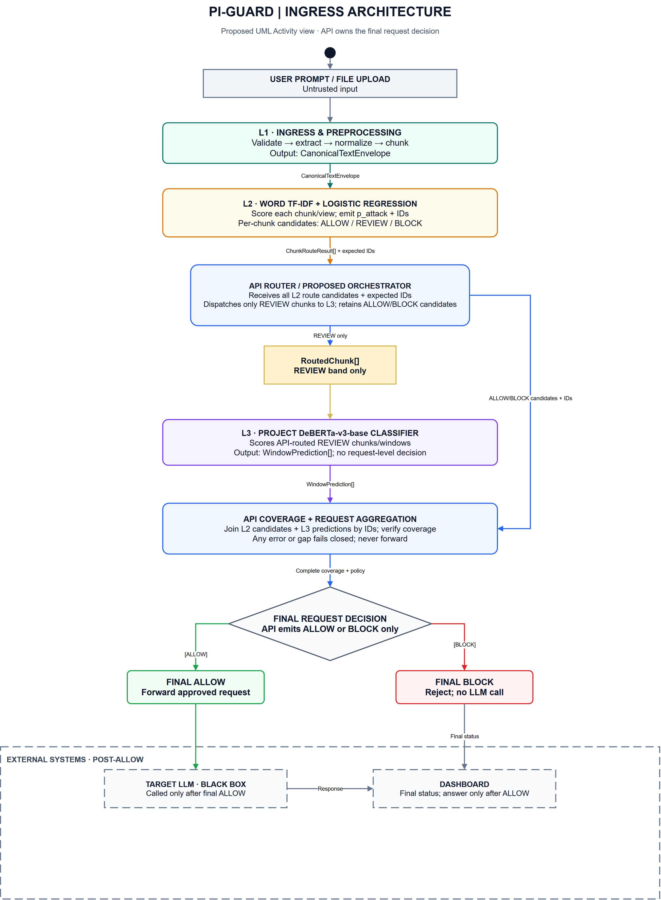

# Proposed PI-Guard ingress architecture

This is the vertical-summary export from page 2 of the canonical eight-page [Draw.io source](https://github.com/nvtruongops/pi-guard/blob/main/Final-Report/PI_GUARD_INGRESS_ARCHITECTURE.drawio). The corresponding standalone PNG is [PI_GUARD_INGRESS_ARCHITECTURE.png](https://github.com/nvtruongops/pi-guard/blob/main/Final-Report/PI_GUARD_INGRESS_ARCHITECTURE.png).

This diagram summarizes the Review 1 architecture proposal. It is not evidence that an end-to-end service has been integrated or accepted.

## Request flow

1. L1 validates input, normalizes text, creates bounded chunks/views, and preserves their IDs and source references.
2. L2 uses a TF-IDF + Logistic Regression scorer to emit one per-chunk route candidate: ALLOW, REVIEW, or BLOCK.
3. The API sends only REVIEW chunks to L3 DeBERTa.
4. API aggregation joins L2 candidates and L3 predictions by IDs and checks complete coverage. Only this stage emits final request-level ALLOW or BLOCK; incomplete coverage fails closed.
5. The target LLM is called only after final request ALLOW.

An L2 ALLOW or BLOCK is a chunk-level candidate, not a final request decision. REVIEW is an internal route to L3, not a user-facing or final API decision.

## Current evidence boundary

As of 4 October 2026, the Review 2 umbrella task remains open. The completed seed-42 cascade experiment used one pinned PIDS-Bench split. Its report records held-out attack F1 of 98.89% on the IID test slice (n=3,918), hard-benign FPR of 43.94% (n=808), structural-OOD benign FPR of 79.68% (796/999), and model-only P95 of 155.03 ms on the measured RTX 3060 laptop workload. The hard-benign and structural-OOD false-positive rates remain high, and the measured timing is not end-to-end service latency.

The experiment report and raw provenance remain in the active lead workspace; the portal summary is not a replacement for those artifacts.

## Background reading

- [TF-IDF theory](tfidf_theory_and_math.md)
- [DeBERTa theory](deberta_theory_and_math.md)
- [Earlier two-stage model discussion](two_tier_tradeoffs.md)

The earlier theory pages are background material; the current diagram remains a proposal rather than evidence of an integrated service.
