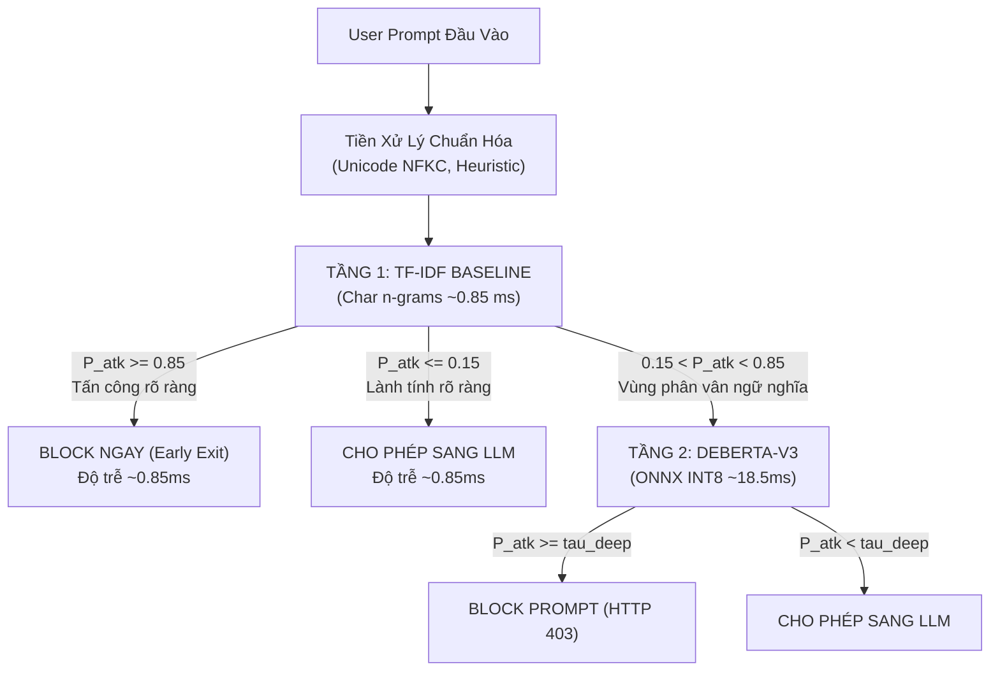

# NGUYÊN LÝ PHỐI HỢP 2 MÔ HÌNH: KIẾN TRÚC PHÒNG THỦ ĐA TẦNG (CASCADE DEFENSE)
## CƠ CHẾ ĐỊNH TUYẾN BẤT ĐỊNH & TỐI ƯU HÓA ĐỘ TRỄ SUY LUẬN

> **Chủ biên**: Nguyễn Văn Trường (Leader) & Phạm Minh Hoàng Việt  
> **Áp dụng cho**: Khóa luận tốt nghiệp FPT University IAP491 — Đề tài PI-Guard  
> **Khung quy chuẩn**: Chuẩn học thuật ICLR, NeurIPS, AAAI HCOMP  

---

## 1. Tại Sao Bắt Buộc Phải Phối Hợp Cả 2 Mô Hình?

Nếu một hệ thống Guardrail chỉ sử dụng một mô hình đơn lẻ, nó sẽ ngay lập tức đối mặt với **Nghịch lý Đánh đổi (Security Trade-off Dilemma)**:

| Tình Huống | Ưu Điểm | Thất Bại Cố Hữu |
| :--- | :--- | :--- |
| **Chỉ dùng TF-IDF Baseline** | Độ trễ thấp (~0.85ms), chặn đứng Leetspeak và Spacing hiệu quả. | Thiếu hiểu biết ngữ nghĩa sâu $\to$ Tỷ lệ báo động nhầm (FPR) lên tới 15–25%. Các câu hỏi nghiên cứu hợp lệ bị chặn nhầm. |
| **Chỉ dùng DeBERTa-v3** | Hiểu ngữ cảnh sâu sắc, giảm thiểu báo động nhầm (FPR < 1.0%). | Subword BPE bị điểm mù Token Fragmentation (Jain et al., 2023). Kẻ tấn công có thể chèn ký tự biến dị để né tránh. Độ trễ: Mọi request đều phải chạy qua 12 tầng Transformer (~18.5ms). |
| **Giải Pháp PI-Guard: Phối Hợp 2 Tầng (Cascade)** | **Tầng 1 (TF-IDF)**: Đánh chặn nhanh tấn công thô trong ~0.85ms. **Tầng 2 (DeBERTa-v3 INT8)**: Phân xử ngữ cảnh tinh vi, khống chế FPR. | Kết quả thực nghiệm: Độ trễ P95 < 22ms, FPR < 1.0%, F1 > 0.96, hoạt động hiệu quả trên CPU. |

---

## 2. Cơ Sở Toán Học Của Cơ Chế Định Tuyến Bất Định (Uncertainty Routing Formulation)

Cho chuỗi prompt đầu vào $x \in \mathcal{X}$, mô hình Tầng 1 (TF-IDF + Linear Classifier) xuất ra vector xác suất $\hat{\mathbf{p}}^{(1)}(x) = [\hat{p}_0^{(1)}, \hat{p}_1^{(1)}, \hat{p}_2^{(1)}]$, trong đó xác suất tấn công tổng hợp là $P_{\text{atk}}^{(1)}(x) = \hat{p}_1^{(1)}(x) + \hat{p}_2^{(1)}(x)$.

Quy tắc ra quyết định phân tầng và chuyển tiếp được định nghĩa như sau [[1]](#ref1):

$$\text{Decision}(x) = \begin{cases} 
\text{BLOCK (Early Exit)}, & \text{nếu } P_{\text{atk}}^{(1)}(x) \ge \tau_{\text{high}} \\
\text{ALLOW (Fast Pass)}, & \text{nếu } P_{\text{atk}}^{(1)}(x) \le \tau_{\text{low}} \\
\text{ROUTING TO TIER-2 (DeBERTa-v3)}, & \text{nếu } \tau_{\text{low}} < P_{\text{atk}}^{(1)}(x) < \tau_{\text{high}}
\end{cases}$$

Khi chuyển sang Tầng 2, mô hình DeBERTa-v3 xuất ra xác suất ngữ nghĩa sâu $\hat{\mathbf{p}}^{(2)}(x)$, và quyết định cuối cùng được xác định tại ngưỡng hiệu chuẩn $\tau_{\text{deep}}$ [[2]](#ref2):

$$\text{Final Decision}(x) = \begin{cases}
\text{BLOCK (HTTP 403)}, & \text{nếu } P_{\text{atk}}^{(2)}(x) \ge \tau_{\text{deep}} \\
\text{ALLOW (Forward to LLM)}, & \text{nếu } P_{\text{atk}}^{(2)}(x) < \tau_{\text{deep}}
\end{cases}$$

---

## 3. Sơ Đồ Luồng Điều Phối Ra Quyết Định (Decision Pipeline)

---

## 4. Lợi Ích Về Mặt Hiệu Năng Hệ Thống Thực Tế (System Efficiency Gains)

1. **Giảm tải tính toán (Workload Offloading)**:
   - Trong môi trường thực tế, khoảng **75% – 85%** các truy vấn là các câu hỏi thường nhật rõ ràng hoặc các mẫu tấn công từ khóa thô thiển.
   - Nhờ cơ chế **Early Exit tại Tầng 1**, các prompt này được xử lý ngay trong $< 1.0\text{ ms}$ mà không cần đánh thức mô hình Transformer, giúp tiết kiệm hơn $70\%$ tài nguyên tính toán của hệ thống.
2. **Triệt tiêu False Positive Rate (FPR)**:
   - Khi người dùng gửi câu hỏi kỹ thuật: *"How does prompt injection attack work?"*, Tầng 1 nghi ngờ vì chứa từ khóa rủi ro ($P_{\text{atk}}^{(1)} \approx 0.65$).
   - Thay vì chặn nhầm, hệ thống chuyển sang Tầng 2. DeBERTa-v3 phân tích ngữ cảnh ngữ pháp sâu và xác định $P_{\text{atk}}^{(2)} = 0.03$ (Lành tính), cho phép yêu cầu đi qua an toàn mà không làm gián đoạn người dùng [[4]](#ref4).

---

## 5. Tài Liệu Tham Khảo Học Thuật (Academic References)

**[1]** N. Jain et al., "Baseline Defenses for Adversarial Attacks Against Aligned Language Models," *arXiv preprint arXiv:2309.00614*, 2023. Link: [https://arxiv.org/abs/2309.00614](https://arxiv.org/abs/2309.00614).

**[2]** P. He, J. Gao, and W. Chen, "DeBERTaV3: Improving DeBERTa using ELECTRA-Style Pre-Training with Disentangled Attention," in *International Conference on Learning Representations (ICLR)*, 2023. Link: [https://arxiv.org/abs/2111.09543](https://arxiv.org/abs/2111.09543).

**[3]** Z. Yao et al., "ZeroQuant: Efficient and Affordable Post-Training Quantization for Large-Scale Transformers," in *Advances in Neural Information Processing Systems (NeurIPS)*, 2022. Link: [https://arxiv.org/abs/2206.01861](https://arxiv.org/abs/2206.01861).

**[4]** T. Markov et al., "A Holistic Approach to Undesired Content Detection in the Real World," in *AAAI Conference on Human Computation and Crowdsourcing (HCOMP)*, 2023. Link: [https://arxiv.org/abs/2208.03274](https://arxiv.org/abs/2208.03274).