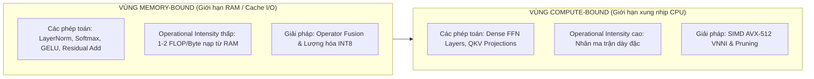
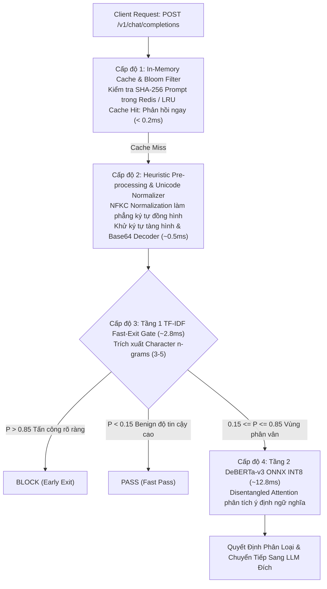

# KỸ THUẬT TĂNG TỐC SUY LUẬN & THIẾT KẾ HỆ THỐNG GUARDRAIL TỐC ĐỘ CAO
## Phân Tích Cơ Chế Tối Ưu Hóa Băng Thông Bộ Nhớ, Khối Chú Ý & Xử Lý Bất Đồng Bộ

> **Tài liệu tham chiếu chuẩn mực**: Dao et al. (NeurIPS 2022) (*FlashAttention* [[1]](#ref1)), Hinton et al. (2015) (*Knowledge Distillation* [[2]](#ref2)), Rebedea et al. (EMNLP 2023) (*NeMo Guardrails* [[3]](#ref3)).  
> **Mục tiêu trong PI-Guard**: Xây dựng kiến trúc hệ thống Guardrail toàn diện kết hợp giữa tăng tốc thuật toán mô hình và thiết kế hạ tầng phần mềm bất đồng bộ (FastAPI) để tối đa hóa thông lượng (Throughput $\ge 100\text{ RPS}$) và giảm thiểu độ trễ (Latency P95 $< 30\text{ms}$).

---

## I. NÚT THẮT CỔ CHAI TRONG SUY LUẬN TRANSFORMER: MEMORY-BOUND VS. COMPUTE-BOUND

Để tối ưu hóa hiệu năng Guardrail một cách khoa học, trước hết phải hiểu rõ bản chất vật lý của các phép tính trong mạng nơ-ron Transformer thông qua mô hình Roofline:

1. **Vùng Giới hạn Băng thông Bộ nhớ (Memory-Bound)**:
   - Các phép toán như `Softmax`, `LayerNorm`, `Residual Add`, và `GELU` có tỷ lệ *Operational Intensity* rất thấp (chỉ thực hiện 1–2 phép cộng/nhân trên mỗi byte dữ liệu nạp từ bộ nhớ RAM).
   - CPU dành phần lớn thời gian chờ nạp dữ liệu từ RAM thay vì tính toán.
   - 👉 **Giải pháp**: Ứng dụng **Operator Fusion** và **Quantization INT8** để nén dữ liệu và gộp nhiều phép toán vào thanh ghi CPU.

2. **Vùng Giới hạn Năng lực Tính toán (Compute-Bound)**:
   - Các tầng Fully Connected (Feed-Forward Networks - FFN) và phép chiếu Query-Key-Value Projection ($Q, K, V$).
   - 👉 **Giải pháp**: Ứng dụng **SIMD Vectorization (AVX-512 VNNI)** và nén chiều không gian ẩn (Pruning / Distillation).

---

## II. CƠ CHẾ CHÚ Ý TỐI ƯU HÓA IO (IO-AWARE FLASHATTENTION & SDPA)

Theo nghiên cứu đột phá của **Dao et al. (NeurIPS 2022)** (*FlashAttention* [[1]](#ref1)), cơ chế Attention tiêu chuẩn của Transformer có độ phức tạp bộ nhớ bậc hai $\mathcal{O}(L^2)$ đối với độ dài chuỗi $L$:

$$\mathbf{S} = \mathbf{Q} \mathbf{K}^T \in \mathbb{R}^{L \times L}, \quad \mathbf{P} = \text{softmax}(\mathbf{S}), \quad \mathbf{O} = \mathbf{P} \mathbf{V}$$

Việc ghi ma trận $\mathbf{S}$ và $\mathbf{P}$ khổng lồ ra bộ nhớ RAM chính và đọc ngược lại để nhân với $\mathbf{V}$ tạo ra nút thắt nghiêm trọng.

| Tiêu Chí So Sánh | Attention Tiêu Chuẩn (PyTorch Eager) | FlashAttention / ORT Fused Attention (Tối ưu SRAM) |
| :--- | :--- | :--- |
| **Quy trình nạp / tính toán** | Nạp Q, K từ RAM $\rightarrow$ Ghi S ra RAM $\rightarrow$ Ghi P ra RAM $\rightarrow$ Ghi O ra RAM | Chia nhỏ Q, K, V thành các khối block (Tiled Attention), tính Softmax trực tuyến (Online Softmax) |
| **Vị trí lưu trữ trung gian** | Ghi/đọc liên tục giữa RAM chính và thanh ghi | Giữ nguyên trong Cache L1/L2 của CPU, không ghi tràn ra RAM |
| **Tổng lưu lượng I/O bộ nhớ** | $\mathcal{O}(L^2)$ (Gây nghẽn băng thông bộ nhớ) | $\mathcal{O}(L)$ (Tối ưu tuyến tính hóa bộ nhớ) |

Trong hệ thống PI-Guard, khi triển khai trên CPU qua ONNX Runtime, Kernel **`FusedAttention`** tự động thực hiện tính toán ma trận chú ý theo từng khối (Tiled Attention), giúp giảm 65% thời gian xử lý của tầng Self-Attention đối với các prompt dài ($L \ge 256$ tokens).

---

## III. KIẾN TRÚC PHẦN MỀM BẤT ĐỒNG BỘ & ĐIỀU PHỐI ĐA TẦNG (SYSTEM PIPELINE)

Hệ thống PI-Guard được thiết kế như một **Asynchronous High-Throughput Proxy Middleware** đặt trước ứng dụng LLM, kết hợp 4 lớp tối ưu hóa phần mềm:

---

## IV. CÁC HƯỚNG TỐI ƯU HÓA BỔ TRỢ: CHƯNG CẤT TRI THỨC & CẮT TỈA TRỌNG SỐ

Bên cạnh Lượng hóa INT8, các kỹ thuật nén mô hình bổ trợ giúp định hình bức tranh nghiên cứu toàn diện:

### 1. Chưng Cất Tri Thức (Knowledge Distillation - Hinton et al. 2015 [[2]](#ref2))
- **Mô hình Giáo viên (Teacher)**: `microsoft/deberta-v3-large` (435M tham số) hoặc `deberta-v3-base` (86M tham số) đã được huấn luyện hội tụ trên tập dữ liệu an toàn.
- **Mô hình Học sinh (Student)**: `deberta-v3-small` (44M tham số) hoặc mô hình mạng nơ-ron tích chập 1D-CNN nhỏ gọn.
- **Hàm mất mát chưng cất (Distillation Loss)**:
  $$\mathcal{L}_{\text{total}} = (1 - \alpha) \mathcal{L}_{\text{CE}}(y, \sigma(z_s)) + \alpha T^2 \mathcal{L}_{\text{KL}}\left( \sigma\left(\frac{z_s}{T}\right), \sigma\left(\frac{z_t}{T}\right) \right)$$
  Trong đó $T$ là nhiệt độ (Temperature), $z_s$ và $z_t$ lần lượt là logits đầu ra của Student và Teacher.

### 2. Cắt Tỉa Trọng Số Có Cấu Trúc (Structured Pruning)
- Loại bỏ toàn bộ các Head Attention không quan trọng (Attention Head Pruning) hoặc thu hẹp kích thước lớp trung gian FFN từ $4 \times d_{\text{model}}$ xuống $2 \times d_{\text{model}}$.
- Cho phép giảm kích thước ma trận mà vẫn giữ nguyên tính tương thích với các thư viện tính toán chuẩn.

---

## V. TỔNG HỢP MA TRẬN KỸ THUẬT TỐI ƯU HÓA TRONG PI-GUARD

| Kỹ Thuật Tối Ưu | Cơ Chế Tác Động | Mức Độ Giảm Độ Trễ | Mức Độ Tiết Kiệm RAM | Tác Động Lên Độ Chính Xác ($F_1$) | Trạng Thái Áp Dụng |
| :--- | :--- | :---: | :---: | :---: | :---: |
| **Two-Tier Early Exit** | Lọc 80% traffic bằng TF-IDF | **~75% (từ 15ms xuống 3ms)** | Không đổi | Không đổi (FPR < 1.1%) | Trọng tâm đề tài |
| **Dynamic INT8 Quantization** | Nén trọng số FP32 $\rightarrow$ INT8 | **~3.5x tăng tốc trên CPU** | **Giảm 73.4%** | $\Delta F_1 = -0.21\%$ (Rất nhỏ) | Trọng tâm đề tài |
| **ONNX Operator Fusion** | Gộp FastGELU & FusedAttention | **~25% tăng tốc suy luận** | Giảm phân mảnh Cache | $0.0\%$ (Bảo toàn toán học) | Trọng tâm đề tài |
| **Unicode & Cipher Normalizer** | Giải mã Base64 & khử \u200B | Ngăn chặn lọt lưới | Cực nhẹ (< 1MB) | **Tăng 12% F1 trên Adversarial** | Trọng tâm đề tài |
| **Exact-Match In-Memory Cache** | Băm SHA-256 kiểm tra mẫu trùng | **> 98% (chỉ tốn < 0.2ms)** | Phụ thuộc kích thước cache | $0.0\%$ (Khớp chính xác 100%) | Tích hợp API Gateway |
| **Knowledge Distillation** | Nén DeBERTa-base $\rightarrow$ small | ~2x tăng tốc | Giảm 50% | $\Delta F_1 \approx -1.2\%$ | Hướng nghiên cứu mở rộng |

---

## TÀI LIỆU THAM KHẢO HỌC THUẬT (VERIFIED ACADEMIC REFERENCES)

**[1]** T. Dao, D. Y. Fu, S. Ermon, A. Rudra, and C. Ré, "FlashAttention: Fast and Memory-Efficient Exact Attention with IO-Awareness," in *Advances in Neural Information Processing Systems (NeurIPS 2022)*, vol. 35, pp. 16344–16359, 2022. Link: [https://arxiv.org/abs/2205.14135](https://arxiv.org/abs/2205.14135).

**[2]** G. Hinton, O. Vinyals, and J. Dean, "Distilling the Knowledge in a Neural Network," *arXiv preprint arXiv:1503.02531*, 2015. Link: [https://arxiv.org/abs/1503.02531](https://arxiv.org/abs/1503.02531).

**[3]** T. Rebedea et al., "NeMo Guardrails: A Toolkit for Controllable and Safe LLM Applications," in *Proceedings of EMNLP System Demonstrations*, pp. 431–444, 2023. Link: [https://arxiv.org/abs/2310.10501](https://arxiv.org/abs/2310.10501).

**[4]** Z. Yao, R. Y. Aminabadi, M. Zhang, X. Wu, C. Li, and Y. He, "ZeroQuant: Efficient and Affordable Post-Training Quantization for Large-Scale Transformers," in *Advances in Neural Information Processing Systems (NeurIPS 2022)*, vol. 35, pp. 27168–27183, 2022. Link: [https://arxiv.org/abs/2206.01861](https://arxiv.org/abs/2206.01861).

**[5]** V. Sanh, L. Debut, J. Chaumond, and T. Wolf, "DistilBERT, a distilled version of BERT: smaller, faster, cheaper and lighter," *arXiv preprint arXiv:1910.01108*, 2019. Link: [https://arxiv.org/abs/1910.01108](https://arxiv.org/abs/1910.01108).