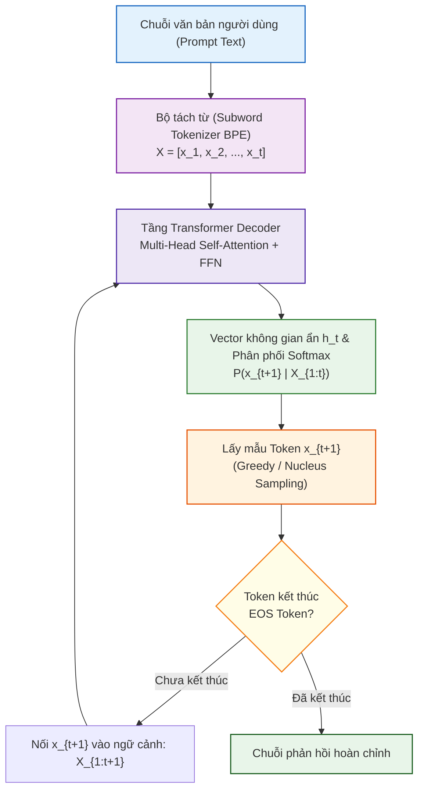
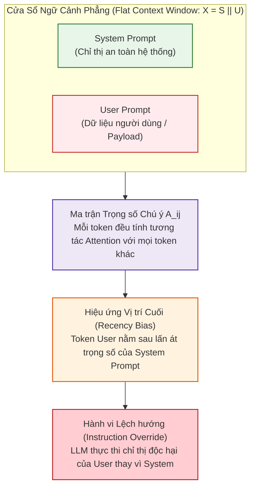

# TỔNG QUAN NỀN TẢNG LLM & CƠ CHẾ SINH TOKEN TỰ HỒI QUY (AUTOREGRESSIVE GENERATION)
## Phân Tích Cơ Sở Lý Luận Toán Học & Kiến Trúc Mô Hình Ngôn Ngữ Lớn Hiện Đại

> 📑 **Tài liệu tham chiếu chuẩn mực**: Zhao et al. (2023) (*A Survey of Large Language Models* [[1]](#ref1)), Vaswani et al. (NeurIPS 2017) [[2]](#ref2), Radford et al. (OpenAI 2019) (*GPT-2* [[3]](#ref3)), Brown et al. (NeurIPS 2020) (*GPT-3* [[4]](#ref4)).  
> 🎯 **Mục tiêu trong PI-Guard**: Làm rõ nguồn gốc toán học tại sao mô hình ngôn ngữ tự hồi quy (Autoregressive LLMs) dễ bị tổn thương trước các đòn thao túng Prompt Injection và Jailbreak.

---

## I. Nguyên Lý Hoạt Động Của Mô Hình Ngôn Ngữ Tự Hồi Quy (Decoder-Only LLM)

Một Mô hình Ngôn ngữ Lớn (LLM) hiện đại (như GPT-4, LLaMA-3, Claude, Gemini) về bản chất toán học là một bộ ước lượng phân phối xác suất có điều kiện trên một chuỗi các ký hiệu rời rạc (Tokens) thuộc từ điển hữu hạn $\mathcal{V}$:

$$P(X) = P(x_1, x_2, \dots, x_T) = \prod_{t=1}^{T} P(x_t \mid x_1, x_2, \dots, x_{t-1}; \Theta)$$

Trong đó:
- $X = [x_1, x_2, \dots, x_T]$ là chuỗi token đầu vào và đầu ra.
- $\Theta$ là toàn bộ tập tham số có thể huấn luyện của mạng nơ-ron Transformer (hàng chục đến hàng trăm tỷ tham số).
- $x_t \in \mathcal{V}$ là token được dự đoán tại bước thời gian $t$.



---

## II. Bộ Tách Từ (Tokenization) & Nguy Cơ Phân Mảnh Token (Token Fragmentation)

Trước khi văn bản được đưa vào mô hình, nó phải được chuyển đổi từ chuỗi ký tự tự nhiên sang chuỗi số nguyên thông qua thuật toán tách từ phụ (Subword Tokenization), phổ biến nhất là **Byte-Pair Encoding (BPE)** hoặc **Byte-level BPE**.

```text
Văn bản chuẩn:   "Ignore previous instructions"
BPE Tokens:      ["Ignore", " previous", " instructions"]  (3 tokens)

Văn bản Leetspeak: "1gn0r3 pr3v10us 1nstruct10ns"
BPE Tokens:      ["1", "gn", "0", "r", "3", " pr", "3", "v", "10", "us", " 1", "nstruct", "10", "ns"]
                 (14 tokens rời rạc -> Hiện tượng Token Fragmentation!)
```

### Điểm mù an ninh của Tokenizer:
Theo nghiên cứu của **Jain et al. (2023)** [[5]](#ref5), khi kẻ tấn công thay thế một vài ký tự bằng số hoặc chèn khoảng trắng, bộ tách từ BPE bị vỡ vụn thành các mảnh token cực nhỏ. Điều này làm:
1. **Làm nhiễu biểu diễn Vector Không gian ẩn**: Các vector nhúng (Embedding vectors) của các token con bị phân tán, khiến tầng Self-Attention không thể kích hoạt các mẫu cảnh báo an toàn đã được huấn luyện.
2. **Đánh lừa các bộ lọc từ khóa tĩnh**: Bộ lọc regex hoặc từ điển từ vựng chuẩn không tìm thấy từ khóa `"ignore"`, cho phép payload độc hại đi xuyên qua hệ thống.

---

## III. Cơ Chế Self-Attention & Sự Mâu Thuẫn Giữa Lệnh Và Dữ Liệu

Trong kiến trúc Transformer kinh điển (**Vaswani et al., 2017** [[2]](#ref2)), biểu thức tính trọng số chú ý giữa token vị trí $i$ và token vị trí $j$ là:

$$A_{i,j} = \text{softmax}\left( \frac{\mathbf{q}_i \mathbf{k}_j^T}{\sqrt{d_k}} \right)$$

$$\mathbf{h}_i = \sum_{j=1}^{T} A_{i,j} \mathbf{v}_j$$



### Lỗ Hổng Kiến Trúc Kiểu Von Neumann:
Trong khoa học máy tính truyền thống, kiến trúc Von Neumann lưu trữ cả Mã chương trình (Code) và Dữ liệu (Data) trong cùng một bộ nhớ RAM, dẫn đến các lỗ hổng tràn bộ đệm (Buffer Overflow / SQL Injection).

Tương tự, trong mô hình LLM, **Mã chỉ thị điều khiển (System Instructions)** và **Dữ liệu người dùng (User Data)** được nạp chung vào một cửa sổ ngữ cảnh (Context Window) phẳng. Mô hình xử lý tất cả các token với cơ chế toán học giống hệt nhau, không có phân quyền mức phần cứng (Privilege Rings Ring 0 vs Ring 3), tạo điều kiện cho kẻ tấn công thực hiện kỹ thuật **Instruction Override** (Ghi đè chỉ thị).

---

## TÀI LIỆU THAM KHẢO HỌC THUẬT (VERIFIED ACADEMIC REFERENCES)

<a id="ref1"></a>**[1]** W. X. Zhao et al., "A Survey of Large Language Models," *arXiv preprint arXiv:2303.18223*, 2023. Link: [https://arxiv.org/abs/2303.18223](https://arxiv.org/abs/2303.18223).

<a id="ref2"></a>**[2]** A. Vaswani et al., "Attention Is All You Need," in *Advances in Neural Information Processing Systems (NeurIPS 2017)*, vol. 30, pp. 5998–6008, 2017. Link: [https://arxiv.org/abs/1706.03762](https://arxiv.org/abs/1706.03762).

<a id="ref3"></a>**[3]** A. Radford, J. Wu, R. Child, D. Luan, D. Amodei, and I. Sutskever, "Language Models are Unsupervised Multitask Learners," *OpenAI Technical Report*, 2019. Link: [https://openai.com/research/better-language-models](https://openai.com/research/better-language-models).

<a id="ref4"></a>**[4]** T. Brown et al., "Language Models are Few-Shot Learners," in *Advances in Neural Information Processing Systems (NeurIPS 2020)*, vol. 33, pp. 1877–1901, 2020. Link: [https://arxiv.org/abs/2005.14165](https://arxiv.org/abs/2005.14165).

<a id="ref5"></a>**[5]** N. Jain et al., "Baseline Defenses for Adversarial Attacks Against Aligned Language Models," *arXiv preprint arXiv:2309.00614*, 2023. Link: [https://arxiv.org/abs/2309.00614](https://arxiv.org/abs/2309.00614).