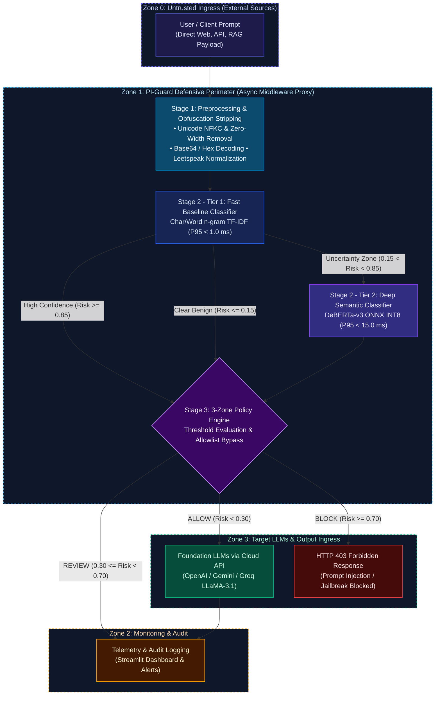

<div align="center">

# PI-Guard
### A Machine-Learning Guardrail for Detecting Prompt Injection and Jailbreak Attacks on LLM Applications

[](https://github.com/nvtruongops/pi-guard/actions)
[](https://www.python.org/)
[](LICENSE)
[](https://fastapi.tiangolo.com)

**FPT University — Information Assurance (IS) Capstone Project**

</div>

---

## Executive Summary (6 Core Research Questions)

### 1. What is PI-Guard?
**PI-Guard** is an open-source, API-driven defensive guardrail layer placed in front of Large Language Model (LLM) applications. It intercepts incoming user prompts, evaluates them with specialized machine learning and transformer classifiers, and enforces dynamic security policies (`ALLOW`, `REVIEW`, `BLOCK`) before requests ever reach downstream LLMs.

### 2. Why Prompt Injection & Jailbreaks?
In the **OWASP Top 10 for LLM Applications (2025)**, Prompt Injection (LLM01) is ranked as the #1 critical risk. Traditional rule-based regex filters are brittle: attackers easily evade them using **leetspeak (`1gn0r3`)**, **Base64 encoding**, **character spacing**, and **cognitive distraction riddles**. PI-Guard replaces brittle keyword filters with learning-based semantic detection.

### 3. What is our Research Question?
> *"Can a hybrid semantic classifier (DeBERTa-v3 + Char/Word TF-IDF) detect diverse prompt injection and jailbreak attacks with a **False Positive Rate (FPR) < 1.5%** on benign prompts while maintaining **P95 inference latency < 30ms** in production environments?"*

### 4. What Datasets are Used?
Curated from public benchmarks on Hugging Face and deduplicated with **Group-Aware Splitting** (clustering attack families to prevent data leakage) as specified in [`CAPSTONE PROJECT REGISTER.md`](CAPSTONE%20PROJECT%20REGISTER.md):
- `deepset/prompt-injections` (Standard benchmark of benign vs. injection prompts)
- `jayavibhav/prompt-injection` (Large-scale labeled prompt injection collection)
- `xTRam1/safe-guard-prompt-injection` (Benign vs. injection prompts for guardrail training)
- `Lakera/gandalf_ignore_instructions` (Real-world Gandalf game user attacks)
- `TrustAIRLab/in-the-wild-jailbreak-prompts` (Community in-the-wild jailbreaks)
- Benign everyday instruction & Q&A prompts from open datasets to balance the negative class.

### 5. What Models are Compared?
1. **Classical ML Baseline**: Hybrid Word (1-3) & Char (3-5) n-gram TF-IDF + Logistic Regression / LinearSVC.
2. **Fine-Tuned Transformer**: `microsoft/deberta-v3-base` with sequence classification head.
3. **Quantized Inference Engine**: DeBERTa-v3 with ONNX INT8 Dynamic Quantization for low-latency CPU inference.
4. **Reference SOTA**: `ProtectAI/deberta-v3-base-prompt-injection`.

### 6. What are the Target Evaluation Metrics? (Benchmarking In Progress)
In accordance with the approved [`CAPSTONE PROJECT REGISTER.md`](CAPSTONE%20PROJECT%20REGISTER.md), PI-Guard is evaluated across four core performance dimensions (full comparative empirical benchmarking scheduled for Review 2 / Milestone 2):
1. **Detection Performance**: Accuracy, Precision, Recall, and F1-score on held-out test splits. Target F1-Score: **> 0.95**.
2. **False Positive Rate (FPR) on Benign Prompts**: Minimizing false alarms on legitimate everyday user queries to prevent over-defense. Target FPR: **< 1.5%**.
3. **Robustness Against Obfuscated Attacks**: Evaluating defense capabilities against evasion transformations (Leetspeak, Base64 encoding, character spacing tricks).
4. **Low Inference Latency**: Ensuring minimal overhead for inline proxying before target LLMs. Target P95 Latency: **< 30 ms** on multi-core CPU via ONNX INT8.

---

## System Architecture

PI-Guard employs an **External Inline Guardrail Proxy** architecture governed by the principles of **Complete Mediation** and **Economy of Mechanism** (Saltzer & Schroeder, IEEE 1975). The system coordinates **Two-Tier Cascaded Classification** with **Uncertainty Routing** across 4 Zero-Trust security boundaries (Tencent Zhuque Lab, 2026):



---

## Collaborative Engineering Paradigm (FPT University)

> **Team Philosophy**: **Everyone Contributes -> Peer Review -> Consolidate Champion Results**  
> All 4 members work hands-on across the entire pipeline in parallel sandbox workspaces (`workspaces/<member>/`), cross-review each other's code and experimental metrics, and converge weekly to select champion models and documentation merged by the Leader.

| Student | Full Name | Student Code | Role in Group | Workspace Sandbox |
| :--- | :--- | :--- | :--- | :--- |
| **Student 1** | Nguyễn Văn Trường | SE182034 | Leader | [`workspaces/truongnv/`](workspaces/truongnv/) |
| **Student 2** | Nguyễn Quí Đức | SE182087 | Member | [`workspaces/ducnq/`](workspaces/ducnq/) |
| **Student 3** | Phạm Minh Hoàng Việt | SE181851 | Member | [`workspaces/vietpmh/`](workspaces/vietpmh/) |
| **Student 4** | Đỗ Đoàn Duy Phương | SE180235 | Member | [`workspaces/phuongddd/`](workspaces/phuongddd/) |

---

## Quickstart & Operational Guide

### 1. Development & Documentation Environment Setup
```bash
# Clone repository
git clone https://github.com/nvtruongops/pi-guard.git
cd pi-guard

# Install development and documentation dependencies (from Final-Report/)
pip install -r Final-Report/requirements-dev.txt

# Configure environment variables from template
cp Final-Report/.env.example .env
```

### 2. Launch 8-Pillar Scientific Documentation Portal (MkDocs Material)
```bash
# Aggregate documentation content across repository into Github-Page/
python Final-Report/scripts/build_docs_portal.py

# Launch local documentation preview server
mkdocs serve

# Browse the official live deployment on GitHub Pages:
# https://nvtruongops.github.io/pi-guard/
```

### 3. Engineering Roadmap & Experimentation Plan (Scheduled for Review 2)
> [!TIP]
> The complete data preprocessing and model training pipeline is under active iterative development within member `workspaces/` targeting Review 2 milestones:
> - **Data Curation & Standardization**: Harmonizing Hugging Face security benchmarks (`deepset`, `jayavibhav`, `xTRam1`, `Lakera`, `TrustAIRLab`) with negative benign prompts.
> - **Group-Aware Splitting**: Clustering paraphrased attack variations via MinHash / Jaccard similarity to eliminate out-of-distribution data leakage.
> - **Model Training**: Training the baseline TF-IDF model (LinearSVC / LogisticRegression) and fine-tuning the deep transformer (`microsoft/deberta-v3-base`).
> - **API & Dashboard Deployment**: Packaging the FastAPI Guardrail Proxy and Streamlit Security Dashboard upon benchmark convergence.

---

## Local-First Quality Assurance (QA) Suite

The PI-Guard project enforces a **Local-First Quality Assurance** methodology paired with automated GitHub Pages continuous deployment:

```bash
# 1. Install automated Git Pre-commit Hook (enforces workspace boundaries and syntax integrity)
python Final-Report/scripts/validate_local.py --install-hook

# 2. Fast pre-commit validation (Workspace boundaries + JSON manifests + Review 1 invariants)
python Final-Report/scripts/validate_local.py

# 3. Comprehensive verification (Boundaries, manifests, code linting, and MkDocs site build)
python Final-Report/scripts/validate_local.py --all

# 4. Verify all external URLs, DOIs, and YouTube resources (Zero Dead Links Invariant)
python Final-Report/scripts/verify_resource_url.py --file Final-Report/thesis/Review1_Problem_Definition_and_Threat_Model.md
```

---

## Project Architecture (Strict Three-Tier Root Structure)

The repository root structure is strictly organized into **three primary subsystems**:

```
d:/Work/Do-an/
├── Final-Report/                # [TIER 1: MASTER THESIS & OFFICIAL CAPSTONE DELIVERABLES]
│   ├── thesis/                  # Official Graduation Thesis dossier (Chapters 1-6 & References)
│   ├── notebooks/               # Experimentation resources & 5 reproducible Jupyter Notebooks (configs/, data/, models/)
│   ├── src/                     # Academic PoC source code framework (Scaffolding across 10 modules)
│   ├── tests/                   # Automated test suite (Unit, Integration, and Adversarial Scaffolding)
│   ├── Meeting/                 # Progress meeting minutes with Supervisor & internal team (Meetings 1, 2, 3)
│   ├── References/              # Complete collection of 18 full-text academic PDFs & REFERENCES_LOG.md
│   ├── reports/                 # Official progress tracker (PI_GUARD_PROCESS_REPORT.xlsx) & Supervisor deck (PI-GUARD-Present-109.pptx)
│   ├── figures/                 # High-resolution architectural diagrams and extracted visual assets
│   ├── tables/                  # Benchmark comparison tables in Markdown and LaTeX formats
│   ├── scripts/                 # Local QA validation toolchain, docs builder, and team workflow scripts
│   ├── requirements.txt         # Master production dependencies
│   ├── requirements-dev.txt     # Master development dependencies (Pytest, Ruff, Pre-commit, MkDocs)
│   ├── .env.example             # Master environment configuration template
│   └── README.md                # Comprehensive documentation for the Final-Report subsystem
│
├── Github-Page/                 # [TIER 2: GITHUB PAGES] Official Documentation Web Portal (MkDocs Material 8 Pillars)
│   ├── index.md                 # Portal homepage (8-Pillar Academic Information Architecture)
│   ├── javascripts/ & stylesheets/# MathJax LaTeX mathematical rendering scripts and custom CSS styles
│   └── [8 Scientific Topics]/  # Prompt Study, Attacks, Threat & Defense, Datasets, Models, Robustness, Optimization, Evaluation
│
└── workspaces/                  # [TIER 3: MEMBER WORKSPACES] Sandboxed exploration environments for all 4 members
    ├── truongnv/                # Workspace of Leader Truong: Architecture, Data Engineering & Repository Governance
    ├── ducnq/                   # Workspace of Duc: Classical ML Baseline TF-IDF, Feature Extraction & Threat Modeling
    ├── vietpmh/                 # Workspace of Viet: Transformer DeBERTa-v3, Quantization INT8 & Adversarial Robustness
    ├── phuongddd/               # Workspace of Phuong: FastAPI Guardrail Proxy, Streamlit Dashboard & Thesis Compilation
    └── README.md                # Personal workspace guidelines and operational conventions
```
