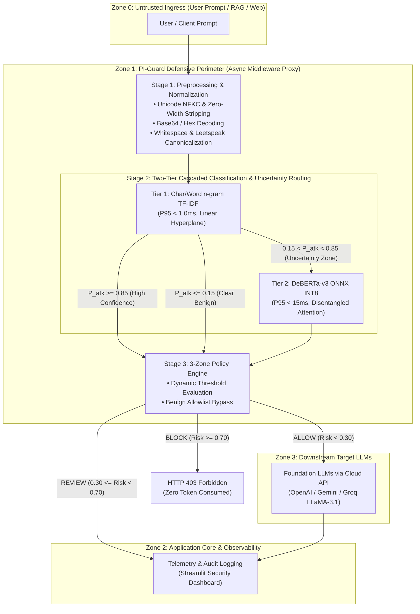

<div align="center">

# 🛡️ PI-Guard
### A Machine-Learning Guardrail for Detecting Prompt Injection and Jailbreak Attacks on LLM Applications

[](https://github.com/nvtruongops/pi-guard/actions)
[](https://www.python.org/)
[](LICENSE)
[](https://fastapi.tiangolo.com)

**FPT University — Information Assurance (IS) Capstone Project**

</div>

---

## 📌 Executive Summary (6 Core Research Questions)

### 1. What is PI-Guard?
**PI-Guard** is an open-source, API-driven defensive guardrail layer placed in front of Large Language Model (LLM) applications. It intercepts incoming user prompts, evaluates them with specialized machine learning and transformer classifiers, and enforces dynamic security policies (`ALLOW`, `REVIEW`, `BLOCK`) before requests ever reach downstream LLMs.

### 2. Why Prompt Injection & Jailbreaks?
In the **OWASP Top 10 for LLM Applications (2025)**, Prompt Injection (LLM01) is ranked as the #1 critical risk. Traditional rule-based regex filters are brittle: attackers easily evade them using **leetspeak (`1gn0r3`)**, **Base64 encoding**, **character spacing**, and **cognitive distraction riddles**. PI-Guard replaces brittle keyword filters with learning-based semantic detection.

### 3. What is our Research Question?
> *"Can a hybrid semantic classifier (DeBERTa-v3 + Char/Word TF-IDF) detect diverse prompt injection and jailbreak attacks with a **False Positive Rate (FPR) < 1.5%** on benign prompts while maintaining **P95 inference latency < 30ms** in production environments?"*

### 4. What Datasets are Used?
Curated from public benchmarks on Hugging Face and deduplicated with **Group-Aware Splitting** (clustering attack families to prevent data leakage) as specified in [`CAPSTONE PROJECT REGISTER.md`](CAPSTONE%20PROJECT%20REGISTER.md):
- `deepset/prompt-injections` (Standard benchmark of benign vs. injection prompts)
- `jayavibhav/prompt-injection` (Large-scale labeled prompt injection collection)
- `xTRam1/safe-guard-prompt-injection` (Benign vs. injection prompts for guardrail training)
- `Lakera/gandalf_ignore_instructions` (Real-world Gandalf game user attacks)
- `TrustAIRLab/in-the-wild-jailbreak-prompts` (Community in-the-wild jailbreaks)
- Benign everyday instruction & Q&A prompts from open datasets to balance the negative class.

### 5. What Models are Compared?
1. **Classical ML Baseline**: Hybrid Word (1-3) & Char (3-5) n-gram TF-IDF + Logistic Regression / LinearSVC.
2. **Fine-Tuned Transformer**: `microsoft/deberta-v3-base` with sequence classification head.
3. **Quantized Production Engine**: DeBERTa-v3 with ONNX INT8 Dynamic Quantization for low-latency CPU inference.
4. **Reference SOTA**: `ProtectAI/deberta-v3-base-prompt-injection`.

### 6. What are the Target Evaluation Metrics? (Benchmarking In Progress)
In accordance with the approved [`CAPSTONE PROJECT REGISTER.md`](CAPSTONE%20PROJECT%20REGISTER.md), PI-Guard is evaluated across four core performance dimensions (full comparative empirical benchmarking scheduled for Review 2 / Milestone 2):
1. **Detection Performance**: Accuracy, Precision, Recall, and F1-score on held-out test splits. Target F1-Score: **> 0.95**.
2. **False Positive Rate (FPR) on Benign Prompts**: Minimizing false alarms on legitimate everyday user queries to prevent over-defense. Target FPR: **< 1.5%**.
3. **Robustness Against Obfuscated Attacks**: Evaluating defense capabilities against evasion transformations (Leetspeak, Base64 encoding, character spacing tricks).
4. **Low Inference Latency**: Ensuring minimal overhead for inline proxying before target LLMs. Target P95 Latency: **< 30 ms** on multi-core CPU via ONNX INT8.

---

## 🏛️ System Architecture & Configuration

PI-Guard employs an **External Inline Guardrail Proxy** architecture governed by the principles of **Complete Mediation** and **Economy of Mechanism** (Saltzer & Schroeder, IEEE 1975). The system is partitioned into **2 distinct operational phases** across **4 Zero-Trust Security Boundaries** (Tencent Zhuque Lab, 2026):



### 1. Two-Phase Operational Pipeline

```
═════════════════════════════════════════════════════════════════════════════════════════════════════════
                       PHA 1: OFFLINE TRAINING PIPELINE (HUẤN LUYỆN NGOẠI TUYẾN)
═════════════════════════════════════════════════════════════════════════════════════════════════════════
  [ Public Benchmarks & Benign Corpora ] (Deepset, Gandalf, In-the-Wild, Open Benign QA)
               │
               ▼ (Group-Aware Splitting via MinHash LSH / Jaccard to prevent attack family data leakage)
     ┌─────────┴──────────────────────────────┐
     ▼ (Train/Validation Splits)              ▼ (Adversarial Slices: Leetspeak, Base64, Spacing)
  ┌───────────────────────────────┐        ┌────────────────────────────────────────────────────────┐
  │ 1. Train TF-IDF Baseline      │        │ ROBUSTNESS EVALUATION SUITE                            │
  │ 2. Fine-tune DeBERTa-v3-base  │        │ • Adversarial Degradation Target: Delta F1 < 5%        │
  │ 3. ONNX INT8 Quantization     │        │ • Target Metrics: Recall >= 95%, FPR < 1.5%            │
  └──────────────┬────────────────┘        └───────────────────────────┬────────────────────────────┘
                 │ Trọng số mô hình                                    │
                 ▼                                                     ▼
  [ Model Registry: models/baseline/ & models/onnx/ ] ─────────────────┘
                 │
                 ▼ (Nạp runtime vào memory)
═════════════════════════════════════════════════════════════════════════════════════════════════════════
                       PHA 2: ONLINE RUNTIME MIDDLEWARE (VẬN HÀNH TRỰC TUYẾN)
═════════════════════════════════════════════════════════════════════════════════════════════════════════
  [ Ingress Prompt ] ──► POST /v1/chat/guardrail
                               │
                               ▼
  ┌─────────────────────────────────────────────────────────────────────────────────────────────────────┐
  │ PI-GUARD DEFENSE MIDDLEWARE (FastAPI Gateway)                                                       │
  │                                                                                                     │
  │  [Stage 1: Preprocessing] ──► Unicode NFKC, Base64/Hex Probe, Whitespace Collapse                  │
  │                                      │                                                              │
  │  [Stage 2: Two-Tier Cascade]         ▼                                                              │
  │   ├── Tier 1 (TF-IDF Baseline):      P_atk >= 0.85 ──► Early BLOCK (Save 80% CPU overhead, < 1ms)  │
  │   │                                  P_atk <= 0.15 ──► Fast PASS (Forward to Target LLM, < 1ms)     │
  │   │                                  0.15 < P_atk < 0.85 ──► Escalate to Tier 2                     │
  │   └── Tier 2 (DeBERTa-v3 ONNX INT8): Disentangled Attention Content H vs Position P (P95 ~14.5ms)  │
  │                                      │                                                              │
  │  [Stage 3: Policy Engine]            ▼ Chấm Risk Score (0.0 - 1.0) & Taxonomy Mapping               │
  │   ├── ALLOW  (Risk < 0.30):          Chuyển tiếp đến Target LLM (Groq / OpenAI / Gemini)            │
  │   ├── REVIEW (0.30 <= Risk < 0.70):  Gắn cảnh báo an ninh, chuyển sang hộp cát / human review       │
  │   └── BLOCK  (Risk >= 0.70):         Trả về HTTP 403 Forbidden (0 token tiêu tốn, bảo vệ ngân sách) │
  └─────────────────────────────────────────────────────────────────────────────────────────────────────┘
```

---

### 2. Standardized Configuration Specifications

Cấu hình hệ thống được khai báo dạng **Declarative YAML & Pydantic Schemas** nhằm đảm bảo tính tái lập và độc lập giữa các tầng xử lý:

#### A. Policy Engine Configuration (`thresholds.py` / `policy.yaml`)
```yaml
policy:
  version: "1.0.0"
  block_threshold: 0.70       # Ngưỡng kích hoạt HTTP 403 Blocked (mặc định 0.70 - 0.80)
  review_threshold: 0.30      # Ngưỡng kích hoạt cảnh báo REVIEW / Sandboxed (0.30 - 0.70)
  allowlist_enabled: true     # Cho phép bypass các câu hỏi học thuật / an ninh mạng lành tính
  enable_hard_keyword_filters: false # Thay thế hoàn toàn regex giòn gãy bằng mô hình học máy

tier1_uncertainty_routing:
  early_block_threshold: 0.85 # Tầng 1 chặn ngay lập tức nếu độ tin cậy tấn công cực cao (< 1ms)
  fast_pass_threshold: 0.15   # Tầng 1 thông qua ngay lập tức nếu độ tin cậy lành tính cực cao (< 1ms)
  uncertainty_range: [0.15, 0.85] # Khoảng bất định bắt buộc kích hoạt DeBERTa-v3 Tầng 2
```

#### B. Model Registry Configuration (`models.yaml`)
```yaml
models:
  baseline_tfidf:
    type: "classical_ml"
    path: "models/baseline/baseline_tfidf.joblib"
    ngram_range: [3, 5]               # Character n-grams quét xuyên Leetspeak (Jain et al. 2023)
    max_features: 60000
    expected_latency_p95_ms: 1.5
    device: "cpu"

  deberta_v3_onnx_int8:
    type: "onnx_quantized"
    path: "models/onnx/deberta_v3_int8.onnx"
    base_model: "microsoft/deberta-v3-base"
    architecture: "DebertaV2ForSequenceClassification"
    quantization_type: "INT8_Dynamic_Quantization" # Tối ưu hóa AVX-512 / VNNI (Yao et al. 2022)
    execution_provider: "CPUExecutionProvider"
    intra_op_num_threads: 4
    max_sequence_length: 512
    expected_latency_p95_ms: 14.5
    device: "cpu"
```

#### C. Performance SLA & Target Evaluation (`evaluation.yaml`)
```yaml
performance_sla:
  target_recall: 0.95                 # Tỷ lệ phát hiện tấn công Injection & Jailbreak >= 95%
  target_fpr: 0.015                   # Tỷ lệ báo động nhầm trên câu hỏi an toàn (FPR) < 1.5%
  target_p95_latency_ms: 30.0         # Cam kết độ trễ suy luận P95 trên CPU đa nhân < 30ms (Zero-GPU)
  adversarial_degradation_f1: 0.05    # Độ suy giảm F1 khi bị làm nhiễu đối kháng (Delta F1) < 5%

downstream_target_llms:
  - provider: "groq"
    model: "llama-3.1-8b-instant"     # Open-weights baseline đối chuẩn red-teaming (Shen et al. 2024)
  - provider: "openai"
    model: "gpt-4o-mini"              # Commercial frontier safety baseline (Yuan et al. 2024)
  - provider: "gemini"
    model: "gemini-1.5-flash"         # High-throughput enterprise API baseline
```

---

### 3. Academic Foundations & Literature Mapping

Kiến trúc PI-Guard được bảo chứng trực tiếp bởi các công trình y văn quốc tế và tiêu chuẩn bảo mật chính thức:

| Thành Phần Kiến Trúc | Nguyên Lý & Đột Phá Kỹ Thuật | Công Trình Khoa Học Bảo Chứng |
| :--- | :--- | :--- |
| **External Guardrail Proxy** | Kiểm duyệt độc lập, triệt tiêu lỗ hổng trộn lẫn luồng lệnh/dữ liệu (*Control/Data Conflation*) | Perez & Ribeiro (NeurIPS 2022 [[3]](#ref3)), Greshake et al. (ACM AISec 2023 [[4]](#ref4)) |
| **Zero-Trust Defense Perimeter** | Phân ranh giới 4 Zone (Zone 0 Ingress đến Zone 3 Foundation LLM) | Tencent Zhuque Lab (2026 [[6]](#ref6)), NIST AI 100-2e2025, OWASP LLM01:2025 |
| **Two-Tier Cascaded Defense** | *Complete Mediation* & *Economy of Mechanism*: Tầng 1 lọc nhanh, Tầng 2 phân giải bất định | Saltzer & Schroeder (Proc. IEEE 1975 [[18]](#ref18)), Rebedea et al. / NVIDIA (EMNLP 2023 [[8]](#ref8)) |
| **Tier 1: Character N-Grams** | Quét xuyên biến dị Leetspeak (`1gn0r3`) và khoảng trắng nhân tạo bỏ qua BPE Tokenizer | Jain et al. (arXiv:2309.00614, 2023 [[15]](#ref15)) |
| **Tier 2: Disentangled Attention** | Phân tách ma trận nội dung $\mathbf{H}$ và vị trí tương đối $\mathbf{P}$, nhận diện đảo ngữ và DAN roleplay | He et al. (ICLR 2021 / 2023 [[9]](#ref9)), Meta Prompt-Guard-86M (Meta AI 2024) |
| **CPU ONNX INT8 Quantization** | Lượng hóa ma trận trọng số sang số nguyên 8-bit, khai thác tập lệnh AVX-512/VNNI đạt P95 < 22ms | Yao et al. (NeurIPS 2022 [[16]](#ref16)), Hugging Face Optimum |


---

## 👥 Collaborative Engineering Paradigm (FPT University)

> **Team Philosophy**: **Ai cũng làm $\rightarrow$ Tham khảo nhau $\rightarrow$ Chốt kết quả**  
> All 4 members work hands-on across the entire pipeline in parallel sandbox workspaces (`workspaces/<member>/`), cross-review each other's code and experimental metrics, and converge weekly to select champion models and documentation merged by the Leader.

| Student | Full Name | Student Code | Role in Group | Workspace Sandbox |
| :--- | :--- | :--- | :--- | :--- |
| **Student 1** | Nguyễn Văn Trường | SE182034 | Leader | [`workspaces/truongnv/`](workspaces/truongnv/) |
| **Student 2** | Nguyễn Quí Đức | SE182087 | Member | [`workspaces/ducnq/`](workspaces/ducnq/) |
| **Student 3** | Phạm Minh Hoàng Việt | SE181851 | Member | [`workspaces/vietpmh/`](workspaces/vietpmh/) |
| **Student 4** | Đỗ Đoàn Duy Phương | SE180235 | Member | [`workspaces/phuongddd/`](workspaces/phuongddd/) |

---

## 🚀 Lộ Trình Triển Khai & Quy Chuẩn Giai Đoạn (Review 1: Zero-Code Invariant)

> [!IMPORTANT]
> **TIÊU CHUẨN BÁO CÁO CỘT MỐC REVIEW 1 (ĐH FPT — IAP491)**:
> 1. **Giai đoạn hiện tại (Review 1: Tuần 1–4)**: Tập trung **100% vào Nghiên cứu lý thuyết, Khảo sát y văn quốc tế, Mô hình hóa đe dọa (NIST AI 100-2e2025, STRIDE) và Thiết kế kiến trúc phòng thủ hai tầng**.
> 2. **Quy tắc phân hệ Nghiệm thu (`Final-Report/`)**: **"Chỉ khi hoàn thành xong và nghiệm thu mới có code hay tài liệu chính thức ở Final-Report/"**. Do đó, trong giai đoạn Review 1, phân hệ `Final-Report/` tuyệt đối không chứa mã nguồn nháp hay kết quả thực nghiệm sớm.
> 3. **Không gian làm việc thành viên (`workspaces/<member>/`)**: Toàn bộ quá trình cào dữ liệu, xử lý Group-Aware Splitting, thử nghiệm Baseline ML và tinh chỉnh Transformer DeBERTa-v3 được 4 thành viên tiến hành độc lập trong sandbox cá nhân và sẽ được Leader đồng quy tích hợp vào `Final-Report/` ở các cột mốc **Review 2 & Hội đồng Giữa kỳ**.

### 1. Thiết Lập Môi Trường Phát Triển & Tài Liệu
```bash
# Clone repository
git clone https://github.com/nvtruongops/pi-guard.git
cd pi-guard

# Cài đặt các gói phụ thuộc phát triển & tài liệu (từ Final-Report/)
pip install -r Final-Report/requirements-dev.txt

# Cấu hình biến môi trường mẫu
cp Final-Report/.env.example .env
```

### 2. Xem Cổng Tài Liệu 8 Chuyên Đề Khoa Học (MkDocs Material)
```bash
# Tổng hợp tài liệu toàn dự án vào Github-Page/
python Final-Report/scripts/build_docs_portal.py

# Khởi chạy máy chủ tài liệu cục bộ
mkdocs serve   # Truy cập tại: http://127.0.0.1:8000

# Hoặc tra cứu trực tiếp phiên bản xuất bản chính thức trên GitHub Pages:
# https://nvtruongops.github.io/pi-guard/
```

### 3. Kế Hoạch Nghiên Cứu Mã Nguồn & Thực Nghiệm (Dự Kiến Cho Review 2)
> [!TIP]
> Toàn bộ pipeline tiền xử lý dữ liệu và huấn luyện mô hình đang được phát triển trong `workspaces/` cho cột mốc Review 2:
> - **Thu thập & Chuẩn hóa dữ liệu**: Hợp nhất Hugging Face benchmarks (`deepset`, `jayavibhav`, `xTRam1`, `Lakera`, `TrustAIRLab`) và benign prompts.
> - **Phân chia Group-Aware Splitting**: Cụm các biến thể tấn công tương đồng bằng MinHash / Jaccard Similarity để triệt tiêu rò rỉ dữ liệu.
> - **Huấn luyện mô hình**: Huấn luyện Baseline TF-IDF (LinearSVC / LogisticRegression) và Deep Transformer (`microsoft/deberta-v3-base`).
> - **Triển khai API & Dashboard**: Đóng gói FastAPI Guardrail Proxy và Streamlit Dashboard sau khi nghiệm thu mô hình.

---

## 🧪 Bộ Công Cụ Kiểm Định Chất Lượng Cục Bộ (Local-First QA Suite)

Dự án PI-Guard áp dụng mô hình **Kiểm định thuần Local (Local-First Validation)** kết hợp với GitHub Pages Deployment tự động:

```bash
# 1. Cài đặt Git Pre-commit Hook tự động (chặn commit vi phạm ranh giới & lỗi cú pháp)
python Final-Report/scripts/validate_local.py --install-hook

# 2. Kiểm định nhanh trước khi commit (Workspace Boundary + JSON Manifests + Review 1 Invariants)
python Final-Report/scripts/validate_local.py

# 3. Kiểm định toàn diện 100% (Bao gồm Boundary, Manifests, Lint & Biên dịch MkDocs Portal)
python Final-Report/scripts/validate_local.py --all

# 4. Kiểm tra và xác minh URL / DOI / YouTube không bị link chết (Zero Dead Links Invariant)
python Final-Report/scripts/verify_resource_url.py --file Final-Report/thesis/Review1_Problem_Definition_and_Threat_Model.md
```

---

## 📚 Cấu Trúc Dự Án (Đúng 3 Phân Hệ Độc Tôn Tại Thư Mục Gốc)

Hệ thống thư mục gốc của dự án được quy hoạch tối giản thành **đúng 3 thư mục chính**:

```
d:/Work/Do-an/
├── 📁 Final-Report/                # [PHÂN HỆ 1: BÁO CÁO TỔNG & HỒ SƠ NGHIỆM THU CHÍNH THỨC]
│   ├── thesis/                    # Toàn văn Luận văn tốt nghiệp chính thức (Single Source of Truth)
│   │   ├── FINAL_THESIS.md        # Toàn văn Khóa luận tốt nghiệp (Chapters 1-6 + References)
│   │   ├── Review1_Problem_Definition_and_Threat_Model.md # Hồ sơ chuyên đề Review 1 (Chương 1 & Chương 2)
│   │   ├── FPT_IAP491_Capstone_Guidelines_and_Rubrics_Summary.md # Tóm tắt quy chế & rubric IAP491
│   │   ├── chapters/              # Các chương riêng biệt (01_Introduction, 02_Literature_Review)
│   │   └── README.md              # Quy chuẩn viết và biên dịch Luận văn
│   ├── Meeting/                   # Biên bản các cuộc họp tiến độ với GVHD & nội bộ nhóm (Meeting 1, 2, 3)
│   ├── References/                # Toàn bộ 18 bài báo khoa học toàn văn PDF chuẩn & REFERENCES_LOG.md
│   ├── reports/                   # Sổ theo dõi tiến độ chính thức (PI_GUARD_PROCESS_REPORT.xlsx) & Slide gặp GVHD (PI-GUARD-Present-109.pptx)
│   ├── figures/                   # Sơ đồ kiến trúc & hình ảnh trích xuất chất lượng cao
│   ├── tables/                    # Bảng số liệu đối chuẩn định dạng Markdown và LaTeX
│   ├── scripts/                   # Bộ công cụ kiểm định Local QA, xuất bản tài liệu & quy trình nhóm
│   ├── requirements.txt           # Master Production Dependencies
│   ├── requirements-dev.txt       # Master Dev Dependencies (Pytest, Ruff, Pre-commit, MkDocs)
│   ├── .env.example               # Master Environment Configuration Template
│   └── README.md                  # Hướng dẫn chi tiết phân hệ Báo Cáo Tổng
│
├── 📁 Github-Page/                 # [PHÂN HỆ 2: GITHUB PAGES] Cổng tài liệu Web UI chính thức (MkDocs Material 8 Chuyên Đề)
│   ├── index.md                   # Trang chủ cổng tài liệu Web UI (8-Pillar Academic Architecture)
│   ├── javascripts/ & stylesheets/# Cấu hình MathJax LaTeX hiển thị công thức & Custom CSS giao diện
│   └── [8 Chuyên Đề Khoa Học]/    # Prompt, Attacks, Threat & Defense, Dataset, Models, Robustness, Optimization, Evaluation
│
└── 📁 workspaces/                  # [PHÂN HỆ 3: WORKSPACE THÀNH VIÊN] Sandbox thử nghiệm của 4 thành viên
    ├── truongnv/                  # Workspace Leader (Trường): Chuẩn hóa dữ liệu, kiến trúc, thực nghiệm thăm dò
    ├── ducnq/                     # Workspace Đức: Classical ML Baseline TF-IDF, Feature Extraction & Threat Model
    ├── vietpmh/                   # Workspace Việt: Transformer DeBERTa-v3, Quantization INT8, Robustness Testing
    ├── phuongddd/                 # Workspace Phương: FastAPI Guardrail Proxy, Streamlit Dashboard & Luận văn
    └── README.md                  # Hướng dẫn quy chuẩn không gian làm việc cá nhân
```

---

## 🔬 Tài Liệu Tham Khảo Học Thuật (References)

Toàn bộ 18 bài báo khoa học toàn văn (PDF) được lưu trữ cục bộ tại [`Final-Report/References/`](Final-Report/References/) và quản lý theo dõi tại [`REFERENCES_LOG.md`](Final-Report/References/REFERENCES_LOG.md):

- <a id="ref1"></a>**[1]** Zhao et al. (2023). *A Survey of Large Language Models*. arXiv:2303.18223. [[PDF Bản Mở]](Final-Report/References/Zhao_2023_A_Survey_of_Large_Language_Models.pdf)
- <a id="ref2"></a>**[2]** Ouyang et al. (2022). *Training language models to follow instructions with human feedback*. NeurIPS 2022. [[PDF Bản Mở]](Final-Report/References/Ouyang_2022_InstructGPT_Training_Language_Models_Follow_Instructions.pdf)
- <a id="ref3"></a>**[3]** Perez, F., & Ribeiro, I. (2022). *Ignore This Title and Hack This Paper: Do Language Models follow Specifications?*. In NeurIPS ML Safety Workshop 2022. [[PDF Bản Mở]](Final-Report/References/Perez_2022_Ignore_This_Title_Hack_This_Paper_Prompt_Injection.pdf)
- <a id="ref4"></a>**[4]** Greshake, K., et al. (2023). *Not what you've signed up for: Compromising Real-World LLM-Integrated Applications with Indirect Prompt Injection*. In ACM AISec '23. [[PDF Bản Mở]](Final-Report/References/Greshake_2023_Indirect_Prompt_Injection.pdf)
- <a id="ref5"></a>**[5]** Wei, A., et al. (2024). *Jailbroken: How Does LLM Safety Training Fail?*. In NeurIPS 2024. [[PDF Bản Mở]](Final-Report/References/Wei_2024_Jailbroken_How_LLM_Safety_Training_Fails.pdf)
- <a id="ref6"></a>**[6]** Tencent Zhuque Lab (2026). *AI-Infra-Guard: Multi-Layer Attack Surface and Defense Framework for AI Agents*. Tencent Security Technical Report 2026. [[PDF Bản Mở]](Final-Report/References/Tencent_2026_AI_Infra_Guard_MultiLayer_Agent_RedTeaming.pdf)
- <a id="ref7"></a>**[7]** Inan, H., et al. / Meta AI (2023). *Llama Guard: LLM-based Input-Output Safeguard for Human-AI Conversations*. arXiv:2312.06674. [[PDF Bản Mở]](Final-Report/References/Meta_2023_Llama_Guard_Input_Output_Safeguard.pdf)
- <a id="ref8"></a>**[8]** Rebedea, T., et al. / NVIDIA (2023). *NeMo Guardrails: A Toolkit for Controllable and Safe LLM Applications*. In EMNLP 2023. [[PDF Bản Mở]](Final-Report/References/NVIDIA_2023_NeMo_Guardrails_Toolkit.pdf)
- <a id="ref9"></a>**[9]** He, P., et al. (2021/2023). *DeBERTa: Decoding-enhanced BERT with Disentangled Attention*. In ICLR 2021 / 2023. [[PDF Bản Mở]](Final-Report/References/He_2023_DeBERTaV3_Disentangled_Attention_ICLR.pdf)
- <a id="ref10"></a>**[10]** Markov, T., et al. / OpenAI (2023). *A Holistic Approach to Undesired Content Detection in the Real World*. In AAAI HCOMP 2023. [[PDF Bản Mở]](Final-Report/References/OpenAI_2023_Undesired_Content_Detection.pdf)
- <a id="ref11"></a>**[11]** Shen, X., et al. (2024). *"Do Anything Now": Characterizing and Evaluating In-The-Wild Jailbreak Prompts on Large Language Models*. In ACM CCS '24. [[PDF Bản Mở]](Final-Report/References/Shen_2024_Do_Anything_Now_Jailbreak_Prompts_In_The_Wild.pdf)
- <a id="ref12"></a>**[12]** Zhou, Y., et al. (2024). *EasyJailbreak: A Unified Framework for Jailbreak Attacks*. arXiv:2403.12171. [[PDF Bản Mở]](Final-Report/References/Zhou_2024_EasyJailbreak_Unified_Framework.pdf)
- <a id="ref13"></a>**[13]** Zou, A., et al. (2023). *Universal and Transferable Adversarial Attacks on Aligned Language Models*. arXiv:2307.15043. [[PDF Bản Mở]](Final-Report/References/Zou_2023_Universal_Transferable_Adversarial_Attacks_GCG.pdf)
- <a id="ref14"></a>**[14]** Robey, A., et al. (2023). *SmoothLLM: Defending Large Language Models Against Jailbreaking Attacks*. arXiv:2310.03684. [[PDF Bản Mở]](Final-Report/References/Robey_2023_SmoothLLM_Defending_LLMs_Random_Perturbation.pdf)
- <a id="ref15"></a>**[15]** Jain, N., et al. (2023). *Baseline Defenses for Adversarial Attacks Against Aligned Language Models*. arXiv:2309.00614. [[PDF Bản Mở]](Final-Report/References/Jain_2023_Baseline_Defenses_Adversarial_Attacks_LLMs.pdf)
- <a id="ref16"></a>**[16]** Yao, Z., et al. (2022). *ZeroQuant: Efficient and Affordable Post-Training Quantization for Large-Scale Transformers*. In NeurIPS 2022. [[PDF Bản Mở]](Final-Report/References/Yao_2022_ZeroQuant_Efficient_Post_Training_Quantization_Transformers.pdf)
- <a id="ref17"></a>**[17]** Yuan, Y., et al. (2024). *GPT-4 Is Too Smart To Be Safe: Stealthy Chat with LLMs via Cipher*. In ICLR 2024. [[PDF Bản Mở]](Final-Report/References/Yuan_2024_GPT4_Too_Smart_To_Be_Safe_Cipher_Jailbreak.pdf)
- <a id="ref18"></a>**[18]** Saltzer, J. H., & Schroeder, M. D. (1975). *The Protection of Information in Computer Systems*. Proceedings of the IEEE, 63(9), 1278-1308. [[PDF Bản Mở]](Final-Report/References/Saltzer_1975_The_Protection_of_Information_in_Computer_Systems.pdf)


