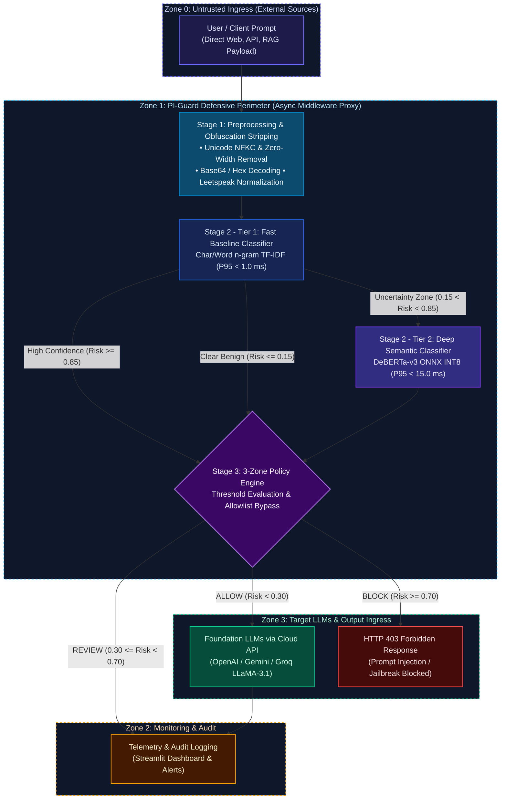

<div align="center">

# 🛡️ PI-Guard
### A Machine-Learning Guardrail for Detecting Prompt Injection and Jailbreak Attacks on LLM Applications

[](https://github.com/nvtruongops/pi-guard/actions)
[](https://www.python.org/)
[](LICENSE)
[](https://fastapi.tiangolo.com)

**FPT University — Information Assurance (IS) Capstone Project**

</div>

---

## 📌 Executive Summary (6 Core Research Questions)

### 1. What is PI-Guard?
**PI-Guard** is an open-source, API-driven defensive guardrail layer placed in front of Large Language Model (LLM) applications. It intercepts incoming user prompts, evaluates them with specialized machine learning and transformer classifiers, and enforces dynamic security policies (`ALLOW`, `REVIEW`, `BLOCK`) before requests ever reach downstream LLMs.

### 2. Why Prompt Injection & Jailbreaks?
In the **OWASP Top 10 for LLM Applications (2025)**, Prompt Injection (LLM01) is ranked as the #1 critical risk. Traditional rule-based regex filters are brittle: attackers easily evade them using **leetspeak (`1gn0r3`)**, **Base64 encoding**, **character spacing**, and **cognitive distraction riddles**. PI-Guard replaces brittle keyword filters with learning-based semantic detection.

### 3. What is our Research Question?
> *"Can a hybrid semantic classifier (DeBERTa-v3 + Char/Word TF-IDF) detect diverse prompt injection and jailbreak attacks with a **False Positive Rate (FPR) < 1.5%** on benign prompts while maintaining **P95 inference latency < 30ms** in production environments?"*

### 4. What Datasets are Used?
Curated from public benchmarks on Hugging Face and deduplicated with **Group-Aware Splitting** (clustering attack families to prevent data leakage) as specified in [`CAPSTONE PROJECT REGISTER.md`](CAPSTONE%20PROJECT%20REGISTER.md):
- `deepset/prompt-injections` (Standard benchmark of benign vs. injection prompts)
- `jayavibhav/prompt-injection` (Large-scale labeled prompt injection collection)
- `xTRam1/safe-guard-prompt-injection` (Benign vs. injection prompts for guardrail training)
- `Lakera/gandalf_ignore_instructions` (Real-world Gandalf game user attacks)
- `TrustAIRLab/in-the-wild-jailbreak-prompts` (Community in-the-wild jailbreaks)
- Benign everyday instruction & Q&A prompts from open datasets to balance the negative class.

### 5. What Models are Compared?
1. **Classical ML Baseline**: Hybrid Word (1-3) & Char (3-5) n-gram TF-IDF + Logistic Regression / LinearSVC.
2. **Fine-Tuned Transformer**: `microsoft/deberta-v3-base` with sequence classification head.
3. **Quantized Production Engine**: DeBERTa-v3 with ONNX INT8 Dynamic Quantization for low-latency CPU inference.
4. **Reference SOTA**: `ProtectAI/deberta-v3-base-prompt-injection`.

### 6. What are the Target Evaluation Metrics? (Benchmarking In Progress)
In accordance with the approved [`CAPSTONE PROJECT REGISTER.md`](CAPSTONE%20PROJECT%20REGISTER.md), PI-Guard is evaluated across four core performance dimensions (full comparative empirical benchmarking scheduled for Review 2 / Milestone 2):
1. **Detection Performance**: Accuracy, Precision, Recall, and F1-score on held-out test splits. Target F1-Score: **> 0.95**.
2. **False Positive Rate (FPR) on Benign Prompts**: Minimizing false alarms on legitimate everyday user queries to prevent over-defense. Target FPR: **< 1.5%**.
3. **Robustness Against Obfuscated Attacks**: Evaluating defense capabilities against evasion transformations (Leetspeak, Base64 encoding, character spacing tricks).
4. **Low Inference Latency**: Ensuring minimal overhead for inline proxying before target LLMs. Target P95 Latency: **< 30 ms** on multi-core CPU via ONNX INT8.

---

## 🏛️ System Architecture

PI-Guard employs an **External Inline Guardrail Proxy** architecture governed by the principles of **Complete Mediation** and **Economy of Mechanism** (Saltzer & Schroeder, IEEE 1975). The system coordinates **Two-Tier Cascaded Classification** with **Uncertainty Routing** across 4 Zero-Trust security boundaries (Tencent Zhuque Lab, 2026):




---

## 👥 Collaborative Engineering Paradigm (FPT University)

> **Team Philosophy**: **Ai cũng làm $\rightarrow$ Tham khảo nhau $\rightarrow$ Chốt kết quả**  
> All 4 members work hands-on across the entire pipeline in parallel sandbox workspaces (`workspaces/<member>/`), cross-review each other's code and experimental metrics, and converge weekly to select champion models and documentation merged by the Leader.

| Student | Full Name | Student Code | Role in Group | Workspace Sandbox |
| :--- | :--- | :--- | :--- | :--- |
| **Student 1** | Nguyễn Văn Trường | SE182034 | Leader | [`workspaces/truongnv/`](workspaces/truongnv/) |
| **Student 2** | Nguyễn Quí Đức | SE182087 | Member | [`workspaces/ducnq/`](workspaces/ducnq/) |
| **Student 3** | Phạm Minh Hoàng Việt | SE181851 | Member | [`workspaces/vietpmh/`](workspaces/vietpmh/) |
| **Student 4** | Đỗ Đoàn Duy Phương | SE180235 | Member | [`workspaces/phuongddd/`](workspaces/phuongddd/) |

---

## 🚀 Hướng Dẫn Cài Đặt & Vận Hành (Quickstart)

### 1. Thiết Lập Môi Trường Phát Triển & Tài Liệu
```bash
# Clone repository
git clone https://github.com/nvtruongops/pi-guard.git
cd pi-guard

# Cài đặt các gói phụ thuộc phát triển & tài liệu (từ Final-Report/)
pip install -r Final-Report/requirements-dev.txt

# Cấu hình biến môi trường mẫu
cp Final-Report/.env.example .env
```

### 2. Xem Cổng Tài Liệu 8 Chuyên Đề Khoa Học (MkDocs Material)
```bash
# Tổng hợp tài liệu toàn dự án vào Github-Page/
python Final-Report/scripts/build_docs_portal.py

# Khởi chạy máy chủ tài liệu cục bộ
mkdocs serve   # Truy cập tại: http://127.0.0.1:8000

# Hoặc tra cứu trực tiếp phiên bản xuất bản chính thức trên GitHub Pages:
# https://nvtruongops.github.io/pi-guard/
```

### 3. Kế Hoạch Nghiên Cứu Mã Nguồn & Thực Nghiệm (Dự Kiến Cho Review 2)
> [!TIP]
> Toàn bộ pipeline tiền xử lý dữ liệu và huấn luyện mô hình đang được phát triển trong `workspaces/` cho cột mốc Review 2:
> - **Thu thập & Chuẩn hóa dữ liệu**: Hợp nhất Hugging Face benchmarks (`deepset`, `jayavibhav`, `xTRam1`, `Lakera`, `TrustAIRLab`) và benign prompts.
> - **Phân chia Group-Aware Splitting**: Cụm các biến thể tấn công tương đồng bằng MinHash / Jaccard Similarity để triệt tiêu rò rỉ dữ liệu.
> - **Huấn luyện mô hình**: Huấn luyện Baseline TF-IDF (LinearSVC / LogisticRegression) và Deep Transformer (`microsoft/deberta-v3-base`).
> - **Triển khai API & Dashboard**: Đóng gói FastAPI Guardrail Proxy và Streamlit Dashboard sau khi nghiệm thu mô hình.

---

## 🧪 Bộ Công Cụ Kiểm Định Chất Lượng Cục Bộ (Local-First QA Suite)

Dự án PI-Guard áp dụng mô hình **Kiểm định thuần Local (Local-First Validation)** kết hợp với GitHub Pages Deployment tự động:

```bash
# 1. Cài đặt Git Pre-commit Hook tự động (chặn commit vi phạm ranh giới & lỗi cú pháp)
python Final-Report/scripts/validate_local.py --install-hook

# 2. Kiểm định nhanh trước khi commit (Workspace Boundary + JSON Manifests + Review 1 Invariants)
python Final-Report/scripts/validate_local.py

# 3. Kiểm định toàn diện 100% (Bao gồm Boundary, Manifests, Lint & Biên dịch MkDocs Portal)
python Final-Report/scripts/validate_local.py --all

# 4. Kiểm tra và xác minh URL / DOI / YouTube không bị link chết (Zero Dead Links Invariant)
python Final-Report/scripts/verify_resource_url.py --file Final-Report/thesis/Review1_Problem_Definition_and_Threat_Model.md
```

---

## 📚 Cấu Trúc Dự Án (Đúng 3 Phân Hệ Độc Tôn Tại Thư Mục Gốc)

Hệ thống thư mục gốc của dự án được quy hoạch tối giản thành **đúng 3 thư mục chính**:

```
d:/Work/Do-an/
├── 📁 Final-Report/                # [PHÂN HỆ 1: BÁO CÁO TỔNG & HỒ SƠ NGHIỆM THU CHÍNH THỨC]
│   ├── thesis/                    # Toàn bộ hồ sơ Luận văn tốt nghiệp chính thức (Chapters 1-6, Review 1)
│   ├── notebooks/                 # Tài nguyên thực nghiệm & 5 Jupyter Notebooks tái lập (configs/, data/, models/)
│   ├── src/                       # Khung mã nguồn chính thức (Production Scaffolding 10 modules)
│   ├── tests/                     # Bộ kiểm thử tự động (Unit, Integration, Adversarial Scaffolding)
│   ├── Meeting/                   # Biên bản các cuộc họp tiến độ với GVHD & nội bộ nhóm (Meeting 1, 2, 3)
│   ├── References/                # Toàn bộ 18 bài báo khoa học toàn văn PDF chuẩn & REFERENCES_LOG.md
│   ├── reports/                   # Sổ theo dõi tiến độ (PI_GUARD_PROCESS_REPORT.xlsx) & Slide gặp GVHD (PI-GUARD-Present-109.pptx)
│   ├── figures/                   # Sơ đồ kiến trúc & hình ảnh trích xuất chất lượng cao
│   ├── tables/                    # Bảng số liệu đối chuẩn định dạng Markdown và LaTeX
│   ├── scripts/                   # Bộ công cụ kiểm định Local QA, xuất bản tài liệu & quy trình nhóm
│   ├── requirements.txt           # Master Production Dependencies
│   ├── requirements-dev.txt       # Master Dev Dependencies (Pytest, Ruff, Pre-commit, MkDocs)
│   ├── .env.example               # Master Environment Configuration Template
│   └── README.md                  # Hướng dẫn chi tiết phân hệ Báo Cáo Tổng
│
├── 📁 Github-Page/                 # [PHÂN HỆ 2: GITHUB PAGES] Cổng tài liệu Web UI chính thức (MkDocs Material 8 Chuyên Đề)
│   ├── index.md                   # Trang chủ cổng tài liệu Web UI (8-Pillar Academic Architecture)
│   ├── javascripts/ & stylesheets/# Cấu hình MathJax LaTeX hiển thị công thức & Custom CSS giao diện
│   └── [8 Chuyên Đề Khoa Học]/    # Prompt, Attacks, Threat & Defense, Dataset, Models, Robustness, Optimization, Evaluation
│
└── 📁 workspaces/                  # [PHÂN HỆ 3: WORKSPACE THÀNH VIÊN] Sandbox thử nghiệm của 4 thành viên
    ├── truongnv/                  # Workspace Leader (Trường): Chuẩn hóa dữ liệu, kiến trúc, thực nghiệm thăm dò
    ├── ducnq/                     # Workspace Đức: Classical ML Baseline TF-IDF, Feature Extraction & Threat Model
    ├── vietpmh/                   # Workspace Việt: Transformer DeBERTa-v3, Quantization INT8, Robustness Testing
    ├── phuongddd/                 # Workspace Phương: FastAPI Guardrail Proxy, Streamlit Dashboard & Luận văn
    └── README.md                  # Hướng dẫn quy chuẩn không gian làm việc cá nhân
```


