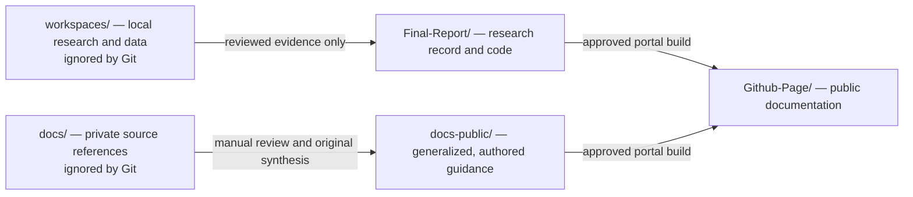
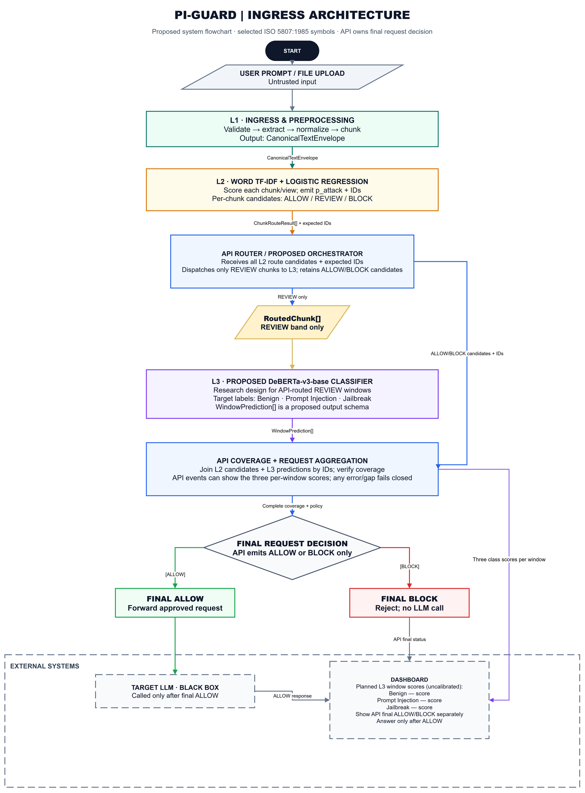

# PI-Guard

A machine-learning guardrail for detecting prompt injection and jailbreak attacks on LLM applications. PI-Guard is an academic capstone project at FPT University (IAP491), currently working through Review 2.

## Current project state — 9 October 2026

Review 2 is active. The candidate dataset and its frozen split are versioned as research metadata and reproducibility scripts; prompt payloads and experiment runs remain local-only. The split does not establish that a model has been trained, evaluated, or accepted against project targets.

## Project and repository timeline

The timeline separates research milestones from repository changes. Proposed components remain proposals until implemented and supported by measured evidence.

| Period | Research and architecture | Repository state |
|---|---|---|
| 29 August–3 September 2026 | Project kickoff and initial problem framing: inspect requests at an application boundary before forwarding them to a downstream language model. | The repository began on 1 September. The research record and documentation portal were established during the first week. |
| 4–10 September 2026 | Literature review, prompt injection and jailbreak taxonomy, threat model, and Review 1 scope. | The repository was reorganized around `Final-Report/` for shared research records, `Github-Page/` for public documentation, and `workspaces/` for local work. |
| 11 September–3 October 2026 | Review 1 research refined the proposed ingress flow: normalize and split input, score chunks, route uncertain cases for deeper review, and aggregate a request-level decision. | Research reports and the public portal recorded the proposal and its limits. Review 1 concluded on 3 October; the flow remains a proposal. See the [public threat model](Github-Page/thesis/review1_threat_model.md) and [ingress architecture](Github-Page/models/ingress_architecture.md). |
| 5 October 2026 | The proposed ingress diagram and its public preview were synchronized. | The editable diagram and canonical image were consolidated under `Final-Report/reports/`. |
| 9 October 2026 — current | Review 2 preparation: a candidate dataset split was versioned. Label review, model training, real inference, and held-out evaluation remain open. | The repository contains the split-generation and verification code plus manifests; data payloads stay local. See the [dataset status](Github-Page/dataset_study/dataset_initialization_v5.md). |
| Next | Review label provenance, train and run the project model on the frozen split, measure attack recall, false-positive rate, and P95 latency, then integrate the API and dashboard against verified outputs. | Promote only reviewed evidence into `Final-Report/`, then synchronize its approved public summary to `Github-Page/`. |

## Repository architecture

```mermaid
flowchart LR
    privateDocs["docs/ — private source references<br/>ignored by Git"] -->|manual review and original synthesis| publicBridge["docs-public/ — generalized, authored guidance"]
    localResearch["workspaces/ — local research and data<br/>ignored by Git"] -->|reviewed evidence only| report["Final-Report/ — research record and code"]
    report -->|approved portal build| portal["Github-Page/ — public documentation"]
    publicBridge -->|approved portal build| portal
```

The portal builder does not read from private `docs/` or publish local workspace content. `docs-public/` contains project-authored general guidance, not copies of the private source documents.

## Proposed ingress architecture

This is the page 2 vertical-summary export from the canonical eight-page [editable Draw.io source](Final-Report/reports/PI_GUARD_INGRESS_ARCHITECTURE.drawio). Its single PNG source is in [Final-Report/reports](Final-Report/reports/PI_GUARD_INGRESS_ARCHITECTURE.png).

The figure is a Review 1 research architecture proposal. L1 validates, normalizes, and splits input into identified chunks/views. L2 emits one route candidate per chunk: ALLOW candidate, REVIEW, or BLOCK candidate. The API sends REVIEW chunks to L3 and combines L2 candidates with L3 predictions by IDs and coverage. Planned dashboard events show L3's Benign, Prompt Injection, and Jailbreak scores per window, apart from the API's final request-level ALLOW or BLOCK. Only final ALLOW is forwarded to a downstream LLM. Training, label-overlap rules, and evaluation are separate research steps; the figure reports no trained three-label result.

The diagram uses symbolic tau_allow and tau_block parameters. They are assumptions in the proposal, not established project-wide or service cutoffs. The architecture remains a proposal, not an implementation claim.

The [ISO 5807:1985 symbol audit](Final-Report/reports/ISO_5807_1985_SYMBOL_AUDIT.md) documents the flowchart shapes, icon conventions, and the limits of the available standards preview.

## Repository map

- [Final-Report](Final-Report/README.md): shared academic deliverables and official progress materials.
- [workspaces](workspaces/README.md): explains the local-only workspace policy; no personal workspace is published here.
- [Documentation portal](Github-Page/index.md): project introduction and research topics.
- [Project governance](AGENTS.md): scope, provenance, and repository maintenance rules.

## Repository maintainer

Nguyễn Văn Trường (`nvtruongops`) is the sole current maintainer and publisher of this repository. `Final-Report/` and `Github-Page/` contain the group capstone progress reports and research outcomes that he consolidates and publishes. Member names in those reports record project progress; they do not mean those members currently maintain or contribute to this Git repository. His research notes, experiments, and drafts stay in the ignored local workspace `workspaces/truongnv/`. Historical Git commit records remain part of the repository history.

## Documentation portal

Install the repository dependencies, then run the portal builder and strict site build from the repository root:

    python Final-Report/scripts/build_docs_portal.py
    mkdocs serve
    mkdocs build --strict

The documentation source and deployment workflow are described in [Github-Page/README.md](Github-Page/README.md).
