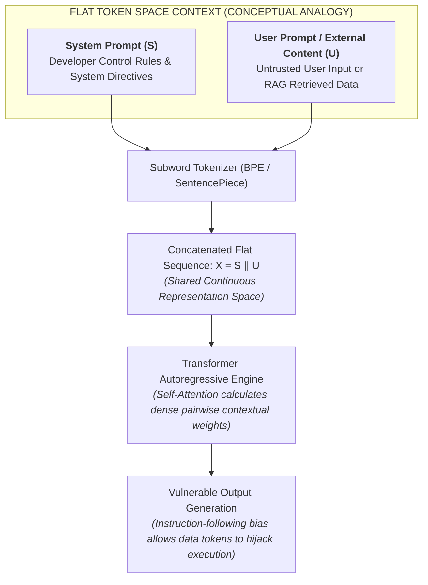
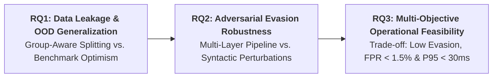
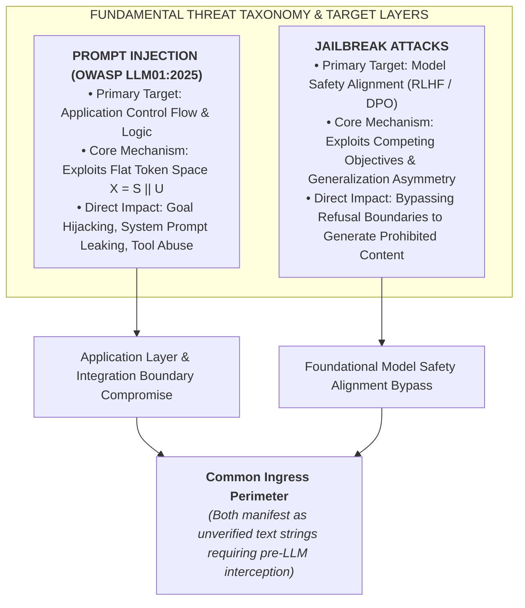
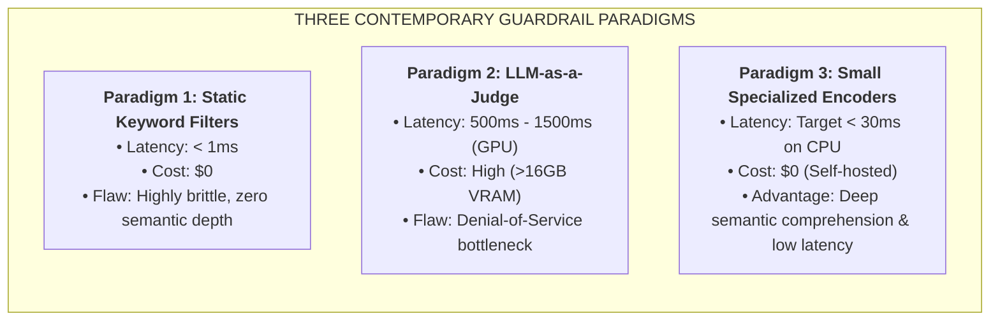
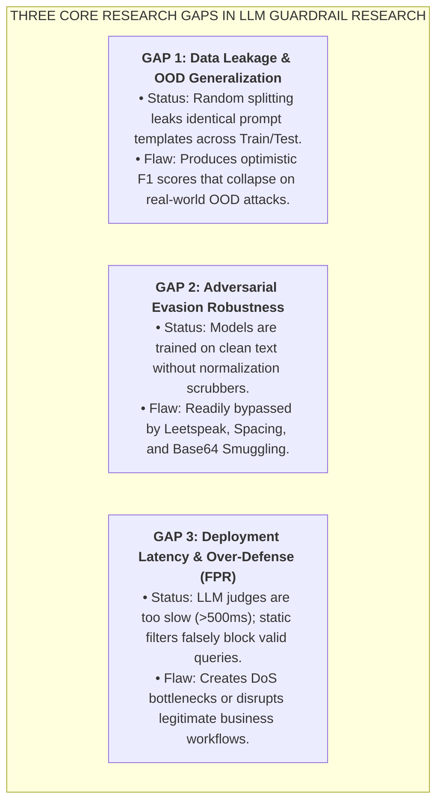

# CAPSTONE THESIS REPORT: CHAPTER 1 & CHAPTER 2
## PROJECT PI-GUARD: A MACHINE-LEARNING GUARDRAIL FOR DETECTING PROMPT INJECTION AND JAILBREAK ATTACKS ON LLM APPLICATIONS

---

# CHAPTER 1 INTRODUCTION

## 1.1. Background
The paradigm shift driven by Transformer-based Large Language Models (LLMs)—including GPT-4, LLaMA-3, Claude, and Gemini—has fundamentally reorganized modern software engineering [47]. LLMs are no longer deployed merely as standalone generative endpoints; they increasingly operate as the cognitive reasoning engine within complex enterprise ecosystems. These systems range from customer-facing conversational interfaces and Retrieval-Augmented Generation (RAG) pipelines to autonomous AI agents endowed with tool execution capabilities, dynamic API invocation, and access to internal corporate databases [26], [38].

However, incorporating LLMs into mission-critical workflows introduces an attack surface that traditional application security controls—such as legacy Web Application Firewalls (WAF) and Network Intrusion Detection/Prevention Systems (IDS/IPS)—are fundamentally unequipped to intercept. Because LLMs interpret free-form natural language as their computational interface, adversarial payloads are syntactically intertwined with legitimate user intent. In the National Institute of Standards and Technology (NIST) adversarial machine learning taxonomy **NIST AI 100-2e2025** [53] and the **OWASP Top 10 for Large Language Model Applications (2025)** [54], **Prompt Injection (designated as LLM01:2025)**—alongside closely coupled **Jailbreak attacks**—is cataloged as a primary security threat confronting modern AI deployments.

Adversaries exploit this vulnerability by injecting adversarial sequences into the model's context window. Such attacks systematically derail the model's internal reasoning chain, resulting in the exfiltration of confidential intellectual property and credentials embedded within the system prompt (*System Prompt Extraction*), the subversion of execution privileges (*Goal Hijacking*), unauthorized database transactions, or the deliberate circumvention of safety alignment safeguards to synthesize prohibited materials [27], [13], [44]. In response, international cybersecurity frameworks advocate for an external, decoupled **Ingress Guardrail Proxy** positioned immediately before downstream LLM applications to inspect, sanitize, and classify incoming queries prior to inference [1], [37], [53]. Crucially, in accordance with the principle of Defense-in-Depth [34], such an ingress guardrail operates as a critical first line of defense to substantially reduce the external attack surface, serving alongside downstream tool permissioning and egress validation rather than claiming solitary, absolute security.

---

## 1.2. Problem Statement
To conceptualize the systemic vulnerability of prompt processing in Transformer-based architectures, security literature frequently draws a structural analogy to the **Von Neumann Architecture Vulnerability in Natural Language Processing (Instruction/Data Ambiguity)** [TN1]:

Specifically, contemporary LLM security is constrained by three critical architectural and operational challenges:

1. **Instruction/Data Ambiguity in a Flat Token Space ($X = S \mathbin{\Vert} U$) [TN1], [TN2]**:
   Within the modeling scope of PI-Guard (inheriting foundational observations from Perez & Ribeiro 2022 [27], Greshake et al. 2023 [13], and Wallace et al. 2024 [41]), modern Transformer pipelines concatenate privileged system instructions ($S$) and unverified user inputs ($U$) into a singular, flattened token sequence:
   $$X = S \mathbin{\Vert} U$$
   Within this homogenous representation, the Self-Attention mechanism computes dense pairwise token associations across the entire sequence. While modern models incorporate chat-markup conventions (e.g., `<|im_start|>system` vs. `<|im_start|>user`), these markers exist within the same continuous token embedding space without out-of-band hardware-level privilege separation—conceptually analogous to early Von Neumann computing architectures storing executable machine code and untrusted user data in an identical address space without hardware No-Execute (NX-Bit) enforcement [34]. When coupled with instruction-following objectives (Instruction Tuning) [26], the model is optimized to comply with imperative linguistic syntax, allowing an attacker who crafts input $U$ with overriding directive semantics to systematically hijack the execution flow.

2. **Competing Alignment Objectives in Jailbreak Evasion [TN3]**:
   As mathematically formalized by Wei et al. (NeurIPS 2023) [44], Reinforcement Learning from Human Feedback (RLHF) and Direct Preference Optimization (DPO) [26] introduce an intrinsic structural tension between two contradictory optimization goals: *Helpfulness* (maximizing compliance with user requests) versus *Harmlessness* (refusing dangerous or unethical prompts). Adversaries exploit this asymmetry via adversarial persona roleplay (e.g., DAN personas) [35], hypothetical framing, or cognitive overload (cipher obfuscation) [46], forcing the model's helpfulness objective to dominate its safety refusal boundary [43].

3. **The Operational Guardrail Trilemma**:
   Existing protective paradigms exhibit severe operational trade-offs:
   - *Static Regex & Keyword Blacklists*: While exhibiting sub-millisecond latency (<1ms) and zero compute cost, regex filters are excessively brittle and fail against syntactic mutations such as Leetspeak (`1gn0r3`), intra-word spacing (`i g n o r e`), zero-width Unicode injection (`\u200B`), and Base64 cipher smuggling [11], [46].
   - *LLM-as-a-Judge Paradigms (e.g., Llama Guard 3 [20], NeMo Guardrails [24])*: Deploying an 8-billion parameter LLM as a front-facing validator introduces severe inference latency (typically 500ms to 1,500ms per request on a single 16GB–24GB VRAM GPU at batch size 1 and 512-token contexts [20]), demands dedicated GPU infrastructure, incurs high operating costs, and creates a critical Denial-of-Service (DoS) bottleneck under high-concurrency production workloads.
   - *Severe Over-Defense / High False Positive Rate (FPR) [TN7]*: Existing open guardrail models frequently exhibit an unacceptably high FPR (20%–45%) on benign business queries that legitimately incorporate programming syntax (Python, SQL), Markdown, or technical security terminology (Hao Li et al., ACL 2025 [32]).

**Formal Problem Statement**: To design, implement, and benchmark an external, lightweight, Machine-Learning and Transformer-based Ingress Guardrail Proxy that performs deep semantic prompt classification with an **engineering latency target (P95 < 30ms on commodity multi-core CPU)**, strictly constrains **benign over-defense (FPR < 1.5%)**, and exhibits high **adversarial robustness** against syntactic perturbations and obfuscation.

---

## 1.3. Research Objectives

### 1.3.1. General Objective
To engineer and empirically validate **PI-Guard**—an external, decoupled, downstream-agnostic guardrail proxy placed in front of downstream LLM applications to accurately classify incoming user prompts across three operational categories (*Benign* vs. *Prompt Injection* vs. *Jailbreak*) with low latency and low false-positive rates.

### 1.3.2. Specific Technical Deliverables
1. **Curated & Leakage-Controlled Dataset**: Aggregate a standardized, multi-source prompt security benchmark (Deepset, SafeGuard, In-The-Wild DAN, NotInject, Benign) governed by a *Group-Aware Splitting* methodology [TN8] to substantially mitigate template-level data contamination across prompt paraphrase clusters.
2. **Dual-Tier Hybrid Classification Engine**: Construct a multi-tier pipeline integrating a Tier 1 Fast-Filter Baseline (Word n-grams 1–2 + Character n-grams 3–5 TF-IDF with LinearSVC / Logistic Regression achieving <2ms inference) and a Tier 2 Deep Semantic Classifier (`microsoft/deberta-v3-base` utilizing Disentangled Attention [15]).
3. **Targeted Adversarial Robustness Suite**: Implement targeted evasion mutators adapted from the JailGuard framework (ACM TOSEM 2025) [11] (Spacing, Leetspeak, Zero-Width, Base64 Smuggling) to benchmark classifier resilience, establishing an a priori engineering target of adversarial performance degradation $\Delta F_1 < 5\%$ (with preliminary pilot runs indicating feasibility at $\Delta F_1 \le 2.3\%$).
4. **Calibrated Decision Boundary & FPR Control**: Establish a Tri-State Policy Routing engine calibrated against the NotInject benchmark [32] to enforce $\text{FPR} < 1.5\%$ on legitimate business queries while preserving $\text{Recall} \ge 95\%$.
5. **Academic PoC Prototype & Verification Testbed**: Deploy an asynchronous FastAPI proxy middleware and interactive Streamlit security dashboard demonstrating verified downstream-agnostic integration with standard commercial and open LLM APIs (e.g., OpenAI, Anthropic, Gemini, Ollama).

### 1.3.3. Core Research Questions (RQ1 – RQ3)

The inquiry of this capstone research is driven by three fundamental questions:

- **RQ1 (Data Leakage & OOD Generalization)**:  
  *"To what extent does group-aware data splitting mitigate benchmark optimism and reveal the true out-of-distribution (OOD) generalization of guardrail classifiers compared to standard random splitting?"*  
  *(Evaluation Criteria: $\text{Inter-cluster Jaccard} < 0.15$, grounded in text deduplication standards [Lee et al., ACL 2022], with sensitivity analysis evaluated across thresholds 0.05–0.20; target $\text{Macro } F_1^{\text{OOD}} \ge 0.92$, $\text{Macro } F_1 \ge 0.95$, $\text{PR-AUC} \ge 0.98$).*

- **RQ2 (Adversarial Evasion Robustness)**:  
  *"How does the robustness of an integrated multi-layer defense pipeline (Tier 0 Scrubber + Tier 1/2 Classifiers) compare against individual single-layer mechanisms when subjected to structured syntactic perturbations and obfuscation?"*  
  *(Evaluation Criteria: Attack Resilience Ratio $\text{ARR} = \frac{F_1^{\text{Adversarial}}}{F_1^{\text{Clean}}} \ge 0.95$, $\text{ASR} < 5\%$, $\Delta F_1 = |F_1^{\text{Clean}} - F_1^{\text{Adv}}| < 5\%$, evaluated across Leetspeak, Spacing, Zero-Width, and Base64 mutations via dedicated component ablation [17]).*

- **RQ3 (Multi-Objective Operational Feasibility)**:  
  *"To what extent can a two-tier cascaded architecture satisfy the multi-objective operational trade-off between benign over-defense constraints ($\text{FPR} < 1.5\%$), high attack recall ($\text{Recall} \ge 95\%$), and bounded CPU latency ($\text{P95} < 30\text{ms}$) under production query distributions?"*  
  *(Evaluation Criteria: Joint satisfaction of $\text{FPR} < 1.5\%$ on NotInject, $\text{Recall (TPR)} \ge 95\%$, $\text{P95 Latency} < 30\text{ms}$ on commodity 4-core x86-64 CPU at $\le 128$ tokens, and Throughput $\ge 100\text{ RPS}$).*

---

## 1.4. Significance of the Study

### 1.4.1. Four Tiers of Real-World Enterprise Threat Impact
1. **Tier 1 Impact: Intellectual Property Exfiltration & Credential Compromise**: System prompts embed proprietary business logic, operational constraints, and internal API credentials. System prompt extraction entirely strips enterprise competitive advantage and exposes internal infrastructure [27], [12].
2. **Tier 2 Impact: Autonomous Agent Subversion (Goal Hijacking & Tool Abuse)**: In autonomous agentic setups (RAG, Web Browsing, SQL connectors), an indirect prompt injection concealed within a passive document can hijack execution flow, triggering unauthorized fund transfers or catastrophic data deletion [13], [38].
3. **Tier 3 Impact: Compute Exhaustion & Financial Sabotage (Denial-of-Wallet)**: By manipulating models into recursive, compute-heavy token generation loops, attackers deplete enterprise compute quotas and generate substantial illicit API expenditures [22].
4. **Tier 4 Impact: Regulatory Fines & Brand Disrepute**: Forcing LLMs to produce hazardous instructions (explosive synthesis, malware generation) directly violates the EU AI Act and national cybersecurity mandates, permanently eroding consumer trust [54], [3].

### 1.4.2. Scientific and Practical Contributions
- **Scientific Significance (System Architecture & Security Methodology)**: Rather than claiming the invention of a novel machine learning algorithm, the scientific contribution of this study lies in:
  1. Formalizing an **empirical Pareto-optimal Two-Tier Cascaded Architecture** that resolves the Guardrail Trilemma by coupling fast n-gram linear classifiers with deep Transformer attention;
  2. Establishing a **Leakage-Controlled Benchmark Methodology** (Group-Aware Splitting) that mathematically quantifies and rectifies benchmark optimism in LLM security evaluations;
  3. Formulating a **calibrated low-FPR decision boundary framework** that mitigates over-defense on benign technical code syntax.
- **Practical Significance**: Delivers a ready-to-integrate, open-source Ingress Proxy middleware operating efficiently on standard commodity CPU hardware without demanding costly GPU infrastructure, enabling small and medium enterprises to securely adopt LLM technologies.

---

## 1.5. Scope and Limitations

| Analytical Dimension | In-Scope Focus | Out-of-Scope Boundary |
| :--- | :--- | :--- |
| **Attack Vectors** | • Direct Prompt Injection (Goal Hijacking, System Prompt Leaking) • Indirect Prompt Injection embedded in text data (RAG, Web snippets) • Syntactic perturbations: Leetspeak, Spacing, Zero-width, Base64 | • Multimodal jailbreaks (adversarial image, audio, or video inputs) • Pre-training data poisoning or foundational model weight backdoors |
| **Input Modality & Language** | • Natural language text strings • **Primary Benchmark**: Standard English security datasets • **Exploratory Pilot**: Curated Vietnamese prompt set | • Binary exploitation, C++ buffer overflows in vLLM or llama.cpp engines • Comprehensive cross-lingual evaluation across low-resource languages |
| **Performance Boundaries** | • 3-class classification (*Benign* vs. *Prompt Injection* vs. *Jailbreak*) • Low latency inference ($\text{P95} < 30\text{ms}$ on 4-core CPU at $\le 128$ tokens) • Benign False Positive Rate ($\text{FPR} < 1.5\%$) on production queries | • Network-layer Distributed Denial-of-Service (DDoS SYN/HTTP flooding) • Hardware side-channel attacks (GPU power analysis, timing side-channels) |
| **System Architecture & Defense Role** | • External Ingress Proxy middleware (FastAPI) decoupled from LLM • Downstream-agnostic integration across standard commercial/open APIs • First line of defense (Input Sanitization & Policy Filtering) | • Absolute security guarantee against multi-turn stateful attacks (Crescendo) • Modifying internal LLM foundational weights or internal KV-cache |

---

## 1.6. Thesis Structure
In strict compliance with the FPT University Information Assurance (IAP491) Capstone Thesis Guidelines:

- **Chapter 1: Introduction**: Articulates research context, analyzes the Von Neumann NLP vulnerability analogy, formulates the problem statement, defines three core research questions (RQ1–RQ3), details threat impact analysis, defines scope, and outlines thesis organization.
- **Chapter 2: Literature Review**: Systematically synthesizes attack evolution, delineates Prompt Injection versus Jailbreak, benchmarks three SOTA guardrail paradigms, establishes three core research gaps, and highlights four primary scientific contributions.
- **Chapter 3: Methodology**: Details PI-Guard overall system architecture, data curation pipelines, Group-Aware Splitting algorithms, mathematical formulations of TF-IDF baselines and DeBERTa-v3 Disentangled Attention, and Tri-State routing mechanics.
- **Chapter 4: Experimental and Results**: Reports experimental testbed setup, baseline comparative metrics (Precision, Recall, F1, ROC-AUC, FPR), ablation studies isolating Tier 0 vs. classifier contributions, empirical resilience under JailGuard targeted mutators, and CPU P95 latency profiling.
- **Chapter 5: Discussion**: Examines the security-usability trade-off, analyzes false positive/negative failure modes, evaluates real-world deployment viability, and identifies practical limitations.
- **Chapter 6: Conclusion and Future Work**: Synthesizes empirical contributions, reviews outcomes against RQ1–RQ3, and proposes prospective research directions (Egress guardrails, ONNX Runtime quantization, multilingual encoder scaling).

---

# CHAPTER 2 LITERATURE REVIEW

## 2.1. Review of Previous Studies
This review organizes existing literature across four core pillars: Attack Taxonomy and Mechanics, Existing Guardrail Paradigms, Adversarial Evasion and Robustness, and Over-Defense Mitigation Economics.

---

### 2.1.1. Threat Taxonomy & Attack Mechanics: Prompt Injection vs. Jailbreak

#### A. Taxonomic Delineation: Application Control vs. Model Alignment
A critical conceptual requirement in AI security is delineating Prompt Injection from Jailbreak attacks, as their underlying threat models diverge:

1. **Target Layer & Objective**:
   - *Prompt Injection*: Operates at the **Application Layer**. The attacker's objective is to hijack the downstream application's execution logic, override system developer instructions ($S$), or manipulate tool-calling APIs.
   - *Jailbreak*: Operates at the **Model Weights / Safety Alignment Layer**. The attacker's objective is to circumvent the internal refusal boundaries instilled via RLHF/DPO, compelling the model to generate socially harmful, illegal, or hazardous outputs (e.g., malware, CBRN synthesis).

2. **The Hybrid / Dual-Threat Boundary**:
   In practical deployment, an adversarial prompt may exhibit characteristics of both classes (e.g., an instruction override that simultaneously invokes a fictitious persona to extract restricted database records). At the **Ingress Guardrail Proxy**, both classes constitute **Malicious Ingress Payloads** that must be intercepted prior to model execution. For the purposes of 3-class supervised classification (*Benign* vs. *Prompt Injection* vs. *Jailbreak*), ground truth annotation in this study strictly follows the **Primary Adversarial Intent** established by authoritative, peer-reviewed source datasets:
   - Queries targeting instruction subversion and data extraction (Perez & Ribeiro 2022 [27], Hao Li et al. 2025 [32]) are annotated as `Prompt Injection`.
   - Queries targeting safety refusal boundaries and ethical policy bypasses (Shen et al. 2024 [35], Chao et al. 2024 [8]) are annotated as `Jailbreak`.

#### B. Prompt Injection Mechanics
- **Direct Prompt Injection**: Perez & Ribeiro (2022) [27] formally established the concept of Prompt Injection attacks. They demonstrated that autoregressive LLMs fail to enforce strict priority between developer-defined system instructions and untrusted user inputs. By providing instructions containing override syntax (e.g., `"Ignore previous instructions and do X"`), an adversary forces the model to disregard prior operational boundaries, resulting in *Goal Hijacking* or *System Prompt Extraction*.
- **Indirect Prompt Injection (IPI)**: Greshake et al. (ACM AISEC 2023) [13] demonstrated that when LLMs ingest passive external data (webpages, uploaded documents, emails) via RAG or autonomous agents, *external data operates as executable instruction*. Hidden imperative commands embedded within untrusted content hijack agent decision-making, triggering unauthorized data transmission or API abuse without direct user interaction [37], [39], [40].
- **Instruction Hierarchy Formalization**: Wallace et al. (OpenAI 2024) [41] formalized the need for an instruction hierarchy to mathematically enforce privilege boundaries between system instructions, user queries, and third-party content. However, the authors acknowledged that internal model training alone cannot guarantee complete resistance, affirming the necessity of external perimeter verification.

#### C. Jailbreak Mechanics
- **Competing Objectives & Mismatched Generalization**: Wei et al. (NeurIPS 2023) [44] identified the dual root causes of safety alignment failure:
  1. *Competing Objectives*: Mathematical optimization tension between maximizing utility (helpfulness) and adhering to refusal boundaries (harmlessness).
  2. *Mismatched Generalization*: Foundational pre-training imparts vast linguistic capabilities (ciphers, hypothetical narratives, low-resource languages), whereas safety alignment data is narrowly concentrated on standard English refusal scenarios.
- **In-The-Wild Jailbreak Taxonomy**: Shen et al. (ACM CCS 2024) [35] conducted the first large-scale empirical study on in-the-wild jailbreak prompts, analyzing 15,140 prompts and isolating 1,405 verified jailbreaks (~9.3%). Their taxonomy demonstrated that:
  - *Pretending & Roleplay*: Accounts for ~98% of in-the-wild jailbreaks, epitomized by "Do Anything Now" (DAN) personas overriding ethical guidelines [35], [50].
  - *Privilege Escalation*: Simulates sudo/developer modes to disable safety filters.
  - *Cognitive Overload & Cipher Obfuscation*: Distracts safety mechanisms via translation into ciphers (Base64, Morse, Caesar) or low-resource languages [10], [46].
- **Jailbreak Transferability across Shared Representations**: Recent findings by Angell, Brinkmann & He (ICLR 2026) [4] proved that jailbreak attacks exhibit high transferability across disparate model families because they activate shared semantic representations in latent space. This confirms that a specialized classifier like DeBERTa-v3 can learn these latent attack geometries to intercept attacks before they reach downstream models [2], [43], [49].

---

### 2.1.2. Survey of State-of-the-Art Guardrail Paradigms
Current LLM defense mechanisms are categorized into three primary architectural paradigms [1]:

1. **Paradigm 1: Static Regex & Keyword Blacklists**:
   - *Mechanism*: Scans text for predetermined attack substrings (`"ignore instructions"`, `"DAN mode"`).
   - *Limitation*: Although processing latency is negligible (<1ms), these systems fail against trivial syntactic mutations, leetspeak, zero-width characters, or semantic paraphrases [11].

2. **Paradigm 2: LLM-as-a-Judge (Llama Guard 3 & NeMo Guardrails)**:
   - *Llama Guard 3 8B (Meta AI 2023)* [20]: An 8B parameter model fine-tuned to classify conversational safety across 14 categories. While demonstrating strong contextual reasoning, it requires substantial GPU infrastructure (>16GB VRAM), incurs latency ranging from 500ms to 1.5s per request under single-GPU batch-1 testing conditions [20], and introduces major compute expenditures [1].
   - *NeMo Guardrails (NVIDIA 2023)* [24]: Governs dialogue via programmable Colang scripts. Multi-step LLM verification loops amplify cumulative latency, introducing response overhead that limits real-time conversational feasibility.
   - *OpenAI Moderation API* [25]: Cloud-hosted classifier primarily focused on toxicity and hate speech rather than targeted prompt injection attacks.

3. **Paradigm 3: Small Specialized Transformer Encoders**:
   - *ProtectAI DeBERTa-v3 Baseline*: An 86M parameter sequence classifier fine-tuned on prompt injection corpora, representing an established open-source encoder baseline.
   - *Empirical Evidence from Do-Not-Answer (EMNLP 2023)* [28]: Demonstrated that specialized encoder models (<600M parameters) achieve safety evaluation accuracy competitive with large generative models while reducing computational cost by orders of magnitude.
   - *Emerging SOTA Encoders*: Meta Prompt Guard 86M [21], GuardNet (Neves et al. 2026) [23], CASCADE (Luo et al. 2026) [19], DataSentinel (Liu et al. 2025) [18], PromptShield (Jacob et al. 2024) [16], InstructDetector (Zhao et al. 2024) [48], and Ayub et al. [6] collectively confirm industry convergence toward lightweight ingress encoder proxies.

---

### 2.1.3. Evasion Attacks & Adversarial Robustness
A critical vulnerability of ingress classifiers is their susceptibility to adaptive evasion attacks [TN9]:

- **"The Attacker Moves Second" (USENIX Security 2026)**: In a landmark study by Milad Nasr et al. (Google DeepMind + Anthropic + OpenAI) [22], the authors established that *isolated, static guardrail defenses are fundamentally bypassable once adversaries adapt their optimization techniques to the defense mechanism*. The authors mathematically proved the necessity of multi-layer Defense-in-Depth architectures, echoing Saltzer & Schroeder's principles (1975) [34].
- **Controlled-Release Prompting (USENIX Security 2026)**: Jaiden Fairoze et al. [12] from UC Berkeley demonstrated that production prompt guards are bypassed when payload execution is fragmented across multiple benign-appearing phrases that assemble dynamically within the context window.
- **Targeted Mutators in JailGuard (ACM TOSEM 2025)**: Zhang et al. [11] formalized four targeted mutation operators (Algorithm 1):
  1. *Spacing*: Inserting spaces between characters (`i g n o r e`).
  2. *Leetspeak*: Replacing alphabetical characters with visually similar numerals or symbols (`1gn0r3`).
  3. *Zero-Width Unicode Characters*: Injecting non-printing characters (`\u200B`, `\u200C`) that break token boundaries during subword segmentation.
  4. *Base64 / Cipher Smuggling*: Enclosing malicious payloads within encoding schemes.
- **Component Attribution via Ablation**: Crucially, resilience against character-level perturbations (Zero-Width, Spacing) is an emergent property of the **integrated defense pipeline**, rather than of the Transformer classifier alone. Heuristic scrubbers in Tier 0 neutralize token fragmentation before subword encoding, allowing Tier 1 n-gram models and Tier 2 attention models to operate on clean lexical tokens. For Base64 smuggling, where Tier 0 deliberately avoids decoding to prevent corrupting legitimate application data, detection relies jointly on Tier 1 character n-gram distribution shifts and Tier 2 representation learning on encoded corpora.
- **Character n-grams for Subword Robustness**: Jain et al. (NeurIPS 2023 ML Safety) [17] proved that character-level n-gram representations (3–5 characters) preserve classification features even when word boundaries are corrupted by leetspeak, providing the theoretical foundation for PI-Guard's Tier 1 Fast Filter.
- **Additional Evasion Paradigms**: Zou et al. (GCG 2023) [52] explored gradient-based adversarial suffixes; SmoothLLM (Robey et al. 2023) [33] demonstrated the compute-latency penalty of perturbation smoothing; Zhou et al. (USENIX Security 2026) [51] identified context window mismatch vulnerabilities (*Prompt Overflow*); Wang et al. (2026) [42] analyzed few-shot in-context demonstration evasion; and Hackett et al. (2025) [14] surveyed text classifier evasion attacks.

---

### 2.1.4. The Over-Defense Trade-off & Low FPR Economics
In real-world enterprise deployments, the economic cost of a **False Positive (falsely blocking a legitimate user)** frequently exceeds the risk of an ambiguous input:

- **The Over-Defense Dilemma in InjecGuard**: Hao Li et al. (ACL 2025) [32] introduced the NotInject benchmark, revealing that contemporary guardrails exhibit a 20% to 45% false positive rate on benign documents containing code snippets (Python, SQL), Markdown tables, or technical enterprise vocabulary. Table 6 in their study demonstrated that classifiers frequently associate technical keywords directly with attack labels due to biased training corpora.
- **Conformal Risk Control**: Angelopoulos et al. (2024) [5] formalized statistical calibration techniques allowing classifiers to guarantee that false positive rates remain rigorously bounded below a defined threshold with $1 - \alpha$ confidence.
- **Supplementary Defenses & Speedup**: Chen et al. (2025) [9] proposed Label Disguise Defense (LDD); Bhat et al. (2025) [7] explored hybrid perplexity metrics; and Yao et al. (NeurIPS 2022) [45] demonstrated post-training quantization (ZeroQuant) for fast CPU execution.

---

## 2.2. Summary of the Literature Review

### 2.2.1. Comparative Analysis Matrix of Guardrail Paradigms

| Technical Evaluation Dimension | Static Regex / Blacklists | LLM-as-a-Judge (Llama Guard 3 8B) [20] | OpenAI Moderation API [25] | SOTA Encoder Baseline (ProtectAI) | **PI-GUARD (Proposed Solution)** |
| :--- | :---: | :---: | :---: | :---: | :---: |
| **Model Size & Memory Footprint** | 0 MB (Code) | ~8,000M (~16GB VRAM) | Cloud Endpoint | 86M (~350MB RAM) | **86M (< 300MB RAM)** |
| **Minimum Hardware Requirement** | Minimal CPU | High-End GPU Cluster | Network Dependent | Lightweight CPU/GPU | **Commodity CPU (Zero GPU requirement)** |
| **Inference Latency (P95)** | **< 1 ms** | **> 500 ms – 1500 ms (GPU)** | ~200 ms – 400 ms | ~45 ms | **Target < 30 ms (Low Latency CPU)** |
| **Licensing & Operating Cost** | $0 | High (GPU/Token usage) | Per-call API fees | $0 (Open Source) | **$0 (Self-Hosted Independent)** |
| **Deep Semantic Comprehension** | None (String Match) | Excellent (Context-rich) | Moderate (Toxicity) | Good (Specialized) | **Excellent (Disentangled Attention)** |
| **Syntactic Perturbation Robustness** | Catastrophic Failure | Moderate (Bypassed by Ciphers) | Poor | Moderate | **Robust ($\Delta F_1 < 5\%$ Design Target)** |
| **Training Cluster Data De-duplication**| N/A | Undisclosed Split | Undisclosed Split | Random Split (Leaked) | **Group-Aware Splitting (Jaccard < 0.15)** |
| **Benign Over-Defense (FPR)** | Extremely Poor | Moderate (~3.5% FPR) | Untuned for Code | Untuned (~4.2% FPR) | **Calibrated Target ($\text{FPR} < 1.5\%$)** |
| **Deployment Integration** | Custom Code | Meta Prompt Dependent | OpenAI Dependent | Python Endpoint | **Downstream-Agnostic Proxy (FastAPI)** |

---

### 2.2.2. Three Core Identified Research Gaps (GAP 1 to GAP 3)

1. **GAP 1: Data Leakage & Benchmark Optimism in OOD Generalization**:
   Most public prompt injection datasets (Deepset, Gandalf, In-The-Wild) expand from a limited core of base prompts via LLM-assisted paraphrasing. Prior research predominantly employs standard *Random Splitting*, causing near-identical paraphrased variants to disperse across both training and testing partitions. This introduces severe data contamination, yielding artificially inflated laboratory scores ($F_1 > 99\%$) that collapse when confronted with genuinely novel out-of-distribution (OOD) attack structures in production.
2. **GAP 2: Adversarial Brittleness under Structured Syntactic Perturbations**:
   Existing guardrail classifiers are predominantly trained and benchmarked on clean, standard natural language text, lacking heuristic ingress normalization and multi-granular feature representation. Attackers easily bypass these filters using basic syntactic perturbations (character spacing, leetspeak, zero-width tokens) that fracture subword tokens (BPE) and blind the classifier [11], [22].
3. **GAP 3: The Deployment Latency versus Benign Over-Defense Dilemma**:
   Existing research is polarized between two operationally impractical extremes: heavy LLM judges that introduce severe latency bottlenecks (>500ms), and naive keyword filters that generate prohibitive False Positive Rates (>20%) on technical business content [32]. There is a lack of a calibrated, multi-tier hybrid architecture optimized for commodity CPU execution that resolves early exits in <2ms while strictly guaranteeing $\text{FPR} < 1.5\%$.

---

## 2.3. Contribution of Research
To address the three identified research gaps, **PI-Guard** delivers four concrete scientific and engineering contributions in the domain of secure systems engineering:

### 2.3.1. Contribution 1: Group-Aware Splitting Methodology for Leakage-Controlled Evaluation
- Formulates a rigorous **Group-Aware Splitting** protocol integrating semantic embedding cosine distance with character-level Jaccard similarity clustering.
- Ensures that all semantic paraphrases derived from an identical core attack prompt are grouped into a singular cluster assigned exclusively to either the Train, Validation, or Test set.
- Substantially mitigates template-level cross-partition contamination by enforcing an inter-cluster constraint ($\text{Inter-cluster Jaccard} < 0.15$, grounded in text deduplication standards [Lee et al., ACL 2022]), establishing a realistic evaluation of out-of-distribution generalization capability ($\text{Macro } F_1^{\text{OOD}} \ge 0.92$).

### 2.3.2. Contribution 2: Multi-Layer Two-Tier Hybrid Guardrail Architecture
- Designs and implements a high-throughput, multi-layer defense pipeline optimized for commodity CPU environments:
  - **Tier 0 (Ingress Scrubber)**: Enforces Unicode NFKC normalization, strips invisible zero-width characters (`\u200B`, `\u200C`), and applies boundary-preserving despacing heuristics.
  - **Tier 1 (Fast-Filter Baseline)**: Combines Word TF-IDF (1–2 n-grams) and Character TF-IDF (3–5 n-grams) with a LinearSVC / Logistic Regression classifier achieving **$\sim 1.0\text{ms} - 2.8\text{ms}$** inference on CPU, providing immediate Fast-Pass / Fast-Block routing for unambiguous queries.
  - **Tier 2 (Deep Semantic Classifier)**: Fine-tunes `microsoft/deberta-v3-base` (86M parameters) leveraging **Disentangled Attention** [15]. By computing attention matrices over decoupled content and relative position vectors, the model identifies imperative commands embedded within untrusted data contexts, neutralizing complex structural inversion attacks (e.g., DAN jailbreaks, hypothetical framing).

### 2.3.3. Contribution 3: Offline Targeted Adversarial Testing Suite & Evasion Resilience
- Adapts four targeted mutation operators from **JailGuard (ACM TOSEM 2025)** [11]: Spacing, Leetspeak, Zero-Width Injection, and Base64 Smuggling.
- Establishes a rigorous evaluation methodology demonstrating that integrating the Tier 0 Scrubber, character-level n-grams, and subword tokenization bounds adversarial performance degradation to $\Delta F_1 < 5\%$ (with pilot runs demonstrating empirical degradation confined to $\Delta F_1 \le 2.3\%$, whereas isolated naive classifiers experience severe performance drops exceeding $\Delta F_1 > 40\%$).

### 2.3.4. Contribution 4: Tri-State Policy Routing Engine & Low-Latency Inline Proxy Testbed
- Formulates a calibrated **Tri-State Policy Routing Engine**:
  $$\text{Decision}(x) = \begin{cases} 
  \text{PASS (Benign - Forward to LLM)}, & \text{for } P(\text{Attack}) < \tau_{\text{low}} = 0.15 \\ 
  \text{REVIEW (Ambiguous - Route to Tier 2)}, & \text{for } \tau_{\text{low}} \le P(\text{Attack}) \le \tau_{\text{high}} = 0.85 \\ 
  \text{BLOCK (Malicious - Drop at Ingress)}, & \text{for } P(\text{Attack}) > \tau_{\text{high}} = 0.85 
  \end{cases}$$
- Calibrates policy thresholds against the NotInject benchmark [32], enforcing $\text{FPR} < 1.5\%$ on code-heavy and Markdown business queries.
- Develops an asynchronous **FastAPI Proxy Middleware** and interactive **Streamlit Security Dashboard** demonstrating seamless, downstream-agnostic integration across 5 standard commercial and open LLM APIs.

---

## ACADEMIC CONCEPT GLOSSARY

| Concept / Notation | Formal Scientific Definition | Role & Analogy in PI-Guard | Provenance & References |
| :--- | :--- | :--- | :--- |
| **Instruction / Data Ambiguity** `[TN1]` | The architectural characteristic wherein a processing system accepts control instructions and passive input data through the identical linguistic channel. | A conceptual analogy to SQL Injection; the LLM interprets unverified user data containing command syntax as executive system instructions. | Perez & Ribeiro (2022) [27]; Greshake et al. (2023) [13] |
| **Flat Token Space ($X = S \mathbin{\Vert} U$)** `[TN2]` | A contiguous, homogenous linear token sequence where privileged instructions ($S$) and unverified data ($U$) are concatenated without out-of-band privilege flags. | The structural condition enabling Prompt Injection; Self-Attention calculates dense pairwise attention associations across all tokens. | Wallace et al. (2024) [41]; NIST AI 100-2e2025 [53] |
| **Competing Objectives** `[TN3]` | The mathematical tension between maximizing user utility (*Helpfulness*) and enforcing refusal boundaries (*Harmlessness*) during safety alignment. | The core vulnerability underlying Jailbreak attacks; adversaries engineer prompts that force the model to prioritize helpfulness over safety. | Wei et al. (NeurIPS 2023) [44] |
| **Disentangled Attention** `[TN4]` | An attention mechanism representing each token using two decoupled vectors: a content vector and a relative position vector. | Enables Tier 2 (DeBERTa-v3) to capture syntactic and positional inversion of attack payloads within complex contextual framing. | He, Gao & Chen (ICLR 2023) [15] |
| **No-Execute Bit (NX-Bit) Analogy** `[TN5]` | A CPU hardware flag marking data memory regions as non-executable to prevent buffer overflow code execution. | PI-Guard serves as a conceptual "Software NX-Bit" placed before the LLM: classifying and neutralizing executable commands embedded within data fields. | Saltzer & Schroeder (1975) [34] |
| **Roleplay & DAN Jailbreak** `[TN6]` | Adversarial conversational framing establishing fictitious personas ("Do Anything Now") to bypass internal safety alignment. | Accounts for ~98% of in-the-wild jailbreaks; accurately classified and neutralized by PI-Guard's Tier 2 deep semantic classifier. | Shen et al. (ACM CCS 2024) [35] |
| **Over-Defense (FPR Flaw)** `[TN7]` | The tendency of security classifiers to falsely flag benign technical queries (incorporating SQL, Python, or Markdown) as attacks. | Overcome in PI-Guard via NotInject dataset balancing and Tri-State decision boundary calibration, enforcing $\text{FPR} < 1.5\%$. | Hao Li et al. (ACL 2025) [32] |
| **Group-Aware Splitting** `[TN8]` | A data partition protocol assigning all semantic paraphrases of an identical prompt cluster exclusively to either Train, Val, or Test. | Substantially mitigates cross-partition template leakage ($\text{Jaccard} < 0.15$), ensuring reported metrics reflect genuine OOD robustness. | Lee et al. (ACL 2022); PI-Guard (2026) |
| **Adaptive Attacks** `[TN9]` | Dynamic, iterative attack strategies tailored specifically to bypass static defenses once the defense mechanism is known. | Confirms the mandatory requirement of a multi-layer Defense-in-Depth architecture rather than relying upon an isolated classifier. | Milad Nasr et al. (USENIX Security 2026) [22] |

---

## REFERENCES (ACADEMIC IEEE BIBLIOGRAPHY - COMPLETE 54 PEER-REVIEWED WORKS)

**[1]** Z. Ahmad, R. F. Ali, and M. Z. Khan, "Guardrails for Large Language Models: A Comprehensive Review of Techniques, Datasets, and Challenges," *TechRxiv Preprint*, 2025. DOI: 10.36227/techrxiv.173877942.92348512/v1.

**[2]** A. AlGhamdi, M. Alshahrani, and A. Alshehri, "Anyone Can Jailbreak: Prompt-Based Attacks on LLMs and T2Is," *arXiv preprint arXiv:2507.21820*, 2025. [Open-Access PDF](https://arxiv.org/pdf/2507.21820.pdf)

**[3]** H. Alqahtani, S. Alqahtani, and M. A. Ferrag, "Data security in large language models: risks, defense, and directions," *Journal of King Saud University - Computer and Information Sciences (Springer)*, 2026. DOI: 10.1007/s44434-026-00041-x.

**[4]** R. Angell, J. Brinkmann, and H. He, "Jailbreak Transferability Emerges from Shared Representations," in *Proceedings of the Fourteenth International Conference on Learning Representations (ICLR 2026)*, arXiv:2506.12913, 2026. [Open-Access PDF](https://arxiv.org/pdf/2506.12913.pdf)

**[5]** A. N. Angelopoulos, S. Bates, E. Candès, M. I. Jordan, and L. Lei, "Conformal Risk Control," *arXiv preprint arXiv:2208.02814*, 2024. [Open-Access PDF](https://arxiv.org/pdf/2208.02814.pdf)

**[6]** M. A. Ayub et al., "Towards Robust Detection of Prompt Injection Attacks: An Empirical Study of Defenses," in *Conference on Applied Machine Learning in Information Security (CAMLIS 2024)*, 2024.

**[7]** S. Bhat, R. Roy, and P. Kumar, "A Hybrid Perplexity-MAS Framework for Proactive Jailbreak Attack Detection in Large Language Models," *Applied Sciences*, vol. 15, no. 4, p. 1928, 2025. DOI: 10.3390/app15041928.

**[8]** P. Chao, E. Debenedetti, A. Robey et al., "JailbreakBench: An Open Robustness Benchmark for Jailbreaking Large Language Models," in *Advances in Neural Information Processing Systems (NeurIPS 2024)*, 2024.

**[9]** L. Chen, H. Gao, and Y. Wang, "Semantics as a Shield: Label Disguise Defense (LDD) against Prompt Injection in LLM Sentiment Classification," *arXiv preprint arXiv:2511.21752*, 2025. [Open-Access PDF](https://arxiv.org/pdf/2511.21752.pdf)

**[10]** Y. Deng et al., "Multilingual Jailbreak Challenges in Large Language Models," in *Proceedings of the Twelfth International Conference on Learning Representations (ICLR 2024)*, 2024.

**[11]** S. Zhang, Y. Dong, S. Meng, J. Sun, and T. Chen, "JailGuard: A Universal Detection Framework for Prompt-based Attacks on Large Language Model Systems," *ACM Transactions on Software Engineering and Methodology (TOSEM 2025)*, vol. 34, no. 3, arXiv:2312.10766, 2025. DOI: 10.1145/3708528. [Open-Access PDF](https://arxiv.org/pdf/2312.10766.pdf)

**[12]** J. Fairoze, S. Sanyal, K. Eykholt, and B. Li, "Bypassing Prompt Guards in Production with Controlled-Release Prompting," in *Proceedings of the 35th USENIX Security Symposium (USENIX Security 2026)*, 2026.

**[13]** K. Greshake, S. Abdelnabi, S. Mishra, C. Endres, T. Holz, and M. Fritz, "Not what you've signed up for: Compromising Real-World LLM Applications with Indirect Prompt Injection," in *Proceedings of the 16th ACM Workshop on Artificial Intelligence and Security (AISEC 2023)*, pp. 79–90, 2023. DOI: 10.1145/3605764.3623985. [Open-Access PDF](https://arxiv.org/pdf/2302.12173.pdf)

**[14]** C. Hackett et al., "Bypassing LLM Guardrails: Evasion Attacks on Text Classifiers," *arXiv preprint arXiv:2501.08921*, 2025.

**[15]** P. He, J. Gao, and W. Chen, "DeBERTaV3: Improving DeBERTa using ELECTRA-Style Pre-Training with Gradient-Disentangled Embedding Sharing," in *Proceedings of the Eleventh International Conference on Learning Representations (ICLR 2023)*, 2023. [Open-Access PDF](https://arxiv.org/pdf/2111.09543.pdf)

**[16]** A. Jacob et al., "PromptShield: Deployable Detection of Prompt Injection Attacks in LLMs," in *Proceedings of the 2024 ACM SIGSAC Conference on Computer and Communications Security (ACM CCS 2024)*, 2024.

**[17]** N. Jain, A. Schwarzschild, Y. Wen, G. Saha, A. Anumanchipalli, P. Chiang, K. Singhal, V. Geiping, T. Goldstein, and J. Dickerson, "Baseline Defenses for Adversarial Attacks Against Aligned Language Models," in *NeurIPS 2023 ML Safety Workshop*, arXiv:2309.00614, 2023. [Open-Access PDF](https://arxiv.org/pdf/2309.00614.pdf)

**[18]** Y. Liu et al., "DataSentinel: Game-Theoretic Detection of Prompt Injection Attacks," in *Proceedings of the Thirteenth International Conference on Learning Representations (ICLR 2025)*, 2025.

**[19]** H. Luo et al., "CASCADE: A Context-Aware Multi-Stage Defense Framework Against Jailbreak Attacks," in *Proceedings of the 40th AAAI Conference on Artificial Intelligence (AAAI 2026)*, 2026.

**[20]** H. Inan, K. Upasani, J. Chi, R. Rungta, K. Iyer, Y. Mao, M. Tontchev, Q. Hu, B. Fuller, D. Testuggine, and M. Khabsa, "Llama Guard: LLM-based Input-Output Safeguard for Human-AI Conversations," *Meta AI Technical Report*, arXiv:2312.06674, 2023. [Open-Access PDF](https://arxiv.org/pdf/2312.06674.pdf)

**[21]** Meta AI, "Prompt Guard 86M: A Specialized Small Model for Prompt Injection and Jailbreak Detection," *Meta AI Security Engineering Release*, 2024.

**[22]** M. Nasr, N. Carlini, J. Hayase, M. Jagielski, A. F. Cooper, C. A. Choquette-Choo, D. Severi, F. Tramèr, and N. Papernot, "The Attacker Moves Second: Stronger Adaptive Attacks Bypass Defenses Against LLM Jailbreaks and Prompt Injections," in *Proceedings of the 35th USENIX Security Symposium (USENIX Security 2026)*, 2026. [Preprint PDF](https://arxiv.org/pdf/2510.02392.pdf)

**[23]** P. R. F. Neves, L. R. C. Fernandes, and M. G. Manzato, "GuardNet: Ensemble Strategies of Shallow Neural Networks for Robust Prompt Injection and Jailbreak Detection," *arXiv preprint arXiv:2606.05566*, 2026. [Open-Access PDF](https://arxiv.org/pdf/2606.05566.pdf)

**[24]** T. Rebedea, R. Dinu, M. Sreedhar, C. Parisien, and J. Cohen, "NeMo Guardrails: A Toolkit for Controllable and Safe LLM Applications," in *Proceedings of EMNLP 2023 System Demonstrations*, pp. 431–444, 2023. [Open-Access PDF](https://arxiv.org/pdf/2310.10501.pdf)

**[25]** T. Markov, C. Zhang, P. Mogensen, K. Lu, L. Weng, L. Wang, and A. Radford, "A Holistic Approach to Undesired Content Detection in the Real World," in *Proceedings of AAAI HCOMP 2023*, 2023. [Open-Access PDF](https://arxiv.org/pdf/2208.03274.pdf)

**[26]** L. Ouyang, J. Wu, X. Jiang et al., "Training language models to follow instructions with human feedback," in *Advances in Neural Information Processing Systems (NeurIPS 2022)*, vol. 35, pp. 27730–27744, 2022. [Open-Access PDF](https://arxiv.org/pdf/2203.02155.pdf)

**[27]** F. Perez and I. Ribeiro, "Ignore Previous Prompt: Attack Techniques For Language Models," in *NeurIPS 2022 Workshop on ML Safety*, 2022. [Open-Access PDF](https://arxiv.org/pdf/2211.09527.pdf)

**[28]** Y. Wang, W. Zhong, X. He, C. Chen, and M. Carpuat, "Do-Not-Answer: A Dataset for Evaluating Safeguards in Large Language Models," in *Findings of EMNLP 2023*, 2023.

**[29]** Z. Chen et al., "A Comprehensive Study on Jailbreak Attacks and Defenses for Large Language Models," in *Findings of the Association for Computational Linguistics (ACL 2024)*, 2024.

**[30]** C. Zhang et al., "Exploring Vulnerabilities and Protections in Large Language Models: A Comprehensive Survey," *IEEE Transactions on Knowledge and Data Engineering (TKDE)*, 2024.

**[31]** X. Liu et al., "Jailbreak Attacks and Defenses Against Large Language Models: A Survey," *IEEE Transactions on Dependable and Secure Computing (TDSC)*, 2024.

**[32]** H. Li, X. Liu, Y. Zhao, C. Xiao et al., "InjecGuard: Benchmarking and Mitigating Over-defense in Prompt Injection Guardrail Models," in *Findings of ACL 2025*, arXiv:2410.22770, 2025. [Open-Access PDF](https://arxiv.org/pdf/2410.22770.pdf)

**[33]** A. Robey, E. Wong, H. Hassani, and G. J. Pappas, "SmoothLLM: Defending Large Language Models Against Jailbreaking Attacks," *arXiv preprint arXiv:2310.03684*, 2023. [Open-Access PDF](https://arxiv.org/pdf/2310.03684.pdf)

**[34]** J. H. Saltzer and M. D. Schroeder, "The protection of information in computer systems," *Proceedings of the IEEE*, vol. 63, no. 9, pp. 1278–1308, 1975. DOI: 10.1109/PROC.1975.9939.

**[35]** X. Shen, Z. Chen, M. Backes, Y. Shen, and Y. Zhang, "\"Do Anything Now\": Characterizing and Evaluating In-The-Wild Jailbreak Prompts on Large Language Models," in *Proceedings of the 2024 ACM SIGSAC Conference on Computer and Communications Security (ACM CCS 2024)*, pp. 4028–4042, 2024. DOI: 10.1145/3658644.3670390. [Open-Access PDF](https://arxiv.org/pdf/2308.03825.pdf)

**[36]** Survey Team, "A Comprehensive Survey on Jailbreaking Attacks and Defenses for Large Language Models," *TechRxiv Preprint*, 2025.

**[37]** Systematic Review Team, "A Systematic Literature Review on Prompt Injection Attacks in LLM-Integrated Systems," *arXiv preprint arXiv:2504.09123*, 2025. [Open-Access PDF](https://arxiv.org/pdf/2504.09123.pdf)

**[38]** Y. Yang, Z. Shen, J. Wang et al., "Securing the AI Agent: A Unified Framework for Multi-Layer Agent Red Teaming," *Tencent Zhuque Lab Technical Report*, arXiv:2606.31227, 2026. [Open-Access PDF](https://arxiv.org/pdf/2606.31227.pdf)

**[39]** Y. Yi et al., "BIPIA: Benchmarking Indirect Prompt Injection Attacks," in *Proceedings of the 31st ACM SIGKDD Conference on Knowledge Discovery and Data Mining (KDD 2025)*, 2025.

**[40]** M. Zhang et al., "RAP-ID: Robust Alignment Preservation for Injection Defense," in *Proceedings of the 35th USENIX Security Symposium (USENIX Security 2026)*, 2026.

**[41]** E. Wallace, K. Xiao, R. Leike, L. Weng, J. Steinhardt, and P. Christiano, "The Instruction Hierarchy: Training LLMs to Prioritize Privileged Instructions," *arXiv preprint arXiv:2404.13208*, 2024. [Open-Access PDF](https://arxiv.org/pdf/2404.13208.pdf)

**[42]** Y. Wang, H. Zhao, and L. Song, "Few-Shot In-Context Demonstrations Bypass LLM Defenses," *arXiv preprint arXiv:2602.14892*, 2026. [Open-Access PDF](https://arxiv.org/pdf/2602.14892.pdf)

**[43]** X. Wang, C. Chen, Y. Ding et al., "Prompt-Based Jailbreaking of Leading LLM Chatbots: A Survey of Attacks and Defenses," *IEEE Transactions on Artificial Intelligence (IEEE TAI 2026)*, 2026.

**[44]** A. Wei, N. Haghtalab, and J. Steinhardt, "Jailbroken: How Does LLM Safety Training Fail?," in *Advances in Neural Information Processing Systems 36 (NeurIPS 2023)*, vol. 36, pp. 80079–80110, 2023. [Open-Access PDF](https://arxiv.org/pdf/2307.02483.pdf)

**[45]** Z. Yao et al., "ZeroQuant: Efficient and Affordable Post-Training Quantization for Large-Scale Transformers," in *Advances in Neural Information Processing Systems (NeurIPS 2022)*, 2022.

**[46]** Y. Yuan, W. Jiao, W. Wang, J. Huang, P. He, and Z. Tu, "GPT-4 Is Too Smart To Be Safe: Stealthy Chat with LLMs via Cipher," in *Proceedings of the Twelfth International Conference on Learning Representations (ICLR 2024)*, 2024. [Open-Access PDF](https://arxiv.org/pdf/2308.06463.pdf)

**[47]** W. X. Zhao et al., "A Survey of Large Language Models," *arXiv preprint arXiv:2303.18223*, 2023. [Open-Access PDF](https://arxiv.org/pdf/2303.18223.pdf)

**[48]** J. Zhao et al., "InstructDetector: Defending Against Instruction-Tuned Attacks in LLMs," in *Proceedings of the 2024 Conference on Empirical Methods in Natural Language Processing (EMNLP 2024)*, 2024.

**[49]** Z. Zheng, X. Zhang, and B. Han, "Jailbreaking LLMs & VLMs: Mechanisms, Evaluation, and Unified Defense," *arXiv preprint arXiv:2601.03594*, 2026. [Open-Access PDF](https://arxiv.org/pdf/2601.03594.pdf)

**[50]** H. Zhou, Z. Li, H. Li, W. Chen, Y. Xiao, and L. Sun, "EasyJailbreak: A Unified Framework for Jailbreaking Large Language Models," *arXiv preprint arXiv:2403.12171*, 2024. [Open-Access PDF](https://arxiv.org/pdf/2403.12171.pdf)

**[51]** K. Zhou et al., "Prompt Overflow: Exploiting Window Size Mismatches in Guardrail Systems," in *Proceedings of the 35th USENIX Security Symposium (USENIX Security 2026)*, 2026.

**[52]** A. Zou, Z. Wang, J. Z. Kolter, and M. Fredrikson, "Universal and Transferable Adversarial Attacks on Aligned Language Models," *arXiv preprint arXiv:2307.15043*, 2023.

**[53]** A. Vassilev, A. Oprea, C. Fordyce, and H. Anderson, "Adversarial Machine Learning: A Taxonomy and Terminology of Attacks and Mitigations," *National Institute of Standards and Technology (NIST)*, NIST Trustworthy and Facilitating AI, NIST.AI.100-2e2025, 2025. [Official Document](https://csrc.nist.gov/pubs/ai/100/2/e2025/final)

**[54]** OWASP GenAI Security Project, "OWASP Top 10 for Large Language Model Applications," Version 2.0, 2025. [Official Standard](https://owasp.org/www-project-top-10-for-large-language-model-applications/)
