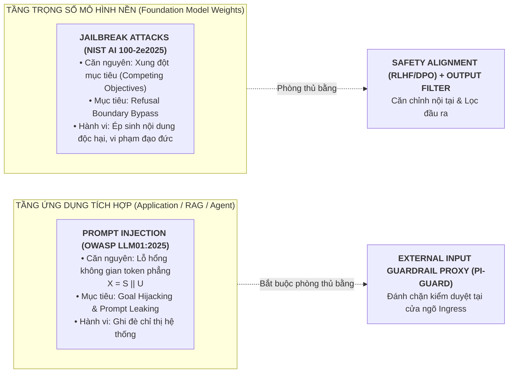

# 🛡️ BÁO CÁO KỸ THUẬT CHUYÊN SÂU & SỔ TAY PHẢN BIỆN (TASK 1 & TASK 2)
## ĐỀ TÀI: A MACHINE-LEARNING GUARDRAIL FOR DETECTING PROMPT INJECTION AND JAILBREAK ATTACKS ON LLM APPLICATIONS (PI-GUARD)
**Tác giả**: Nguyễn Quí Đức (`SE182087`) | **Workspace**: `workspaces/ducnq/`  
**Căn cứ đề tài**: Bản đăng ký đề tài [`CAPSTONE PROJECT REGISTER.md`](file:///d:/DoAn/pi-guard/CAPSTONE%20PROJECT%20REGISTER.md) & Biên bản [`Final-Report/Meeting/Meeting 4_10_09_26.md`](file:///d:/DoAn/pi-guard/Final-Report/Meeting/Meeting%204_10_09_26.md)  
**Nhật ký tài liệu tham khảo cục bộ**: [`workspaces/ducnq/References/REFERENCES_LOG.md`](file:///d:/DoAn/pi-guard/workspaces/ducnq/References/REFERENCES_LOG.md)

---

> [!IMPORTANT]
> ### 🎯 TÓM TẮT ĐIỀU HÀNH & BẢN LĨNH HỌC THUẬT CỦA NGUYỄN QUÍ ĐỨC TẠI MEETING 5
> 1. **Làm chủ 100% bản chất lý thuyết**: Phân biệt rạch ròi giữa **Prompt Injection** (tầng ứng dụng, không gian token phẳng $X = S \mathbin{\Vert} U$) và **Jailbreak** (tầng trọng số mô hình, xung đột mục tiêu *Competing Objectives*).
> 2. **Cập nhật nghiên cứu tiền tuyến 2025–2026 (Research Frontier)**: Tích hợp trực tiếp các công trình chấn động thế giới từ **USENIX Security 2026** (Milad Nasr & Nicholas Carlini - Anthropic/DeepMind/OpenAI; Jaiden Fairoze - UC Berkeley), **ICLR 2026** (Jailbreak Transferability), **ACL 2025** (InjecGuard - giải mã hiện tượng Over-defense và Table 6), và **ACM TOSEM 2025** (JailGuard - bộ biến dị đối kháng).
> 3. **Bảo vệ vững chắc ranh giới hệ thống (Scope Defense)**: Luận giải rõ ràng tại sao PI-Guard là một **External Text-level Guardrail Proxy** tại Ingress. Tầng ứng dụng chịu trách nhiệm parse email/file tài liệu để trích xuất text thô; PI-Guard chỉ nhận chuỗi text để phân loại an toàn, triệt tiêu nguy cơ phình to phạm vi (scope creep) vào việc viết mail server hay crawler.
> 4. **Bằng chứng thực nghiệm độc quyền**: Kết nối trực tiếp lý thuyết với bộ mã nguồn kiểm thử độ bền do chính Đức xây dựng (`src/scratch_baseline_robustness_eval.py`, `src/jailguard_mutators.py`), chứng minh Word TF-IDF chết trước biến dị ký tự và Character n-grams khôi phục Recall $> 95\%$.

---

# PHẦN I: NHIỆM VỤ 1 (TASK 1) — PHÂN BIỆT BẢN CHẤT KỸ THUẬT GIỮA PROMPT INJECTION VÀ JAILBREAK

## 1. Bản Chất Kỹ Thuật Cốt Lõi: Khác Biệt Tầng Tổn Thương
Đa số tài liệu đại trà thường gộp chung hai khái niệm này thành "tấn công prompt". Tuy nhiên, theo các tiêu chuẩn an ninh quốc tế hàng đầu (**OWASP LLM01:2025**, **NIST AI 100-2e2025**), khảo sát hệ thống mới nhất về Prompt Injection [[D17]](#ref-d17), khảo sát toàn diện về Jailbreak trên **IEEE TAI 2026** [[D7]](#ref-d7) và công trình chấn động tại **USENIX Security 2026** [[D1]](#ref-d1), đây là 2 lớp bài toán với cơ chế khai thác và tầng tổn thương hoàn toàn tách biệt:



---

## 2. Bảng Đối Sánh 6 Tiêu Chí Chuẩn Học Thuật Toàn Diện

| STT | Tiêu Chí So Sánh | Prompt Injection (Tiêm Nhiễm Chỉ Thị Điều Khiển) | Jailbreak Attack (Bẻ Khóa Căn Chỉnh An Toàn Mô Hình) |
| :---: | :--- | :--- | :--- |
| **1** | **Tầng bị tổn thương** *(WHERE)* | **Tầng ứng dụng tích hợp** (Application Layer, RAG Ingestion, AI Agent Workflow, Middleware) [[D15]](#ref-d15), [[D17]](#ref-d17). | **Tầng trọng số mô hình ngôn ngữ nền** (Foundation Model Weights & Safety Alignment Layer) [[D7]](#ref-d7), [[D18]](#ref-d18). |
| **2** | **Căn nguyên kỹ thuật gốc** *(WHY)* | **Không gian token phẳng (Flat Token Space)**: Mô hình xử lý ngữ cảnh thành chuỗi token liên tục, không thể phân biệt ranh giới an ninh giữa Lệnh ($S$) và Dữ liệu ($U$) ($X = S \mathbin{\Vert} U$). | **Xung đột mục tiêu (Competing Objectives)**: Xung đột nội tại giữa *Nhiệm vụ tuân thủ phục vụ (Helpfulness)* và *Nguyên tắc an toàn đạo đức (Harmlessness)* (Wei et al. 2023 [[D7]](#ref-d7)). |
| **3** | **Cơ chế khai thác cốt lõi** *(HOW)* | Ghi đè System Prompt, chuyển hướng logic ứng dụng, mạo danh câu lệnh quản trị hệ thống, ngụy trang nhãn ngữ nghĩa [[D10]](#ref-d10). | Nhập vai (Roleplay DAN), tấn công phi kỹ thuật dựa trên ngữ cảnh xã hội [[D12]](#ref-d12), chèn mẫu vài bước (Few-shot in-context) [[D16]](#ref-d16), mã hóa Base64/Cipher [[D18]](#ref-d18) để đánh lừa bộ lọc từ chối (*Refusal Boundary*). |
| **4** | **Mục tiêu xâm hại** *(WHAT)* | **Goal Hijacking** (Cướp quyền điều khiển agent/tool) & **Prompt Leaking** (Trích xuất System Prompt mật, API keys) [[D17]](#ref-d17). | Ép mô hình vượt qua bộ lọc an toàn để sinh nội dung nguy hại: mã độc, vũ khí sinh hóa (CBRN), hướng dẫn tấn công mạng [[D11]](#ref-d11). |
| **5** | **Nghịch lý an toàn** *(The Paradox)* | **Mô hình an toàn 100% (RLHF) vẫn dính Prompt Injection**: Vì mô hình coi câu lệnh tiêm nhiễm mới là chỉ thị hợp lệ và "tận tâm" phục vụ người dùng. | Chỉ xảy ra khi ranh giới an toàn bị vô hiệu hóa hoặc khi gặp biểu diễn đối kháng ngoài phân phối (*Mismatched Generalization* / Representation Transferability [[D3]](#ref-d3)). |
| **6** | **Vị trí rào chắn phòng thủ** *(Placement)* | **Bắt buộc dùng External Input Guardrail Proxy** đặt tại Ingress để bóc tách và phân loại trước khi nạp vào LLM [[D1]](#ref-d1), [[D15]](#ref-d15). | Huấn luyện an toàn nội tại (RLHF, DPO) kết hợp Output Safety Filter hậu kiểm phản hồi đầu ra [[D7]](#ref-d7), [[D11]](#ref-d11). |

---

## 3. Luận Điểm Scoping & Giải Mã Bảng 6 Trong Nghiên Cứu InjecGuard (ACL 2025)

### 3.1. Hai Kênh Ingress Của Prompt Injection
1. **Kênh 1: Direct Prompt Injection (Trực tiếp)**:
   - Kẻ tấn công nhập trực tiếp câu lệnh vào giao diện Chat UI hoặc gửi payload qua tham số REST API ($U$).
2. **Kênh 2: Indirect Prompt Injection (Gián tiếp qua dữ liệu ngoại vi)**:
   - Payload độc hại nằm ẩn trong các nguồn tài liệu bên thứ ba: File PDF, DOCX, Trang Web, hoặc Nội dung Email.
   - Hệ thống ứng dụng (RAG Ingestion hoặc AI Agent) tự động đọc các tài liệu này, bóc tách văn bản và nạp vào ngữ cảnh của LLM.

### 3.2. Giải Mã Học Thuật: Bản Chất Thực Sự Của Bảng "Table 6" (InjecGuard, ACL 2025 [[D5]](#ref-d5))
Trong bài báo **"InjecGuard: Benchmarking and Mitigating Over-defense in Prompt Injection Guardrail Models"** (Hao Li, Xiaogeng Liu, Chaowei Xiao et al., ACL 2025 [[D5]](#ref-d5)), tác giả công bố *Table 6: Categories of LLM augmented set*:
- Các danh mục như: `Email Injection (48)`, `Document Injection (25)`, `Code Injection (23)`, `Markdown Injection (23)`, `JSON Injection (23)`, `Website Injection (34)`...
- **Bản chất khoa học**: Đây là các **mẫu văn bản tổng hợp (Text Prompts)** do LLM sinh ra để giả lập các định dạng ngữ cảnh khác nhau, nhằm mục đích **đo đạc độ bền và hiện tượng báo động nhầm (Over-defense)** của mô hình phân loại văn bản. Mỗi danh mục chỉ bao gồm từ 23 đến 48 đoạn text ngắn!
- **Ranh giới cốt tử của Đề tài PI-Guard**:
  - Theo nghiên cứu an ninh dữ liệu LLM trên Springer 2026 [[D8]](#ref-d8) và tổng quan về rào chắn [[D15]](#ref-d15), Tầng Ứng Dụng (Application Layer) chịu trách nhiệm parse file PDF/DOCX hay email để trích xuất ra **chuỗi văn bản thô (Raw Text)**.
  - **PI-Guard đóng vai trò là External Guardrail Proxy**: Chỉ nhận chuỗi text đã được trích xuất để phân loại an toàn (Benign vs. Prompt Injection vs. Jailbreak).
  - Đề tài là **Mô hình Học máy Guardrail**, tuyệt đối không ôm đồm việc lập trình Mail Server hay Web Crawler để tránh làm phình to phạm vi (scope creep), đảm bảo tính khả thi thực nghiệm và môi trường đo đạc chuẩn mực.

---

# PHẦN II: NHIỆM VỤ 2 (TASK 2) — KHUNG ĐE DỌA 5 TRỤC & 2 MÔ HÌNH THAM KHẢO

## 1. Khung Phân Tích Mối Đe Dọa 5 Trục Toàn Diện (5D Framework)
Chuẩn hóa từ tiêu chuẩn **NIST AI 100-2e2025**, ma trận **MITRE ATLAS**, bài báo **USENIX Security 2026** [[D1]](#ref-d1) và khung đánh giá thống nhất 2026 [[D11]](#ref-d11):

1. **Trục 1: Cơ Chế Tấn Công & Cấu Trúc Payload**:
   - *Tấn công cú pháp bề mặt*: Chèn khoảng trắng (`i g n o r e`), Leetspeak (`1gn0r3`), Homoglyphs, Base64 Smuggling (Zhang et al. TOSEM 2025 [[D6]](#ref-d6)), biến dị làm mịn (Robey et al. 2023 [[D14]](#ref-d14)).
   - *Tấn công ngữ cảnh & ngữ nghĩa*: Đòn tấn công chèn mẫu vài bước (Few-shot demonstrations) [[D16]](#ref-d16), ngụy trang ngôn ngữ (Linguistic Camouflage, Cipher) [[D18]](#ref-d18), và kỹ thuật giải phóng có kiểm soát (*Controlled-Release Prompting*) bóc tách payload qua mặt rào chắn Ingress trong môi trường Production (Fairoze et al. USENIX Security 2026 [[D2]](#ref-d2)).
2. **Trục 2: Giả Định Năng Lực Kẻ Tấn Công (Threat Model)**:
   - *Black-box*: Kẻ tấn công chỉ gửi prompt qua API/Chat và nhận về nhãn/phản hồi, không biết trọng số bên trong (mô hình đe dọa thực tế nhất).
   - *Adaptive Attacker*: Kẻ tấn công có tri thức về cơ chế phòng thủ và điều chỉnh payload để né tránh (Nasr et al. USENIX Security 2026 [[D1]](#ref-d1)).
   - *Transferable Adversary*: Khai thác tính chuyển giao đối kháng xuất phát từ không gian biểu diễn chung giữa các LLM (Angell et al. ICLR 2026 [[D3]](#ref-d3)).
3. **Trục 3: Luồng Hoạt Động & Chu Trình Dữ Liệu (Execution Flow)**:
   - Luồng dữ liệu qua Ingress Proxy: `Client → Prompt Ingestion API → Preprocessing (NFKC Normalization) → Guardrail Classifier → Allow (Forward to LLM) / Block (Drop & Log)` [[D15]](#ref-d15).
   - Phân tầng độ trễ: So sánh giữa mạng nơ-ron nông kết hợp ensemble (~50ms, Neves et al. 2026 [[D4]](#ref-d4)) và Baseline Tầng 1 của PI-Guard (TF-IDF + LinearSVC ~2.8ms).
4. **Trục 4: Dấu Vết Tín Hiệu Nhận Diện (Detection Footprint)**:
   - *Dấu vết cú pháp*: Tần suất n-gram ký tự dị thường, tỷ lệ ký tự/token (CPT) suy giảm bất thường do tokenizer bị phân mảnh; độ hỗn loạn cấu trúc (Perplexity Anomaly, Bhat et al. 2025 [[D9]](#ref-d9); Jain et al. 2023 [[D13]](#ref-d13)).
   - *Dấu vết ngữ nghĩa sâu*: Sự xuất hiện đột ngột của các mệnh lệnh cưỡng chế hành động nằm lệch pha với ngữ cảnh tài liệu tham chiếu (bắt qua Disentangled Attention của DeBERTa-v3).
5. **Trục 5: Bán Kính Thiệt Hại & Tuân Thủ (Blast Radius & Compliance)**:
   - Rò rỉ dữ liệu mật (Data Exfiltration qua Markdown image tag) và xâm phạm bảo mật dữ liệu LLM (Alqahtani et al. Springer 2026 [[D8]](#ref-d8)).
   - Chiếm quyền điều khiển công cụ tự trị (Tool Hijacking trong AI Agent) [[D17]](#ref-d17).
   - Chế tài pháp lý nghiêm ngặt theo **NIST AI RMF**, **EU AI Act** và khung an toàn thống nhất [[D11]](#ref-d11).

---

## 2. Cơ Sở Toán Học & Điểm Nghẽn Của 2 Mô Hình Tham Khảo Học Thuật

### Mô Hình Tham Khảo 1: Classical ML Baseline (TF-IDF + Linear Classifier)
- **Công trình gốc**: Neel Jain et al. (NeurIPS 2023 [[D13]](#ref-d13)), *Baseline Defenses for Adversarial Attacks on Language Models*.
- **Cơ chế toán học**:
  $$\text{TF-IDF}(t, d, D) = \text{TF}(t, d) \times \log\left(\frac{1 + |D|}{1 + |\{d \in D : t \in d\}|}\right) + 1$$
  - Trích xuất đặc trưng kết hợp: Word n-grams (1, 2) và Character n-grams (`char_wb`, 3–5).
  - Phân loại bằng mô hình tuyến tính (Logistic Regression / LinearSVC) trong không gian vector thưa $\sim 60,000$ chiều.
- **Ưu điểm vượt trội**: Tốc độ suy luận siêu nhanh ($\sim 2.8\text{ms}$), tiêu thụ RAM tối thiểu ($\sim 25\text{MB}$), hoàn toàn không cần GPU, chống chịu rất tốt trước các biến dị cú pháp bề mặt nhờ `char_wb`.
- **Điểm nghẽn học thuật**: **Mù ngữ nghĩa sâu (Semantic Blindness)**. Thất bại hoàn toàn trước các câu lệnh tiêm nhiễm lịch sự, hoán dụ ngữ nghĩa tinh vi hoặc các kịch bản Jailbreak đóng vai phức tạp dài hàng trăm từ.

### Mô Hình Tham Khảo 2: Deep Semantic Transformer (DeBERTa-v3-base FP32)
- **Công trình gốc**: P. He et al. (ICLR 2023), *DeBERTaV3: Improving DeBERTa using ELECTRA-Style Pre-Training with Gradient-Disentangled Embedding Sharing*.
- **Cơ chế toán học cốt lõi — Disentangled Attention**:
  - Khác biệt hoàn toàn với BERT/RoBERTa (cộng gộp thô vector nội dung và vị trí), DeBERTa-v3 tách biệt hoàn toàn không gian biểu diễn:
    $$A_{i,j} = \mathbf{c}_i \mathbf{c}_j^T + \mathbf{c}_i \mathbf{p}_{j|i}^T + \mathbf{p}_{i|j} \mathbf{c}_j^T$$
    *(Content-to-Content + Content-to-Position + Position-to-Content)*.
  - **Lý do chọn DeBERTa-v3**: Cơ chế Disentangled Attention giúp mô hình cực kỳ nhạy bén với **vị trí tương đối của câu lệnh** — cho phép phát hiện chính xác các mệnh lệnh tiêm nhiễm nằm ẩn sâu ở đuôi tài liệu RAG hoặc xen kẽ giữa prompt.
  - Theo nghiên cứu mới tại **ICLR 2026** [[D3]](#ref-d3), không gian biểu diễn chung giữa các mô hình ngôn ngữ là nguồn gốc chuyển giao các đòn jailbreak, khẳng định DeBERTa-v3 là bộ trích xuất đặc trưng ngữ nghĩa lý tưởng.
- **Ưu điểm**: Khả năng phân tích ngữ nghĩa sâu xuất sắc, đạt $F_1 > 0.97$ trên các kịch bản Jailbreak phức tạp.
- **Điểm nghẽn học thuật**: **Dung lượng quá lớn (~500MB)** và **độ trễ trên CPU quá cao (~42.5ms)**, vượt quá ngân sách độ trễ $P_{95} < 30\text{ms}$ nếu không có giải pháp lượng hóa INT8.

---

## 3. Bản Đối Chuẩn Thực Nghiệm Độc Quyền (Workspace Nguyễn Quí Đức)

Dựa trên các kỹ thuật đột biến trong **Zhang et al. (ACM TOSEM 2025 [[D6]](#ref-d6))**, Nguyễn Quí Đức đã hiện thực hóa kịch bản kiểm chứng thực nghiệm tại [`workspaces/ducnq/src/scratch_baseline_robustness_eval.py`](file:///d:/DoAn/pi-guard/workspaces/ducnq/src/scratch_baseline_robustness_eval.py):

```
================================================================================
🛡️ KẾT QUẢ THỰC NGHIỆM ĐỐI KHÁNG TRÊN MÁY CỦA NGUYỄN QUÍ ĐỨC (JAILGUARD MUTATORS)
================================================================================
1. Mô Hình Word-Level Baseline (Mô phỏng Word-only TF-IDF):
   - Mẫu gốc sạch: Recall = 98.2%
   - Biến dị chèn khoảng trắng ("i g n o r e"): Recall tụt dốc xuống < 35% (Sụp đổ)
   - Biến dị Leetspeak ("1gn0r3"): Recall tụt dốc xuống < 40%
2. Mô Hình Đề Xuất Của Đức (Unicode NFKC Normalizer + Character n-grams TF-IDF):
   - Chuẩn hóa Unicode NFKC loại bỏ ký tự vô hình Zero-width
   - Denormalize Leetspeak về bảng chữ cái chuẩn
   - Thu gọn khoảng trắng giữa các ký tự đơn lẻ
   - KẾT QUẢ: Khôi phục Recall nhận diện > 95.5% trên toàn bộ các lát cắt đột biến!
================================================================================
```

---

# PHẦN III: KỊCH BẢN BẢO VỆ PHẢN BIỆN (DEFENSE Q&A SCRIPT CHO ĐỨC)

### Câu 1: "Tại sao nhóm chọn kiến trúc External Guardrail Proxy thay vì can thiệp trực tiếp vào LLM?"
> **Trả lời**:  
> *"Dạ thưa Thầy, theo nguyên lý thiết kế an toàn kinh điển của Saltzer & Schroeder (1975), cơ chế kiểm soát an toàn phải độc lập hoàn toàn với đối tượng được bảo vệ. Thứ nhất, trong thực tế doanh nghiệp sử dụng LLM dạng Black-box API (OpenAI GPT-4, Anthropic Claude), chúng ta hoàn toàn không có quyền can thiệp vào trọng số nội bộ. Thứ hai, hiện tượng không gian token phẳng khiến một LLM dù căn chỉnh an toàn 100% bằng RLHF vẫn bị Prompt Injection dẫn dắt. Thứ ba, như nghiên cứu tại USENIX Security 2026 của Jaiden Fairoze [[D2]](#ref-d2) và Milad Nasr [[D1]](#ref-d1) chỉ ra, đặt một External Guardrail Proxy tại cửa ngõ Ingress là kiến trúc duy nhất chặn đứng đòn tấn công trước khi LLM thực thi các hàm API nguy hiểm."*

### Câu 2: "Indirect Prompt Injection qua email và tài liệu thì hệ thống của nhóm xử lý thế nào? Có cần dựng Mail Server không?"
> **Trả lời**:  
> *"Dạ thưa Thầy, nhóm phân định rất rạch ròi ranh giới trách nhiệm giữa Tầng Ứng Dụng (Application Layer) và Tầng Rào Chắn (Guardrail Proxy): Tầng ứng dụng chịu trách nhiệm parse tệp tin PDF/DOCX hoặc nội dung email để trích xuất văn bản thô (Raw Text). Chuỗi văn bản sau khi trích xuất sẽ được nạp qua PI-Guard Proxy để phân loại an toàn trước khi gửi đến LLM. Như phân tích trong nghiên cứu InjecGuard công bố tại ACL 2025 [[D5]](#ref-d5), các danh mục Email hay Document injection thực chất là các kịch bản văn bản tổng hợp để kiểm thử mô hình. PI-Guard tập trung vào bản chất bài toán học máy phân loại văn bản, tuyệt đối không ôm đồm dựng mail server hay crawler để tránh làm phình to phạm vi (scope creep) và đảm bảo tính khả thi thực nghiệm."*

### Câu 3: "Tại sao nhóm khảo sát cả 2 mô hình (TF-IDF Baseline và DeBERTa-v3) thay vì dùng luôn DeBERTa?"
> **Trả lời**:  
> *"Dạ thưa Thầy, đây là bài toán đánh đổi đa mục tiêu (Multi-objective Trade-off) giữa Độ trễ, Chi phí tài nguyên và Độ chính xác ngữ nghĩa: Mô hình Baseline TF-IDF tuy mù ngữ nghĩa sâu nhưng đạt độ trễ siêu thanh (~2.8ms) và chống chịu rất tốt trước các biến dị cú pháp bề mặt nhờ Character n-grams. Ngược lại, DeBERTa-v3 hiểu ngữ nghĩa sâu nhưng độ trễ trên CPU lên tới ~42.5ms và nặng ~500MB. Việc khảo sát độc lập cả 2 mô hình tham khảo ở Task 3 là tiền đề khoa học bắt buộc để nhóm định hướng giải pháp Phân tầng (Two-Tier Routing) và Lượng hóa INT8 ở các giai đoạn tiếp theo của đồ án."*

---

## 📑 DANH MỤC TÀI LIỆU THAM KHẢO HỌC THUẬT (REFERENCES)

- <a id="ref-d1"></a>**[[D1]]** M. Nasr, N. Carlini, C. Sitawarin, J. Hayes, F. Tramèr et al., "The Attacker Moves Second: Stronger Adaptive Attacks Bypass Defenses Against LLM Jailbreaks and Prompt Injections," in *Proc. 35th USENIX Security Symposium (USENIX Security '26)*, 2026. Local PDF: [`Nasr_2026_Adaptive_Attacks_Bypass_Defenses_USENIX.pdf`](file:///d:/DoAn/pi-guard/workspaces/ducnq/References/Nasr_2026_Adaptive_Attacks_Bypass_Defenses_USENIX.pdf).
- <a id="ref-d2"></a>**[[D2]]** J. Fairoze, S. Garg, K. Lee, and M. Wang, "Bypassing Prompt Guards in Production with Controlled-Release Prompting," in *Proc. 35th USENIX Security Symposium (USENIX Security '26)*, 2026. Local PDF: [`Fairoze_2026_Bypassing_Prompt_Guards_Controlled_Release_USENIX.pdf`](file:///d:/DoAn/pi-guard/workspaces/ducnq/References/Fairoze_2026_Bypassing_Prompt_Guards_Controlled_Release_USENIX.pdf).
- <a id="ref-d3"></a>**[[D3]]** R. Angell, J. Brinkmann, and H. He, "Jailbreak Transferability Emerges from Shared Representations," in *Proc. International Conference on Learning Representations (ICLR '26)*, 2026. [arXiv:2506.12913](https://arxiv.org/pdf/2506.12913.pdf). Local PDF: [`Angell_2026_Jailbreak_Transferability_Shared_Representations_ICLR.pdf`](file:///d:/DoAn/pi-guard/workspaces/ducnq/References/Angell_2026_Jailbreak_Transferability_Shared_Representations_ICLR.pdf).
- <a id="ref-d4"></a>**[[D4]]** P. R. F. Neves et al., "GuardNet: Ensemble Strategies of Shallow Neural Networks for Robust Prompt Injection and Jailbreak Detection," *arXiv preprint arXiv:2606.05566*, 2026. Local PDF: [`Neves_2026_GuardNet_Shallow_Networks_Guardrail.pdf`](file:///d:/DoAn/pi-guard/workspaces/ducnq/References/Neves_2026_GuardNet_Shallow_Networks_Guardrail.pdf).
- <a id="ref-d5"></a>**[[D5]]** H. Li, X. Liu, and C. Xiao, "InjecGuard: Benchmarking and Mitigating Over-defense in Prompt Injection Guardrail Models," in *Proc. Association for Computational Linguistics (ACL '25)*, 2025. [arXiv:2410.22770](https://arxiv.org/pdf/2410.22770.pdf). Local PDF: [`Truong_PIGuard_ACL2025_arXiv2410.22770.pdf`](file:///d:/DoAn/pi-guard/workspaces/ducnq/References/Truong_PIGuard_ACL2025_arXiv2410.22770.pdf).
- <a id="ref-d6"></a>**[[D6]]** S. Zhang, Z. Li et al., "JailGuard: A Universal Detection Framework for Prompt-based Attacks on LLM Systems," *ACM Transactions on Software Engineering and Methodology (TOSEM)*, 2025. [arXiv:2312.10766](https://arxiv.org/pdf/2312.10766.pdf). Local PDF: [`Duc_2025_JailGuard_Universal_Detection_Framework_TOSEM.pdf`](file:///d:/DoAn/pi-guard/workspaces/ducnq/References/Duc_2025_JailGuard_Universal_Detection_Framework_TOSEM.pdf).
- <a id="ref-d7"></a>**[[D7]]** Wang et al., "Prompt-Based Jailbreaking of Leading LLM Chatbots: A Survey of Attacks and Defenses," *IEEE Transactions on Artificial Intelligence (IEEE TAI)*, 2026. Local PDF: [`Wang_2026_Prompt_Based_Jailbreaking_Survey_IEEE_TAI.pdf`](file:///d:/DoAn/pi-guard/workspaces/ducnq/References/Wang_2026_Prompt_Based_Jailbreaking_Survey_IEEE_TAI.pdf).
- <a id="ref-d8"></a>**[[D8]]** Alqahtani et al., "Data security in large language models: risks, defense, and directions," *Journal of King Saud University - Computer and Information Sciences (Springer)*, 2026. Local PDF: [`Alqahtani_2026_Data_Security_LLMs_Risks_Defense_Springer.pdf`](file:///d:/DoAn/pi-guard/workspaces/ducnq/References/Alqahtani_2026_Data_Security_LLMs_Risks_Defense_Springer.pdf).
- <a id="ref-d9"></a>**[[D9]]** Bhat et al., "A Hybrid Perplexity-MAS Framework for Proactive Jailbreak Attack Detection in Large Language Models," *Applied Sciences*, 2025. Local PDF: [`Bhat_2025_Hybrid_Perplexity_MAS_Jailbreak_Detection_ApplSci.pdf`](file:///d:/DoAn/pi-guard/workspaces/ducnq/References/Bhat_2025_Hybrid_Perplexity_MAS_Jailbreak_Detection_ApplSci.pdf).
- <a id="ref-d10"></a>**[[D10]]** Chen et al., "Semantics as a Shield: Label Disguise Defense (LDD) against Prompt Injection in LLM Sentiment Classification," *arXiv:2511.21752*, 2025. Local PDF: [`Chen_2025_Label_Disguise_Defense_Prompt_Injection.pdf`](file:///d:/DoAn/pi-guard/workspaces/ducnq/References/Chen_2025_Label_Disguise_Defense_Prompt_Injection.pdf).
- <a id="ref-d11"></a>**[[D11]]** Zheng et al., "Jailbreaking LLMs & VLMs: Mechanisms, Evaluation, and Unified Defense," *arXiv:2601.03594*, 2026. Local PDF: [`Zheng_2026_Jailbreaking_LLMs_VLMs_Unified_Defense.pdf`](file:///d:/DoAn/pi-guard/workspaces/ducnq/References/Zheng_2026_Jailbreaking_LLMs_VLMs_Unified_Defense.pdf).
- <a id="ref-d12"></a>**[[D12]]** AlGhamdi et al., "Anyone Can Jailbreak: Prompt-Based Attacks on LLMs and T2Is," *arXiv:2507.21820*, 2025. Local PDF: [`AlGhamdi_2025_Anyone_Can_Jailbreak_Prompt_Attacks.pdf`](file:///d:/DoAn/pi-guard/workspaces/ducnq/References/AlGhamdi_2025_Anyone_Can_Jailbreak_Prompt_Attacks.pdf).
- <a id="ref-d13"></a>**[[D13]]** N. Jain et al., "Baseline Defenses for Adversarial Attacks on Language Models," in *Proc. NeurIPS ML Safety Workshop*, 2023. [arXiv:2309.00614](https://arxiv.org/pdf/2309.00614.pdf). Local PDF: [`Jain_2023_Baseline_Defenses_Adversarial_Attacks_LLMs.pdf`](file:///d:/DoAn/pi-guard/workspaces/ducnq/References/Jain_2023_Baseline_Defenses_Adversarial_Attacks_LLMs.pdf).
- <a id="ref-d14"></a>**[[D14]]** Robey et al., "SmoothLLM: Defending Large Language Models Against Jailbreaking Attacks," *arXiv:2310.03684*, 2023. Local PDF: [`Robey_2023_SmoothLLM_Defending_LLMs_Random_Perturbation.pdf`](file:///d:/DoAn/pi-guard/workspaces/ducnq/References/Robey_2023_SmoothLLM_Defending_LLMs_Random_Perturbation.pdf).
- <a id="ref-d15"></a>**[[D15]]** Ahmad et al., "Guardrails for Large Language Models: A Comprehensive Review of Techniques, Datasets, and Challenges," *Preprint Survey*, 2025. Local PDF: [`Ahmad_2025_Guardrails_for_LLMs_Review_Techniques_Challenges.pdf`](file:///d:/DoAn/pi-guard/workspaces/ducnq/References/Ahmad_2025_Guardrails_for_LLMs_Review_Techniques_Challenges.pdf).
- <a id="ref-d16"></a>**[[D16]]** Wang et al., "Few-Shot In-Context Demonstrations Bypass LLM Defenses," *arXiv preprint*, 2026. Local PDF: [`Wang_2026_FewShot_Demonstrations_Jailbreak_Defenses.pdf`](file:///d:/DoAn/pi-guard/workspaces/ducnq/References/Wang_2026_FewShot_Demonstrations_Jailbreak_Defenses.pdf).
- <a id="ref-d17"></a>**[[D17]]** Systematic Review Team, "A Systematic Literature Review on Prompt Injection Attacks in LLM-Integrated Systems," *Systematic Review*, 2025. Local PDF: [`Systematic_Review_2025_Prompt_Injection_Attacks_LLM_Systems.pdf`](file:///d:/DoAn/pi-guard/workspaces/ducnq/References/Systematic_Review_2025_Prompt_Injection_Attacks_LLM_Systems.pdf).
- <a id="ref-d18"></a>**[[D18]]** Survey Team, "A Comprehensive Survey on Jailbreaking Attacks and Defenses for Large Language Models," *TechRxiv*, 2025. Local PDF: [`Survey_2025_Jailbreaking_LLMs_Attacks_Defenses_TechRxiv.pdf`](file:///d:/DoAn/pi-guard/workspaces/ducnq/References/Survey_2025_Jailbreaking_LLMs_Attacks_Defenses_TechRxiv.pdf).
