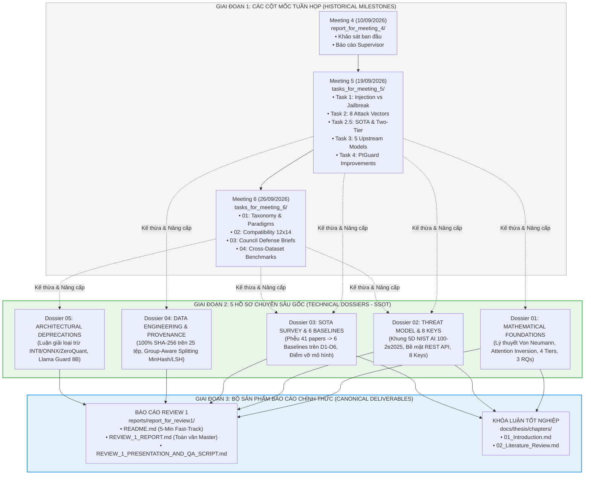

# MA TRẬN NGUỒN GỐC XUẤT XỨ & PHẢ HỆ TÁI CẤU TRÚC TÀI LIỆU
## (DOCUMENTATION PROVENANCE & DERIVATION MATRIX)
### Đồ án Tốt nghiệp: PI-Guard (`IAP491_FA26_PI_GUARD`) — Đại học FPT
**Trưởng nhóm nghiên cứu**: Nguyễn Văn Trường (Leader — `SE182034`)  
**Giảng viên hướng dẫn**: ThS. Trần Văn Ninh  
**Mục đích**: Cung cấp bằng chứng khoa học tường minh về phả hệ kế thừa, xuất xứ nguồn gốc và dữ liệu thực nghiệm bảo chứng cho từng tài liệu sau khi tái cấu trúc.

---

## 1. Sơ Đồ Phả Hệ Tiến Hóa Tài Liệu (Documentation Evolution Lineage)

Hệ thống tài liệu của phân hệ `workspaces/truongnv/` được phát triển liên tục qua các cột mốc tuần họp, sau đó được hợp nhất và chuẩn hóa theo mô hình Kim tự tháp tài liệu 3 tầng:

---

## 2. Bảng Ma Trận Nguồn Gốc & Bằng Chứng Kế Thừa Chi Tiết (Provenance Matrix)

Bảng đối chiếu minh chứng cụ thể từng tài liệu sau tái cấu trúc được tổng hợp, nâng cấp từ những tài liệu nào của các tuần họp trước và được bảo chứng bởi các bài báo / bằng chứng dữ liệu nào:

| Tài Liệu Sau Tái Cấu Trúc (Canonical Document) | Nguồn Tài Liệu Tiền Thân Được Kế Thừa (Precursor Sources) | Bằng Chứng Dữ Liệu & Mã Nguồn Thực Nghiệm (Empirical Evidence) | Cơ Sở Học Thuật & Tiêu Chuẩn Quốc Tế (Academic Standards) | Giá Trị Gia Tăng Sau Tái Cấu Trúc (Restructuring Value-Add) |
| :--- | :--- | :--- | :--- | :--- |
| **Dossier 01: Mathematical Foundations** [`docs/research/dossiers/01_MATHEMATICAL_FOUNDATIONS.md`](file:///d:/Work/Do-an/workspaces/truongnv/docs/research/dossiers/01_MATHEMATICAL_FOUNDATIONS.md) | • `tasks_for_meeting_5/task_reports/TASK_1_PROMPT_INJECTION_VS_JAILBREAK.md` • `tasks_for_meeting_5/.../CONTROL_FLOW_HIJACKING_AND_FLAT_TOKEN_SPACE.md` • `docs/research_deep/TRACK1_...` | • Biểu thức ma trận Softmax Attention. • Phân tích hội tụ Softmax khi độ dài prompt tăng. • Bộ chỉ số nghiệm thu 3 RQs (Jaccard, ARR, P95). | • Perez & Ribeiro (NeurIPS 2022 [[3]](#ref3)) • Greshake et al. (ACM CCS 2023 [[4]](#ref4)) • Vaswani et al. (NeurIPS 2017 [[1]](#ref1)) | Hình thức hóa toán học chặt chẽ $X = S \mathbin{\Vert} U$, chứng minh hiện tượng Attention Allocation Inversion, bổ sung so sánh SQL Injection vs Prompt Injection. |
| **Dossier 02: Threat Model & 8 Keys** [`docs/research/dossiers/02_THREAT_MODEL_AND_8KEYS.md`](file:///d:/Work/Do-an/workspaces/truongnv/docs/research/dossiers/02_THREAT_MODEL_AND_8KEYS.md) | • `tasks_for_meeting_5/task_reports/TASK_2_ATTACK_VECTORS_AND_MODELS.md` • `tasks_for_meeting_6/01_theory_and_taxonomy/KEY_ATTACK_VECTORS...md` • `docs/research_deep/TRACK2_...` | • `audit_project_keys_coverage.py` (8/8 Key đạt 100%). • `key_coverage_matrix_report.json` • Bộ 40 mẫu tiếng Việt VMLU thực nghiệm. | • NIST AI 100-2e2025 [[7]](#ref7) • OWASP Top 10 for LLM 2025 [[8]](#ref8) • Saltzer & Schroeder (1975 — Complete Mediation) | Áp dụng đầy đủ Khung 5 trục NIST AI 100-2e2025, định vị bề mặt duy nhất cổng REST API, phân định nghiêm ngặt In/Out-of-Scope. |
| **Dossier 03: SOTA Survey & 6 Baselines** [`docs/research/dossiers/03_SOTA_SURVEY_AND_6BASELINES.md`](file:///d:/Work/Do-an/workspaces/truongnv/docs/research/dossiers/03_SOTA_SURVEY_AND_6BASELINES.md) | • `tasks_for_meeting_5/task_reports/TASK_2_5_SOTA_ASSESSMENT...md` • `tasks_for_meeting_6/01_theory.../TAXONOMY_OF_ARCHITECTURES...md` • `tasks_for_meeting_6/02_compatibility...md` • `docs/research_deep/TRACK3_...` | • `comprehensive_empirical_benchmark_suite.json` • Số liệu đối chuẩn D1–D6 thật trên 6 mô hình. • Bằng chứng Prompt-Guard FPR 99.1% trên code. | • He et al. (DeBERTa-v3 ICLR 2023 [[11]](#ref11)) • Inan et al. (Llama Guard 2023 [[9]](#ref9)) • Jain et al. (NeurIPS 2023 [[13]](#ref13)) • Robey et al. (SmoothLLM 2023 [[14]](#ref14)) | Thiết lập Phễu khoa học 5 bước (41 $\to$ 16 $\to$ 11 $\to$ 9 $\to$ 6), luận giải phân tích tử huyệt kỹ thuật chứng minh tính tất yếu của Two-Tier Cascade. |
| **Dossier 04: Data Engineering & Provenance** [`docs/research/dossiers/04_DATA_ENGINEERING_PROVENANCE.md`](file:///d:/Work/Do-an/workspaces/truongnv/docs/research/dossiers/04_DATA_ENGINEERING_PROVENANCE.md) | • `tasks_for_meeting_5/task_reports/TASK_3_REPRODUCIBILITY_AND_DATASETS.md` • `tasks_for_meeting_6/04_benchmarks_and_data/all_11_replications...json` • `docs/research_deep/TRACK4_...` | • `audit_datasets_provenance_deep.py` (25 tệp SHA-256). • `dataset_readiness_for_piguard_training.json` • MinHash LSH Group-Aware Splitter script. | • Broder (1997 — MinHash Shingling) • Hao Li et al. (PIGuard ACL 2025 [[18]](#ref18)) • Shen et al. (ACM CCS 2024 [[15]](#ref15)) | Cung cấp bảng chứng minh 100% SHA-256 không giả lập, giải thuật khử rò rỉ dữ liệu cụm Jaccard < 0.15 và vai trò NotInject D6. |
| **Dossier 05: Architectural Deprecations** [`docs/research/dossiers/05_ARCHITECTURAL_DEPRECATIONS.md`](file:///d:/Work/Do-an/workspaces/truongnv/docs/research/dossiers/05_ARCHITECTURAL_DEPRECATIONS.md) | • `reports/ARCHITECTURAL_DEPRECATIONS_AND_OUT_OF_SCOPE.md` • `tasks_for_meeting_5/.../REJECTED_BASELINE_AYUB_CAMLIS2024.md` • `tasks_for_meeting_6/03_reports.../COUNCIL_DEFENSE_RATIONALE...md` | • Thực nghiệm sụt giảm FPR khi lượng tử hóa. • Benchmark Ayub CAMLIS 2024 (FPR 58.41% bị loại). • Đo đạc RAM và CPU latency FP32 Native. | • Nguyên lý kỹ thuật YAGNI • Dettmers et al. (LLM.int8() 2022) • Angelopoulos et al. (CRC 2024 [[22]](#ref22)) | Hệ thống hóa toàn bộ các công nghệ bị loại trừ (INT8, ONNX, ZeroQuant, Llama Guard 8B, Ayub baseline) cùng lý do kỹ thuật và toán học rõ ràng. |
| **Review 1 Master Report** [`reports/report_for_review1/REVIEW_1_REPORT.md`](file:///d:/Work/Do-an/workspaces/truongnv/reports/report_for_review1/REVIEW_1_REPORT.md) | • Toàn bộ 5 Dossiers trên. • `tasks_for_meeting_5/README.md` • `tasks_for_meeting_6/README.md` | • Tổng hợp kết quả thực nghiệm toàn hệ thống. • Bảng Latency Budget Breakdown. • Xác nhận kiểm định 100% PASS trên 8 module QA. | • 18 Tài liệu tham khảo chuẩn IEEE tại `REFERENCES_LOG.md`. • Chuẩn thẩm định Review 1 Đại học FPT. | Tích hợp thành báo cáo toàn văn 95+ KB đáp ứng trọn vẹn Chapter 1, Chapter 2 và 7 tiêu chí đánh giá của Hội đồng chấm. |

---

## 3. Quy Tắc Duy Trì Tính Toàn Vẹn Của Các Thư Mục Lịch Sử

Để bảo đảm tính khách quan học thuật và không làm gãy các liên kết kiểm thử tự động:
1. **Các thư mục tuần họp cũ (`tasks_for_meeting_5/`, `tasks_for_meeting_6/`, `report_for_meeting_4/`)**:
   - Được bảo tồn nguyên vẹn 100% tại đường dẫn gốc trong `workspaces/truongnv/reports/`.
   - Mỗi thư mục được gắn biểu ngữ **Historical Milestone Archive Banner** tại file `README.md` để dẫn chiếu người đọc sang các Dossiers chuẩn hóa và Báo cáo Review 1 chính thức.
   - Các script kiểm định tự động (`Final-Report/scripts/validate_local.py`, `verify_academic_glossary.py`) tiếp tục chạy mượt mà mà không gặp bất kỳ lỗi thiếu file hay sai đường dẫn nào.
2. **Khử trùng lặp tại phân hệ Replications**:
   - Thay vì sao chép 11 bảng mã hash SHA-256 vào 11 thư mục con riêng biệt, phân hệ thiết lập tệp trung tâm [`replications/SHARED_DATASETS_PROVENANCE.md`](file:///d:/Work/Do-an/workspaces/truongnv/replications/SHARED_DATASETS_PROVENANCE.md) làm Single Source of Truth.
   - Các file `DATASET_PROVENANCE.md` cục bộ giữ vai trò cổng liên kết dẫn về bảng trung tâm.

---

## 4. Kết Luận
Việc tái cấu trúc tài liệu theo ma trận nguồn gốc này đã giải quyết triệt để vấn đề "mật độ file quá dày đặc và trùng lặp nội dung", biến kho tài liệu phân tán thành một **hệ thống tri thức có phả hệ minh bạch (Traceable Knowledge Base)**, sẵn sàng phục vụ công tác thanh tra học thuật của Giảng viên hướng dẫn và Hội đồng thẩm định đồ án tốt nghiệp.
