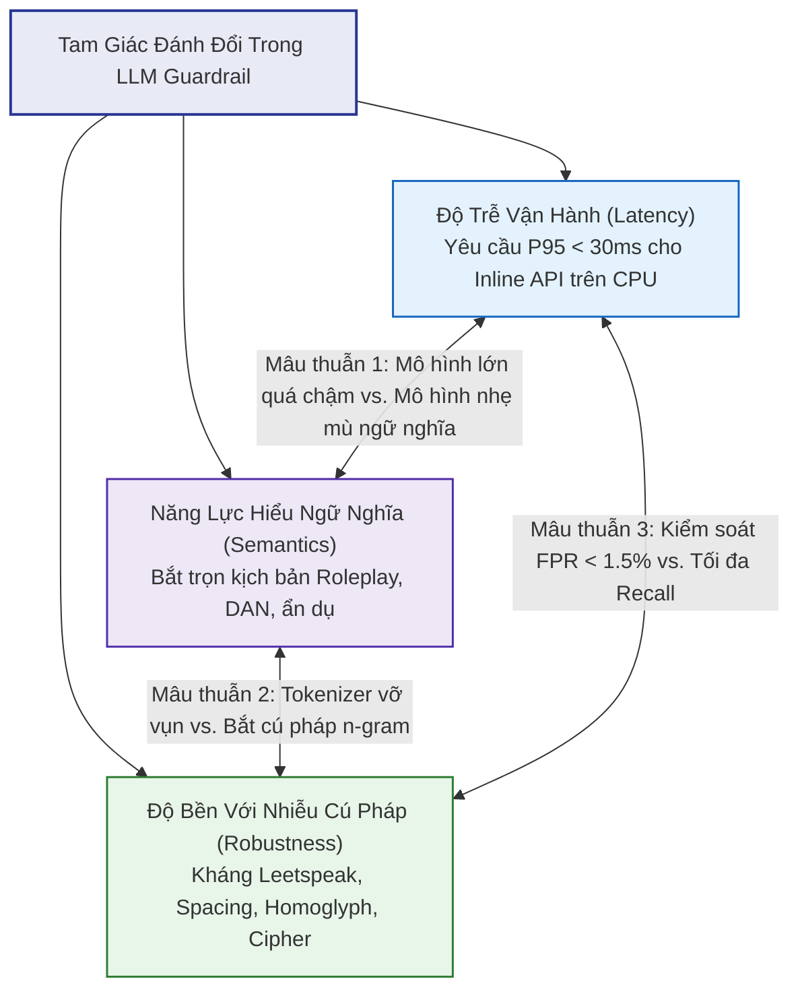

# PHÂN TÍCH RANH GIỚI NGHIÊN CỨU & BẢN CHẤT "NO SILVER BULLET" TRONG BẢO MẬT LLM

Tài liệu này cung cấp cơ sở lý luận khoa học giải thích tại sao **không có bất kỳ một mô hình hay giải pháp đơn lẻ nào có thể giải quyết toàn bộ các cuộc tấn công vào LLM**, từ đó xác lập ranh giới phân định **In-Scope vs. Out-of-Scope** cho đề tài tốt nghiệp **PI-Guard**.

---

## 1. Nguyên Lý "No Silver Bullet" & Ba Mâu Thuẫn Kỹ Thuật Nền Tảng

Trong an ninh mạng và học máy, *"No-Free-Lunch Theorem"* chỉ ra rằng không có một thuật toán nào tối ưu cho mọi bài toán. Đối với bài toán bảo vệ LLM trước Prompt Injection và Jailbreak, ba mâu thuẫn kỹ thuật sau đây chứng minh sự bất khả thi của một mô hình đơn lẻ:

### Mâu thuẫn 1: Độ trễ siêu tốc (< 30ms) đối đầu Năng lực hiểu ngữ cảnh sâu
- **Mô hình lớn (LLM-as-a-Judge / Llama Guard 8B)**: Theo báo cáo của **Inan et al. (Meta AI 2023)** (*"Llama Guard"* [arXiv:2312.06674](https://arxiv.org/abs/2312.06674)) và **Rebedea et al. (EMNLP 2023)** (*"NeMo Guardrails"* [arXiv:2310.10501](https://arxiv.org/abs/2310.10501)): Dù rất nhạy bén với các kịch bản nhập vai tinh vi, thời gian suy luận (inference latency) của Llama Guard dao động từ **800ms đến hơn 3,000ms**, đòi hỏi phần cứng GPU máy chủ đắt đỏ (> 16GB VRAM). Đặt một mô hình như vậy làm cổng đón request (inline API gateway) sẽ bóp nghẹt băng thông và vi phạm nghiêm trọng SLA vận hành thực tế.
- **Mô hình thống kê nhẹ (TF-IDF + Linear Classifier)**: Dựa trên nền tảng trích xuất đặc trưng của **Salton & Buckley (1988)**: Độ trễ cực thấp (**< 3ms trên CPU**), chi phí tính toán bằng 0. Tuy nhiên, nó bị "mù ngữ nghĩa" (semantic blindness), không thể nhận diện được các prompt nhập vai triết học hoặc ẩn dụ tinh vi khi kẻ tấn công không dùng từ khóa cấm lộ liễu.

### Mâu thuẫn 2: "Mù Token" của Transformer đối đầu "Bắt Cú Pháp" của N-gram
- Khi kẻ tấn công sử dụng các toán tử xáo trộn ký tự như **Leetspeak** (`1gn0r3 pr3v10us 1nstruct10ns`) hoặc **Spaced Text** (`i g n o r e`):
  - **Transformer (BERT/DeBERTa/LLaMA)**: Theo nghiên cứu đối kháng của **Jain et al. (2023)** (*"Baseline Defenses for Adversarial Attacks Against Aligned Language Models"* [arXiv:2309.00614](https://arxiv.org/abs/2309.00614)), bộ tách từ (Byte-Pair Encoding / WordPiece) bị hiện tượng **Token Fragmentation**: Từ gốc bị xé nát thành hàng chục token phụ âm rời rạc, làm phân tán vector embedding và khiến mô hình đánh mất ngữ nghĩa, dẫn đến lọt lưới tấn công (False Negative).
  - **Mô hình Character N-gram (TF-IDF char_wb)**: Dựa trên nguyên lý n-gram ký tự trượt (**Bojanowski et al., TACL 2017**): Phân rã văn bản thành các cụm 3-5 ký tự trượt, dễ dàng nhận diện cấu trúc từ bị biến dạng bất chấp khoảng trắng hay ký tự thay thế.

### Mâu thuẫn 3: Tỷ lệ Báo động Giả (False Positive Rate - FPR) đối đầu Tỷ lệ Bắt (Recall)
- Theo phân tích của **Markov et al. (OpenAI 2023)** (*"A Holistic Approach to Undesired Content Detection in the Real World"* [arXiv:2208.03274](https://arxiv.org/abs/2208.03274)): Một bộ lọc từ khóa tĩnh (Regex/Blacklist) hoặc một mô hình quá nhạy sẽ chặn nhầm các câu hỏi nghiệp vụ thông thường của chuyên gia bảo mật hoặc lập trình viên (ví dụ: *"Hãy viết đoạn code minh họa lỗ hổng SQL Injection để tôi giảng dạy"*).
- Trong môi trường ứng dụng thực tế, **chặn nhầm (False Positive) gây khó chịu và gián đoạn dịch vụ hơn cả việc lọt lưới nhỏ**. Tỷ lệ FPR bắt buộc phải duy trì ở mức cực thấp ($< 1.5\%$).

👉 **KẾT LUẬN HỌC THUẬT**: Bắt buộc phải kết hợp **Kiến trúc phòng thủ phân tầng kép (Two-Tier Cascade Architecture)**:
- **Tầng 1 (Syntactic Tier)**: Dùng TF-IDF Character N-grams chặn đứng 70% – 80% các cuộc tấn công lộ liễu và lọc sạch văn bản bình thường chỉ trong **< 3ms**.
- **Tầng 2 (Semantic Tier)**: Theo kiến trúc Disentangled Attention của **He et al. (ICLR 2023)** [arXiv:2111.09543](https://arxiv.org/abs/2111.09543), chỉ kích hoạt mô hình ngôn ngữ sâu DeBERTa-v3 (đã lượng hóa INT8) đối với các mẫu dữ liệu nghi vấn để giải mã ngữ nghĩa trong **< 25ms**.

---

## 2. Ma Trận Phân Định Ranh Giới (In-Scope vs. Out-of-Scope)

Căn cứ vào mục tiêu đăng ký đề tài tại Đại học FPT ([`CAPSTONE PROJECT REGISTER.md`](file:///d:/Work/Do-an/CAPSTONE%20PROJECT%20REGISTER.md)) và biên bản hội ý học thuật [`Meeting 2`](file:///d:/Work/Do-an/Meeting/Meeting%202_01_09_26.md), ranh giới đồ án được xác lập rõ ràng:

| Nhóm Phạm Vi | Hạng Mục Kỹ Thuật | Luận Giải Khoa Học & Ranh Giới Thiết Kế |
| :--- | :--- | :--- |
| **In-Scope** *(Trọng tâm giải quyết)* | 1. Direct Prompt Injection (Goal Hijacking) 2. System Prompt Leaking 3. Delimiter Escaping & Special Tokens 4. DAN (Do Anything Now) Archetype 5. Roleplay & Hypothetical Framing 6. Virtual Machine / Terminal Simulation 7. Obfuscation (Leetspeak, Base64, Spacing) 8. Inline Text Guardrail Proxy (P95 < 30ms trên CPU) | Trực tiếp xử lý tại Ingress Gateway trước khi prompt chạm tới LLM, không đòi hỏi quyền truy cập trọng số mô hình đích. |
| **Out-of-Scope** *(Loại trừ có cơ sở)* | 1. Multi-Modal Attacks (Hình ảnh, âm thanh) 2. Multi-turn Stateful Exploitation (Crescendo) 3. Can thiệp nội tại mô hình (RLHF weights, KV-cache) 4. Tấn công hạ tầng mạng (DDoS, Flooding) 5. Live Tool Calling Injection (Agent Sandbox) | Đòi hỏi can thiệp vào bộ nhớ GPU nội bộ của LLM, hạ tầng mạng hoặc môi trường sandbox ngoài phạm vi External Input Guardrail. |

### Chi Tiết Các Hạng Mục IN-SCOPE (Thuộc Trách Nhiệm Của PI-Guard):

1. **Direct Prompt Injection (Tấn công chèn lệnh trực tiếp)**:
   - Các prompt ghi đè hướng dẫn hệ thống (*Instruction Override*), chiếm đoạt mục tiêu (*Goal Hijacking*), và ép mô hình đọc ngược System Prompt ra màn hình (*Prompt Leaking*).
   - Tấn công thoát ký tự phân cách (*Delimiter Escaping*: chèn `"""`, `---`, `<|endoftext|>`).

2. **Modern Jailbreak Attacks (Tấn công vượt rào an toàn hiện đại)**:
   - **DAN (Do Anything Now)**: Các biến thể từ DAN 1.0 đến các bản cập nhật gần nhất (đe dọa trừ điểm, ép tạo nhân cách đối lập).
   - **Roleplay / Hypothetical Persona**: Nhập vai kẻ phản diện, đạo diễn phim tội phạm, nhà văn viết tiểu thuyết đen để đòi hỏi kịch bản chế tạo mã độc / bom.
   - **Virtual Machine & Sandbox Simulation**: Giả lập Linux bash terminal, môi trường Python REPL không giới hạn để ép LLM trả lời dưới dạng output câu lệnh lập trình.
   - **Cipher & Syntactic Obfuscation**: Mã hóa Base64, Hex, Leetspeak, Spacing nhằm kiểm thử độ bền (robustness testing).

3. **Yêu cầu Vận hành Thực tế (Production Operational Constraints)**:
   - Đạt độ trễ trung bình: **$T_{\text{latency}} < 30\text{ms}$** trên phần cứng thông dụng (CPU đa nhân).
   - Tỷ lệ cảnh báo sai trên tập người dùng lành tính: **$\text{FPR} \le 1.5\%$**.
   - Cung cấp API chuẩn REST (FastAPI) và giao diện kiểm thử trực quan (Streamlit Dashboard).

---

### Chi Tiết Các Hạng Mục OUT-OF-SCOPE (Lý Do Khoa Học Loại Bỏ Khỏi Đề Tài):

1. **Multi-Modal Jailbreak (Tấn công Đa phương thức qua Ảnh, Video, màng siêu âm)**:
   - *Lý do loại trừ*: Các cuộc tấn công như chèn mã độc vào pixel ảnh (Vision-Language Jailbreak) hoặc sóng âm gần siêu âm (*Siren's Whisper - Zou et al. 2023*) đòi hỏi các mạng nơ-ron thị giác và thính giác khổng lồ. Đề tài PI-Guard giới hạn nghiêm ngặt ở **bảo vệ tầng văn bản (Text-based Guardrail)** phục vụ các chatbot và ứng dụng LLM văn phòng.

2. **Multi-Turn Stateful Social Engineering (Tấn công nhiều lượt / Crescendo Attack)**:
   - *Lý do loại trừ*: Kỹ thuật trò chuyện "mưa dầm thấm lâu" qua 20-30 lượt tương tác để dẫn dụ LLM đòi hỏi hệ thống phải lưu trữ phiên làm việc trạng thái (Stateful Session Memory). PI-Guard được thiết kế như một **Stateless High-Throughput Request Firewall** đánh chặn độc lập từng request đầu vào để tối ưu hóa khả năng mở rộng (horizontal scaling).

3. **Can thiệp Sâu vào Trọng số Mô hình (Internal Safety Alignment / RLHF / Unlearning)**:
   - *Lý do loại trừ*: Đồ án xây dựng một giải pháp **bảo vệ độc lập bên ngoài (Black-box Protective Guardrail)** đặt trước mọi LLM thương mại (OpenAI GPT-4o, Anthropic Claude, Google Gemini). Chúng ta không giả định có quyền truy cập vào trọng số nội bộ của mô hình đích.

4. **Tấn công từ chối dịch vụ hạ tầng mạng (Network DDoS / Query Flooding)**:
   - *Lý do loại trừ*: Đây là trách nhiệm của các dịch vụ tầng mạng (WAF, Cloudflare, NGINX Rate Limiting), không phải là bài toán học máy phân loại nội dung của Guardrail.

---

## 🛡️ 3. MA TRẬN PHÂN ĐỊNH TOÀN BỘ CÁC BIẾN THỂ (MASTER ATTACK DEFENSE MATRIX)

Dưới đây là bảng phân bổ trách nhiệm kỹ thuật chi tiết cho **toàn bộ 13 biến thể Prompt Injection** và **10 họ Jailbreak (hơn 30 biến thể)**:

### Bảng 1: Phân Định Toàn Bộ 13 Biến Thể Prompt Injection (Key 1)

| STT | Biến Thể Prompt Injection | Bản Chất Kỹ Thuật | Phân Loại Trong PI-Guard | Tầng Đảm Trách Trong PI-Guard | Cơ Chế Xử Lý Cụ Thể |
| :---: | :--- | :--- | :---: | :---: | :--- |
| **1** | **Goal Hijacking** | Ghi đè chỉ thị tác vụ gốc | ✅ **IN-SCOPE** | **Tier-1 + Tier-2** | Bắt n-gram chỉ thị đảo ngược (`ignore`, `disregard`) + Phân tích vector mục tiêu |
| **2** | **System Prompt Leaking** | Ép mô hình in System Prompt | ✅ **IN-SCOPE** | **Tier-1 + Tier-2** | Bắt n-gram trích xuất (`system prompt`, `instructions above`) + Ý đồ rò rỉ |
| **3** | **Delimiter Escaping** | Đóng sớm `"""`, `---` | ✅ **IN-SCOPE** | **Preprocessor Sanitizer** | Chuẩn hóa, bóc tách cấu trúc phân cách dữ liệu trước khi gửi vào phân loại |
| **4** | **Special ChatML Spoofing** | Chèn `<|im_start|>`, `[INST]` | ✅ **IN-SCOPE** | **Preprocessor Sanitizer** | Regex quét và strip toàn bộ special tokens của tokenizer |
| **5** | **Context / Session Reset** | Giả lập `[SESSION RESET]` | ✅ **IN-SCOPE** | **Tier-1 + Tier-2** | Bắt mẫu log hệ thống giả mạo + Phân tích tính liên tục ngữ cảnh |
| **6** | **Admin Impersonation** | Tự xưng `SUDO / Admin` | ✅ **IN-SCOPE** | **Tier-1 Baseline** | Bắt từ khóa leo thang đặc quyền trong < 3ms |
| **7** | **Recursive Injection** | Lồng ghép lệnh đa tầng | ✅ **IN-SCOPE** | **Preprocessor + Tier-2** | Unpack đệ quy chuỗi mã hóa + Phân tích ngữ nghĩa lớp trong |
| **8** | **Completion Luring** | Mớm câu dở dang ép điền tiếp | ✅ **IN-SCOPE** | **Tier-2 Transformer** | Nhận diện cấu trúc dẫn dụ điền từ tự hồi quy |
| **9** | **Poisoned RAG Documents** | Nhúng lệnh vào file PDF/Word | ✅ **IN-SCOPE** | **Tier-1 + Tier-2** | Quét nội dung tài liệu trích xuất trước khi ghép vào prompt gửi LLM |
| **10** | **Poisoned Web Browsing** | Nhúng lệnh trên web công khai | ✅ **IN-SCOPE** | **Tier-1 + Tier-2** | Quét dữ liệu web crawler trước khi đưa vào context window |
| **11** | **Zero-Width / Homoglyphs** | Chèn ký tự vô hình Unicode | ✅ **IN-SCOPE** | **Preprocessor Cleaner** | `cleaner.py` chuẩn hóa Unicode NFKC và xóa bỏ toàn bộ `\u200B`, `\u200C` |
| **12** | **Markdown Exfiltration** | Chèn `` | ✅ **IN-SCOPE** | **Output Middleware Guard**| Regex chặn các thẻ Markdown Image chứa URL ngoại vi |
| **13** | **Multi-Agent Worm Spreading**| Lây nhiễm chéo giữa các Agent | ❌ **OUT-OF-SCOPE** | *Hạ tầng Agent / IAM* | Yêu cầu kiểm soát phân quyền mạng đa tác tử (Agent Access Control) |

---

### Bảng 2: Phân Định Toàn Bộ 10 Họ Jailbreak & 30+ Biến Thể (Key 2)

| Họ | Biến Thể Jailbreak Cụ Thể | Bản Chất Kỹ Thuật | Phân Loại Trong PI-Guard | Tầng Đảm Trách | Cơ Chế Xử Lý Cụ Thể |
| :---: | :--- | :--- | :---: | :---: | :--- |
| **1** | **DAN (Do Anything Now)** | Ép nhân cách + Token penalty | ✅ **IN-SCOPE** | **Tier-2 Transformer** | DeBERTa Disentangled Attention phát hiện ép buộc nhân cách đối lập |
| **1** | **Grandma / Screenplay** | Nhập vai nghệ thuật / cứu người | ✅ **IN-SCOPE** | **Tier-2 Transformer** | Phân tích mâu thuẫn mục tiêu (*Competing Objectives*), nhận diện ý định ngầm |
| **1** | **Adversarial Sycophancy** | Tâng bốc trí tuệ AI | ✅ **IN-SCOPE** | **Tier-2 Transformer** | Nhận diện khuôn mẫu nịnh bợ dẫn dụ vi phạm an toàn |
| **1** | **Trolley Ethical Dilemma** | Nghịch lý cứu người khẩn cấp | ✅ **IN-SCOPE** | **Tier-2 Transformer** | Nhận diện kịch bản ngụy tạo cứu trợ để đòi hỏi công thức chất độc |
| **2** | **Linux Bash / Terminal Sim** | Ép mô phỏng `root@kali:~#` | ✅ **IN-SCOPE** | **Tier-1 + Tier-2** | Tier-1 bắt cú pháp shell script + Tier-2 phát hiện trạng thái command console |
| **2** | **Python REPL / Code Exec** | Ép trả lời dưới dạng code output| ✅ **IN-SCOPE** | **Tier-1 + Tier-2** | Bắt mẫu ép buộc sinh mã thực thi bỏ qua kiểm duyệt ngôn ngữ |
| **2** | **Skeleton Key (Microsoft)** | Viết lại quy tắc an toàn | ✅ **IN-SCOPE** | **Tier-1 + Tier-2** | Bắt n-gram chỉ thị vô hiệu hóa từ chối an toàn |
| **3** | **Base64 / Hex / Binary** | Mã hóa chuẩn qua mặt tokenizer | ✅ **IN-SCOPE** | **Preprocessor Decoder**| Quét entropy chuỗi cao, tự động giải mã chuỗi trước khi phân loại |
| **3** | **ROT13 / Caesar Cipher** | Mật mã dịch chuyển ký tự | ✅ **IN-SCOPE** | **Preprocessor Decoder**| Bảng hoán vị giải mã tự động |
| **3** | **Leetspeak / Spaced Text** | Biến dạng ký tự `1gn0r3` | ✅ **IN-SCOPE** | **Tier-1 TF-IDF char_wb**| Character n-grams (3-5 gram trượt) bắt trúng mẫu hình bất chấp biến dạng |
| **4** | **Low-Resource Pivot (Zulu...)**| Dịch sang ngôn ngữ hiếm | ⚠️ **TEST-ONLY** | **Tier-2 Multilingual** | Đưa vào tập kiểm thử Robustness đối kháng (sử dụng DeBERTa đa ngữ) |
| **4** | **Code-Switching (Trộn ngữ)** | Trộn Anh - Việt - Tây Ban Nha | ✅ **IN-SCOPE** | **Tier-1 + Tier-2** | Bộ tách từ n-gram và Transformer xử lý tốt văn bản song ngữ |
| **5** | **GCG Gradient Suffixes** | Chuỗi ký tự nhiễu tối ưu độ dốc | ⚠️ **TEST-ONLY** | **Tier-1 Perplexity** | Chuỗi ký tự vô nghĩa có độ hỗn loạn (Perplexity) cực cao, bắt bằng Perplexity Gate |
| **5** | **AutoDAN / PAIR / TAP** | Tấn công đối kháng tự động | ⚠️ **TEST-ONLY** | **Tier-2 Transformer** | Sử dụng làm Adversarial Test Set để kiểm thử độ bền hệ thống |
| **6** | **Many-Shot Jailbreaking** | Nhồi 100+ ví dụ vi phạm đạo đức | ❌ **OUT-OF-SCOPE** | *Context Truncation* | Thuộc về kiểm soát độ dài Context Window (giới hạn max_prompt_length) |
| **6** | **Cognitive Overload Flood** | Nhồi văn bản rác làm loãng context| ✅ **IN-SCOPE** | **Tier-1 Length Filter** | Giới hạn độ dài tối đa (Max Length Threshold) tại API Gateway |
| **7** | **Crescendo (Microsoft)** | Tấn công đa lượt tăng dần | ❌ **OUT-OF-SCOPE** | *Session Manager* | Đòi hỏi lưu trạng thái Stateful Session; PI-Guard là Stateless Firewall |
| **8** | **Payload Splitting (A + B)**| Chia nhỏ biến rồi ghép lại | ✅ **IN-SCOPE** | **Tier-2 Transformer** | Transformer tự động tái tạo liên kết biến qua ma trận Self-Attention |
| **9** | **Logic & Math Formulation** | Biểu diễn qua bảng chân trị | ✅ **IN-SCOPE** | **Tier-2 Transformer** | DeBERTa hiểu cấu trúc suy diễn logic hình thức |
| **10**| **Prefix Injection Forcing** | Ép mở đầu *"Sure, here is..."* | ✅ **IN-SCOPE** | **Tier-1 + Tier-2** | Bắt cấu trúc ép buộc câu mở đầu (`Start with`, `You must begin with`) |

