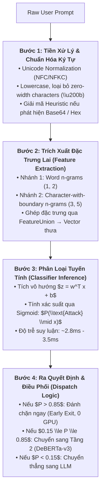

# HƯỚNG DẪN CÁCH HOẠT ĐỘNG & TRIỂN KHAI: TF-IDF BASELINE TRONG PI-GUARD

---

## 1. Quy Trình Hoạt Động Từng Bước (End-to-End Pipeline)

Trong kiến trúc của PI-Guard, Bộ lọc Cú pháp TF-IDF Baseline đóng vai trò là **Phòng tuyến Lọc Thô Cấp 1 (Tier 1 Coarse-Grained Filter)**:



---

## 2. Cấu Hình Tham Số Tối Ưu Trong Scikit-Learn

Dưới đây là cấu hình tham số chuẩn được tối ưu hóa riêng cho bài toán bảo vệ an toàn LLM:

```python
from sklearn.feature_extraction.text import TfidfVectorizer
from sklearn.pipeline import FeatureUnion, Pipeline
from sklearn.linear_model import LogisticRegression
import joblib

def build_pi_guard_baseline():
    # Trích xuất đặc trưng lai: kết hợp cả cụm từ và lát cắt ký tự
    features = FeatureUnion([
        ('word_level', TfidfVectorizer(
            analyzer='word',
            ngram_range=(1, 2),        # Bắt cả unigram ("ignore") và bigram ("ignore previous")
            max_features=15000,        # Giới hạn kích thước từ vựng để model nhẹ
            sublinear_tf=True,         # Thu nhỏ độ chênh lệch của từ lặp lại nhiều lần
            strip_accents='unicode'
        )),
        ('char_level', TfidfVectorizer(
            analyzer='char_wb',        # Ký tự có ranh giới từ (chống leetspeak)
            ngram_range=(3, 5),        # Lát cắt từ 3 đến 5 ký tự liên tiếp
            max_features=35000,        # Đảm bảo độ phủ rộng các biến dị ký tự
            sublinear_tf=True
        ))
    ])

    # Bộ phân loại hồi quy Logistic cân bằng trọng số
    classifier = LogisticRegression(
        C=2.0,                         # Điều chuẩn L2 tối ưu
        max_iter=1000,
        class_weight='balanced',       # Tự động cân bằng nếu dữ liệu tiêm nhiễm ít hơn
        solver='lbfgs',
        random_state=42
    )

    return Pipeline([
        ('vectorizer', features),
        ('classifier', classifier)
    ])
```

---

## 3. Quản Lý Lưu Trữ Và Triển Khai Thực Thi (Inference Deployment)

- **Lưu mô hình**:
  ```python
  pipeline.fit(X_train, y_train)
  joblib.dump(pipeline, "models/tfidf_baseline_model.joblib", compress=3)
  ```
- **Tải và suy luận trong FastAPI**:
  ```python
  # Load model vào RAM khi khởi động API server (chỉ tốn ~15 MB RAM)
  model = joblib.load("models/tfidf_baseline_model.joblib")

  # Suy luận nhanh
  probs = model.predict_proba([user_prompt])[0]
  injection_risk = probs[1]
  ```

---

## 4. Đánh Giá Thực Tế: Điểm Mạnh & Điểm Hạn Chế

| Khía Cạnh | Đánh Giá Thực Tế | Lý Do Kỹ Thuật |
| :--- | :---: | :--- |
| **Tốc độ (Latency)** | **Độ trễ thấp (~3.2ms)** | Chỉ là các phép tính băm chuỗi ký tự và nhân ma trận thưa thớt trên CPU. |
| **Tài nguyên (RAM/GPU)** | **Tiết kiệm (Zero-GPU)** | Model chỉ chiếm ~15MB RAM, chạy tốt trên CPU. |
| **Chống Leetspeak/Spacing** | **Tốt (>90%)** | `char_wb` bóc tách các n-grams ký tự trùng khớp bất chấp ký tự lạ. |
| **Bắt Ngữ Cảnh Tinh Vi** | **Kém** | Không hiểu ngữ cảnh sâu (Context-Blind). Nếu câu lệnh dài và phức tạp, TF-IDF có thể bỏ sót. |
| **Tỷ lệ Báo động Nhầm (FPR)**| **Cao (7% - 25%)** | Nếu câu hỏi nghiên cứu bảo mật hợp lệ ("Explain prompt injection risks"), TF-IDF dễ bắt nhầm từ khóa. |

> **KẾT LUẬN KIẾN TRÚC**: TF-IDF không bao giờ nên đứng một mình làm giải pháp duy nhất. Nó được thiết kế làm **Tầng 1 hỗ trợ cho DeBERTa-v3 ở Tầng 2**, tạo nên hệ thống phòng thủ 2 lớp toàn diện.

---

## 5. Tài Liệu Tham Khảo Học Thuật (Academic References)

1. **Neel Jain et al. (2023)**: *"Baseline Defenses for Adversarial Attacks Against Aligned Language Models"*, arXiv preprint. arXiv: [2309.00614](https://arxiv.org/abs/2309.00614).
2. **Piotr Bojanowski et al. (2017)**: *"Enriching Word Vectors with Subword Information"*, *Transactions of the Association for Computational Linguistics (TACL)*, Vol. 5, pp. 135–146. arXiv: [1607.04606](https://arxiv.org/abs/1607.04606).
3. **Giandomenico Cornacchia et al. (2024)**: *"MoJE: Mixture of Jailbreak Experts, Naive Tabular Classifiers as Guard for Prompt Attacks"*, arXiv preprint. arXiv: [2409.17699](https://arxiv.org/abs/2409.17699).
4. **Scikit-Learn Community**: *"Text Feature Extraction (TfidfVectorizer & FeatureUnion)"*, Official Scikit-Learn Documentation. Link: [scikit-learn.org](https://scikit-learn.org/stable/modules/feature_extraction.html#text-feature-extraction).
