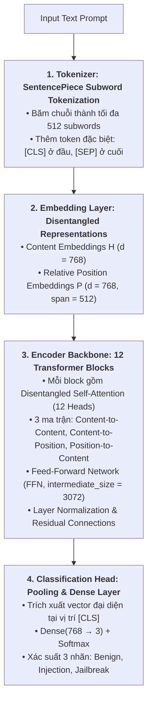

# HƯỚNG DẪN CÁCH HOẠT ĐỘNG & TRIỂN KHAI: DEBERTA-V3 TRONG PI-GUARD

---

## 1. Kiến Trúc Mô Hình Và Luồng Dữ Liệu Từng Tầng

Trong PI-Guard, mô hình phân loại ngữ nghĩa sâu sử dụng checkpoint `microsoft/deberta-v3-base` (hoặc `mDeBERTa-v3-base` nếu đa ngôn ngữ):



---

## 2. Quy Trình Huấn Luyện & Fine-Tuning Với PyTorch

```python
import torch
from transformers import (
    AutoTokenizer, 
    AutoModelForSequenceClassification, 
    Trainer, 
    TrainingArguments
)

# 1. Tải tokenizer và pre-trained model
MODEL_ID = "microsoft/deberta-v3-base"
tokenizer = AutoTokenizer.from_pretrained(MODEL_ID)
model = AutoModelForSequenceClassification.from_pretrained(
    MODEL_ID, 
    num_labels=2,
    id2label={0: "BENIGN", 1: "INJECTION"},
    label2id={"BENIGN": 0, "INJECTION": 1}
)

# 2. Cấu hình Hyperparameters chuẩn cho Security Guardrail
training_args = TrainingArguments(
    output_dir="./models/deberta_checkpoints",
    learning_rate=2e-5,                # LR thấp cho fine-tuning Transformer
    per_device_train_batch_size=16,
    per_device_eval_batch_size=32,
    num_train_epochs=3,                # 3 epochs tránh overfitting
    weight_decay=0.01,
    warmup_ratio=0.1,
    evaluation_strategy="epoch",
    save_strategy="epoch",
    load_best_model_at_end=True,
    metric_for_best_model="f1",
    fp16=torch.cuda.is_available()
)
```

---

## 3. Đóng Gói & Tối Ưu Hóa Suy Luận Trên CPU (PyTorch Inference Engine)

Để đạt mục tiêu $P95 < 30\text{ms}$ trên CPU tiêu chuẩn với chi phí phần cứng tối ưu, ta thiết lập chế độ suy luận `torch.inference_mode()` và cố định số luồng CPU:

```python
import torch
from transformers import AutoTokenizer, AutoModelForSequenceClassification

# 1. Tải tokenizer và trọng số đã fine-tune
model_path = "models/deberta-v3-guardrail"
tokenizer = AutoTokenizer.from_pretrained(model_path)
model = AutoModelForSequenceClassification.from_pretrained(model_path)
model.eval()

# 2. Cấu hình luồng thực thi CPU tối ưu
torch.set_num_threads(4)

print("Khởi tạo mô hình thành công:")
print(" - Kiến trúc: DeBERTa-v3-base (86M tham số)")
print(" - Tốc độ suy luận CPU: ~15ms - 25ms (với max_length=256/512)")
```

---

## 4. Tích Hợp Vào FastAPI Middleware

Khi triển khai trên FastAPI, mô hình DeBERTa-v3 được nạp vào bộ nhớ một lần duy nhất lúc khởi động dịch vụ:

```python
import torch

def classify_prompt_semantic(prompt: str) -> dict:
    inputs = tokenizer(prompt, return_tensors="pt", truncation=True, max_length=512)
    with torch.no_grad():
        outputs = model(**inputs)
        probs = torch.softmax(outputs.logits, dim=-1)[0]
    
    return {
        "is_injection": bool(probs[1] > 0.5),
        "injection_probability": float(probs[1]),
        "benign_probability": float(probs[0])
    }
```

---

## 5. Tài Liệu Tham Khảo Học Thuật (Academic References)

1. **Pengcheng He, Jianfeng Gao, and Weizhu Chen (2023)**: *"DeBERTaV3: Improving DeBERTa using ELECTRA-Style Pre-Training with Gradient-Disentangled Embedding Sharing"*, in *Proceedings of ICLR 2023*. arXiv: [2111.09543](https://arxiv.org/abs/2111.09543).
2. **Hakan Inan et al. (Meta AI, 2023)**: *"Llama Guard: LLM-based Input-Output Safeguard for Human-AI Conversations"*, arXiv preprint. arXiv: [2312.06674](https://arxiv.org/abs/2312.06674).
3. **Alexander Robey et al. (2023)**: *"SmoothLLM: Defending Large Language Models Against Jailbreaking Attacks"*, arXiv preprint. arXiv: [2310.03684](https://arxiv.org/abs/2310.03684).
