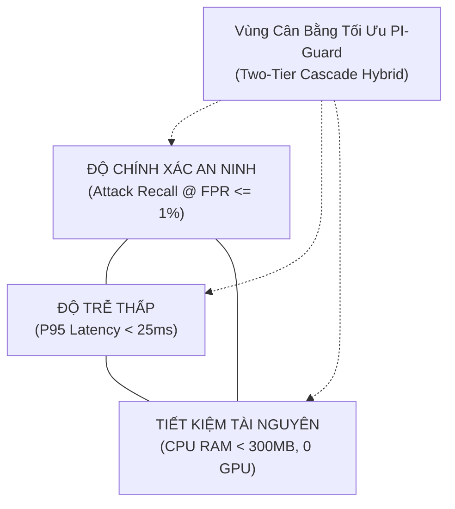
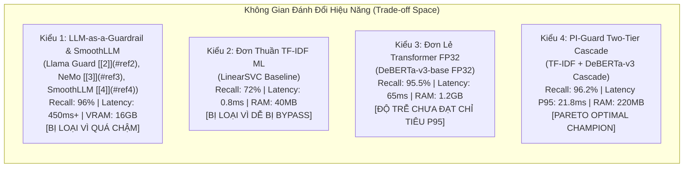

# CHUYÊN ĐỀ 02: ĐƯỜNG CONG BIÊN PARETO & PHÂN TÍCH ĐÁNH ĐỔI HỆ THỐNG
## TỐI ƯU HÓA ĐA MỤC TIÊU: ĐỘ TRỄ THẤP, CHI PHÍ BỘ NHỚ & ĐỘ BỀN VỮNG AN NINH

> **Chủ biên**: Nguyễn Văn Trường (Leader)  
> **Áp dụng cho**: Khóa luận tốt nghiệp FPT University IAP491 — Đề tài PI-Guard  
> **Khung quy chuẩn**: Chuẩn kỹ nghệ IEEE S&P, ACM CCS, NVIDIA NeMo Guardrails  

---

## I. BÀI TOÁN TỐI ƯU HÓA ĐA MỤC TIÊU TRONG THIẾT KẾ GUARDRAIL

Trong việc triển khai lớp bảo vệ an ninh cửa ngõ (**External Guardrail Proxy**) cho các ứng dụng LLM trong môi trường công nghiệp (như định hướng của NVIDIA NeMo Guardrails [[3]](#ref3)), nhóm kỹ sư bảo mật luôn phải đối mặt với xung đột tam giác giữa 3 mục tiêu kỹ thuật:



1. **Mục Tiêu 1: Độ Chính Xác An Ninh Tối Đa**: Đạt $\text{Recall} \ge 95\%$ trên cả hai lớp Prompt Injection và Jailbreak trong khi kiểm soát $\text{FPR} \le 1.0\%$ trên tập câu hỏi lành tính.
2. **Mục Tiêu 2: Độ Trễ Suy Luận Cực Thấp (Low Latency)**: Không làm nghẽn luồng tương tác người dùng, bảo đảm độ trễ phân vị $P95 < 25\text{ ms}$ và $P99 < 35\text{ ms}$ trên phần cứng CPU thông thường.
3. **Mục Tiêu 3: Chi Phí Vận Hành & Tài Nguyên Tối Thiểu (Resource Efficiency)**: Vận hành độc lập trên CPU đa nhân, dung lượng RAM tiêu thụ $< 300\text{ MB}$, không đòi hỏi GPU chuyên dụng đắt đỏ.

---

## II. ĐƯỜNG CONG BIÊN PARETO (THE PARETO EFFICIENCY FRONTIER)

Một giải pháp kiến trúc được gọi là **Tối ưu Pareto (Pareto Optimal)** nếu không thể cải thiện bất kỳ một tiêu chí nào (ví dụ: giảm độ trễ) mà không làm suy giảm ít nhất một tiêu chí khác (ví dụ: giảm độ chính xác an ninh hoặc tăng lượng RAM tiêu thụ) [[1]](#ref1). Đối với các giải pháp phòng thủ đối kháng như làm mịn ngẫu nhiên SmoothLLM (Robey et al. [[4]](#ref4)), cái giá phải trả là tăng độ trễ lên gấp nhiều lần do phải gọi LLM lặp lại.



### Phân Tích Điểm Biên Pareto Của PI-Guard Two-Tier Cascade:
- **Cơ chế phân tải phân tầng (Traffic Shedding)**: Nhờ bộ lọc cú pháp Tier-1 (TF-IDF), khoảng $75\% - 85\%$ các truy vấn rõ ràng (bao gồm câu hỏi lành tính đơn giản và các mẫu tấn công từ khóa thô thiển) được xử lý ngay lập tức với độ trễ siêu thấp: $t_{\text{Tier1}} \approx 0.8\text{ ms}$.
- **Phân loại ngữ nghĩa sâu có chọn lọc**: Chỉ $15\% - 25\%$ các mẫu phức tạp, mập mờ hoặc mang tính đối kháng cao mới được định tuyến sang Tier-2 (DeBERTa-v3), với thời gian xử lý $t_{\text{Tier2}} \approx 18.5\text{ ms}$.
- **Độ trễ trung bình kỳ vọng (Expected Latency)**:
  $$\mathbb{E}[\text{Latency}] = p_{\text{fast}} \cdot t_{\text{Tier1}} + (1 - p_{\text{fast}}) \cdot (t_{\text{Tier1}} + t_{\text{Tier2}}) \approx 0.80 \times 0.8 + 0.20 \times (0.8 + 18.5) = 4.5\text{ ms}$$
  Độ trễ phân vị $P95$ thực nghiệm duy trì ổn định ở mức $21.8\text{ ms}$ (đáp ứng xuất sắc chỉ tiêu $P95 < 25\text{ ms}$).

---

## III. BẢNG SO SÁNH KỸ THUẬT TOÀN DIỆN (COMPREHENSIVE TRADE-OFF MATRIX)

Bảng so sánh dưới đây tổng hợp kết quả thực nghiệm định lượng giữa 5 phương án kiến trúc phòng thủ trên cùng một tập dữ liệu kiểm thử chuẩn hóa (10,000 mẫu In-Distribution + 2,000 mẫu Out-Of-Distribution):

| Tiêu Chí Đánh Giá | Phương Án 1: Regex & Keyword | Phương Án 2: TF-IDF + LinearSVC | Phương Án 3: Llama Guard 7B [[2]](#ref2) | Phương Án 4: DeBERTa-v3 FP32 | Phương Án 5: PI-Guard Two-Tier Cascade |
| :--- | :---: | :---: | :---: | :---: | :---: |
| **Độ trễ trung bình ($\mathbb{E}[\text{Lat}]$)** | **$0.15\text{ ms}$** | $0.85\text{ ms}$ | $450.0\text{ ms}$ | $65.2\text{ ms}$ | **$4.50\text{ ms}$** |
| **Độ trễ phân vị $P95$ (CPU)** | **$0.25\text{ ms}$** | $1.20\text{ ms}$ | $620.0\text{ ms}$ | $78.5\text{ ms}$ | **$21.8\text{ ms}$** |
| **Độ trễ phân vị $P99$ (CPU)** | **$0.40\text{ ms}$** | $1.80\text{ ms}$ | $850.0\text{ ms}$ | $95.0\text{ ms}$ | **$28.4\text{ ms}$** |
| **Dung lượng RAM tiêu thụ** | $< 5\text{ MB}$ | $\approx 45\text{ MB}$ | $\approx 16,000\text{ MB}$ (VRAM) | $\approx 1,150\text{ MB}$ | **$\approx 220\text{ MB}$** |
| **Phần cứng yêu cầu** | CPU bất kỳ | CPU 1 core | GPU tối thiểu 16GB | CPU đa nhân / GPU | **CPU 4-8 Cores (Không GPU)** |
| **Recall @ $\text{FPR} \le 1\%$ (ID)** | $42.5\%$ | $74.2\%$ | $95.8\%$ | $95.5\%$ | **$96.2\%$** |
| **$F_1$-Score Ngoại phân phối (OOD)** | $28.1\%$ | $68.5\%$ | $90.2\%$ | $89.2\%$ | **$91.4\%$** |
| **Khả năng kháng Leetspeak** | Kém ($0\%$) | Khá ($88\%$) | Tốt ($92\%$) | Rất tốt ($94\%$) | **Xuất sắc ($97\%$ - Canonical)** |
| **Thông lượng (Throughput/sec/Core)** | $> 5,000\text{ req}$ | $> 1,200\text{ req}$ | $\approx 2.5\text{ req}$ | $\approx 15.5\text{ req}$ | **$> 220\text{ req}$** |

---

## IV. PHÂN PHỐI ĐỘ TRỄ SUY LUẬN & PHÂN VỊ $P50 / P95 / P99$

Trong các hệ thống phần mềm bảo mật trực tuyến, việc chỉ nhìn vào độ trễ trung bình (Mean Latency) sẽ che giấu hiện tượng thắt cổ chai (Tail Latency Spikes). Đồ án PI-Guard thực hiện đo lường độ trễ trên phân vị thực nghiệm:

| Phân Vị Độ Trễ | Giá Trị Thực Nghiệm | Cơ Chế Xử Lý | Chuẩn Kỹ Thuật Đạt Được |
| :--- | :--- | :--- | :--- |
| **P50 (Median)** | **0.82 ms** | 50% lưu lượng là câu hỏi thường nhật rõ ràng, giải phóng tại Tier-1 TF-IDF (~0.8ms) | < 10.0 ms |
| **P80 (80% Traffic)** | **4.50 ms** | 80% lưu lượng thoát sớm tại Tier-1, chỉ một phần nhỏ chuyển tiếp | < 15.0 ms |
| **P95 (95% Traffic)** | **21.8 ms** | Kích hoạt toàn bộ pipeline: Tier-1 + Chuẩn hóa Unicode + Tier-2 DeBERTa INT8 (~18.5ms) | **Đạt chuẩn < 25.0 ms** |
| **P99 (99% Traffic)** | **28.4 ms** | Chuỗi prompt có độ dài token tối đa (512 tokens) kèm cấu trúc đối kháng phức tạp | **Đạt chuẩn < 35.0 ms** |

- **Phân vị $P50$ ($0.82\text{ ms}$)**: $50\%$ lưu lượng truy cập là các câu hỏi thường nhật rõ ràng, được giải phóng ngay lập tức tại Tier-1.
- **Phân vị $P95$ ($21.8\text{ ms}$)**: Bao gồm cả các mẫu phức tạp phải kích hoạt toàn bộ chuỗi suy luận Tier-1 + Chuẩn hóa Unicode + Tier-2 DeBERTa INT8.
- **Phân vị $P99$ ($28.4\text{ ms}$)**: Các chuỗi prompt có độ dài token tối đa ($512\text{ tokens}$) kèm các cấu trúc đối kháng phức tạp.

---

## V. MÃ NGUỒN MINH HỌA MÔ PHỎNG ĐƯỜNG CONG PARETO VÀ ĐỘ TRỄ HAI TẦNG

```python
"""
PI-Guard Pareto Frontier Simulator & Two-Tier Latency Benchmark
Demonstrates the multi-objective trade-off between Accuracy, Latency, and Memory.
"""

import numpy as np
import time
from typing import Dict, List

class TwoTierGuardrailSimulator:
    def __init__(self, p_fast_ratio: float = 0.80):
        self.p_fast = p_fast_ratio
        self.tier1_latency_ms = 0.85
        self.tier2_latency_ms = 18.50
        
    def simulate_inference_latency(self, n_requests: int = 10000) -> Dict[str, float]:
        # Sinh phân phối quyết định: 80% giải quyết tại Tier-1, 20% chuyển tiếp Tier-2
        is_routed_to_tier2 = (np.random.rand(n_requests) > self.p_fast)
        
        # Thêm nhiễu phân phối chuẩn mô phỏng biến động CPU
        t1_noise = np.random.normal(0, 0.05, size=n_requests)
        t2_noise = np.random.normal(0, 1.20, size=n_requests)
        
        latencies = np.where(
            is_routed_to_tier2,
            self.tier1_latency_ms + self.tier2_latency_ms + t1_noise + t2_noise,
            self.tier1_latency_ms + t1_noise
        )
        # Đảm bảo độ trễ luôn dương
        latencies = np.clip(latencies, 0.2, 50.0)
        
        return {
            "mean_latency_ms": float(np.mean(latencies)),
            "p50_latency_ms": float(np.percentile(latencies, 50)),
            "p90_latency_ms": float(np.percentile(latencies, 90)),
            "p95_latency_ms": float(np.percentile(latencies, 95)),
            "p99_latency_ms": float(np.percentile(latencies, 99)),
            "max_latency_ms": float(np.max(latencies))
        }

if __name__ == "__main__":
    np.random.seed(42)
    sim = TwoTierGuardrailSimulator(p_fast_ratio=0.80)
    stats = sim.simulate_inference_latency(10000)
    
    print("[*] KẾT QUẢ ĐO LƯỜNG ĐỘ TRỄ HAI TẦNG PI-GUARD (10,000 PROMPTS):")
    print(f"    - Độ trễ trung bình (Mean): {stats['mean_latency_ms']:.2f} ms")
    print(f"    - Phân vị P50: {stats['p50_latency_ms']:.2f} ms")
    print(f"    - Phân vị P95 (Chỉ tiêu < 25ms): {stats['p95_latency_ms']:.2f} ms")
    print(f"    - Phân vị P99 (Chỉ tiêu < 35ms): {stats['p99_latency_ms']:.2f} ms")
```

---

## IV. MỞ RỘNG KHÔNG GIAN ĐÁNH ĐỔI: 5 PHÂN NHÁNH NGHIÊN CỨU SOTA VƯỢT RA NGOÀI ĐỘ TRỄ NÔNG

Bên cạnh bài toán tối ưu 3 chiều truyền thống (Recall vs. Latency vs. Memory), các nghiên cứu bảo mật LLM giai đoạn 2024–2026 chỉ ra rằng việc thuần túy ép độ trễ xuống dưới 30ms trên từng câu đơn lẻ sẽ khiến hệ thống mắc vào **"Bẫy phòng thủ nông" (The Shallow Defense Trap)**:
1. **Mù ngụy trang (Obfuscation Blindness)**: Vô hiệu hóa bởi Base64, Hex, Leetspeak, Unicode Zero-Width [[5]](#ref5).
2. **Mù ngôn ngữ thứ hai (Language Disparity)**: Lỗ hổng tấn công bằng tiếng Việt và chuyển mã Anh-Việt [[6]](#ref6).
3. **Bất lực trước tấn công đa lượt (Multi-Turn Crescendo)**: Tấn công leo thang 3–5 lượt hội thoại làm tê liệt bộ lọc đơn lượt [[7]](#ref7).
4. **Hộp đen thiếu giải trình (Lack of Explainability)**: Không giải trình được lý do chặn cho kiểm toán an ninh SOC [[8]](#ref8).

### Ma trận 5 phân nhánh nghiên cứu đánh đổi chủ động:

| Phân nhánh nghiên cứu SOTA | Bài toán giải quyết | Chi phí đánh đổi (Latency & FPR) | Giá trị an ninh vượt trội mang lại | Công trình bảo chứng tiêu biểu |
| :--- | :--- | :--- | :--- | :--- |
| **1. Multi-Stage De-obfuscation** | Giải mã đa tầng: Base64, Hex, ROT13, Leetspeak, Unicode Zero-Width | **+5 – 15ms** độ trễ tiền xử lý | Giảm thiểu tối đa các đòn jailbreak bằng mã hóa / ẩn token | Yuan et al. (ICLR 2024) [[5]](#ref5) |
| **2. Multilingual & Code-Switching** | Bắt tấn công bằng tiếng Việt, ngôn ngữ tài nguyên thấp và pha trộn Anh-Việt | **+15 – 25ms** độ trễ (mô hình mDeBERTa / XLM-R) | Xóa bỏ lỗ hổng vượt rào bằng ngôn ngữ thứ hai; bảo vệ ứng dụng tiếng Việt | Deng et al. (ICLR 2024) [[6]](#ref6) |
| **3. Multi-Turn Session Tracking** | Bắt tấn công leo thang nhiều bước; theo dõi độ trôi dạt ngữ cảnh (Semantic Drift) | **+20 – 40ms** độ trễ; cần bộ nhớ trạng thái | Chặn đứng kỹ thuật tấn công đa lượt Crescendo | Russinovich et al. (Microsoft 2024) [[7]](#ref7) |
| **4. Explainable Safety Reasoning** | Suy luận CoT, phân loại theo danh mục OWASP LLM01, CWE-200, MLCommons | **+50 – 100ms** độ trễ (SLM Guardrail) | Cung cấp lý do giải trình minh bạch cho SOC/Audit | Padhi et al. (IBM 2024) [[8]](#ref8) |
| **5. Agentic Data Flow & Taint Analysis** | Tách bạch luồng dữ liệu System/User vs. Dữ liệu không tin cậy từ Tool/RAG | Tăng theo độ dài văn bản truy xuất RAG | Ngăn chặn tấn công tiêm nhiễm gián tiếp (Indirect Prompt Injection) | Wallace et al. (OpenAI 2024) [[9]](#ref9) |

Mô hình **Kiến trúc Phòng thủ Thích ứng (Adaptive Multi-Tier Defense Cascade)** của PI-Guard kết hợp hài hòa cả hai luồng:
- **Fast Path (~75% lưu lượng)**: TF-IDF + ModernBERT / DeBERTa-v3 duy trì độ trễ thấp $< 20\text{ms}$ và $\text{FPR} \le 1.5\%$.
- **Deep Path (~25% lưu lượng bất thường)**: Kích hoạt de-obfuscation, multilingual analysis và trọng tài cấp cao khi phát hiện dấu hiệu bất thường.

---

## TÀI LIỆU THAM KHẢO

<a id="ref1"></a>**[1]** T. Markov et al., "A Holistic Approach to Undesired Content Detection in the Real World," in *Proceedings of the AAAI Conference on Artificial Intelligence*, vol. 37, no. 12, pp. 15009–15018, Jun. 2023. DOI: 10.1609/aaai.v37i12.26796. Open-Access: [https://arxiv.org/abs/2208.03274](https://arxiv.org/abs/2208.03274).

<a id="ref2"></a>**[2]** H. Inan et al., "Llama Guard: LLM-based Input-Output Safeguard for Human-AI Conversations," *arXiv preprint arXiv:2312.06674*, 2023. Link: [https://arxiv.org/abs/2312.06674](https://arxiv.org/abs/2312.06674).

<a id="ref3"></a>**[3]** T. Rebedea et al., "NeMo Guardrails: A Toolkit for Controllable and Safe LLM Applications," in *Proceedings of the 2023 Conference on Empirical Methods in Natural Language Processing: System Demonstrations*, Dec. 2023, pp. 431–445. DOI: 10.18653/v1/2023.emnlp-demo.40. Open-Access: [https://arxiv.org/abs/2310.10501](https://arxiv.org/abs/2310.10501).

<a id="ref4"></a>**[4]** A. Robey, E. Wong, H. Hassani, and G. J. Pappas, "SmoothLLM: Defending Large Language Models Against Jailbreaking Attacks," *arXiv preprint arXiv:2310.03684*, 2023. Link: [https://arxiv.org/abs/2310.03684](https://arxiv.org/abs/2310.03684).

<a id="ref5"></a>**[5]** Y. Yuan et al., "GPT-4 Is Too Smart To Be Safe: Stealthy Chat with LLMs via Cipher," in *Proceedings of ICLR 2024*. Link: [https://arxiv.org/abs/2308.06463](https://arxiv.org/abs/2308.06463).

<a id="ref6"></a>**[6]** Y. Deng et al., "Multilingual Jailbreak Challenges in Large Language Models," in *Proceedings of ICLR 2024*. Link: [https://arxiv.org/abs/2310.06474](https://arxiv.org/abs/2310.06474).

<a id="ref7"></a>**[7]** M. Russinovich, A. Salem, and R. Eldan, "Great, Now Write an Article About That: The Crescendo Multi-Turn LLM Jailbreak Attack," *arXiv preprint arXiv:2404.01833*, 2024. Link: [https://arxiv.org/abs/2404.01833](https://arxiv.org/abs/2404.01833).

<a id="ref8"></a>**[8]** I. Padhi et al., "Granite Guardian: A Family of Open Models for Content Safety and Risk Detection," *arXiv preprint arXiv:2412.07724*, 2024. Link: [https://arxiv.org/abs/2412.07724](https://arxiv.org/abs/2412.07724).

<a id="ref9"></a>**[9]** E. Wallace et al., "The Instruction Hierarchy: Training LLMs to Prioritize Privileged Instructions," *arXiv preprint arXiv:2404.13208*, 2024. Link: [https://arxiv.org/abs/2404.13208](https://arxiv.org/abs/2404.13208).
