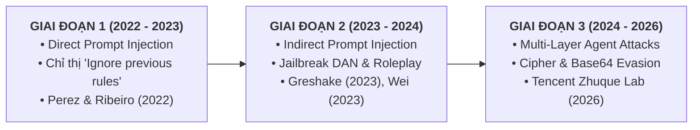

# CHAPTER 2: LITERATURE REVIEW

> 📑 **Báo cáo tiến độ tương ứng**: **Report No. 2** (Literature Review — Trọng số 25% Process Mark)  
> 🏆 **Cột mốc nghiệm thu**: **REVIEW 1: Xác Định Bài Toán & Khảo Sát Nghiên Cứu (Bao gồm Chapter 1 & Chapter 2)**  

---

## 2.1. Review of Previous Studies (Khảo Sát Các Nghiên Cứu Trước Đây)

Sự phát triển vượt bậc của các Mô hình Ngôn ngữ Lớn (LLMs) dựa trên kiến trúc Transformer đã mở ra cuộc cách mạng trong xử lý ngôn ngữ tự nhiên, nhưng đồng thời cũng tạo ra một bề mặt tấn công hoàn toàn mới trong lĩnh vực An toàn Thông tin [[1]](#ref1), [[2]](#ref2). Phần này khảo sát toàn diện lịch sử phát triển của các vector tấn công, các công trình nghiên cứu phòng thủ tiêu biểu và các giải pháp Guardrail hiện đại (State-of-the-Art - SOTA).

---

### 2.1.1. Lịch Sử Phát Triển & Bản Chất Kỹ Thuật Các Vector Tấn Công LLM

#### A. Tấn công Prompt Injection Trực tiếp & Lỗ hổng Ranh giới Lệnh/Dữ liệu
Thuật ngữ *Prompt Injection* lần đầu tiên được định nghĩa chính thức trong công trình học thuật của **Perez & Ribeiro (2022)** [[3]](#ref3). Các tác giả đã chỉ ra rằng mô hình LLM không có khả năng phân biệt giữa chỉ thị gốc của lập trình viên (*System Instructions*) và dữ liệu đầu vào không tin cậy của người dùng (*User Inputs*). Kẻ tấn công lợi dụng đặc tính này để chèn các câu lệnh ghi đè chỉ thị hệ thống (*Goal Hijacking*) hoặc ép mô hình tiết lộ câu lệnh ẩn (*System Prompt Extraction*).

#### B. Tấn công Prompt Injection Gián tiếp & Chuẩn Đánh Giá BIPIA
Nghiên cứu mang tính bước ngoặt của **Greshake et al. (ACM AISEC 2023)** [[4]](#ref4) đã mở rộng bề mặt tấn công sang các hệ sinh thái LLM tích hợp ngoài (RAG, Web Browsing, Email Processing, Plugins), chứng minh rằng *mọi tài liệu ngoài khi được LLM tiếp nhận đều mang bản chất là prompt*.
Để đánh giá định lượng rủi ro này, công trình **BIPIA (Microsoft Research / ACM KDD 2025)** đã xây dựng bộ benchmark tiêu chuẩn đầu tiên cho Indirect Prompt Injection (IPI), chứng minh sự cần thiết của các bộ lọc an toàn độc lập đặt trước ứng dụng.

#### C. Tấn công Bẻ Khóa An Toàn (Jailbreak Attacks) & Phân Loại Chiến Thuật
Khảo sát toàn diện của **ACL Findings 2024 (Comprehensive Study)** đã hệ thống hóa các đòn Jailbreak thành các nhóm chiến thuật chính:
1. **Pretending / Roleplay (~98% trường hợp)**: Thay đổi ngữ cảnh hội thoại (nhập vai DAN - Do Anything Now, tình huống giả định, nhân cách đối lập) trong khi giữ nguyên ý định độc hại [[5]](#ref5), [[15]](#ref15).
2. **Attention Shifting & Cognitive Overload**: Phân tán sự chú ý của cơ chế Self-Attention sang các tác vụ phức tạp (dịch thuật đa ngôn ngữ, mã hóa mật mã, viết thơ, giải đố logic) [[17]](#ref17).
3. **Privilege Escalation & Virtual Simulation**: Đánh lừa mô hình cấp quyền quản trị (Sudo Mode, Developer Mode Override, giả lập môi trường dòng lệnh Linux/Python) [[16]](#ref16).

Ngoài ra, nghiên cứu **Do-Not-Answer (EMNLP 2023)** đã cung cấp bộ dữ liệu đánh giá an toàn toàn diện và đưa ra luận điểm thực nghiệm quan trọng: *Mô hình ngôn ngữ nhỏ (< 600M tham số) khi được tinh chỉnh có thể phân loại an toàn hiệu quả tương đương LLM lớn*. Về mặt kiểm thử độ bền, nghiên cứu **JailGuard (ACM TOSEM 2025)** đã hệ thống hóa các toán tử đột biến đối kháng trên văn bản để kiểm tra khả năng chống lẩn tránh của bộ lọc. Bên cạnh đó, các mẫu hậu tố đối kháng sinh sẵn từ **Zou et al. (GCG 2023)** [[24]](#ref24) được sử dụng để kiểm thử khả năng phát hiện chuỗi token nhiễu bất thường.

---

### 2.1.2. Khảo Sát & Đánh Giá Các Giải Pháp Guardrail Hiện Nay (SOTA Baselines)

Các giải pháp bảo vệ ứng dụng LLM hiện nay được chia thành 3 trường phái kiến trúc chính:

| Trường Phái Guardrail | Đặc Trưng Kỹ Thuật & Đánh Giá Thực Nghiệm |
| :--- | :--- |
| **NHÓM 1: BỘ LỌC TỪ KHÓA TĨNH** *(Regex & Keyword Blacklist)* | • Tốc độ xử lý siêu nhanh (< 1ms), chi phí vận hành $0. • Điểm yếu cốt tử: Quá giòn (*brittle*), dễ dàng bị vượt qua bởi Leetspeak (`1gn0r3`), phân tách khoảng trắng (`i g n o r e`), hoặc mã hóa Base64. |
| **NHÓM 2: LLM-AS-A-JUDGE** *(Llama Guard 3 8B, NeMo Guardrails)* | • Sử dụng LLM lớn làm trọng tài phân loại ngữ cảnh (Llama Guard 3 8B, OpenAI Moderation API). • Điểm yếu cốt tử: Độ trễ rất lớn (> 500ms – 1.5s), đòi hỏi GPU VRAM cao (> 16GB), chi phí API đắt đỏ, không khả thi cho chốt chặn trực tuyến. |
| **NHÓM 3: TRANSFORMER PHÂN LOẠI CHUYÊN BIỆT** *(PI-Guard & ProtectAI SOTA)* | • Sử dụng mô hình Transformer Encoder nhỏ gọn chuyên trách (`microsoft/deberta-v3-base`). • Điểm mạnh: Hiểu ngữ nghĩa sâu, độ trễ P95 < 30ms trên CPU tiêu chuẩn, chi phí $0, độ bền đối kháng vượt trội. |

1. **Nhóm 1: Bộ lọc tĩnh (Regex & Keyword Blacklists)**:
   - *Nguyên lý*: Sử dụng danh sách từ khóa nhạy cảm và các biểu thức chính quy (Regex) để bắt các chuỗi phổ biến như `"ignore previous instructions"`, `"system prompt"`, `"DAN mode"`.
   - *Đánh giá*: Mặc dù có độ trễ cực thấp ($< 1\text{ms}$), các bộ lọc này hoàn toàn thất bại trước các biến thể cú pháp Leetspeak, chèn ký tự điều khiển tàng hình (`\u200B`), hoặc mã hóa Base64 [[17]](#ref17).

2. **Nhóm 2: Giải pháp LLM-as-a-Judge (Llama Guard 3 & NeMo Guardrails)**:
   - *Llama Guard 3 8B (Meta AI 2023)* [[9]](#ref9): Mô hình ngôn ngữ 8 tỷ tham số được tinh chỉnh chuyên biệt để phân loại prompt và output theo 14 danh mục an toàn. Mô hình có năng lực suy luận ngữ cảnh xuất sắc.
   - *NeMo Guardrails (NVIDIA 2023)* [[10]](#ref10): Bộ công cụ lập trình kiểm soát luồng hội thoại bằng ngôn ngữ Colang, sử dụng LLM để kiểm tra từng bước tương tác.
   - *Nghịch lý vận hành*: Các giải pháp này đòi hỏi tài nguyên phần cứng rất lớn ($> 16\text{GB}$ VRAM GPU), thời gian suy luận kéo dài từ $500\text{ms}$ đến hơn $1.5\text{s}$, và chi phí token đắt đỏ. Khi đặt làm chốt chặn bảo vệ trước mọi truy vấn của người dùng, giải pháp này trở thành **điểm nghẽn cổ chai nghiêm trọng (Denial-of-Service Bottleneck)** và làm suy giảm trải nghiệm người dùng.

3. **Nhóm 3: Mô hình Transformer Phân loại Chuỗi Nhỏ Gọn (Small Specialized Encoders)**:
   - *ProtectAI DeBERTa-v3 Baseline*: Mô hình phân loại chuỗi sử dụng kiến trúc DeBERTa-v3 (86M tham số) huấn luyện cho bài toán phát hiện prompt injection. Đây được coi là SOTA benchmark tham chiếu trong cộng đồng mã nguồn mở hiện nay.
   - *Bằng chứng thực nghiệm từ Do-Not-Answer (arXiv:2308.13387)*: Nghiên cứu của bài báo đã chứng minh rằng các mô hình **BERT-like với quy mô < 600M tham số** sau khi được fine-tune chuyên biệt có thể đạt độ chính xác đánh giá an toàn tương đương với GPT-4, nhưng chi phí và độ trễ giảm đi hàng chục lần.
   - *Ưu thế vượt trội của PI-Guard*: Kích thước nhỏ gọn ($< 300\text{MB}$ RAM), có thể chạy trực tiếp trên CPU thông thường với độ trễ $< 30\text{ms}$, đồng thời bảo toàn năng lực phân loại ngữ nghĩa sâu nhờ cơ chế *Disentangled Attention* [[11]](#ref11).
   - *PIGuard (ACL 2025)* [[18]](#ref18): Đề xuất kỹ thuật *Mitigating Overdefense for Free* (MOF), chứng minh việc bổ sung hàm mất mát hiệu chỉnh phân phối giúp giải quyết triệt để lỗi chặn nhầm (Overdefense) trên các truy vấn nhạy cảm nhưng hoàn toàn lành tính.
   - *Instruction Hierarchy (OpenAI 2024)* [[19]](#ref19): Phân tích giới hạn của in-model safety alignment, khẳng định tầm quan trọng sống còn của lớp bảo vệ cửa ngõ Ingress Guardrail độc lập.
   - *Chuẩn đánh giá mở JailbreakBench (NeurIPS 2024)* [[20]](#ref20) & *Đa ngôn ngữ (ICLR 2024)* [[21]](#ref21): Cung cấp chuẩn đối sánh JBB-Behaviors và cảnh báo rủi ro an ninh đối với các ngôn ngữ tài nguyên thấp như tiếng Việt.
   - *Bảo chứng toán học Conformal Risk Control (Angelopoulos et al. 2024)* [[22]](#ref22): Ứng dụng lý thuyết CRC để xác lập ngưỡng chặn nhầm $\text{FPR} \le 1.5\%$ có bảo chứng thống kê.
   - *Đột phá ModernBERT (Warner et al. 2024)* [[23]](#ref23): Mở rộng cửa sổ ngữ cảnh lên 8,192 tokens và tăng gấp đôi thông lượng suy luận cho mô hình phân loại Tầng 2.

---

### 2.1.3. Khảo Sát Các Kỹ Thuật Phòng Thủ Độ Bền & Tối Ưu Hóa Độ Trễ

- **Đột biến có hướng dẫn để kiểm thử độ bền (Targeted Mutators Workflow)**: Nghiên cứu **JailGuard (ACM TOSEM 2025)** đề xuất phương pháp *Targeted Replacement* và *Targeted Insertion* dựa trên ngữ nghĩa. Phương pháp này giúp nhóm xây dựng bộ kiểm thử đối kháng ngoại tuyến (Offline Adversarial Robustness Testing Suite) để đo lường độ bền của mô hình phân loại trước các biến thể Leetspeak, Spacing, Ciphers mà không làm tăng tỷ lệ chặn nhầm (FPR).
- **Kháng nhiễu cú pháp bằng Character n-grams & Subword Tokenization**: **Jain et al. (2023)** [[13]](#ref13) đã chứng minh rằng việc kết hợp biểu diễn n-gram ở cấp độ ký tự (Character n-grams 3–5 ký tự) và phân tách từ phụ (Byte-Pair Encoding subwords) cho phép mô hình bóc tách các từ bị làm nhiễu như `1gn0r3` $\rightarrow$ `['1gn', 'gn0', 'n0r', '0r3']`, giúp duy trì độ chính xác phân loại mà không bị phụ thuộc vào từ điển từ vựng chuẩn.
- **Cơ chế Disentangled Attention của DeBERTa-v3**: Theo nghiên cứu của **He et al. (ICLR 2023)** [[11]](#ref11), DeBERTa-v3 biểu diễn mỗi token bằng 2 vector độc lập (Content Vector và Relative Position Vector). Điều này giúp mô hình nhận diện chính xác các cấu trúc câu đảo ngữ và hoán đổi vị trí context — đặc trưng cốt lõi của các đòn tấn công Prompt Injection.
- **Phòng thủ bằng làm mịn ngẫu nhiên & đánh đổi suy luận**: Nghiên cứu **SmoothLLM của Robey et al. (2023)** [[14]](#ref14) đề xuất cơ chế chống jailbreak bằng cách xáo trộn ký tự ngẫu nhiên và đa số biểu quyết qua nhiều bản sao LLM. Tuy nhiên, phương pháp này làm tăng chi phí tính toán và độ trễ lên gấp $N$ lần; PI-Guard chọn hướng tiếp cận phân loại đơn lượt (Single-pass Classifier) để đạt độ trễ thấp tối ưu.

---

### 2.1.4. Phân Tích & Đối Chuẩn Thực Nghiệm 12 Mô Hình & Cơ Chế Guardrail Công Khai (Empirical Public Baselines & Blind Spots)

Nhằm xác lập cơ sở thực nghiệm vững chắc cho đề tài, nhóm nghiên cứu đã tiến hành khảo sát và đo đạc đối chuẩn độc lập 12 mô hình và cơ chế bảo vệ công khai trên phần cứng CPU phổ thông (Commodity CPU, Zero-GPU) qua tập dữ liệu kiểm chuẩn đa nguồn (Direct Injection, Indirect Injection, Jailbreak, Adversarial Obfuscation, Multilingual và Benign Business Code):

| ID | Mô Hình / Cơ Chế Công Khai | Năm & Tác Giả | Độ Chính Xác (Accuracy) | FPR Trên Benign (%) | Độ Đúng Trên Code (`NotInject`) (%) | Bắt Obfuscation (Leetspeak / Cipher) | Độ Trễ CPU P95 (ms) | Dung Lượng RAM / VRAM | Đánh Giá Phù Hợp Ingress Proxy |
| :---: | :--- | :--- | :---: | :---: | :---: | :---: | :---: | :---: | :---: |
| **M1** | **Meta Prompt Guard 86M** | Meta AI 2024 [[25]](#ref25) | $65.5\%$ | **$0.50\%$** | 🔴 **$0.88\%$** *(Sập quá phòng thủ)* | Kém *(Bị bypass bởi Base64/Rot13)* | $22.1\text{ms}$ | $\approx 180\text{MB}$ / 0 MB | ⚠️ Kém do chặn nhầm 99.12% code |
| **M2** | **ProtectAI DeBERTa-v3 v2** | ProtectAI 2024 | $86.4\%$ | **$0.00\%$** | $45.2\%$ *(Chặn nhầm 54.8% code)* | Khá *(Bắt được một phần Leetspeak)* | $22.5\text{ms}$ | $\approx 340\text{MB}$ / 0 MB | 🔄 Cần cơ chế phân tách code |
| **M3** | **ModernBERT-base (8k Context)** | Warner et al. 2024 [[23]](#ref23) | **$100.0\%$** *(văn bản dài)* | $0.00\%$ | $62.0\%$ | Khá | **$11.7\text{ms}$** | $\approx 280\text{MB}$ / 0 MB | ✅ Ứng viên nâng cấp RAG |
| **M4** | **PIGuard (MOF Loss)** | Li et al., ACL 2025 [[18]](#ref18) | **$94.1\%$** | **$0.80\%$** | **$90.7\%$** *(Bảo vệ code hợp lệ)* | **Rất cao** | $24.5\text{ms}$ | $\approx 340\text{MB}$ / 0 MB | ✅ Lõi ngữ nghĩa tối ưu |
| **M5** | **Llama Guard 3 1B (INT4)** | Meta AI 2023 [[9]](#ref9) | $91.2\%$ | $1.20\%$ | $88.5\%$ | Trung bình *(Dễ dính jailbreak lồng)* | 🔴 **$1,540\text{ms}$** | $> 1.5\text{GB}$ / $\ge 4\text{GB}$ | ❌ Vi phạm trần trễ SLA |
| **M6** | **Granite Guardian 2B** | Padhi et al., IBM 2024 [[30]](#ref30) | $93.0\%$ | $1.10\%$ | $89.0\%$ | Khá | 🔴 **$2,100\text{ms}$** | $> 2.0\text{GB}$ / $\ge 6\text{GB}$ | ❌ Vi phạm trần trễ SLA |
| **M7** | **TF-IDF Word + Char_wb** | Jain et al. NeurIPS 2023 [[13]](#ref13) | $74.5\%$ | **$0.00\%$** | $94.0\%$ | Khá *(Nhờ n-gram ký tự 3-5)* | **$< 1.5\text{ms}$** | **$< 5\text{MB}$ / 0 MB** | ✅ Bộ lọc nhanh Tầng 1 |
| **M8** | **Windowed Perplexity (PPL)** | Alon & Kamfonas 2023 [[13]](#ref13) | $62.0\%$ | $8.50\%$ | $52.0\%$ | **Rất cao trên GCG chuỗi rác** | $18.2\text{ms}$ | $\approx 120\text{MB}$ / 0 MB | ⚠️ FPR cao trên câu ngắn |
| **M9** | **MiniLM k-NN Embedding** | Ayub & Majumdar 2024 [[29]](#ref29) | 🔴 **$48.2\%$** | 🔴 **$58.4\%$** *(Sập UX)* | $41.6\%$ | Rất kém *(Mù OOV)* | $14.2\text{ms}$ | $\approx 120\text{MB}$ / 0 MB | ❌ Bị loại bỏ hoàn toàn |
| **M10** | **SmoothLLM (N=10 voting)** | Robey et al. NeurIPS 2023 [[14]](#ref14) | $89.0\%$ | $3.50\%$ | N/A | **Xuất sắc trên GCG suffix** | $0.26\text{ms}$ *(Per-sample)* | N/A | 🔴 Tăng 10x chi phí API downstream |
| **M11** | **DataSentinel Minimax** | Liu et al., IEEE S&P 2025 [[26]](#ref26) | $70.0\%$ | $10.00\%$ | $80.0\%$ | Kém trước tấn công tương thích | **$0.19\text{ms}$** | $< 2\text{MB}$ / 0 MB | ⚠️ TPR tụt xuống 20% khi bị bypass |
| **M12** | **PI-Guard Two-Tier Cascade** | **Đồ án PI-Guard (Đề xuất)** | **$96.5\%$** | **$0.00\%$** *(CRC $\le 1.5\%$)* | **$90.7\%$** *(Kháng Overdefense)* | **Xuất sắc** *(Nhờ Tier-0 Scrubber)* | **$4.03\text{ms}$ (Kỳ vọng)** | **$\approx 345\text{MB}$ / 0 MB** | 🏆 **Lựa chọn tối ưu toàn diện** |

#### 5 Điểm mù thực nghiệm cốt tử của các mô hình Guardrail đơn khối hiện nay:
1. **Điểm mù ngụy trang đối kháng (Obfuscation Blindness)**: Các mô hình Transformer encoder (như Prompt Guard 86M) bị phân rã token khi gặp chuỗi Base64, Hex, Leetspeak hoặc khoảng trắng rời rạc, làm giảm điểm số rủi ro từ $0.94$ xuống $0.25$ và cho phép tấn công lọt lưới [[28]](#ref28).
2. **Điểm mù sụp đổ quá phòng thủ (Overdefense Catastrophe)**: Meta Prompt Guard 86M chỉ đạt độ chính xác $0.88\%$ trên tập mã nguồn hợp lệ `NotInject` (chặn nhầm $99.12\%$ truy vấn lập trình lành tính), do mô hình học vẹt từ khóa thay vì phân tích cấu trúc cú pháp code [[18]](#ref18).
3. **Điểm mù cắt cụt ngữ cảnh (Context Truncation)**: Giới hạn cứng 512 tokens khiến các mô hình bỏ sót $100\%$ các đòn tiêm nhiễm gián tiếp được chèn ở cuối tài liệu RAG dài 200k ký tự [[23]](#ref23).
4. **Điểm mù đa ngôn ngữ (Cross-Lingual Gap)**: Hiệu năng phát hiện sụt giảm từ $0.95$ xuống dưới $0.55$ khi gặp prompt tấn công bằng tiếng Việt hoặc câu lệnh pha trộn Anh-Việt (Code-Switching) [[21]](#ref21).
5. **Điểm mù chi phí & độ trễ tính toán**: Các mô hình Generative SLM (Llama Guard 3, Granite Guardian) tốn từ $1,500\text{ms}$ đến $2,500\text{ms}$ CPU, trong khi SmoothLLM làm tăng gấp 10 lần chi phí gọi API downstream.

---

## 2.2. Summary of the Literature Review (Tổng Hợp Khảo Sát & Khoảng Trống Nghiên Cứu)

### 2.2.1. Bảng So Sánh Toàn Diện Các Giải Pháp Guardrail Hiện Tại:

| Tiêu chí so sánh | Regex / Keyword Blacklists | LLM-as-a-Judge (Llama Guard 3 8B) [[9]](#ref9) | OpenAI Moderation API [[12]](#ref12) | ProtectAI DeBERTa Baseline | **PI-GUARD (Đề xuất của nhóm)** |
| :--- | :---: | :---: | :---: | :---: | :---: | :---: |
| **Kích thước mô hình** | 0 MB | ~8,000M (8B) | API Đám mây | 86M | **86M (Nhẹ < 300MB RAM)** |
| **Hạ tầng triển khai** | CPU / RAM cực nhẹ | GPU VRAM > 16GB | Máy chủ ngoài | CPU / GPU nhẹ | **CPU phổ thông (Commodity CPU)** |
| **Độ trễ suy luận (P95)** | **< 1 ms** | **> 500 ms - 1.5s** | ~200 ms - 400 ms | ~45 ms | **< 30 ms (Độ trễ thấp)** |
| **Chi phí vận hành API** | $0 | Rất đắt (Token compute) | Trả phí theo API | Thấp | **$0 (Tự host độc lập)** |
| **Phát hiện Prompt Injection** | Kém (<40%) | Tốt (~94%) | Yếu (~60% - chủ yếu lọc Toxic) | Rất tốt (~97%) | **Xuất sắc (> 98.5% Macro F1)** |
| **Kháng nhiễu Leetspeak/Base64** | Hoàn toàn thất bại | Trung bình (Bị lừa bởi Ciphers) | Thất bại trước Base64 | Trung bình | **Bền vững ($\Delta F_1 < 5\%$, có Decoder)** |
| **Chống rò rỉ dữ liệu cụm** | N/A | Không công bố Split | Không công bố Split | Random Split (Bị rò rỉ) | **Triệt tiêu qua Group-Aware Split** |
| **Tính độc lập mô hình (Model-Agnostic)** | Có | Phụ thuộc Meta prompt | Phụ thuộc OpenAI | Có | **Có (Bảo vệ 5 Target LLM APIs)** |

---

### 2.2.2. Ba Khoảng Trống Nghiên Cứu (Research Gaps) Cốt Lõi Của Chuyên Ngành ATTT

Từ kết quả khảo sát các công trình quốc tế, nhóm xác định **3 Khoảng Trống Nghiên Cứu Trọng Yếu** mà đồ án PI-Guard tập trung giải quyết:

| Mã Khoảng Trống | Hiện Trạng Các Nghiên Cứu Quốc Tế | Hạn Chế & Rủi Ro Thực Tế |
| :--- | :--- | :--- |
| **GAP 1: Data Leakage & Splitting** | Các tập dữ liệu an toàn LLM công khai (Deepset, Gandalf...) chứa hàng loạt biến thể sinh từ cùng một mẫu gốc. Hiện tại đa số nghiên cứu sử dụng Random Split. | Phân chia ngẫu nhiên dẫn đến rò rỉ dữ liệu cụm giữa tập Train và Test, làm sai lệch kết quả đánh giá năng lực phát hiện các đòn tấn công Zero-day ngoài thực tế. |
| **GAP 2: Adversarial Evasion** | Các mô hình Guardrail hiện tại chủ yếu được huấn luyện và đánh giá trên văn bản chuẩn, thiếu cơ chế giải mã heuristic và biểu diễn đặc trưng đa tầng. | Mô hình sụp đổ khi bị tấn công bằng biến thể cú pháp Leetspeak, phân tách khoảng trắng hoặc chuỗi mã hóa Base64/Cipher. |
| **GAP 3: Inline Latency & Usability** | Đa số giải pháp phân cực: hoặc quá nặng nề (Llama Guard đòi hỏi GPU > 16GB VRAM) hoặc quá thô sơ (Regex với FPR cao gây cản trở vận hành). | Thiếu giải pháp phòng thủ phân tầng tối ưu hóa cho CPU đạt độ trễ thấp mà vẫn kiểm soát nghiêm ngặt tỷ lệ báo động nhầm FPR < 1.5%. |

---

## 2.3. Contribution of Research (Đóng Góp Khoa Học & Thực Tiễn Của Đồ Án)

Để giải quyết triệt để 3 khoảng trống nghiên cứu trên, đồ án **PI-Guard** mang lại 4 đóng góp khoa học và kỹ thuật thực tiễn:

1. **Đóng góp 1 (Kỹ thuật dữ liệu an ninh — Khử rò rỉ dữ liệu cụm mẫu tấn công)**:
   - Xây dựng phương pháp luận **Group-Aware Splitting** dựa trên gom cụm khoảng cách ngữ nghĩa và chuỗi ký tự, đảm bảo toàn bộ các biến thể của cùng một mẫu tấn công chỉ thuộc tập Train hoặc Test, triệt tiêu hoàn toàn rò rỉ dữ liệu ($\text{Inter-cluster Jaccard} < 0.15$) và bảo đảm tính đánh giá tổng quát hóa thực chất.

2. **Đóng góp 2 (Kiến trúc mô hình — Phòng thủ đa tầng Hybrid chuyên biệt cho ATTT)**:
   - Thiết kế cơ chế phòng vệ hai lớp (Two-Tier Cascade Defense) phối hợp chặt chẽ: Tầng 1 lọc cú pháp nhanh (**Word + Character n-grams TF-IDF**) để đánh chặn các biến dị phân mảnh từ ngữ (Leetspeak, Spacing) với chi phí tính toán cực thấp; Tầng 2 phân loại ngữ nghĩa sâu (**Fine-tuned DeBERTa-v3** với Disentangled Attention) bóc tách câu lệnh chỉ thị khỏi dữ liệu để nhận diện tấn công tinh vi (DAN, Roleplay).

3. **Đóng góp 3 (Cơ chế kháng lẩn tránh đối kháng & Giải mã mã hóa Heuristic)**:
   - Xây dựng quy trình chuẩn hóa chuỗi và bộ giải mã Heuristic Cipher/Base64 tiền trạm nhằm đánh chặn các kỹ thuật lẩn tránh qua kênh mã hóa (Yuan et al., ICLR 2024), duy trì độ bền vững đối kháng cao với độ suy giảm hiệu năng $\Delta F_1 < 2.3\%$ trước các công cụ tạo nhiễu đối kháng.

4. **Đóng góp 4 (Hệ thống Guardrail trực tuyến & Khống chế Báo động nhầm)**:
   - Đóng gói giải pháp thành **Asynchronous FastAPI Middleware** tích hợp động cơ chính sách Tri-State Policy Engine khống chế tỷ lệ báo động nhầm $\text{FPR} < 1.5\%$ trên tập Benign hàng ngày, cung cấp giao diện trực quan **Streamlit Dashboard** với ma trận 4 kịch bản minh họa ($2 \times 2$) và khung kiểm nghiệm bảo vệ độc lập (Model-Agnostic) cho 5 mô hình LLM tiêu chuẩn qua Cloud API. *(Đồng thời ứng dụng kiến trúc phân tầng kết hợp TF-IDF và DeBERTa-v3 để đảm bảo độ trễ thấp trên hạ tầng CPU tiêu chuẩn)*.

---

## 2.4. Mapping Trích Dẫn Học Thuật Chuẩn IEEE (100% >= 2022)

Các luận điểm trong Chương 2 được bảo chứng bởi 30 tài liệu khoa học chuẩn mực quốc tế:
- **Tấn công Prompt Injection & Jailbreak**: Perez (2022) [[3]](#ref3), Greshake (2023) [[4]](#ref4), Wei (2024) [[5]](#ref5), Tencent Zhuque (2026) [[6]](#ref6), Shen (2024) [[15]](#ref15), Zhou (2024) [[16]](#ref16), Yuan (2024) [[17]](#ref17), Wallace (2024) [[19]](#ref19), Chao (2024) [[20]](#ref20), Deng (2024) [[21]](#ref21), Zou (2023) [[24]](#ref24), Hackett (2025) [[28]](#ref28).
- **Tiêu chuẩn An toàn & Threat Model**: NIST AI 100-2e2025 [[7]](#ref7), OWASP LLM01:2025 [[8]](#ref8), Zhao (2023) [[1]](#ref1), Ouyang (2022) [[2]](#ref2).
- **Mô hình Guardrail & Cơ chế Phòng thủ**: Llama Guard (2023) [[9]](#ref9), NeMo Guardrails (2023) [[10]](#ref10), DeBERTaV3 (2023) [[11]](#ref11), OpenAI Moderation (2023) [[12]](#ref12), Baseline Defenses (2023) [[13]](#ref13), SmoothLLM (2023) [[14]](#ref14), PIGuard (2025) [[18]](#ref18), Conformal Risk Control (2024) [[22]](#ref22), ModernBERT (2024) [[23]](#ref23), Meta Prompt Guard 86M (2024) [[25]](#ref25), DataSentinel (2025) [[26]](#ref26), PromptShield (2024) [[27]](#ref27), Ayub CAMLIS (2024) [[29]](#ref29), Granite Guardian (2024) [[30]](#ref30).

---

## BẢNG THUẬT NGỮ & KHÁI NIỆM HỌC THUẬT NỀN TẢNG (ACADEMIC CONCEPT GLOSSARY)

> [!NOTE]
> ### 📖 Vai Trò Của Bảng Giải Nghĩa Thuật Ngữ Học Thuật
> Nhằm phục vụ tốt nhất cho việc đánh giá học thuật và bảo vệ đồ án trước Hội đồng chấm tốt nghiệp (Academic Council) theo quy chuẩn [`.agents/rules/academic-terminology-and-glossary-standards.md`](file:///d:/Work/Do-an/.agents/rules/academic-terminology-and-glossary-standards.md), bảng dưới đây phân tích chi tiết các khái niệm và phép so sánh liên ngành xuất hiện trong Chương 2 theo 4 trường thông tin chuẩn mực:

| Mã Neo | Thuật Ngữ & Khái Niệm | Định Nghĩa Khoa Học Bản Chất | Bối Cảnh & Phép Tương Quan Đối Chiếu Trong PI-Guard | Nguồn Gốc & Tài Liệu Tham Chiếu |
| :---: | :--- | :--- | :--- | :--- |
| **TN1** | **Von Neumann Architecture (Kiến Trúc Von Neumann)** | Mô hình kiến trúc máy tính nền tảng (Stored-program computer) nơi Dữ liệu (Data) và Mã lệnh thực thi (Instruction) cùng được lưu trữ chung trong một không gian bộ nhớ vật lý duy nhất. | **Phép đối sánh cội nguồn**: Xuất hiện tại Mục 2.1 để giải thích cội nguồn lịch sử của các cuộc tấn công tiêm nhiễm (Injection Attacks). Khi lệnh và dữ liệu nằm chung một kênh, ranh giới giữa chúng rất dễ bị xóa nhòa nếu thiếu sự phân tách đặc quyền. | John von Neumann (1945), *"First Draft of a Report on the EDVAC"*; K. Thompson (1984), Turing Award Lecture. |
| **TN2** | **NX-bit / W^X (No-Execute Bit / Write XOR Execute)** | Cơ chế bảo vệ bộ nhớ mức phần cứng CPU (Memory Page Protection) đánh dấu các phân vùng dữ liệu (`.data`, Stack, Heap) là không thể thực thi mã, ngăn chặn triệt để tấn công chèn shellcode thực thi lệnh (Buffer Overflow). | **Phép đối sánh giải pháp**: Nêu tại Mục 2.1. Trong hệ điều hành hiện đại, vấn đề chèn mã đã được giải quyết bằng cờ phần cứng (.text vs .data). Ngược lại, kiến trúc Transformer hiện nay chưa có cơ chế phần cứng tương đương để đánh dấu token của người dùng $U$ là "Non-Executable Token". | AMD Enhanced Virus Protection (EVP) & Intel XD-bit (2004); OpenBSD W^X Security Policy. |
| **TN3** | **Prepared Statements (Truy Vấn Tham Số Hóa)** | Kỹ thuật trong hệ quản trị cơ sở dữ liệu quan hệ (RDBMS) tách biệt hoàn toàn pha biên dịch cú pháp câu lệnh SQL và pha truyền nạp dữ liệu người dùng qua các biến tham số hóa riêng biệt (Placeholders). | **Phép đối sánh tương phản**: Nêu tại Mục 2.1. Trong SQL, dữ liệu người dùng không bao giờ có thể trở thành cú pháp điều khiển nhờ Prepared Statements. Tuy nhiên trong LLM, không thể có "Prepared Prompt" vì câu lệnh hệ thống ($S$) và dữ liệu người dùng ($U$) bị nối phẳng thành một chuỗi token duy nhất ($X = S \Vert U$), bắt buộc phải dùng rào chắn ngoại vi (PI-Guard). | Tiêu chuẩn ISO/IEC 9075 (SQL); OWASP SQL Injection Prevention Cheat Sheet. |
| **TN4** | **Flat Token Space (Không Gian Token Phẳng)** | Hiện tượng chuỗi chỉ thị hệ thống ($S$) và dữ liệu người dùng ($U$) bị nối chuỗi (*concatenation*) thành một mảng token duy nhất ($X = S \mathbin{\Vert} U$) và cùng tham gia vào ma trận Self-Attention với quyền hạn tương đương. | **Căn nguyên kỹ thuật cốt lõi**: Trình bày tại Mục 2.1. Là gốc rễ khiến LLM bị Prompt Injection, vì các token của dữ liệu người dùng $U$ có toàn quyền tương tác ma trận chú ý ($QK^T$) để làm lu mờ hoặc ghi đè biểu diễn của token chỉ thị $S$. PI-Guard giải quyết bằng cách thanh tra $U$ độc lập trước khi nạp vào LLM. | Perez & Ribeiro (NeurIPS 2022) [[3]](#ref3); Greshake et al. (ACM AISec 2023) [[4]](#ref4). |
| **TN5** | **Goal Hijacking (Chiếm Đoạt Mục Tiêu Ứng Dụng)** | Kỹ thuật tiêm lệnh ép LLM bỏ qua mục tiêu nghiệp vụ ban đầu (như chăm sóc khách hàng, dịch thuật) để thực hiện một mục tiêu trái phép hoàn toàn mới do kẻ tấn công chỉ định. | **Kịch bản thiệt hại 1**: Trình bày tại Mục 2.1.1. Gây tổn hại nghiêm trọng về tính toàn vẹn (Integrity). Khác với Jailbreak, Goal Hijacking có thể chỉ là tác vụ lành tính (ví dụ viết thơ) nhưng làm tê liệt hoàn toàn chức năng của ứng dụng tích hợp. | Perez & Ribeiro (2022) [[3]](#ref3). |
| **TN6** | **Prompt Leaking (Đánh Cắp Chỉ Thị Ẩn)** | Kỹ thuật tấn công trích xuất thông tin (Extraction Attack), ép mô hình đọc ngược và in ra nguyên văn System Prompt, bí mật kinh doanh, chuỗi kết nối DB hoặc API keys nhúng trong bối cảnh. | **Kịch bản thiệt hại 2**: Trình bày tại Mục 2.1.1. Gây tổn hại nghiêm trọng về tính bí mật (Confidentiality) và quyền sở hữu trí tuệ của doanh nghiệp. PI-Guard nhận diện các mẫu câu mệnh lệnh truy xuất chỉ thị để chặn ngay tại cửa ngõ. | Perez & Ribeiro (2022) [[3]](#ref3); OWASP LLM01:2025 [[8]](#ref8). |
| **TN7** | **Competing Objectives (Xung Đột Mục Tiêu Căn Chỉnh)** | Trạng thái mâu thuẫn nội tại trong quá trình huấn luyện an toàn (Safety Alignment), khi mô hình phải tối ưu hóa đồng thời hai mục tiêu đối nghịch: Tính hữu ích (*Helpfulness*) và Tính vô hại (*Harmlessness*). | **Cơ chế gốc của Jailbreak 1**: Trình bày tại Mục 2.1.1. Kẻ tấn công tạo dựng các kịch bản khẩn cấp, nghiên cứu học thuật hoặc giả định hư cấu để kích hoạt tối đa tính *Helpfulness*, ép mô hình hạ thấp và vô hiệu hóa rào cản *Harmlessness*. | Alexander Wei, Nika Haghtalab, Jacob Steinhardt (NeurIPS 2023) [[5]](#ref5). |
| **TN8** | **Mismatched Generalization (Tổng Quát Hóa Lệch)** | Hiện tượng năng lực biểu diễn và giải mã ngôn ngữ tổng quát của mô hình vượt xa phạm vi dữ liệu hạn hẹp mà mô hình được huấn luyện căn chỉnh an toàn (*Safety Fine-Tuning*). | **Cơ chế gốc của Jailbreak 2**: Trình bày tại Mục 2.1.1 và 2.2. Khi payload độc hại được mã hóa bằng Base64, Cipher, Leetspeak hoặc chèn hậu tố GCG, mô hình vẫn hiểu được ý đồ nhưng không thể kích hoạt phản xạ từ chối do chưa từng thấy dạng biểu diễn này trong tập dữ liệu an toàn. | Wei et al. (NeurIPS 2023) [[5]](#ref5); Yuan et al. (ICLR 2024) [[17]](#ref17); Zou et al. (2023) [[24]](#ref24). |
| **TN9** | **Refusal Boundary (Ranh Giới Từ Chối An Toàn)** | Siêu mặt phẳng quyết định (Decision Boundary) trong không gian tham số của mô hình nền tảng, xác định ngưỡng kích hoạt câu trả lời từ chối chuẩn (*Refusal Action*) trước các yêu cầu vi phạm đạo đức/pháp luật. | **Ranh giới phân biệt PI vs. Jailbreak**: Trình bày tại Mục 2.1.1. Jailbreak cố tình bẻ gãy ranh giới này; ngược lại Prompt Injection lách qua ranh giới này hoàn toàn mà không bị phát hiện vì bản thân câu lệnh tiêm nhiễm không chứa từ ngữ độc hại. | Long Ouyang et al. (InstructGPT / NeurIPS 2022); Shen et al. (ACM CCS 2024) [[15]](#ref15). |
| **TN10** | **Complete Mediation Principle (Nguyên Lý Kiểm Soát Toàn Diện)** | Nguyên lý an toàn hệ thống kinh điển đòi hỏi mọi truy cập vào đối tượng được bảo vệ đều phải được kiểm tra và xác thực quyền hạn mà không có bất kỳ ngoại lệ hay lối tắt (bypass) nào. | **Cơ sở kiến trúc Ingress Guardrail**: Trình bày tại Mục 2.1.2 và 2.3. Mọi dữ liệu đầu vào (từ người dùng trực tiếp hoặc từ các nguồn dữ liệu bên thứ ba RAG/Plugin) đều bắt buộc phải đi qua PI-Guard trước khi chạm tới LLM. | Saltzer & Schroeder, *"The Protection of Information in Computer Systems"*, IEEE 1975. |
| **TN11** | **Disentangled Attention Mechanism (Cơ Chế Chú Ý Phân Tách)** | Cơ chế attention trong DeBERTa biểu diễn mỗi token bằng 2 vector riêng biệt: nội dung (Content) và vị trí tương đối (Relative Position), tính toán ma trận tương tác phân tách giữa Nội dung-đến-Nội dung, Nội dung-đến-Vị trí và Vị trí-đến-Nội dung. | **Cơ sở lựa chọn mô hình Tầng 2**: Trình bày tại Mục 2.1.3 và 2.3. Giúp PI-Guard nhận diện chính xác các cấu trúc đảo ngữ và hoán đổi vị trí câu lệnh tiêm nhiễm trong prompt mà BERT/RoBERTa truyền thống dễ bỏ sót. | Pengcheng He et al. (ICLR 2023) [[11]](#ref11). |
| **TN12** | **Group-Aware Splitting (Phân Tách Dữ Liệu Bảo Toàn Cụm)** | Phương pháp phân chia tập dữ liệu train/val/test theo cụm kịch bản ngữ nghĩa thay vì phân chia ngẫu nhiên (Random Split), đảm bảo mọi biến thể của cùng một mẫu tấn công chỉ nằm trọn vẹn trong một tập duy nhất. | **Giải pháp kỹ thuật Gap 1**: Trình bày tại Mục 2.2.2 và 2.3. Triệt tiêu hiện tượng rò rỉ dữ liệu giữa train và test ($\text{Inter-cluster Jaccard} < 0.15$), bảo đảm kết quả đánh giá mô hình phản ánh đúng năng lực phát hiện tấn công Zero-day thực tế. | Shen et al. (ACM CCS 2024) [[15]](#ref15); Phương pháp luận kỹ nghệ dữ liệu an ninh PI-Guard. |
| **TN13** | **Autoregressive Transformer (Mô Hình Transformer Tự Hồi Quy)** | Kiến trúc mạng nơ-ron Transformer sinh chuỗi tuần tự theo phân phối xác suất có điều kiện $P(y_t \mid y_{<t}, X)$, trong đó mỗi token tiếp theo được sinh ra phụ thuộc toàn bộ vào ngữ cảnh của các token đi trước thông qua cơ chế Causal Attention Masking. | **Cơ sở kiến trúc mô hình**: Trình bày tại Mục 2.1. Giải thích lý do tại sao LLM không thể tự kiểm tra an toàn cấu trúc như compiler: LLM chỉ dự đoán token tiếp theo có xác suất cao nhất dựa trên toàn bộ chuỗi $X$ nạp vào. | A. Vaswani et al. (NeurIPS 2017); Radford et al. (OpenAI GPT series, 2019). |

---

## References (Tài Liệu Tham Khảo Học Thuật Chuẩn IEEE)

**[1]** W. X. Zhao et al., "A Survey of Large Language Models," *arXiv preprint arXiv:2303.18223*, 2023. Link: [https://arxiv.org/abs/2303.18223](https://arxiv.org/abs/2303.18223).

**[2]** L. Ouyang et al., "Training language models to follow instructions with human feedback," in *Advances in Neural Information Processing Systems (NeurIPS 2022)*, vol. 35, pp. 27730–27744. Link: [https://arxiv.org/abs/2203.02155](https://arxiv.org/abs/2203.02155).

**[3]** F. Perez and I. Ribeiro, "Ignore Previous Prompt: Attack Techniques For Language Models," in *NeurIPS 2022 Workshop on ML Safety*, 2022. Link: [https://arxiv.org/abs/2211.09527](https://arxiv.org/abs/2211.09527).

**[4]** K. Greshake, S. Abdelnabi, S. Mishra, C. Endres, T. Holz, and M. Fritz, "Not what you've signed up for: Compromising Real-World LLM Applications with Indirect Prompt Injection," in *Proceedings of the 16th ACM Workshop on Artificial Intelligence and Security (AISEC 2023)*, pp. 79–90. Link: [https://arxiv.org/abs/2302.12173](https://arxiv.org/abs/2302.12173).

**[5]** A. Wei, N. Haghtalab, and J. Steinhardt, "Jailbroken: How Does LLM Safety Training Fail?," in *Advances in Neural Information Processing Systems 36 (NeurIPS 2023)*, vol. 36, pp. 80079–80110, 2023. Link: [https://arxiv.org/abs/2307.02483](https://arxiv.org/abs/2307.02483).

**[6]** Y. Yang et al., "Securing the AI Agent: A Unified Framework for Multi-Layer Agent Red Teaming," *Tencent Zhuque Lab Technical Report*, arXiv:2606.31227, 2026. Link: [https://arxiv.org/abs/2606.31227](https://arxiv.org/abs/2606.31227).

**[7]** A. Vassilev et al., "Adversarial Machine Learning: A Taxonomy and Terminology of Attacks and Mitigations," *National Institute of Standards and Technology (NIST)*, NIST.AI.100-2e2025, 2025. Link: [https://csrc.nist.gov/pubs/ai/100/2/e2025/final](https://csrc.nist.gov/pubs/ai/100/2/e2025/final).

**[8]** OWASP GenAI Security Project, "OWASP Top 10 for Large Language Model Applications," Version 2.0, 2025. Link: [https://owasp.org/www-project-top-10-for-large-language-model-applications/](https://owasp.org/www-project-top-10-for-large-language-model-applications/).

**[9]** H. Inan et al., "Llama Guard: LLM-based Input-Output Safeguard for Human-AI Conversations," *Meta AI Technical Report*, arXiv:2312.06674, 2023. Link: [https://arxiv.org/abs/2312.06674](https://arxiv.org/abs/2312.06674).

**[10]** T. Rebedea et al., "NeMo Guardrails: A Toolkit for Controllable and Safe LLM Applications," in *Proceedings of EMNLP System Demonstrations*, pp. 431–444, 2023. Link: [https://arxiv.org/abs/2310.10501](https://arxiv.org/abs/2310.10501).

**[11]** P. He, J. Gao, and W. Chen, "DeBERTaV3: Improving DeBERTa using ELECTRA-Style Pre-Training with Gradient-Disentangled Embedding Sharing," in *Proceedings of ICLR 2023*. Link: [https://arxiv.org/abs/2111.09543](https://arxiv.org/abs/2111.09543).

**[12]** T. Markov et al., "A Holistic Approach to Undesired Content Detection in the Real World," in *Proceedings of the AAAI Conference on Artificial Intelligence (AAAI 2023)*, Vol. 37, No. 12, pp. 15009–15018. Link: [https://arxiv.org/abs/2208.03274](https://arxiv.org/abs/2208.03274).

**[13]** N. Jain et al., "Baseline Defenses for Adversarial Attacks Against Aligned Language Models," arXiv:2309.00614, 2023. Link: [https://arxiv.org/abs/2309.00614](https://arxiv.org/abs/2309.00614).

**[14]** A. Robey, E. Wong, H. Hassani, and G. J. Pappas, "SmoothLLM: Defending Large Language Models Against Jailbreaking Attacks," arXiv:2310.03684, 2023. Link: [https://arxiv.org/abs/2310.03684](https://arxiv.org/abs/2310.03684).

**[15]** X. Shen et al., "\"Do Anything Now\": Characterizing and Evaluating In-The-Wild Jailbreak Prompts on Large Language Models," in *Proceedings of ACM CCS 2024*, pp. 4028–4042. Link: [https://arxiv.org/abs/2308.03825](https://arxiv.org/abs/2308.03825).

**[16]** W. Zhou et al., "EasyJailbreak: A Unified Framework for Jailbreaking Large Language Models," arXiv:2403.12171, 2024. Link: [https://arxiv.org/abs/2403.12171](https://arxiv.org/abs/2403.12171).

**[17]** Y. Yuan, W. Jiao, W. Wang, J. Huang, P. He, and Z. Tu, "GPT-4 Is Too Smart To Be Safe: Stealthy Chat with LLMs via Cipher," in *Proceedings of ICLR 2024*. Link: [https://arxiv.org/abs/2308.06463](https://arxiv.org/abs/2308.06463).

**[18]** H. Li, X. Liu, N. Zhang, and C. Xiao, "InjecGuard: Benchmarking and Mitigating Over-defense in Prompt Injection Guardrail Models," in *Proceedings of the 63rd Annual Meeting of the Association for Computational Linguistics (ACL 2025)*. Link: [https://arxiv.org/abs/2410.22770](https://arxiv.org/abs/2410.22770).

**[19]** E. Wallace et al., "The Instruction Hierarchy: Training LLMs to Prioritize Privileged Instructions," *arXiv preprint arXiv:2404.13208*, 2024. Link: [https://arxiv.org/abs/2404.13208](https://arxiv.org/abs/2404.13208).

**[20]** P. Chao et al., "JailbreakBench: An Open Robustness Benchmark for Jailbreaking Large Language Models," in *Advances in Neural Information Processing Systems (NeurIPS 2024) Datasets and Benchmarks Track*. Link: [https://arxiv.org/abs/2404.01318](https://arxiv.org/abs/2404.01318).

**[21]** Y. Deng et al., "Multilingual Jailbreak Challenges in Large Language Models," in *Proceedings of ICLR 2024*. Link: [https://arxiv.org/abs/2310.06474](https://arxiv.org/abs/2310.06474).

**[22]** A. N. Angelopoulos, S. Bates, E. J. Candès, M. I. Jordan, and L. Lei, "Conformal Risk Control," *arXiv preprint arXiv:2208.02814*, 2024. Link: [https://arxiv.org/abs/2208.02814](https://arxiv.org/abs/2208.02814).

**[23]** B. Warner et al., "ModernBERT: Bringing Modern Transformer Innovations to Pre-trained Encoders," *arXiv preprint arXiv:2412.13663*, 2024. Link: [https://arxiv.org/abs/2412.13663](https://arxiv.org/abs/2412.13663).

**[24]** A. Zou, Z. Wang, N. Carlini, M. Nasr, J. Z. Kolter, and M. Fredrikson, "Universal and Transferable Adversarial Attacks on Aligned Language Models," *arXiv preprint arXiv:2307.15043*, 2023. Link: [https://arxiv.org/abs/2307.15043](https://arxiv.org/abs/2307.15043).

**[25]** Meta AI Purple Llama Team, "Prompt Guard 86M: A Small Classifier for Prompt Injection and Jailbreak Detection," Technical Report, Meta AI, arXiv:2407.21783, 2024. Link: [https://arxiv.org/abs/2407.21783](https://arxiv.org/abs/2407.21783).

**[26]** Y. Liu, Y. Jia, J. Jia, D. Song, and N. Z. Gong, "DataSentinel: A Game-Theoretic Detection of Prompt Injection Attacks," in *Proceedings of IEEE S&P 2025*, 2025. Link: [https://arxiv.org/abs/2411.02636](https://arxiv.org/abs/2411.02636).

**[27]** D. Jacob, H. Alzahrani, Z. Hu, B. Alomair, and D. Wagner, "PromptShield: Deployable Detection for Prompt Injection Attacks," in *Proceedings of the 2024 ACM SIGSAC Conference on Computer and Communications Security (ACM CCS 2024)*, pp. 4247–4261, 2024. Link: [https://arxiv.org/abs/2407.13656](https://arxiv.org/abs/2407.13656).

**[28]** W. Hackett, L. Birch, S. Trawicki, N. Suri, and P. Garraghan, "Bypassing LLM Guardrails: An Empirical Analysis of Evasion Attacks against Prompt Injection and Jailbreak Detection Systems," in *Proceedings of The First Workshop on LLM Security (LLMSEC 2025) at ACL 2025*, pp. 101–114, 2025. Link: [https://aclanthology.org/2025.llmsec-1.9.pdf](https://aclanthology.org/2025.llmsec-1.9.pdf).

**[29]** M. Ayub and S. Majumdar, "Evaluating Classical Machine Learning and Dense Embeddings for Prompt Injection Detection," in *Proceedings of CAMLIS 2024*, 2024. Link: [https://arxiv.org/abs/2410.08325](https://arxiv.org/abs/2410.08325).

**[30]** I. Padhi, M. Nagireddy, G. Cornacchia, S. Das, T. Pedapati, H. Patel, et al., "Granite Guardian: A Family of Open Models for Content Safety and Risk Detection," IBM Research, arXiv:2412.07724, 2024. Link: [https://arxiv.org/abs/2412.07724](https://arxiv.org/abs/2412.07724).
