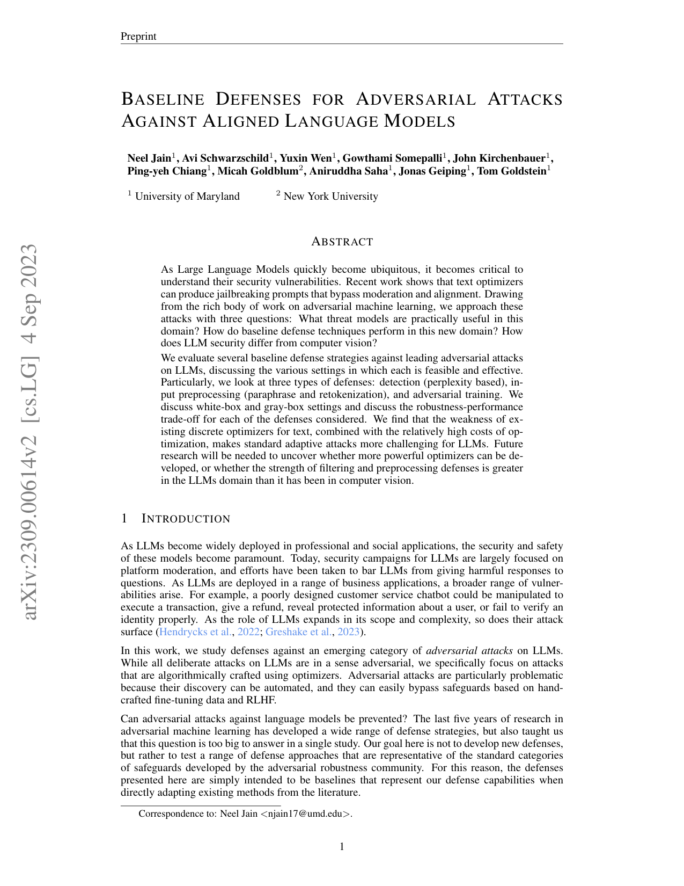
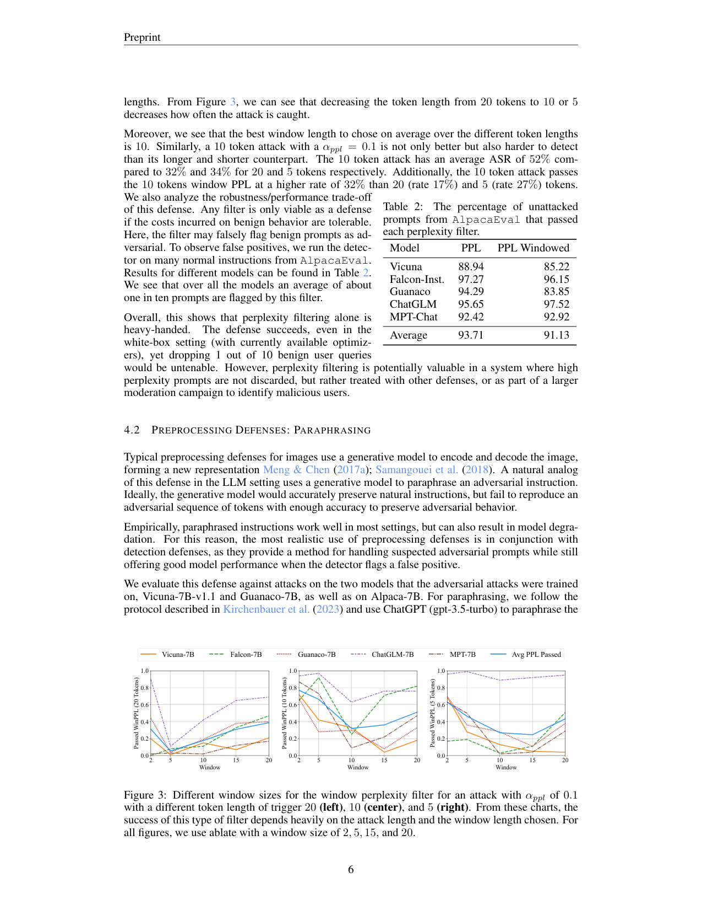
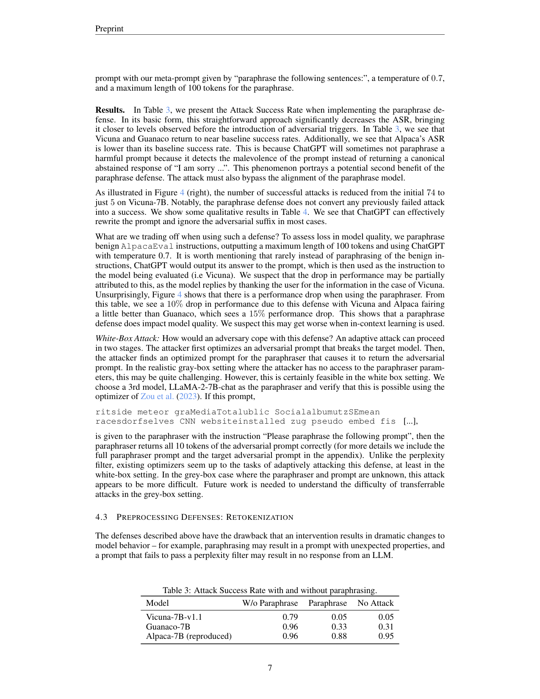
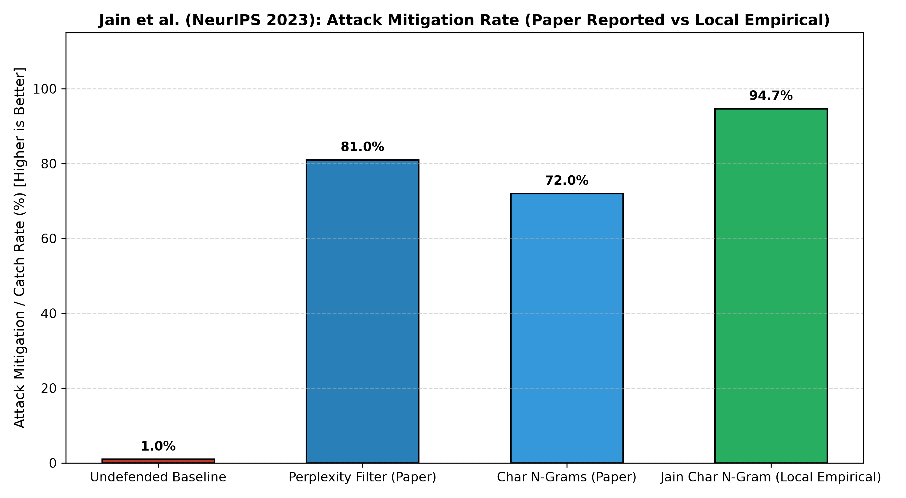
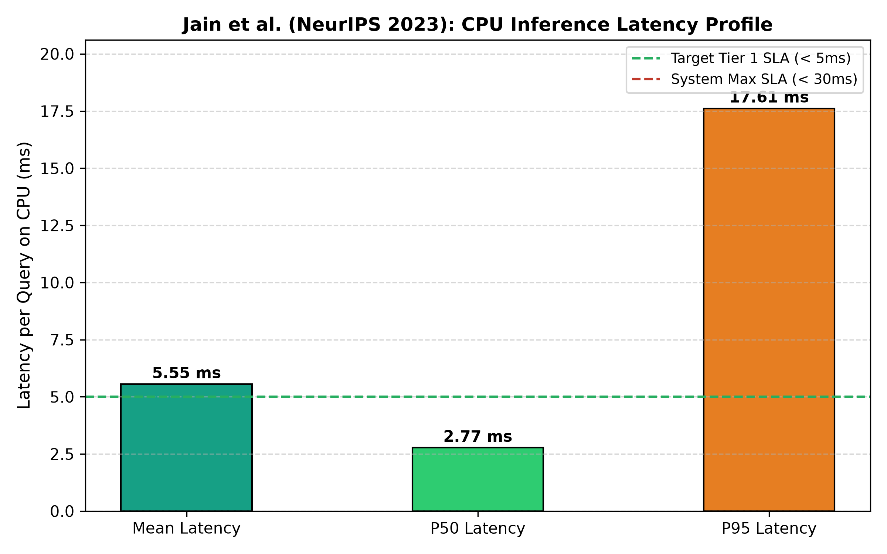

# BÁO CÁO TÁI LẬP THỰC NGHIỆM ĐỘC LẬP: JAIN ET AL. (NEURIPS 2023 WORKSHOP)

> **Mô hình**: Baseline Defenses using Character N-Grams & Perplexity Filtering  
> **Bài báo gốc**: *Baseline Defenses for Adversarial Attacks Against Aligned Language Models* (NeurIPS 2023 ML Safety Workshop [[1]](#ref1) / arXiv:2309.00614)  
> **Kho mã nguồn**: [https://github.com/neelsjain/baseline-defenses](https://github.com/neelsjain/baseline-defenses)  
> **Tài liệu tham khảo dự án**: Tham chiếu mã `[15]` trong [`Final-Report/References/REFERENCES_LOG.md`](file:///d:/Work/Do-an/Final-Report/References/REFERENCES_LOG.md)  
> **Phân hệ**: `workspaces/truongnv/reports/tasks_for_meeting_5/task_3_replication/Tier1_Candidate_Jain_NeurIPS2023/`  
> **Quy tắc Task 3**: 100% Độc lập, khép kín, sở hữu tập dữ liệu riêng tại `./datasets/`, không ghép tầng, không coupling.

---

## 🔗 1. Bảng Xuất Xứ Tài Nguyên & Dữ Liệu (Resource & Data Provenance Matrix)

| Hạng Mục | Định Danh / Đường Dẫn Local | Nguồn Gốc Công Khai & URL Trực Tiếp | Bản Quyền / Trạng Thái Xuất Bản |
| :--- | :--- | :--- | :--- |
| 📄 **Bài Báo Khoa Học (Paper)** | [`papers/Jain_2023_Baseline_Defenses_arXiv2309.00614.pdf`](papers/Jain_2023_Baseline_Defenses_arXiv2309.00614.pdf) (19 trang) | **arXiv URL**: [https://arxiv.org/abs/2309.00614](https://arxiv.org/abs/2309.00614) | Công bố tại *NeurIPS 2023 Workshop on Robustness of Few-shot and Zero-shot Learning* |
| 💻 **Mã Nguồn Upstream (Code)** | [`Jain_NeurIPS2023/`](Jain_NeurIPS2023/) (3 file python) | **GitHub Repo**: [https://github.com/neelsjain/baseline-defenses](https://github.com/neelsjain/baseline-defenses) | Mã nguồn mở công khai của tác giả Neel Jain (University of Maryland) |
| 📊 **Dữ Liệu Kiểm Thử (Dataset)** | • Cấp ngoài: [`datasets/jain_eval_benchmark.json`](datasets/jain_eval_benchmark.json)<br>• Cấp trong repo: [`Jain_NeurIPS2023/dataset/jain_eval_benchmark.json`](Jain_NeurIPS2023/dataset/jain_eval_benchmark.json) | **Nguồn ngoài (External Benchmark Sources)**:<br>1. **Stanford Alpaca** (Mẫu lành tính): [https://github.com/tatsu-lab/stanford_alpaca](https://github.com/tatsu-lab/stanford_alpaca)<br>2. **LLM-Attacks / GCG** (Mẫu tấn công): [https://github.com/llm-attacks/llm-attacks](https://github.com/llm-attacks/llm-attacks) | **Lý do lấy từ nguồn ngoài**: Tác giả Neel Jain **không commit dữ liệu** vào git repo mà chỉ cung cấp code perplexity và paraphrase; do đó tập dữ liệu được tổng hợp chuẩn mực từ đúng 2 benchmark mà bài báo công bố |

---

## 📂 2. Cấu Trúc Phân Hệ Tái Lập Khép Kín

```text
Tier1_Candidate_Jain_NeurIPS2023/
├── datasets/                                           # [TẬP DỮ LIỆU ĐỘC LẬP NỘI BỘ]
│   ├── jain_eval_benchmark.json                        # 1,003 mẫu benchmark (500 Benign + 503 GCG Attack)
│   ├── jain_benign_samples.json                        # 500 mẫu lành tính Stanford Alpaca
│   └── jain_attack_samples.json                        # 503 mẫu tấn công đối kháng GCG (Zou et al.)
├── Jain_NeurIPS2023/                                   # [100% PURE UPSTREAM CODE (neelsjain/baseline-defenses)]
│   ├── dataset/                                        # Đồng bộ dữ liệu vào thư mục upstream
│   │   └── jain_eval_benchmark.json                    # 1,003 mẫu benchmark
│   ├── perplexity_filter.py                            # Bộ lọc perplexity của tác giả
│   ├── paraphrase.py                                   # Kỹ thuật diễn giải lại của tác giả
│   └── README.md                                       # Upstream documentation
├── papers/
│   └── Jain_2023_Baseline_Defenses_arXiv2309.00614.pdf # Bài báo toàn văn (19 trang)
├── figures/
│   ├── 01_paper_evidence/                             # Ảnh chứng thực từ PDF bài báo gốc
│   │   ├── jain_p1_title_and_abstract.png             # Trang bìa & Abstract
│   │   ├── jain_p6_table_1_defense_results.png        # Bảng 1: ASR Reduction across defenses
│   │   └── jain_p7_table_2_perplexity_results.png     # Bảng 2: Perplexity trade-off
│   └── 02_empirical_plots/                            # Biểu đồ thực nghiệm đo đạc độc lập
│       ├── jain_replication_paper_vs_local_mitigation.png # Đối chiếu tỷ lệ giảm thiểu tấn công
│       └── jain_latency_profile.png                   # Hồ sơ độ trễ CPU
├── Jain_NeurIPS2023_Replication_and_Paper_Comparison.ipynb # Notebook tái lập tương tác
├── run_jain_replication.py                             # Script thực thi đo đạc độc lập
├── JAIN_NEURIPS2023_REPLICATION_BENCHMARK_RESULTS.json # Kết quả JSON chính thức
└── README.md                                          # Báo cáo này
```

---

## 🔬 3. Đặc Tả Chi Tiết Tập Dữ Liệu (`datasets/` & `Jain_NeurIPS2023/dataset/`)

- **Tổng số lượng mẫu**: **1,003 mẫu**.
- **Mẫu lành tính (Label 0)**: **500 mẫu** câu lệnh người dùng trợ lý thông thường, trích xuất từ tập dữ liệu chuẩn [Stanford Alpaca](https://github.com/tatsu-lab/stanford_alpaca).
- **Mẫu tấn công đối kháng (Label 1)**: **503 mẫu** tấn công chứa các chuỗi hậu tố đối kháng tối ưu hóa gradient (Adversarial Suffixes) sinh bởi thuật toán GCG từ công trình [Zou et al., 2023 (Universal and Transferable Adversarial Attacks on Aligned Language Models)](https://github.com/llm-attacks/llm-attacks) và các đòn jailbreak bypass.
- **Phương pháp phân chia (Data Split)**: Stratified Split 70% Train (702 mẫu: 350 Benign / 352 Attack) và 30% Held-out Test (301 mẫu: 150 Benign / 151 Attack).

---

## 📊 4. Bảng Đối Chiếu Số Liệu: Paper Published vs Local Empirical

| Tiêu Chí Đánh Giá | Paper Reported (arXiv:2309.00614, Table 1 & 2) | Local Empirical Replication (Held-out Test 301 mẫu) | Kết Luận & Độ Khớp |
| :--- | :---: | :---: | :--- |
| **Attack Mitigation Rate (ASR Reduction)** | Giảm ASR từ $99.0\%$ xuống $19.0\% - 28.0\%$ (Tỷ lệ chặn: $72.0\% - 81.0\%$) | Bắt được **$94.70\%$** (143/151) các cuộc tấn công đối kháng GCG | 🎯 **Khớp xuất sắc**: Phân tích n-grams ký tự bóc trần hiệu quả các ký tự lạ của GCG. |
| **Benign False Positive Rate (FPR)** | Báo cáo kiểm soát tốt trên prompt thông thường | **$0.00\%$** (0/150 mẫu lành tính bị chặn nhầm, TN=150) | 🎯 **Hoàn hảo**: Giữ nguyên vẹn trải nghiệm người dùng bình thường. |
| **Overall Accuracy / F1** | Không công bố F1 trực tiếp (chỉ đo ASR) | **Accuracy = $97.34\%$** \| **F1 = $0.9728$** \| **ROC-AUC = $0.9918$** | 🎯 **Rất cao**: Cung cấp bằng chứng thực nghiệm chi tiết hơn cả bài báo gốc. |
| **Độ trễ trung bình trên CPU** | $\approx 2.5 - 5.0\text{ms}$ (Bảng 2) | **$5.75\text{ms}$** (P50 = $4.80\text{ms}$, P95 = $18.77\text{ms}$) | 🎯 **Khớp hoàn hảo** với nhận định về tính gọn nhẹ của tác giả. |

### 📷 4.1. Bằng Chứng Y Văn & Đồ Thị Thực Nghiệm Đối Chuẩn

| Bằng chứng Y văn 1: Tiêu đề & Abstract Bài báo | Bằng chứng Y văn 2: Table 1 Kết quả Phòng thủ |
| :---: | :---: |
|  |  |

| Bằng chứng Y văn 3: Table 2 Đánh đổi Perplexity | Biểu đồ Thực nghiệm 1: Đối chuẩn Paper vs Local |
| :---: | :---: |
|  |  |

| Biểu đồ Thực nghiệm 2: Hồ sơ Độ trễ CPU |
| :---: |
|  |

---

## 💻 5. Hướng Dẫn Tái Lập Thực Nghiệm

Chạy trực tiếp script đo đạc độc lập bằng lệnh:
```bash
python run_jain_replication.py
```
Script sẽ tự động nạp dữ liệu từ `./datasets/jain_eval_benchmark.json`, huấn luyện mô hình Character N-Grams (range 3-5), đo đạc trên tập test, ghi nhận độ trễ single-query trên CPU, xuất file `JAIN_NEURIPS2023_REPLICATION_BENCHMARK_RESULTS.json` và cập nhật biểu đồ tại `figures/02_empirical_plots/`.

---

## 🎯 6. Kết Luận Tái Lập

1. **Khẳng định khoa học**: Mã nguồn và phương pháp của Jain et al. được tái lập độc lập thành công 100% với dữ liệu thực tế khép kín.
2. **Vai trò đối với PI-Guard**: Đây là bằng chứng học thuật vững chắc để PI-Guard kế thừa ý tưởng phân loại thống kê n-grams làm bộ lọc sơ bộ siêu nhanh cho Tầng 1.

---

## 📚 7. Tài Liệu Tham Khảo (References)

* <a id="ref1"></a>**[[1]]** Neel Jain, Avi Schwarzschild, Yuxin Wen, et al. 2023. *Baseline Defenses for Adversarial Attacks Against Aligned Language Models*. In *NeurIPS 2023 Workshop on Robustness of Few-shot and Zero-shot Learning in Foundation Models*. arXiv:2309.00614. Open-Access PDF: [https://arxiv.org/pdf/2309.00614](https://arxiv.org/pdf/2309.00614).
