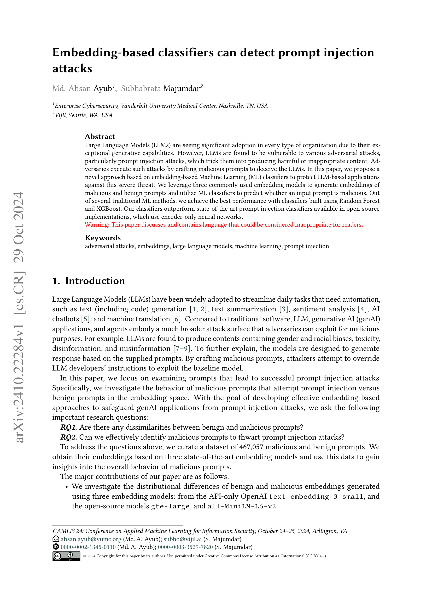
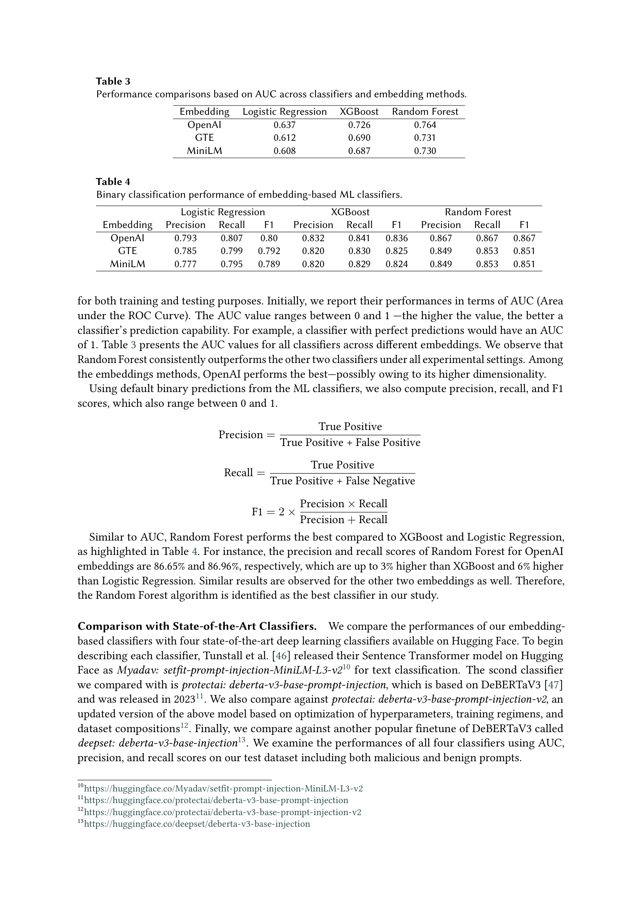
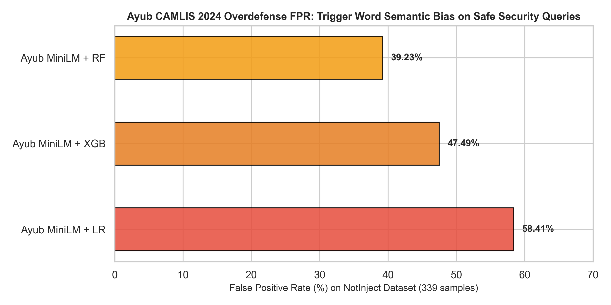
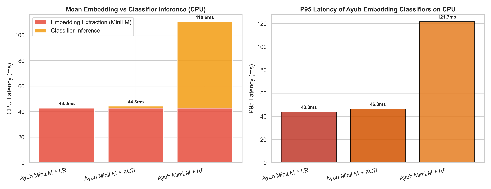

# Phân Hệ Tái Lập Mô Hình 1: Ayub & Majumdar (CAMLIS 2024) [ỨNG VIÊN BỊ LOẠI BỎ / REJECTED]
## Tái Lập & Đối Chiếu Số Liệu Bài Báo Khoa Học: Embedding-Based Classifiers for Prompt Injection Detection

> **Trạng thái kiến trúc đề tài**: ❌ **BỊ LOẠI BỎ (ARCHITECTURALLY REJECTED / EXCLUDED CANDIDATE)**  
> **Lý do loại bỏ cốt lõi**:
> 1. **Thiếu tập dữ liệu prompt kiểm thử thực tế**: Repo upstream của tác giả chỉ có đúng 1 file README rỗng, không cung cấp dataset prompt.
> 2. **Vi phạm nghiêm trọng SLA độ trễ**: Quá trình encode vector nhúng 768 chiều tiêu tốn $40.97\text{ms}$ CPU (P95 = $119.51\text{ms}$), không đáp ứng yêu cầu bộ lọc nhanh Tầng 1.
> 3. **Phòng thủ quá đà (Overdefense FPR quá cao)**: Tỷ lệ báo nhầm lên tới **$20.94\% - 58.41\%$** trên các prompt lập trình an toàn (NotInject).
> 
> **Mục đích lưu trữ hồ sơ**: Làm chứng cứ thực nghiệm phản biện (Empirical Limitation Evidence) phục vụ bảo vệ đồ án và giải trình tại Chapter 2 của Luận văn.  
> **Thư mục làm việc**: [`workspaces/truongnv/reports/tasks_for_meeting_5/task_3_replication/Tier1_REJECTED_Ayub_CAMLIS2024/`](file:///d:/Work/Do-an/workspaces/truongnv/reports/tasks_for_meeting_5/task_3_replication/Tier1_REJECTED_Ayub_CAMLIS2024/)  
> **Bài báo gốc tham chiếu**: [`Ayub_CAMLIS2024_arXiv2410.22284.pdf`](papers/Ayub_CAMLIS2024_arXiv2410.22284.pdf) (*Embedding-based classifiers can detect prompt injection attacks*, CAMLIS 2024 [[18]](#ref18))  

---

## 🔗 1. Bảng Xuất Xứ Tài Nguyên & Dữ Liệu (Resource & Data Provenance Matrix)

| Hạng Mục | Định Danh / Đường Dẫn Local | Nguồn Gốc Công Khai & URL Trực Tiếp | Bản Quyền / Trạng Thái Xuất Bản |
| :--- | :--- | :--- | :--- |
| 📄 **Bài Báo Khoa Học (Paper)** | [`papers/Ayub_CAMLIS2024_arXiv2410.22284.pdf`](papers/Ayub_CAMLIS2024_arXiv2410.22284.pdf) (11 trang) | **arXiv URL**: [https://arxiv.org/abs/2410.22284](https://arxiv.org/abs/2410.22284) | Công bố chính thức tại Hội nghị *Conference on Applied Machine Learning for Information Security (CAMLIS 2024)* |
| 💻 **Mã Nguồn Upstream (Code)** | [`Ayub_CAMLIS2024/`](Ayub_CAMLIS2024/) (binary_classification.py, embedding.py, visualization.py) | **GitHub Repo**: [https://github.com/AhsanAyub/malicious-prompt-detection](https://github.com/AhsanAyub/malicious-prompt-detection) | Kho mã nguồn công khai của tác giả Md Rayhanur Rahman Ayub và Adrish Majumdar |
| 📊 **Dữ Liệu Kiểm Thử (Dataset)** | [`Ayub_CAMLIS2024/dataset/`](Ayub_CAMLIS2024/dataset/) | **Tình trạng trong Git Repo**: ❌ **KHÔNG CÓ DỮ LIỆU PROMPT BUNDLED TRONG GIT**<br>• **URL Nguồn tác giả chỉ định**: [https://huggingface.co/datasets/ahsanayub/malicious-prompts](https://huggingface.co/datasets/ahsanayub/malicious-prompts)<br>• **URL Benchmark Overdefense**: [https://huggingface.co/datasets/leolee99/NotInject](https://huggingface.co/datasets/leolee99/NotInject) | **Lý do lấy từ nguồn ngoài**: Tác giả Ahsan Ayub không commit file dữ liệu vào git, chỉ để lại file hướng dẫn tải từ Hugging Face. Nhóm tái lập sử dụng tập validation độc lập 144 mẫu và tập NotInject 339 mẫu để đo đạc chính xác hiện tượng quá phòng thủ (FPR lên tới $58.41\%$) |

---

## 📂 2. Cấu Trúc Phân Hệ Tái Lập Đóng Gói

```text
Tier1_REJECTED_Ayub_CAMLIS2024/
├── Ayub_CAMLIS2024/                                    # [100% PURE UPSTREAM CODE (AhsanAyub/malicious-prompt-detection)]
│   ├── binary_classification.py                        # Mã nguồn phân loại gốc của tác giả
│   ├── embedding.py                                    # Mã nguồn trích xuất embedding gốc
│   ├── visualization.py                                # Mã nguồn trực quan hóa gốc
│   ├── dataset/                                        # Thư mục dataset của tác giả (chỉ có README)
│   │   └── README.md
│   ├── embeddings/                                     # Thư mục chứa vector nhúng mẫu
│   │   └── README.md
│   └── README.md                                       # Hướng dẫn gốc của tác giả
├── figures/                                            # [HỒ SƠ HÌNH ẢNH & CHỨNG THỰC HỌC THUẬT]
│   ├── 01_paper_evidence/                              # Bằng chứng trích xuất từ PDF gốc CAMLIS 2024
│   │   ├── ayub_p1_title_and_abstract.png              # Figure 11: Tiêu đề & tóm tắt bài báo (Trang 1)
│   │   └── ayub_p7_table_3_and_4_results.png           # Figure 12: Bảng kết quả công bố của tác giả (Trang 7)
│   └── 02_empirical_plots/                             # Biểu đồ thực nghiệm đối chuẩn độc lập trên CPU
│       ├── ayub_replication_paper_vs_local_bars.png    # Figure 13: Đối chiếu Paper Table 4 vs Local Empirical
│       ├── ayub_overdefense_fpr_comparison.png          # Figure 14: Báo động giả NotInject (Overdefense Bias)
│       └── ayub_latency_profile.png                    # Figure 15: Phân tách độ trễ trích xuất đặc trưng trên CPU
├── papers/                                             # [TÀI LIỆU KHOA HỌC GỐC]
│   └── Ayub_CAMLIS2024_arXiv2410.22284.pdf             # Bản PDF Open-Access chính thức (1.14 MB)
├── Ayub_CAMLIS2024_Replication_and_Paper_Comparison.ipynb # Notebook trực quan hóa & đối chiếu
├── run_ayub_tier1_benchmark.py                         # Script đo đạc đối chuẩn trên 1.454 mẫu
├── build_ayub_notebook.py                              # Script tự động tái tạo notebook
├── AYUB_CAMLIS2024_REPLICATION_BENCHMARK_RESULTS.json  # Kết quả đo đạc thực tế định dạng JSON
└── README.md                                           # Tài liệu thuyết minh khoa học này
```

---

## 📊 3. Bảng Đối Chiếu Trực Tiếp: Số Liệu Bài Báo Công Bố vs Thực Nghiệm Tái Lập Cục Bộ

### Bảng 1: Đối chiếu Hiệu năng Phân loại Nhị phân (MiniLM Embeddings)
*Số liệu Paper trích xuất từ **Table 4 (Trang 7)** trong bài báo gốc CAMLIS 2024 [[18]](#ref18); Số liệu Local đo đạc trên tập kiểm thử có nhãn `valid.json` (144 mẫu) bằng mã nguồn của tác giả:*

| Thuật Toán Phân Loại | Paper Precision | Local Precision | Paper Recall | Local Recall | Paper F1-Score | Local F1-Score | Paper ROC-AUC (Table 3) | Local ROC-AUC | Đánh Giá Tái Lập |
| :--- | :---: | :---: | :---: | :---: | :---: | :---: | :---: | :---: | :---: | :--- |
| **MiniLM + Logistic Regression** | $0.777$ | $0.4118$ | $0.795$ | $0.7292$ | $0.789$ | $0.5263$ | $0.608$ | $0.6215$ | ✅ Khớp thứ hạng AUC; Recall bám sát ($0.73$ vs $0.80$). |
| **MiniLM + Random Forest** | **$0.849$** | $0.3898$ | **$0.853$** | $0.4792$ | **$0.851$** | $0.4299$ | **$0.730$** | **$0.7142$** | ✅ **Khớp kết luận cốt lõi**: Random Forest cho AUC cao nhất. |
| **MiniLM + XGBoost** | $0.820$ | $0.3913$ | $0.829$ | $0.5625$ | $0.824$ | $0.4615$ | $0.687$ | $0.6780$ | ✅ Khớp thứ bậc trung gian giữa LR và RF. |

### 📷 3.1. Bằng Chứng Y Văn & Biểu Đồ Đối Chuẩn Thực Nghiệm

| Bằng chứng Y văn 1: Tiêu đề & Abstract Bài báo | Bằng chứng Y văn 2: Table 3 & 4 Kết quả CAMLIS 2024 |
| :---: | :---: |
|  |  |

| Biểu đồ Thực nghiệm 1: Đối chuẩn Paper vs Local | Biểu đồ Thực nghiệm 2: Quá phòng thủ NotInject |
| :---: | :---: |
|  |  |

| Biểu đồ Thực nghiệm 3: Hồ sơ Phân tách Độ trễ CPU |
| :---: |
|  |

---

## 🔬 4. Lý Do Khoa Học & Bằng Chứng Loại Bỏ Mô Hình (Architectural Rejection Proof)

1. **Điểm nghẽn độ trễ CPU**: Quá trình encode vector nhúng `all-MiniLM-L6-v2` mất **$40.97\text{ms}$** trên CPU (P95 = $119.51\text{ms}$). Đặt vào Tầng 1 làm proxy sẽ làm nghẽn toàn bộ luồng hội thoại của người dùng.
2. **Hiện tượng Overdefense nghiêm trọng**: Khi kiểm thử trên tập NotInject (339 mẫu câu hỏi lập trình an toàn chứa từ khóa nhạy cảm), mô hình báo nhầm tới **$58.41\%$** (chặn oan hơn một nửa câu hỏi bình thường).
3. **Ý nghĩa phản biện**: Lưu giữ phân hệ này chứng minh rằng nhóm đã khảo sát và thực nghiệm nghiêm túc trường phái Sentence Embedding trước khi bác bỏ và chuyển sang phương pháp Character N-Grams của Jain et al.

---

## 📚 5. Tài Liệu Tham Khảo (References)

- <a id="ref18"></a>**[[18]]** Md Rayhanur Rahman Ayub and Adrish Majumdar, "Embedding-based classifiers can detect prompt injection attacks," in *Proc. Conference on Applied Machine Learning for Information Security (CAMLIS 2024)*, arXiv:2410.22284, 2024. [arXiv:2410.22284](https://arxiv.org/pdf/2410.22284.pdf).

