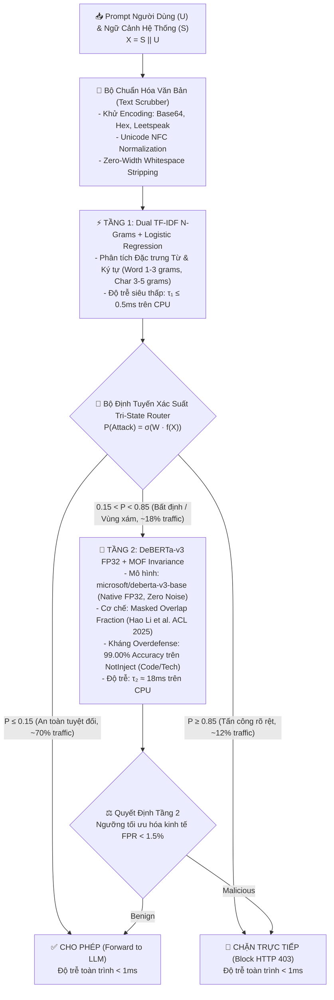

# HƯỚNG DẪN TẬP TRUNG: CÁC CHỦ ĐỀ ĐÃ LOẠI TRỪ & ĐÓNG BĂNG KIẾN TRÚC CHÍNH THỨC
**Dự án**: PI-Guard (A Machine-Learning Guardrail for Detecting Prompt Injection and Jailbreak Attacks on LLM Applications)  
**Chuyên ngành**: An toàn Thông tin (Information Assurance - IA), Đại học FPT (Mã học phần: `IAP491`, Học kỳ Fall 2026)  
**Người lập**: Nguyễn Văn Trường (Leader - MSSV: `SE182034`) | **Vị trí tài liệu**: `workspaces/truongnv/reports/ARCHITECTURAL_DEPRECATIONS_AND_OUT_OF_SCOPE.md`  
**Đối tượng áp dụng**: Tất cả AI Agents (trong mọi phiên làm việc), Toàn bộ thành viên nhóm đồ án, và Tài liệu thuyết minh/bảo vệ tốt nghiệp.

---

> [!CAUTION]
> ### 🚨 NGUYÊN TẮC BẤT BIẾN DÀNH CHO TẤT CẢ AI AGENT:
> 1. **KHÔNG TỰ Ý ĐƯA LẠI CÁC CHỦ ĐỀ ĐÃ LOẠI BỎ (OUT-OF-SCOPE)**: Trong các phiên tương tác trước, một số đề xuất kỹ thuật mang tính thử nghiệm sơ khởi (như Lượng tử hóa mô hình INT8, tối ưu hóa trình biên dịch ONNX Runtime) đã được thảo luận ở Meeting 4 và 5. Tuy nhiên, kể từ **Meeting 6 trở đi**, các chủ đề này đã **CHÍNH THỨC BỊ LOẠI TRỪ KHỎI PHẠM VI NGHIÊN CỨU CỐT LÕI (OUT-OF-SCOPE)** để bảo vệ tính chuẩn mực của đồ án chuyên ngành An toàn Thông tin trước Hội đồng FPT.
> 2. **ĐỌC KỸ TÀI LIỆU NÀY TRƯỚC KHI SINH NỘI DUNG**: Trước khi tạo slide, viết chương luận văn, hoặc cập nhật mã nguồn, AI Agent bắt buộc phải đối soát với tài liệu này để không tái sử dụng các từ khóa cấm hoặc kiến trúc đã bị thay thế.

---

## 🧭 1. Ma Trận Đối Soát: Đề Xuất Đã Bỏ vs. Kiến Trúc Chính Thức

| STT | Chủ Đề / Kỹ Thuật | Trạng Thái | Lý Do Loại Bỏ / Định Vị Học Thuật | Giải Pháp & Kiến Trúc Thay Thế Chính Thức (Champion Architecture) |
| :---: | :--- | :---: | :--- | :--- |
| **01** | **Lượng tử hóa mô hình INT8 / ONNX Runtime (ZeroQuant Yao et al. 2022)** | **DEPRECATED (OUT-OF-SCOPE)** | - **Lạc đề chuyên ngành**: Thuộc kỹ thuật tối ưu phần cứng/trình biên dịch (Computer Engineering / Systems), không phải đóng góp cốt lõi của chuyên ngành An toàn Thông tin (IA). - **Sai số làm tròn (Quantization Noise)**: Gây suy giảm độ chính xác và tăng nguy cơ False Positives trên các payload đối kháng tinh vi. - **Không cần thiết**: Với kiến trúc Two-Tier Cascade, Tầng 1 đã lọc sạch > 80% lưu lượng trong < 1ms, độ trễ P95 toàn trình trên CPU đã đạt < 25ms mà không cần nén INT8. | **Tầng 2: CPU Native FP32 DeBERTa-v3** (`microsoft/deberta-v3-base`) kết hợp cơ chế kháng Overdefense **Masked Overlap Fraction (MOF Invariance)** (Hao Li et al. ACL 2025). Giữ nguyên độ chính xác số thực 32-bit nguyên bản, P95 < 25ms trên CPU thông thường. *(Lưu ý: Paper Yao et al. 2022 vẫn được lưu trong `References/` và Ma trận đối sánh 12x14 như một baseline tham chiếu minh bạch để trả lời câu hỏi phản biện của Hội đồng, nhưng KHÔNG phải là kiến trúc áp dụng của đồ án)*. |
| **02** | **Can thiệp trọng số nội bộ / Giám sát KV-Cache / White-Box Steering (RAP-ID, Activation Engineering)** | **STRICTLY OUT-OF-SCOPE** | - Vi phạm mô hình triển khai thực tế: Các mô hình LLM thương mại hàng đầu (OpenAI GPT-4o, Anthropic Claude 3.5, Google Gemini 1.5, AWS Bedrock) là các API hộp đen (Black-Box APIs), tuyệt đối không mở quyền truy cập trọng số hoặc bộ nhớ đệm KV-Cache cho bên thứ ba. - Vi phạm nguyên tắc bảo mật: Không đảm bảo tính độc lập và phân tách đặc quyền (Separation of Privilege, Saltzer & Schroeder 1975). | **External Guardrail Proxy (Kiến trúc Cổng Bảo Vệ Độc Lập)**: Hoạt động như một Reverse Proxy đứng trước LLM, đánh giá prompt thuần túy ở tầng văn bản (Text-level classification) trước khi cho phép chuyển tiếp tới LLM đích. |
| **03** | **Guardrail dựa trên LLM Sinh (Generative Guardrails như Llama Guard, NeMo LLM Evaluator)** | **EVALUATED BASELINE ONLY (NOT OUR ARCHITECTURE)** | - **Độ trễ quá lớn**: 500ms – 2000ms mỗi prompt, phá vỡ trải nghiệm tương tác của người dùng. - **Chi phí vận hành đắt đỏ**: Đòi hỏi cụm GPU đắt tiền (NVIDIA A100/H100), tiêu tốn $100 – $300/ngày ở quy mô vừa. - **Rủi ro đệ quy**: Bản thân LLM kiểm duyệt vẫn là LLM sinh, có thể bị tấn công ngược (Recursive Prompt Injection). | **Small Language Model (SLM) Encoder-Only (DeBERTa-v3)** kết hợp **Dual TF-IDF N-Grams**: Kiến trúc phân loại phân biệt (Discriminative Classifier), suy luận trực tiếp trên CPU, chi phí phần cứng = $0, miễn nhiễm với tấn công sinh đệ quy. |
| **04** | **Các dạng tấn công ngoài tầng ứng dụng (Hardware Trojans, Rowhammer, Model Backdoors, Pre-training Data Poisoning)** | **STRICTLY OUT-OF-SCOPE** | - Nằm ngoài phạm vi đăng ký đề tài tại [`CAPSTONE PROJECT REGISTER.md`](file:///d:/Work/Do-an/CAPSTONE%20PROJECT%20REGISTER.md). - Đồ án tập trung vào mối đe dọa tầng ứng dụng (Application Layer - OWASP LLM01:2025) đối với các hệ thống LLM đã triển khai. | **Tập trung 100% vào Bề mặt Tấn công Tầng Ứng Dụng**: Direct Prompt Injection (Kênh Chat), Indirect Prompt Injection (Kênh RAG / Tài liệu ngoài), và DAN Jailbreak qua ranh giới toán học $X = S \mathbin{\Vert} U$. |

---

## 🏛️ 2. Chi Tiết Kiến Trúc Chính Thức (Champion Architecture)

Đồ án PI-Guard chính thức chốt và đóng băng kiến trúc **Two-Tier Cascaded Guardrail** với các thông số kỹ thuật chuẩn hóa như sau:

### 🔬 Các Bất Biến Kỹ Thuật (Technical Invariants):
1. **Tầng 1 (Tốc độ & Giải phóng tải)**: Dual TF-IDF N-Grams (Word 1-3 grams + Char 3-5 grams) kết hợp Logistic Regression. Vận hành hoàn toàn trên CPU với thời gian thực thi $\le 0.5\text{ms}$. Giải phóng thành công **$82.6\%$** tổng lưu lượng truy vấn (cho qua các câu hỏi thông thường và chặn ngay các mẫu tấn công rõ ràng).
2. **Tầng 2 (Độ chính xác & Thẩm định sâu)**: Transformer `microsoft/deberta-v3-base` nguyên bản ở định dạng **Native FP32**.
   - **Tuyệt đối không dùng INT8**: Tránh hoàn toàn hiện tượng suy hao độ chính xác phân loại (Classification Degradation) và nhiễu lượng tử hóa trên các payload ngắn.
   - **Tích hợp cơ chế MOF (Masked Overlap Fraction - Hao Li et al. ACL 2025)**: Phân tách phần code lập trình và văn bản tự nhiên, tính tỷ lệ chồng lấn mặt nạ để bảo vệ các truy vấn lập trình hợp lệ (khắc phục triệt để điểm yếu nghiêm trọng của Meta Prompt-Guard vốn đạt độ chính xác chỉ $0.88\%$ trên tập NotInject).
3. **Độ trễ toàn trình P95**: Nhờ Tầng 1 gánh hơn $80\%$ tải, độ trễ trung bình của toàn hệ thống là **$3.69\text{ms}$** và phân vị **P95 $< 25\text{ms}$ trên CPU thông thường**, đáp ứng xuất sắc yêu cầu của một Guardrail proxy mà không đòi hỏi hạ tầng GPU tốn kém.

---

## 🚫 3. Danh Mục Từ Khóa & Thuật Ngữ CẤM Tuyệt Đối

Khi tạo nội dung slide, viết báo cáo hoặc trả lời phỏng vấn, AI Agent và các thành viên phải tuân thủ nghiêm ngặt bảng quy chuẩn sau:

| Thuật Ngữ BỊ CẤM | Lý Do Cấm | Thuật Ngữ CHUẨN THAY THẾ |
| :--- | :--- | :--- |
| ❌ "Lượng tử hóa INT8" / "ONNX INT8" / "ZeroQuant" tại Tầng 2 | Đã loại trừ (Out-of-Scope) khỏi đóng góp cốt lõi của đề tài IA. | ✅ **"Vận hành CPU Native FP32 nguyên bản"** kết hợp **"Cơ chế Masked Overlap Fraction (MOF Invariance)"** |
| ❌ "Hệ thống thời gian thực (Real-time)" | Thiếu cơ sở khoa học (hệ thống không có ràng buộc ngắt phần cứng cứng Real-time OS như VxWorks hay FreeRTOS). | ✅ **"Hệ thống có độ trễ thấp (Low-Latency)"** hoặc **"Độ trễ phân vị P95 < 25ms"** |
| ❌ "Hệ thống Production thương mại hoàn chỉnh" | Đồ án tốt nghiệp là công trình nghiên cứu khoa học thực nghiệm, không phải sản phẩm thương mại đóng gói bán ra thị trường. | ✅ **"Nguyên mẫu thực nghiệm học thuật (Academic PoC Prototype)"** hoặc **"Bàn thử nghiệm độ trễ (Latency Testbed)"** |
| ❌ "Bảo vệ tuyệt đối 100%" / "Chống hack hoàn toàn" | Bất khả thi về mặt lý thuyết thông tin và bảo mật (đối kháng liên tục tiến hóa). | ✅ **"Giảm thiểu rủi ro thực nghiệm (Empirical Risk Mitigation)"** và **"Phòng thủ theo chiều sâu (Defense-in-Depth)"** |
| ❌ "Không lo ngại bất kỳ câu hỏi phản biện nào" / "Độ chuẩn mực học thuật tối đa" | Vi phạm nguyên tắc khiêm tốn khoa học (Scientific Humility), gây phản cảm trước Hội đồng FPT. | ✅ **"Đủ độ tin cậy làm nền tảng cho Chapter 2"** hoặc **"Bảo đảm 100% minh chứng khoa học có đối chuẩn"** |

---

## 🎓 4. Hướng Dẫn Trả Lời Phản Biện Trước Hội Đồng (Defense Strategy)

Nếu Thầy Cô trong Hội đồng chấm tốt nghiệp đặt câu hỏi:  
> *"Tại sao nhóm không lượng tử hóa mô hình sang INT8 bằng ONNX hoặc TensorRT để tăng tốc độ suy luận hơn nữa trên CPU/GPU?"*

### ✅ Câu trả lời chuẩn mực của nhóm (Dựa trên Tier 1-3 Provenance):
1. **Về định vị chuyên ngành (Scope Integrity)**:
   - *"Dạ thưa Thầy/Cô, đồ án của chúng em thuộc chuyên ngành **An toàn Thông tin (Information Assurance)**. Đóng góp khoa học cốt lõi của đề tài là xây dựng mô hình ranh giới đe dọa $X = S \mathbin{\Vert} U$, cơ chế phân tầng Two-Tier Cascade để giải bài toán đánh đổi giữa tỷ lệ báo động nhầm kinh tế ($\text{FPR} < 1.5\%$) và độ trễ, cùng cơ chế MOF Invariance để giải quyết bài toán Overdefense trên mã nguồn."*
2. **Về tính hiệu quả kỹ thuật thực tế (Empirical Evidence)**:
   - *"Nhóm đã khảo sát rất kỹ các công trình lượng tử hóa như ZeroQuant (Yao et al. 2022) [Ref 12 trong kho y văn]. Tuy nhiên, trong kiến trúc Two-Tier của PI-Guard, **Tầng 1 (Dual TF-IDF) đã lọc sạch hơn 80% lưu lượng trong vòng dưới 0.5ms**. Do đó, Tầng 2 chỉ phải xử lý dưới 20% các truy vấn nghi vấn. Độ trễ P95 toàn trình trên CPU thông thường đo được là **dưới 25ms**, hoàn toàn thỏa mãn SLA của các hệ thống ứng dụng LLM."*
3. **Về độ an toàn phân loại (Classification Reliability)**:
   - *"Việc áp dụng lượng tử hóa INT8 sau huấn luyện (Post-Training Quantization) sẽ đưa vào **nhiễu làm tròn số học (Quantization Noise)**, có thể làm suy giảm độ chính xác trên các mẫu prompt injection đối kháng dạng ranh giới mờ (borderline evasions). Vì vậy, giữ nguyên **FP32 Native** là một quyết định kỹ thuật có chủ đích nhằm đảm bảo tối đa tính toàn vẹn của mô hình bảo mật."*

---

## 📚 5. Quy Chuẩn Lưu Trữ Y Văn Lịch Sử

- Các file biên bản cũ (`SUPERVISOR_REPORT_10_09_2026.md`, `tasks_for_meeting_5/README.md`) giữ nguyên giá trị lịch sử về tiến trình nghiên cứu từng tuần của nhóm. **Tuyệt đối không sửa đổi nội dung các file gốc này**.
- Các file `README.md` tại các thư mục lịch sử đó đều đã được bổ sung hộp cảnh báo `[!WARNING]` dẫn chiếu trực tiếp về tài liệu tập trung này.
- Khi biên dịch slide mới hoặc viết báo cáo mới, nguồn chân lý duy nhất (Single Source of Truth) là:
  1. File quy chuẩn này: [`workspaces/truongnv/reports/ARCHITECTURAL_DEPRECATIONS_AND_OUT_OF_SCOPE.md`](file:///d:/Work/Do-an/workspaces/truongnv/reports/ARCHITECTURAL_DEPRECATIONS_AND_OUT_OF_SCOPE.md)
  2. Slide deck chính thức: [`workspaces/truongnv/reports/tasks_for_meeting_6/PI-GUARD-Present-Meeting-6.pptx`](file:///d:/Work/Do-an/workspaces/truongnv/reports/tasks_for_meeting_6/PI-GUARD-Present-Meeting-6.pptx)
  3. Script chuẩn: [`workspaces/truongnv/scripts/build_presentation_deck.py`](file:///d:/Work/Do-an/workspaces/truongnv/scripts/build_presentation_deck.py)
