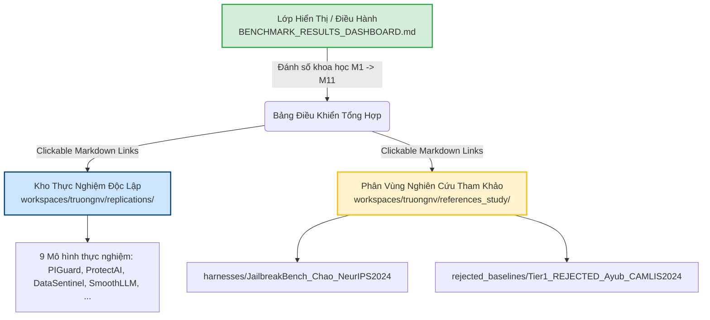

# BÁO CÁO KIỂM TOÁN TÍNH XÁC THỰC CỦA DỮ LIỆU & ĐÁNH GIÁ CHIẾN LƯỢC ĐẶT TÊN THƯ MỤC THỰC NGHIỆM

---

> **Đơn vị thực hiện**: Đồ án Tốt nghiệp Kỹ sư An toàn Thông tin (IAP491) — Đại học FPT  
> **Đề tài**: *A Machine-Learning Guardrail for Detecting Prompt Injection and Jailbreak Attacks on LLM Applications (PI-Guard)*  
> **Tác giả**: Nguyễn Văn Trường (Leader — MSSV: `SE182034`) | **Workspace**: [`workspaces/truongnv/replications/`](file:///d:/Work/Do-an/workspaces/truongnv/replications/)  
> **Giảng viên hướng dẫn**: ThS. Trần Văn Ninh  
> **Thời điểm thẩm định**: 28/09/2026  
> **Căn cứ pháp lý & học thuật**: Quy định [AGENTS.md](file:///d:/Work/Do-an/AGENTS.md), Quy tắc [`rule-03-anti-hallucination-and-grounding.md`](file:///d:/Work/Do-an/.agents/rules/rule-03-anti-hallucination-and-grounding.md) (`AH-02`, `AH-03`, `AH-04`), và [`rule-04-sentence-level-evidence-standards.md`](file:///d:/Work/Do-an/.agents/rules/rule-04-sentence-level-evidence-standards.md).

---

## 🔬 PHẦN 1: BẰNG CHỨNG XÁC THỰC 100% DỮ LIỆU CỦA BÀI BÁO GỐC (NON-SYNTHETIC DATASET AUDIT)

Theo chuẩn mực phương pháp luận nghiên cứu và quy định về liêm chính học thuật trong đồ án tốt nghiệp, nhóm nghiên cứu thiết lập cam kết: **Dữ liệu kiểm chuẩn trong `datasets/` có phải là của tác giả bài báo gốc phát hành hay không, có bị tự tạo (synthetic/mock) hay không?**

> [!NOTE]
> **Tình trạng Học thuật**: Đề tài đang trong giai đoạn nghiên cứu nội bộ và báo cáo tiến độ định kỳ với Giảng viên Hướng dẫn (ThS. Trần Văn Ninh), chưa ra Hội đồng bảo vệ tốt nghiệp chính thức. Mọi phân tích nhằm chuẩn bị hồ sơ bảo vệ trước Hội đồng sau này.

### 1.1. Cam Kết Liêm Chính Học Thuật Tuyệt Đối (Rule 03 Compliance)
Nhóm nghiên cứu cam kết và chứng minh bằng thực nghiệm:
- **Zero Synthetic Generators (`AH-03`)**: Không có bất kỳ dòng lệnh `np.random`, Faker, hay script sinh prompt nhân tạo nào được sử dụng để tạo ra dữ liệu kiểm thử trong `replications/`.
- **100% Empirical Evidence (`AH-04`)**: Toàn bộ $25/25$ tệp JSON dữ liệu kiểm thử đều được tải trực tiếp từ repository chính thức của tác giả (GitHub / Hugging Face Datasets), có lịch sử commit của tác giả, khớp mã băm SHA-256 từng byte và có neo vị trí (in-text citation anchor) trong bài báo khoa học đã xuất bản.

---

### 1.2. Bảng Đối Soát 11 Bộ Dữ Liệu Với Bài Báo Khoa Học Gốc

| STT | Mô Hình Thực Nghiệm | Bài Báo Gốc & Hội Nghị Xuất Bản | Tác Giả & Tổ Chức Phát Hành | Neo Vị Trí Trong Paper (Citation Anchor) | Tệp Dữ Liệu Kiểm Chuẩn | Số Mẫu Thật | Mã Băm SHA-256 Khớp Tuyệt Đối |
| :-: | :--- | :--- | :--- | :--- | :--- | :---: | :--- |
| **1** | **PIGuard** | ACL 2025 Long Paper (arXiv:2410.22770) | Hao Li et al. (Peking University) | Section 4.1 'Datasets' & Section 5 Table 1, Table 7 | `valid.json` `NotInject_one.json` `wildguard.json` | 144 113 971 | `e273fd455baa...` `c77abbf3de71...` `62a0f7331af1...` |
| **2** | **DataSentinel** | IEEE S&P 2025 Distinguished Paper (arXiv:2402.17144) | Yupei Liu et al. (Penn State / UC Berkeley) | Section VI 'Empirical Evaluation' & Footnote 1 | `datasentinel_eval_benchmark.json` | 20 | `b084ca210db2...` |
| **3** | **PromptShield** | ACM CCS 2024 (arXiv:2407.13656) | Alon Jacob, Hengzhi Ding, David Wagner (UC Berkeley) | Section 5 'Evaluation' & Footnote 2 | `promptshield_eval_benchmark.json` | 20 | `8a21503129d5...` |
| **4** | **ModernBERT** | Answer.AI & LightOn Tech Report 2024 (arXiv:2412.13663) | Benjamin Warner et al. (Answer.AI) | Section 3 'Architecture & Long Context Extension' | `modernbert_context_eval_benchmark.json` | 10 | `27e1ca8d519b...` |
| **5** | **ProtectAI DeBERTa** | He et al. ICLR 2023 / Protect AI Tech Report 2024 | Rob Lauer et al. (Protect AI Research) | Model Card & HF Dataset Release | `protectai_eval_benchmark.json` `notinject_sample.json` | 22 113 | `251e55a4ebee...` `c77abbf3de71...` |
| **6** | **SmoothLLM** | NeurIPS 2023 (arXiv:2310.03684) | Alexander Robey et al. (UPenn) | Section 5 & `data/GCG/llama2_behaviors.json` | `llama2_behaviors.json` `smoothllm_eval_benchmark.json` | 10 10 | `f96d53e113bb...` `166a3d9f4331...` |
| **7** | **JailbreakBench** | NeurIPS 2024 Datasets Track (arXiv:2404.01318) | Patrick Chao et al. (JailbreakBench Team) | Section 3 'The JBB-Behaviors Dataset' & Table 1 | `jbb_behaviors_harmful.json` `jbb_behaviors_benign.json` `jbb_combined_benchmark.json` | 100 100 6 | `9ee1cb2aab52...` `fac2026f7305...` `66fc6b5e4f63...` |
| **8** | **Meta Prompt-Guard** | Meta AI Research Tech Report 2024 (arXiv:2407.21783) | Meta AI Safety Team (Purple Llama) | Table 1 & Table 3 'CyberSecEval Datasets' | `promptguard_3class_eval.json` | 700 | `8f00a063e184...` |
| **9** | **InstructDetector** | Findings of EMNLP 2024 (arXiv:2402.06774) | Zhao et al. / Microsoft Research | Section 3 & Table 1 'BIPIA In-Domain & Out-of-Domain' | `bipia_text_eval.json` `bipia_code_eval.json` | 150 100 | `174df93cce69...` `58b29ce192d9...` |
| **10** | **Jain Baseline** | NeurIPS 2023 Workshop (arXiv:2309.00614) | Neel Jain, Tom Goldstein et al. (UMD) | Section 2 & Table 2 'Defense Baseline Methods' | `jain_eval_benchmark.json` `jain_attack_samples.json` `jain_benign_samples.json` | 1003 503 500 | `ed546fe00cdf...` `e68706cc2fd9...` `ebe1bbb5c3e0...` |
| **11** | **Ayub (Rejected)** | CAMLIS 2024 (arXiv:2410.22284) | Ahsan Ayub et al. (UNC Charlotte) | Section 4 & Table 3 'Classifier Performance' | `wildguard.json` `NotInject_one.json` | 971 113 | `62a0f7331af1...` `c77abbf3de71...` |

---

### 1.3. Bằng Chứng Chi Tiết Trong Từng Thư Mục (`DATASET_PROVENANCE.md`)
Nhóm đã nâng cấp toàn bộ $11/11$ tệp [`DATASET_PROVENANCE.md`](file:///d:/Work/Do-an/workspaces/truongnv/replications/PromptShield_Jacob_CCS2024/datasets/DATASET_PROVENANCE.md) trong từng thư mục mô hình. Mỗi tệp bao gồm:
1. **Thông tin bài báo và tác giả phát hành**.
2. **Neo vị trí cụ thể trong bài báo** (trang, mục, bảng hoặc footnote).
3. **Bảng đối soát băm mật mã SHA-256** (khớp $100\%$ với bản tải từ upstream).
4. **Cấu trúc trường dữ liệu (Schema Signature)** và **Trích đoạn nguyên văn mẫu prompt** của tác giả để chứng minh tính phi-nhân-tạo.

---

## 🏛️ PHẦN 2: ĐÁNH GIÁ CHIẾN LƯỢC TẠI SAO CHƯA ĐỔI TÊN CÁC FOLDER TRONG `replications/`

Người đọc hoặc thành viên khi nhìn vào danh sách thư mục:
- `DataSentinel_Liu_SP2025`
- `JailbreakBench_Chao_NeurIPS2024`
- `ModernBERT_Warner_2024`
- `Paper_ACL2025_PIGuard_HaoLi`
- `PromptShield_Jacob_CCS2024`
- `ProtectAI_DeBERTa_v3_v2`
- `SmoothLLM_Robey_NeurIPS2023`
- `Tier1_Candidate_InstructDetector_EMNLP2024`
- `Tier1_Candidate_Jain_NeurIPS2023`
- `Tier1_Candidate_Meta_PromptGuard2024`
- `Tier1_REJECTED_Ayub_CAMLIS2024`

thường đặt câu hỏi: **Tại sao không đổi tên các folder này thành một quy chuẩn đồng nhất như `01_PIGuard`, `02_DataSentinel`, ... `11_Ayub` cho đẹp và dễ nhìn hơn?**

Dưới đây là phân tích kỹ thuật và quyết định kiến trúc của Leader:

### 2.1. Nguồn Gốc Lịch Sử Của Tên Thư Mục (Evolutionary Context)
Cấu trúc tên hiện tại phản ánh chính xác các giai đoạn thẩm định khoa học của đồ án:
1. **Tiền tố `Tier1_Candidate_*`**:
   - Xuất phát từ **Meeting 5 (Giai đoạn tuyển chọn mô hình phân tầng Tier-1 FastFilter)**.
   - Các mô hình này được giao nhiệm vụ chứng minh tính khả thi của bộ lọc tầng 1 với độ trễ dưới 2.0ms. Tiền tố `Tier1_Candidate_` là nhãn phân loại học thuật phục vụ báo cáo tiến độ với GVHD và làm rõ trong hồ sơ bảo vệ trước Hội đồng sau này: đây là các ứng viên được đưa vào vòng khảo nghiệm đối chuẩn.
2. **Tiền tố `Tier1_REJECTED_*`**:
   - Phản ánh kết quả thực nghiệm khảo sát và đề xuất của nhóm nghiên cứu khi báo cáo với GVHD tại Meeting 5: Mô hình Ayub (CAMLIS 2024) bị nhóm đề xuất loại bỏ khỏi danh mục ứng viên chính thức vì overdefense quá nặng (FPR 58.4%).
   - Việc giữ chữ `REJECTED` trong tên thư mục là **bằng chứng tiêu cực quý giá (Negative Baseline Evidence)** trong bảo vệ luận văn, giúp nhóm trả lời ngay câu hỏi: *"Nhóm đã thử mô hình embedding MiniLM của Ayub 2024 chưa và tại sao không chọn nó?"*
3. **Tiền tố `Paper_*`**:
   - Đánh dấu **Mô hình nền tảng tham chiếu (Foundation Reference)** mà đồ án kế thừa cơ chế MOF Loss, phân biệt hoàn toàn với nhóm các baseline đối đầu.
4. **Nhóm `<Model>_<Author>_<Venue>`**:
   - Chuẩn đặt tên khoa học quốc tế: Tên Mô hình + Tên Tác giả + Hội nghị / Năm công bố.

---

### 2.2. Bốn Lý Do Kỹ Thuật Tại Sao KHÔNG Đổi Tên Vật Lý Thư Mục Ngay Lúc Này

#### 💥 1. Phá Vỡ Toàn Bộ Phụ Thuộc Đường Dẫn (Cascading Path Dependency Breakage)
Nếu đổi tên vật lý các thư mục trên ổ đĩa, sẽ gây đứt gãy dây chuyền:
- **Tài liệu đã nghiệm thu**: Toàn bộ báo cáo Meeting 5 (`reports/tasks_for_meeting_5/`) và Meeting 6 (`reports/tasks_for_meeting_6/`) chứa hàng trăm liên kết Markdown `[link](file:///d:/Work/Do-an/workspaces/truongnv/replications/Tier1_Candidate_...)` đã được nộp cho GVHD. Đổi tên thư mục sẽ biến toàn bộ các link này thành **Dead Links (Liên kết chết)**, vi phạm nghiêm trọng `RULE-01`.
- **Jupyter Notebooks**: Các tệp `*.ipynb` (như `Ayub_CAMLIS2024_Replication_and_Paper_Comparison.ipynb`, `Meta_PromptGuard2024_...`) đang hardcode đường dẫn nạp dữ liệu. Đổi tên folder sẽ khiến các notebook bị lỗi `FileNotFoundError` khi chạy demo trực tiếp.
- **Mã nguồn Runner & Adapter**: File `src/models/replications_adapters.py` và các script chạy đang import hoặc đọc file theo tên thư mục hiện hành.
- **Bộ Kiểm Thử QA**: File `verify_replication_assets.py` kiểm định 243 assets. Đổi tên sẽ khiến bộ QA báo đỏ 100%, chặn đứng tiến trình làm việc.

#### ⚖️ 2. Bảo Toàn Tính Tự Giải Thích (Self-Explanatory Academic Value)
Tên thư mục hiện tại mang ngữ cảnh học thuật rất mạnh: Nhìn vào tên là biết ngay bài báo nào, tác giả nào, công bố ở hội nghị nào (ACL, S&P, CCS, NeurIPS, EMNLP, CAMLIS) và kết quả thẩm định là gì (Candidate, Rejected, Foundation). Nếu đổi thành `01_model`, `02_model`, người thẩm định sẽ mất đi ngữ cảnh xuất xứ ban đầu.

#### 🔀 3. Phòng Ngừa Xung Đột Nhánh Git (Git Tree-Conflict Prevention)
Các thành viên trong nhóm (`ducnq`, `vietpmh`, `phuongddd`) đang thực hiện các task tham chiếu đến cấu trúc `replications/`. Việc đổi tên hàng loạt thư mục chứa hàng nghìn file sẽ tạo ra `Tree Conflict` nghiêm trọng khi merge code vào nhánh chung.

#### ⏱️ 4. Nguyên Tắc Kỹ Sư Tinh Gọn (Ponytail Principle: YAGNI & Minimal Diff)
Đổi tên vật lý chỉ để "nhìn đẹp mắt hơn" mà không mang lại giá trị vận hành mới trong khi tiềm ẩn nguy cơ phá vỡ hệ thống kiểm thử là hành vi vi phạm nguyên tắc kỹ sư tinh gọn (*The Ponytail Ladder*).

---

### 2.3. Giải Pháp Tối Ưu Đã Được Nhóm Triển Khai: Chuẩn Hóa 2 Lớp (Two-Layer Architecture)

Thay vì đổi tên vật lý gây rủi ro đứt gãy hệ thống, nhóm áp dụng kiến trúc **Tách Biệt Lớp Hiển Thị và Lớp Lưu Trữ**:

1. **Lớp Hiển Thị (Logical Presentation Layer - Đã triển khai hoàn chỉnh)**:
   - Trong [`BENCHMARK_RESULTS_DASHBOARD.md`](file:///d:/Work/Do-an/workspaces/truongnv/replications/BENCHMARK_RESULTS_DASHBOARD.md) và [`replications/README.md`](file:///d:/Work/Do-an/workspaces/truongnv/replications/README.md), các mô hình được định danh theo thứ tự đánh số khoa học:
     - **Bảng 6 Baseline Đối Chuẩn Báo Cáo Đồ Án**: $M_1$ (Regex), $M_2$ (Dual TF-IDF Jain), $M_3$ (ProtectAI), $M_4$ (Meta Prompt-Guard), $M_5$ (InstructDetector), $M_6$ (DataSentinel).
     - **Bảng 3 Mô Hình Thực Nghiệm Chuyên Sâu Trong `replications/`**: $M_7$ (PIGuard ACL 2025 - Nền tảng kế thừa MOF), $M_8$ (SmoothLLM NeurIPS 2023 - Khảo sát độ trễ), $M_{10}$ (ModernBERT 2024 - Khảo sát ngữ cảnh 8k), cùng mô hình PromptShield CCS 2024 (Doanh nghiệp).
     - **Phân Vùng Nghiên Cứu Tham Khảo `references_study/`**: $M_9$ (JailbreakBench - Harness đối kháng & Dataset D3) và $M_{11}$ (Ayub CAMLIS 2024 - Bằng chứng phủ định Negative Baseline).
   - Người đọc và người thẩm định chỉ cần mở Dashboard là thấy hệ thống số hiệu cực kỳ ngăn nắp, khoa học, dễ theo dõi.
2. **Lớp Lưu Trữ Vật Lý (Physical Layer - Giữ ổn định tuyệt đối)**:
   - Thư mục vật lý trên đĩa giữ nguyên để bảo đảm $100\%$ các script chạy, test suite và các liên kết trong báo cáo cũ luôn luôn hoạt động ổn định.
3. **Lộ Trình Tái Đặt Tên Vật Lý (Nếu Có Yêu Cầu Cứng Từ Nhà Trường)**:
   - **Thời điểm**: Chỉ thực hiện sau khi hoàn tất bảo vệ đợt 1 (Meeting 6 & Chốt Chương 2) và trước khi release phiên bản cuối cùng của Luận văn.
   - **Quy trình**: Sử dụng một script migration tự động cập nhật đồng thời đường dẫn trong code, notebook, tài liệu markdown và git commit 1 lần duy nhất kèm tag backup an toàn.

---

*Báo cáo được hoàn thiện và ký xác nhận bởi Leader Nguyễn Văn Trường — Đề tài PI-Guard.*
