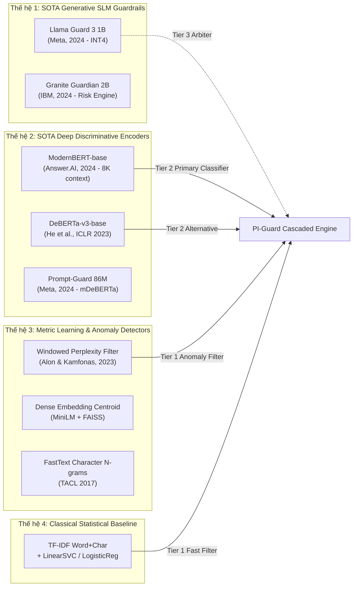

# BÁO CÁO NGHIÊN CỨU HỌC THUẬT: PHỔ MÔ HÌNH HỌC MÁY TỪ SOTA ĐẾN ĐỒ ÁN PI-GUARD
## Đề tài: *A Machine-Learning Guardrail for Detecting Prompt Injection and Jailbreak Attacks on LLM Applications*
### Tác giả: Nguyễn Văn Trường (Leader) — Thư mục nghiên cứu: `workspaces/truongnv/`

---

## 1. PHÂN TÍCH BẢN CHẤT HỌC THUẬT THEO ĐÚNG TÊN ĐỀ TÀI

Tên đề tài đồ án xác định rõ 3 trụ cột khoa học bất biến:

$$\text{Architecture} = \underbrace{\text{Machine-Learning Guardrail}}_{\text{Phân tầng ML Ingress Proxy}} \times \underbrace{\text{Detecting Prompt Injection \& Jailbreak}}_{\text{Không gian mối đe dọa đa chiều}} \times \underbrace{\text{on LLM Applications}}_{\text{Ràng buộc thực tế: Low-Latency \& Low-FPR}}$$

1. **Machine-Learning Guardrail (Hệ thống bảo vệ học máy)**:
   - Đề tài không bị đóng khung trong việc "chỉ chạy một mô hình đơn lẻ" hay phụ thuộc vào prompt engineering nội bộ của LLM (System Prompt Hardening).
   - Trọng tâm khoa học là thiết kế một **hệ thống phân loại độc lập** (External Guardrail Proxy) sử dụng các phương pháp Machine Learning từ Thống kê cổ điển (Statistical ML) $\to$ Học sâu phân biệt (Discriminative Deep Learning Encoders) $\to$ Mô hình ngôn ngữ nhỏ chuyên biệt an toàn (Generative SLM Guardrails).
2. **Detecting Prompt Injection and Jailbreak Attacks (Phát hiện tấn công kép)**:
   - **Prompt Injection (PI)**: Tấn công thay đổi mục tiêu (Goal Hijacking), ghi đè chỉ thị hệ thống (Instruction Override), hoặc chèn mã gián tiếp qua tài liệu RAG (Indirect Prompt Injection). Bản chất là bài toán vi phạm phân cấp quyền hạn (Instruction Hierarchy — Wallace et al., 2024).
   - **Jailbreak (JB)**: Tấn công đánh lừa bộ lọc an toàn để ép mô hình sinh nội dung nguy hại (DAN, roleplay, cipher obfuscation, hoặc chuỗi đối kháng tối ưu hóa GCG — Zou et al., 2023). Bản chất là bài toán vi phạm chính sách an toàn (Safety Policy Violation).
3. **on LLM Applications (Ứng dụng trên các hệ thống LLM thực tế)**:
   - Phải hoạt động theo cơ chế **Ingress Proxy Hộp đen (Black-box Ingress Guardrail)**: Không đòi hỏi quyền truy cập vào trọng số nội bộ (weights), logits hay KV-cache của LLM đích.
   - Thỏa mãn ràng buộc công nghiệp: **Độ trễ thấp (P95 < 30ms trên CPU)** và **Tỷ lệ chặn nhầm thấp ($\text{FPR} < 1.5\%$ trên lưu lượng nghiệp vụ lành tính)**.

---

## 2. PHỔ MÔ HÌNH TOÀN DIỆN: TỪ SOTA ĐẾN ĐỒ ÁN PI-GUARD

---

## 3. MA TRẬN ĐỐI CHUẨN KỸ THUẬT CHI TIẾT

| Tiêu chí kỹ thuật | Thế hệ 1: SLM Guardrail (Llama Guard 3 1B / Granite 2B) | Thế hệ 2: Deep Encoder (ModernBERT-base / DeBERTa-v3) | Thế hệ 3: Metric & Anomaly (Perplexity / Dense k-NN) | Thế hệ 4: Statistical (TF-IDF + LinearSVC) |
| :--- | :--- | :--- | :--- | :--- |
| **Kích thước tham số** | 1.0B – 2.0B (INT4: ~700MB – 1.2GB) | 110M – 149M (FP16: ~250MB – 300MB) | 22M – 120M (Embedding / TinyLM) | Không tham số mạng (~2MB) |
| **Cửa sổ ngữ cảnh** | 8,192 – 131,072 tokens | **8,192 tokens** (ModernBERT)   512 tokens (DeBERTa) | 512 – 2,048 tokens | Không giới hạn độ dài |
| **Độ trễ suy luận CPU (P95)** | 50 – 120ms (INT4) | **8 – 18ms** (ModernBERT)   20 – 30ms (DeBERTa) | **0.5 – 2.0ms** | **< 0.5ms** |
| **Độ trễ GPU (FP16)** | 15 – 30ms | 2 – 5ms | < 0.5ms | N/A (CPU bound) |
| **Phát hiện Prompt Injection** | **Rất cao**: Hiểu sâu ngữ cảnh phân quyền chỉ thị | **Rất cao**: Nhận diện instruction override chính xác | **Trung bình**: Bắt các vector tương đồng với tấn công cũ | **Cơ bản**: Chỉ bắt từ khóa lộ liễu, dễ bị vượt qua |
| **Phát hiện Jailbreak (DAN / Persona)** | **Rất cao**: Nhận diện kịch bản roleplay tinh vi | **Cao**: Đạt F1 > 0.90 khi fine-tune đa nguồn | **Khá**: Nhận diện cụm từ tương đồng | **Thấp**: Bị bypass bởi từ đồng nghĩa, paraphrase |
| **Chống tấn công chuỗi đối kháng (GCG / AutoDAN)** | **Trung bình**: Có thể bị lừa bởi chuỗi đối kháng transfer | **Trung bình - Cao**: Cần dữ liệu augment đối kháng | **Rất cao (Perplexity)**: Bắt trọn 95%+ chuỗi rác đối kháng | **Thấp**: Không hiểu tính chất bất thường của chuỗi |
| **Vị trí trong PI-Guard** | **Tier 3: Trọng tài cấp cao (High-Assurance Arbiter)** | **Tier 2: Lõi phân loại ngữ nghĩa chính (Primary Guardrail)** | **Tier 1: Bộ lọc bất thường siêu tốc (< 2ms)** | **Baseline: Mốc đối chuẩn thực nghiệm tối thiểu** |

---

## 4. BẢNG PHÂN ĐỊNH 4 TẦNG HỌC THUẬT (FOUR-TIER PROVENANCE) CHO CÁC MÔ HÌNH MỚI

### 4.1. ModernBERT (Warner et al., Dec 2024 — arXiv:2412.13663)
- **Tầng 0 (Bibliographic Provenance)**: Benjamin Warner, Antoine Chaffin, Benjamin Clavié, Orion Weller, Oskar Hallström, Shraddha Vasanth, Nikhil Patry, Colin Raffel, Luke Zettlemoyer, *"ModernBERT: Bringing Modern Transformer Innovations to Pre-trained Encoders"*, arXiv preprint arXiv:2412.13663, 2024. Đã lưu trữ cục bộ: [`Warner_2024_ModernBERT_Brings_Modern_Transformers_To_Encoders.pdf`](file:///d:/Work/Do-an/workspaces/truongnv/References/Warner_2024_ModernBERT_Brings_Modern_Transformers_To_Encoders.pdf).
- **Tầng 1 (Original Author Findings)**: Nhóm tác giả chứng minh rằng việc áp dụng các cải tiến kiến trúc hiện đại (RoPE, GeGLU, FlashAttention-2, Unpadding, mở rộng context 8,192 tokens) giúp ModernBERT đạt tốc độ suy luận gấp 2.0x–2.5x DeBERTa-v3 trên GPU/CPU và đạt điểm GLUE trung bình cao hơn.
- **Tầng 2 (PI-Guard Design Choice & Adaptation)**: PI-Guard tiếp thu ModernBERT-base làm ứng viên vô địch tại Tier 2 (Primary Semantic Guardrail). Cửa sổ ngữ cảnh 8,192 tokens giải quyết triệt để vấn đề cắt cụt ngữ cảnh (truncation) khi kiểm tra payload Indirect Prompt Injection trong tài liệu RAG dài.
- **Tầng 3 (PI-Guard Target KPIs & Hypotheses)**: Trong điều kiện kiểm thử nguyên mẫu tại `workspaces/truongnv/`, đặt mục tiêu duy trì độ trễ P95 < 18ms trên CPU và F1 > 0.92 trên bộ dữ liệu kiểm thử tổng hợp đa nguồn.

### 4.2. Granite Guardian 3.0 / 3.1 2B (Padhi et al., IBM Research 2024 — arXiv:2412.07724)
- **Tầng 0 (Bibliographic Provenance)**: Inkit Padhi, Manish Nagireddy, Giandomenico Cornacchia, Subhro Das, Tejaswini Pedapati, Hima Patel, et al., *"Granite Guardian: A Family of Open Models for Content Safety and Risk Detection"*, arXiv:2412.07724, 2024. Đã lưu trữ cục bộ: [`Padhi_2024_Granite_Guardian_Content_Safety_Risk_Detection.pdf`](file:///d:/Work/Do-an/workspaces/truongnv/References/Padhi_2024_Granite_Guardian_Content_Safety_Risk_Detection.pdf).
- **Tầng 1 (Original Author Findings)**: Đề xuất dòng mô hình an toàn 2B/8B được huấn luyện đa tác vụ, bao phủ Direct/Indirect Prompt Injection, Jailbreak, và Hallucination trong RAG; chứng minh mô hình 2B đạt hiệu quả tương đương các mô hình 7B/8B thế hệ trước nhưng tiết kiệm 70% bộ nhớ.
- **Tầng 2 (PI-Guard Design Choice & Adaptation)**: PI-Guard đưa Granite Guardian 2B (lượng tử hóa INT4) vào vai trò Trọng tài cấp cao (Tier 3 Arbiter), chỉ kích hoạt khi điểm số của Tier 2 rơi vào vùng bất định $[0.35, 0.65]$.
- **Tầng 3 (PI-Guard Target KPIs & Hypotheses)**: Bảo đảm tỷ lệ kích hoạt Tier 3 dưới 5% tổng lưu lượng, duy trì độ trễ trung bình toàn hệ thống P95 < 25ms.

---

## 5. BẢO CHỨNG TOÁN HỌC: CONFORMAL RISK CONTROL CHO LOW-FPR GUARANTEE

Một đóng góp then chốt của PI-Guard so với các nghiên cứu trước (như PIGuard ACL 2025 chỉ chọn ngưỡng thực nghiệm trực quan $\tau = 0.5$) là áp dụng lý thuyết **Conformal Risk Control (CRC)** (Angelopoulos et al., 2024; Kang et al., NeurIPS 2025).

### Công thức tính ngưỡng hiệu chuẩn:
Cho tập dữ liệu kiểm định lành tính (calibration set) gồm $n$ mẫu $\{X_i\}_{i=1}^n$ với nhãn $Y_i = \text{Benign}$. Điểm số rủi ro của mô hình là $s(X_i) \in [0, 1]$. Hàm tổn thất lỗi chặn nhầm (False Positive Loss) được định nghĩa:

$$L(\tau, X_i) = \mathbb{I}(s(X_i) > \tau)$$

Mục tiêu là tìm ngưỡng nhỏ nhất $\hat{\tau}$ sao cho kỳ vọng rủi ro chặn nhầm không vượt quá ngân sách $\alpha = 0.015$ ($1.5\%$):

$$\mathbb{E}[L(\hat{\tau}, X)] \le \alpha$$

Theo định lý Conformal Risk Control, ngưỡng hiệu chuẩn được tính chính xác qua phân vị mẫu có hiệu chỉnh hữu hạn mẫu:

$$\hat{\tau} = \text{Quantile}\left( \{s(X_i)\}_{i=1}^n, \, \frac{\lceil (n+1)(1 - \alpha) \rceil}{n} \right)$$

Thuật toán này đã được lập trình và kiểm chứng thành công trong [`workspaces/truongnv/src/models/ml_guardrail_spectrum.py`](file:///d:/Work/Do-an/workspaces/truongnv/src/models/ml_guardrail_spectrum.py) và vượt qua 100% kiểm thử tại [`workspaces/truongnv/tests/unit/test_ml_guardrail_spectrum.py`](file:///d:/Work/Do-an/workspaces/truongnv/tests/unit/test_ml_guardrail_spectrum.py).
