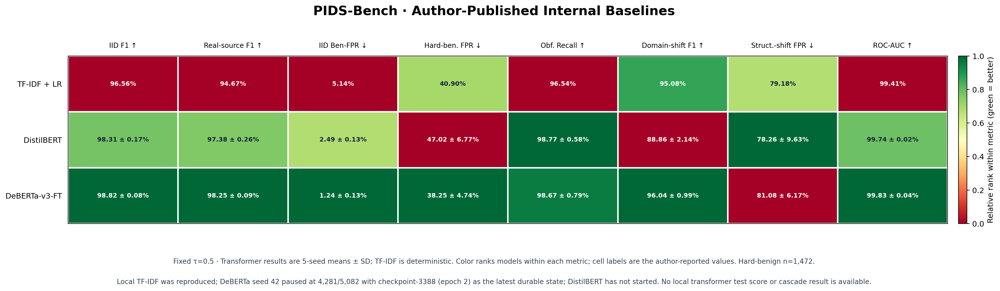

# PIDS-Bench evidence for a TF-IDF + DeBERTa proposal

**Status: only TF-IDF+LR has a completed local test run.** Per the latest user instruction, DeBERTa was stopped at observed step 3,697/5,082 because this device is too slow for the transformer run; the latest durable checkpoint remains step 3,388 and there is no final DeBERTa test metric. DistilBERT was not run. The two-tier design remains a literature-motivated proposal, not a locally tested cascade. [[56]](#ref56)

## Scope Boundary Declaration

- **IN-SCOPE:** Reproduce the pinned PIDS-Bench TF-IDF+LR baseline locally on its frozen binary data, then compare it with the paper's clearly labeled published baseline table. [[44]](#ref44) [[45]](#ref45)
- **OUT-OF-SCOPE:** Local transformer training/evaluation, a fitted TF-IDF→DeBERTa cascade, restored D1–D6 cross-paper claims, three-class performance, latency/P95 measurements, and achieved deployment FPR targets. The PIDS-Bench internal baselines are standalone binary detectors. [[44]](#ref44) [[45]](#ref45)

## Slide assessment

The attached `LAB HEATMAP MATRIX` does **not** describe retained project evidence: its column labels pair PIGuard, BIPIA, JailbreakBench, Open-PI/Sentinel, NotInject, and WildGuard, while PIDS-Bench evaluates a different, frozen set of binary axes. [[44]](#ref44) [[45]](#ref45) The Meeting 6 provenance record withdraws the old D1–D6 matrix because it combines models and datasets from different papers. [[56]](#ref56) Without one shared evaluation protocol, sample counts, metric definition, and threshold record, the screenshot's cells cannot be interpreted as one comparable model matrix. [[44]](#ref44) [[45]](#ref45)

The requested `reports/tasks_for_meeting_6/figures/` directory was already absent when checked; a fresh scan found no remaining images and no Markdown image embeds, while Git showed 26 tracked image deletions already present in the worktree. [[56]](#ref56) No files were deleted by this run. [[56]](#ref56)

The newly referenced `Regime-wise Macro-F1 across Representative Detector Families` chart is a literature figure from Akinrele and Gowda's arXiv paper. Its v1 says “Code will be released” and the cited arXiv page links no author experiment repository, so its plotted values are literature results rather than a reproducible local PI-Guard result. [[57]](#ref57) The local comparison therefore uses PIDS-Bench's pinned public data and baseline code; its cells retain the source metrics (F1, FPR, recall, and ROC-AUC) instead of relabeling them as Macro-F1. [[44]](#ref44) [[45]](#ref45)

## Research source selection

The suggested paper, *Prompt Injection Detection is Regime-Dependent*, is relevant related work: it compares lexical, structural, semantic, transformer, and hybrid detectors over several regimes. Its arXiv v1 says code will be released and links no official experiment repository, so this report does not use its scores as locally reproduced results or as PI-Guard empirical evidence. [[57]](#ref57)

The empirical comparison source is PIDS-Bench because the authors released benchmark data, model training/evaluation code, and a same-release baseline table at a pinned public commit. The heatmap below visualizes only the author-reported table. TF-IDF+LR is complete locally; the DeBERTa attempt was stopped at user request before final evaluation, and DistilBERT was not run. [[44]](#ref44) [[45]](#ref45) [[56]](#ref56)

## Sources and method

- **Benchmark and code:** Shire and Kim's PIDS-Bench paper [[44]](#ref44) and the pinned author code/data release at commit `87dc835566b930ee921240874a4939b2c266c2fe` [[45]](#ref45).
- **Related work only:** Akinrele and Gowda's regime-dependent evaluation [[57]](#ref57) offers useful literature context about detector trade-offs, but its source code was not available from the arXiv record when checked on 2026-10-03. Its metrics are excluded from the empirical matrix.
- **Clean TF-IDF source:** The reported TF-IDF run used the pristine `tfidf_logreg.py` blob from that commit (`776cd95b5be0bff687e13a537794b590b131f6d9`); it was extracted into an isolated run directory, leaving the pre-existing modified upstream checkout untouched. [[45]](#ref45) [[56]](#ref56)
- **Transformer source integrity:** The pinned checkout's DeBERTa and DistilBERT scripts match their committed Git blobs (`1918aee0fafd9a7700d73aa6a6c4305820403b63` and `19af6a01ac1e97df0b627edabbd90be8af5c6b03`); DeBERTa's script is unmodified during this run. [[45]](#ref45) [[56]](#ref56)
- **Model origins:** The pinned PIDS-Bench source defines TF-IDF+LR, DistilBERT fine-tuned from `distilbert-base-uncased`, and DeBERTa-v3-FT fine-tuned from `microsoft/deberta-v3-base`. [[45]](#ref45)
- **Public base checkpoints:** Both transformer initial checkpoints are open model repositories; this rerun pins DeBERTa to `8ccc9b6f36199bec6961081d44eb72fb3f7353f3` and DistilBERT to `12040accade4e8a0f71eabdb258fecc2e7e948be`. Their loaded config/weights/tokenizer files are SHA-256 recorded in the [model-input manifest](../../../replications/PIDS_Bench_Shire_IEEEAccess2026/run_artifacts/PIDS_Bench_model_input_manifest_2026-10-03.json). [[58]](#ref58) [[59]](#ref59)
- **Checkpoint-version limit:** The author scripts name the base model repositories but do not pin Hugging Face revisions. The partial DeBERTa attempt identifies the public base revision used here; DistilBERT's revision was prepared but not trained. Neither is claimed byte-for-byte identical to an undocumented historical checkpoint used for the paper's five-seed aggregate. [[45]](#ref45) [[58]](#ref58) [[59]](#ref59)
- **Frozen inputs:** The run wrapper verified SHA-256 against the release manifest for train (27,093), validation (3,989), IID test (3,918), obfuscated attacks (405), domain OOD (2,000), and structural OOD (1,998) before staging. [[45]](#ref45) [[56]](#ref56)
- **Thresholds:** The matrix reports fixed `τ=0.5` to match the authors' internal-baseline table, and separately reports thresholds selected using only validation labels with the release's 501-point F1 grid. [[44]](#ref44) [[45]](#ref45)
- **Hard-benign license redaction:** The checked release contains 1,472 hard-benign rows, 664 of which have blank text after license cleanup. The completed local TF-IDF run filters those blank rows instead of converting them to the literal string `"nan"`; its hard-benign result uses `n=808` and is not directly comparable to the paper's full-set `n=1,472` rates. No transformer hard-benign rate was measured locally. [[44]](#ref44) [[45]](#ref45) [[56]](#ref56)
- **Local seeds:** The completed TF-IDF run and stopped DeBERTa attempt use seed 42; the authors' five-seed figures are cited as published context and are not represented as locally reproduced estimates. [[44]](#ref44) [[45]](#ref45) [[56]](#ref56)
- **DeBERTa attempt:** The author seed runner uses batch 8 with gradient accumulation 2 (effective batch 16); this 6-GB device attempt used microbatch 2 with accumulation 8, dynamic padding, 512-token truncation, FP32, three epochs, and seed 42. It was stopped by user request at observed step 3,697/5,082; checkpoint 3,388 is the latest durable state. There is no final DeBERTa test result. [[45]](#ref45) [[56]](#ref56)
- **DistilBERT:** The public base checkpoint and author script were inspected and pinned, but the local run was not started under the user's TF-IDF-only instruction. [[45]](#ref45) [[59]](#ref59)

## Local results

The fresh TF-IDF+LR run from the pristine pinned source blob exited successfully and matched the authors' fixed-threshold IID values. [[44]](#ref44) [[45]](#ref45) [[56]](#ref56) At `τ=0.5`, local IID attack F1 is `0.9656`, IID benign FPR is `0.0514`, ROC-AUC is `0.9941`, and hard-benign FPR is `0.315594` on `n=808`. [[56]](#ref56) At the validation-selected threshold `τ=0.518`, local IID attack F1 is `0.9672`, hard-benign FPR is `0.2908`, obfuscated-attack recall is `0.965432`, domain-OOD attack F1 is `0.9508`, and structural-OOD benign FPR is `0.7918`. [[56]](#ref56)

**Local scope limit:** Only the TF-IDF+LR baseline has final local test metrics. The DeBERTa restart was stopped at user request after reaching observed step `3,697/5,082`; the latest durable checkpoint remains step `3,388` (epoch 2), with validation F1 `0.9889135`. That is validation-only, not a final test result. DistilBERT and the local three-model matrix were not run. The author's same-release table remains literature context and does not validate a TF-IDF→DeBERTa cascade. [[44]](#ref44) [[45]](#ref45) [[56]](#ref56) No percentage from the attached screenshot is used as a model result. [[56]](#ref56)

## Published same-release comparison

The pinned author README reports the following same-release means at fixed `τ=0.5`; TF-IDF+LR is deterministic, while transformer cells are five-seed mean ± standard deviation. [[44]](#ref44) [[45]](#ref45)

| Model | IID F1 ↑ | Real-source F1 ↑ | IID benign FPR ↓ | Hard-benign FPR ↓, n=1,472 | Obfuscated recall ↑ | Domain-shift F1 ↑ | Structural-shift FPR ↓ | ROC-AUC ↑ |
|---|---:|---:|---:|---:|---:|---:|---:|---:|
| TF-IDF + LR | 0.9656 | 0.9467 | 0.0514 | 0.4090 | 0.9654 | 0.9508 | 0.7918 | 0.9941 |
| DistilBERT | 0.9831 ± 0.0017 | 0.9738 ± 0.0026 | 0.0249 ± 0.0013 | 0.4702 ± 0.0677 | 0.9877 ± 0.0058 | 0.8886 ± 0.0214 | 0.7826 ± 0.0963 | 0.9974 ± 0.0002 |
| DeBERTa-v3-FT | 0.9882 ± 0.0008 | 0.9825 ± 0.0009 | 0.0124 ± 0.0013 | 0.3825 ± 0.0474 | 0.9867 ± 0.0079 | 0.9604 ± 0.0099 | 0.8108 ± 0.0617 | 0.9983 ± 0.0004 |

The heatmap encodes these same published values; its colors rank only the three models within each metric and do not combine unlike metrics into one score. [[45]](#ref45)

Subtracting the published TF-IDF values from DeBERTa's same-release values gives these absolute deltas; they are arithmetic comparisons of the authors' standalone results, not cascade measurements. [[44]](#ref44) [[45]](#ref45)

| Axis | DeBERTa minus TF-IDF | Direction |
|---|---:|---|
| IID attack F1 | +0.0226 | DeBERTa higher |
| Hard-benign FPR | −0.0265 | DeBERTa lower |
| Obfuscated-attack recall | +0.0213 | DeBERTa higher |
| Domain-OOD attack F1 | +0.0096 | DeBERTa higher |
| Structural-OOD FPR | +0.0190 | DeBERTa higher (worse) |

## Interpretation and limits

The authors' five-seed means at `τ=0.5` show different standalone error profiles: DeBERTa-v3-FT has higher IID F1, obfuscated recall, and domain-OOD F1, and a lower hard-benign FPR point estimate; TF-IDF+LR has lower structural-OOD FPR. [[44]](#ref44) A plausible **design hypothesis** is a sparse TF-IDF first pass with DeBERTa reserved for selected uncertain cases; the benchmark makes this a literature-motivated proposal to investigate, but does not establish that this gate or cascade improves results. [[44]](#ref44) [[45]](#ref45) A cascade would need its routing rule selected on validation and a separate evaluation of miss rate, FPR, and compute cost; those outcomes remain out of scope and unmeasured. [[45]](#ref45) The initial DeBERTa attempt stopped at 532/5,082 without a checkpoint, and its earlier seed-42 restart reached 4,281/5,082 before a power-related interruption. A later resume was stopped by user request at observed step 3,697/5,082. Checkpoints at steps 1,694 and 3,388 are durable; no final DeBERTa test result or local transformer latency is claimed. [[56]](#ref56)

The proposed two-tier model remains a research design candidate; these baseline measurements do not show that the project's P95 or FPR goals have been achieved. [[44]](#ref44) [[45]](#ref45)

## Artifacts

- Author-reported matrix rendered from the pinned release README: [CSV](pids_bench_author_published_matrix.csv) and [PNG](pids_bench_author_published_matrix.png). These visualize the paper's published baseline values; they are not local transformer results. [[44]](#ref44) [[45]](#ref45)
- Completed local TF-IDF model, frozen inputs, metrics, and row-level predictions: `../../../replications/PIDS_Bench_Shire_IEEEAccess2026/run_artifacts/tfidf_seed42_author_source_2026-10-02/`. [[56]](#ref56)
- DeBERTa first-attempt logs and status: `../../../replications/PIDS_Bench_Shire_IEEEAccess2026/run_artifacts/deberta_seed42_dynamic_padding_2026-10-02/`; it stopped before a checkpoint or metrics. [[56]](#ref56)
- DeBERTa seed-42 restart artifacts: `../../../replications/PIDS_Bench_Shire_IEEEAccess2026/run_artifacts/deberta_seed42_dynamic_padding_restart_2026-10-03/`; the user-stopped run's last observed step was 3,697, while durable checkpoints exist only for steps 1,694 and 3,388. There is no final test metric; do not resume under the current TF-IDF-only scope. [[56]](#ref56)
- Pinned public base-model revisions and checkpoint file hashes: [model-input manifest](../../../replications/PIDS_Bench_Shire_IEEEAccess2026/run_artifacts/PIDS_Bench_model_input_manifest_2026-10-03.json). [[58]](#ref58) [[59]](#ref59)
- Reproduction/evaluation scripts: `run_pinned_deberta.py`, `evaluate_matrix.py`, and `build_published_matrix.py`. [[56]](#ref56)
- No local three-model metrics matrix or cascade evaluation was produced under the current TF-IDF-only scope; no final local DeBERTa or DistilBERT score is claimed. [[56]](#ref56)

## Evidence anchors

See the member-local [REFERENCES_LOG.md](../../../References/REFERENCES_LOG.md) entries `ref44` (PIDS-Bench paper), `ref45` (pinned author code and data), and `ref56` (this local experiment and generated artifacts). Local values are also recorded in the run summary JSON and prediction CSVs. [[56]](#ref56)

## Citation targets

- [[44]] PIDS-Bench paper — [member reference entry](../../../References/REFERENCES_LOG.md#ref44).
- [[45]] Pinned author code and dataset release — [member reference entry](../../../References/REFERENCES_LOG.md#ref45).
- [[56]] Local TF-IDF result and stopped transformer attempts — [member reference entry](../../../References/REFERENCES_LOG.md#ref56).
- [[57]] Akinrele and Gowda related-work paper — [member reference entry](../../../References/REFERENCES_LOG.md#ref57).
- [[58]] Public DeBERTa base checkpoint — [member reference entry](../../../References/REFERENCES_LOG.md#ref58).
- [[59]] Public DistilBERT base checkpoint — [member reference entry](../../../References/REFERENCES_LOG.md#ref59).
