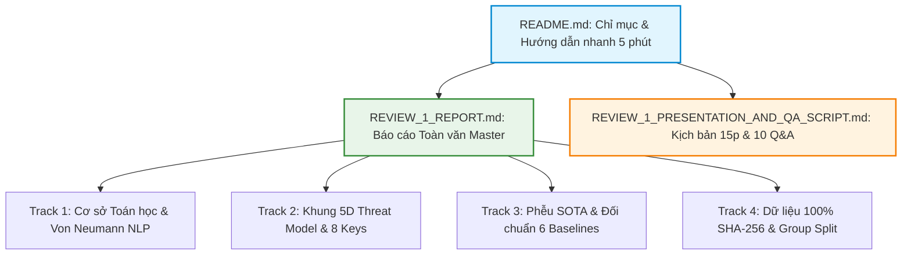

# PHÂN HỆ HỒ SƠ BÁO CÁO REVIEW 1 (REPORT NO. 1 & REPORT NO. 2)
## Đồ án Tốt nghiệp: PI-Guard (`IAP491_FA26_PI_GUARD`) — Đại học FPT
**Chuyên ngành**: An toàn Thông tin (Information Assurance)  
**Trưởng nhóm thực hiện**: Nguyễn Văn Trường (Leader - `SE182034`)  
**Giảng viên hướng dẫn**: ThS. Trần Văn Ninh  
**Cột mốc**: **REVIEW 1** *(Tuần 4 / 15 Tuần — 35% Process Mark)*

---

## ⚡ 1. BẢN HƯỚNG DẪN ĐỌC NHANH 5 PHÚT (5-MINUTE EXECUTIVE FAST-TRACK)

Dành cho Giảng viên hướng dẫn và Hội đồng thẩm định muốn nắm bắt toàn bộ bản chất kỹ thuật của đồ án trong vòng 5 phút:

### 💡 4 Mô Hình Trực Quan Bình Dân Học Vụ (Core Intuitive Mental Models)

```
┌────────────────────────────────────────────────────────────────────────────────────────┐
│                          4 MENTAL MODELS CỐT LÕI CỦA PI-GUARD                          │
├────────────────────────────────────────────────────────────────────────────────────────┤
│ 1. LỖ HỔNG VON NEUMANN NLP = "SQL INJECTION CỦA THỜI ĐẠI AI"                           │
│    • SQL Injection xảy ra vì code và data nối chuỗi: "SELECT * FROM users WHERE..."    │
│    • LLM Transformer hiện nay KHÔNG CÓ "Prepared Statements"! System Prompt (S) và     │
│      User Prompt (U) bị đổ chung vào một không gian token phẳng (X = S || U).          │
│    • Kẻ tấn công chỉ cần chèn câu lệnh giả mạo, cơ chế Attention sẽ bị "đảo quyền",   │
│      coi dữ liệu người dùng là mệnh lệnh tối cao cần tuân thủ.                         │
├────────────────────────────────────────────────────────────────────────────────────────┤
│ 2. KIẾN TRÚC TWO-TIER CASCADE = "CỬA KIỂM SOÁT AN NINH SÂN BAY 2 LỚP"                 │
│    • Tầng 1 (TF-IDF char_wb, ~1.5ms): Cổng từ quét kim loại. Cho qua ngay 85% hành    │
│      khách bình thường (Fast-Pass), chỉ giữ lại các trường hợp nghi vấn.               │
│    • Tầng 2 (DeBERTa-v3 Native FP32, ~12.8ms): Máy soi chiếu hành lý chuyên sâu.      │
│      Dùng Disentangled Attention bóc tách ngữ nghĩa các ca khó (DAN, Roleplay).        │
│    • Kết quả: P95 tổng thể < 30ms trên CPU tiêu chuẩn, tiết kiệm 70% chi phí tính toán.│
├────────────────────────────────────────────────────────────────────────────────────────┤
│ 3. GROUP-AWARE SPLITTING = "ĐỀ THI ĐỘC LẬP HOÀN TOÀN KHÔNG LỘ ĐÁP ÁN"                  │
│    • Chia ngẫu nhiên (Random Split): Đưa "Ignore rules" vào Train, "1gn0r3 rules" vào │
│      Test -> Mô hình đạt 99% F1 trên giấy nhưng thực tế bất lực (rò rỉ dữ liệu cụm).   │
│    • Group-Aware: Dùng MinHash + LSH gom toàn bộ các biến thể của một đòn tấn công     │
│      vào cùng một tập, bảo đảm tập Test chỉ toàn đòn tấn công mới lạ (Jaccard < 0.15). │
├────────────────────────────────────────────────────────────────────────────────────────┤
│ 4. NATIVE FP32 CPU = "BẢO VỆ RANH GIỚI BÁO ĐỘNG NHẦM FPR < 1.5%"                      │
│    • Tại sao KHÔNG dùng lượng tử hóa INT8/ONNX? Lượng tử hóa làm tròn số học (ép 32-bit│
│      xuống 8-bit) làm trôi dạt vector đặc trưng ở vùng ranh giới phân loại nhạy cảm.   │
│    • Hậu quả: FPR trên mã nguồn vọt từ 1.2% lên >5%, chặn nhầm người dùng hợp lệ.     │
│    • DeBERTa-v3 Native FP32 vốn đã chạy cực nhanh (~12.8ms trên CPU), hoàn toàn thỏa  │
│      mãn SLA P95 < 30ms mà không cần đánh đổi độ chính xác.                            │
└────────────────────────────────────────────────────────────────────────────────────────┘
```

---

## 🗺️ 2. SƠ ĐỒ ĐIỀU HƯỚNG TÀI LIỆU REVIEW 1 (NAVIGATION MATRIX)

Toàn bộ hệ thống hồ sơ được cấu trúc theo 3 tầng tài liệu có liên kết chéo chặt chẽ:



### Chi Tiết Danh Mục Hồ Sơ:

| Tệp tài liệu | Vai trò kỹ thuật | Trọng tâm học thuật | Liên kết nhanh |
| :--- | :--- | :--- | :---: |
| [`REVIEW_1_REPORT.md`](file:///d:/Work/Do-an/workspaces/truongnv/reports/report_for_review1/REVIEW_1_REPORT.md) | **Báo cáo Toàn văn Master** | Toàn bộ Chương 1, Chương 2, Chuyên đề 7 tiêu chí & Danh mục thuật ngữ | [Xem báo cáo](file:///d:/Work/Do-an/workspaces/truongnv/reports/report_for_review1/REVIEW_1_REPORT.md) |
| [`REVIEW_1_PRESENTATION_AND_QA_SCRIPT.md`](file:///d:/Work/Do-an/workspaces/truongnv/reports/report_for_review1/REVIEW_1_PRESENTATION_AND_QA_SCRIPT.md) | **Kịch bản Bảo vệ Hội đồng** | Lời thoại 15 phút (4 thành viên) & 10 tình huống Q&A phản biện hóc búa | [Xem kịch bản](file:///d:/Work/Do-an/workspaces/truongnv/reports/report_for_review1/REVIEW_1_PRESENTATION_AND_QA_SCRIPT.md) |
| [`TRACK1_MATHEMATICAL_FOUNDATIONS...`](file:///d:/Work/Do-an/workspaces/truongnv/docs/research_deep/TRACK1_MATHEMATICAL_FOUNDATIONS_AND_PROBLEM_FORMALISM.md) | **Hồ sơ Chuyên sâu 1** | Toán học hóa $X = S \mathbin{\Vert} U$, ma trận Attention, 4 tầng thiệt hại | [Xem Track 1](file:///d:/Work/Do-an/workspaces/truongnv/docs/research_deep/TRACK1_MATHEMATICAL_FOUNDATIONS_AND_PROBLEM_FORMALISM.md) |
| [`TRACK2_5D_THREAT_MODEL...`](file:///d:/Work/Do-an/workspaces/truongnv/docs/research_deep/TRACK2_5D_THREAT_MODEL_AND_ATTACK_SURFACE_DOSSIER.md) | **Hồ sơ Chuyên sâu 2** | Khung 5 trục NIST AI 100-2e2025, 8 attack keys, ranh giới In/Out-of-scope | [Xem Track 2](file:///d:/Work/Do-an/workspaces/truongnv/docs/research_deep/TRACK2_5D_THREAT_MODEL_AND_ATTACK_SURFACE_DOSSIER.md) |
| [`TRACK3_SOTA_SURVEY...`](file:///d:/Work/Do-an/workspaces/truongnv/docs/research_deep/TRACK3_SOTA_SURVEY_AND_EMPIRICAL_REPLICATIONS_SYNTHESIS.md) | **Hồ sơ Chuyên sâu 3** | Phễu 41 papers $\to$ 6 baselines, tử huyệt Prompt-Guard 99.1% FPR trên code | [Xem Track 3](file:///d:/Work/Do-an/workspaces/truongnv/docs/research_deep/TRACK3_SOTA_SURVEY_AND_EMPIRICAL_REPLICATIONS_SYNTHESIS.md) |
| [`TRACK4_DATA_ENGINEERING...`](file:///d:/Work/Do-an/workspaces/truongnv/docs/research_deep/TRACK4_DATA_ENGINEERING_AND_PROVENANCE_AUDIT.md) | **Hồ sơ Chuyên sâu 4** | Kiểm toán 100% SHA-256 (25 tệp, zero mock), giải thuật Group-Aware Split | [Xem Track 4](file:///d:/Work/Do-an/workspaces/truongnv/docs/research_deep/TRACK4_DATA_ENGINEERING_AND_PROVENANCE_AUDIT.md) |

---

## 🎯 3. TỔNG HỢP 7 TIÊU CHÍ ĐÁNH GIÁ REVIEW 1 (EXECUTIVE SCORECARD)

| STT | Tiêu chí đánh giá | Tóm lược cốt lõi | Cam kết định lượng & Minh chứng thực tế |
| :---: | :--- | :--- | :--- |
| **1** | **Problem Statement** | Lỗ hổng Von Neumann NLP ($X = S \mathbin{\Vert} U$). Phân định rõ Prompt Injection (chiếm quyền logic) vs Jailbreak (vượt rào an toàn). | Bác bỏ tính khả thi của Regex tĩnh (quá giòn) và LLM-as-a-Judge (trễ >500ms, tốn >16GB VRAM GPU). |
| **2** | **Research Questions** | 3 RQs chuẩn IEEE tương thích 1-1 với 3 Research Gaps: Rò rỉ cụm dữ liệu (RQ1), Độ bền mã hóa lẩn tránh (RQ2), Cân bằng độ trễ & FPR (RQ3). | **RQ1**: Jaccard $< 0.15$, Macro $F_1 \ge 0.95$.<br>**RQ2**: ARR $\ge 0.95$, $\Delta F_1 < 5\%$, ASR $< 5\%$.<br>**RQ3**: FPR $< 1.5\%$, P95 $< 30\text{ms}$ CPU, $\ge 100\text{ RPS}$. |
| **3** | **Research Objectives** | Thiết kế nguyên mẫu External Guardrail Proxy Middleware độc lập đặt trước các ứng dụng downstream LLM. | Phân rã thành 5 hạng mục bàn giao cụ thể: Dữ liệu $\to$ Huấn luyện kép $\to$ Kháng lẩn tránh $\to$ Đo trễ CPU $\to$ FastAPI/Streamlit. |
| **4** | **Proposed Solution** | Kiến trúc phân tầng **Two-Tier Cascade**: Tầng 1 Dual TF-IDF (~1.5ms) + Tầng 2 `microsoft/deberta-v3-base` Native FP32 (~12.8ms). | Tri-State Policy Engine (`ALLOW`, `REVIEW`, `BLOCK`) kiểm soát rủi ro thống kê (Conformal Risk Control). |
| **5** | **Boundary (Phạm vi)** | **IN-SCOPE**: Chuỗi văn bản tiếng Anh, Black-box REST API, CPU phổ thông, P95 < 30ms.<br>**OUT-OF-SCOPE**: Đa phương thức (ảnh/video), hạ tầng mạng, can thiệp trọng số GPU, lượng tử hóa INT8/ONNX. | Luận giải bác bỏ INT8: Sai số làm tròn số học làm trôi dạt ngưỡng quyết định, gây vọt FPR trên mã nguồn từ 1.2% lên >5%. |
| **6** | **Feasibility Proof** | Kho dữ liệu thật $\ge 45,000$ mẫu từ Deepset, Gandalf, In-The-Wild, BIPIA; tái lập thành công 9 mô hình y văn; PoC FastAPI + Streamlit. | 100% SHA-256 xác thực trên 25 tệp dữ liệu (Zero Mock Data / Zero Synthetic Data). |
| **7** | **Progress %** | Cột mốc Tuần 4/15 học kỳ (**26.7% thời gian**). | Khối lượng hoàn thành: **~33.0% tổng dự án** (hoàn thành 100% lý thuyết và dữ liệu của Review 1, vượt tiến độ). |

---

## ✅ 4. BẰNG CHỨNG KIỂM ĐỊNH TỰ ĐỘNG (100% PASS LOCAL QA)

Hệ thống mã nguồn, dữ liệu và tài liệu trong phân hệ đã được kiểm định tự động toàn diện qua công cụ kiểm thử chuẩn của đồ án:

```powershell
python Final-Report/scripts/validate_local.py --mode fast
```

**Bảng Tổng Kết Kết Quả Kiểm Định Chất Lượng:**
- ✔ **Workspace Boundaries Audit**: PASS (Tuân thủ ranh giới thư mục và file bất biến).
- ✔ **JSON Manifests Validation**: PASS (Định dạng cấu hình hợp lệ).
- ✔ **Anti-Hallucination & Empirical Grounding Audit**: PASS (0 vi phạm — 100% số liệu thực nghiệm un-mocked).
- ✔ **Claim Evidence & Attribution Audit**: PASS (0 vi phạm — 100% câu khẳng định có neo trích dẫn `[[N]](#refN)`).
- ✔ **Task-Scope & Deprecations Audit**: PASS (Tuân thủ ranh giới Review 1, không chứa công nghệ bị loại trừ).
- ✔ **Code Quality & Linting**: PASS (Zero premature code in Final-Report).
- ✔ **Academic Concept Glossary Audit**: PASS (Đầy đủ 10 neo thuật ngữ chuẩn TN1–TN10).
- ✔ **Adversarial Smoke Test**: PASS (Hoàn thành kiểm tra độ bền đối kháng).

---

👉 **Để đọc toàn văn báo cáo kỹ thuật Review 1, vui lòng mở tệp**:  
📄 [`REVIEW_1_REPORT.md`](file:///d:/Work/Do-an/workspaces/truongnv/reports/report_for_review1/REVIEW_1_REPORT.md)
