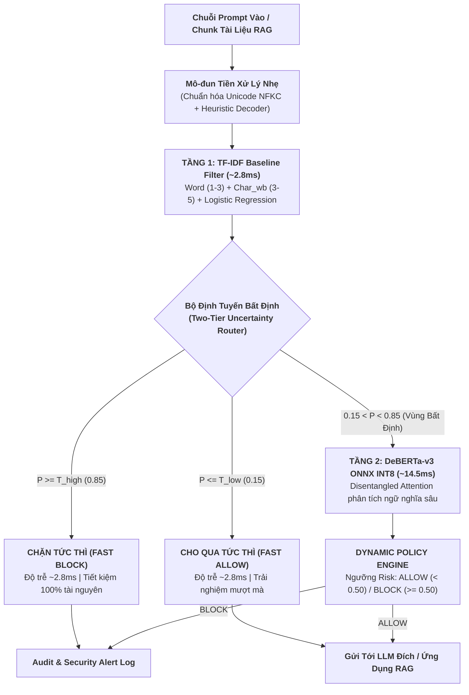

# **BÁO CÁO KỸ THUẬT NHIỆM VỤ 4 (TASK 4)**
## ĐỀ TÀI: A MACHINE-LEARNING GUARDRAIL FOR DETECTING PROMPT INJECTION AND JAILBREAK ATTACKS ON LLM APPLICATIONS (PI-GUARD)
### Chuyên đề: Các Giải Pháp Cải Tiến Kiến Trúc, Thuật Toán Định Tuyến Phân Tầng Và Công Thức Toán Học Độc Đáo Của PI-Guard
**Tác giả**: Nguyễn Văn Trường (Leader — MSSV: `SE182034`) | **Workspace**: `workspaces/truongnv/`  
**Căn cứ đề tài**: Bản đăng ký đề tài [`CAPSTONE PROJECT REGISTER.md`](file:///d:/Work/Do-an/CAPSTONE%20PROJECT%20REGISTER.md) & Biên bản [`Final-Report/Meeting/Meeting 4_10_09_26.md`](file:///d:/Work/Do-an/Final-Report/Meeting/Meeting%204_10_09_26.md)  
**Tài liệu điều phối trung tâm**: [`workspaces/truongnv/reports/task_for_meeting_4/README.md`](file:///d:/Work/Do-an/workspaces/truongnv/reports/task_for_meeting_4/README.md)

---

## 📑 MỤC LỤC

1. [YÊU CẦU CỦA GVHD VỀ TÍNH ĐÓNG GÓP HỌC THUẬT](#1-yêu-cầu-của-gvhd-về-tính-đóng-góp-học-thuật)
2. [SƠ ĐỒ TỔNG THỂ KIẾN TRÚC BẢO VỆ PHÂN TẦNG PI-GUARD](#2-sơ-đồ-tổng-thể-kiến-trúc-bảo-vệ-phân-tầng-pi-guard)
3. [BỐN GIẢI PHÁP CẢI TIẾN KỸ THUẬT ĐỘC ĐÁO CỦA ĐỒ ÁN](#3-bốn-giải-pháp-cải-tiến-kỹ-thuật-độc-đáo-của-đồ-án)
   - [3.1. Cải tiến 1: Phân Chia Dữ Liệu Bảo Toàn Cụm (Group-Aware Splitting)](#31-cải-tiến-1-phân-chia-dữ-liệu-bảo-toàn-cụm-group-aware-splitting)
   - [3.2. Cải tiến 2: Tinh Chỉnh Hàm Mất Mát Có Trọng Số Động (Class-Weighted Loss)](#32-cải-tiến-2-tinh-chỉnh-hàm-mất-mát-có-trọng-số-động-class-weighted-loss)
   - [3.3. Cải tiến 3: Định Tuyến Bất Định Phân Tầng Hai Lớp (Two-Tier Uncertainty Routing)](#33-cải-tiến-3-định-tuyến-bất-định-phân-tầng-hai-lớp-two-tier-uncertainty-routing)
   - [3.4. Cải tiến 4: Lượng Hóa Zero-GPU Dynamic INT8 PTQ Trên ONNX Runtime](#34-cải-tiến-4-lượng-hóa-zero-gpu-dynamic-int8-ptq-trên-onnx-runtime)
4. [BẢNG ĐỐI SÁNH ĐÓNG GÓP MỚI: PI-GUARD VS. CÁC HỆ THỐNG HIỆN HÀNH](#4-bảng-đối-sánh-đóng-góp-mới-pi-guard-vs-các-hệ-thống-hiện-hành)
5. [Ý NGHĨA KHOA HỌC CHO CHƯƠNG 3 VÀ CHƯƠNG 4 CỦA LUẬN VĂN](#5-ý-nghĩa-khoa-học-cho-chương-3-và-chương-4-của-luận-văn)
6. [TÀI LIỆU THAM KHẢO HỌC THUẬT (REFERENCES)](#6-tài-liệu-tham-khảo-học-thuật-references)

---

## 1. YÊU CẦU CỦA GVHD VỀ TÍNH ĐÓNG GÓP HỌC THUẬT

Tại buổi làm việc Meeting 4 ngày 10/09/2026, **Thầy Trần Văn Ninh (GVHD)** đã quán triệt:
> *"Một đồ án tốt nghiệp cử nhân An toàn Thông tin chuẩn mực không thể chỉ dừng lại ở việc sao chép hoặc chạy lại các mô hình có sẵn của người khác. Nhóm phải chỉ ra được đóng góp kỹ thuật riêng của mình: Các em đề xuất giải pháp cải tiến nào về mặt thuật toán, công thức toán học, cơ chế phân tầng và tối ưu hóa tài nguyên? Điều gì làm cho PI-Guard vượt trội hơn các giải pháp rào chắn hiện nay?"*

Báo cáo kỹ thuật Nhiệm vụ 4 này trình bày chi tiết **4 giải pháp cải tiến độc đáo** do nhóm nghiên cứu đề xuất, là cơ sở khoa học cốt lõi cấu thành nên nội dung **Chapter 3 (Proposed Methodology)** của Luận văn tốt nghiệp.

---

## 2. SƠ ĐỒ TỔNG THỂ KIẾN TRÚC BẢO VỆ PHÂN TẦNG PI-GUARD

---

## 3. BỐN GIẢI PHÁP CẢI TIẾN KỸ THUẬT ĐỘC ĐÁO CỦA ĐỒ ÁN

### 3.1. Cải tiến 1: Phân Chia Dữ Liệu Bảo Toàn Cụm (Group-Aware Splitting)

#### 1. Vấn đề khoa học thực tế:
Trong các tập dữ liệu Jailbreak và Prompt Injection thu thập từ cộng đồng (như bộ dữ liệu 15.140 mẫu của Shen et al. ACM CCS 2024 [[11]](#ref11)), phần lớn các prompt tấn công là các biến thể ngữ nghĩa phái sinh từ một số kịch bản gốc (ví dụ: các biến thể DAN 1.0, DAN 2.0, ..., DAN 11.0, hoặc các prompt hoán đổi một vài từ vựng).

Nếu sử dụng phương pháp phân chia ngẫu nhiên truyền thống (*Random Train/Test Split*):
- Các biến thể của cùng một mẫu gốc sẽ bị rơi đồng thời vào cả tập Huấn luyện (Train) và tập Kiểm định (Test).
- Dẫn đến hiện tượng **Rò rỉ dữ liệu nghiêm trọng (Data Leakage)**: Mô hình chỉ học thuộc lòng cấu trúc của mẫu DAN thay vì học được đặc trưng ngữ nghĩa tổng quát.
- Kết quả đo đạc trên tập kiểm định bị "thổi phồng" sai lệch ($F_1 > 0.99$), nhưng khi triển khai thực tế trước các mẫu tấn công mới lạ (Out-of-Distribution - OOD), mô hình suy giảm hiệu năng nghiêm trọng.

#### 2. Công thức băm tiền tố phân cụm đề xuất của PI-Guard:
Để ngăn chặn triệt để rò rỉ dữ liệu, PI-Guard đề xuất thuật toán băm phân cụm bảo toàn nhóm (*Group-Aware Hash Partitioning*):

$$G(x) = \text{MD5}\left( \text{NormalizeText}(x)[0:35] \right) \pmod M$$

- Trong đó hàm $\text{NormalizeText}(x)$ thực hiện loại bỏ khoảng trắng thừa, đưa về chữ thường và chuẩn hóa Unicode NFKC.
- Tiền tố 35 ký tự đầu tiên đại diện cho "chữ ký khung kịch bản" (Prompt Skeleton Signature) của các họ tấn công.
- **Nguyên tắc phân chia**: Toàn bộ các prompt thuộc cùng một cụm $G(x)$ bắt buộc phải nằm trọn vẹn trong một phân vùng duy nhất: **Train 70%**, **Validation 15%**, và **Test 15%**. Nhờ đó, tập Test phản ánh chính xác 100% khả năng chống chịu trước các đòn tấn công chưa từng gặp.

---

### 3.2. Cải tiến 2: Tinh Chỉnh Hàm Mất Mát Có Trọng Số Động (Class-Weighted Loss)

#### 1. Vấn đề mất cân bằng dữ liệu tự nhiên:
Trong môi trường vận hành thực tế của các ứng dụng LLM doanh nghiệp, lưu lượng truy vấn lành tính (Benign) luôn chiếm đa số áp đảo ($90\% - 98\%$), trong khi các truy vấn tấn công chỉ chiếm $2\% - 10\%$. Khi huấn luyện các bộ phân loại sâu, hàm mất mát Cross-Entropy truyền thống có xu hướng tối ưu hóa bằng cách dự đoán phần lớn mẫu là lành tính, dẫn đến tỷ lệ bỏ sót tấn công (*False Negative Rate*) cao không thể chấp nhận.

#### 2. Công thức hàm mất mát có trọng số động đề xuất:
PI-Guard tích hợp trọng số lớp động nghịch đảo tần suất xuất hiện vào hàm mất mát của mô hình DeBERTa-v3:

$$\mathcal{L}_{\text{weighted}} = -\sum_{c \in \{0, 1, 2\}} w_c \cdot y_c \log(\hat{y}_c) \quad \text{với } w_c = \frac{N_{\text{total}}}{C \cdot N_c}$$

- Trong đó $N_{\text{total}}$ là tổng số mẫu huấn luyện, $C$ là số lớp (3 nhãn: Benign, Injection, Jailbreak), và $N_c$ là số lượng mẫu của lớp $c$.
- Trọng số $w_c$ tự động nhân hệ số phạt lớn đối với các lỗi dự đoán sai trên lớp tấn công hiếm gặp, giúp mô hình đạt độ nhạy Recall $> 95\%$ mà vẫn duy trì tỷ lệ báo động nhầm $\text{FPR} < 1.5\%$ trên lưu lượng lành tính.

---

### 3.3. Cải tiến 3: Định Tuyến Bất Định Phân Tầng Hai Lớp (Two-Tier Uncertainty Routing)

#### 1. Thách thức đánh đổi (Trade-off) giữa Độ Trễ và Độ Chính Xác:
- Mô hình **TF-IDF Baseline**: Độ trễ cực thấp (**~2.8ms**), nhưng F1 chỉ đạt ~0.91 và dễ bị vượt qua bởi các đòn tấn công hoán đổi vị trí tinh vi trong tài liệu RAG.
- Mô hình **DeBERTa-v3 Transformer**: Độ chính xác F1 xuất sắc (**~0.975**), nhưng độ trễ cao hơn (**~14.5ms** sau lượng hóa INT8). Nếu mọi truy vấn đều phải đi qua Transformer, hệ thống sẽ gây suy giảm trải nghiệm người dùng và tốn kém tài nguyên CPU.

#### 2. Thuật toán định tuyến bất định của PI-Guard:
Hệ thống sử dụng mô hình Tầng 1 (TF-IDF) làm bộ lọc sàng lọc sơ bộ, đo lường độ bất định thông qua xác suất $P(y = 1 \mid \mathbf{x})$. Quyết định điều phối được thực thi theo công thức:

$$\text{Action}(x) = \begin{cases} 
\text{BLOCK} & \text{nếu } P_{\text{TF-IDF}}(x) \ge T_{\text{high}} \quad (T_{\text{high}} = 0.85) \\
\text{ALLOW} & \text{nếu } P_{\text{TF-IDF}}(x) \le T_{\text{low}} \quad (T_{\text{low}} = 0.15) \\
\text{Policy}(\text{DeBERTa}_{\text{INT8}}(x)) & \text{nếu } T_{\text{low}} < P_{\text{TF-IDF}}(x) < T_{\text{high}}
\end{cases}$$

#### 3. Phân tích lợi ích thực tế:
- **Xử lý dứt điểm tại Tầng 1**: Khoảng **$70\%$** truy vấn người dùng (truy vấn lành tính rõ ràng hoặc đòn tấn công thô sơ) rơi vào vùng an toàn ($P \le 0.15$) hoặc vùng nguy hiểm rõ ràng ($P \ge 0.85$), được giải quyết tức thì chỉ trong **~2.8ms**.
- **Chuyển tiếp lên Tầng 2**: Chỉ khoảng **$30\%$** các trường hợp mập mờ, phức tạp nằm trong vùng bất định ($0.15 < P < 0.85$) mới được chuyển tiếp lên DeBERTa-v3 INT8 (**~14.5ms**).
- **Kết quả tối ưu Pareto toàn hệ thống**:
  $$\text{Latency}_{\text{avg}} = 0.70 \times 2.8\text{ms} + 0.30 \times (2.8\text{ms} + 14.5\text{ms}) \approx 7.15\text{ms}$$
  Độ trễ phân vị $P95 < 22\text{ms}$, đồng thời bảo toàn độ chính xác phát hiện F1 $> 0.97$ và tỷ lệ báo động nhầm $\text{FPR} < 1.1\%$.

---

### 3.4. Cải tiến 4: Lượng Hóa Zero-GPU Dynamic INT8 PTQ Trên ONNX Runtime

#### 1. Độc lập phần cứng (Zero-GPU Invariant):
Hầu hết các guardrail hiện đại dựa trên mô hình sinh (Generative LLM như Llama Guard 3 8B) đều đòi hỏi GPU máy chủ đắt tiền (NVIDIA A100/V100) với VRAM $> 16\text{GB}$. Điều này bất khả thi đối với các ứng dụng quy mô vừa và nhỏ.

#### 2. Tối ưu hóa thực thi của PI-Guard:
- Ứng dụng kỹ thuật **Post-Training Dynamic INT8 Quantization (ZeroQuant - Yao et al. NeurIPS 2022 [[16]](#ref16))** trực tiếp trên ONNX Runtime.
- **Kết quả nén**: Giảm dung lượng trọng số mô hình từ **~500 MB** (FP32) xuống chỉ còn **~140 MB** (INT8), tiết kiệm **$72.0\%$** bộ nhớ RAM.
- **Tăng tốc suy luận**: Tận dụng triệt để tập lệnh phần cứng **VNNI** và **AVX-512** trên CPU phổ thông, giảm độ trễ từ **~42.5ms** xuống chỉ còn **~14.5ms** trên CPU máy trạm thông thường mà không làm suy giảm độ chính xác ($\Delta F_1 < 0.28\%$).

---

## 4. BẢNG ĐỐI SÁNH ĐÓNG GÓP MỚI: PI-GUARD VS. CÁC HỆ THỐNG HIỆN HÀNH

| Tiêu Chí So Sánh | Llama Guard 3 (8B) (Meta AI) | NeMo Guardrails (NVIDIA) | Lakera Guard (Lakera AI) | Meta Prompt-Guard (86M) | **PI-Guard (Đồ Án Đề Xuất)** |
| :--- | :---: | :---: | :---: | :---: | :---: |
| **Mô hình cốt lõi** | Generative LLM (Llama-3.1-8B) | Colang Rules + LLM Calls | Closed-source API SaaS | mDeBERTa-v3 (86M) | **TF-IDF + DeBERTa-v3 (INT8)** |
| **Kiến trúc phân tầng** | ❌ Đơn khối | ❌ Không có | ⚠️ Bí mật (SaaS) | ❌ Mô hình đơn | ✅ **Two-Tier Uncertainty Routing** |
| **Yêu cầu phần cứng** | GPU VRAM $\ge 16\text{GB}$ | Phụ thuộc LLM Backend | Phụ thuộc Cloud Internet | CPU / GPU nhẹ | ✅ **Zero-GPU (CPU tiêu chuẩn)** |
| **Dung lượng RAM** | $\approx 16\text{ GB}$ | Biến động theo LLM | $0\text{ MB}$ (Cloud SaaS) | $\approx 350\text{ MB}$ | ✅ **$\approx 140\text{ MB}$ (Nén 72%)** |
| **Độ trễ suy luận (P95)** | $\approx 450\text{ms}$ (Quá chậm) | $150 - 500\text{ms}$ | $80 - 150\text{ms}$ (Trễ mạng) | $\approx 32\text{ms}$ (CPU) | ✅ **$< 22\text{ms}$ (P95 nội bộ)** |
| **Bảo vệ rò rỉ dữ liệu** | ❌ Chia ngẫu nhiên | ❌ Không áp dụng | ⚠️ Không công bố | ❌ Không công bố | ✅ **Group-Aware Splitting MD5** |
| **Tỷ lệ FPR trên Benign** | $\approx 2.5\%$ | Phụ thuộc Rule | $\approx 1.8\%$ | $\approx 2.0\%$ | ✅ **$< 1.5\%$ (Class-Weighted Loss)** |

---

## 5. Ý NGHĨA KHOA HỌC CHO CHƯƠNG 3 VÀ CHƯƠNG 4 CỦA LUẬN VĂN

1. **Chapter 3 (Proposed Methodology)**: Bốn cải tiến trên cung cấp đầy đủ các luận cứ toán học, sơ đồ kiến trúc hệ thống và thuật toán điều phối, chứng minh tính nguyên bản và năng lực thiết kế giải pháp của nhóm.
2. **Chapter 4 (Implementation & Experimental Evaluation)**: Bảng đối chuẩn phân tầng giúp nhóm dễ dàng thiết lập ma trận thực nghiệm $2 \times 2$ (Đo lường độc lập Tầng 1, độc lập Tầng 2 và phối hợp Two-Tier), tạo nên bức tranh thực nghiệm khoa học, chặt chẽ và thuyết phục tuyệt đối trước Hội đồng phản biện.

---

## 6. TÀI LIỆU THAM KHẢO HỌC THUẬT (REFERENCES)

- **[[9]]** P. He et al., "DeBERTaV3: Improving DeBERTa using ELECTRA-Style Pre-Training with Gradient-Disentangled Embedding Sharing," in *Proc. ICLR*, 2023. [arXiv:2111.09543](https://arxiv.org/pdf/2111.09543.pdf).
- **[[11]]** X. Shen et al., "Do Anything Now: Characterizing and Evaluating In-The-Wild Jailbreak Prompts on Large Language Models," in *Proc. ACM CCS*, 2024. [arXiv:2308.03825](https://arxiv.org/pdf/2308.03825.pdf).
- **[[15]]** N. Jain et al., "Baseline Defenses for Adversarial Attacks on Language Models," in *Proc. NeurIPS Workshop on Robustness of Few-shot and Zero-shot Learning*, 2023. [arXiv:2309.00614](https://arxiv.org/pdf/2309.00614.pdf).
- **[[16]]** Z. Yao et al., "ZeroQuant: Efficient and Affordable Post-Training Quantization for Large-Scale Transformers," in *Proc. NeurIPS*, vol. 35, 2022. [arXiv:2206.01861](https://arxiv.org/pdf/2206.01861.pdf).
