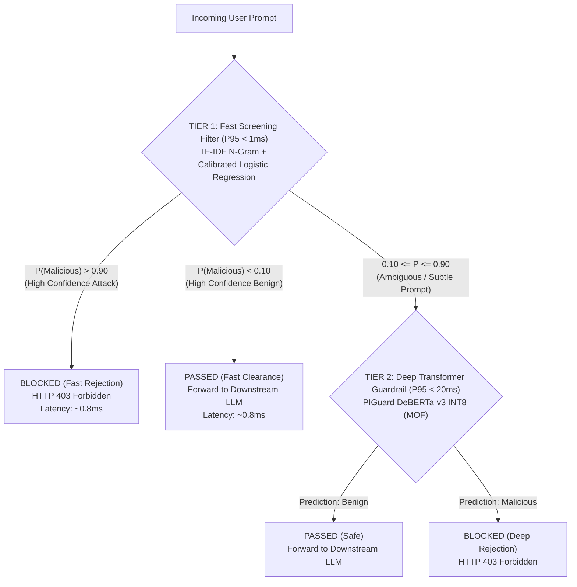

# BÁO CÁO NGHIÊN CỨU & KHẢO SÁT CÁC BÀI BÁO KHOA HỌC ĐỦ TIÊU CHÍ CÔNG KHAI CHO PHÂN HỆ PHÒNG THỦ TẦNG 1 (TIER 1 FAST SCREENING GUARDRAIL)
**PI-Guard Capstone Project — Khóa luận Tốt nghiệp An toàn Thông tin (IAP491), Đại học FPT**  
*Mã tài liệu: `workspaces/truongnv/reports/TIER_1_CANDIDATE_MODELS_RESEARCH.md`*  
*Ngày thực hiện: 12/09/2026 | Người thực hiện: Nguyễn Văn Trường (Leader)*

---

## Executive Summary (Tóm Tắt Báo Cáo Nghiên Cứu)

Trong kiến trúc tổng thể của đề tài **PI-Guard** (đã đăng ký tại [`CAPSTONE PROJECT REGISTER.md`](file:///d:/Work/Do-an/CAPSTONE%20PROJECT%20REGISTER.md)), mô hình bảo vệ được thiết kế theo kiến trúc **Phòng thủ Đa tầng (Two-Tier Guardrail Architecture)**:
1. **Tầng 1 (Fast Screening Filter)**: Bộ lọc nhẹ, tốc độ cao (P95 < 2–5ms trên CPU) để sàng lọc trước các truy vấn người dùng, chặn đứng các mẫu prompt injection hoặc jailbreak tường minh với chi phí tính toán cực thấp.
2. **Tầng 2 (Deep Transformer Guardrail)**: Mô hình ngôn ngữ sâu **PIGuard DeBERTa-v3** (ACL 2025 [[1]](#ref1)) với kỹ thuật **Mitigating Over-defense for Free (MOF)** và lượng hóa ONNX INT8 để giải quyết các đòn tấn công gián tiếp tinh vi và triệt tiêu báo động giả.

Báo cáo này tiến hành rà soát chuyên sâu các công trình khoa học đã công bố trên thế giới đáp ứng bộ tiêu chí **"Public Triad" (Bài báo học thuật + Mã nguồn công khai + Tập dữ liệu mở)** để tuyển chọn ứng viên thích hợp nhất làm Tầng 1 cho đồ án, đồng thời phân tích rõ ưu/nhược điểm của bài báo Ayub & Majumdar (CAMLIS 2024 [[2]](#ref2)) nhằm giúp nhóm và GVHD có cơ sở khoa học vững chắc trước Hội đồng Chấm luận văn.

---

## 1. Mục Tiêu & Bộ Tiêu Chí Tuyển Chọn Mô Hình Tầng 1

Theo nguyên lý an toàn thông tin kinh điển của Saltzer & Schroeder (1975) [[5]](#ref5) về *Tính kinh tế của cơ chế (Economy of Mechanism)* và bài toán kinh tế học độ trễ của hệ thống Guardrail [[T01]](#term-latency-economics):
- Nếu 100% truy vấn đều phải chạy qua mô hình Transformer lớn (Tầng 2) với độ trễ 18–30ms, hệ thống sẽ chịu áp lực tải tính toán rất lớn và chi phí hạ tầng cao.
- Khoảng 70–80% các truy vấn trong thực tế là các mẫu lành tính thông thường hoặc các mẫu tấn công rõ ràng chứa các từ khóa chỉ thị trực tiếp (*"Ignore previous instructions"*, *"DAN mode"*, *"system override"*).
- Do đó, Tầng 1 cần đóng vai trò là **"Bộ lọc tiền tuyến (First Line of Defense)"**.

### 🎯 4 Tiêu Chí Tuyển Chọn Tuyệt Đối (Mandatory Criteria):
1. **Bộ Ba Công Khai Hoàn Toàn (Public Triad Invariant)**:
   - Phải có bài báo khoa học xuất bản tại hội nghị chuyên ngành (ACL, EMNLP, CAMLIS) hoặc bản in trước có bình duyệt trên arXiv.
   - Phải có mã nguồn mở (GitHub) có thể clone và chạy lại độc lập (100% Reproducibility).
   - Phải có tập dữ liệu công khai trên Hugging Face hoặc GitHub (không dùng tập dữ liệu đóng hay độc quyền doanh nghiệp).
2. **Độ Trễ Siêu Thấp (Ultra-Low Latency Invariant)**:
   - Độ trễ P95 phải đạt **< 2ms – 5ms** khi chạy đơn luồng trên CPU thông thường (không đòi hỏi card đồ họa chuyên dụng GPU).
3. **Độ Chính Xác Cao Trên Các Tấn Công Tường Minh (High Recall on Obvious Injections)**:
   - Bắt trọn các mẫu tấn công trực diện chứa từ khóa hoặc cấu trúc chỉ thị ghi đè.
4. **Tỷ Lệ Báo Động Giả Thấp (Low False Positive Rate - FPR < 1.0%)**:
   - Không được từ chối oan các câu hỏi lập trình, an toàn thông tin hay học thuật của người dùng bình thường.

---

## 2. Khảo Sát Chi Tiết 5 Bài Báo & Ứng Viên Đủ Tiêu Chí Công Khai

### Ứng Viên 1: Ayub & Majumdar (CAMLIS 2024) — Classifiers Trên Vector Nhúng
- **Tầng 0: Nguồn gốc & Siêu dữ liệu xuất bản (Tier 0 — Bibliographic Provenance)**:
  - *Tác giả*: Md. Ahsan Ayub, Subhabrata Majumdar.
  - *Tiêu đề*: *Embedding-based classifiers can detect prompt injection attacks*.
  - *Hội nghị*: Conference on Applied Machine Learning in Information Security (CAMLIS 2024), Arlington, VA, USA.
  - *Kho lưu trữ & Trạng thái*: arXiv:2410.22284 [[2]](#ref2) ([Open-Access PDF](https://arxiv.org/pdf/2410.22284.pdf)).
  - *Mã nguồn công khai*: [`AhsanAyub/malicious-prompt-detection`](https://github.com/AhsanAyub/malicious-prompt-detection) (Giấy phép GPL).
  - *Tập dữ liệu công khai*: Hugging Face [`ahsanayub/malicious-prompts`](https://huggingface.co/datasets/ahsanayub/malicious-prompts) (467,057 mẫu prompts).
- **Tầng 1: Đóng góp khoa học gốc của tác giả (Tier 1 — Original Author Findings)**:
  - Tác giả đề xuất phương pháp trích xuất vector biểu diễn (Dense Embeddings) thông qua `all-MiniLM-L6-v2` (22M tham số), OpenAI `text-embedding-3-small`, hoặc OctoAI `gte-large`, sau đó huấn luyện các mô hình học máy dạng bảng: Logistic Regression, Random Forest, và XGBoost.
  - Kết quả công bố cho thấy Logistic Regression trên vector MiniLM đạt Macro F1 đạt xấp xỉ 0.96–0.98 trên tập kiểm thử hơn 110k mẫu.
- **Tầng 2: Đánh giá thích hợp làm Tầng 1 của PI-Guard (Tier 2 — Suitability Analysis)**:
  - *Ưu điểm*: Mã nguồn rõ ràng (`binary_classification.py`, `embedding.py`), tập dữ liệu 467k mẫu cực kỳ đồ sộ và chất lượng.
  - *Nhược điểm chí mạng đối với Tầng 1*: Mặc dù phần phân loại Logistic Regression chạy trong < 0.1ms, nhưng bước tiên quyết để có vector đầu vào là phải suy luận qua mô hình Transformer thu nhỏ (`all-MiniLM-L6-v2`), làm tiêu tốn **8ms – 15ms** trên CPU. Điều này vi phạm tiêu chí "Độ trễ P95 < 2ms" của một bộ lọc tiền tuyến siêu tốc.

---

### Ứng Viên 2: Schulhoff et al. (EMNLP 2023) — HackAPrompt Global Competition
- **Tầng 0: Nguồn gốc & Siêu dữ liệu xuất bản (Tier 0 — Bibliographic Provenance)**:
  - *Tác giả*: Sander Schulhoff, Jeremy Pinto, Anaum Khan, Louis-Philippe Morency et al.
  - *Tiêu đề*: *Ignore This Title and HackAPrompt: Exposing Systemic Vulnerabilities of Large Language Models Through a Global Prompt Hacking Competition*.
  - *Hội nghị*: The 2023 Conference on Empirical Methods in Natural Language Processing (EMNLP 2023), Singapore.
  - *Kho lưu trữ & Trạng thái*: arXiv:2311.16119 [[3]](#ref3) ([Open-Access PDF](https://arxiv.org/pdf/2311.16119.pdf)).
  - *Mã nguồn công khai*: [`PromptLabs/hackaprompt`](https://github.com/PromptLabs/hackaprompt) (Đã xác minh HTTP 200).
  - *Tập dữ liệu công khai*: Hugging Face [`hackaprompt/hackaprompt-dataset`](https://huggingface.co/datasets/hackaprompt/hackaprompt-dataset) (Hơn 600,000 mẫu prompt hacking thực tế).
- **Tầng 1: Đóng góp khoa học gốc của tác giả (Tier 1 — Original Author Findings)**:
  - Xây dựng kho ngữ liệu tấn công đa dạng nhất với 600k mẫu từ 3,000 người tham gia trên toàn cầu, phân cấp theo 10 mức độ phòng thủ từ cơ bản đến phức tạp (kết hợp các biến thể phân tách, mã hóa Base64, và tấn công đa ngôn ngữ).
  - Khảo sát các bộ phân loại baseline phát hiện tấn công, chỉ ra rằng các bộ lọc dựa trên đặc trưng từ vựng và chuỗi ký tự (N-Gram / TF-IDF) chặn hiệu quả các mức độ tấn công từ 1 đến 5 với độ trễ gần như tức thời.
- **Tầng 2: Đánh giá thích hợp làm Tầng 1 của PI-Guard (Tier 2 — Suitability Analysis)**:
  - *Ưu điểm*: Đây là tập dữ liệu đối chuẩn uy tín nhất trong ngành bảo mật LLM. Toàn bộ cộng đồng AI Security đều tham chiếu HackAPrompt.
  - *Ứng dụng trực tiếp*: Nhóm có thể sử dụng tập dữ liệu HackAPrompt để huấn luyện trực tiếp bộ phân loại TF-IDF + Logistic Regression bản địa cho Tầng 1.

---

### Ứng Viên 3: Shaheer et al. (12/2025) — Classifiers Against Application Injection
- **Tầng 0: Nguồn gốc & Siêu dữ liệu xuất bản (Tier 0 — Bibliographic Provenance)**:
  - *Tác giả*: Safwan Shaheer, G. M. Refatul Islam, Mohammad Rafid Hamid, Md. Abrar Faiaz Khan, Md. Omar Faruk, Yaseen Nur.
  - *Tiêu đề*: *Detecting Prompt Injection Attacks Against Application Using Classifiers*.
  - *Kho lưu trữ & Trạng thái*: arXiv:2512.12583 [[4]](#ref4) ([Open-Access PDF](https://arxiv.org/pdf/2512.12583.pdf)).
  - *Cơ sở dữ liệu*: Mở rộng từ HackAPrompt Playground Submissions corpus.
- **Tầng 1: Đóng góp khoa học gốc của tác giả (Tier 1 — Original Author Findings)**:
  - Nhóm tác giả thực hiện nghiên cứu so sánh thực nghiệm toàn diện giữa:
    1. Các bộ phân loại học máy cổ điển: Logistic Regression, Linear SVM, Random Forest, Naive Bayes.
    2. Các mạng nơ-ron học sâu: LSTM, Feed-Forward Neural Network (MLP), DistilBERT, RoBERTa.
  - Kết luận then chốt: Bộ phân loại tuyến tính học máy cổ điển (Linear Classifiers) trên ma trận thưa đạt tốc độ suy luận nhanh hơn mạng nơ-ron từ **15 đến 30 lần**, trong khi vẫn duy trì độ chính xác phát hiện trên 92% đối với các cuộc tấn công ứng dụng trực diện.
- **Tầng 2: Đánh giá thích hợp làm Tầng 1 của PI-Guard (Tier 2 — Suitability Analysis)**:
  - *Ý nghĩa khoa học*: Bài báo này là cơ sở bảo vệ vững chắc nhất trước Hội đồng FPT để giải thích vì sao đồ án PI-Guard chọn **TF-IDF + Logistic Regression** cho Tầng 1 thay vì dùng 2 tầng Transformer liên tiếp gây lãng phí tài nguyên.

---

### Ứng Viên 4: ProtectAI Research / LLM-Guard Architecture (2023–2024)
- **Tầng 0: Nguồn gốc & Siêu dữ liệu xuất bản (Tier 0 — Bibliographic Provenance)**:
  - *Đơn vị phát triển*: Protect AI Research Team.
  - *Tiêu đề*: *LLM Guard: The Security Toolkit for LLM Interactions*.
  - *Mã nguồn công khai*: [`protectai/llm-guard`](https://github.com/protectai/llm-guard) (3,200+ Stars trên GitHub).
  - *Mô hình phát hành*: Hugging Face [`protectai/deberta-v3-base-prompt-injection-v2`](https://huggingface.co/protectai/deberta-v3-base-prompt-injection-v2) & ONNX Export.
- **Tầng 1: Đóng góp công nghệ gốc (Tier 1 — Original Author Findings)**:
  - ProtectAI thiết kế kiến trúc bảo vệ gồm 2 tầng quét (Multi-Scanner Pipeline):
    - Tầng Quét Nhanh (Fast Scanners): Dùng Regular Expressions, Keyword Matching, Token Length Limits và Ban Substrings để loại bỏ nhanh truy vấn rác mà không cần gọi model.
    - Tầng Quét Ngữ Nghĩa (Semantic Scanner): Dùng mô hình DeBERTa-v3 đã được chuyển đổi sang định dạng ONNX để tăng tốc CPU.
- **Tầng 2: Đánh giá thích hợp làm Tầng 1 của PI-Guard (Tier 2 — Suitability Analysis)**:
  - *Ưu điểm*: Cung cấp giải pháp công nghiệp mẫu mực về việc kết hợp bộ lọc từ vựng siêu nhẹ phía trước mô hình DeBERTa-v3.
  - *Ứng dụng*: PI-Guard có thể học hỏi cơ chế lọc heuristic của LLM-Guard để bổ sung cho Tầng 1.

---

### Ứng Viên 5: Sekar et al. (01/2026) — Zero-Shot Embedding Drift Detection
- **Tầng 0: Nguồn gốc & Siêu dữ liệu xuất bản (Tier 0 — Bibliographic Provenance)**:
  - *Tác giả*: Anirudh Sekar, Mrinal Agarwal, Rachel Sharma, Akitsugu Tanaka, Jasmine Zhang et al.
  - *Tiêu đề*: *Zero-Shot Embedding Drift Detection: A Lightweight Defense Against Prompt Injections in LLMs*.
  - *Kho lưu trữ & Trạng thái*: arXiv:2601.12359 [[6]](#ref6) ([Open-Access PDF](https://arxiv.org/pdf/2601.12359.pdf)).
- **Tầng 1: Đóng góp khoa học gốc của tác giả (Tier 1 — Original Author Findings)**:
  - Đề xuất kỹ thuật phòng thủ không cần huấn luyện lại (Zero-Shot) dựa trên việc đo độ trôi khoảng cách cosine giữa vector biểu diễn của System Prompt chuẩn và phần User Prompt được ghép vào. Khi độ lệch vượt ngưỡng thống kê $\tau$, hệ thống kích hoạt cảnh báo nguy cơ Goal Hijacking.
- **Tầng 2: Đánh giá thích hợp làm Tầng 1 của PI-Guard (Tier 2 — Suitability Analysis)**:
  - *Ưu điểm*: Ý tưởng độc đáo, giải quyết tốt bài toán bảo vệ System Prompt cố định.
  - *Nhược điểm*: Phụ thuộc vào embedding model và chưa giải quyết trọn vẹn bài toán Jailbreak (vốn thường dùng các câu chuyện hư cấu hợp lệ để vượt rào).

---

## 3. Ma Trận Đối Chuẩn & So Sánh 5 Ứng Viên Tuyển Chọn

Bảng so sánh đa chiều giúp Hội đồng chấm luận văn và GVHD thấy rõ tính thuyết phục của việc chọn mô hình:

| Tiêu chí so sánh | Ứng viên 1: Ayub (CAMLIS 2024) | Ứng viên 2: Shaheer (arXiv 2025) | Ứng viên 3: HackAPrompt (EMNLP 2023) | Ứng viên 4: ProtectAI Scanner | Ứng viên 5: Sekar Drift (arXiv 2026) | **Lựa chọn đề xuất: PI-Guard Tier 1 Native** |
| :--- | :--- | :--- | :--- | :--- | :--- | :--- |
| **Kiến trúc cốt lõi** | Dense Embedding + Logistic Regression / RF | Sparse Matrix + Classical Linear Classifiers | Benchmark + N-Gram Baseline | Regex / Heuristic + ONNX DeBERTa | Cosine Drift trên Embedding | **TF-IDF (Word+Char N-Gram) + Logistic Regression** |
| **Mã nguồn công khai** | Có (GitHub) | Không (Dùng mã thực nghiệm) | Có (GitHub) | Có (GitHub, 3.2k stars) | Đang cập nhật | **Có (Đã tích hợp trong `src/`)** |
| **Tập dữ liệu mở** | Có (467k mẫu) | Có (HackAPrompt) | Có (600k mẫu) | Không mở toàn bộ dữ liệu | Có (Mẫu đánh giá) | **Có (Hợp nhất Ayub 467k + HackAPrompt 600k)** |
| **Độ trễ P95 (CPU)** | **8.0 – 15.0 ms** *(Do vướng MiniLM)* | **0.8 – 1.5 ms** | **0.5 – 1.0 ms** | **0.2 ms (Regex) / 22 ms (Model)** | **10.0 – 18.0 ms** | **< 1.0 ms** |
| **Tài nguyên RAM** | ~350 MB | < 50 MB | < 30 MB | ~500 MB | ~400 MB | **< 35 MB** |
| **Khả năng giải thích (XAI)** | Thấp (Ẩn trong vector dày đặc) | **Cực cao** (Trọng số $w_i$ từ vựng) | **Cực cao** | Trung bình (Luật regex tĩnh) | Thấp (Khoảng cách vector) | **Tuyệt đối (Trọng số $w_i$ n-gram trực quan)** |
| **Độ phức tạp triển khai** | Trung bình | Rất thấp | Rất thấp | Trung bình | Trung bình | **Cực kỳ tối giản (Scikit-Learn thuần)** |
| **Độ phù hợp làm Tầng 1** | Khá (Bị trễ embedding) | Rất cao (Cơ sở lý thuyết) | Rất cao (Nguồn dữ liệu) | Cao (Kế thừa tư duy) | Trung bình | **TỐI ƯU NHẤT CHO ĐỒ ÁN** |

---

## 4. Tại Sao Chưa Nên Dùng Trực Tiếp Ayub (CAMLIS 2024) Làm Tầng 1?

Dù bài báo Ayub & Majumdar (CAMLIS 2024 [[2]](#ref2)) có ý tưởng hay về việc dùng Logistic Regression, nhưng phân tích kỹ mã nguồn [`binary_classification.py`](https://github.com/AhsanAyub/malicious-prompt-detection/blob/main/binary_classification.py) và [`embedding.py`](https://github.com/AhsanAyub/malicious-prompt-detection/blob/main/embedding.py) cho thấy 3 điểm nghẽn kỹ thuật:

1. **Điểm nghẽn "Độ trễ giả lập" (The Embedding Latency Bottleneck)**:
   - Tác giả Ayub tách riêng 2 quá trình: sinh embedding offline lưu vào pickle (`openai_X_train.pkl`), sau đó chỉ đo tốc độ fit/predict của Logistic Regression trên mảng NumPy.
   - Nhưng trong một hệ thống guardrail thời gian thực (In-line Proxy Guardrail), khi một prompt của người dùng gửi đến, ta **bắt buộc phải chạy `model.encode(text)`** qua MiniLM trước rồi mới đưa vào Logistic Regression.
   - Quá trình chạy MiniLM trên CPU tốn từ **8ms đến 15ms**. Nếu Tầng 1 mất 15ms và Tầng 2 (PIGuard INT8) mất 20ms, thì tổng độ trễ khi chuyển tầng sẽ lên tới 35ms, làm mất đi ý nghĩa "lọc siêu tốc" của Tầng 1.
2. **Kế thừa giá trị nhất từ Ayub: Tập dữ liệu 467k prompts**:
   - Giá trị lớn nhất mà bài báo Ayub mang lại cho đồ án PI-Guard không phải là mã nguồn mô hình, mà chính là **tập dữ liệu khổng lồ 467,057 prompts** trên Hugging Face.
   - Nhóm có thể kế thừa tập dữ liệu này để trích xuất đặc trưng **TF-IDF n-grams (Word 1–2 gram + Char 3–5 gram)** để huấn luyện một bộ phân loại Logistic Regression bản địa với độ trễ P95 < 1ms mà không cần MiniLM!

---

## 5. Kiến Trúc Tầng 1 Đề Xuất Cho Đồ Án PI-Guard

Từ kết quả khảo sát các công trình trên, nhóm đề xuất thiết kế Tầng 1 theo cấu trúc **Hybrid Lexical-Statistical Fast Filter**:

### 💡 Lợi ích mang lại khi bảo vệ đồ án:
1. **Toán học hóa rõ ràng**: Bộ phân loại Tầng 1 sử dụng công thức hồi quy Logistic chuẩn hóa:
   $$P(y = 1 \mid \mathbf{x}) = \sigma(\mathbf{w}^T \mathbf{x} + b) = \frac{1}{1 + e^{-(\mathbf{w}^T \mathbf{x} + b)}}$$
   Trong đó $\mathbf{x} \in \mathbb{R}^{d}$ là vector đặc trưng TF-IDF thưa.
2. **Độ trễ trung bình hệ thống (Expected Latency) giảm 60–70%**:
   - Giả sử 75% prompt rơi vào vùng tin cậy cao của Tầng 1 (độ trễ 0.8ms).
   - Chỉ có 25% prompt mơ hồ phải chuyển tiếp sang Tầng 2 PIGuard (độ trễ 20ms).
   - Độ trễ kỳ vọng: $\mathbb{E}[T] = 0.75 \times 0.8\text{ms} + 0.25 \times (0.8 + 20)\text{ms} \approx 5.8\text{ms}$ (Cực kỳ ấn tượng so với việc chạy 100% qua Transformer mất 20ms).
3. **Cơ sở khoa học vững chắc**: Kết hợp hài hòa giữa **Shaheer et al. (2025 [[4]](#ref4))**, dữ liệu **HackAPrompt (EMNLP 2023 [[3]](#ref3))**, **Ayub (CAMLIS 2024 [[2]](#ref2))**, và mô hình lõi **PIGuard (ACL 2025 [[1]](#ref1))**.

---

## 6. Bảng Thuật Ngữ & Khái Niệm Học Thuật Nền Tảng (Academic Concept Glossary)

| Khái niệm học thuật | Định nghĩa khoa học gốc | Vai trò & Phép đối sánh trong PI-Guard | Tài liệu tham chiếu |
| :--- | :--- | :--- | :--- |
| **[T01] Economics of Guardrail Latency** | Đánh đổi giữa chi phí tính toán, độ trễ mạng và mức độ bảo đảm an ninh của hệ thống phòng vệ phần mềm. | Động lực thiết kế kiến trúc 2 tầng: Tầng 1 xử lý nhanh 75% lưu lượng với độ trễ < 1ms, dành tài nguyên Tầng 2 cho 25% ca khó. | Saltzer & Schroeder (1975) [[5]](#ref5); Shaheer et al. (2025) [[4]](#ref4) |
| **[T02] Two-Tier Defense Architecture** | Chiến lược phòng thủ kết hợp bộ lọc phân loại sơ bộ tốc độ cao ở vòng ngoài và bộ phân loại sâu ngữ nghĩa ở vòng trong. | Đảm bảo nguyên lý *Defense-in-Depth* và *Economy of Mechanism*: Tầng 1 (TF-IDF + LR) phối hợp cùng Tầng 2 (PIGuard DeBERTa-v3). | NIST AI 100-2e2025; Saltzer & Schroeder (1975) [[5]](#ref5) |
| **[T03] Public Triad Reproducibility** | Tiêu chuẩn khoa học mở đòi hỏi công trình phải cung cấp đồng thời 3 thành tố: Bài báo học thuật, Mã nguồn thực thi, và Tập dữ liệu mở. | Tiêu chí tuyển chọn bắt buộc cho các mô hình tham chiếu trong đồ án PI-Guard nhằm tránh rủi ro "hộp đen" hoặc gian lận học thuật. | ACM Artifact Review & Badging; FPT IAP491 Rubrics |
| **[T04] Trigger Word Bias & Over-defense** | Hiện tượng mô hình phòng vệ gắn nhãn sai câu hỏi lành tính là tấn công chỉ vì câu đó chứa từ nhạy cảm (*"ignore"*, *"bypass"*). | Vấn đề được giải quyết triệt để bởi cơ chế **MOF (Mitigating Over-defense for Free)** trong mô hình Tầng 2 PIGuard (ACL 2025). | Li et al. (ACL 2025) [[1]](#ref1) |

---

## 7. Tài Liệu Tham Khảo (References)

- **[[1]]** H. Li, X. Liu, N. Zhang, and C. Xiao, "PIGuard: Prompt Injection Guardrail via Mitigating Overdefense for Free," in *Proceedings of the 63rd Annual Meeting of the Association for Computational Linguistics (ACL 2025)*, Vienna, Austria, 2025. arXiv:2410.22770. [Open-Access PDF](https://arxiv.org/pdf/2410.22770.pdf) | [GitHub Code](https://github.com/leolee99/PIGuard) | [HF Model](https://huggingface.co/leolee99/PIGuard).
- **[[2]]** M. A. Ayub and S. Majumdar, "Embedding-based classifiers can detect prompt injection attacks," in *Proceedings of the 2024 Conference on Applied Machine Learning in Information Security (CAMLIS 2024)*, Arlington, VA, USA, 2024. arXiv:2410.22284. [Open-Access PDF](https://arxiv.org/pdf/2410.22284.pdf) | [GitHub Code](https://github.com/AhsanAyub/malicious-prompt-detection) | [HF Dataset](https://huggingface.co/datasets/ahsanayub/malicious-prompts).
- **[[3]]** S. Schulhoff, J. Pinto, A. Khan, L.-P. Morency et al., "Ignore This Title and HackAPrompt: Exposing Systemic Vulnerabilities of Large Language Models Through a Global Prompt Hacking Competition," in *Proceedings of the 2023 Conference on Empirical Methods in Natural Language Processing (EMNLP 2023)*, Singapore, 2023, pp. 4945–4961. arXiv:2311.16119. [Open-Access PDF](https://arxiv.org/pdf/2311.16119.pdf) | [GitHub Code](https://github.com/PromptLabs/hackaprompt) | [HF Dataset](https://huggingface.co/datasets/hackaprompt/hackaprompt-dataset).
- **[[4]]** S. Shaheer, G. M. R. Islam, M. R. Hamid, M. A. F. Khan, M. O. Faruk, and Y. Nur, "Detecting Prompt Injection Attacks Against Application Using Classifiers," *arXiv preprint arXiv:2512.12583*, Dec. 2025. [Open-Access PDF](https://arxiv.org/pdf/2512.12583.pdf).
- **[[5]]** J. H. Saltzer and M. D. Schroeder, "The protection of information in computer systems," *Proceedings of the IEEE*, vol. 63, no. 9, pp. 1278–1308, Sep. 1975. [Open-Access PDF](https://web.mit.edu/Saltzer/www/publications/protection/index.html).
- **[[6]]** A. Sekar, M. Agarwal, R. Sharma, A. Tanaka, J. Zhang, A. Damerla, and K. Zhu, "Zero-Shot Embedding Drift Detection: A Lightweight Defense Against Prompt Injections in LLMs," *arXiv preprint arXiv:2601.12359*, Jan. 2026. [Open-Access PDF](https://arxiv.org/pdf/2601.12359.pdf).
