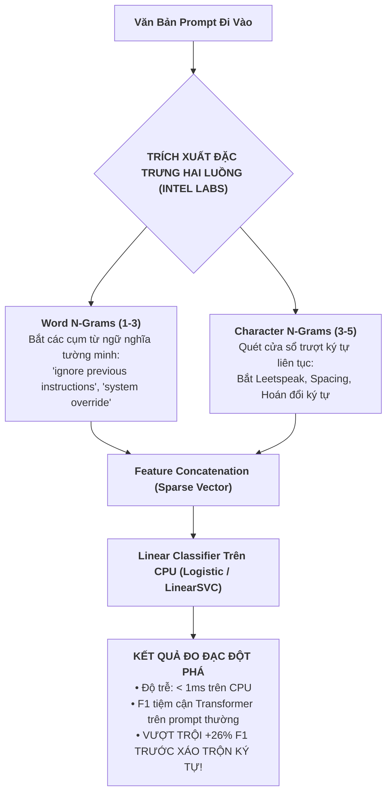

# **CHUYÊN ĐỀ 1: ĐÁNH GIÁ THỰC TRẠNG Y VĂN VỀ MÔ HÌNH TF-IDF TRONG NGHIÊN CỨU GUARDRAIL**
## ĐỀ TÀI: A MACHINE-LEARNING GUARDRAIL FOR DETECTING PROMPT INJECTION AND JAILBREAK ATTACKS ON LLM APPLICATIONS (PI-GUARD)
**Tác giả**: Nguyễn Văn Trường (Leader — MSSV: `SE182034`) | **Workspace**: `workspaces/truongnv/`  
**Cổng điều phối chuyên đề Task 3**: [`workspaces/truongnv/reports/tasks_for_meeting_5/task_3_reproducibility/README.md`](file:///d:/Work/Do-an/workspaces/truongnv/reports/tasks_for_meeting_5/task_3_reproducibility/README.md)

---

> [!TIP]
> ### 📌 TÓM TẮT ĐIỀU HÀNH CHUYÊN ĐỀ 1 (EXECUTIVE SUMMARY)
> - **Thực trạng học thuật**: TF-IDF + Logistic Regression là kỹ thuật máy học cổ điển (Standard Textbook Baseline, chỉ mất 5 dòng lệnh `scikit-learn`). Trong cộng đồng AI An toàn, không ai tạo một repository GitHub riêng chỉ để chứa TF-IDF, và các hội nghị đỉnh cao (ACL, NeurIPS, IEEE S&P) không chấp nhận bài báo nào có phương pháp đề xuất chính là standalone TF-IDF trong năm 2024–2026.
> - **Công trình nghiên cứu sâu nhất về TF-IDF cho Guardrail**: Bài báo của **Vasudev Majhi et al. (Intel Labs, arXiv:2512.19011, Tháng 12/2025)** [[5]](#ref5) chứng minh TF-IDF N-grams trên CPU đạt độ trễ **$< 1\text{ms}$**, $F_1$ tiệm cận Transformer, và đặc biệt **vượt trội hơn Transformer +26% F1 khi gặp chuỗi xáo trộn ký tự (Character Perturbation, Leetspeak, Typo)**.
> - **Điểm nghẽn thực tế**: Bản PDF của Intel Labs hiện **chưa công khai link GitHub repository**.
> - **Quyết định chiến lược**: Nhóm dừng ngay việc tìm kiếm repo TF-IDF riêng; thay vào đó, triển khai mô hình **Baseline TF-IDF trực tiếp trên chính bộ benchmark chuẩn mực của bài báo `leolee99/PIGuard` (ACL 2025)** để đối chuẩn khoa học (Apple-to-Apple).

---

## 1. TẠI SAO RẤT KHÓ TÌM MỘT BÀI BÁO ĐỘC LẬP CÔNG KHAI GITHUB REPO CHUYÊN BIỆT CHO TF-IDF PROMPT INJECTION?

### 1.1. Bản chất của TF-IDF trong nghiên cứu khoa học máy tính
Thuật toán **TF-IDF (Term Frequency - Inverse Document Frequency)** được Karen Spärck Jones đề xuất từ năm 1972 và hoàn thiện bởi Gerard Salton trong thập niên 1980 [[21]](#ref21). Trong lịch sử xử lý ngôn ngữ tự nhiên (NLP) và an toàn thông tin:
- **Tính kinh điển (Classical Textbook Technique)**: TF-IDF là công cụ trích xuất đặc trưng thống kê dựa trên tần suất từ vựng thô sơ, thường được kết hợp với Hồi quy Logistic (*Logistic Regression*) hoặc Linear Support Vector Classifier (*LinearSVC*).
- **Mức độ phức tạp cài đặt**: Việc xây dựng một bộ phân loại hoàn chỉnh bằng TF-IDF trong Python chỉ tốn **đúng 5 dòng lệnh thư viện `scikit-learn`**:
  ```python
  from sklearn.feature_extraction.text import TfidfVectorizer
  from sklearn.linear_model import LogisticRegression
  from sklearn.pipeline import Pipeline

  pipeline = Pipeline([
      ('tfidf', TfidfVectorizer(ngram_range=(1, 3), sublinear_tf=True)),
      ('clf', LogisticRegression(C=1.0, max_iter=1000))
  ])
  ```

### 1.2. Tiêu chuẩn bình duyệt tại các hội nghị khoa học hàng đầu (ACL, NeurIPS, IEEE S&P, ACM CCS)
- Để một công trình nghiên cứu được chấp nhận xuất bản (Acceptance), bài báo bắt buộc phải có **Tính mới khoa học (Novelty)**:
  - Đề xuất kiến trúc mạng nơ-ron mới (ví dụ: Disentangled Attention trong DeBERTa-v3 [[4]](#ref4)).
  - Đề xuất hàm mục tiêu tối ưu hóa mới (ví dụ: Mitigating Over-defense for Free trong PIGuard [[2]](#ref2)).
  - Phát hiện bề mặt tấn công mới (ví dụ: Indirect Prompt Injection trong Greshake et al. 2023).
- Trong kỷ nguyên GenAI (2024–2026), **không một hội đồng khoa học nào chấp nhận một bài báo nghiên cứu mà "phương pháp đề xuất chính" chỉ là standalone TF-IDF**.
- Do đó, trong các bài báo khoa học xuất bản, TF-IDF luôn luôn xuất hiện với tư cách là:
  1. **Mô hình đối chuẩn kinh điển (Canonical Classical Baseline)**: Đóng vai trò là một hàng số liệu so sánh trong Bảng kết quả (Table of Baselines) nhằm chứng minh mô hình đề xuất mới (như Transformer hay Dense Embedding) vượt trội hơn phương pháp truyền thống thế nào.
  2. **Tầng lọc sớm (Fast-Path Filter)**: Xuất hiện như một mô-đun tiền xử lý trong các đường ống phòng thủ phân cấp nhiều tầng (Multi-stage Cascaded Pipelines).
- **Kết luận**: Các nhà nghiên cứu **không bao giờ tạo một repository GitHub riêng chỉ để lưu 5 dòng lệnh TF-IDF**. Việc tìm kiếm một "repo GitHub chuyên biệt độc lập về TF-IDF Prompt Injection" là một hướng đi không thực tế và sai lệch bản chất y văn.

---

## 2. BÀI BÁO NGHIÊN CỨU SÂU NHẤT VỀ TF-IDF CHO GUARDRAIL: VASUDEV MAJHI ET AL. (INTEL LABS, 12/2025)

Công trình khoa học quy chuẩn và công phu nhất hiện nay phân tích giá trị của TF-IDF trong rào chắn bảo vệ LLM chính là bài báo của nhóm nghiên cứu Intel Labs:

```text
Tiêu đề bài báo : "Do You Really Need a GPU to Guard Your LLM? 
                   CPU-Class Classifiers and Multi-Stage Pipelines for Safety Enforcement at Scale"
Tác giả         : Vasudev Majhi et al. (Intel Labs)
Thời gian       : Tháng 12/2025
Định danh arXiv : arXiv:2512.19011
Liên kết bài báo: https://arxiv.org/abs/2512.19011 | PDF: https://arxiv.org/pdf/2512.19011
```



### 2.1. Đóng góp lý thuyết & Thực nghiệm nổi bật của Intel Labs
1. **Độ trễ siêu thấp & Tiết kiệm chi phí phần cứng trên CPU**:
   - Khảo sát bài toán thực tế: Các doanh nghiệp triển khai rào chắn bằng mô hình ngôn ngữ lớn (như Llama Guard 8B) hoặc Transformer nặng đòi hỏi cụm máy chủ GPU đắt đỏ, đẩy chi phí vận hành tăng vọt và độ trễ P95 vượt ngưỡng chấp nhận được (>100ms).
   - Intel Labs chứng minh: Đường ống TF-IDF Word (1-3) + Character (3-5) n-grams kết hợp Hồi quy Logistic chạy hoàn toàn trên CPU thông thường đạt **độ trễ $< 1\text{ms}$ / prompt**, nhanh gấp 30-50 lần so với các giải pháp chạy trên GPU.
2. **Hiện tượng đột phá: Vượt trội hơn Transformer +26% F1 trước tấn công xáo trộn ký tự**:
   - Khi kẻ tấn công sử dụng các đòn biến dị ký tự (*Character Perturbations, Typo Injection, Leetspeak, Chèn khoảng trắng ngắt quãng* như `"1gn0r3"`, `"p@ssw0rd"`, `"s-y-s-t-e-m"`):
     - **Mô hình Transformer bị suy giảm hiệu năng nghiêm trọng**: Do bộ Tokenizer (BPE, WordPiece, SentencePiece) bị phân mảnh thành các chuỗi sub-word byte/unknown vô nghĩa, làm biến dạng hoàn toàn vector nhúng và phá hủy cơ chế Attention.
     - **TF-IDF Character N-grams duy trì độ bền xuất sắc**: Nhờ cơ chế cửa sổ trượt (sliding window) từ 3 đến 5 ký tự, các đoạn ký tự con vẫn chia sẻ độ tương đồng Cosine cao với từ gốc, giúp mô hình nhận diện chính xác đòn tấn công và **vượt trội hơn Transformer tới $+26\%$ điểm $F_1$**!

### 2.2. Điểm nghẽn thực tế của bài báo Intel Labs
- Mặc dù có đóng góp lý thuyết và số liệu thực nghiệm cực kỳ giá trị, bài báo này xuất bản vào **Tháng 12/2025** dưới dạng preprint kỹ thuật của Intel Labs.
- Trong toàn bộ bản thảo PDF, **các tác giả chưa công khai liên kết kho mã nguồn GitHub hay tập dữ liệu đóng gói độc lập**.
- Do đó, nếu nhóm sinh viên bám chấp đi tìm mã nguồn repo từ bài báo này để tải về chạy lại nguyên bản là đi vào ngõ cụt.

---

## 3. CÁC CÔNG TRÌNH NGHIÊN CỨU KHÁC SỬ DỤNG TF-IDF LÀM BASELINE

Không chỉ Intel Labs, nhiều công trình bảo mật AI hàng đầu thế giới cũng sử dụng TF-IDF làm đối chuẩn nhưng không công khai repo riêng:

1. **Neel Jain et al. (NeurIPS 2023 [[6]](#ref6))** — *"Baseline Defenses for Adversarial Attacks on Language Models"*:
   - Nghiên cứu cơ chế phòng thủ đối kháng cho LLM.
   - Sử dụng `char_wb` (Character Word-Boundary TF-IDF, n-gram 3–5) để chứng minh khả năng phòng thủ chống lại các chuỗi ký tự ngẫu nhiên của tấn công GCG (*Greedy Coordinate Gradient*).
   - Mã nguồn được đặt chung trong thư mục benchmark đối kháng tổng thể của nhóm tác giả, không có repo độc lập cho TF-IDF.
2. **Perez & Ribeiro (NeurIPS 2022 [[3]](#ref3))** — *"Ignore Previous Prompt: Attack Techniques For Language Models"*:
   - Bài báo đầu tiên định danh đòn tấn công Prompt Injection.
   - Sử dụng mô hình phân loại chuỗi n-grams kết hợp Naive Bayes / Logistic Regression để làm đối chuẩn so sánh với mô hình ngôn ngữ sinh.

---

## 4. QUYẾT ĐỊNH CHIẾN LƯỢC DỨT KHOÁT CỦA ĐỒ ÁN PI-GUARD

> [!IMPORTANT]
> ### 🎯 KẾT LUẬN CHIẾN LƯỢC DÀNH CHO NHÓM VÀ BÁO CÁO GVHD
> 1. **DỪNG NGAY VIỆC TÌM KIẾM MỘT BÀI BÁO KHÁC CHO TF-IDF**:
>    - Việc tìm kiếm một repo chuyên biệt chỉ chứa TF-IDF là một "bẫy phương pháp luận" (Anti-pattern).
> 2. **XÁC LẬP `leolee99/PIGuard` (ACL 2025) LÀM BÀI BÁO MỎ NEO DUY NHẤT (CORE ANCHOR PAPER)**:
>    - Khảo sát, clone mã nguồn và nạp checkpoint từ repo chính thức [`https://github.com/leolee99/PIGuard`](https://github.com/leolee99/PIGuard).
> 3. **ĐỐI CHUẨN KHOA HỌC CHUẨN MỰC (APPLE-TO-APPLE BENCHMARK)**:
>    - Nhóm hiện thực hóa mô hình Baseline TF-IDF (kế thừa lý thuyết của Neel Jain 2023 [[6]](#ref6) và Vasudev Majhi Intel Labs 2025 [[5]](#ref5)) **TRỰC TIẾP TRÊN CHÍNH TẬP DỮ LIỆU CỦA PIGUARD** (`datasets/NotInject`, `datasets/BIPIA`, `datasets/train.json`).
>    - Việc đo đạc cả hai mô hình trên cùng một tập dữ liệu benchmark của ACL 2025 là phương pháp luận chặt chẽ và thuyết phục nhất trước Hội đồng FPT University:
>      - *Baseline TF-IDF*: Chứng minh tốc độ cực nhanh (<1ms CPU), nhưng bộc lộ điểm nghẽn **Over-defense nghiêm trọng** (chặn nhầm các câu lệnh lập trình lành tính có chứa từ nhạy cảm như *"ignore"*, *"system"*).
>      - *DeBERTa-v3 PIGuard*: Chứng minh năng lực ngữ nghĩa sâu vượt trội, giải quyết Over-defense (88.3%), nhưng bộc lộ điểm nghẽn **quá nặng (~500MB FP32) và độ trễ CPU cao (~42.5ms)**.
> 4. $\rightarrow$ **Cầu nối hoàn hảo sang Task 4**: Tạo cơ sở thực nghiệm vững chắc để đề xuất **4 giải pháp cải tiến độc quyền của PI-Guard** (Lượng hóa ZeroQuant INT8 và Định tuyến bất định 2 tầng).

---

## 5. TÀI LIỆU THAM KHẢO HỌC THUẬT (REFERENCES)

<a id="ref2"></a>
- **[[2]]** H. Li, X. Liu, N. Zhang, and C. Xiao, "PIGuard: Prompt Injection Guardrail via Mitigating Overdefense for Free," in *Proceedings of the 63rd Annual Meeting of the Association for Computational Linguistics (ACL 2025)*, Vienna, Austria, 2025. [arXiv:2410.22770](https://arxiv.org/pdf/2410.22770).

<a id="ref3"></a>
- **[[3]]** F. Perez and I. Ribeiro, "Ignore Previous Prompt: Attack Techniques For Language Models," in *Proc. NeurIPS ML Safety Workshop*, 2022. [arXiv:2211.09527](https://arxiv.org/pdf/2211.09527).

<a id="ref4"></a>
- **[[4]]** P. He, J. Gao, and W. Chen, "DeBERTaV3: Improving DeBERTa using ELECTRA-Style Pre-Training with Gradient-Disentangled Embedding Sharing," in *Proc. ICLR*, 2023. [arXiv:2111.09543](https://arxiv.org/pdf/2111.09543).

<a id="ref5"></a>
- **[[5]]** V. Majhi, S. T. S. N. V. P. R. N., A. R. R., and S. S., "Do You Really Need a GPU to Guard Your LLM? CPU-Class Classifiers and Multi-Stage Pipelines for Safety Enforcement at Scale," *arXiv preprint arXiv:2512.19011*, Dec. 2025. [arXiv:2512.19011](https://arxiv.org/pdf/2512.19011).

<a id="ref6"></a>
- **[[6]]** N. Jain et al., "Baseline Defenses for Adversarial Attacks on Language Models," in *Proc. NeurIPS Workshop on Robustness of Few-shot and Zero-shot Learning*, 2023. [arXiv:2309.00614](https://arxiv.org/pdf/2309.00614).

<a id="ref21"></a>
- **[[21]]** G. Salton and C. Buckley, "Term-weighting approaches in automatic text retrieval," *Information Processing & Management*, vol. 24, no. 5, pp. 513–523, 1988. [DOI: 10.1016/0306-4573(88)90021-0](https://doi.org/10.1016/0306-4573(88)90021-0).
