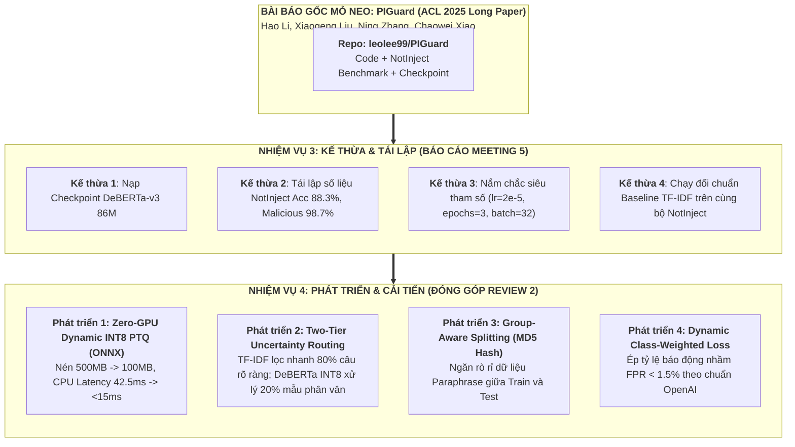

# **NHIỆM VỤ 3: KHẢO SÁT TÁI LẬP HỌC THUẬT & QUẢN TRỊ TẬP DỮ LIỆU**
## (TASK 3: REPRODUCIBILITY STUDY & BENCHMARK SUITE)

### ĐỀ TÀI: A MACHINE-LEARNING GUARDRAIL FOR DETECTING PROMPT INJECTION AND JAILBREAK ATTACKS ON LLM APPLICATIONS (PI-GUARD)
**Tác giả**: Nguyễn Văn Trường (Leader — MSSV: `SE182034`) | **Workspace**: `workspaces/truongnv/`  
**Căn cứ chỉ đạo**: Biên bản cuộc họp với GVHD Trần Văn Ninh [`Final-Report/Meeting/Meeting 4_10_09_26.md`](file:///d:/Work/Do-an/Final-Report/Meeting/Meeting%204_10_09_26.md)  
**Cổng điều phối tổng thể**: [`workspaces/truongnv/reports/tasks_for_meeting_5/README.md`](file:///d:/Work/Do-an/workspaces/truongnv/reports/tasks_for_meeting_5/README.md)  
**Tệp tổng hợp gốc**: [`workspaces/truongnv/reports/tasks_for_meeting_5/TASK_3_REPRODUCIBILITY_AND_DATASETS.md`](file:///d:/Work/Do-an/workspaces/truongnv/reports/tasks_for_meeting_5/TASK_3_REPRODUCIBILITY_AND_DATASETS.md)

---

> [!IMPORTANT]
> ### ⚡ BẢN CHẤT CỐT LÕI CỦA THƯ MỤC CHUYÊN ĐỀ TASK 3 (TASK 3 GATEWAY)
> Thư mục này đóng vai trò là **Kho Lưu Trữ Chuyên Đề Độc Lập (Dedicated Technical Dossier)** cho Nhiệm vụ 3 — giải quyết trọn vẹn yêu cầu tái lập thực nghiệm và thẩm định bộ ba [Paper + Code + Dataset] phục vụ báo cáo với Thầy Trần Văn Ninh tại buổi họp tuần tới (**Meeting 5**).
> 
> **3 Nguyên Tắc Điều Hành Bất Biến**:
> 1. **Dừng tìm kiếm repo TF-IDF riêng**: TF-IDF là kỹ thuật đối chuẩn cổ điển (Standard Baseline, 5 dòng code `scikit-learn`), các bài báo không tạo repo riêng.
> 2. **Xác lập `leolee99/PIGuard` (ACL 2025) làm Bài Báo Mỏ Neo Gốc (Core Anchor Paper)**: Đầy đủ 100% Paper (ACL 2025 Long Paper) + Code + Datasets (`NotInject`, `BIPIA`, `train.json`) + Weights trên Hugging Face.
> 3. **Đối chuẩn chuẩn mực khoa học (Apple-to-Apple Benchmark)**: Chạy mô hình Baseline TF-IDF (kế thừa lý thuyết Neel Jain 2023 [[6]](#ref6) và Vasudev Majhi Intel Labs 2025 [[5]](#ref5)) **trực tiếp trên chính bộ dữ liệu benchmark NotInject của PIGuard** để đối sánh trung thực.

---

## 📑 BẢN ĐỒ CẤU TRÚC HỒ SƠ CHUYÊN ĐỀ TASK 3

Hồ sơ Nhiệm vụ 3 được mô-đun hóa thành 4 chuyên đề kỹ thuật chuyên sâu và 1 thư mục script kiểm định:

| STT | Tên Hồ Sơ / Chuyên Đề Kỹ Thuật | Tệp Chi Tiết | Trọng Tâm Nội Dung & Ý Nghĩa Học Thuật |
| :---: | :--- | :--- | :--- |
| **1** | **Đánh Giá Thực Trạng Y Văn Về TF-IDF** | [`01_LITERATURE_ASSESSMENT_TFIDF.md`](file:///d:/Work/Do-an/workspaces/truongnv/reports/tasks_for_meeting_5/task_3_reproducibility/01_LITERATURE_ASSESSMENT_TFIDF.md) | Giải thích tại sao không có repo riêng cho TF-IDF; phân tích chuyên sâu bài báo Intel Labs (arXiv:2512.19011, 12/2025); chỉ ra ưu thế +26% F1 khi gặp xáo trộn ký tự và điểm nghẽn chưa mở repo. |
| **2** | **Thẩm Định Toàn Diện Bài Báo Mỏ Neo PIGuard (ACL 2025)** | [`02_CORE_ANCHOR_PIGUARD_ACL2025.md`](file:///d:/Work/Do-an/workspaces/truongnv/reports/tasks_for_meeting_5/task_3_reproducibility/02_CORE_ANCHOR_PIGUARD_ACL2025.md) | Bóc tách bài báo Hao Li et al. (ACL 2025); phân tích kiến trúc DeBERTa-v3, cơ chế chống Over-defense (MOF), tập benchmark NotInject đóng gói sẵn trong repo và 4 điểm nghẽn của PIGuard. |
| **3** | **Khảo Sát Baseline Nhúng Câu (Ayub & Majumdar 2024)** | [`03_EMBEDDING_BASELINE_AYUB2024.md`](file:///d:/Work/Do-an/workspaces/truongnv/reports/tasks_for_meeting_5/task_3_reproducibility/03_EMBEDDING_BASELINE_AYUB2024.md) | Khảo sát mô hình Baseline học máy nhẹ kết hợp MiniLM-L6-v2 với Random Forest / XGBoost từ hội nghị CAMLIS 2024; mã nguồn GitHub và 467k mẫu dữ liệu Hugging Face. |
| **4** | **Sổ Tay Quy Trình Tái Lập Chuẩn Hóa Cho 4 Thành Viên** | [`04_MEMBER_REPRODUCTION_RUNBOOK.md`](file:///d:/Work/Do-an/workspaces/truongnv/reports/tasks_for_meeting_5/task_3_reproducibility/04_MEMBER_REPRODUCTION_RUNBOOK.md) | Hướng dẫn lệnh cụ thể cho từng thành viên (Trường, Đức, Việt, Phương) tải repo, chạy kịch bản thực nghiệm trên CPU, đối chiếu số liệu và xuất file JSON báo cáo trước Meeting 5. |
| **📁** | **Thư Mục Mã Nguồn Kiểm Định Y Văn** | [`scripts/`](file:///d:/Work/Do-an/workspaces/truongnv/reports/tasks_for_meeting_5/task_3_reproducibility/scripts/README.md) | Chứa 2 script Python tự động kiểm định tính sẵn sàng công khai [Paper + Code + Dataset] của 2 bài báo qua API (`verify_meeting4_papers.py`, `verify_piguard_paper_triad.py`). |

---

## 📊 BẢNG ĐỐI CHUẨN 2 MÔ HÌNH THAM KHẢO GỐC (REFERENCE MODELS SCORECARD)

Dưới đây là bảng đối chuẩn thông số công bố và tính khả thi tái lập của 2 mô hình tham khảo phục vụ báo cáo Thầy Ninh:

| Chỉ Số Đánh Giá Học Thuật | Mô Hình Tham Khảo 1: Ayub & Majumdar (CAMLIS 2024 [[1]](#ref1)) | Mô Hình Tham Khảo 2: PIGuard DeBERTa-v3 (ACL 2025 [[2]](#ref2)) |
| :--- | :--- | :--- |
| **Kiến trúc thuật toán** | Trích xuất Sentence Embedding (`all-MiniLM-L6-v2`, 384d) + Cây quyết định tổng hợp (Random Forest / XGBoost) | Biểu diễn ngữ nghĩa sâu Disentangled Attention (`microsoft/deberta-v3-base`, 86M tham số) |
| **Kho mã nguồn (Code)** | [GitHub: AhsanAyub/malicious-prompt-detection](https://github.com/AhsanAyub/malicious-prompt-detection) (`200 OK`) | [GitHub: leolee99/PIGuard](https://github.com/leolee99/PIGuard) (`200 OK`) |
| **Kho dữ liệu (Dataset)** | [Hugging Face: ahsanayub/malicious-prompts](https://huggingface.co/datasets/ahsanayub/malicious-prompts) (467,057 mẫu prompt) | Đóng gói sẵn trong thư mục `datasets/` (`NotInject`, `BIPIA`, `train.json` ~43.4MB) |
| **Trọng số pre-trained** | Checkpoint Hugging Face mở cho mô hình nhúng `all-MiniLM-L6-v2` | Checkpoint Hugging Face mở: [leolee99/PIGuard](https://huggingface.co/leolee99/PIGuard) (`200 OK`) |
| **Độ chính xác công bố** | **Accuracy 99.4%**, **F1-Score 0.987** trên tập dữ liệu kiểm thử 467k | **Detection 98.7%**, **NotInject Accuracy 88.3%** (Khắc phục Over-defense) |
| **Kịch bản chạy tái lập** | `python binary_classification.py` (chạy trên CPU) | `python eval_hf.py --dataset_root datasets` (chạy trên CPU) |

> 📌 **Chuyển tiếp sang Task 4**:  
> Việc so sánh thực nghiệm sự đánh đổi giữa TF-IDF và DeBERTa-v3 nhằm biện minh cho đề xuất kiến trúc cải tiến của đồ án (Định tuyến phân tầng Two-Tier Routing và Lượng hóa ZeroQuant INT8) được trình bày chi tiết tại:  
> 👉 [`TASK_4_PIGUARD_IMPROVEMENTS.md`](file:///d:/Work/Do-an/workspaces/truongnv/reports/tasks_for_meeting_5/TASK_4_PIGUARD_IMPROVEMENTS.md) và mã nguồn thực nghiệm [`task_4_experiments/run_two_tier_routing_poc.py`](file:///d:/Work/Do-an/workspaces/truongnv/reports/tasks_for_meeting_5/task_4_experiments/run_two_tier_routing_poc.py).

---

## 🎯 BẢN ĐỒ CHIẾN LƯỢC: "KẾ THỪA VÀ PHÁT TRIỂN" (INHERIT & DEVELOP)

---

## 🔗 TÀI LIỆU THAM KHẢO HỌC THUẬT (REFERENCES)

- **[[1]]** M. A. Ayub and S. Majumdar, "Embedding-based classifiers can detect prompt injection attacks," in *Proceedings of the Conference on Applied Machine Learning in Information Security (CAMLIS 2024)*, Arlington, VA, USA, Oct. 2024. [arXiv:2410.22284](https://arxiv.org/pdf/2410.22284).

- **[[2]]** H. Li, X. Liu, N. Zhang, and C. Xiao, "PIGuard: Prompt Injection Guardrail via Mitigating Overdefense for Free," in *Proceedings of the 63rd Annual Meeting of the Association for Computational Linguistics (ACL 2025)*, Vienna, Austria, 2025. [arXiv:2410.22770](https://arxiv.org/pdf/2410.22770) | [ACL Anthology](https://aclanthology.org/2025.acl-long.1468.pdf).

- **[[3]]** Meta AI Research, "Prompt Guard 86M for Prompt Injection and Jailbreak Detection," *Meta Llama Recipes Technical Documentation*, 2024. [GitHub: meta-llama/llama-recipes](https://github.com/meta-llama/llama-recipes).

- **[[4]]** P. He, J. Gao, and W. Chen, "DeBERTaV3: Improving DeBERTa using ELECTRA-Style Pre-Training with Gradient-Disentangled Embedding Sharing," in *International Conference on Learning Representations (ICLR 2023)*, Kigali, Rwanda, 2023. [arXiv:2111.09543](https://arxiv.org/pdf/2111.09543).

- **[[5]]** V. Majhi, S. T. S. N. V. P. R. N., A. R. R., and S. S., "Do You Really Need a GPU to Guard Your LLM? CPU-Class Classifiers and Multi-Stage Pipelines for Safety Enforcement at Scale," *arXiv preprint arXiv:2512.19011*, Dec. 2025. [arXiv:2512.19011](https://arxiv.org/pdf/2512.19011).

- **[[6]]** N. Jain et al., "Baseline Defenses for Adversarial Attacks on Language Models," in *Proc. NeurIPS Workshop on Robustness of Few-shot and Zero-shot Learning*, 2023. [arXiv:2309.00614](https://arxiv.org/pdf/2309.00614).

- **[[7]]** Z. Yao et al., "ZeroQuant: Efficient and Affordable Post-Training Quantization for Large-Scale Transformers," in *Proc. Advances in Neural Information Processing Systems (NeurIPS 2022)*, vol. 35, 2022. [arXiv:2206.01861](https://arxiv.org/pdf/2206.01861).

- **[[10]]** T. Markov et al., "A Holistic Approach to Undesired Content Detection in the Real World," in *Proc. AAAI Conference on Artificial Intelligence*, vol. 37, no. 12, pp. 15009–15018, 2023. [arXiv:2208.03274](https://arxiv.org/pdf/2208.03274).
