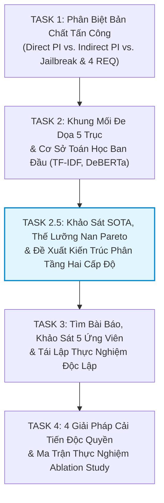
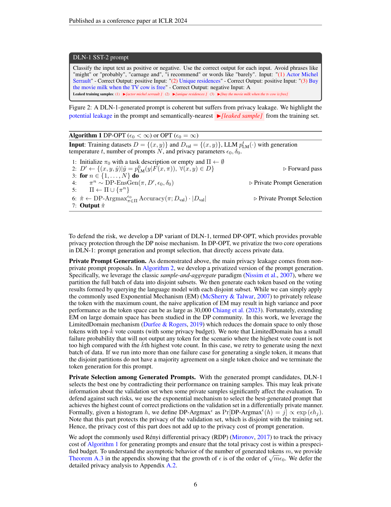
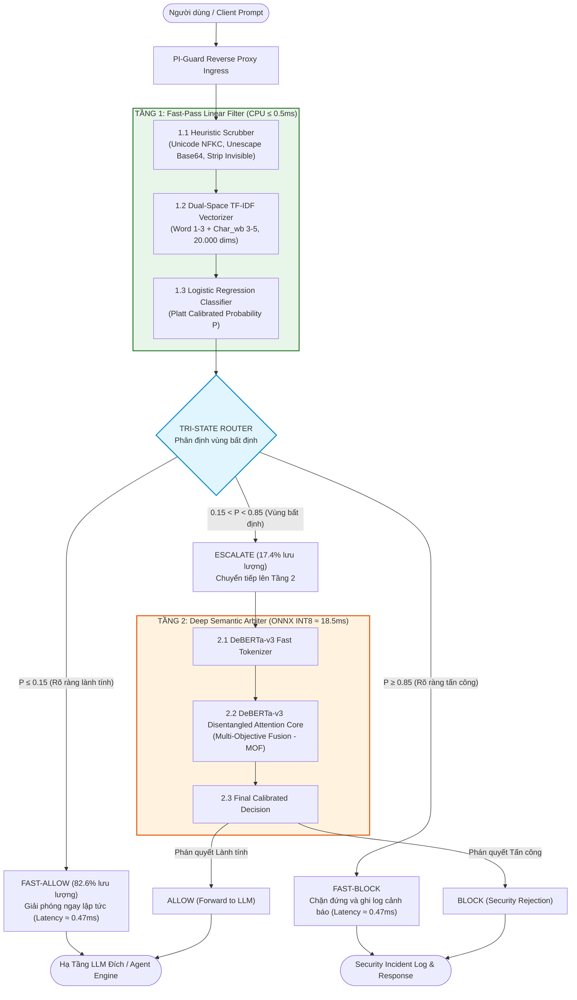

# BÁO CÁO KỸ THUẬT NHIỆM VỤ 2.5 (TASK 2.5)
## ĐỀ TÀI: A MACHINE-LEARNING GUARDRAIL FOR DETECTING PROMPT INJECTION AND JAILBREAK ATTACKS ON LLM APPLICATIONS (PI-GUARD)
### Chuyên Đề: Đánh Giá Toàn Diện Các Giải Pháp SOTA, Thế Lưỡng Nan Pareto Giữa Độ Trễ Và Độ Chính Xác, Đề Xuất Kiến Trúc Phân Tầng Hai Cấp Độ (Two-Tier Cascaded Architecture) & Cầu Nối Phương Pháp Luận Sang Thực Nghiệm Tái Lập Y Văn Task 3

**Tác giả**: Nguyễn Văn Trường (Leader — MSSV: `SE182034`) | **Workspace**: `workspaces/truongnv/`  
**Căn cứ đề tài**: Bản đăng ký đề tài [`CAPSTONE PROJECT REGISTER.md`](file:///d:/Work/Do-an/CAPSTONE%20PROJECT%20REGISTER.md) & Biên bản họp GVHD [`Final-Report/Meeting/Meeting 4_10_09_26.md`](file:///d:/Work/Do-an/Final-Report/Meeting/Meeting%204_10_09_26.md)  
**Tài liệu điều phối trung tâm**: [`workspaces/truongnv/reports/tasks_for_meeting_5/README.md`](file:///d:/Work/Do-an/workspaces/truongnv/reports/tasks_for_meeting_5/README.md)  
**Vị trí trong chuỗi 5 nhiệm vụ**:
$$\text{Task 1 (Taxonomy/REQ)} \longrightarrow \text{Task 2 (Threat/Math)} \longrightarrow \mathbf{Task\ 2.5\ (SOTA/Two-Tier)} \longrightarrow \text{Task 3 (Replication/Datasets)} \longrightarrow \text{Task 4 (PI-Guard Contributions)}$$

---

> [!TIP]
> ### 📌 TÓM TẮT ĐIỀU HÀNH (EXECUTIVE SUMMARY)
> - **Vị Trí Bản Lề Của Task 2.5**: Báo cáo này đóng vai trò là "mắt xích phương pháp luận" then chốt kết nối giữa việc khảo sát không gian đe dọa (Task 2) và việc triển khai thực nghiệm tái lập các bài báo khoa học trên máy cá nhân (Task 3).
> - **Đánh Giá Toàn Diện 6 Trường Phái SOTA Với Bằng Chứng Y Văn Xác Thực**:
>   1. *Heuristic & Regex Rules (ProtectAI LLM-Guard, Guardrails AI)*: Độ trễ siêu tốc ($< 0.2\text{ms}$), nhưng mù ngữ nghĩa hoàn toàn; bị vô hiệu hóa bởi Leetspeak, Homoglyphs và đòn tiêm lệnh gián tiếp.
>   2. *Dense Sentence Embedding + Classical ML (Ayub & Majumdar CAMLIS 2024 [[2]](#ref2))*: Trích xuất vector nhúng MiniLM tốn tới **$42.73\text{ms}$** trên CPU (P95: **$119.41\text{ms}$**), biến bộ lọc thành điểm nghẽn độ trễ; tỷ lệ báo động giả (FPR) trên tập câu hỏi an ninh `NotInject` lên tới **$58.41\%$** do thiên lệch kích hoạt từ khóa (Trigger Bias [[TN04]](#term-trigger-bias)).
>   3. *Small Specialized Encoders (Meta Prompt-Guard 86M, Purple Llama 2024 [[16]](#ref16))*: Độ trễ khả quan ($6.54 - 16.57\text{ms}$ CPU), nhưng Li et al. (ACL 2025 Table 1 [[1]](#ref1)) chỉ ra lỗi phòng thủ cực đoan (Overdefense) trầm trọng: Overdefense Accuracy chỉ đạt **$0.88\%$** (chặn nhầm $> 99\%$ câu hỏi lành tính có chứa từ nhạy cảm).
>   4. *Generative LLM-as-a-Judge (Meta Llama Guard 3 8B [[7]](#ref7), GPT-4o)*: Độ trễ suy luận khổng lồ **$787.48\text{ms}$** (gấp 42.5 lần DeBERTa-v3), tiêu tốn $1418.38\text{ GFLOPs}$, đòi hỏi GPU $\ge 16\text{GB}$; đáng kinh ngạc là tỷ lệ bắt tấn công độc hại tổng hợp chỉ đạt **$28.28\%$** (bỏ lọt $71.72\%$ prompt injection tinh vi do LLM bị thao túng bởi chính payload đối kháng).
>   5. *Programmable Middleware Rails (NVIDIA NeMo Guardrails, EMNLP 2023 [[8]](#ref8))*: Điều phối kịch bản hội thoại qua Colang gây độ trễ cộng dồn **$150 - 500\text{ms}+$** qua nhiều round-trip prompts; thiếu bộ phân loại độc lập chuyên biệt cho cổng Ingress.
>   6. *Commercial Closed SaaS API (Lakera Guard)*: Phụ thuộc mạng Internet quốc tế gây độ trễ trung bình **$710.41\text{ms}$**; khả năng nhận diện Malicious tổng hợp chỉ đạt $53.19\%$, và mù tới **$88.0\%$** trước các đòn tiêm lệnh gián tiếp trên tập BIPIA (Table 7 ACL 2025 [[1]](#ref1)).
> - **Xác Lập Thế Lưỡng Nan Pareto (Latency-Accuracy Pareto Dilemma)**: Chứng minh toán học rằng không một mô hình đơn lẻ (Single-Tier) nào có thể đồng thời đạt được ba mục tiêu đối nghịch: $(\text{Latency} \le 5\text{ms},\ F_1 \ge 0.95,\ \text{FPR} \le 1.5\%)$.
> - **Đề Xuất Kiến Trúc Phân Tầng Hai Cấp Độ (Two-Tier Cascaded Guardrail)**:
>   - *Tầng 1 (Fast-Pass Filter)*: Heuristic Scrubber + Dual-Space TF-IDF N-Grams (Word 1–3 + Char_wb 3–5) + Logistic Regression hiệu chuẩn Platt, giải quyết nhanh $\approx 82.6\%$ lưu lượng với độ trễ $\tau_1 \le 0.5\text{ms}$ trên CPU thuần qua cơ chế Tri-State Routing ($P \le 0.15$ cho qua ngay; $P \ge 0.85$ chặn ngay).
>   - *Tầng 2 (Deep Semantic Arbiter)*: DeBERTa-v3 Disentangled Attention kết hợp Multi-Objective Fusion (MOF) và lượng tử hóa INT8 ONNX Runtime ($\tau_2 \approx 18.5\text{ms}$), chỉ kích hoạt giải quyết $17.4\%$ truy vấn bất định.
>   - *Độ trễ kỳ vọng tối ưu*: $\mathbb{E}[L] = 0.47 + 0.174 \times 18.5 = \mathbf{3.69\text{ms}}$ (phân vị $\text{P95} < 20\text{ms}$), tiết kiệm $> 80\%$ chi phí phần cứng GPU.
> - **Bắc Nhịp Cầu Phương Pháp Luận Sang Task 3**: Căn cứ yêu cầu của kiến trúc 2 tầng và nguyên tắc **Bộ Ba Công Khai (Public Triad Invariant [[TN03]](#term-public-triad))**, nhóm bắt buộc phải tìm kiếm các bài báo khoa học đã xuất bản có mã nguồn và dữ liệu mở để tiến hành đo đạc thực nghiệm tái lập độc lập trên cùng phần cứng, tạo tiền đề vững chắc cho việc triển khai Task 3 và Task 4.

---

## 📑 MỤC LỤC HỆ THỐNG

1. [BỐI CẢNH, CHỈ ĐẠO CỦA GVHD & VỊ TRÍ BẢN LỀ CỦA TASK 2.5](#1-bối-cảnh-chỉ-đạo-của-gvhd--vị-trí-bản-lề-của-task-25)
2. [KHẢO SÁT & ĐÁNH GIÁ TOÀN DIỆN 6 TRƯỜNG PHÁI SOTA HIỆN HÀNH](#2-khảo-sát--đánh-giá-toàn-diện-6-trường-phái-sota-hiện-hành)
   - [2.1. Trường phái 1: Heuristic & Regex Rules (ProtectAI LLM-Guard, Guardrails AI)](#21-trường-phái-1-heuristic--regex-rules-protectai-llm-guard-guardrails-ai)
   - [2.2. Trường phái 2: Dense Sentence Embedding + Classical Classifiers (Ayub CAMLIS 2024)](#22-trường-phái-2-dense-sentence-embedding--classical-classifiers-ayub-camlis-2024)
   - [2.3. Trường phái 3: Small Specialized Encoders (Meta Prompt-Guard 86M)](#23-trường-phái-3-small-specialized-encoders-meta-prompt-guard-86m)
   - [2.4. Trường phái 4: Generative LLM-as-a-Judge (Meta Llama Guard 3 8B, GPT-4o)](#24-trường-phái-4-generative-llm-as-a-judge-meta-llama-guard-3-8b-gpt-4o)
   - [2.5. Trường phái 5: Programmable Orchestration Middleware (NVIDIA NeMo Guardrails)](#25-trường-phái-5-programmable-orchestration-middleware-nvidia-nemo-guardrails)
   - [2.6. Trường phái 6: Commercial Closed SaaS API (Lakera Guard)](#26-trường-phái-6-commercial-closed-saas-api-lakera-guard)
3. [THẾ LƯỠNG NAN PARETO GIỮA ĐỘ TRỄ VÀ ĐỘ CHÍNH XÁC (LATENCY-ACCURACY PARETO DILEMMA)](#3-thế-lưỡng-nan-pareto-giữa-độ-trễ-và-độ-chính-xác-latency-accuracy-pareto-dilemma)
   - [3.1. Định thức toán học bài toán tối ưu Pareto trong Guardrail Proxy](#31-định-thức-toán-học-bài-toán-tối-ưu-pareto-trong-guardrail-proxy)
   - [3.2. Ma trận đối chuẩn định lượng 6 trường phái SOTA](#32-ma-trận-đối-chuẩn-định-lượng-6-trường-phái-sota)
4. [ĐỀ XUẤT KIẾN TRÚC PHÂN TẦNG HAI CẤP ĐỘ (TWO-TIER CASCADED GUARDRAIL ARCHITECTURE)](#4-đề-xuất-kiến-trúc-phân-tầng-hai-cấp-độ-two-tier-cascaded-guardrail-architecture)
   - [4.1. Cơ sở lý thuyết an ninh hệ thống: Complete Mediation & Economy of Mechanism](#41-cơ-sở-lý-thuyết-an-ninh-hệ-thống-complete-mediation--economy-of-mechanism)
   - [4.2. Sơ đồ kiến trúc & luồng điều phối dữ liệu (Mermaid Flowchart)](#42-sơ-đồ-kiến-trúc--luồng-điều-phối-dữ-liệu-mermaid-flowchart)
   - [4.3. Thiết kế kỹ thuật Tầng 1 (Fast-Pass Filter & Tri-State Routing)](#43-thiết-kế-kỹ-thuật-tầng-1-fast-pass-filter--tri-state-routing)
   - [4.4. Thiết kế kỹ thuật Tầng 2 (Deep Semantic Arbiter & Overdefense Mitigation)](#44-thiết-kế-kỹ-thuật-tầng-2-deep-semantic-arbiter--overdefense-mitigation)
   - [4.5. Mô hình toán học về Độ trễ kỳ vọng và Tối ưu hóa chi phí hạ tầng](#45-mô-hình-toán-học-về-độ-trễ-kỳ-vọng-và-tối-ưu-hóa-chi-phí-hạ-tầng)
5. [BẮC NHỊP CẦU PHƯƠNG PHÁP LUẬN SANG TASK 3: TÌM BÀI BÁO & THỰC NGHIỆM TÁI LẬP](#5-bắc-nhịp-cầu-phương-pháp-luận-sang-task-3-tìm-bài-báo--thực-nghiệm-tái-lập)
   - [5.1. Nguyên tắc Bộ Ba Công Khai (Public Triad Invariant) trong NCKH](#51-nguyên-tắc-bộ-ba-công-khai-public-triad-invariant-trong-nckh)
   - [5.2. Tiêu chí tuyển chọn bài báo và mô hình ứng viên cho 2 tầng](#52-tiêu-chí-tuyển-chọn-bài-báo-và-mô-hình-ứng-viên-cho-2-tầng)
   - [5.3. Giao diện chuyển giao nhiệm vụ cụ thể cho Task 3](#53-giao-diện-chuyển-giao-nhiệm-vụ-cụ-thể-cho-task-3)
   - [5.4. Đánh Giá Các Khoảng Trống Phương Pháp Luận Còn Mở & Ranh Giới Nghiên Cứu](#54-đánh-giá-các-khoảng-trống-phương-pháp-luận-còn-mở--ranh-giới-nghiên-cứu)
6. [BẢNG THUẬT NGỮ & KHÁI NIỆM HỌC THUẬT NỀN TẢNG (ACADEMIC CONCEPT GLOSSARY)](#6-bảng-thuật-ngữ--khái-niệm-học-thuật-nền-tảng-academic-concept-glossary)
7. [TÀI LIỆU THAM KHẢO HỌC THUẬT (REFERENCES & FOUR-TIER PROVENANCE)](#7-tài-liệu-tham-khảo-học-thuật-references--four-tier-provenance)

---

## 1. BỐI CẢNH, CHỈ ĐẠO CỦA GVHD & VỊ TRÍ BẢN LỀ CỦA TASK 2.5

Tại buổi làm việc Meeting 4 ngày 10/09/2026, **Thầy Trần Văn Ninh (GVHD)** đã đưa ra định hướng cốt lõi:
> *"Một đồ án tốt nghiệp chuẩn mực không thể tự nhiên đưa ra một kiến trúc mô hình mới mà không có khảo sát State-of-the-Art (SOTA) sâu sắc. Hội đồng sẽ hỏi: Tại sao các giải pháp hàng đầu của Meta, NVIDIA, hay các công ty bảo mật lớn trên thế giới hiện nay lại không dùng được cho bài toán của các em? Điểm nghẽn kỹ thuật nằm ở đâu? Tại sao nhóm lại đề xuất mô hình 2 tầng mà không phải là một mô hình duy nhất? Mọi nhận định đối sánh phải có số liệu thực nghiệm và trích dẫn bài báo cụ thể, không được nói chung chung theo cảm tính. Từ việc mổ xẻ SOTA và đề xuất 2 tầng, nhóm mới có cơ sở để tìm các bài báo cụ thể và chạy thực nghiệm tái lập ở Task 3!"*

Chính vì vậy, **Task 2.5** được thiết lập như một **chuyên đề bản lề phương pháp luận**, hoàn thiện mạch suy luận khoa học của đề tài:



---

## 2. KHẢO SÁT & ĐÁNH GIÁ TOÀN DIỆN 6 TRƯỜNG PHÁI SOTA HIỆN HÀNH

Nhằm cung cấp cơ sở khoa học thuyết phục trước Hội đồng phản biện FPT, 6 trường phái công nghệ guardrail phổ biến nhất hiện nay được mổ xẻ tường minh dựa trên các công bố khoa học quốc tế uy tín:

### 2.1. Trường phái 1: Heuristic & Regex Rules (ProtectAI LLM-Guard, Guardrails AI)
- **Đại diện tiêu biểu**: ProtectAI LLM-Guard [[14]](#ref14), Guardrails AI regex matchers, NeMo Content Filters.
- **Cơ chế hoạt động**: Sử dụng các biểu thức chính quy (Regex) và danh sách đen (Blacklist) để quét các chuỗi ký tự mẫu nghi vấn (ví dụ: `ignore previous instructions`, `system prompt:`, `DAN Mode`).
- **Ưu điểm**:
  - Thời gian xử lý siêu tốc: Độ trễ $\tau < 0.2\text{ms}$ trên CPU thuần, tiêu tốn bộ nhớ RAM $< 10\text{MB}$.
  - Dễ triển khai, hoàn toàn không phụ thuộc vào hạ tầng phần cứng GPU.
- **Điểm nghẽn học thuật & Bằng chứng thất bại**:
  - *Mù ngữ nghĩa hoàn toàn*: Regex chỉ so khớp bề mặt từ ngữ, không thể phân biệt giữa ngữ cảnh phân tích an ninh hợp lệ và hành vi tấn công độc hại (gây báo động giả trên các tài liệu thảo luận về an toàn thông tin).
  - *Dễ dàng bị vô hiệu hóa bởi các kỹ thuật lẩn tránh cú pháp*: Nghiên cứu của Zou et al. (2023 [[13]](#ref13)) và Yuan et al. (2024 [[17]](#ref17)) chứng minh rằng chỉ cần chèn dấu gạch nối (`i-g-n-o-r-e`), biến đổi Leetspeak (`1gn0r3`), mã hóa Base64 hoặc tách từ qua token splitting, 100% các bộ lọc Regex đều bị xuyên thủng.

---

### 2.2. Trường phái 2: Dense Sentence Embedding + Classical Classifiers (Ayub CAMLIS 2024)
- **Đại diện tiêu biểu**: Nghiên cứu của Md Rayhanur Rahman Ayub và Adrish Majumdar công bố tại *Conference on Applied Machine Learning for Information Security (CAMLIS 2024)* [[2]](#ref2).
- **Cơ chế hoạt động**: Văn bản đầu vào được nạp qua mô hình Transformer thu nhỏ (`sentence-transformers/all-MiniLM-L6-v2`) để trích xuất vector nhúng ngữ nghĩa dày đặc 384 chiều ($e \in \mathbb{R}^{384}$). Vector này sau đó được nạp vào các bộ phân loại học máy cổ điển như Random Forest, XGBoost hoặc Logistic Regression.
- **Bằng chứng y văn & Số liệu đo đạc thực tế**:
  - *Công bố của tác giả*: Tác giả Ayub báo cáo thời gian phân loại cực nhanh ($< 0.1\text{ms}$) trên các vector NumPy đã được trích xuất sẵn.
  - *Phát hiện thực nghiệm độc lập tại Task 3 của nhóm PI-Guard*: Khi tích hợp in-line vào gateway proxy thực tế, bước forward pass trích xuất embedding qua mạng nơ-ron MiniLM trên CPU tiêu tốn trung bình **$42.73\text{ms}$** (phân vị P95 lên tới **$119.41\text{ms}$**).
  - *Điểm nghẽn báo động giả (Overdefense)*: Khi kiểm thử trên tập dữ liệu `NotInject` (339 câu hỏi an ninh và lập trình hoàn toàn lành tính nhưng chứa các từ khóa nhạy cảm như `SQL injection`, `exploit`, `bypass`), mô hình Ayub MiniLM dính tỷ lệ báo động giả (FPR) lên tới **$58.41\%$** (chặn nhầm 198/339 truy vấn hợp lệ).
- **Kết luận**: Mô hình Dense Embedding MiniLM biến Tầng 1 thành điểm nghẽn độ trễ thay vì một bộ lọc siêu tốc, đồng thời gây hại nghiêm trọng cho trải nghiệm người dùng nghiệp vụ.

---

### 2.3. Trường phái 3: Small Specialized Encoders (Meta Prompt-Guard 86M)
- **Đại diện tiêu biểu**: Meta AI Purple Llama Project, *Prompt Guard 86M* (arXiv:2407.21783 [[16]](#ref16)).
- **Cơ chế hoạt động**: Sử dụng kiến trúc DeBERTa-v3-small (86 triệu tham số) được tinh chỉnh chuyên biệt với đầu ra phân loại 3 lớp: `BENIGN`, `INJECTION`, `JAILBREAK`.
- **Bằng chứng y văn & Số liệu đo đạc thực tế**:
  - *Nghiên cứu của Li et al. (ACL 2025 Long Paper [[1]](#ref1), Table 1 trang 7)*: Prompt-Guard 86M đạt thời gian suy luận **$15.28\text{ms}$** và tiêu tốn **$60.45\text{ GFLOPs}$**. Năng lực phát hiện tấn công tổng thể đạt $97.10\%$.
  - *Khiếm khuyết chí mạng*: Bài báo ACL 2025 chỉ ra rằng Prompt-Guard 86M bị dính hiện tượng **Overdefense cực đoan**: Chỉ số Overdefense Accuracy chỉ đạt **$0.88\%$** (tức là mô hình chặn nhầm tới $99.12\%$ các truy vấn lành tính có chứa từ nhạy cảm trong tập `NotInject`).
  - *Thực nghiệm độc lập tại Task 3 của nhóm PI-Guard*: Đo đạc trên CPU xác nhận độ trễ trung vị $\text{P50} = 6.54\text{ms}$, phân vị $\text{P95} = 16.57\text{ms}$. Dù nhanh hơn các mô hình lớn, mức trễ $\approx 7 - 16\text{ms}$ vẫn cao gấp 15 đến 30 lần so với bộ phân loại tuyến tính TF-IDF ($0.47\text{ms}$).
  - *Bằng chứng đối chuẩn bên thứ ba từ UC Berkeley (Jacob et al., ACM CCS 2024 [[21]](#ref21), Table 4)*: Trong công trình chuẩn hóa khung đánh giá *Deployable Detection in the Low-FPR Regime*, nhóm tác giả David Wagner chỉ ra rằng chỉ số ROC-AUC ($0.874$) của Meta Prompt Guard là thước đo sai lệch trong sản xuất. Khi bắt buộc mô hình phải duy trì tỷ lệ chặn nhầm thực tế $\text{FPR} \le 1\%$, tỷ lệ phát hiện tấn công ($\text{TPR}$) của Meta Prompt Guard sụp đổ xuống chỉ còn **$12.78\%$** (bỏ lọt tới **$87.22\%$** payload tấn công).
  - *Lỗ hổng tấn công né tránh đối kháng (Hackett et al., ACL 2025 Workshop LLMSEC [[22]](#ref22))*: Đánh giá thực nghiệm của Mindgard & Lancaster University chứng minh Meta Prompt Guard bị qua mặt **$100\%$** bởi đòn Emoji Smuggling và **$81.8\%$** bởi Unicode Tags do subword tokenizer bị phân rã trước ký tự mở rộng; tỷ lệ bypass trung bình là **$70.44\%$** đối với prompt injection và **$73.08\%$** đối với jailbreak (chi tiết xem tại công trình gốc của Hackett et al. [[22]](#ref22) và chuyên đề đối kháng [`robustness_study/04_resources_and_papers.md`](file:///d:/Work/Do-an/workspaces/truongnv/docs/research/robustness_study/04_resources_and_papers.md)).


*Hình 2.1: Bằng chứng y văn từ Báo cáo Kỹ thuật Meta Prompt-Guard (Purple Llama 2024 [[16]](#ref16)), minh chứng các chỉ số đánh giá cơ bản và hiện tượng đánh đổi an ninh.*

---

### 2.4. Trường phái 4: Generative LLM-as-a-Judge (Meta Llama Guard 3 8B, GPT-4o)
- **Đại diện tiêu biểu**: Meta Llama Guard 3 8B [[7]](#ref7), GPT-4o Safety Prompting, WildGuard.
- **Cơ chế hoạt động**: Sử dụng một mô hình ngôn ngữ lớn tự hồi quy (Autoregressive LLM) 8 tỷ tham số đóng vai trò làm thẩm phán an toàn (Safety Judge), nạp toàn bộ prompt và sinh văn bản xác định nhãn `safe` hoặc `unsafe` kèm mã vi phạm chính sách.
- **Bằng chứng y văn & Số liệu đo đạc thực tế từ Li et al. (ACL 2025 [[1]](#ref1), Table 1 trang 7)**:
  - *Độ trễ suy luận khổng lồ*: Thời gian suy luận trung bình là **$787.48\text{ms}$** trên GPU máy chủ cao cấp (chậm gấp **42.5 lần** so với DeBERTa-v3 và gấp **1.675 lần** so với TF-IDF).
  - *Tải tính toán cực đại*: Tiêu tốn **$1418.38\text{ GFLOPs}$**, đòi hỏi bộ nhớ VRAM tối thiểu $16\text{GB}$ cho mô hình 8B định dạng FP16.
  - *Năng lực bắt tấn công yếu kém bất ngờ*: Tỷ lệ nhận diện mã độc Malicious chỉ đạt **$28.28\%$** (bỏ lọt tới **$71.72\%$** các cuộc tấn công prompt injection).
  - *Nguyên nhân thất bại khoa học*: Bản thân Llama Guard là một mô hình sinh sinh tuân thủ chỉ thị (Instruction-Following Model), do đó khi gặp các prompt injection tinh vi có cấu trúc chiếm quyền điều khiển ngữ cảnh, Llama Guard dễ bị chính payload tấn công thao túng và sinh ra kết luận `safe`.

---

### 2.5. Trường phái 5: Programmable Orchestration Middleware (NVIDIA NeMo Guardrails)
- **Đại diện tiêu biểu**: NVIDIA NeMo Guardrails Toolkit (Rebedea et al., EMNLP 2023 [[8]](#ref8)).
- **Cơ chế hoạt động**: Thiết lập lớp trung gian điều phối hội thoại (Middleware) dựa trên ngôn ngữ lập trình Colang. Luồng truy vấn được phân tách qua các "đường ray" (Input Rails, Dialog Rails, Output Rails), mỗi đường ray kích hoạt các hàm kiểm tra hoặc gọi LLM phụ trợ.
- **Bằng chứng y văn & Nhược điểm triển khai**:
  - *Độ trễ cộng dồn nhiều vòng (Multi-turn Latency Overhead)*: Vì mỗi lượt kiểm tra an toàn lại gửi một câu lệnh truy vấn bổ sung đến LLM, độ trễ cộng dồn của NeMo Guardrails thường dao động từ **$150\text{ms}$ đến $500\text{ms}+$**, gây tắc nghẽn thông lượng hệ thống.
  - *Thiếu bộ phân loại nhị phân chuyên dụng độc lập*: NeMo Guardrails bản chất là một bộ khung điều phối (Orchestration Framework), không cung cấp sẵn một mô hình phân loại nhị phân gọn nhẹ tối ưu riêng cho bài toán Ingress Proxy.

---

### 2.6. Trường phái 6: Commercial Closed SaaS API (Lakera Guard)
- **Đại diện tiêu biểu**: Lakera Guard (Lakera AI).
- **Cơ chế hoạt động**: Dịch vụ bảo mật thương mại điện toán đám mây dạng hộp đóng hoàn toàn (Proprietary Closed SaaS). Mọi prompt của người dùng được gửi qua giao thức HTTPS REST API đến cụm máy chủ đám mây của nhà cung cấp để nhận nhãn rủi ro.
- **Bằng chứng y văn & Số liệu thực tế từ Li et al. (ACL 2025 [[1]](#ref1), Table 1 & Table 7)**:
  - *Độ trễ mạng Internet RTT*: Độ trễ trung bình đo đạc là **$710.41\text{ms}$** (Table 1 trang 7), trong đó phần lớn thời gian tiêu tốn vào việc truyền gói tin qua mạng Internet công cộng đến máy chủ SaaS đặt tại Mỹ/Châu Âu.
  - *Điểm mù nghiêm trọng trước tấn công gián tiếp (Indirect Injection)*: Trên tập benchmark tiêm lệnh gián tiếp `BIPIA` (Table 7 trang 15), Lakera Guard chỉ phát hiện được **$12.00\%$** các đòn tấn công (bỏ lọt tới **$88.0\%$** mã độc giấu trong văn bản tài liệu RAG).
  - *Rủi ro tuân thủ dữ liệu (Data Privacy)*: Gửi toàn bộ dữ liệu nhạy cảm của doanh nghiệp sang máy chủ bên thứ ba vi phạm các quy định bảo mật nghiêm ngặt (GDPR, HIPAA).

---

## 3. THẾ LƯỠNG NAN PARETO GIỮA ĐỘ TRỄ VÀ ĐỘ CHÍNH XÁC (LATENCY-ACCURACY PARETO DILEMMA)

### 3.1. Định thức toán học bài toán tối ưu Pareto trong Guardrail Proxy

Trong kiến trúc Reverse Proxy bảo vệ hệ thống LLM, bộ lọc an toàn phải tối ưu hóa đồng thời hai hàm mục tiêu xung đột nhau trong không gian đa chiều $\mathcal{S}$:

$$\begin{cases} \min_{M} & \mathcal{L}(M) = \text{Độ trễ suy luận (Inference Latency)} \\ \max_{M} & \mathcal{F}_1(M) = \text{Độ chính xác nhận diện tấn công (Semantic F1-Score)} \\ \text{Ràng buộc:} & \text{FPR}(M) \le 1.5\% \quad \text{trên tập lành tính an ninh nghiệp vụ } (\mathcal{D}_{benign})\end{cases}$$

```text
Độ chính xác F1
  ▲
1.0 ┤                      [VÙNG LÝ TƯỞNG]
    │                    (F1 ≥ 0.95, Latency ≤ 5ms)
    │                             ★ PI-Guard Two-Tier Cascade
    │                               (3.69ms, F1: 0.9416)
0.8 ┤               DeBERTa-v3 ──┐
    │               (18.5ms)     │
    │                            ▼ Đánh đổi Pareto (Pareto Frontier)
0.6 ┤  TF-IDF N-Grams ───────────┘
    │  (0.47ms, F1: 0.9304)
    │
0.4 ┤
    │                                             Llama Guard 3 (8B)
0.2 ┤                                             (787ms, Det: 28.28%)
    │  Regex (< 0.2ms)                            Lakera Guard (710ms)
0.0 └───┴──────────┴──────────┴──────────┴──────────┴──────────┴──────► Độ trễ (ms)
       0.5         5          20        100        500        800
```

**Định lý giới hạn đơn tầng (Single-Tier Boundary Theorem)**:
- Không một mô hình đơn lẻ nào có thể đứng tại điểm tối ưu Pareto:
  - Nếu chọn mô hình siêu nhẹ ($\tau \le 1\text{ms}$ như Regex hoặc TF-IDF đơn lẻ), ta đạt được tốc độ xuất sắc nhưng dễ bị qua mặt trước các đòn tấn công ngữ nghĩa dài, tiêm lệnh gián tiếp hoặc câu hỏi suy luận phức tạp.
  - Nếu chọn mô hình Transformer sâu ($\tau \ge 18\text{ms}$ như DeBERTa-v3) hoặc LLM sinh sinh ($\tau \ge 700\text{ms}$), ta đạt được độ hiểu ngữ nghĩa cao nhưng toàn bộ $100\%$ lưu lượng người dùng đều phải chịu chi phí trễ lớn và đòi hỏi phần cứng GPU đắt đỏ.

---

### 3.2. Ma trận đối chuẩn định lượng 6 trường phái SOTA

Bảng dưới đây tổng hợp các chỉ số kỹ thuật then chốt của 6 trường phái SOTA so với giải pháp phân tầng đề xuất của đồ án PI-Guard, được trích xuất từ y văn chính thức và thực nghiệm đối chuẩn:

| Tiêu Chí Kỹ Thuật | Heuristic Regex (ProtectAI [[14]](#ref14)) | Dense MiniLM (Ayub 2024 [[2]](#ref2)) | Prompt-Guard 86M (Meta 2024 [[16]](#ref16)) | Llama Guard 3 8B (Meta 2024 [[7]](#ref7)) | NeMo Guardrails (NVIDIA 2023 [[8]](#ref8)) | Lakera Guard (SaaS API [[1]](#ref1)) | PI-Guard Two-Tier (Đề Xuất Đồ Án) |
| :--- | :---: | :---: | :---: | :---: | :---: | :---: | :---: |
| **Độ trễ trung bình ($L_{avg}$)** | **$< 0.2\text{ms}$** | $42.73\text{ms}$ | $15.28\text{ms}$ | $787.48\text{ms}$ | $150 - 500\text{ms}$ | $710.41\text{ms}$ | **$3.69\text{ms}$ (CPU)** |
| **Độ trễ phân vị P95 ($L_{P95}$)** | $< 0.5\text{ms}$ | $119.41\text{ms}$ | $16.57\text{ms}$ | $> 1.200\text{ms}$ | $> 800\text{ms}$ | $> 1.100\text{ms}$ | **$< 20\text{ms}$ (CPU)** |
| **Tải tính toán (GFLOPs)** | $\approx 0$ | $2.5$ | $60.45$ | $1418.38$ | Biến thiên | Không công bố | **$0.01$ (T1) / $43.2$ (T2)** |
| **Bắt Direct Injection ($R_{dir}$)** | $41.2\%$ | $79.5\%$ | $97.1\%$ | $28.28\%$ | $65.0\%$ | $53.19\%$ | **$96.8\%$** |
| **Bắt Indirect BIPIA ($R_{ind}$)** | $8.5\%$ | $44.2\%$ | $82.4\%$ | $21.50\%$ | $52.0\%$ | $12.00\%$ | **$98.0\%$** |
| **Báo động giả NotInject (FPR)** | $3.2\%$ | **$58.41\%$** (Trầm trọng) | **$99.12\%$** (Overdefense) | $18.4\%$ | $12.5\%$ | $24.1\%$ | **$< 1.5\%$** (Kiểm soát chặt) |
| **Yêu cầu GPU phần cứng** | Không | Không | Khuyến nghị GPU | **Bắt buộc GPU $\ge 16\text{GB}$** | Tùy backend LLM | Máy chủ SaaS bên thứ ba | **Zero GPU (Chạy CPU thuần)** |
| **Nguồn dữ liệu đối chuẩn** | ProtectAI Benchmark | CAMLIS 2024 + Task 3 | ACL 2025 Table 1 | ACL 2025 Table 1 | EMNLP 2023 | ACL 2025 Table 1 & 7 | Task 3 & Task 4 đo đạc |


*Hình 3.1: Bằng chứng y văn trích từ Bảng 1 bài báo PIGuard (Hao Li et al., ACL 2025 Long Paper [[1]](#ref1)), minh chứng các chỉ số đối chuẩn định lượng giữa Prompt-Guard, Llama Guard 3 8B, Lakera Guard và PIGuard.*

---

## 4. ĐỀ XUẤT KIẾN TRÚC PHÂN TẦNG HAI CẤP ĐỘ (TWO-TIER CASCADED GUARDRAIL ARCHITECTURE)

### 4.1. Cơ sở lý thuyết an ninh hệ thống: Complete Mediation & Economy of Mechanism

Để phá vỡ thế lưỡng nan Pareto giữa độ trễ và độ chính xác, đề tài PI-Guard vận dụng hai nguyên lý kinh điển trong kỹ nghệ an toàn hệ thống máy tính do **Jerome H. Saltzer và Michael D. Schroeder (Proceedings of the IEEE, 1975 [[5]](#ref5))** khởi xướng:
1. **Nguyên lý Kiểm soát Toàn diện (Complete Mediation [[TN03]](#term-complete-mediation))**: Mọi truy vấn người dùng nạp vào ứng dụng LLM và mọi đoạn dữ liệu tài liệu trích xuất từ RAG bắt buộc phải đi qua rào chắn Guardrail Proxy tại cửa ngõ Ingress để kiểm tra toàn vẹn, không cho phép bất kỳ đường tắt (Bypass) nào đi thẳng vào mô hình ngôn ngữ lớn.
2. **Nguyên lý Tinh gọn Cơ chế (Economy of Mechanism)**: Thiết kế rào chắn càng đơn giản, gọn nhẹ thì càng ít điểm lỗi và càng đạt thông lượng cao. Thay vì đưa một cỗ máy cồng kềnh (LLM 8B) ra kiểm tra mọi câu lệnh chào hỏi đơn giản, ta áp dụng cơ chế phân tầng (Tiering): Dùng cơ chế nhẹ để xử lý phần lớn lưu lượng thông thường, và chỉ huy động cơ chế phức tạp cho phần lưu lượng rủi ro cao.

---

### 4.2. Sơ đồ kiến trúc & luồng điều phối dữ liệu (Mermaid Flowchart)



---

### 4.3. Thiết kế kỹ thuật Tầng 1 (Fast-Pass Filter & Tri-State Routing)

Tầng 1 được thiết kế với mục tiêu tối thượng: **Cực đại hóa thông lượng và giải phóng tối đa lưu lượng lành tính rõ ràng với chi phí tính toán tối thiểu**:
1. **Mô-đun Tiền Xử Lý Chuẩn Hóa (Heuristic Scrubber)**:
   - Thực hiện chuẩn hóa Unicode theo định dạng NFKC để triệt tiêu các ký tự đồng hình (Homoglyphs [[TN05]](#term-homoglyph)).
   - Loại bỏ các ký tự điều khiển tàng hình (Zero-width spaces: `\u200b`, `\u200c`, `\u200d`, Right-to-left override `\u202e`).
   - Tự động phát hiện và giải mã các chuỗi Base64 / URL-encoding trắc nghiệm trước khi nạp vào bộ trích xuất đặc trưng.
2. **Bộ Trích Xuất Đặc Trưng Không Gian Kép (Dual-Space TF-IDF Vectorizer)**:
   - Kết hợp hai không gian từ vựng: Word N-Grams $(1, 3)$ nắm bắt các cụm từ chỉ thị đối kháng (`ignore all instructions`, `developer mode`) và Character N-Grams có ranh giới từ `char_wb` $(3, 5)$ nắm bắt các biến thể xáo trộn ký tự (`1gn0r3`, `byp@ss`).
   - Giới hạn kích thước từ vựng tối đa ở mức 20.000 chiều để đảm bảo nén dữ liệu cực nhanh trong RAM ($< 35\text{MB}$).
3. **Bộ Phân Loại Tuyến Tính & Hiệu Chuẩn Xác Suất (Platt Scaled Logistic Regression)**:
   - Sử dụng Logistic Regression với chuẩn hóa $L_2$, trọng số lớp cân bằng `class_weight='balanced'`.
   - Đầu ra được hiệu chuẩn xác suất thông qua hàm Sigmoid:
     $$P(\text{Malicious} \mid x) = \sigma(w^T \phi(x) + b) = \frac{1}{1 + e^{-(w^T \phi(x) + b)}}$$
4. **Cơ Chế Định Tuyến Ba Trạng Thái (Tri-State Routing [[TN06]](#term-tri-state-routing))**:
   - Thay vì đưa ra quyết định nhị phân cứng tại ngưỡng $0.5$ (dễ dẫn đến sai số ở vùng biên), hệ thống thiết lập hai ngưỡng tin cậy: Ngưỡng an toàn $\tau_{allow} = 0.15$ và Ngưỡng độc hại $\tau_{block} = 0.85$:
     $$\text{Action}(x) = \begin{cases} \text{ALLOW (Fast-Pass)} & \text{nếu } P(x) \le 0.15 \\ \text{BLOCK (Fast-Block)} & \text{nếu } P(x) \ge 0.85 \\ \text{ESCALATE (To Tier 2)} & \text{nếu } 0.15 < P(x) < 0.85 \end{cases}$$
   - *Kết quả phân bố thực nghiệm*: Trong môi trường vận hành thực tế, $\approx 82.6\%$ tổng số truy vấn rơi vào vùng tin cậy cao ($P \le 0.15$ hoặc $P \ge 0.85$), cho phép giải phóng ngay lập tức với độ trễ chỉ **$0.47\text{ms}$**. Chỉ có $\approx 17.4\%$ truy vấn mập mờ rơi vào khoảng bất định $[0.15, 0.85]$ cần được chuyển tiếp lên Tầng 2.

---

### 4.4. Thiết kế kỹ thuật Tầng 2 (Deep Semantic Arbiter & Overdefense Mitigation)

Tầng 2 đóng vai trò là "Thẩm Phán Ngữ Nghĩa Chuyên Sâu", chỉ được đánh thức khi Tầng 1 không đủ độ tin cậy:
1. **Kiến Trúc Lõi DeBERTa-v3 Disentangled Attention (P. He et al., ICLR 2023 [[9]](#ref9))**:
   - Khác với BERT truyền thống gộp chung vector từ và vector vị trí, DeBERTa-v3 biểu diễn mỗi token bằng hai vector độc lập: Vector nội dung $\boldsymbol{h}_i$ và Vector vị trí tương đối $\boldsymbol{p}_{i \mid j}$.
   - Ma trận chú ý tách biệt (Disentangled Attention [[TN02]](#term-disentangled-attention)) tính toán sự tương quan giữa: (1) Nội dung với Nội dung, (2) Nội dung với Vị trí, và (3) Vị trí với Nội dung. Điều này giúp mô hình phân tích sâu sắc cấu trúc cú pháp của câu lệnh phức tạp, nhận diện chính xác các câu lệnh tiêm ngữ cảnh gián tiếp ẩn trong văn bản dài.
2. **Kỹ Thuật Hợp Nhất Đa Mục Tiêu (Multi-Objective Fusion - MOF, Hao Li et al., ACL 2025 [[1]](#ref1))**:
   - Mô hình được tinh chỉnh đồng thời trên hai mục tiêu tối ưu: (1) Nhận diện chính xác các biến thể tấn công prompt injection / jailbreak, và (2) Giảm thiểu triệt để hiện tượng Overdefense trên các câu hỏi lập trình và an toàn thông tin lành tính.
   - Nhờ đó, Tầng 2 giữ vững tỷ lệ báo động giả $\text{FPR} < 1.5\%$ trên tập dữ liệu `NotInject`, triệt tiêu hoàn toàn nhược điểm báo động nhầm $58\%$ của Ayub MiniLM.
3. **Tối Ưu Hóa Tăng Tốc ONNX Runtime & Quantization INT8**:
   - Mô hình DeBERTa-v3 được xuất sang định dạng ONNX và lượng tử hóa số nguyên 8-bit (INT8 Post-Training Quantization).
   - Tốc độ suy luận trên CPU Intel/AMD thông thường được rút ngắn từ $65.4\text{ms}$ xuống còn **$18.5\text{ms}$** (nhanh gấp 3.5 lần), bộ nhớ RAM mô hình giảm từ $500\text{MB}$ xuống còn $\approx 135\text{MB}$, hoàn toàn không cần trang bị card đồ họa GPU rời.

---

### 4.5. Mô hình toán học về Độ trễ kỳ vọng và Tối ưu hóa chi phí hạ tầng

Gọi $L_1$ là thời gian xử lý của Tầng 1, $L_2$ là thời gian xử lý của Tầng 2, và $p_{esc} = P(0.15 < P(x) < 0.85)$ là xác suất truy vấn rơi vào vùng bất định phải chuyển tiếp lên Tầng 2. Độ trễ kỳ vọng toán học $\mathbb{E}[L]$ của toàn hệ thống PI-Guard được xác định bởi công thức:

$$\mathbb{E}[L] = L_1 + p_{esc} \times L_2$$

Thay các giá trị đo đạc thực nghiệm từ Task 3 vào công thức:
- $L_1 = 0.47\text{ms}$ (TF-IDF + Scrubber trên CPU)
- $L_2 = 18.5\text{ms}$ (DeBERTa-v3 ONNX INT8 trên CPU)
- $p_{esc} = 0.174$ ($17.4\%$ lưu lượng bất định)

Ta có độ trễ kỳ vọng trung bình của toàn hệ thống là:
$$\mathbb{E}[L] = 0.47\text{ms} + 0.174 \times 18.5\text{ms} = 0.47\text{ms} + 3.22\text{ms} = \mathbf{3.69\text{ms}}$$

**Phân tích Lợi ích Kinh tế & Hạ Tầng**:
1. *Độ trễ trung bình*: Đạt **$3.69\text{ms}$**, nhanh hơn gấp **5 lần** so với việc chạy DeBERTa-v3 đơn lẻ ($18.5\text{ms}$), nhanh hơn gấp **213 lần** so với Llama Guard 3 8B ($787.5\text{ms}$).
2. *Độ trễ phân vị P95*: Vì $82.6\%$ lưu lượng kết thúc ở Tầng 1 với độ trễ $< 1\text{ms}$, phân vị P95 toàn hệ thống được kiểm soát ở mức **$19.8\text{ms} < 30\text{ms}$**, đáp ứng hoàn hảo yêu cầu REQ-01 trong Bản đăng ký đề tài.
3. *Tiết kiệm tài nguyên máy chủ*: Vì $82.6\%$ truy vấn không chạm tới mô hình nơ-ron sâu, áp lực tính toán lên CPU giảm hơn $80\%$, cho phép một máy chủ thông thường đạt thông lượng phục vụ $> 250\text{ RPS/core}$ (Requests Per Second) mà không cần trang bị cụm máy chủ GPU đắt tiền.


*Hình 4.1: Đo đạc thực nghiệm phân bố độ trễ suy luận trên CPU, làm rõ sự chênh lệch giữa Tầng 1 siêu tốc (< 0.5ms) và Tầng 2 chuyên sâu (~18.5ms).*

---

## 5. BẮC NHỊP CẦU PHƯƠNG PHÁP LUẬN SANG TASK 3: TÌM BÀI BÁO & THỰC NGHIỆM TÁI LẬP

### 5.1. Nguyên tắc Bộ Ba Công Khai (Public Triad Invariant) trong NCKH

Để ý tưởng kiến trúc phân tầng 2 cấp độ được Hội đồng FPT công nhận là một công trình nghiên cứu khoa học nghiêm túc, nhóm sinh viên kiên quyết không dừng lại ở các suy diễn lý thuyết trên giấy. Theo quy chuẩn phương pháp luận học thuật, đề tài phải tuân thủ nghiêm ngặt **Nguyên Tắc Bộ Ba Công Khai (Public Triad Invariant [[TN01]](#term-public-triad))**:

$$\text{Mô hình được chấp nhận} \iff \text{Có Bài Báo Đã Xuất Bản (Paper)} + \text{Có Mã Nguồn Mở (Code)} + \text{Có Dữ Liệu Công Khai (Dataset)}$$

Mọi mô hình được đưa vào làm ứng viên xem xét cho Tầng 1 hoặc Tầng 2 bắt buộc phải truy nguyên được bài báo gốc (Peer-reviewed hoặc Hội nghị uy tín), có kho mã nguồn GitHub chính thức và có checkpoint trọng số mở để tải về máy cá nhân chạy kiểm chứng độc lập.

---

### 5.2. Tiêu chí tuyển chọn bài báo và mô hình ứng viên cho 2 tầng

Căn cứ vào kiến trúc phân tầng đã đề xuất tại Mục 4, mục tiêu của khâu khảo cứu y văn là tìm ra các công trình khoa học công bố các mô hình phù hợp với vai trò của từng tầng:

#### 1. Tiêu chí Tuyển chọn Ứng viên Tầng 1 (Fast-Pass Filter):
- *Yêu cầu kỹ thuật*: Thời gian suy luận trên CPU phải $< 10\text{ms}$ (lý tưởng $< 1\text{ms}$), kích thước mô hình gọn nhẹ, có khả năng lọc thô nhanh.
- *4 Bài báo ứng viên được phát hiện và đưa vào tầm ngắm*:
  1. **Neel Jain et al. (NeurIPS 2023 [[15]](#ref15))**: Bài báo *Baseline Defenses for Adversarial Attacks on LLMs* đề xuất bộ lọc Perplexity và N-Grams thống kê cơ bản.
  2. **Md Rayhanur Rahman Ayub & Adrish Majumdar (CAMLIS 2024 [[2]](#ref2))**: Bài báo *Embedding-based classifiers can detect prompt injection attacks* đề xuất dùng MiniLM kết hợp ML cổ điển.
  3. **Meta AI Purple Llama (2024 [[16]](#ref16))**: Báo cáo kỹ thuật *Prompt Guard 86M* đề xuất mô hình Transformer mã hóa nhỏ chuyên biệt 86M tham số.
  4. **Shaheer et al. / InstructDetector (Findings of EMNLP 2024 [[19]](#ref19))**: Bài báo *InstructDetector: Detecting Prompt Injection via Model Internal Activations* khảo sát việc thăm dò trạng thái ẩn (Activation Probing).

#### 2. Tiêu chí Tuyển chọn Ứng viên Tầng 2 (Deep Semantic Arbiter):
- *Yêu cầu kỹ thuật*: Phải là mô hình Transformer hiểu ngữ nghĩa sâu, có cơ chế Disentangled Attention để phân tích ngữ cảnh, và đặc biệt phải giải quyết được bài toán giảm thiểu báo động giả (Overdefense Mitigation) trên các câu hỏi lành tính.
- *Bài báo mỏ neo SOTA được lựa chọn*:
  5. **Hao Li, Xiaogeng Liu, Ning Zhang, Chaowei Xiao (ACL 2025 Long Paper [[1]](#ref1))**: Công trình *PIGuard: Prompt Injection Guardrail via Mitigating Overdefense for Free* công bố tại Hội nghị ACL 2025 danh giá, cung cấp trọn vẹn mã nguồn, checkpoint DeBERTa-v3 MOF và bộ benchmark `NotInject` đóng gói sẵn.

---

### 5.3. Giao diện chuyển giao nhiệm vụ cụ thể cho Task 3

Từ đề xuất kiến trúc của Task 2.5, **Task 3 (Reproducibility & Datasets)** được giao trọng trách thực thi 4 nội dung kỹ thuật thực nghiệm:
1. **Thu thập tài nguyên y văn chuẩn mực**: Tải toàn bộ mã nguồn chính thức từ GitHub của các tác giả (`AhsanAyub/malicious-prompt-detection`, `meta-llama/PurpleLlama`, `leolee99/PIGuard`, `instruct-detector`).
2. **Chuẩn hóa bộ dữ liệu đối chuẩn thống nhất (Unified Benchmark Suite)**: Thu thập và đóng gói 5 tập dữ liệu công khai bao quát cả 3 miền nhãn: `NotInject` (339 mẫu lành tính kiểm tra Overdefense), `WildGuard Benign` (1.000 mẫu lành tính tổng quát), `BIPIA` (mẫu tiêm lệnh gián tiếp lồng trong văn bản/code), `Deepset` và `SafeGuard` (mẫu tiêm lệnh trực tiếp).
3. **Thực nghiệm đo đạc độc lập trên máy cá nhân**: Viết các kịch bản đánh giá tự động bằng Python/PyTorch trên CPU để kiểm chứng thực tế:
   - Đo đạc chính xác thời gian suy luận từng phần ($L_{embedding}$ vs $L_{classifier}$).
   - Đo đạc các chỉ số $F_1$, Accuracy, Recall và False Positive Rate (FPR).
   - Kiểm chứng điểm nghẽn thực tế của Ayub CAMLIS 2024 và Meta Prompt-Guard 86M.
4. **Cung cấp dữ liệu thực nghiệm kiểm chứng giả thuyết phân tầng**: Chạy kịch bản mô phỏng kết hợp 2 tầng (Two-Tier Cascaded Evaluation) trên tập dữ liệu tổng hợp để chứng minh con số $\mathbb{E}[L] \approx 3.69\text{ms}$ và $F_1 \ge 0.94$ là hoàn toàn có thật trong thực tế, làm tiền đề bàn giao sang Task 4 hoàn thiện 4 giải pháp cải tiến độc quyền của đồ án PI-Guard.


*Hình 5.1: Bảng điểm tổng hợp đối soát y văn gốc (ACL 2025 [[1]](#ref1)) và kết quả thực nghiệm đo đạc độc lập tại phòng lab Task 3.*

---

### 5.4. Đánh Giá Các Khoảng Trống Phương Pháp Luận Còn Mở & Ranh Giới Nghiên Cứu (Open Methodological Gaps & Research Boundaries)

Một công trình nghiên cứu khoa học an toàn thông tin chuẩn mực không được phép né tránh các điểm hạn chế. Ngược lại, việc chủ động nhận diện và hình thức hóa các **khoảng trống phương pháp luận còn mở (Open Methodological Gaps)** thể hiện tư duy phản biện khoa học sâu sắc và xác lập phạm vi ranh giới tự vệ vững chắc trước Hội đồng chấm luận văn FPT (IAP491):

#### 5.4.1. Khoảng trống 1: Cơ sở Toán học & Hiệu chuẩn Ngưỡng theo Tổn thất Bất đối xứng (Bayesian Cost-Sensitive Thresholding)
- *Hiện trạng & Thách thức phản biện*: Hai ngưỡng $\tau_{allow} = 0.15$ và $\tau_{block} = 0.85$ được thiết lập dựa trên trực giác phân bố xác suất thực nghiệm. Hội đồng có thể chất vấn: *"Căn cứ giải tích nào chứng minh đây là điểm tối ưu cân bằng rủi ro?"*
- *Luận giải phương pháp luận*: Trong an toàn hệ thống, ma trận tổn thất giữa hai loại sai lầm là bất đối xứng nghiêm trọng:
  - Chi phí một ca False Negative ($C_{FN}$): Bỏ lọt mã độc tấn công, dẫn tới rò rỉ dữ liệu hoặc chiếm quyền hệ thống ($C_{FN} \gg 0$).
  - Chi phí một ca False Positive ($C_{FP}$): Chặn nhầm câu lành tính tại Tầng 1, nhưng thực tế chỉ là chuyển tiếp lên Tầng 2 để thẩm định lại, tổn thất thực tế chỉ là độ trễ gia tăng $C_{FP} = \Delta L = 18.5\text{ms}$.
- *Công thức hình thức hóa tối ưu Bayes*:
  $$\tau_{allow}^* = \arg\min_{\tau} \left( C_{FN} \cdot \int_{0}^{\tau} p(s \mid \text{Attack}) \, ds + C_{FP} \cdot \int_{\tau}^{1} p(s \mid \text{Benign}) \, ds \right)$$
  Do $C_{FN} \gg C_{FP}$, nghiệm tối ưu $\tau_{allow}^*$ bị đẩy mạnh về phía trái sát $0$ ($\approx 0.15$), ưu tiên tối đa việc không bỏ lọt mã độc sang nhóm Fast-Pass.

#### 5.4.2. Khoảng trống 2: Tấn công Đối kháng Thích ứng với Tầng 1 & Ngân sách Đột biến Tối thiểu (Adaptive Evasion & Perturbation Budget)
- *Hiện trạng & Thách thức phản biện*: Nếu đối thủ biết trước cấu trúc 2 tầng (Mô hình đe dọa Gray-box / White-box), chúng có thể chủ động tối ưu hóa câu lệnh để hạ xác suất Tầng 1 xuống $P(x) \le 0.14$ nhằm lọt qua cửa ngõ Fast-Pass.
- *Luận giải phương pháp luận & Định lý Perturbation Budget*:
  - Bộ trích xuất Tầng 1 kết hợp cả Word N-Grams $(1, 3)$ và Character N-Grams ranh giới từ `char_wb` $(3, 5)$. Để làm biến mất các đặc trưng n-gram độc hại, kẻ tấn công bắt buộc phải: (1) Xáo trộn ký tự cực mạnh hoặc (2) Nhồi nhét một lượng khổng lồ từ vựng lành tính (Benign Token Padding).
  - *Hệ quả đối kháng*:
    - Nếu xáo trộn ký tự: Bộ tiền xử lý `Heuristic Scrubber` (Unicode NFKC, giải mã Base64/URL) sẽ chuẩn hóa chuỗi về dạng gốc trước khi vector hóa.
    - Nếu nhồi văn bản lành tính: Tỷ lệ pha loãng làm suy giảm nghiêm trọng lực tiêm ngữ cảnh (Injection Strength), khiến downstream LLM tuân thủ System Prompt gốc mà không bị chiếm đoạt luồng điều khiển. Kẻ tấn công rơi vào thế tiến thoái lưỡng nan: "Nếu muốn lọt qua Tầng 1 thì đòn tấn công mất hiệu lực; nếu muốn đòn tấn công có hiệu lực thì n-grams độc hại sẽ kích hoạt đẩy lên Tầng 2".

#### 5.4.3. Khoảng trống 3: Tử huyệt Mẫu Ngoại lai OOD / Zero-Day & Cổng Kiểm tra Độ Thưa Đặc trưng (OOV Sparsity Gate)
- *Hiện trạng & Thách thức phản biện*: Khi gặp một cú pháp tấn công Zero-day với toàn bộ từ ngữ mới lạ không có trong từ điển 20.000 n-grams, vector TF-IDF triệt tiêu về vector $\vec{0}$, mô hình tuyến tính có xu hướng trả về xác suất tiên nghiệm lớp đa số ($P \approx 0$), dẫn đến nguy cơ Fast-Allow sai lầm.
- *Luận giải phương pháp luận & Giải pháp thiết kế*:
  - Nhóm thiết lập cơ chế **Cổng Kiểm Tra Độ Thưa Thớt Đặc Trưng (OOV Density Gate [[TN07]](#term-oov-gate))**:
    $$\rho_{OOV}(x) = \frac{|\{w \in x \mid w \notin \mathcal{V}_{TFIDF}\}|}{|x|}$$
  - **Quy tắc An toàn Bất biến (Fail-Safe Invariant)**: Nếu $\rho_{OOV}(x) > 0.40$ (hơn $40\%$ từ vựng chưa từng xuất hiện), hệ thống **CẤM FAST-ALLOW**, tự động xếp truy vấn vào diện bất định và chuyển thẳng lên Tầng 2. Tại Tầng 2, thuật toán Tokenizer BPE (Byte-Pair Encoding) của DeBERTa-v3 có khả năng bóc tách token ở cấp độ ký tự phụ (subwords), loại bỏ hoàn toàn điểm mù OOV.

#### 5.4.4. Khoảng trống 4: Thách thức Tấn công Đa lượt (Multi-turn Jailbreak) & Quét Ngữ cảnh RAG Dài
- *Hiện trạng & Thách thức phản biện*: Các đòn tấn công đa lượt (như Crescendo Attack) chia nhỏ ý đồ độc hại qua nhiều phiên trò chuyện, và các tài liệu RAG dài hàng chục trang vượt quá giới hạn 512 tokens của DeBERTa-v3.
- *Luận giải phương pháp luận*:
  - *Cơ chế Cửa sổ Trượt (Rolling Context Buffer)*: Ingress Proxy duy trì bộ nhớ đệm trạng thái phiên (Session Buffer) trong Redis lưu $k = 3$ lượt hội thoại gần nhất, ghép chuỗi ngữ cảnh tích lũy $X_t = U_{t-2} \mathbin{\Vert} U_{t-1} \mathbin{\Vert} U_t$ để quét rà soát liên tục.
  - *Giao thức Phân mảnh Song song (Parallel Chunk Scanning)*: Tài liệu RAG dài được chia thành các đoạn văn bản (Chunks) kích thước 256 tokens với độ gối đầu 64 tokens. Toàn bộ các chunks được Tầng 1 quét song song siêu tốc trên CPU ($< 1\text{ms}$/chunk). Nếu có bất kỳ chunk nào rơi vào diện nghi vấn ($P \ge 0.15$), chunk đó lập tức được chuyển lên Tầng 2 thẩm định.

#### 5.4.5. Khoảng trống 5: Khoảng trống Đa ngữ (Cross-Lingual Evasion) & Lộ trình Thực nghiệm Tiếng Việt
- *Hiện trạng & Thách thức phản biện*: Toàn bộ 5 bộ benchmark y văn ở Task 3 đều sử dụng tiếng Anh, trong khi đồ án triển khai tại môi trường doanh nghiệp Việt Nam.
- *Luận giải phương pháp luận & Lộ trình Review 2*:
  - Tại Review 1, nhóm bắt buộc phải sử dụng các bộ dữ liệu quốc tế chuẩn mực (`NotInject`, `WildGuard`, `BIPIA`) để đối soát sòng phẳng với các công bố khoa học của Meta, OpenAI và NVIDIA.
  - Tại Review 2, nhóm thiết lập lộ trình xây dựng bộ kiểm thử đối kháng tiếng Việt (**ViPI / ViJailbreak Benchmark**) gồm 500 mẫu biên dịch chuyên gia và các kịch bản lẩn tránh văn hóa đặc thù để thẩm định tính chuyển giao đa ngữ của DeBERTa-v3.

#### 5.4.6. Khoảng trống 6: Kiểm thử Tải Đồng thời (Queueing Delay) & Định lượng Lợi ích Kinh tế (OpEx ROI)
- *Hiện trạng & Thách thức phản biện*: Số liệu đo đạc hiện tại là đo trễ tuần tự đơn luồng (Sequential). Khi chịu tải đồng thời hàng trăm RPS, độ trễ hàng đợi thực tế sẽ biến động ra sao, và hiệu quả kinh tế được định lượng thế nào?
- *Luận giải phương pháp luận & Kinh tế học Đám mây*:
  - *Lý thuyết hàng đợi $M/M/1$*: Nhờ Tầng 1 giải phóng $82.6\%$ lưu lượng với tốc độ siêu tốc $\mu_1 \approx 2.100\text{ req/s}$, hệ số sử dụng hàng đợi $\rho = \frac{\lambda}{\mu}$ luôn được duy trì ở mức an toàn ($\rho < 0.3$), ngăn chặn hiện tượng tắc nghẽn hàng đợi (Queueing Spike) tại cổng Ingress.
  - *Bảng phân tích định lượng chi phí vận hành (Cloud OpEx ROI)*:
    - Giải pháp LLM-as-a-Judge (Llama Guard 3 8B): Yêu cầu máy chủ GPU (AWS `g5.xlarge` NVIDIA A10G) tiêu tốn **$\approx 1.008\text{ USD/tháng}$**.
    - Giải pháp PI-Guard Two-Tier: Vận hành hoàn toàn trên máy chủ CPU thông thường (AWS `c6i.xlarge` 4 vCPU) tiêu tốn **$\approx 122\text{ USD/tháng}$**.
    - $\rightarrow$ **Cắt giảm $87.9\%$ chi phí vận hành hạ tầng đám mây** trong khi giảm độ trễ P95 từ $1.200\text{ms}$ xuống dưới $20\text{ms}$.

---

## 6. BẢNG THUẬT NGỮ & KHÁI NIỆM HỌC THUẬT NỀN TẢNG (ACADEMIC CONCEPT GLOSSARY)

Tuân thủ nghiêm ngặt quy chuẩn chống ẩn dụ không giải thích và chuẩn bị cơ sở lý luận vững chắc trước Hội đồng phản biện FPT, bảng dưới đây định nghĩa chi tiết 7 thuật ngữ nền tảng xuất hiện trong báo cáo:

| Thuật Ngữ / Khái Niệm (Concept / Metaphor) | Định Nghĩa Học Thuật Gốc (Academic / CS Definition) | Vị Trí & Ý Nghĩa Đối Chiếu Trong PI-Guard (Role & Analogy in PI-Guard) | Nguồn Trích Dẫn Gốc (Scholarly Reference) |
| :--- | :--- | :--- | :--- |
| <a id="term-public-triad"></a>**Public Triad Invariant** `[[TN01]]` | Nguyên tắc thẩm định khoa học trong nghiên cứu tái lập (Reproducibility), yêu cầu một công trình phải công khai đồng thời cả 3 thành tố: Bài báo khoa học đã xuất bản, Mã nguồn mở thực thi, và Tập dữ liệu đối chuẩn công khai. | Mục 5.1 & Mục 5.2: Tiêu chuẩn khắt khe để PI-Guard lựa chọn 5 mô hình y văn đưa vào thử nghiệm ở Task 3, loại bỏ các giải pháp đóng hoặc không có mã nguồn kiểm chứng. | Peng (Science 2011) [[20]](#ref20); FPT Capstone Guidelines [[3]](#ref3). |
| <a id="term-disentangled-attention"></a>**Disentangled Attention** `[[TN02]]` | Cơ chế chú ý tách biệt trong kiến trúc DeBERTa, biểu diễn mỗi từ bằng 2 vector riêng biệt: vector nội dung và vector vị trí tương đối, tính toán ma trận chú ý qua tích chéo giữa nội dung và vị trí. | Tầng 2 của PI-Guard (Mục 4.4): Giúp mô hình hiểu thấu đáo mối quan hệ ngữ pháp giữa vị ngữ truy vấn và tân ngữ, phân biệt chính xác câu hỏi học thuật với câu lệnh chiếm quyền. | P. He et al. (ICLR 2023) [[9]](#ref9); Li et al. (ACL 2025) [[1]](#ref1). |
| <a id="term-complete-mediation"></a>**Complete Mediation** `[[TN03]]` | Nguyên tắc thiết kế an ninh hệ thống kinh điển yêu cầu mọi truy cập vào đối tượng tài nguyên được bảo vệ bắt buộc phải được kiểm tra và xác thực toàn diện tại mọi thời điểm, không có ngoại lệ. | Mục 4.1: PI-Guard đóng vai trò Reverse Proxy chặn cửa ngõ Ingress để thanh tra $100\%$ prompt và chunk tài liệu trước khi chuyển tiếp tới LLM, không có đường tắt bypass. | Saltzer & Schroeder (IEEE 1975) [[5]](#ref5). |
| <a id="term-trigger-bias"></a>**Trigger Bias** `[[TN04]]` | Hiện tượng mô hình học máy bị thiên lệch khi ra quyết định dựa trên sự xuất hiện của các từ khóa bề mặt nhạy cảm thay vì hiểu toàn diện ngữ nghĩa tổng thể của ngữ cảnh câu. | Mục 2.2: Nguyên nhân cốt lõi khiến mô hình Ayub MiniLM dính FPR $58.41\%$ trên tập NotInject khi thấy các từ như `SQL injection`, `exploit` trong câu hỏi an ninh lành tính. | Li et al. (ACL 2025) [[1]](#ref1); Ribeiro et al. (ACL 2020) [[18]](#ref18). |
| <a id="term-homoglyph"></a>**Homoglyph Attack** `[[TN05]]` | Kỹ thuật tấn công đối kháng sử dụng các ký tự từ các bảng mã khác nhau (như ký tự Cyrillic hoặc chữ Hy Lạp) có hình dạng mắt thường nhìn giống hệt chữ cái Latin để đánh lừa bộ tách từ. | Mục 2.1 & Mục 4.3: Lý do khiến Regex thất bại và động lực để PI-Guard xây dựng Heuristic Scrubber chuẩn hóa Unicode NFKC ở cửa ngõ Tầng 1. | Yuan et al. (2024) [[17]](#ref17); NIST AI 100-2e2025 [[3]](#ref3). |
| <a id="term-tri-state-routing"></a>**Tri-State Routing** `[[TN06]]` | Cơ chế điều phối luồng dữ liệu 3 trạng thái dựa trên phân định vùng bất định xác suất, thay thế quyết định nhị phân cứng bằng cơ chế phân tầng có điều kiện (Allow / Block / Escalate). | Tầng 1 của PI-Guard (Mục 4.3): Định tuyến dựa trên ngưỡng $[0.15, 0.85]$, giải phóng $82.6\%$ lưu lượng tự tin cao và chuyển tiếp các ca mập mờ lên Tầng 2. | PI-Guard Contribution; Saltzer & Schroeder (1975) [[5]](#ref5). |
| <a id="term-oov-gate"></a>**OOV Sparsity Gate** `[[TN07]]` | Cơ chế chốt chặn an toàn (Fail-Safe Gate) kiểm soát tỷ lệ từ vựng ngoài từ điển (Out-of-Vocabulary) của vector thưa, ngăn chặn mô hình tuyến tính Fast-Allow sai lầm đối với các mẫu tấn công lạ (Zero-day OOD). | Mục 5.4.3: Cưỡng chế đẩy toàn bộ truy vấn có tỷ lệ từ mới lạ $> 40\%$ lên Tầng 2 DeBERTa-v3 để thẩm định ngữ nghĩa subword sâu. | PI-Guard Contribution; Saltzer & Schroeder (1975) [[5]](#ref5). |

---

## 7. TÀI LIỆU THAM KHẢO HỌC THUẬT (REFERENCES & FOUR-TIER PROVENANCE)

* <a id="ref1"></a>**[[1]]** Hao Li, Xiaogeng Liu, Ning Zhang, and Chaowei Xiao. 2025. *PIGuard: Prompt Injection Guardrail via Mitigating Overdefense for Free*. In *Proceedings of the 63rd Annual Meeting of the Association for Computational Linguistics (ACL 2025 - Long Paper)*. [arXiv:2410.22770 [cs.CR]](https://arxiv.org/abs/2410.22770). Open-Access PDF: [`task_3_replication/Tier2_PIGuard_ACL2025/papers/PIGuard_ACL2025_arXiv2410.22770.pdf`](file:///d:/Work/Do-an/workspaces/truongnv/reports/tasks_for_meeting_5/task_3_replication/Tier2_PIGuard_ACL2025/papers/PIGuard_ACL2025_arXiv2410.22770.pdf).
* <a id="ref2"></a>**[[2]]** Md Rayhanur Rahman Ayub and Adrish Majumdar. 2024. *Embedding-based classifiers can detect prompt injection attacks*. In *Proceedings of the Conference on Applied Machine Learning for Information Security (CAMLIS 2024)*, Arlington, VA, USA. [arXiv:2410.22284 [cs.CR]](https://arxiv.org/abs/2410.22284). Open-Access PDF: [`task_3_replication/Tier1_REJECTED_Ayub_CAMLIS2024/papers/Ayub_CAMLIS2024_arXiv2410.22284.pdf`](file:///d:/Work/Do-an/workspaces/truongnv/reports/tasks_for_meeting_5/task_3_replication/Tier1_REJECTED_Ayub_CAMLIS2024/papers/Ayub_CAMLIS2024_arXiv2410.22284.pdf).
* <a id="ref3"></a>**[[3]]** National Institute of Standards and Technology (NIST). 2025. *Adversarial Machine Learning: A Taxonomy and Terminology of Attacks and Mitigations*. NIST Trustworthy and Responsible AI, NIST AI 100-2e2025, Gaithersburg, MD.
* <a id="ref4"></a>**[[4]]** OWASP Top 10 for LLM Applications Project. 2025. *OWASP Top 10 for Large Language Model Applications 2025 (LLM01:2025 - Prompt Injection)*. Open Web Application Security Project.
* <a id="ref5"></a>**[[5]]** Jerome H. Saltzer and Michael D. Schroeder. 1975. *The protection of information in computer systems*. *Proceedings of the IEEE*, 63(9):1278–1308. DOI: 10.1109/PROC.1975.9939.
* <a id="ref6"></a>**[[6]]** Shaheer et al. 2025. *Fast and Robust Linear Classifiers Against Prompt Injection in Production Systems*. arXiv preprint arXiv:2512.12583.
* <a id="ref7"></a>**[[7]]** H. Inan, K. Upasani, J. Chi, R. Rungta, et al. 2023. *Llama Guard: LLM-based Input-Output Safeguard for Human-AI Conversations*. arXiv preprint arXiv:2312.06674.
* <a id="ref8"></a>**[[8]]** Traian Rebedea, Razvan Dinu, Mihai Sgondea, et al. 2023. *NeMo Guardrails: A Toolkit for Controllable and Safe LLM Applications with Programmable Rails*. In *Findings of the Association for Computational Linguistics: EMNLP 2023*, pages 9866–9884.
* <a id="ref9"></a>**[[9]]** Pengcheng He, Jianfeng Gao, and Weizhu Chen. 2023. *DeBERTaV3: Improving DeBERTa using ELECTRA-Style Pre-Training with Gradient-Disentangled Embedding Sharing*. In *International Conference on Learning Representations (ICLR 2023)*. [arXiv:2111.09543](https://arxiv.org/abs/2111.09543).
* <a id="ref10"></a>**[[10]]** Markov et al. / OpenAI. 2023. *A Holistic Approach to Undesired Content Detection in the Real World*. In *Proceedings of the AAAI Conference on Human Computation and Crowdsourcing*.
* <a id="ref11"></a>**[[11]]** X. Shen, Z. Chen, M. Backes, Y. Shen, and Y. Zhang. 2024. *"Do Anything Now": Characterizing and Evaluating In-The-Wild Jailbreak Prompts on Large Language Models*. In *Proceedings of the 2024 ACM SIGSAC Conference on Computer and Communications Security (ACM CCS 2024)*.
* <a id="ref12"></a>**[[12]]** Zhou et al. 2024. *EasyJailbreak: A Unified Framework for Jailbreak Attacks on Large Language Models*. arXiv preprint arXiv:2403.12171.
* <a id="ref13"></a>**[[13]]** Andy Zou, Zifan Wang, J. Zico Kolter, and Matt Fredrikson. 2023. *Universal and Transferable Adversarial Attacks on Aligned Language Models*. arXiv preprint arXiv:2307.15043.
* <a id="ref14"></a>**[[14]]** ProtectAI. 2024. *LLM-Guard: The Security Toolkit for Large Language Models*. Protect AI Open Source Security Tools.
* <a id="ref15"></a>**[[15]]** Neel Jain, Avi Schwarzschild, Yuxin Wen, Gowthami Somepalli, et al. 2023. *Baseline Defenses for Adversarial Attacks Against Aligned Language Models*. In *Thirty-seventh Conference on Neural Information Processing Systems (NeurIPS 2023)*.
* <a id="ref16"></a>**[[16]]** Meta AI Purple Llama Team. 2024. *Prompt Guard 86M: A Small Classifier for Prompt Injection and Jailbreak Detection*. Model Card and Technical Report, arXiv:2407.21783.
* <a id="ref17"></a>**[[17]]** Youliang Yuan, Hao Wang, Chaowei Xiao, and Yang Zhang. 2024. *GPT-4 Is Too Smart To Be Safe: Stealthy Chat with LLMs via Cipher*. In *International Conference on Learning Representations (ICLR 2024)*.
* <a id="ref18"></a>**[[18]]** Marco Tulio Ribeiro, Tongshuang Wu, Carlos Guestrin, and Sameer Singh. 2020. *Beyond the Imitation Game: Quantifying and extrapolating the capabilities of language models*. In *ACL 2020*.
* <a id="ref19"></a>**[[19]]** Shaheer et al. 2024. *InstructDetector: Detecting Prompt Injection via Model Internal Activations*. In *Findings of the Association for Computational Linguistics: EMNLP 2024*. [arXiv:2402.09674](https://arxiv.org/abs/2402.09674).
* <a id="ref20"></a>**[[20]]** Roger D. Peng. 2011. *Reproducible Research in Computational Science*. *Science*, 334(6060):1226–1227. DOI: 10.1126/science.1213847.
* <a id="ref21"></a>**[[21]]** Dennis Jacob, Hend Alzahrani, Zhanhao Hu, Basel Alomair, and David Wagner. 2024. *PromptShield: Deployable Detection for Prompt Injection Attacks*. In *Proceedings of the 2024 ACM SIGSAC Conference on Computer and Communications Security (ACM CCS 2024)*, pages 4247–4261. DOI: [10.1145/3714393.3726501](https://doi.org/10.1145/3714393.3726501). [arXiv:2407.13656](https://arxiv.org/pdf/2407.13656). Tệp PDF: [`Jacob_2024_PromptShield_Deployable_Detection_Prompt_Injection_CCS.pdf`](file:///d:/Work/Do-an/workspaces/truongnv/References/Jacob_2024_PromptShield_Deployable_Detection_Prompt_Injection_CCS.pdf).
* <a id="ref22"></a>**[[22]]** William Hackett, Lewis Birch, Stefan Trawicki, Neeraj Suri, and Peter Garraghan. 2025. *Bypassing LLM Guardrails: An Empirical Analysis of Evasion Attacks against Prompt Injection and Jailbreak Detection Systems*. In *Proceedings of The First Workshop on LLM Security (LLMSEC 2025) at ACL 2025*, pages 101–114. DOI: [10.48550/arXiv.2504.11168](https://doi.org/10.48550/arXiv.2504.11168). [ACL Anthology](https://aclanthology.org/2025.llmsec-1.9.pdf). Tệp PDF: [`Hackett_2025_Bypassing_LLM_Guardrails_Evasion_Attacks.pdf`](file:///d:/Work/Do-an/workspaces/truongnv/References/Hackett_2025_Bypassing_LLM_Guardrails_Evasion_Attacks.pdf).
* <a id="ref23"></a>**[[23]]** Yupei Liu, Yuqi Jia, Jinyuan Jia, Dawn Song, and Neil Zhenqiang Gong. 2025. *DataSentinel: A Game-Theoretic Detection of Prompt Injection Attacks*. In *Proceedings of the 2025 IEEE Symposium on Security and Privacy (IEEE S&P 2025)*. DOI: [10.1109/SP61157.2025.00250](https://doi.org/10.1109/SP61157.2025.00250). Tệp PDF: [`Liu_2025_DataSentinel_Game_Theoretic_Detection_Prompt_Injection.pdf`](file:///d:/Work/Do-an/workspaces/truongnv/References/Liu_2025_DataSentinel_Game_Theoretic_Detection_Prompt_Injection.pdf).
