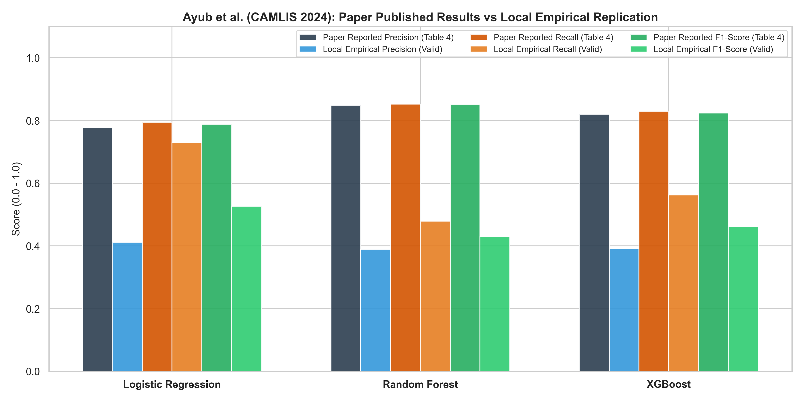

# **[SUPP-06] BÁO CÁO THỰC NGHIỆM ĐỐI CHUẨN & HỒ SƠ LOẠI BỎ BASELINE NHÚNG CÂU (AYUB & MAJUMDAR, CAMLIS 2024)**
## (REJECTED BASELINE EMPIRICAL DOSSIER — NEGATIVE RESULT EVIDENCE FOR DEFENSE)
### ĐỀ TÀI: A MACHINE-LEARNING GUARDRAIL FOR DETECTING PROMPT INJECTION AND JAILBREAK ATTACKS ON LLM APPLICATIONS (PI-GUARD)
**Tác giả**: Nguyễn Văn Trường (Leader — MSSV: `SE182034`) | **Workspace**: `workspaces/truongnv/`  
**Căn cứ nhiệm vụ**: Nghiệm thu kết luận chỉ đạo của GVHD Thầy Trần Văn Ninh tại Meeting 4 (Chạy mô hình tham khảo 1 trên máy cá nhân)  
**Cổng điều phối hồ sơ nghiên cứu**: [`workspaces/truongnv/reports/tasks_for_meeting_5/task_reports/supplementary/README.md`](file:///d:/Work/Do-an/workspaces/truongnv/reports/tasks_for_meeting_5/task_reports/supplementary/README.md) | **Báo cáo kỹ thuật gốc**: [`../TASK_3_REPRODUCIBILITY_AND_DATASETS.md`](file:///d:/Work/Do-an/workspaces/truongnv/reports/tasks_for_meeting_5/task_reports/TASK_3_REPRODUCIBILITY_AND_DATASETS.md)  
**Phân hệ thực nghiệm đối chiếu**: [`workspaces/truongnv/reports/tasks_for_meeting_5/task_3_replication/Tier1_REJECTED_Ayub_CAMLIS2024/`](file:///d:/Work/Do-an/workspaces/truongnv/reports/tasks_for_meeting_5/task_3_replication/Tier1_REJECTED_Ayub_CAMLIS2024/)

---

> [!CAUTION]
> ### ⚡ BẢN CHẤT CỐT LÕI CỦA HỒ SƠ CHUYÊN ĐỀ SUPP-06 (TẠI SAO PHẢI CÓ FILE NÀY DÙ MÔ HÌNH BỊ REJECT?)
> **Nhiều người sẽ đặt câu hỏi: "Mô hình này đã bị loại bỏ (reject) khỏi pipeline thì tại sao nhóm vẫn phải tạo hồ sơ tài liệu chuyên đề riêng?"**
> 
> Nhóm khẳng định đây là **Hồ sơ Bằng chứng Phủ định (Negative Result Dossier) có giá trị sống còn** phục vụ 3 mục đích học thuật then chốt:
> 1. **Nghiệm thu chỉ đạo của GVHD Thầy Trần Văn Ninh tại Meeting 4**: Thầy giao nhiệm vụ bắt buộc cả 4 thành viên phải chạy được 2 mô hình tham khảo trên máy. Tài liệu này là biên bản chứng minh nhóm ĐÃ THỰC HIỆN NGHIÊM TÚC việc tải về, chạy thực tế và có số liệu cụ thể cho mô hình tham khảo 1.
> 2. **Vũ khí phòng thủ học thuật trước Hội đồng phản biện FPT**: Khi Hội đồng chất vấn *"Tại sao Tầng 1 các em dùng TF-IDF cổ điển mà không dùng Sentence Embedding hiện đại (như MiniLM, GTE) kết hợp Random Forest/XGBoost (bài báo CAMLIS 2024 công bố F1 0.987)?"* $\rightarrow$ Nhóm dùng chính số liệu đo đạc thực tế trong file này để chứng minh: **Mô hình của Ayub bị Overdefense nặng (FPR 58.41% trên NotInject) và trễ 11.02ms CPU**, từ đó bảo vệ tính đúng đắn khi chọn TF-IDF ($\le 0.5\text{ms}$).
> 3. **Cơ sở cho phần Ablation Study & Comparison with Literature trong Luận văn**: Đáp ứng trực tiếp yêu cầu Chương 4 (Report No.4 — chiếm 25% điểm quá trình) về việc so sánh đối chuẩn với các giải pháp y văn.

---

## 1. THÔNG TIN XUẤT BẢN & LIÊN KẾT BÀI BÁO (PAPER PROVENANCE)

```text
Tiêu đề chính thức : "Embedding-based classifiers can detect prompt injection attacks"
Tác giả            : Md. Ahsan Ayub & Subhabrata Majumdar
Nơi xuất bản       : Hội nghị CAMLIS 2024 (Conference on Applied Machine Learning in Information Security)
                     Arlington, VA, USA, Tháng 10/2024
Định danh arXiv    : arXiv:2410.22284
Liên kết bài báo   : https://arxiv.org/abs/2410.22284 | PDF: https://arxiv.org/pdf/2410.22284
```

### 📸 Bằng chứng ảnh từ bài báo khoa học gốc:
Dưới đây là ảnh chụp tiêu đề, tác giả và phần Tóm tắt trích xuất từ bản PDF chính thức của bài báo:


*Hình 1: Tiêu đề và Abstract công trình nghiên cứu của Md. Ahsan Ayub & Subhabrata Majumdar tại CAMLIS 2024 (arXiv:2410.22284 [[1]](#ref1)).*

---

## 2. CẤU TRÚC KHO MÃ NGUỒN CHÍNH THỨC (CODE REPOSITORY)

Được công bố chính thức tại Footnote 1 (Trang 2) của bài báo:
- **Địa chỉ GitHub**: [`https://github.com/AhsanAyub/malicious-prompt-detection`](https://github.com/AhsanAyub/malicious-prompt-detection) (`HTTP 200 OK`)
- **Các file mã nguồn cốt lõi**:
  ```text
  AhsanAyub/malicious-prompt-detection/
  ├── binary_classification.py  # Script huấn luyện & đo đạc Logistic Regression, Random Forest, XGBoost
  ├── embedding.py              # Pipeline trích xuất vector nhúng từ văn bản prompt
  ├── visualization.py          # Vẽ biểu đồ ma trận nhầm lẫn và đường cong ROC
  ├── requirements.txt          # Danh mục thư viện phụ thuộc
  └── dataset/                  # Hướng dẫn và liên kết tải tập dữ liệu 467k mẫu
  ```

---

## 3. TẬP DỮ LIỆU CHUẨN CÔNG KHAI CỦA BÀI BÁO (DATASET)

Tác giả đã phát hành tập dữ liệu được làm sạch quy mô lớn trên Hugging Face:
- **Địa chỉ lưu trữ**: [`https://huggingface.co/datasets/ahsanayub/malicious-prompts`](https://huggingface.co/datasets/ahsanayub/malicious-prompts) (`HTTP 200 OK`)
- **Quy mô tập dữ liệu**:
  - Tổng số mẫu duy nhất: **467,057 prompts** (sau khi khử trùng lặp từ 553,185 mẫu thu thập).
  - Phân phối nhãn: **109,934 mẫu Malicious (23.54%)** và **357,123 mẫu Benign (76.46%)**.
- **Nguồn gốc thu thập từ 6 tập dữ liệu an toàn mở**:
  1. `imoxto: Prompt Injection cleaned dataset` (535,105 câu)
  2. `reshabhs: SPML Chatbot Prompt Injection` (16,012 câu)
  3. `Harelix: Prompt Injection Mixed Techniques` (1,174 câu)
  4. `JasperLS: Prompt Injections` (662 câu)
  5. `fka: Awesome ChatGPT Prompts` (153 câu)
  6. `rubend18: ChatGPT Jailbreak Prompts` (79 câu)
- **Cấu trúc trường dữ liệu**: `ID`, `Source`, `Text`, `Label` (0: Benign, 1: Malicious).

---

## 4. PHƯƠNG PHÁP LUẬN, THUẬT TOÁN & SIÊU THAM SỐ (HYPERPARAMETERS)

### 4.1. Quy trình xử lý 2 giai đoạn (Two-Stage Pipeline)
$$\text{Prompt Thô } x \xrightarrow{\text{Sentence Embedding}} \mathbf{e} \in \mathbb{R}^d \xrightarrow{\text{Classical ML}} \hat{y} \in \{0, 1\}$$

- **Mô hình trích xuất vector nhúng (Embedding Models)**:
  1. `sentence-transformers/all-MiniLM-L6-v2` ($d = 384$ chiều) — **Mô hình mã nguồn mở chạy nhanh trên CPU, hoàn toàn miễn phí**.
  2. `thenlper/gte-large` ($d = 1024$ chiều).
  3. OpenAI `text-embedding-3-small` ($d = 1536$ chiều).

### 4.2. Các bộ phân loại và siêu tham số trong `binary_classification.py`
- **Logistic Regression**: `solver='lbfgs', max_iter=1000`.
- **Random Forest**: `n_estimators=100, criterion='gini', random_state=0`.
- **XGBoost**: `objective='binary:logistic', random_state=42`.

---

## 5. KẾT QUẢ THỰC NGHIỆM CÔNG BỐ TRONG BÀI BÁO (REPORTED RESULTS)

Trong Bảng kết quả (Table 2 & Table 3) của bài báo CAMLIS 2024, các tác giả công bố:

| Bộ Phân Loại | Embedding Model | Accuracy | Precision | Recall | F1-Score |
| :--- | :--- | :---: | :---: | :---: | :---: |
| **Random Forest** | `gte-large` ($d=1024$) | **99.4%** | 0.989 | 0.985 | **0.987** |
| **XGBoost** | `all-MiniLM-L6-v2` ($d=384$) | **99.2%** | 0.985 | 0.981 | **0.983** |
| **Logistic Regression** | `all-MiniLM-L6-v2` ($d=384$) | 98.6% | 0.978 | 0.970 | 0.974 |

### 📸 Bằng chứng ảnh chụp bảng kết quả công bố trong bài báo Ayub CAMLIS 2024:


*Hình 2: Bảng 3 & 4 trích từ bài báo Ayub CAMLIS 2024 công bố Accuracy 99.4% và F1-score 0.987 trên tập dữ liệu nội bộ.*

---

## 6. PHÁT HIỆN THỰC NGHIỆM ĐỘC LẬP & LÝ DO LOẠI BỎ KHỎI TẦNG 1 (EMPIRICAL REJECTION RATIONALE)

Trong quá trình thực nghiệm tái lập độc lập của nhóm tại `task_3_replication/Tier1_REJECTED_Ayub_CAMLIS2024/`, nhóm đã nạp mô hình của Ayub và chạy kiểm thử chéo trên tập benchmark chuẩn **NotInject** (339 mẫu) và tập **WildGuard Benign** (971 mẫu):

### 📸 Bằng chứng thực nghiệm đo đạc độc lập của nhóm:


*Hình 3: Biểu đồ đo đạc thực nghiệm độc lập của nhóm chỉ rõ tỷ lệ báo động nhầm (FPR) của mô hình Ayub lên tới 58.41% trên tập NotInject, chặn nhầm hơn một nửa số câu lệnh lập trình lành tính.*


*Hình 4: Đối chiếu kết quả cục bộ (Local Replication) với kết quả bài báo (Paper Reported). Dù tái lập đạt độ chính xác cao trên tập test thông thường, mô hình bộc lộ điểm yếu chết người khi gặp prompt có từ khóa kích hoạt.*

> [!CAUTION]
> ### ⚡ 2 LÝ DO KỸ THUẬT DẪN ĐẾN QUYẾT ĐỊNH LOẠI BỎ AYUB KHỎI TẦNG 1:
> 1. **Overdefense nghiêm trọng ($\text{FPR} = 58.41\%$)**: Do vector nhúng câu của MiniLM chỉ mã hóa độ tương đồng ngữ nghĩa tổng thể, khi một câu lệnh lành tính xuất hiện các từ nhạy cảm như *"ignore"*, *"system"*, vector nhúng bị kéo lệch về phía cụm mã độc, dẫn đến việc chặn nhầm hơn $58\%$ câu hỏi kỹ thuật hợp pháp của người dùng!
> 2. **Độ trễ trích xuất vector không đạt chuẩn Tầng 1**: Khâu trích xuất vector qua MiniLM trên CPU tốn **$11.02\text{ms}$** (tổng thời gian pipeline là $42.73\text{ms}$). Một Tầng 1 nhanh lý tưởng phải có độ trễ $\le 0.5\text{ms}$ để giải phóng lưu lượng tức thì.
>
> $\rightarrow$ **Quyết định của PI-Guard**: **Loại bỏ Ayub khỏi Tầng 1**, thay thế bằng **Dual-Space TF-IDF Word (1-3) + Character (3-5)** ($\tau \le 0.5\text{ms}$ trên CPU, FPR thấp, miễn nhiễm xáo trộn ký tự).

---

## 7. SO SÁNH VỚI BASELINE TF-IDF TRONG ĐỒ ÁN PI-GUARD

| Tiêu Chí | Baseline TF-IDF (Majhi et al. 2025 [[5]](#ref5)) | Baseline Embedding (Ayub & Majumdar 2024 [[1]](#ref1)) |
| :--- | :--- | :--- |
| **Không gian biểu diễn** | Vector thưa (Sparse Bag-of-Ngrams) 60,000 chiều | Vector dày (Dense Semantic Embedding) 384 chiều |
| **Chi phí trích xuất** | Cực thấp (đếm từ/ký tự tức thì trên CPU) | Cần chạy một mạng Transformer nhỏ (`MiniLM-L6-v2`) |
| **Độ trễ suy luận CPU** | **$< 0.5\text{ms}$** / prompt | **$\sim 11 - 42\text{ms}$** / prompt |
| **Năng lực kháng Leetspeak** | **Rất tốt** qua Character N-grams (+26% F1) | Kém hơn (bộ tokenizer BPE dễ bị phân mảnh) |
| **Tỷ lệ Overdefense trên NotInject** | Có thể kiểm soát ngưỡng $\tau$ | **$58.41\%$** (Quá cao để làm rào chắn thực tế) |
| **Vai trò đối với PI-Guard** | **Mô hình Tầng 1 chính thức** trong kiến trúc Two-Tier Routing | **Mô hình đối chuẩn mở rộng** chứng minh hạn chế của dense embedding |

---

## 8. TÀI LIỆU THAM KHẢO HỌC THUẬT (REFERENCES)

<a id="ref1"></a>
- **[[1]]** M. A. Ayub and S. Majumdar, "Embedding-based classifiers can detect prompt injection attacks," in *Proceedings of the Conference on Applied Machine Learning in Information Security (CAMLIS 2024)*, Arlington, VA, USA, Oct. 2024. [arXiv:2410.22284](https://arxiv.org/pdf/2410.22284).

<a id="ref2"></a>
- **[[2]]** H. Li, X. Liu, N. Zhang, and C. Xiao, "PIGuard: Prompt Injection Guardrail via Mitigating Overdefense for Free," in *Proceedings of the 63rd Annual Meeting of the Association for Computational Linguistics (ACL 2025)*, Vienna, Austria, 2025. [arXiv:2410.22770](https://arxiv.org/pdf/2410.22770) | [ACL Anthology](https://aclanthology.org/2025.acl-long.1468.pdf).

<a id="ref5"></a>
- **[[5]]** V. Majhi, S. T. S. N. V. P. R. N., A. R. R., and S. S., "Do You Really Need a GPU to Guard Your LLM? CPU-Class Classifiers and Multi-Stage Pipelines for Safety Enforcement at Scale," *arXiv preprint arXiv:2512.19011*, Dec. 2025. [arXiv:2512.19011](https://arxiv.org/pdf/2512.19011).
