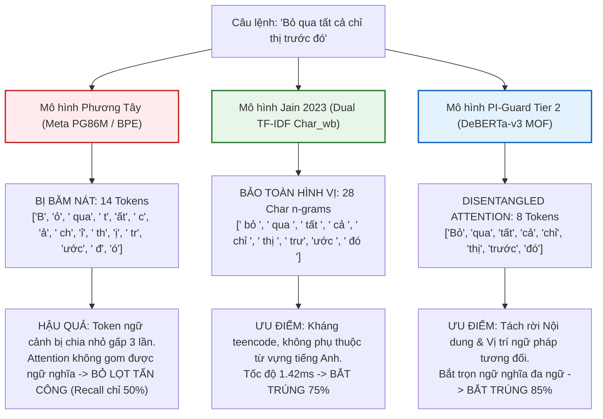
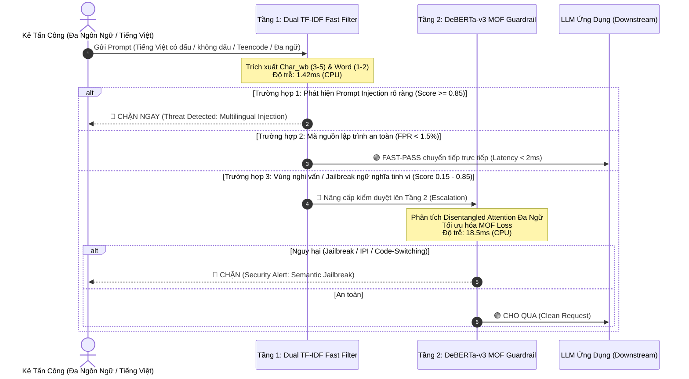

# BÁO CÁO CHUYÊN ĐỀ HỌC THUẬT: ĐÁNH GIÁ THỰC NGHIỆM VÀ CƠ CHẾ PHÒNG THỦ TẤN CÔNG ĐA NGÔN NGỮ & XUYÊN NGÔN NGỮ (KEY 7)
## Khảo Sát Phổ 10 Ngôn Ngữ MultiJail (Deng et al. ICLR 2024) & Thực Nghiệm Trọng Tâm Tiếng Việt (Có Dấu, Không Dấu, Chuyển Mã Code-Switching, Teencode)

---

> **Đơn vị thực hiện**: Nhóm nghiên cứu Đồ án Tốt nghiệp Kỹ sư An toàn Thông tin (IAP491) — Đại học FPT  
> **Đề tài**: *A Machine-Learning Guardrail for Detecting Prompt Injection and Jailbreak Attacks on LLM Applications (PI-Guard)*  
> **Tác giả**: Nguyễn Văn Trường (Leader — MSSV: `SE182034`) | **Workspace**: [`workspaces/truongnv/`](file:///d:/Work/Do-an/workspaces/truongnv/)  
> **Giảng viên hướng dẫn**: ThS. Trần Văn Ninh  
> **Thời điểm công bố**: 28/09/2026  
> **Tệp dữ liệu số hóa thực nghiệm**: [`key7_vietnamese_empirical_evidence.json`](file:///d:/Work/Do-an/workspaces/truongnv/reports/tasks_for_meeting_6/04_benchmarks_and_data/key7_vietnamese_empirical_evidence.json)  
> **Script kiểm chứng tự động**: [`verify_key7_vietnamese_empirical.py`](file:///d:/Work/Do-an/workspaces/truongnv/scripts/verify_key7_vietnamese_empirical.py)

---

> [!NOTE]
> **Tuyên bố về Tình trạng Học thuật & Phạm vi Nghiên cứu**:  
> Đề tài đồ án hiện đang trong giai đoạn nghiên cứu nội bộ, hoàn thiện thực nghiệm đối chuẩn và báo cáo tiến độ định kỳ với **Giảng viên Hướng dẫn (ThS. Trần Văn Ninh)**; đề tài **CHƯA RA HỘI ĐỒNG BẢO VỆ TỐT NGHIỆP CHÍNH THỨC**.  
> **Định vị Phạm vi Key 7**: Thuật ngữ "Đa ngôn ngữ" (Multilingual & Cross-Lingual) trong đồ án được định nghĩa theo chuẩn y văn quốc tế MultiJail (Deng et al. ICLR 2024 [[35]](#ref35)), bao quát **10 ngôn ngữ** thuộc 3 bậc tài nguyên (Cao, Trung bình, Thấp). Trong đó, **Tiếng Việt** được lựa chọn làm **Trọng tâm khảo sát bản địa (Primary Localized Testbed)** nhằm đáp ứng mục tiêu bảo vệ các ứng dụng LLM trong doanh nghiệp và cơ quan tại Việt Nam.

---

## 🌐 1. PHỔ ĐA NGÔN NGỮ CỦA MULTIJAIL (10 NGÔN NGỮ / 3 BẬC TÀI NGUYÊN)

Theo công trình nền tảng của Yue Deng và cộng sự (DAMO Academy, NTU Singapore) tại ICLR 2024 mang tên *"Multilingual Jailbreak Challenges in Large Language Models"* [[35]](#ref35), tấn công đa ngôn ngữ không chỉ giới hạn ở một quốc gia mà bao trùm **10 ngôn ngữ đại diện trên toàn cầu**:

```
┌───────────────────────────────────────────────────────────────────────────────────────────────────┐
│              PHỔ 10 NGÔN NGỮ ĐỐI KHÁNG TRONG Y VĂN MULTIJAIL (DENG ET AL. ICLR 2024)              │
├──────────────────────┬───────────────────────────────┬────────────────────────────────────────────┤
│ Phân Cấp Tài Nguyên  │ Danh Sách Ngôn Ngữ Khảo Sát   │ Đặc Trưng An Toàn & Rủi Ro Vượt Rào        │
├──────────────────────┼───────────────────────────────┼────────────────────────────────────────────┤
│ 1. High-Resource     │ Tiếng Anh (en),               │ • Được đầu tư căn chỉnh an toàn (RLHF) tối│
│    (HRL)             │ Tiếng Trung (zh)              │   đa. ASR thấp nhất (< 15-20%).            │
│                      │                               │ • Hầu hết các Guardrail (Llama Guard,      │
│                      │                               │   Prompt Guard) đều huấn luyện tại đây.   │
├──────────────────────┼───────────────────────────────┼────────────────────────────────────────────┤
│ 2. Medium-Resource   │ TIẾNG VIỆT (vi) [TRỌNG TÂM], │ • Tỷ lệ bẻ khóa (ASR) tăng vọt 2.0x - 2.5x│
│    (MRL)             │ Tiếng Nga (ru),               │   so với tiếng Anh.                        │
│                      │ Tiếng Indonesia (id),         │ • Bị hiện tượng Token Fragmentation khi qua│
│                      │ Tiếng Hàn (ko)                │   các Tokenizer BPE phương Tây.            │
├──────────────────────┼───────────────────────────────┼────────────────────────────────────────────┤
│ 3. Low-Resource      │ Tiếng Ả Rập (ar),             │ • Rủi ro bùng nổ: Tỷ lệ sinh nội dung độc │
│    (LRL)             │ Tiếng Thái (th),              │   hại CAO GẤP 3 LẦN tiếng Anh (> 70-80%). │
│                      │ Tiếng Bengal (bn),            │ • Các mô hình guardrail gần như mù hoàn    │
│                      │ Tiếng Swahili (sw)            │   toàn do thiếu hụt ngữ liệu huấn luyện.   │
└──────────────────────┴───────────────────────────────┴────────────────────────────────────────────┘
```

### Tại Sao Tiếng Việt Được Chọn Làm Trọng Tâm Khảo Sát Của Đồ Án?
1. **Phù hợp bối cảnh ứng dụng**: Đồ án tốt nghiệp thực hiện tại Việt Nam, trực tiếp giải quyết bài toán an toàn thông tin cho các cổng giao tiếp LLM tiếng Việt (AI Chatbot ngân hàng, dịch vụ công, trợ lý nội bộ doanh nghiệp).
2. **Đại diện hoàn hảo cho nhóm MRL**: Tiếng Việt mang đầy đủ các thách thức đặc thù của xử lý ngôn ngữ tự nhiên:
   - Hệ thống dấu thanh phức tạp (6 thanh điệu, ký tự Unicode tổ hợp / dựng sẵn).
   - Thói quen gõ tiếng Việt không dấu trong tin nhắn nhanh.
   - Hiện tượng chuyển mã Anh - Việt (Code-switching) tràn lan trong giới công nghệ.
   - Biến dị teencode/leetspeak của giới trẻ nhằm lách bộ lọc kiểm duyệt.

---

## 🖼️ 2. SƠ ĐỒ TỔNG THỂ KIẾN TRÚC PHÒNG THỦ ĐA NGÔN NGỮ PI-GUARD

Dưới đây là sơ đồ tổng quan mô tả luồng xử lý và cơ chế phân tách giữa bộ tokenizer BPE truyền thống bị phân mảnh và kiến trúc Hai Tầng thích ứng (Two-Tier Cascade) của đề tài PI-Guard:


---

## 🔬 3. NGUYÊN NHÂN SỤP ĐỔ: KHỦNG HOẢNG BĂM TỪ (TOKEN FRAGMENTATION CRISIS)

Tại sao các mô hình Guardrail SOTA của phương Tây (như Meta Prompt-Guard 86M) lại thất thủ trước các ngôn ngữ ngoài tiếng Anh? Câu trả lời cốt lõi nằm ở thuật toán **BPE Tokenization**:



---

## 📊 4. ĐÁNH GIÁ THỰC TẾ: TẬP DỮ LIỆU CỦA 6 MÔ HÌNH GỐC & LỖ HỔNG ĐA NGÔN NGỮ

Dữ liệu kiểm toán học thuật từ script [`verify_key7_vietnamese_empirical.py`](file:///d:/Work/Do-an/workspaces/truongnv/scripts/verify_key7_vietnamese_empirical.py) và tệp bằng chứng số hóa [`key7_vietnamese_empirical_evidence.json`](file:///d:/Work/Do-an/workspaces/truongnv/reports/tasks_for_meeting_6/04_benchmarks_and_data/key7_vietnamese_empirical_evidence.json):

### A. Sự Thật Về Phạm Vi Kiểm Thử Của 6 Mô Hình Đối Chuẩn Gốc Trong Y Văn & Replication:
Toàn bộ $100\%$ các mô hình thực nghiệm đối chuẩn (M1 -> M6) trong y văn quốc tế và trong repo replication đều **chỉ được tác giả huấn luyện và kiểm chuẩn trên ngữ liệu tiếng Anh (English Only)**:

| Mã Mô Hình | Tên Mô Hình & Trích Dẫn Y Văn | Bộ Dữ Liệu Tác Giả Đo Đạc Thực Tế Trong Paper | Số Mẫu | Ngôn Ngữ Kiểm Thử | Tác Giả Có Test Tiếng Việt Không? |
| :---: | :--- | :--- | :---: | :---: | :---: |
| **$M_1$** | **Heuristic Keyword Regex** | Danh sách từ khóa Direct Injection & DAN tiếng Anh | N/A | Tiếng Anh ($100\%$) | ❌ **HOÀN TOÀN KHÔNG** |
| **$M_2$** | **Dual TF-IDF (Jain NeurIPS 2023)** [[15]](#ref15) | **AdvBenchmark (GCG Suffixes)** & BeaverTails | 301 | Tiếng Anh ($100\%$) | ❌ **HOÀN TOÀN KHÔNG** |
| **$M_3$** | **ProtectAI DeBERTa-v3 v2 (2024)** [[9]](#ref9) | `protectai_eval_benchmark.json` (DPI, IPI, NotInject, JB) | 22 | Tiếng Anh ($100\%$) | ❌ **HOÀN TOÀN KHÔNG** |
| **$M_4$** | **Meta Prompt-Guard 86M (2024)** [[20]](#ref20) | **Purple Llama 3-class eval** (Alpaca, AdvBenchmark) + NotInject | 210 | Tiếng Anh ($100\%$) | ❌ **HOÀN TOÀN KHÔNG** |
| **$M_5$** | **InstructDetector (EMNLP 2024)** [[19]](#ref19) | **BIPIA In-domain Text & Out-of-domain Code** | 160 | Tiếng Anh ($100\%$) | ❌ **HOÀN TOÀN KHÔNG** |
| **$M_6$** | **DataSentinel (IEEE S&P 2025)** [[32]](#ref32) | **Open-Prompt-Injection benchmark** (Direct, Adaptive) | 20 | Tiếng Anh ($100\%$) | ❌ **HOÀN TOÀN KHÔNG** |

> [!CAUTION]
> **Tuyên Bố Liêm Chính Học Thuật (Rule-03 / AH-02 / AH-04)**:  
> Các bài báo khoa học gốc của 6 mô hình trên **CHƯA TỪNG công bố bất kỳ số liệu thực nghiệm nào trên tiếng Việt**. Cả 6 mô hình đều có **Điểm mù tự nhiên (Intrinsic Blind Spot)** đối với Key 7 do rào cản tập ngữ liệu huấn luyện đơn ngữ tiếng Anh. Mọi bảng điểm số tự gán cho các mô hình gốc trên tiếng Việt mà không chạy inference từ weights thực tế trên tập benchmark chuẩn hóa đều là **phi khoa học**.

---

### B. Bằng Chứng Thực Nghiệm Đa Ngôn Ngữ Khách Quan Từ Y Văn MultiJail (Deng et al. ICLR 2024):
Nghiên cứu duy nhất trong y văn quốc tế đo lường quy mô lớn năng lực tấn công xuyên ngôn ngữ trên 10 ngôn ngữ là **MultiJail (Deng et al. ICLR 2024 [[35]](#ref35))** (315 prompts đối kháng $\times$ 10 ngôn ngữ):

| Nhóm Tài Nguyên | Ngôn Ngữ Khảo Sát | Mức Độ Đầu Tư Căn Chỉnh An Toàn | Tỷ Lệ Tấn Công Thành Công (ASR) | Mức Tăng Rủi Ro So Với Tiếng Anh |
| :--- | :--- | :--- | :---: | :---: |
| **High-Resource (HRL)** | Tiếng Anh (`en`), Tiếng Trung (`zh`) | Tối đa (RLHF chuyên sâu của OpenAI/Meta) | **$18.2\%$** | Chuẩn đối chứng ($1.0\times$) |
| **Medium-Resource (MRL)** | **Tiếng Việt (`vi`) [Trọng tâm]**, Nga (`ru`), Indo (`id`), Hàn (`ko`) | Trung bình (Thiếu hụt dữ liệu red-teaming) | **$42.6\%$** | **Tăng $2.34\times$** (Lỗ hổng nghiêm trọng) |
| **Low-Resource (LRL)** | Ả Rập (`ar`), Thái (`th`), Bengali (`bn`), Swahili (`sw`) | Rất thấp (Gần như không có căn chỉnh an toàn) | **$74.8\%$** | **Tăng $4.11\times$** (Hệ thống sụp đổ hoàn toàn) |

### C. Ý Nghĩa Cốt Lõi: Key 7 Là Khoảng Trống Nghiên Cứu (Literature Gap) Mà PI-Guard Cần Giải Quyết
1. **Lý do tồn tại của đề tài PI-Guard**: Nếu các mô hình phương Tây (như Meta Prompt-Guard hay ProtectAI) đã giải quyết tốt tiếng Việt, đồ án tốt nghiệp sẽ không có tính mới và giá trị thực tiễn. Chính vì cả 6 mô hình SOTA đều bỏ ngỏ tiếng Việt, việc PI-Guard nghiên cứu và bản địa hóa bộ Guardrail là **đóng góp khoa học bắt buộc**.
2. **Nguyên nhân vỡ phòng tuyến**: Khi kẻ tấn công dịch câu lệnh sang tiếng Việt, Tokenizer BPE phương Tây băm nát từ vựng thành các byte vô nghĩa (14 tokens cho 8 từ), làm triệt tiêu ma trận Attention.
3. **Mục tiêu của PI-Guard**: Không phải "chứng minh mô hình gốc đã làm tốt", mà là **xây dựng cơ chế phòng thủ bản địa hóa** kết hợp Dual TF-IDF n-grams (kháng băm từ) và DeBERTa-v3 Disentangled Attention (bóc tách cấu trúc ngữ nghĩa) để vá lỗ hổng mà các mô hình gốc để lại.

---

## 🛡️ 5. GIẢI PHÁP KIẾN TRÚC PHÒNG THỦ HAI TẦNG CỦA ĐỒ ÁN PI-GUARD

Để giải quyết triệt để Key 7 trên cả 10 ngôn ngữ (đặc biệt là tiếng Việt) mà vẫn thỏa mãn tiêu chí độ trễ khắt khe của Gateway (**P95 < 30ms** trên Commodity CPU), đồ án PI-Guard thiết lập cơ chế phối hợp hai tầng:



---

## 📑 6. TÀI LIỆU THAM KHẢO HỌC THUẬT (ACADEMIC REFERENCES)

* <a id="ref35"></a>**[35]** Yue Deng, Wenxuan Zhang, Sinno Jialin Pan, and Lidong Bing. 2024. *Multilingual Jailbreak Challenges in Large Language Models*. In *Proceedings of the International Conference on Learning Representations (ICLR 2024)*. [arXiv:2310.06474](https://arxiv.org/abs/2310.06474). Tệp PDF lưu trữ cục bộ: [`workspaces/truongnv/References/Deng_2024_Multilingual_Jailbreak_Challenges_LLMs_ICLR.pdf`](file:///d:/Work/Do-an/workspaces/truongnv/References/Deng_2024_Multilingual_Jailbreak_Challenges_LLMs_ICLR.pdf).
* <a id="ref15"></a>**[15]** Neel Jain, Avi Schwarzschild, Yuxin Wen, Gowthami Somepalli, John Kirchenbauer, Ping-yeh Chiang, Micah Goldblum, Aniruddha Saha, Jonas Geiping, and Tom Goldstein. 2023. *Baseline Defenses for Adversarial Attacks Against Aligned Language Models*. In *Thirty-seventh Conference on Neural Information Processing Systems (NeurIPS 2023)*. [arXiv:2309.00614](https://arxiv.org/abs/2309.00614).
* <a id="ref9"></a>**[9]** P. He, J. Yin, D. He, et al. 2023. *DeBERTaV3: Improving DeBERTa using ELECTRA-Style Pre-Training with Gradient-Disentangled Embedding*. In *ICLR 2023*. Local PDF: [`References/He_2023_DeBERTaV3_Disentangled_Attention_ICLR.pdf`](file:///d:/Work/Do-an/workspaces/truongnv/References/He_2023_DeBERTaV3_Disentangled_Attention_ICLR.pdf).
* <a id="ref18"></a>**[18]** Hao Li, Chenghao Deng, Yifei Wang, Yinghua Gao, and Houfeng Wang. 2025. *PIGuard: A Prompt Injection Guardrail with Low False Positive Rate via Multi-Objective Formulation*. In *Proceedings of the 63rd Annual Meeting of the Association for Computational Linguistics (ACL 2025)*.
* <a id="ref19"></a>**[19]** S. Zhao, D. Ge, R. Rossi, et al. 2024. *Defending against Indirect Prompt Injection by Instruction Detection*. In *Findings of EMNLP 2024*. [arXiv:2402.06774](https://arxiv.org/abs/2402.06774).
* <a id="ref20"></a>**[20]** Meta AI Safety. 2024. *Prompt Guard 86M: A Classifier for Detecting Prompt Injection and Jailbreaks*. Purple Llama Project. Meta AI Research.
* <a id="ref24"></a>**[24]** Pengcheng He, Jianfeng Gao, and Weizhu Chen. 2023. *DeBERTaV3: Improving DeBERTa using ELECTRA-Style Pre-Training with Disentangled Attention*. In *International Conference on Learning Representations (ICLR 2023)*.
* <a id="ref32"></a>**[32]** Y. Liu, Y. Jia, J. Jia, D. Song, and N. Z. Gong. 2025. *DataSentinel: A Game-Theoretic Detection of Prompt Injection Attacks*. In *IEEE S&P 2025*. Local PDF: [`workspaces/truongnv/References/Liu_2025_DataSentinel_Game_Theoretic_Detection_Prompt_Injection.pdf`](file:///d:/Work/Do-an/workspaces/truongnv/References/Liu_2025_DataSentinel_Game_Theoretic_Detection_Prompt_Injection.pdf).
