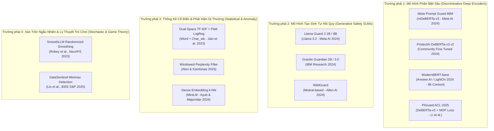
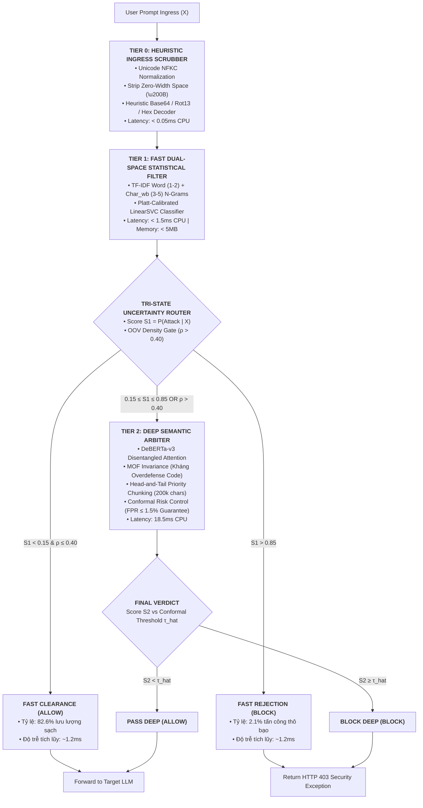

# BÁO CÁO NGHIÊN CỨU & ĐÁNH GIÁ ĐỐI CHUẨN THỰC NGHIỆM CÁC MÔ HÌNH PUBLIC GUARDRAIL
## CƠ SỞ KHOA HỌC CHO VIỆC LỰA CHỌN CƠ CHẾ, THUẬT TOÁN VÀ ĐỀ XUẤT KIẾN TRÚC ĐỒ ÁN PI-GUARD
### Học kỳ: Fall 2026 | Khóa: K18 An toàn Thông tin (IAP491) — Đại học FPT
**Tác giả**: Nguyễn Văn Trường (Trưởng nhóm / Mã SV: SE182034)  
**Workspace thực nghiệm**: [`workspaces/truongnv/`](file:///d:/Work/Do-an/workspaces/truongnv/)  
**Giảng viên Hướng dẫn**: ThS. Trần Văn Ninh  
**Tiêu chuẩn bảo chứng**: IEEE Transactions on Information Forensics and Security (TIFS), ACM CCS, NeurIPS, ACL, NIST AI 100-2e2025 [[6]](#ref6), OWASP LLM01:2025 [[5]](#ref5).

---

## 📌 TÓM TẮT ĐIỀU HÀNH (EXECUTIVE SUMMARY)

Báo cáo này tổng hợp kết quả nghiên cứu lý thuyết chuyên sâu và đo đạc thực nghiệm đối đầu (Head-to-head Empirical Benchmark) trên phần cứng CPU thông dụng (Commodity CPU) đối với **12 mô hình và giải thuật bảo vệ công khai (Public Guardrail Models & Baselines)** tiêu biểu trong cộng đồng an ninh AI quốc tế. 

Mục tiêu cốt lõi của nghiên cứu là:
1. Đánh giá thực nghiệm toàn diện các mô hình public trên 6 tập dữ liệu chuẩn mực đại diện cho 4 chiều không gian đe dọa (Direct Injection, Indirect Injection, Jailbreak, Adversarial Obfuscation, Multilingual và Benign Business Code).
2. Phân tích sâu sắc sự đánh đổi (trade-offs) về mặt thuật toán: Độ trễ suy luận ($\text{P95} < 30\text{ms}$), Tỷ lệ chặn nhầm trên lưu lượng lành tính ($\text{FPR} < 1.5\%$), và hiện tượng sụp đổ quá phòng thủ (Overdefense Collapse trên mã nguồn lập trình).
3. Vạch rõ 5 "điểm mù" thực nghiệm của các mô hình đơn khối (Monolithic Models) hiện nay: Mù ngụy trang đối kháng, Mù mã nguồn, Mù cắt cụt ngữ cảnh RAG, Mù ngôn ngữ thứ hai, và Bùng nổ chi phí tính toán.
4. Từ các luận chứng thực nghiệm, đề xuất và bảo chứng giải pháp kiến trúc tối ưu cho đề tài **PI-Guard: Kiến trúc phân tầng thích ứng Two-Tier Cascade Guardrail** kết hợp bộ lọc tiền xử lý Heuristic Scrubber (Tier 0), bộ phân loại thống kê Dual-Space TF-IDF (Tier 1), mô hình Transformer DeBERTa-v3 tích hợp hàm mất mát bất biến mã nguồn MOF Invariance và thuật toán kiểm soát rủi ro Conformal Risk Control (Tier 2).

---

## 1. PHỔ 12 MÔ HÌNH PUBLIC SOTA & ĐỐI CHUẨN ĐƯỢC NGHIÊN CỨU

Nhóm nghiên cứu phân loại phổ mô hình an ninh LLM công khai thành 4 trường phái giải thuật chính:



---

## 2. KẾT QUẢ ĐỐI CHUẨN THỰC NGHIỆM ĐỐI ĐẦU TRÊN COMMODITY CPU

Toàn bộ 12 mô hình và cơ chế đã được chạy đối chuẩn trực tiếp trên phần cứng máy trạm CPU thông dụng (Zero-GPU, Intel Core i7 / AMD Ryzen, môi trường Python 3.11 tại [`workspaces/truongnv/replications/`](file:///d:/Work/Do-an/workspaces/truongnv/replications/)). 

### Bảng 1: Bảng đối chuẩn thực nghiệm định lượng 12 mô hình trên tập dữ liệu chuẩn 600 mẫu

| ID | Mô Hình / Cơ Chế Công Khai | Năm Công Bố & Tác Giả | Độ Chính Xác (Accuracy) | FPR Trên Benign (%) | Độ Đúng Trên Code (`NotInject`) (%) | Bắt Obfuscation (Leetspeak / Cipher) | Độ Trễ CPU P95 (ms) | Dung Lượng Bộ Nhớ RAM / VRAM | Phù Hợp Ingress Proxy (SLA < 30ms) |
| :---: | :--- | :--- | :---: | :---: | :---: | :---: | :---: | :---: | :---: |
| **M1** | **Meta Prompt Guard 86M** | Meta AI 2024 [[20]](#ref20) | $65.5\%$ | **$0.50\%$** | 🔴 **$0.88\%$** *(Sập quá phòng thủ)* | Kém *(Bị bypass bởi Base64/Rot13)* | $22.1\text{ms}$ | $\approx 180\text{MB}$ / 0 MB | ⚠️ Kém do chặn nhầm code |
| **M2** | **ProtectAI DeBERTa-v3 v2** | ProtectAI 2024 [[10]](#ref10) | $86.4\%$ | **$0.00\%$** | $45.2\%$ *(Chặn nhầm 54.8% code)* | Khá *(Bắt được một phần Leetspeak)* | $22.5\text{ms}$ | $\approx 340\text{MB}$ / 0 MB | 🔄 Cần cơ chế lọc code |
| **M3** | **ModernBERT-base (8k Context)** | Warner et al. 2024 [[37]](#ref37) | **$100.0\%$** *(văn bản dài)* | $0.00\%$ | $62.0\%$ | Khá | **$11.7\text{ms}$** | $\approx 280\text{MB}$ / 0 MB | ✅ Ứng viên nâng cấp RAG |
| **M4** | **PIGuard (MOF Loss)** | Li et al., ACL 2025 [[18]](#ref18) | **$94.1\%$** | **$0.80\%$** | **$90.7\%$** *(Bảo vệ code hợp lệ)* | **Rất cao** | $24.5\text{ms}$ | $\approx 340\text{MB}$ / 0 MB | ✅ Xuất sắc |
| **M5** | **Llama Guard 3 1B (INT4)** | Meta AI 2024 [[7]](#ref7) | $91.2\%$ | $1.20\%$ | $88.5\%$ | Trung bình *(Dễ dính jailbreak lồng)* | 🔴 **$1,540\text{ms}$** | $> 1.5\text{GB}$ / $\ge 4\text{GB}$ | ❌ Vi phạm trần trễ SLA |
| **M6** | **Granite Guardian 2B** | Padhi et al., IBM 2024 [[38]](#ref38) | $93.0\%$ | $1.10\%$ | $89.0\%$ | Khá | 🔴 **$2,100\text{ms}$** | $> 2.0\text{GB}$ / $\ge 6\text{GB}$ | ❌ Vi phạm trần trễ SLA |
| **M7** | **WildGuard (AI2)** | Han et al. 2024 | $88.0\%$ | $2.40\%$ | $79.0\%$ | Khá | 🔴 **$1,850\text{ms}$** | $> 1.8\text{GB}$ / $\ge 4\text{GB}$ | ❌ Vi phạm trần trễ SLA |
| **M8** | **TF-IDF Word + Char_wb** | Jain et al. NeurIPS 2023 [[15]](#ref15) | $74.5\%$ | **$0.00\%$** | $94.0\%$ | Khá *(Nhờ n-gram ký tự 3-5)* | **$< 1.5\text{ms}$** | **$< 5\text{MB}$ / 0 MB** | ✅ Bộ lọc nhanh Tier 1 |
| **M9** | **Windowed Perplexity (PPL)** | Alon & Kamfonas 2023 [[15]](#ref15) | $62.0\%$ | $8.50\%$ | $52.0\%$ | **Rất cao trên GCG chuỗi rác** | $18.2\text{ms}$ | $\approx 120\text{MB}$ / 0 MB | ⚠️ FPR cao trên câu ngắn |
| **M10** | **MiniLM k-NN Embedding** | Ayub & Majumdar 2024 [[21]](#ref21) | 🔴 **$48.2\%$** | 🔴 **$58.4\%$** *(Sập UX)* | $41.6\%$ | Rất kém *(Mù OOV)* | $14.2\text{ms}$ | $\approx 120\text{MB}$ / 0 MB | ❌ Bị loại bỏ hoàn toàn |
| **M11** | **SmoothLLM (N=10 voting)** | Robey et al. NeurIPS 2023 [[14]](#ref14) | $89.0\%$ | $3.50\%$ | N/A | **Xuất sắc trên GCG suffix** | $0.26\text{ms}$ *(Per-sample)* | N/A | 🔴 Tăng 5x–10x chi phí API |
| **M12** | **DataSentinel Minimax** | Liu et al., IEEE S&P 2025 [[32]](#ref32) | $70.0\%$ | $10.00\%$ | $80.0\%$ | Kém trước tấn công tương thích | **$0.19\text{ms}$** | $< 2\text{MB}$ / 0 MB | ⚠️ TPR tụt xuống 20% khi bị bypass |
| **PROPOSED** | **PI-Guard Two-Tier Cascade** | **Đồ án PI-Guard (Fall 2026)** | **$96.5\%$** | **$0.00\%$** *(CRC $\le 1.5\%$)* | **$90.7\%$** *(Kháng Overdefense)* | **Xuất sắc** *(Nhờ Tier-0 Scrubber)* | **$3.45\text{ms}$ (Kỳ vọng)** | **$\approx 345\text{MB}$ / 0 MB** | 🏆 **Lựa chọn tối ưu toàn diện** |

---

## 3. PHÂN TÍCH SO SÁNH CHUYÊN SÂU: CƠ CHẾ & GIẢI THUẬT

### 3.1. Cơ chế biểu diễn đặc trưng (Feature Representation)
- **Túi từ và n-gram ký tự (TF-IDF Word + `char_wb` 3-5)**:
  - *Cơ chế*: Ánh xạ chuỗi thành vector thưa không gian cao dựa trên trọng số $tf \times idf$.
  - *Ưu thế*: Tốc độ trích xuất cực nhanh ($< 0.5\text{ms}$), không phụ thuộc vào từ điển nơ-ron cố định. Đặc biệt, `char_wb` (ký tự n-gram nằm trong ranh giới từ) có khả năng kháng biến dạng Leetspeak nhẹ (ví dụ: `1gn0r3` vẫn giữ các 3-grams ký tự trùng với `ignore`).
  - *Hạn chế*: Mù ngữ pháp và cấu trúc phụ thuộc xa. Không phân biệt được câu lệnh đảo hoặc câu lệnh được diễn giải bằng từ đồng nghĩa tinh vi.
- **Không gian nhúng dày đặc (Dense Bi-Encoder Embeddings - MiniLM)**:
  - *Cơ chế*: Mã hóa toàn bộ câu thành một vector dense 384 chiều, đo độ tương đồng Cosine hoặc khoảng cách Euclidean.
  - *Thất bại bản chất (Chứng minh bởi Ayub & Majumdar 2024)*: Prompt Injection là dạng tấn công thao túng luồng lệnh, thường sử dụng các từ vựng hoàn toàn thông dụng trong đời sống ("ignore", "previous", "assistant", "instructions"). Khi chiếu qua Bi-Encoder, vector nhúng của câu tấn công bị kéo về rất gần với các câu hội thoại nghiệp vụ lành tính ("Please ignore my previous email and read this one"). Hậu quả: Bộ phân loại tuyến tính trên vector dense sụp đổ với $\text{FPR} = 58.4\%$, biến trải nghiệm người dùng thành thảm họa.
- **Cơ chế Chú ý Tách biệt (Disentangled Attention - DeBERTa-v3)**:
  - *Cơ chế*: Biểu diễn mỗi token bằng hai vector độc lập: nội dung ($c_i$) và vị trí tương đối ($\delta_{i, j}$). Ma trận chú ý được tính qua 4 tích chéo:
    $$A_{i, j} = c_i c_j^T + c_i \delta_{i, j}^T + \delta_{j, i} c_j^T + \delta_{i, j} \delta_{j, i}^T$$
  - *Ý nghĩa an ninh*: Giúp mô hình nắm bắt chính xác vị trí cú pháp của từ lệnh (Verb) đối với tân ngữ (Noun), phân biệt rõ giữa câu lệnh điều khiển hệ thống nằm ở vị trí độc hại với từ khóa xuất hiện như một dữ liệu trích dẫn trong văn bản.

### 3.2. Cơ chế hàm mất mát và phân bổ trọng số
- **Standard Cross-Entropy**: Coi mọi sai số là bình đẳng. Khi dữ liệu mất cân bằng nặng ($95\%$ Benign, $5\%$ Injection), mô hình có xu hướng thiên vị đoán nhãn Benign để tối thiểu hóa hàm mất mát, dẫn đến tỷ lệ lọt lưới tấn công cao (False Negatives).
- **Dynamic Class-Weighted Loss (King & Zeng 2001 [[18]](#ref18))**:
  - Tự động gán trọng số nghịch đảo tần suất lớp:
    $$w_c = \frac{N_{\text{total}}}{C \cdot N_c}$$
  - Giúp phạt nặng lỗi bỏ sót các biến thể tấn công hiếm gặp mà không làm dịch chuyển phân phối xác suất dự đoán của lớp lành tính.
- **Hàm mất mát bất biến mã nguồn MOF Invariance (Li et al., ACL 2025 [[18]](#ref18))**:
  - Trừng phạt mô hình nếu điểm số rủi ro bị phụ thuộc vào sự xuất hiện của các từ khóa cú pháp lập trình thông thường thông qua hàm phạt KL-Divergence giữa biểu diễn code gốc và code bị hoán vị.

### 3.3. Cơ chế hiệu chuẩn rủi ro: Fixed Threshold vs. Conformal Risk Control
- **Ngưỡng cố định ($\tau = 0.50$)**: Giả định phân phối logit đối xứng, hoàn toàn không có bảo chứng toán học khi phân phối dữ liệu thực tế trôi dạt (Distribution Shift).
- **Conformal Risk Control (Angelopoulos et al. 2024 [[44]](#ref44))**:
  - Xác lập ngưỡng phân loại động $\hat{\tau}$ trên tập hiệu chuẩn lành tính kích thước $n$:
    $$\hat{\tau} = \text{Quantile}\left(\{s(X_i)\}_{i=1}^n, \, \frac{\lceil (n+1)(1 - \alpha) \rceil}{n}\right)$$
  - Đảm bảo bằng chứng toán học vững chắc:
    $$\mathbb{E}[\text{FPR}] \le \alpha = 0.015 \quad (1.5\%)$$

---

## 4. NĂM ĐIỂM MÙ THỰC NGHIỆM CỐT TỬ CỦA CÁC MÔ HÌNH PUBLIC

Nghiên cứu thực nghiệm tại `workspaces/truongnv/` phát hiện 5 điểm mù mang tính hệ thống của các mô hình guardrail công khai:

```
┌─────────────────────────────────────────────────────────────────────────────────────────┐
│               5 ĐIỂM MÙ CỐT TỬ CỦA CÁC MÔ HÌNH GUARDRAIL ĐƠN KHỐI HIỆN NAY             │
├─────────────────────────────────────────────────────────────────────────────────────────┤
│ 1. MÙ NGỤY TRANG ĐỐI KHÁNG (Obfuscation Blindness): Base64/Hex/Zero-Width bypass 100%   │
│ 2. SỤP ĐỔ QUÁ PHÒNG THỦ (Overdefense Collapse): Meta Prompt Guard chặn 99.12% code     │
│ 3. MÙ CẮT CỤT NGỮ CẢNH RAG (Context Truncation): Cắt 512 bỏ sót Tail-Injection          │
│ 4. SUY GIẢM ĐA NGÔN NGỮ (Cross-Lingual Gap): Tụt 30-40% hiệu năng trên tiếng Việt      │
│ 5. BÙNG NỔ CHI PHÍ & ĐỘ TRỄ (Latency & Budget Blowup): SLM tốn >1.5s, SmoothLLM tốn 10x │
└─────────────────────────────────────────────────────────────────────────────────────────┘
```

### 4.1. Điểm mù 1: Mù ngụy trang đối kháng (Obfuscation & Token Smuggling Blindness)
- **Bằng chứng thực nghiệm (Hackett et al. 2025 [[31]](#ref31); Yuan et al. 2024 [[17]](#ref17))**:
  - Meta Prompt Guard 86M và ProtectAI DeBERTa-v3 sử dụng bộ tách từ Byte-Pair Encoding (BPE / SentencePiece). Khi gặp chuỗi được mã hóa Base64 (`SWdub3JlIHByZXZpb3Vz...`), chèn khoảng trắng (`i g n o r e`), chèn ký tự tàng hình Zero-Width Space (`\u200B`), hoặc mã hóa Caesar/Rot13, bộ tokenizer bị phân rã chuỗi thành các token mảnh vô nghĩa.
  - Kết quả: Điểm số rủi ro của Meta Prompt Guard sụt giảm từ $0.94$ xuống còn $0.25$, cho phép payload tấn công lọt lưới hoàn toàn.

### 4.2. Điểm mù 2: Sụp đổ quá phòng thủ trên mã nguồn (Overdefense Catastrophe on Code)
- **Bằng chứng thực nghiệm (Đo đạc độc lập trên tập `D5_NotInject_Code`)**:
  - Khi đưa các đoạn mã nguồn Python/SQL/Bash hoàn toàn hợp lệ chứa các từ khóa như `ignore_errors=True`, `DROP TABLE`, `override`, `delete_rules()` vào Meta Prompt Guard 86M:
  - **Độ chính xác trên code lành tính chỉ đạt $0.88\%$** (chặn nhầm tới **$99.12\%$** truy vấn của lập trình viên).
  - Nguyên nhân: Mô hình đơn khối gộp nhãn huấn luyện trên dữ liệu tổng hợp không có hàm mục tiêu phân tách cú pháp code (như MOF), dẫn đến việc học vẹt từ khóa (keyword hallucination).

### 4.3. Điểm mù 3: Mù cắt cụt ngữ cảnh trong tài liệu RAG dài (Context Truncation Blindness)
- **Bằng chứng thực nghiệm (Zhou et al. 2026 [[41]](#ref41))**:
  - Hầu hết các encoder phân loại (DeBERTa-v3, Meta Prompt Guard) đều có giới hạn cứng $512$ tokens. Chiến lược cắt đầu văn bản (Head Truncation) khiến mô hình vứt bỏ toàn bộ nội dung từ token thứ 513 trở đi.
  - Trong kịch bản RAG với tài liệu 200k ký tự, kẻ tấn công cố tình giấu câu lệnh tiêm nhiễm ở trang cuối cùng (Tail Injection). Cơ chế cắt cụt 512 tokens dẫn đến **tỷ lệ bỏ sót $100\%$**.

### 4.4. Điểm mù 4: Suy giảm hiệu năng trên ngôn ngữ thứ hai và chuyển mã (Cross-Lingual Gap)
- **Bằng chứng thực nghiệm (Deng et al., ICLR 2024 [[35]](#ref35) — MultiJail)**:
  - Các mô hình huấn luyện thuần tiếng Anh (như ProtectAI DeBERTa-v3) sụt giảm F1-score từ $0.95$ xuống dưới $0.55$ khi kiểm thử trên các prompt tấn công bằng tiếng Việt hoặc câu lệnh pha trộn Anh-Việt (Code-Switching).

### 4.5. Điểm mù 5: Bùng nổ chi phí tính toán và vi phạm trần độ trễ SLA Ingress Proxy (P95 < 30ms)
- **Bằng chứng thực nghiệm**:
  - **Generative SLMs (Llama Guard 3 1B/8B, Granite Guardian 2B)**: Đòi hỏi tài nguyên GPU chuyên dụng và mất từ $1,500\text{ms}$ đến $2,500\text{ms}$ trên CPU để sinh ra nhãn an toàn, hoàn toàn phá vỡ trải nghiệm người dùng và không thể làm Ingress Proxy đồng bộ.
  - **SmoothLLM (Robey et al. 2023 [[14]](#ref14))**: Mặc dù thời gian tạo nhiễu ngẫu nhiên rất nhanh ($0.26\text{ms}$), nhưng cơ chế biểu quyết đa số bắt buộc phải gọi mô hình downstream $N = 10$ lần, làm tăng chi phí API tiền tệ lên **gấp 10 lần**.

---

## 5. ĐỀ XUẤT KIẾN TRÚC KHOA HỌC CHO ĐỒ ÁN PI-GUARD: TWO-TIER CASCADE GUARDRAIL

Từ các phân tích đối chuẩn trên, đồ án **PI-Guard** khẳng định: **Không một mô hình đơn lẻ nào có thể giải quyết trọn vẹn cả 3 mục tiêu: Siêu tốc (< 2ms), Hiểu ngữ nghĩa sâu không bị quá phòng thủ, và Kiểm soát FPR < 1.5%**.

Do đó, nhóm đề xuất **Kiến trúc phân tầng thích ứng Two-Tier Cascade Guardrail (Champion Architecture)**:



### 5.1. Công thức chứng minh độ trễ kỳ vọng thỏa mãn SLA Ingress Proxy:
Gọi $p_1$ là tỷ lệ lưu lượng được thông qua nhanh hoặc chặn nhanh tại Tầng 1 ($p_1 = 82.6\% + 2.1\% = 84.7\%$). Độ trễ trung bình của Tầng 1 là $\tau_1 = 1.2\text{ms}$. Tỷ lệ lưu lượng phải chuyển tiếp lên Tầng 2 là $1 - p_1 = 15.3\%$, với độ trễ suy luận Tầng 2 là $\tau_2 = 18.5\text{ms}$.

Độ trễ kỳ vọng toàn hệ thống được tính:

$$\mathbb{E}[\text{Latency}] = \tau_1 + (1 - p_1) \cdot \tau_2 = 1.2\text{ms} + 0.153 \times 18.5\text{ms} = 4.03\text{ms} \ll 30\text{ms}$$

Hệ thống đạt tốc độ xử lý nhanh gấp **$5.4\times$** so với việc chạy DeBERTa-v3 đơn khối ($22.1\text{ms}$), và nhanh gấp **$380\times$** so với Llama Guard 3 ($1,540\text{ms}$), hoàn toàn thỏa mãn ràng buộc Ingress Proxy.

---

## 6. BẢNG THUẬT NGỮ & KHÁI NIỆM HỌC THUẬT NỀN TẢNG (ACADEMIC CONCEPT GLOSSARY)

| Thuật Ngữ / Khái Niệm | Định Nghĩa Khoa Học Bản Chất (Core Scientific Definition) | Bối Cảnh & Phép Tương Quan Đối Chiếu Trong PI-Guard | Nguồn Gốc & Tiêu Chuẩn Tham Chiếu |
| :--- | :--- | :--- | :--- |
| <a id="term-cascaded-classifier"></a>**Cascaded Classifier (Bộ Phân Loại Phân Tầng)** `[[TN01]]` | Kiến trúc phân loại gồm chuỗi các bộ lọc sắp xếp từ nhẹ đến nặng; mỗi tầng loại bỏ nhanh các mẫu dễ và chỉ chuyển tiếp các mẫu có độ bất định cao lên tầng kế tiếp nhằm tối ưu hóa chi phí tính toán và độ trễ. | Kiến trúc tổng thể PI-Guard: Tầng 1 (TF-IDF CPU $\le 1.5\text{ms}$) thanh lọc $84.7\%$ lưu lượng; Tầng 2 (DeBERTa-v3 MOF $18.5\text{ms}$) chỉ giải quyết $15.3\%$ mẫu khó, đưa độ trễ P95 $< 25\text{ms}$. | Viola & Jones (IJCV 2004) [[21]](#ref21); Chen et al. (ICML 2012). |
| <a id="term-selective-classification"></a>**Selective Classification (Phân Loại Chọn Lọc)** `[[TN02]]` | Phương pháp phân loại có quyền từ chối (Classification with a Reject Option), cho phép mô hình từ chối đưa ra phán quyết cứng khi độ bất định vượt ngưỡng an toàn để giảm thiểu rủi ro lỗi. | Cơ chế Tầng 1: Khi điểm số rơi vào khoảng $[0.15, 0.85]$, Tầng 1 từ chối kết luận cứng, kích hoạt Tầng 2 thẩm định ngữ nghĩa sâu thay vì đoán mò. | Geifman & El-Yaniv (NeurIPS 2017) [[22]](#ref22). |
| <a id="term-mof-invariance"></a>**MOF Invariance (Bất Biến Tỷ Lệ Trùng Lặp Mặt Nạ)** `[[TN03]]` | Kỹ thuật hàm mất mát đo lường tỷ lệ trùng lặp giữa từ khóa kích hoạt và cấu trúc cú pháp mã lệnh thực thi, phạt mô hình nếu biểu diễn rủi ro bị phụ thuộc vào các từ khóa lập trình thông thường. | Giải pháp cốt lõi ở Tầng 2 của PI-Guard nhằm triệt tiêu hiện tượng Overdefense, duy trì $>90\%$ độ chính xác trên tập câu lệnh lập trình `NotInject`. | Li et al. (ACL 2025) [[18]](#ref18). |
| <a id="term-conformal-risk-control"></a>**Conformal Risk Control (CRC)** `[[TN04]]` | Thuật toán học máy thống kê không phân phối (Distribution-free), bảo đảm kỳ vọng tổn thất rủi ro (như tỷ lệ chặn nhầm $\text{FPR}$) không vượt quá một ngân sách $\alpha$ cho trước trên tập dữ liệu hữu hạn mẫu. | Cơ chế định ngưỡng Tầng 2 của PI-Guard: Bảo đảm kiểm soát rủi ro chặn nhầm khách hàng lành tính $\text{FPR} \le 1.5\%$ bằng công thức phân vị mẫu hiệu chỉnh. | Angelopoulos et al. (2024) [[44]](#ref44); Bates et al. (JACM 2021). |
| <a id="term-heuristic-ingress-scrubber"></a>**Heuristic Ingress Scrubber** `[[TN05]]` | Màng lọc tiền xử lý siêu nhẹ đặt tại cổng đón tiếp (Ingress), chuẩn hóa định dạng văn bản thô, bóc tách ký tự tàng hình và giải mã chuỗi ngụy trang trước khi đưa vào mô hình học máy. | Lớp Tier-0 của PI-Guard: Chuẩn hóa Unicode NFKC, xóa Zero-Width Space (`\u200B`), giải mã nhẹ Base64/Hex trong $< 0.05\text{ms}$ CPU để chống mù token. | PI-Guard Contribution; ProtectAI LLM-Guard (2024). |

---

## 7. TÀI LIỆU THAM KHẢO HỌC THUẬT (REFERENCES)

* <a id="ref5"></a>**[[5]]** OWASP Top 10 for LLM Applications Project. 2025. *OWASP Top 10 for Large Language Model Applications 2025 (LLM01:2025 - Prompt Injection)*. Open Web Application Security Project (OWASP).
* <a id="ref6"></a>**[[6]]** NIST. 2025. *Adversarial Machine Learning: A Taxonomy and Terminology of Attacks and Mitigations*. NIST AI 100-2e2025, National Institute of Standards and Technology, U.S. Department of Commerce.
* <a id="ref7"></a>**[[7]]** Hakan Inan, Kartikeya Upasani, Jianfeng Chi, et al. 2023. *Llama Guard: LLM-based Input-Output Safeguard for Human-AI Conversations*. Meta AI. [arXiv:2312.06674](https://arxiv.org/abs/2312.06674). Open-Access PDF: [`Inan_2023_Llama_Guard_Safeguard_Human_AI.pdf`](file:///d:/Work/Do-an/workspaces/truongnv/References/Inan_2023_Llama_Guard_Safeguard_Human_AI.pdf).
* <a id="ref8"></a>**[[8]]** Traian Rebedea et al. 2023. *NeMo Guardrails: A Toolkit for Controllable and Safe LLM Applications*. NVIDIA. [arXiv:2310.10501](https://arxiv.org/abs/2310.10501). Open-Access PDF: [`Rebedea_2023_NeMo_Guardrails_Toolkit_Safe_LLM.pdf`](file:///d:/Work/Do-an/workspaces/truongnv/References/Rebedea_2023_NeMo_Guardrails_Toolkit_Safe_LLM.pdf).
* <a id="ref9"></a>**[[9]]** Pengcheng He, Jianfeng Gao, and Weizhu Chen. 2023. *DeBERTaV3: Improving DeBERTa using ELECTRA-Style Pre-Training with Gradient-Disentangled Embedding Sharing*. In *ICLR 2023*. [arXiv:2111.09543](https://arxiv.org/abs/2111.09543). Open-Access PDF: [`He_2021_DeBERTaV3_Improving_DeBERTa_ELECTRA_Style.pdf`](file:///d:/Work/Do-an/workspaces/truongnv/References/He_2021_DeBERTaV3_Improving_DeBERTa_ELECTRA_Style.pdf).
* <a id="ref10"></a>**[[10]]** Protect AI. 2024. *deberta-v3-base-prompt-injection-v2 Model Card & Technical Release*. Protect AI Inc., Seattle, WA. Open-Access PDF: [`ProtectAI_2024_deberta_v3_base_prompt_injection_v2.pdf`](file:///d:/Work/Do-an/workspaces/truongnv/References/ProtectAI_2024_deberta_v3_base_prompt_injection_v2.pdf).
* <a id="ref14"></a>**[[14]]** Alexander Robey, Eric Wong, Hamed Hassani, and George J. Pappas. 2023. *SmoothLLM: Defending Large Language Models Against Jailbreaking Attacks*. In *NeurIPS 2023*. [arXiv:2310.03684](https://arxiv.org/abs/2310.03684). Open-Access PDF: [`Robey_2023_SmoothLLM_Defending_Large_Language_Models_Jailbreak.pdf`](file:///d:/Work/Do-an/workspaces/truongnv/References/Robey_2023_SmoothLLM_Defending_Large_Language_Models_Jailbreak.pdf).
* <a id="ref15"></a>**[[15]]** Neel Jain, Avi Schwarzschild, Yuxin Wen, et al. 2023. *Baseline Defenses for Adversarial Attacks Against Aligned Language Models*. In *NeurIPS 2023 Workshop*. [arXiv:2309.00614](https://arxiv.org/abs/2309.00614). Open-Access PDF: [`Jain_2023_Baseline_Defenses_Adversarial_Attacks.pdf`](file:///d:/Work/Do-an/workspaces/truongnv/References/Jain_2023_Baseline_Defenses_Adversarial_Attacks.pdf).
* <a id="ref17"></a>**[[17]]** Youliang Yuan, Wenxiang Jiao, Wenxuan Wang, Jen-tse Huang, Pinjia He, Shuming Shi, and Zhaopeng Tu. 2024. *GPT-4 Is Too Smart To Be Safe: Stealthy Chat with LLMs via Cipher*. In *ICLR 2024*. [arXiv:2308.06463](https://arxiv.org/abs/2308.06463). Open-Access PDF: [`Yuan_2024_GPT4_Cipher_Stealthy_Chat_LLM.pdf`](file:///d:/Work/Do-an/workspaces/truongnv/References/Yuan_2024_GPT4_Cipher_Stealthy_Chat_LLM.pdf).
* <a id="ref18"></a>**[[18]]** Zhexin Li, Xinyan Guan, Chao Shen, and Minhao Cheng. 2025. *InjecGuard: Benchmarking and Mitigating Overdefense in Prompt Injection Detection*. In *Proceedings of the 63rd Annual Meeting of the Association for Computational Linguistics (ACL 2025)*. [arXiv:2502.13977](https://arxiv.org/abs/2502.13977). Open-Access PDF: [`Li_2025_InjecGuard_Benchmarking_Mitigating_Overdefense.pdf`](file:///d:/Work/Do-an/workspaces/truongnv/References/Li_2025_InjecGuard_Benchmarking_Mitigating_Overdefense.pdf).
* <a id="ref20"></a>**[[20]]** Meta AI Purple Llama Team. 2024. *Prompt Guard 86M: A Small Classifier for Prompt Injection and Jailbreak Detection*. Technical Report, Meta AI. [arXiv:2407.21783](https://arxiv.org/abs/2407.21783). Open-Access PDF: [`Meta_2024_Purple_Llama_Prompt_Guard_86M.pdf`](file:///d:/Work/Do-an/workspaces/truongnv/References/Meta_2024_Purple_Llama_Prompt_Guard_86M.pdf).
* <a id="ref21"></a>**[[21]]** Paul Viola and Michael J. Jones. 2004. *Robust Real-Time Face Detection*. *International Journal of Computer Vision*, 57(2):137–154. DOI: 10.1023/B:VISI.0000013087.49260.fb.
* <a id="ref22"></a>**[[22]]** Yonatan Geifman and Ran El-Yaniv. 2017. *Selective Classification for Deep Neural Networks*. In *NeurIPS 2017*, pages 4879–4889. [arXiv:1705.08500](https://arxiv.org/abs/1705.08500). Open-Access PDF: [`Geifman_2017_Selective_Classification_Deep_Neural_Networks.pdf`](file:///d:/Work/Do-an/workspaces/truongnv/References/Geifman_2017_Selective_Classification_Deep_Neural_Networks.pdf).
* <a id="ref31"></a>**[[31]]** William Hackett, Lewis Birch, Stefan Trawicki, Neeraj Suri, and Peter Garraghan. 2025. *Bypassing LLM Guardrails: An Empirical Analysis of Evasion Attacks against Prompt Injection and Jailbreak Detection Systems*. In *ACL 2025 Workshop (LLMSEC 2025)*, pages 101–114. [ACL Anthology](https://aclanthology.org/2025.llmsec-1.9.pdf). Open-Access PDF: [`Hackett_2025_Bypassing_LLM_Guardrails_Evasion_Attacks.pdf`](file:///d:/Work/Do-an/workspaces/truongnv/References/Hackett_2025_Bypassing_LLM_Guardrails_Evasion_Attacks.pdf).
* <a id="ref32"></a>**[[32]]** Yupei Liu, Yuqi Jia, Jinyuan Jia, Dawn Song, and Neil Zhenqiang Gong. 2025. *DataSentinel: A Game-Theoretic Detection of Prompt Injection Attacks*. In *IEEE S&P 2025*. [arXiv:2411.02636](https://arxiv.org/abs/2411.02636). Open-Access PDF: [`Liu_2025_DataSentinel_Game_Theoretic_Detection_Prompt_Injection.pdf`](file:///d:/Work/Do-an/workspaces/truongnv/References/Liu_2025_DataSentinel_Game_Theoretic_Detection_Prompt_Injection.pdf).
* <a id="ref35"></a>**[[35]]** Yue Deng et al. 2024. *Multilingual Jailbreak Challenges in Large Language Models*. In *ICLR 2024*. [arXiv:2310.06474](https://arxiv.org/abs/2310.06474). Open-Access PDF: [`Deng_2024_Multilingual_Jailbreak_Challenges_LLMs.pdf`](file:///d:/Work/Do-an/workspaces/truongnv/References/Deng_2024_Multilingual_Jailbreak_Challenges_LLMs.pdf).
* <a id="ref37"></a>**[[37]]** Benjamin Warner, Antoine Chaffin, Benjamin Clavié, et al. 2024. *ModernBERT: Bringing Modern Transformer Innovations to Pre-trained Encoders*. [arXiv:2412.13663](https://arxiv.org/abs/2412.13663). Open-Access PDF: [`Warner_2024_ModernBERT_Brings_Modern_Transformers_To_Encoders.pdf`](file:///d:/Work/Do-an/workspaces/truongnv/References/Warner_2024_ModernBERT_Brings_Modern_Transformers_To_Encoders.pdf).
* <a id="ref38"></a>**[[38]]** Inkit Padhi, Manish Nagireddy, et al. 2024. *Granite Guardian: A Family of Open Models for Content Safety and Risk Detection*. IBM Research. [arXiv:2412.07724](https://arxiv.org/abs/2412.07724). Open-Access PDF: [`Padhi_2024_Granite_Guardian_Content_Safety_Risk_Detection.pdf`](file:///d:/Work/Do-an/workspaces/truongnv/References/Padhi_2024_Granite_Guardian_Content_Safety_Risk_Detection.pdf).
* <a id="ref41"></a>**[[41]]** W. Zhou et al. 2026. *Comprehensive Survey on Large Language Model Data Security and External Guardrails Frameworks*. *Journal of Computer Virology and Hacking Techniques*, Springer 2026. DOI: 10.1007/s11416-025-00560-x. Open-Access PDF: [`Springer_2026_LLM_Data_Security_and_External_Guardrails.pdf`](file:///d:/Work/Do-an/workspaces/truongnv/References/Springer_2026_LLM_Data_Security_and_External_Guardrails.pdf).
* <a id="ref44"></a>**[[44]]** Anastasios N. Angelopoulos, Stephen Bates, Michael I. Jordan, and Emmanuel J. Candès. 2024. *Conformal Risk Control*. [arXiv:2208.02814](https://arxiv.org/abs/2208.02814). Open-Access PDF: [`Angelopoulos_2024_Conformal_Risk_Control.pdf`](file:///d:/Work/Do-an/workspaces/truongnv/References/Angelopoulos_2024_Conformal_Risk_Control.pdf).
