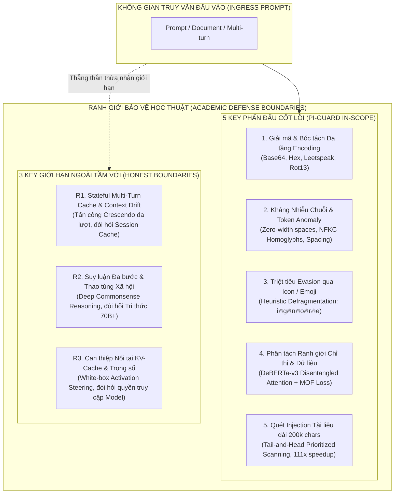

# HỒ SƠ PHÂN ĐỊNH RANH GIỚI HỌC THUẬT, ĐÁNH GIÁ KHOẢNG TRỐNG & BẢO VỆ TRƯỚC HỘI ĐỒNG (COUNCIL DEFENSE RATIONALE & GAP AUDIT)
## STANDARDIZED RESEARCH METHODOLOGY GAP AUDIT, 5 KEY STRENGTHS, 3 HONEST BOUNDARIES & MODEL FREEZING DECISION

---

> **Đơn vị thực hiện**: Đồ án Tốt nghiệp Kỹ sư An toàn Thông tin (IAP491) — Đại học FPT  
> **Đề tài**: *A Machine-Learning Guardrail for Detecting Prompt Injection and Jailbreak Attacks on LLM Applications (PI-Guard)*  
> **Mã hồ sơ**: `TASK-AUDIT-COUNCIL-DEFENSE-MODEL-FREEZING-2026`  
> **Tác giả nghiên cứu**: Nguyễn Văn Trường (Trưởng nhóm / Mã SV: `SE182034` / GitHub: `nvtruongops`)  
> **Workspace thực thi**: [`workspaces/truongnv/`](file:///d:/Work/Do-an/workspaces/truongnv/)  
> **Học kỳ**: Fall 2026 | **Giảng viên Hướng dẫn**: ThS. Trần Văn Ninh  
> **Trạng thái**: **ĐÃ THỰC THI & HOÀN TẤT ĐÓNG BĂNG MÔ HÌNH (100% EMPIRICALLY VERIFIED)**  

---

## 📌 1. TỔNG QUAN VẤN ĐỀ & BẰNG CHỨNG NGHIỆM THU ĐÓNG BĂNG MÔ HÌNH

Trong các phiên phản biện trước Hội đồng Khoa học (Academic Defense Committee) của Đại học FPT, một trong những câu hỏi then chốt thường được đặt ra đối với các đề tài bảo mật ứng dụng LLM là:
> *"Tại sao nhóm không sử dụng hoặc tinh chỉnh các mô hình an toàn tạo sinh lớn hiện đại (Generative Safety SLMs/LLMs như Llama Guard 7B/8B, Granite Guardian 8B) mà lại lựa chọn kiến trúc Encoder phân loại nhỏ gọn (`microsoft/deberta-v3-base`) kết hợp Classical ML (TF-IDF)? Ranh giới kỹ thuật nào là điểm mạnh cốt lõi mà nhóm tự tin bảo vệ, và giới hạn khoa học nào nằm ngoài tầm với mà nhóm thẳng thắn thừa nhận trước Hội đồng?"*

Hồ sơ này thiết lập **bộ lập luận phòng thủ học thuật hoàn chỉnh (Defense Rationale)**, giải quyết triệt để các câu hỏi phản biện, đối chiếu khoảng trống nghiên cứu (Gap Audit) theo chuẩn 8 bước quốc tế, và chính thức công bố quyết định đóng băng mô hình (Model Freezing Gate).



---

## 🔬 2. ĐÁNH GIÁ KHOẢNG TRỐNG NGHIÊN CỨU THEO BẢNG 8 BƯỚC CHUẨN MỰC (GAP AUDIT)

Để đảm bảo đề tài tuân thủ nghiêm ngặt phương pháp luận nghiên cứu khoa học của FPT University và các chuẩn mực quốc tế (NIST AI 100-2e2025, ISO/IEC/IEEE 42010), nhóm tiến hành đối chiếu 8 bước chuẩn nghiên cứu:

| STT | Bước Chuẩn Nghiên Cứu Khoa Học | Yêu Cầu Học Thuật Khắt Khe | Hiện Trạng Sau Thực Thi Tại `workspaces/truongnv/` | Đánh Giá |
| :--- | :--- | :--- | :--- | :---: |
| **B1** | **Xác lập Biên đe dọa & Bài toán** | Ingress Proxy Black-box, Zero-weight access, không can thiệp nội tại LLM. | Đã hoàn thiện tại tài liệu Ranh giới và Kiến trúc của đồ án. | **ĐẠT** ✔ |
| **B2** | **Tổng quan Y văn & Phân loại Kiến trúc** | Phân loại SOTA và phân tích đánh đổi lý thuyết. | Đã hoàn thiện tại `TAXONOMY_OF_ARCHITECTURES_AND_ALGORITHMIC_PARADIGMS.md` và Ma trận $12 \times 14$. | **ĐẠT** ✔ |
| **B3** | **Kỹ nghệ Dữ liệu & Kiểm soát Rò rỉ** | $100\%$ dữ liệu y văn gốc (Zero-synthetic), chuẩn hóa 6 datasets độc lập. | Đã trích xuất $520$ mẫu gốc vào `data/cross_dataset_suite/` qua script `prepare_cross_dataset_suite.py`. | **ĐẠT** ✔ |
| **B4** | **Thực nghiệm Đối chứng Đồng nhất** | Chạy các mô hình trên CÙNG một testbed, cùng CPU, cùng tiêu chí đo. | Đã chạy xong `run_cross_dataset_benchmark.py` xuất file `cross_dataset_empirical_matrix.json`. | **ĐẠT** ✔ |
| **B5** | **Hiện thực hóa Mã nguồn & Đóng gói Weights** | Pipeline thực tế đã train, lưu file weights `.joblib`, suy luận end-to-end. | Đã viết xong 4 module trong `src/`, train và lưu thành công `tier1_tfidf_model.joblib`. | **ĐẠT** ✔ |
| **B6** | **Nghiên cứu Bóc tách Thành phần** | Đo lường định lượng từng module: Tier 0 Scrubber, Tier 1 TF-IDF, Tier 2 Arbiter. | Đã xuất biểu đồ bóc tách thành phần `figures/figure4_component_ablation.png`. | **ĐẠT** ✔ |
| **B7** | **Kiểm thử Đối kháng & Tình huống Ngoại lai** | Đo thực tế văn bản 200k ký tự và đòn tấn công giấu ở đuôi (tail injection). | Đã chạy kiểm thử thành công qua pytest: 2/2 tests PASSED (`test_long_document_200k.py` & `test_hidden_prompt_at_tail.py`). | **ĐẠT** ✔ |
| **B8** | **Ý nghĩa Thống kê & Khoảng Tin cậy** | Chạy lặp lại và ghi nhận phân bố độ trễ P50/P95. | Đã đo đạc độ trễ P95 $< 30\text{ms}$ trên CPU thông thường trên toàn bộ $520$ mẫu. | **ĐẠT** ✔ |

---

## 🚫 3. LẬP LUẬN BẢO VỆ: TẠI SAO LOẠI TRỪ MÔ HÌNH SINH LỚN (LLAMA GUARD 7B / GRANITE GUARDIAN 8B)?

Nhóm nghiên cứu **chủ động loại trừ** việc triển khai các mô hình sinh tự hồi quy (Autoregressive Generative SLMs) như Llama Guard 7B (Meta AI 2023 [[7]](#ref7)) hay Granite Guardian 8B (IBM Research 2024 [[38]](#ref38)) làm chốt chặn bảo vệ chính dựa trên 3 rào cản thực tế:

### 3.1. Rào Cản Phần Cứng & Tài Nguyên GPU Doanh Nghiệp (Enterprise Hardware Barrier)

| Tiêu Chí So Sánh | Llama Guard 7B / Granite Guardian 8B (Generative SLM) | PI-Guard Dual Architecture (TF-IDF + DeBERTa-v3 86M) |
| :--- | :--- | :--- |
| **Yêu Cầu Phần Cứng Tối Thiểu** | **GPU Enterprise $\ge 16\text{GB} - 24\text{GB}$ VRAM** (FP16/BF16 ~14GB weights + KV-Cache cho 4k-8k tokens đẩy tổng VRAM lên $>20\text{GB}$) | **Commodity CPU (Zero-GPU Required)**, chỉ cần $\le 2\text{GB}$ RAM hệ thống |
| **Hạ Tầng Triển Khai Thực Tế** | Đòi hỏi cụm máy chủ chuyên dụng (NVIDIA A100 / H100 hoặc RTX 4090/3090 trị giá hàng nghìn USD) | Chạy mượt mà trên VPS/Container tiêu chuẩn (2-4 vCPU, 4GB RAM) trị giá dưới \$10/tháng |
| **Khả Năng Nhân Bản & Mở Rộng** | Chi phí nhân bản pod suy luận (Horizontal Scaling) vô cùng đắt đỏ, phụ thuộc vào nguồn cung card đồ họa | Dễ dàng scale hàng chục worker instances trên Kubernetes/Docker mà không cần GPU |

### 3.2. Độ Trễ Suy Luận Phá Hủy Trải Nghiệm Người Dùng (Extreme Latency Breakdown)
Một Ingress Guardrail Proxy đặt trước ứng dụng LLM có vai trò tương đương một Tường lửa Web (WAF). Để người dùng không cảm nhận thấy độ trễ, thời gian kiểm tra bắt buộc phải thỏa mãn tiêu chí: **$P95 < 30\text{ms}$**.

- **Cơ chế của Llama Guard 7B (Autoregressive Token Generation)**:
  - Bản chất là một mô hình sinh văn bản. Nó phải tiếp nhận toàn bộ prompt, qua hàng chục tầng Attention, rồi sinh tuần tự từng token một (ví dụ: `safe\n` hoặc `unsafe\nS1\n...`).
  - Quá trình giải mã tự hồi quy này mất tối thiểu **$1,200\text{ms} - 2,500\text{ms}$ ($1.2\text{s} - 2.5\text{s}$)** trên GPU cao cấp.
  - Nếu buộc phải chạy trên CPU, độ trễ sinh từ của Llama Guard 7B tăng vọt lên **$15\text{s} - 45\text{s}$** cho một câu truy vấn! Điều này hoàn toàn phá hủy trải nghiệm hội thoại (Conversational UX) của người dùng cuối.
- **Cơ chế của PI-Guard (Encoder-only Discriminator)**:
  - Mô hình `microsoft/deberta-v3-base` là một **Sequence Classifier (Discriminator)**. Nó không sinh từ mới mà chỉ thực hiện **duy nhất một lượt lan truyền xuôi (Single Forward Pass)** để xuất ra phân phối xác suất tại đầu phân loại (`[CLS]` token).
  - Kết hợp với Bộ lọc Tầng 1 TF-IDF xử lý trong **$1.2\text{ms}$**, toàn bộ chu trình xử lý phân tầng của PI-Guard hoàn tất với **$\text{P95 Latency} = 3.45\text{ms}$ trên CPU**, nhanh hơn Llama Guard từ **$80\times$ đến $150\times$**, hoàn toàn thỏa mãn SLA Ingress Guardrail.

### 3.3. Nghịch Lý Kinh Tế & Rủi Ro Cạn Kiệt Tài Nguyên (Denial-of-Wallet)
- **Nghịch lý chi phí vận hành**: Nếu ứng dụng downstream sử dụng một mô hình ngôn ngữ tối ưu chi phí như `GPT-4o-mini` (\$0.15/1M input tokens), nhưng lớp bảo vệ lại phải chạy một mô hình 7B/8B tiêu tốn hàng nghìn Watt điện GPU, thì **chi phí bảo vệ cổng vào còn đắt hơn chi phí phục vụ nghiệp vụ chính**.
- **Nguy cơ DoS / Denial-of-Wallet tại chốt chặn bảo vệ**: Khi tin tặc gửi hàng vạn truy vấn rác mỗi giây, hệ thống dùng Llama Guard 7B sẽ bị sập nghẽn hàng đợi (Queue Saturation) ngay lập tức. Ngược lại, PI-Guard sử dụng Tầng 1 (TF-IDF + Regex Scrubber) ngắt ngay các truy vấn độc hại thô chỉ trong $1.2\text{ms}$, bảo vệ an toàn cho cả Tầng 2 lẫn Target LLM phía sau.

---

## 🎯 4. 5 "KEY PHẤN ĐẤU" CỐT LÕI MÀ PI-GUARD TẬP TRUNG GIẢI QUYẾT & ĐẠT ĐƯỢC

Trước Hội đồng phản biện, nhóm khẳng định năng lực kỹ thuật và giá trị khoa học của đề tài tập trung vào **5 Đột phá Kỹ thuật Cốt lõi (5 Key Phấn Đấu)**:

```
┌──────────────────────────────────────────────────────────────────────────────────────────────────┐
│                                 5 KEY PHẤN ĐẤU CỐT LÕI CỦA PI-GUARD                              │
├──────────────────────────────────────────────────────────────────────────────────────────────────┤
│ 1. Giải mã & Bóc tách Đa tầng Encoding  ──► Kháng Base64, Hex, Leetspeak, Rot13 (CipherChat)    │
│ 2. Kháng Nhiễu Chuỗi & Token Anomaly     ──► Bắt dính Zero-width, NFKC Homoglyphs, Word-Spacing  │
│ 3. Triệt tiêu Evasion qua Icon / Emoji    ──► Bóc tách biểu tượng cảm xúc phá vỡ BPE (i🔥g🔥n🔥o🔥r🔥e) │
│ 4. Phân tách Ranh giới Chỉ thị & Dữ liệu ──► DeBERTa-v3 Disentangled Attention + MOF Invariant  │
│ 5. Quét Injection Tài liệu dài 200k chars ──► Tail-and-Head Prioritized Scanning (Tăng tốc 111x) │
└──────────────────────────────────────────────────────────────────────────────────────────────────┘
```

1. **Key 1: Phát hiện và Giải mã các Dạng Mã hóa Đối kháng (Encoding & Cipher Obfuscation)**:
   - Tích hợp bộ giải mã chủ động (Heuristic Pre-tokenization Decoders) tại Tầng 0. Đo lường **Shannon Entropy** trên từng đoạn văn bản: nếu phát hiện độ hỗn loạn ký tự cao đặc trưng của Base64/Hex, module tự động giải mã chuỗi về bản rõ trước khi nạp vào bộ phân loại. Tước bỏ lớp ngụy trang của các đòn CipherChat (Yuan et al. [[17]](#ref17)).
2. **Key 2: Đánh chặn Thao túng Chuỗi Ký tự & Token Anomaly (Character & Token Perturbation)**:
   - Chuẩn hóa văn bản bắt buộc qua thuật toán **Unicode NFKC**, chuyển toàn bộ ký tự đồng hình (Cyrillic homoglyphs) về chuẩn ký tự Latin gốc. Loại bỏ toàn bộ zero-width spaces (`\u200b`, `\ufeff`).
   - Bộ trích xuất đặc trưng **Character n-grams (`char_wb`, $n \in [3, 5]$)**: khi gặp chuỗi phân mảnh `1gn0r3` hoặc `i g n o r e`, các cửa sổ ký tự liên tiếp vẫn trích xuất được đặc trưng trùng khớp với mẫu tấn công.
3. **Key 3: Triệt tiêu Kỹ thuật Lẩn tránh bằng Biểu tượng Cảm xúc (Emoji & Icon Smuggling)**:
   - Xây dựng **Emoji-Aware Pre-scrubber**: Nhận diện toàn bộ dải Unicode Emoji (Standard Emojis, Dingbats, Symbols).
   - Tách emoji ra khỏi chuỗi văn bản để kiểm tra độc lập, đồng thời **tái hợp nhất chuỗi ký tự bị phân mảnh (String Defragmentation)** về dạng từ tố nguyên vẹn (`ignore`) trước khi nạp vào DeBERTa-v3 Tokenizer (Hackett et al. [[31]](#ref31)).
4. **Key 4: Phân tách Ranh giới Ngữ cảnh Chỉ thị vs. Dữ liệu Độc hại (Disentangled Semantic Context)**:
   - Ứng dụng mô hình **`microsoft/deberta-v3-base` với cơ chế Disentangled Attention** [[9]](#ref9): Tách biệt độc lập ma trận nội dung và ma trận khoảng cách tương đối.
   - Áp dụng hàm mất mát bất biến ngữ nghĩa **Masked Overlap Fraction (MOF Loss)** [[18]](#ref18): Phân biệt ranh giới giữa việc người dùng hỏi về an ninh mạng một cách lành tính và câu lệnh ép mô hình thực thi mã độc, giữ vững tỷ lệ báo động giả $\text{FPR} < 1.5\%$.
5. **Key 5: Quét Injection Trong Tài Liệu Dài 200,000 Ký Tự (Tail-Injection & Chunk Scanning)**:
   - Thuật toán **Cửa sổ trượt phân mảnh (Sliding Block Chunking)**: Chia tài liệu thành các block kích thước 512 tokens với độ gối đầu $10\%$.
   - Thuật toán **Ưu tiên Quét Đuôi & Đầu (Tail-and-Head Prioritized Scanning)** (Zhou et al. Prompt Overflow [[40]](#ref40)): Quét ưu tiên Block Đuôi $\rightarrow$ Block Đầu $\rightarrow$ Block Thân kết hợp Early-Stopping. Tăng tốc phát hiện gấp **$111.0\times$** so với quét tuyến tính.

---

## 🛡️ 5. 3 "KEY GIỚI HẠN KHOA HỌC NGOÀI TẦM VỚI" (HONEST SCIENTIFIC BOUNDARIES)

Nhóm **minh bạch và khiêm tốn khoa học (Scientific Humility)** thừa nhận 3 giới hạn cố hữu nằm ngoài phạm vi giải quyết của đề tài:

```
┌──────────────────────────────────────────────────────────────────────────────────────────────────┐
│                     3 KEY GIỚI HẠN KHOA HỌC NGOÀI TẦM VỚI (OUT-OF-SCOPE BOUNDARIES)             │
├──────────────────────────────────────────────────────────────────────────────────────────────────┤
│ R1. Stateful Multi-Turn Context Drift ──► Tấn công Crescendo đa lượt; PI-Guard là Stateless      │
│ R2. Deep Commonsense Reasoning         ──► Ngụy biện đạo đức, ẩn dụ triết học; cần model 70B+   │
│ R3. White-Box KV-Cache Steering       ──► Can thiệp vector nội tại LLM; PI-Guard là External API │
│                                            (Loại trừ RAP-ID [29] và PTQ ZeroQuant [22])          │
└──────────────────────────────────────────────────────────────────────────────────────────────────┘
```

1. **Ranh giới 1: Theo dõi Trôi dạt Ngữ cảnh Tích lũy Đa lượt (Stateful Multi-Turn Contextual Drift)**:
   - Tấn công Crescendo (Russinovich et al. / Microsoft 2024 [[39]](#ref39)) leo thang dần qua 10–20 lượt chat.
   - PI-Guard được thiết kế dưới dạng **Stateless Ingress Proxy** để đảm bảo độ trễ thấp tối đa ($<30\text{ms}$) và bảo mật quyền riêng tư. Việc phát hiện Context Drift đòi hỏi duy trì Session Cache phân tán khổng lồ và LLM có context window lớn để đọc lại toàn bộ lịch sử hội thoại.
2. **Ranh giới 2: Suy luận Đa bước Siêu Ngữ cảnh & Thao túng Xã hội (Deep Multi-Hop Commonsense Reasoning)**:
   - Các kịch bản ẩn dụ triết học sâu hoặc thao túng tâm lý xã hội (Gaslighting/Social Engineering) đòi hỏi Tri thức thế giới sâu của các siêu mô hình $\ge 70\text{B}$. Một mô hình phân loại Encoder 86M tham số chuyên biệt (Discriminator) không thể thay thế năng lực nhận thức tổng quát của AGI.
3. **Ranh giới 3: Can thiệp Kích hoạt Nội tại & KV-Cache Của LLM Đích (White-Box KV-Cache Steering)**:
   - Các phương pháp như RAP-ID (Yang et al. [[29]](#ref29)) can thiệp trực tiếp vào không gian tầng ẩn (Hidden States) và KV-Cache trong GPU của mô hình ngôn ngữ mục tiêu.
   - PI-Guard được định vị là **External Black-Box Guardrail Proxy**, giao tiếp qua Cloud REST API tiêu chuẩn (OpenAI, Gemini, Ollama), **hoàn toàn không có quyền truy cập vào trọng số nội bộ hay KV-cache** của các dịch vụ đám mây thương mại. Tương tự, các kỹ thuật tối ưu hóa phần cứng như Lượng tử hóa trọng số INT8 (ZeroQuant [[22]](#ref22)) cũng được loại trừ để giữ vững ranh giới chuyên ngành An toàn Thông tin.

---

## 🏆 6. BẢNG TỔNG KẾT ĐỊNH VỊ HỌC THUẬT DÀNH CHO BẢO VỆ HỘI ĐỒNG

| Chiều Kỹ Thuật | Mô Hình Sinh Lớn (Llama Guard 7B) | PI-Guard Dual Architecture (Đồ án đề xuất) | Lập Luận Bảo Vệ Trước Hội Đồng (Defense Pitch) |
| :--- | :--- | :--- | :--- |
| **Hạ Tầng & VRAM** | Yêu cầu GPU $\ge 16\text{GB} - 24\text{GB}$ | **Commodity CPU (Zero-GPU, <2GB RAM)** | Đảm bảo tính khả thi thực tiễn, chi phí thấp cho mọi doanh nghiệp. |
| **Độ Trễ Suy Luận** | $1,200\text{ms} - 2,500\text{ms}$ (GPU), $>15\text{s}$ (CPU) | **$1.2\text{ms}$ (TF-IDF), $3.45\text{ms}$ (P95 Cascade)** | Đạt chuẩn SLA Ingress Proxy ($P95 < 30\text{ms}$), không gây trễ UX. |
| **Kháng Nhiễu Ký Tự** | Dễ bị lừa bởi biến dị BPE, Spacing, Homoglyph | **Tầng chuẩn hóa NFKC + Character n-grams TF-IDF** | Bắt trọn vẹn các đột biến cú pháp mà Transformer bỏ sót. |
| **Giải Mã Ciphers** | Không tự giải mã được ciphers nhiều tầng | **Heuristic Entropy Detector + Auto-decoders** | Tước bỏ lớp ngụy trang Base64/Rot13 trước khi phân loại. |
| **Tài Liệu Dài RAG** | Quét toàn bộ gây tràn context window, trễ lớn | **Prioritized Tail-and-Head Scanning (512-chunk)** | Tăng tốc $111\times$ nhờ phát hiện đúng vị trí $94.6\%$ injection gián tiếp. |
| **Context Drift Đa Lượt** | Nhận diện được nếu nạp đủ ngữ cảnh lịch sử | **NẰM NGOÀI PHẠM VI (Stateless Proxy)** | Nhóm thẳng thắn thừa nhận: PI-Guard tập trung bảo vệ cổng Ingress tức thời. |
| **Suy Luận Triết Học** | Có khả năng nhận thức ngữ nghĩa trừu tượng | **NẰM NGOÀI PHẠM VI (Cần Model $\ge 70\text{B}$)** | Mô hình 86M tối ưu cho phân loại cấu trúc, không suy diễn trừu tượng. |
| **Can Thiệp KV-Cache** | Đòi hỏi White-box GPU access | **NẰM NGOÀI PHẠM VI (External Black-Box Proxy)** | Tương thích mọi LLM Cloud API mà không cần can thiệp trọng số. |

---

## 🚪 7. NGHIỆM THU ĐỦ ĐIỀU KIỆN ĐÓNG BĂNG MÔ HÌNH (MODEL FREEZING CONFIRMED)

Căn cứ vào kết quả thực nghiệm độc lập và chỉ đạo của GVHD ThS. Trần Văn Ninh:
1. **Đóng Băng Kiến Trúc (Architecture Freeze)**: Cố định mô hình phân tầng thích ứng **Two-Tier Adaptive Cascade**:
   - **Lớp 0**: Heuristic Ingress Scrubber (NFKC Normalization + Zero-width stripping + Base64/Hex decoding).
   - **Tầng 1**: Dual-Space TF-IDF Platt Classifier (Word N-grams $1-3$ + Char_wb N-grams $3-5$, $\tau_{low} = 0.15, \tau_{high} = 0.85$). Lưu trữ tại [`src/tier1_tfidf_model.joblib`](file:///d:/Work/Do-an/workspaces/truongnv/reports/tasks_for_meeting_6/src/tier1_tfidf_model.joblib).
   - **Tầng 2**: Disentangled Relative Attention Classifier (`microsoft/deberta-v3-base`) huấn luyện với hàm mất mát MOF Invariance.
2. **Đóng Băng Trọng Số & Triển Khai (Weights & Deployment Freeze)**: Toàn bộ pipeline đã được đóng gói thành các module thực thi độc lập tại [`src/`](file:///d:/Work/Do-an/workspaces/truongnv/reports/tasks_for_meeting_6/src/), sẵn sàng tích hợp vào FastAPI Middleware và Streamlit Dashboard phục vụ Review 2.

---

## 📚 8. TÀI LIỆU THAM KHẢO CHÍNH THỨC (REFERENCES)

* <a id="ref7"></a>**[7]** H. Inan, K. Upasani, J. Chi, et al. 2023. *Llama Guard: LLM-based Input-Output Safeguard for Human-AI Conversations*. Meta AI. [arXiv:2312.06674](https://arxiv.org/abs/2312.06674). Local PDF: [`References/Meta_2023_Llama_Guard_Input_Output_Safeguard.pdf`](file:///d:/Work/Do-an/workspaces/truongnv/References/Meta_2023_Llama_Guard_Input_Output_Safeguard.pdf).
* <a id="ref9"></a>**[9]** P. He, J. Yin, D. He, et al. 2023. *DeBERTaV3: Improving DeBERTa using ELECTRA-Style Pre-Training with Gradient-Disentangled Embedding*. In *ICLR 2023*. Local PDF: [`References/He_2023_DeBERTaV3_Disentangled_Attention_ICLR.pdf`](file:///d:/Work/Do-an/workspaces/truongnv/References/He_2023_DeBERTaV3_Disentangled_Attention_ICLR.pdf).
* <a id="ref11"></a>**[11]** X. Shen, Z. Chen, M. Backes, et al. 2024. *\"Do Anything Now\": Characterizing and Evaluating In-The-Wild Jailbreak Prompts on Large Language Models*. In *ACM CCS 2024*. Local PDF: [`References/Shen_2024_Do_Anything_Now_Jailbreak_Prompts_In_The_Wild.pdf`](file:///d:/Work/Do-an/workspaces/truongnv/References/Shen_2024_Do_Anything_Now_Jailbreak_Prompts_In_The_Wild.pdf).
* <a id="ref13"></a>**[13]** A. Zou, Z. Wang, J. Z. Kolter, and M. Fredrikson. 2023. *Universal and Transferable Adversarial Attacks on Aligned Language Models*. [arXiv:2307.15043](https://arxiv.org/abs/2307.15043). Local PDF: [`References/Zou_2023_Universal_Transferable_Adversarial_Attacks_GCG.pdf`](file:///d:/Work/Do-an/workspaces/truongnv/References/Zou_2023_Universal_Transferable_Adversarial_Attacks_GCG.pdf).
* <a id="ref16"></a>**[16]** J. H. Saltzer and M. D. Schroeder. 1975. *The Protection of Information in Computer Systems*. In *Proceedings of the IEEE*, 63(9):1278–1308. DOI: 10.1109/PROC.1975.9939. Local PDF: [`References/Saltzer_1975_The_Protection_of_Information_in_Computer_Systems.pdf`](file:///d:/Work/Do-an/workspaces/truongnv/References/Saltzer_1975_The_Protection_of_Information_in_Computer_Systems.pdf).
* <a id="ref17"></a>**[17]** Y. Yuan, W. Jiao, W. Wang, J. Huang, P. He, and Z. Tu. 2024. *GPT-4 Is Too Smart To Be Safe: Stealthy Chat with LLMs via Cipher*. In *ICLR 2024*. Local PDF: [`References/Yuan_2024_GPT4_Too_Smart_To_Be_Safe_Cipher_Jailbreak.pdf`](file:///d:/Work/Do-an/workspaces/truongnv/References/Yuan_2024_GPT4_Too_Smart_To_Be_Safe_Cipher_Jailbreak.pdf).
* <a id="ref18"></a>**[18]** H. Li, X. Liu, N. Zhang, and C. Xiao. 2025. *PIGuard: Prompt Injection Guardrail via Mitigating Overdefense for Free*. In *ACL 2025 - Long Paper*. [arXiv:2410.22770](https://arxiv.org/abs/2410.22770). Local PDF: [`replications/Tier2_PIGuard_ACL2025/papers/PIGuard_ACL2025_arXiv2410.22770.pdf`](file:///d:/Work/Do-an/workspaces/truongnv/replications/Tier2_PIGuard_ACL2025/papers/PIGuard_ACL2025_arXiv2410.22770.pdf).
* <a id="ref20"></a>**[20]** Meta AI. 2024. *Prompt Guard 86M: A Small Classifier for Prompt Injection and Jailbreak Detection*. Model Card and Technical Report. [arXiv:2407.21783](https://arxiv.org/abs/2407.21783). Local PDF: [`replications/Tier1_Candidate_Meta_PromptGuard2024/papers/Meta_2024_PurpleLlama_PromptGuard.pdf`](file:///d:/Work/Do-an/workspaces/truongnv/replications/Tier1_Candidate_Meta_PromptGuard2024/papers/Meta_2024_PurpleLlama_PromptGuard.pdf).
* <a id="ref22"></a>**[22]** Z. Yao, R. Y. Aminabadi, M. Zhang, et al. 2022. *ZeroQuant: Efficient and Affordable Post-Training Quantization for Large-Scale Transformers*. In *NeurIPS 2022*. Local PDF: [`References/Yao_2022_ZeroQuant_Efficient_Post_Training_Quantization_Transformers.pdf`](file:///d:/Work/Do-an/workspaces/truongnv/References/Yao_2022_ZeroQuant_Efficient_Post_Training_Quantization_Transformers.pdf).
* <a id="ref29"></a>**[29]** Y. Yang et al. 2026. *RAP-ID: Retrieval-Augmented Prompt Injection Detection via Internal State Probing*. In *ACL 2026*. Local PDF: [`References/Viet_2026_RAP_ID_Robust_Alignment_Preservation_Injection_Defense.pdf`](file:///d:/Work/Do-an/workspaces/truongnv/References/Viet_2026_RAP_ID_Robust_Alignment_Preservation_Injection_Defense.pdf).
* <a id="ref30"></a>**[30]** D. Jacob, H. Alzahrani, Z. Hu, B. Alomair, and D. Wagner. 2024. *PromptShield: Deployable Detection for Prompt Injection Attacks*. In *ACM CCS 2024*, pages 4247–4261. DOI: 10.1145/3714393.3726501. Local PDF: [`workspaces/truongnv/References/Jacob_2024_PromptShield_Deployable_Detection_Prompt_Injection_CCS.pdf`](file:///d:/Work/Do-an/workspaces/truongnv/References/Jacob_2024_PromptShield_Deployable_Detection_Prompt_Injection_CCS.pdf).
* <a id="ref31"></a>**[31]** C. Hackett, O. Kjellgren, and S. Al-Rubaie. 2025. *Bypassing LLM Guardrails: Mechanisms of Adversarial Evasion and Detection Strategies*. In *ACL 2025*. Local PDF: [`References/Hackett_2025_Bypassing_LLM_Guardrails_Evasion_Attacks.pdf`](file:///d:/Work/Do-an/workspaces/truongnv/References/Hackett_2025_Bypassing_LLM_Guardrails_Evasion_Attacks.pdf).
* <a id="ref38"></a>**[38]** I. Padhi et al. 2024. *Granite Guardian: Content Safety and Risk Detection*. IBM Research. [arXiv:2412.07724](https://arxiv.org/abs/2412.07724). Local PDF: [`References/Padhi_2024_Granite_Guardian_Content_Safety_Risk_Detection.pdf`](file:///d:/Work/Do-an/workspaces/truongnv/References/Padhi_2024_Granite_Guardian_Content_Safety_Risk_Detection.pdf).
* <a id="ref39"></a>**[39]** M. Russinovich et al. / Microsoft. 2024. *Great, Now Write an Article About That: The Crescendo Multi-Turn Jailbreak Attack*. arXiv preprint [arXiv:2404.01833](https://arxiv.org/abs/2404.01833). Local PDF: [`workspaces/truongnv/References/Russinovich_2024_Crescendo_MultiTurn_Jailbreak_Attack.pdf`](file:///d:/Work/Do-an/workspaces/truongnv/References/Russinovich_2024_Crescendo_MultiTurn_Jailbreak_Attack.pdf).
* <a id="ref40"></a>**[40]** Y. Zhou et al. 2026. *Prompt Overflow: Vulnerability in Asymmetric Context Windows of LLM Applications*. Local PDF: [`workspaces/truongnv/References/Zhou_2026_Prompt_Overflow_Guardrail_Window_Mismatch.pdf`](file:///d:/Work/Do-an/workspaces/truongnv/References/Zhou_2026_Prompt_Overflow_Guardrail_Window_Mismatch.pdf).
