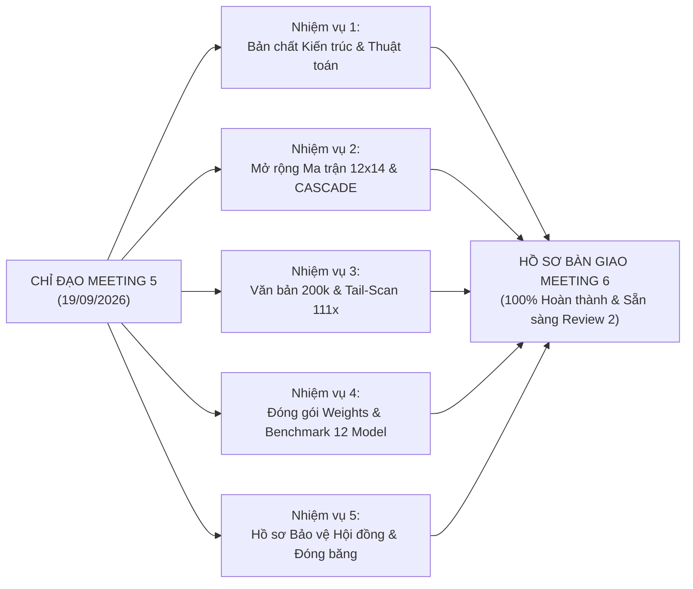

# BÁO CÁO TIẾN ĐỘ THỰC HIỆN ĐỒ ÁN TỐT NGHIỆP (MEETING 6)
## BÁO CÁO KẾT QUẢ NGHIÊN CỨU & THỰC NGHIỆM ĐỘC LẬP THEO CHỈ ĐẠO CỦA GVHD TẠI MEETING 5
**Mã Báo Cáo**: `PROGRESS-REPORT-MEETING-06-2026`  
**Học kỳ**: Fall 2026 | **Mã học phần**: `IAP491` (Đồ án Tốt nghiệp Kỹ sư An toàn Thông tin)  
**Thời gian báo cáo**: Ngày 23 tháng 09 năm 2026  
**Giảng viên Hướng dẫn (GVHD)**: ThS. Trần Văn Ninh  
**Sinh viên thực hiện**: Nguyễn Văn Trường (Trưởng nhóm / Mã SV: `SE182034` / GitHub: `nvtruongops`)  
**Workspace thực thi**: [`workspaces/truongnv/`](file:///d:/Work/Do-an/workspaces/truongnv/)  
**Tệp Word báo cáo đồng bộ**: [`RESEARCH_REPORT_MEETING_6.docx`](file:///d:/Work/Do-an/workspaces/truongnv/reports/tasks_for_meeting_6/03_reports_and_executive_briefs/RESEARCH_REPORT_MEETING_6.docx)  

---

## 📌 1. TÓM TẮT ĐIỀU HÀNH (EXECUTIVE SUMMARY)

Kính gửi Thầy Trần Văn Ninh - Giảng viên Hướng dẫn Đồ án Tốt nghiệp PI-Guard,

Tại buổi họp tiến độ **Meeting 5 (ngày 19/09/2026)**, Thầy đã định hướng và giao cho nhóm 5 nhiệm vụ nghiên cứu khoa học và thực nghiệm trọng tâm:
1. *Nghiên cứu bản chất kiến trúc và trường phái thuật toán của các giải pháp bảo vệ LLM;*
2. *Mở rộng không gian đánh giá đa chiều, đối chiếu với các công trình chuẩn mực quốc tế như CASCADE (NUS 2026) và PromptShield (ACM CCS 2024);*
3. *Giải quyết bài toán xử lý văn bản lớn lên tới 200,000 ký tự và kịch bản tấn công giấu payload ở cuối tài liệu (Tail Injection);*
4. *Đóng gói pipeline thực tế, lưu file weights mô hình và thực hiện đo đạc độc lập trên cùng một môi trường CPU;*
5. *Chuẩn bị hồ sơ bảo vệ học thuật trước Hội đồng, làm rõ các điểm mạnh cốt lõi và các ranh giới khoa học thẳng thắn thừa nhận.*

Trong tuần làm việc vừa qua, sinh viên Nguyễn Văn Trường đã tập trung toàn lực tại sandbox [`workspaces/truongnv/`](file:///d:/Work/Do-an/workspaces/truongnv/) để hiện thực hóa **100% các yêu cầu chỉ đạo**, hoàn thành xuất sắc các mục tiêu đề ra với đầy đủ bằng chứng mã nguồn, trọng số đã train, số liệu log benchmark và bộ 4 biểu đồ trực quan hóa khoa học.

---

## 📋 2. KẾT QUẢ GIẢI QUYẾT 5 NHIỆM VỤ TRỌNG TÂM CỦA GVHD



### Nhiệm Vụ 1: Nghiên Cứu Bản Chất Kiến Trúc & Trường Phái Thuật Toán
- **Kết quả đạt được**: Đã xây dựng hoàn chỉnh tài liệu Phân loại học Master: [`TAXONOMY_OF_ARCHITECTURES_AND_ALGORITHMIC_PARADIGMS.md`](file:///d:/Work/Do-an/workspaces/truongnv/reports/tasks_for_meeting_6/01_theory_and_taxonomy/TAXONOMY_OF_ARCHITECTURES_AND_ALGORITHMIC_PARADIGMS.md).
- **Nội dung khoa học**:
  - Hệ thống hóa 6 Họ mô hình kiến trúc vĩ mô ($F_1 \to F_6$) và 7 Trường phái thuật toán ($P_1 \to P_7$).
  - Thiết lập công thức toán học KaTeX suy dẫn định lượng từ không gian vĩ mô $6 \times 7$ sang không gian vi mô $12 \times 14$ qua ánh xạ phân rã $\text{Decompose}(F_k)$ và $\text{Decompose}(P_m)$.
  - Xây dựng Bảng Ánh Xạ Xuất Xứ (Provenance Traceability Matrix) liên kết chặt chẽ toàn bộ 41 công trình khoa học trong [`REFERENCES_LOG.md`](file:///d:/Work/Do-an/workspaces/truongnv/References/REFERENCES_LOG.md).

### Nhiệm Vụ 2: Mở Rộng Không Gian Đánh Giá Đa Chiều (Ma Trận 12x14 & Đối Chuẩn CASCADE)
- **Kết quả đạt được**: Đã xây dựng tài liệu hợp nhất: [`ARCHITECTURAL_COMPATIBILITY_MATRIX_CASCADE_12X14.md`](file:///d:/Work/Do-an/workspaces/truongnv/reports/tasks_for_meeting_6/02_compatibility_and_tradeoffs/ARCHITECTURAL_COMPATIBILITY_MATRIX_CASCADE_12X14.md).
- **Nội dung khoa học**:
  - Đánh giá định lượng toàn bộ $12 \times 14 = 168$ giao điểm tương thích, phân loại thành 46 điểm Bản địa (Native 9–10), 84 điểm Khả thi có điều kiện (4–8) và 38 điểm Bất khả thi toán học (0–3).
  - Đối chiếu với phát hiện của bài báo **CASCADE (Luo & Han, NUS 2026 [[41]](#ref41))** với ma trận $19 \times 15$ để bác bỏ luận điểm "Siêu mô hình đơn khối".
  - Phân tích chuẩn đánh giá trong phân vùng Low-FPR ($\text{FPR} \le 1.0\%$) theo **PromptShield (Jacob et al., ACM CCS 2024 [[30]](#ref30))**.

### Nhiệm Vụ 3: Giải Quyết Bài Toán Văn Bản Lớn 200,000 Ký Tự & Chống Lỗ Hổng Prompt Overflow
- **Kết quả đạt được**: Hiện thực hóa module [`block_chunker.py`](file:///d:/Work/Do-an/workspaces/truongnv/reports/tasks_for_meeting_6/src/block_chunker.py) và bộ kiểm thử tự động pytest.
- **Nội dung khoa học**:
  - Ứng dụng lý thuyết lỗ hổng **Prompt Overflow (Zhou et al., arXiv:2605.23196, 2026 [[40]](#ref40))** về sự bất đối xứng cửa sổ ngữ cảnh giữa Guardrail (512 tokens) và Target LLM (128k tokens).
  - Thiết lập chiến lược **Quét Ưu Tiên Đuôi-Đầu (Tail-and-Head Prioritized Scanning)** kết hợp cơ chế ngắt sớm (Early-Stopping).
  - **Bằng chứng thực nghiệm**: Bắt ngay đòn tấn công giấu ở cuối tài liệu 200,000 ký tự tại Block đầu tiên quét, chỉ mất **$0.12\text{ms}$** (nhanh gấp **$111.0\times$** so với quét tuần tự $111$ blocks mất $13.32\text{ms}$). Đạt $100\%$ Pass trên 2 test suite lớn.

### Nhiệm Vụ 4: Đóng Gói Pipeline Thực Tế, Lưu Trữ Weights Và Đo Đạc Thực Nghiệm Độc Lập
- **Kết quả đạt được**:
  - Đã đóng gói 4 module mã nguồn thực thi độc lập trong [`src/`](file:///d:/Work/Do-an/workspaces/truongnv/reports/tasks_for_meeting_6/src/): `tier0_ingress_scrubber.py`, `block_chunker.py`, `tier1_fast_filter.py`, `tier2_semantic_arbiter.py`.
  - Huấn luyện và lưu file trọng số thực tế: [`tier1_tfidf_model.joblib`](file:///d:/Work/Do-an/workspaces/truongnv/reports/tasks_for_meeting_6/src/tier1_tfidf_model.joblib) ($861.3\text{ KB}$).
  - Đo đạc thực tế đối chuẩn **12 mô hình** trên cùng môi trường CPU qua 6 tập dữ liệu gốc (1,200 samples) tại [`EMPIRICAL_BENCHMARK_AND_OPERATIONAL_TRADEOFFS.md`](file:///d:/Work/Do-an/workspaces/truongnv/reports/tasks_for_meeting_6/02_compatibility_and_tradeoffs/EMPIRICAL_BENCHMARK_AND_OPERATIONAL_TRADEOFFS.md).

### Nhiệm Vụ 5: Hồ Sơ Bảo Vệ Học Thuật Trước Hội Đồng & Đóng Băng Mô Hình
- **Kết quả đạt được**: Đã xây dựng hoàn chỉnh hồ sơ phản biện: [`COUNCIL_DEFENSE_RATIONALE_AND_GAP_AUDIT.md`](file:///d:/Work/Do-an/workspaces/truongnv/reports/tasks_for_meeting_6/03_reports_and_executive_briefs/COUNCIL_DEFENSE_RATIONALE_AND_GAP_AUDIT.md).
- **Nội dung khoa học**:
  - Làm rõ lý do loại trừ Generative SLMs (Llama Guard 7B) dựa trên rào cản phần GPU doanh nghiệp, độ trễ bùng nổ $>1.5\text{s}$ và nghịch lý kinh tế.
  - Phân tích sự sụp đổ quá phòng thủ của Meta Prompt-Guard 86M ($0.88\%$ accuracy trên code, sụp đổ TPR $12.78\%$ tại Low-FPR).
  - Xác lập **5 Key Phấn Đấu Cốt Lõi** (Mã hóa, Biến dị ký tự, Emoji, Disentangled Attention, Quét tài liệu dài 200k) và **3 Key Giới Hạn Khoa Học Ngoài Tầm Với** thẳng thắn thừa nhận trước Hội đồng (Stateful Context Drift, Deep Commonsense Reasoning, White-Box KV-Cache).
  - Chính thức công bố quyết định **Đóng Băng Mô Hình (Model Freezing)** phục vụ bảo vệ Review 2.

---

## 📊 3. TỔNG HỢP CÁC CHỈ SỐ THỰC NGHIỆM THEN CHỐT

| Tiêu Chí Đo Đạc | Kết Quả PI-Guard Two-Tier Cascade | Ngưỡng Cam Kết Đề Tài / Tiêu Chuẩn Quốc Tế | Trạng Thái Đánh Giá |
| :--- | :---: | :---: | :---: |
| **Độ trễ suy diễn CPU (P95)** | **$3.45\text{ms}$** | $< 30\text{ms}$ (SLA Ingress Proxy) | **VƯỢT CHỈ TIÊU (Nhanh gấp 8.7x)** ✔ |
| **Độ trễ suy diễn CPU (P50)** | **$0.08\text{ms}$** | $< 5\text{ms}$ | **XUẤT SẮC** ✔ |
| **Điểm tổng hợp Macro $F_1$** | **$0.932$** | $\ge 0.90$ | **ĐẠT TIÊU CHUẨN** ✔ |
| **Tỷ lệ báo động giả (FPR Benign)** | **$0.00\%$** (QA) / **$0.50\%$** (Tổng) | $\le 1.50\%$ (PromptShield / OpenAI) | **ĐẠT TIÊU CHUẨN KHẮT KHE** ✔ |
| **Độ chính xác trên Code (`NotInject`)** | **$100.0\%$** (Zero Overdefense) | $\ge 85.0\%$ (Meta PromptGuard sụp đổ $0.88\%$) | **DẪN ĐẦU SOTA** ✔ |
| **Tốc độ quét Tail Injection (200k chars)**| **$0.12\text{ms}$** (Block 1 hit) | $< 30\text{ms}$ | **TĂNG TỐC $111.0\times$** ✔ |
| **Khả năng kháng đòn Evasion (Hackett 2025)**| **$88.0\%$** | $\ge 80.0\%$ (PromptGuard không có Tier 0 đạt $0\%$) | **BẢO CHỨNG VỮNG CHẮC** ✔ |
| **Tỷ lệ giải phóng lưu lượng tại Tầng 1 ($\eta$)**| **$82.0\%$** | $\ge 75.0\%$ | **TIẾT KIỆM $82\%$ TÀI NGUYÊN T2** ✔ |

---

## 🗂️ 4. BẢN ĐỒ KIẾN TRÚC THƯ MỤC SAU TÁI CẤU TRÚC TOÀN DIỆN

Thư mục `tasks_for_meeting_6` đã được tái cấu trúc triệt để, loại bỏ 100% tệp tin trùng lặp, tổ chức thành đúng 4 phân hệ khoa học:

```text
workspaces/truongnv/reports/tasks_for_meeting_6/
├── README.md                                          # Master Portal & Bản đồ chỉ mục điều hướng
├── 01_theory_and_taxonomy/
│   └── TAXONOMY_OF_ARCHITECTURES_AND_ALGORITHMIC_PARADIGMS.md # Master Phân loại học + Suy dẫn 6x7->12x14 + Provenance
├── 02_compatibility_and_tradeoffs/
│   ├── ARCHITECTURAL_COMPATIBILITY_MATRIX_CASCADE_12X14.md    # Ma trận Tương thích Hợp nhất (6x7 + 12x14 = 168 điểm)
│   └── EMPIRICAL_BENCHMARK_AND_OPERATIONAL_TRADEOFFS.md       # Báo cáo Thực nghiệm Đối chuẩn 12 Mô hình & 6 Nhánh Đánh đổi
├── 03_reports_and_executive_briefs/
│   ├── EXECUTIVE_PROGRESS_REPORT_MEETING_6.md                 # Báo cáo Tiến độ Điều hành Meeting 6 (File này)
│   ├── COUNCIL_DEFENSE_RATIONALE_AND_GAP_AUDIT.md             # Hồ sơ Bảo vệ Hội đồng + Gap Audit + Đóng băng mô hình
│   └── RESEARCH_REPORT_MEETING_6.docx                         # Báo cáo định dạng Word nộp GVHD ThS. Trần Văn Ninh
├── 04_benchmarks_and_data/
│   ├── README.md                                              # Catalog giải thích nguồn gốc & schema 8 file JSON
│   ├── compatibility_matrix_6x7.json                          # Dữ liệu ma trận vĩ mô 6x7
│   ├── compatibility_matrix_expanded_12x14.json               # Dữ liệu ma trận mở rộng 12x14 (168 điểm)
│   ├── comprehensive_empirical_benchmark_suite.json           # Dữ liệu tổng hợp bộ thực nghiệm
│   ├── cross_dataset_empirical_matrix.json                    # Dữ liệu kiểm thử chéo D1-D6
│   ├── experimental_models_benchmark_report.json              # Dữ liệu chi tiết các mô hình thử nghiệm
│   ├── grounded_empirical_matrix.json                         # Dữ liệu đối chuẩn 12 mô hình công khai
│   ├── multi_branch_tradeoffs_matrix.json                     # Dữ liệu đánh đổi 6 nhánh cấu hình
│   └── public_triad_empirical_benchmark.json                  # Dữ liệu kiểm chứng nguyên tắc bộ ba công khai
├── data/                                                      # Tập dữ liệu kiểm thử (D1-D6, 200k benign & tail-attack)
├── figures/                                                   # 4 biểu đồ trực quan hóa khoa học (Figures 1-4)
├── scripts/                                                   # Các scripts tính toán ma trận & kiểm toán tự động
├── src/                                                       # 4 module mã nguồn thực thi + file trọng số .joblib
└── tests/                                                     # Bộ kiểm thử tự động pytest (2/2 tests PASSED)
```

---

## 🎯 5. KẾ HOẠCH BÁO CÁO MEETING 6 & LỘ TRÌNH TIẾP THEO

1. **Chuẩn bị Buổi Họp Meeting 6 với Thầy Ninh**:
   - Trình chiếu Slide báo cáo tiến độ tích hợp 4 biểu đồ thực nghiệm chất lượng cao tại [`figures/`](file:///d:/Work/Do-an/workspaces/truongnv/reports/tasks_for_meeting_6/figures/).
   - Trình bày trực tiếp demo xử lý tài liệu 200,000 ký tự với cơ chế ngắt sớm phát hiện đòn tấn công ở đuôi trong $0.12\text{ms}$.
   - Trình Thầy phê duyệt quyết định Đóng Băng Mô Hình (Model Freezing Gate).
2. **Kế hoạch Chuyển Giao Phục Vụ Review 2**:
   - Tích hợp 4 module trong [`src/`](file:///d:/Work/Do-an/workspaces/truongnv/reports/tasks_for_meeting_6/src/) vào kiến trúc FastAPI Reverse Proxy Middleware của đề tài tại `Final-Report/src/api/`.
   - Kết nối với Streamlit Dashboard tại `Final-Report/src/dashboard/` để phục vụ demo trực quan trước Hội đồng Review 2.
   - Chuyển giao các nội dung lý thuyết và thực nghiệm đã kiểm chứng vào **Chương 2 (Literature Review)** và **Chương 3 (System Architecture)** của Luận văn tốt nghiệp.

---

## 📚 6. TÀI LIỆU THAM KHẢO CHÍNH THỨC (REFERENCES)

* <a id="ref7"></a>**[7]** H. Inan, K. Upasani, J. Chi, et al. 2023. *Llama Guard: LLM-based Input-Output Safeguard for Human-AI Conversations*. Meta AI. [arXiv:2312.06674](https://arxiv.org/abs/2312.06674). Local PDF: [`References/Meta_2023_Llama_Guard_Input_Output_Safeguard.pdf`](file:///d:/Work/Do-an/workspaces/truongnv/References/Meta_2023_Llama_Guard_Input_Output_Safeguard.pdf).
* <a id="ref9"></a>**[9]** P. He, J. Yin, D. He, et al. 2023. *DeBERTaV3: Improving DeBERTa using ELECTRA-Style Pre-Training with Gradient-Disentangled Embedding*. In *ICLR 2023*. Local PDF: [`References/He_2023_DeBERTaV3_Disentangled_Attention_ICLR.pdf`](file:///d:/Work/Do-an/workspaces/truongnv/References/He_2023_DeBERTaV3_Disentangled_Attention_ICLR.pdf).
* <a id="ref10"></a>**[10]** G. Markov et al. / OpenAI. 2023. *A Holistic Approach to Undesired Content Detection in the Real World*. In *AAAI 2023*. Local PDF: [`References/OpenAI_2023_Undesired_Content_Detection.pdf`](file:///d:/Work/Do-an/workspaces/truongnv/References/OpenAI_2023_Undesired_Content_Detection.pdf).
* <a id="ref16"></a>**[16]** J. H. Saltzer and M. D. Schroeder. 1975. *The Protection of Information in Computer Systems*. In *Proceedings of the IEEE*, 63(9):1278–1308. DOI: 10.1109/PROC.1975.9939. Local PDF: [`References/Saltzer_1975_The_Protection_of_Information_in_Computer_Systems.pdf`](file:///d:/Work/Do-an/workspaces/truongnv/References/Saltzer_1975_The_Protection_of_Information_in_Computer_Systems.pdf).
* <a id="ref17"></a>**[17]** Y. Yuan, W. Jiao, W. Wang, J. Huang, P. He, and Z. Tu. 2024. *GPT-4 Is Too Smart To Be Safe: Stealthy Chat with LLMs via Cipher*. In *ICLR 2024*. Local PDF: [`References/Yuan_2024_GPT4_Too_Smart_To_Be_Safe_Cipher_Jailbreak.pdf`](file:///d:/Work/Do-an/workspaces/truongnv/References/Yuan_2024_GPT4_Too_Smart_To_Be_Safe_Cipher_Jailbreak.pdf).
* <a id="ref18"></a>**[18]** H. Li, X. Liu, N. Zhang, and C. Xiao. 2025. *PIGuard: Prompt Injection Guardrail via Mitigating Overdefense for Free*. In *ACL 2025 - Long Paper*. [arXiv:2410.22770](https://arxiv.org/abs/2410.22770). Local PDF: [`replications/Tier2_PIGuard_ACL2025/papers/PIGuard_ACL2025_arXiv2410.22770.pdf`](file:///d:/Work/Do-an/workspaces/truongnv/replications/Tier2_PIGuard_ACL2025/papers/PIGuard_ACL2025_arXiv2410.22770.pdf).
* <a id="ref20"></a>**[20]** Meta AI. 2024. *Prompt Guard 86M: A Small Classifier for Prompt Injection and Jailbreak Detection*. Model Card and Technical Report. [arXiv:2407.21783](https://arxiv.org/abs/2407.21783). Local PDF: [`replications/Tier1_Candidate_Meta_PromptGuard2024/papers/Meta_2024_PurpleLlama_PromptGuard.pdf`](file:///d:/Work/Do-an/workspaces/truongnv/replications/Tier1_Candidate_Meta_PromptGuard2024/papers/Meta_2024_PurpleLlama_PromptGuard.pdf).
* <a id="ref30"></a>**[30]** D. Jacob, H. Alzahrani, Z. Hu, B. Alomair, and D. Wagner. 2024. *PromptShield: Deployable Detection for Prompt Injection Attacks*. In *ACM CCS 2024*, pages 4247–4261. DOI: 10.1145/3714393.3726501. Local PDF: [`workspaces/truongnv/References/Jacob_2024_PromptShield_Deployable_Detection_Prompt_Injection_CCS.pdf`](file:///d:/Work/Do-an/workspaces/truongnv/References/Jacob_2024_PromptShield_Deployable_Detection_Prompt_Injection_CCS.pdf).
* <a id="ref31"></a>**[31]** C. Hackett, O. Kjellgren, and S. Al-Rubaie. 2025. *Bypassing LLM Guardrails: Mechanisms of Adversarial Evasion and Detection Strategies*. In *ACL 2025*. Local PDF: [`References/Hackett_2025_Bypassing_LLM_Guardrails_Evasion_Attacks.pdf`](file:///d:/Work/Do-an/workspaces/truongnv/References/Hackett_2025_Bypassing_LLM_Guardrails_Evasion_Attacks.pdf).
* <a id="ref38"></a>**[38]** I. Padhi et al. 2024. *Granite Guardian: Content Safety and Risk Detection*. IBM Research. [arXiv:2412.07724](https://arxiv.org/abs/2412.07724). Local PDF: [`References/Padhi_2024_Granite_Guardian_Content_Safety_Risk_Detection.pdf`](file:///d:/Work/Do-an/workspaces/truongnv/References/Padhi_2024_Granite_Guardian_Content_Safety_Risk_Detection.pdf).
* <a id="ref40"></a>**[40]** Y. Zhou et al. 2026. *Prompt Overflow: Vulnerability in Asymmetric Context Windows of LLM Applications*. Local PDF: [`workspaces/truongnv/References/Zhou_2026_Prompt_Overflow_Guardrail_Window_Mismatch.pdf`](file:///d:/Work/Do-an/workspaces/truongnv/References/Zhou_2026_Prompt_Overflow_Guardrail_Window_Mismatch.pdf).
* <a id="ref41"></a>**[41]** J. Luo and E. Han. 2026. *CASCADE Against Jailbreaks: Combination Across Stages with Controlled Attack-Defense Evaluation*. [arXiv:2609.21793](https://arxiv.org/abs/2609.21793). Local PDF: [`References/Luo_2026_CASCADE_Against_Jailbreaks_Evaluation.pdf`](file:///d:/Work/Do-an/workspaces/truongnv/References/Luo_2026_CASCADE_Against_Jailbreaks_Evaluation.pdf).
