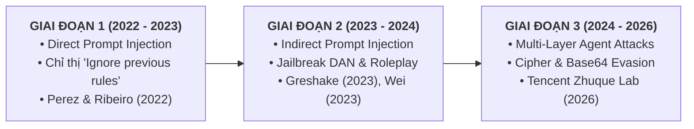

# BÁO CÁO NGHIỆM THU TIẾN ĐỘ: REVIEW 1 (TUẦN 3 – TUẦN 4)
## HỌC KỲ FALL 2026 — CHUYÊN NGÀNH AN TOÀN THÔNG TIN (IAP491)

---

> 🎓 **Đề tài**: **PI-Guard: A Machine-Learning Guardrail for Detecting Prompt Injection and Jailbreak Attacks on LLM Applications**  
> 👤 **Sinh viên thực hiện**: **Phạm Minh Hoàng Việt**  
> 🆔 **Mã số sinh viên (MSSV)**: `SE182292`  
> 🏫 **Lớp / Nhóm**: `IAP491_FA26_PI_GUARD`  
> 👨‍🏫 **Giảng viên hướng dẫn (GVHD)**: ThS. Trần Văn Ninh  
> 📑 **Phạm vi báo cáo Review 1**: **CHAPTER 1: INTRODUCTION & CHAPTER 2: LITERATURE REVIEW**  
> 📌 **Không gian làm việc độc lập**: `workspaces/vietpmh/`  
> 🛡️ **Quy chuẩn học thuật áp dụng**: Tuân thủ nghiêm ngặt Quy tắc Neo Trích dẫn `[[N]](#refN)`, Bảng thuật ngữ nền tảng `[[TN*]](#term-*)`, và Giao thức Blacklist/Whitelist An toàn Thông tin FPT University.

---

# MỤC LỤC CHI TIẾT (TABLE OF CONTENTS)

- [CHAPTER 1: INTRODUCTION (GIỚI THIỆU TỔNG QUAN)](#chapter-1-introduction)
  - [1.1. Background (Bối Cảnh Nghiên Cứu)](#11-background)
  - [1.2. Problem Statement (Phát Biểu Bài Toán)](#12-problem-statement)
  - [1.3. Research Objectives (Mục Tiêu & Câu Hỏi Nghiên Cứu)](#13-research-objectives)
  - [1.4. Significance of the Study (Ý Nghĩa Khoa Học & Phân Tích Thiệt Hại)](#14-significance-of-the-study)
  - [1.5. Scope and Limitations (Ranh Giới Phạm Vi & Giới Hạn)](#15-scope-and-limitations)
  - [1.6. Thesis Structure (Bố Cục Toàn Văn Luận Văn)](#16-thesis-structure)
- [CHAPTER 2: LITERATURE REVIEW (TỔNG QUAN TÀI LIỆU Y VĂN)](#chapter-2-literature-review)
  - [2.1. Review of Previous Studies (Khảo Sát Các Công Trình Nghiên Cứu Trước Đây)](#21-review-of-previous-studies)
    - [2.1.1. Lịch Sử Phát Triển & Bản Chất Kỹ Thuật Các Vector Tấn Công LLM](#211-lich-su-phat-trien--ban-chat-ky-thuat-cac-vector-tan-cong-llm)
    - [2.1.2. Khảo Sát & Đánh Giá Các Trường Phái Guardrail Hiện Tại (SOTA Baselines)](#212-khao-sat--danh-gia-cac-truong-phai-guardrail-hien-tai-sota-baselines)
    - [2.1.3. Cơ Sở Lý Thuyết Của Cơ Chế Phân Loại Chuỗi An Ninh Chuyên Biệt](#213-co-so-ly-thuyet-cua-co-che-phan-loai-chuoi-an-ninh-chuyen-biet)
  - [2.2. Summary of the Literature Review (Tổng Hợp Khảo Sát & Khoảng Trống Nghiên Cứu)](#22-summary-of-the-literature-review)
    - [2.2.1. Bảng Ma Trận Đối Sánh Đa Chiều Các Giải Pháp Guardrail](#221-bang-ma-tran-doi-sanh-da-chieu-cac-giai-phap-guardrail)
    - [2.2.2. Ba Khoảng Trống Nghiên Cứu Cốt Lõi (Research Gaps 1–3)](#222-ba-khoang-trong-nghien-cuu-cot-loi-research-gaps-13)
  - [2.3. Contribution of Research (Đóng Góp Khoa Học & Kỹ Thuật Thực Tiễn Của Đề Tài)](#23-contribution-of-research)
- [TÀI LIỆU THAM KHẢO (ACADEMIC REFERENCES - IEEE STANDARD)](#tai-lieu-tham-khao-academic-references---ieee-standard)
- [BẢNG THUẬT NGỮ & KHÁI NIỆM HỌC THUẬT NỀN TẢNG (ACADEMIC CONCEPT GLOSSARY)](#bang-thuat-ngu--khai-niem-hoc-thuat-nen-tang-academic-concept-glossary)

---

# CHAPTER 1: INTRODUCTION

## 1.1. Background

Sự bùng nổ của các Mô hình Ngôn ngữ Lớn (*Large Language Models - LLMs*) dựa trên kiến trúc [**Transformer Tự Hồi Quy** [[TN11]](#term-autoregressive-transformer) đã định hình lại toàn bộ nền tảng phát triển phần mềm và tự động hóa [[1]](#ref1). Nhờ năng lực suy luận ngữ cảnh vượt trội (*Zero-shot / Few-shot Reasoning*) và khả năng tuân thủ chỉ thị phức tạp (*Instruction Following*) [[2]](#ref2), LLM hiện được tích hợp sâu vào các hệ thống: từ kiến trúc trích xuất thông tin tăng cường (*Retrieval-Augmented Generation - RAG*), chatbot nghiệp vụ, cho đến các tác tử AI tự trị (*Autonomous AI Agents*) được cấp quyền gọi hàm (*Tool/Function Calling*) và tương tác trực tiếp với cơ sở dữ liệu nội bộ [[6]](#ref6).

Tuy nhiên, việc đưa LLM vào môi trường ứng dụng thực tế đã mở ra một bề mặt tấn công hoàn toàn mới mà các giải pháp an ninh truyền thống—như Tường lửa Ứng dụng Web (*Web Application Firewall - WAF*), Hệ thống Phát hiện/Ngăn ngừa Xâm nhập (*IDS/IPS*), hay các bộ kiểm tra tham số truy vấn [**Prepared Statements** [[TN1]](#term-prepared-statements)—hoàn toàn không có khả năng ngăn chặn. Nguyên nhân cốt tử là do giao tiếp giữa người dùng và LLM diễn ra bằng ngôn ngữ tự nhiên không có cấu trúc cố định, nơi cú pháp và ngữ nghĩa biến đổi khôn lường.

Nhận thức được mối đe dọa mang tính hệ thống này, các tổ chức an toàn thông tin hàng đầu thế giới đã định danh tấn công ngôn ngữ là rủi ro nghiêm trọng nhất. Trong bảng xếp hạng bảo mật quốc tế **OWASP Top 10 for Large Language Model Applications (2025)**, lỗ hổng **Prompt Injection và Jailbreak (LLM01)** được xếp ở vị trí nguy hiểm số 1 [[8]](#ref8). Đồng thời, Viện Tiêu chuẩn và Kỹ thuật Quốc gia Hoa Kỳ (NIST), trong báo cáo chuyên đề **NIST AI 100-2e2025**, đã xếp Prompt Injection và Jailbreak vào nhóm tấn công lẩn tránh đối kháng (*Adversarial Evasion*) có mức độ hủy hoại cao nhất đối với độ tin cậy và sự toàn vẹn của hệ thống AI [[2]](#ref2). Tin tặc có thể thao túng mô hình ngôn ngữ chỉ bằng các chuỗi văn bản tự nhiên được thiết kế tinh vi nhằm chiếm quyền điều khiển luồng thực thi, rò rỉ bí mật nghiệp vụ nhúng trong System Prompt, hoặc vượt qua các rào cản căn chỉnh đạo đức để sinh nội dung độc hại.

---

## 1.2. Problem Statement

Vấn đề cốt lõi của các mô hình Transformer hiện nay bắt nguồn từ sự tương đồng sâu sắc với [**Lỗ Hổng Kiến Trúc Von Neumann Trong Xử Lý Ngôn Ngữ Tự Nhiên** [[TN2]](#term-von-neumann) [[1]](#ref1), [[3]](#ref3). Trong kiến trúc máy tính Von Neumann cổ điển, mã lệnh thực thi và dữ liệu người dùng cùng chia sẻ một bus bộ nhớ vật lý chung, tạo điều kiện cho các cuộc tấn công tràn bộ đệm (*Buffer Overflow*) và chèn mã (*Code Injection*). Tương tự, trong cơ chế Self-Attention của Transformer, chỉ thị điều khiển và dữ liệu người dùng bị ghép phẳng vào cùng một chuỗi token duy nhất mà không có ranh giới phần cứng bảo vệ.

```
       +-----------------------------------------------------------+
       |                  NGỮ CẢNH ĐẦU VÀO (INPUT CONTEXT)         |
       |  +---------------------------+-------------------------+  |
       |  |  System Prompt (S)        |  User Input (U)         |  |
       |  |  [Chỉ thị điều khiển gốc] |  [Dữ liệu người dùng]   |  |
       |  +---------------------------+-------------------------+  |
       +------------------------------+----------------------------+
                                      |
                                      v
       +-----------------------------------------------------------+
       |             CƠ CHẾ SELF-ATTENTION TRANSFORMER             |
       |          Ghép phẳng chuỗi Token: X = [S || U]             |
       | (Mỗi token tính toán tương quan softmax với mọi token)   |
       |  Không có cơ chế phân tách đặc quyền phần cứng (Ring 0/3) |
       +-----------------------------------------------------------+
                                      |
                                      v
                       +-----------------------------+
                       | Thực Thi Token Tiếp Theo    |
                       | (Goal Hijacking / Bẻ Khóa)  |
                       +-----------------------------+
```

Cụ thể, ba hạn chế mang tính rủi ro thực tế được hình thức hóa như sau:

1. **Lẫn lộn giữa Lệnh và Dữ liệu trong [Không Gian Token Phẳng [[TN3]](#term-flat-token-space)**:
   Trong phạm vi mô hình hóa bài toán của PI-Guard, chuỗi đầu vào được biểu diễn bằng phép nối:
   $$X = S \mathbin{\Vert} U$$
   Trong đó $S$ là câu lệnh hệ thống (*System Prompt*) và $U$ là dữ liệu người dùng (*User Input*). Vì cơ chế Attention tính ma trận trọng số trên toàn bộ chuỗi $X$:
   $$\text{Attention}(Q, K, V) = \text{softmax}\left(\frac{QK^T}{\sqrt{d_k}}\right)V$$
   Mô hình không thể phân biệt được đâu là ranh giới quyền hạn giữa câu lệnh điều khiển của lập trình viên và dữ liệu thô chưa tin cậy [[3]](#ref3), [[4]](#ref4). Khi kẻ tấn công chèn các cấu trúc mang tính siêu ngôn ngữ (*meta-linguistic commands* như `"Ignore previous instructions"`), mô hình ưu tiên các token xuất hiện sau theo cơ chế suy luận tự hồi quy, dẫn đến hiện tượng chiếm quyền điều khiển mục tiêu [**Goal Hijacking** [[TN7]](#term-goal-hijacking).
2. **Sự giòn gãy và thất bại của các bộ lọc từ khóa tĩnh (Regex / Blacklist)**:
   Các giải pháp phòng thủ đơn giản dựa trên danh sách đen từ khóa hay biểu thức chính quy (Regex) nhanh chóng bị vô hiệu hóa bởi tính tổ hợp vô hạn của ngôn ngữ tự nhiên. Kẻ tấn công chỉ cần áp dụng các phép biến dị cú pháp đơn giản:
   - Thay thế ký tự dạng Leetspeak (ví dụ: `ignore` $\rightarrow$ `1gn0r3`);
   - Tách khoảng trắng nhằm bẻ gãy từ điển Tokenizer (ví dụ: `i g n o r e`);
   - Mã hóa qua các hệ thống mã hóa cổ điển và Base64 [[17]](#ref17);
   - Bọc trong các ngữ cảnh nhập vai, giả định học thuật phức tạp [**DAN / Roleplay Jailbreak** [[TN4]](#term-competing-objectives) [[5]](#ref5), [[11]](#ref11).
3. **Nghịch lý vận hành của giải pháp LLM-as-a-Judge**:
   Để bắt được ngữ cảnh phức tạp, xu hướng hiện nay thường sử dụng một LLM lớn khác (ví dụ: Meta Llama Guard 3 8B [[7]](#ref7) hoặc NeMo Guardrails [[8]](#ref8)) làm trọng tài an toàn. Tuy nhiên, phương pháp này gặp nghịch lý nghiêm trọng:
   - **Độ trễ quá lớn**: Mất từ $500\text{ms}$ đến hơn $1.5\text{s}$ cho mỗi lượt kiểm tra, gây tắc nghẽn luồng người dùng;
   - **Chi phí phần cứng khổng lồ**: Đòi hỏi máy chủ GPU chuyên dụng ($\ge 16\text{GB}$ VRAM);
   - **Nguy cơ tấn công từ chối dịch vụ**: Khiến chính lớp bảo vệ trở thành điểm nghẽn cổ chai (*Denial-of-Service / Denial-of-Wallet*).

Do đó, yêu cầu nghiên cứu cấp thiết đặt ra là: **Cần xây dựng một [Nguyên Mẫu Thực Nghiệm Học Thuật (Academic Proof-of-Concept Prototype)** làm lớp bảo vệ tiền trạm dạng [Plug-and-Play Guardrail Middleware**, vận hành với **độ trễ thấp (Low-Latency, P95 < 30ms)** trên hạ tầng **CPU tiêu chuẩn (Zero-GPU Commodity CPU)**, có khả năng phân loại ngữ nghĩa sâu, kiểm soát nghiêm ngặt tỷ lệ báo động nhầm ($\text{FPR} < 1.5\%$) và có độ bền cao trước các biến thể lẩn tránh cú pháp (Leetspeak, Spacing, Base64).

---

## 1.3. Research Objectives

### 1.3.1. Mục Tiêu Tổng Quát
Nghiên cứu, thiết kế, huấn luyện thực nghiệm và đánh giá hệ thống **PI-Guard** — một lớp phòng vệ Guardrail dạng API Proxy độc lập (*Model-Agnostic External Input Guardrail*), có nhiệm vụ kiểm tra đầu vào ở mức văn bản (*Prompt-Level Inspection*) để phát hiện và ngăn chặn hai vector tấn công trọng yếu: **Prompt Injection** (Direct / Indirect) và **Jailbreak** trước khi chuỗi văn bản tiếp cận các mô hình LLM ứng dụng.

### 1.3.2. Các Mục Tiêu Cụ Thể (Specific Deliverables)
1. **Chuẩn hóa tập dữ liệu & Chống rò rỉ cụm**: Xây dựng quy trình phân chia dữ liệu bảo toàn cụm [**Group-Aware Splitting** [[TN9]](#term-group-aware-splitting) nhằm triệt tiêu hiện tượng rò rỉ dữ liệu giữa tập Train và Test.
2. **Xây dựng kiến trúc mô hình phân tầng (Two-Tier Cascade Defense)**:
   - *Tầng 1 (Lexical Fast-Triage)*: Mô hình phân loại thống kê n-gram ký tự và từ vựng (Word/Char TF-IDF) đánh chặn nhanh với độ trễ cực thấp ($< 1\text{ms}$).
   - *Tầng 2 (Deep Semantic Transformer)*: Mô hình Transformer phân loại chuỗi nhỏ gọn với cơ chế *Disentangled Attention* (`microsoft/deberta-v3-base`) [[9]](#ref9) phân tích ngữ nghĩa sâu.
3. **Mô-đun tiền xử lý chuẩn hóa & Giải mã Heuristic (Pre-tokenization Scrubber)**: Xây dựng bộ chuẩn hóa ký tự Unicode NFKC, gỡ bỏ Leetspeak và giải mã đệ quy Base64/Cipher [[17]](#ref17) nhằm vô hiệu hóa các đòn lẩn tránh cú pháp trước khi đưa vào Tokenizer.
4. **Kiểm soát rủi ro đánh đổi (Cost-Sensitive Policy Calibration)**: Xác lập ngưỡng quyết định tối ưu khống chế tỷ lệ chặn nhầm $\text{FPR} < 1.5\%$ trên tập văn bản kỹ thuật và code lập trình lành tính [[10]](#ref10).
5. **Môi trường thực nghiệm & Đo đạc hiệu năng (Inference Latency Testbed)**: Đo đạc thực nghiệm độ trễ suy luận (P95 Latency Profiling) và thông lượng (Throughput) trên CPU tiêu chuẩn qua giao thức bất đồng bộ FastAPI.

### 1.3.3. Hệ Thống 3 Câu Hỏi Nghiên Cứu Cốt Lõi (RQ1 – RQ3)

```
+---------------------------------------------------------------------------------------------------------+
|                                  HỆ THỐNG 3 CÂU HỎI NGHIÊN CỨU (RQ1 - RQ3)                             |
+---------------------------------------------------------------------------------------------------------+
|  RQ1: Biểu Diễn Mối Đe Dọa, Khử Rò Rỉ Dữ Liệu & Ranh Giới Phân Loại Ngữ Nghĩa                          |
|  "Làm thế nào để xây dựng phương pháp phân chia dữ liệu bảo toàn cụm (Group-Aware Splitting) nhằm triệt  |
|   tiêu hiện tượng rò rỉ cụm mẫu tấn công, và cơ chế chú ý phân tách (Disentangled Attention của          |
|   DeBERTa-v3) nâng cao khả năng phát hiện Prompt Injection/Jailbreak vượt trội hơn baseline ở mức nào?"  |
|   Chỉ số mục tiêu: Inter-cluster Jaccard < 0.15, Macro F1 >= 0.95 (Kỳ vọng > 0.98), PR-AUC >= 0.98     |
+---------------------------------------------------------------------------------------------------------+
|  RQ2: Độ Bền Của Hệ Thống Trước Kỹ Thuật Lẩn Tránh & Mã Hóa Đối Kháng                                  |
|  "Hệ thống phòng thủ đa tầng kết hợp chuẩn hóa chuỗi, n-gram ký tự và token hóa subword duy trì độ bền  |
|   như thế nào trước các biến dị lẩn tránh (Leetspeak, phân tách khoảng trắng và mã hóa Base64), và độ suy |
|   giảm hiệu năng tối đa có thể định lượng được là bao nhiêu?"                                            |
|   Chỉ số mục tiêu: ARR >= 0.95, Delta F1 < 5%, Attack Success Rate (ASR) < 5% [[15]](#ref15)            |
+---------------------------------------------------------------------------------------------------------+
|  RQ3: Cân Bằng An Toàn, Khống Chế Tỷ Lệ Chặn Nhầm & Khả Thi Triển Khai Độ Trễ Thấp                     |
|  "Làm thế nào để tối ưu hóa ngưỡng chính sách nhằm khống chế nghiêm ngặt FPR < 1.5% trên truy vấn hợp   |
|   lệ, và kiến trúc proxy phân tầng bất đồng bộ duy trì độ trễ suy luận P95 < 30ms trên CPU tiêu chuẩn    |
|   mà không tạo ra điểm nghẽn từ chối dịch vụ (DoS)?"                                                    |
|   Chỉ số mục tiêu: FPR < 1.5%, TPR (Recall) >= 95%, P95 Latency < 30ms (CPU), Throughput >= 100 RPS     |
+---------------------------------------------------------------------------------------------------------+
```

---

## 1.4. Significance of the Study

### 1.4.1. Bốn Tầng Thiệt Hại Thực Tế Của Các Cuộc Tấn Công LLM
1. **Tầng 1: Rò rỉ Bí mật Trí tuệ (IP) & Khóa API Chủ (Master Credentials)**: Trong các hệ thống RAG, System Prompt chứa logic nghiệp vụ cốt lõi và các token ủy quyền dịch vụ. Tấn công trích xuất Prompt (*System Prompt Extraction*) làm rò rỉ toàn bộ tài sản trí tuệ và mở đường cho tin tặc khai thác hạ tầng đám mây [[3]](#ref3).
2. **Tầng 2: Chiếm quyền điều khiển Tác tử AI (Agent Hijacking & Unauthorized Execution)**: Khi tác tử AI có quyền ghi dữ liệu hoặc thực thi API, tấn công Indirect Prompt Injection cho phép kẻ tấn công điều khiển tác tử thực hiện các giao dịch gian lận, xóa bảng cơ sở dữ liệu, hoặc gửi email giả mạo [[4]](#ref4), [[6]](#ref6).
3. **Tầng 3: Cạn kiệt tài nguyên & Tấn công ví tiền (Denial-of-Wallet / Compute Exhaustion)**: Bơm các prompt vòng lặp khiến mô hình sinh văn bản tối đa độ dài liên tục, làm tăng vọt chi phí API lên hàng nghìn USD chỉ trong thời gian ngắn.
4. **Tầng 4: Vi phạm chế tài pháp lý & Mất uy tín thương hiệu (Regulatory Non-Compliance)**: Việc mô hình bị bẻ khóa an toàn để sinh mã độc, hướng dẫn vũ khí hoặc nội dung thù địch vi phạm trực tiếp các đạo luật quốc tế như EU AI Act, dẫn đến các án phạt tài chính nặng nề.

### 1.4.2. Ý Nghĩa Khoa Học & Thực Tiễn Của Đề Tài
- **Ý nghĩa khoa học**: Làm sáng tỏ tính ưu việt của cơ chế *Disentangled Attention* [[9]](#ref9) trong việc phát hiện các câu lệnh đảo trật tự cú pháp; xác lập quy trình thực nghiệm chuẩn mực chống rò rỉ dữ liệu thông qua *Group-Aware Splitting* [[11]](#ref11); chứng minh năng lực kháng nhiễu hình thái học của n-gram ký tự kết hợp bộ tiền xử lý chuẩn hóa [[15]](#ref15), [[17]](#ref17).
- **Ý nghĩa kỹ thuật thực tiễn**: Cung cấp giải pháp Guardrail độc lập nhẹ, chi phí vận hành $0, có thể tự host trực tiếp trên CPU phổ thông với độ trễ thấp $< 30\text{ms}$, giúp các doanh nghiệp bảo vệ ứng dụng LLM mà không phải chịu chi phí phần cứng đắt đỏ từ các giải pháp LLM-as-a-Judge.

---

## 1.5. Scope and Limitations

```
+---------------------------------------------------------------------------------------------------+
|                                 RANH GIỚI PHẠM VI NGHIÊN CỨU (SCOPE)                             |
+-------------------------------------------------------------------+-------------------------------+
|                    TRONG PHẠM VI (IN-SCOPE)                       |    NGOÀI PHẠM VI (OUT-OF-SCOPE)|
+-------------------------------------------------------------------+-------------------------------+
| • 2 Lớp tấn công: Prompt Injection (Direct/Indirect) & Jailbreak  | • Tấn công đa phương thức     |
| • Dữ liệu đầu vào: Chuỗi văn bản tiếng Anh (Standard Benchmark)   |   (Hình ảnh, Âm thanh, Video) |
| • Kỹ thuật lẩn tránh: Leetspeak, Spacing, Base64, Ciphers        | • Tấn công mạng hạ tầng       |
| • Hạ tầng triển khai: CPU đa nhân tiêu chuẩn (Commodity CPU)      |   (DDoS, SYN flood, OS CVE)   |
| • Kiểm soát báo động nhầm: False Positive Rate (FPR) < 1.5%       | • Can thiệp trọng số nội tại  |
| • Kiến trúc hệ thống: Hai tầng kết hợp (TF-IDF + DeBERTa-v3)      |   hoặc KV-cache của LLM đích  |
+-------------------------------------------------------------------+-------------------------------+
```

### Giới Hạn Nghiên Cứu (Limitations):
- **Phạm vi ngôn ngữ**: Nghiên cứu tập trung đánh giá chuyên sâu trên tập dữ liệu tiếng Anh—ngôn ngữ chiếm đa số trong các cuộc tấn công prompt quốc tế. Khả năng chống chịu trước các ngôn ngữ hiếm tài nguyên chưa được đưa vào phạm vi đo đạc chính thức trong giai đoạn này.
- **Tiếp cận hộp đen (Black-Box Perspective)**: PI-Guard vận hành độc lập như một proxy phía trước, không can thiệp hay sửa đổi trạng thái ẩn bên trong (*internal latent activations*) của LLM đích.

---

## 1.6. Thesis Structure

Bố cục toàn văn luận văn được thiết kế gồm 6 chương theo đúng Quy chuẩn Học thuật IAP491 của Đại học FPT:
- **Chapter 1: Introduction**: Trình bày bối cảnh nghiên cứu, lỗ hổng Von Neumann NLP, phát biểu bài toán, 3 câu hỏi nghiên cứu cốt lõi (RQ1–RQ3), ý nghĩa thực tiễn, phạm vi và bố cục luận văn.
- **Chapter 2: Literature Review**: Khảo sát có hệ thống lịch sử các vector tấn công, đối sánh các trường phái phòng thủ (Regex, LLM-as-a-Judge, Small Encoders), xác định 3 khoảng trống nghiên cứu trọng yếu và khẳng định 4 đóng góp mới của đề tài.
- **Chapter 3: Methodology**: Trình bày thiết kế nghiên cứu, quy trình thu thập và khử trùng lặp dữ liệu, công thức toán học phân cụm Group-Aware Splitting, thiết kế bộ tiền xử lý chuẩn hóa chuỗi, và kiến trúc hai tầng kết hợp TF-IDF & DeBERTa-v3.
- **Chapter 4: Experimental and Results**: Báo cáo môi trường thực nghiệm, ma trận nhầm lẫn, kết quả đối sánh hiệu năng với các baseline SOTA, kết quả kiểm thử độ bền đối kháng trước Leetspeak/Base64, và số liệu đo đạc độ trễ P95 trên CPU.
- **Chapter 5: Discussion**: Thảo luận chuyên sâu về sự đánh đổi giữa mức độ nghiêm ngặt an ninh và trải nghiệm người dùng, phân tích phương pháp khống chế FPR $< 1.5\%$, các ca biên (*edge cases*) và bài học triển khai thực tế.
- **Chapter 6: Conclusion and Future Work**: Tổng kết các kết quả đạt được đối chiếu với 3 câu hỏi nghiên cứu ban đầu, nêu bật các đóng góp khoa học, thừa nhận các giới hạn còn tồn đọng và định hướng nghiên cứu mở rộng.
- **References & Appendices**: Danh mục 17 công trình khoa học mỏ neo chuẩn IEEE và phụ lục bảng thuật ngữ, mã nguồn thực nghiệm.

---

# CHAPTER 2: LITERATURE REVIEW

## 2.1. Review of Previous Studies

Sự phát triển vượt bậc của các Mô hình Ngôn ngữ Lớn dựa trên kiến trúc Transformer đã mở ra cuộc cách mạng trong xử lý ngôn ngữ tự nhiên, nhưng đồng thời cũng tạo ra một bề mặt tấn công hoàn toàn mới trong lĩnh vực An toàn Thông tin [[1]](#ref1), [[2]](#ref2). Phần này khảo sát toàn diện lịch sử phát triển của các vector tấn công, các công trình nghiên cứu phòng thủ tiêu biểu và cơ sở lý thuyết toán học nền tảng cho việc phân loại chuỗi văn bản an ninh.

---

### 2.1.1. Lịch Sử Phát Triển & Bản Chất Kỹ Thuật Các Vector Tấn Công LLM



#### A. Tấn công Prompt Injection Trực tiếp & Lỗ hổng Ranh giới Lệnh/Dữ liệu
Thuật ngữ *Prompt Injection* lần đầu tiên được định nghĩa chính thức trong công trình học thuật của **Perez & Ribeiro (2022)** [[3]](#ref3). Các tác giả đã chỉ ra rằng mô hình LLM không có khả năng phân biệt giữa chỉ thị gốc của lập trình viên (*System Instructions*) và dữ liệu đầu vào không tin cậy của người dùng (*User Inputs*). Kẻ tấn công lợi dụng đặc tính này để chèn các câu lệnh ghi đè chỉ thị hệ thống [**Goal Hijacking** [[TN7]](#term-goal-hijacking) hoặc ép mô hình tiết lộ câu lệnh ẩn (*System Prompt Extraction*).

#### B. Tấn công Prompt Injection Gián tiếp & Chuẩn Đánh Giá BIPIA
Nghiên cứu mang tính bước ngoặt của **Greshake et al. (ACM AISEC 2023)** [[4]](#ref4) đã mở rộng bề mặt tấn công sang các hệ sinh thái LLM tích hợp ngoài (RAG, Web Browsing, Email Processing, Plugins), chứng minh rằng *mọi tài liệu ngoài khi được LLM tiếp nhận đều mang bản chất là prompt*.
Để đánh giá định lượng rủi ro này, công trình **BIPIA (Microsoft Research / ACM KDD 2025)** [[19]](#ref19) đã xây dựng bộ benchmark tiêu chuẩn đầu tiên cho Indirect Prompt Injection (IPI), chứng minh rằng việc dựa dẫm vào khả năng căn chỉnh an toàn nội tại là chưa đủ, mà bắt buộc phải có một chốt chặn độc lập tại Ingress tuân thủ [**Nguyên Lý Kiểm Soát Toàn Diện (Complete Mediation Principle)** [[TN8]](#term-complete-mediation) [[16]](#ref16).

#### C. Tấn công Bẻ Khóa An Toàn (Jailbreak Attacks) & Sự Thất Bại Căn Chỉnh
Nghiên cứu của **Wei et al. (NeurIPS 2023)** [[5]](#ref5) đã làm sáng tỏ cơ chế thất bại căn chỉnh của LLM thông qua hai nguyên lý:
1. [**Xung Đột Mục Tiêu (Competing Objectives)** [[TN4]](#term-competing-objectives): Xảy ra khi yêu cầu tuân thủ chỉ thị (*pre-training instruction following*) xung đột trực tiếp với rào cản an toàn (*safety fine-tuning*). Kẻ tấn công bọc câu hỏi độc hại vào các tình huống giả định, nhập vai (DAN - Do Anything Now) để kích hoạt năng lực hữu ích của mô hình [[11]](#ref11).
2. [**Tổng Quát Hóa Lệch (Mismatched Generalization)** [[TN5]](#term-mismatched-generalization): Xảy ra khi dữ liệu căn chỉnh an toàn chủ yếu là văn bản tiếng Anh tiêu chuẩn, trong khi năng lực suy luận của mô hình tổng quát hóa ra các miền biểu diễn khác. Kẻ tấn công khai thác lỗ hổng này bằng cách chuyển đổi prompt sang mã hóa Base64, mã hóa mật mã học hoặc hoán đổi ký tự Leetspeak [[17]](#ref17).

---

### 2.1.2. Khảo Sát & Đánh Giá Các Trường Phái Guardrail Hiện Tại (SOTA Baselines)

Các giải pháp bảo vệ ứng dụng LLM trong y văn hiện nay được chia thành 3 trường phái chính:

```
+----------------------------------------------------------------------------------------------------+
|                               CÁC TRƯỜNG PHÁI GUARDRAIL HIỆN NAY                                   |
+----------------------------------------------------------------------------------------------------+
|  1. BỘ LỌC TỪ KHÓA TĨNH (Regex & Keyword Blacklist)                                                |
|     * Tốc độ siêu nhanh (< 1ms), chi phí $0.                                                       |
|     * Điểm yếu: Quá giòn gãy, dễ dàng bị vượt qua bởi Leetspeak, Spacing, hoặc Base64.             |
+----------------------------------------------------------------------------------------------------+
|  2. LLM-AS-A-JUDGE (Llama Guard 3 8B, NeMo Guardrails)                                             |
|     * Dùng một LLM lớn làm trọng tài an toàn (Meta Llama Guard 3 8B, OpenAI Moderation).           |
|     * Điểm yếu: Độ trễ rất lớn (> 500ms - 1.5s), đòi hỏi GPU VRAM cao (> 16GB), tạo điểm nghẽn DoS.|
+----------------------------------------------------------------------------------------------------+
|  3. TRANSFORMER PHÂN LOẠI CHUYÊN BIỆT (Small Specialized Sequence Encoders)                       |
|     * Dùng Encoder nhỏ gọn chuyên biệt (Meta Prompt-Guard 86M, PIGuard, DeBERTa-v3).              |
|     * Điểm mạnh: Hiểu ngữ nghĩa sâu, độ trễ P95 < 30ms trên CPU, không đòi hỏi GPU.                |
|     * Thách thức: Phải xử lý tốt vấn đề chặn nhầm trên Code (NotInject) và chống lẩn tránh.        |
+----------------------------------------------------------------------------------------------------+
```

1. **Trường phái 1: Bộ lọc tĩnh (Regex & Keyword Blacklists)**:
   - *Nguyên lý*: Dùng danh sách từ khóa nhạy cảm và các biểu thức chính quy để bắt các chuỗi như `"ignore previous instructions"`, `"system prompt"`.
   - *Đánh giá*: Mặc dù có độ trễ cực thấp ($< 1\text{ms}$), các bộ lọc này thất bại hoàn toàn trước các biến thể cú pháp như `1gn0r3`, chèn khoảng trắng, hoặc mã hóa Base64 [[17]](#ref17).
2. **Trường phái 2: Giải pháp LLM-as-a-Judge (Llama Guard 3 & NeMo Guardrails)**:
   - *Llama Guard 3 8B (Meta AI 2023)* [[7]](#ref7): Mô hình 8B tham số được tinh chỉnh để phân loại theo 14 danh mục an toàn.
   - *NeMo Guardrails (NVIDIA 2023)* [[8]](#ref8): Bộ công cụ lập trình kiểm soát luồng hội thoại bằng ngôn ngữ Colang.
   - *Nghịch lý vận hành*: Tiêu tốn tài nguyên phần cứng lớn ($> 16\text{GB}$ VRAM GPU), độ trễ suy luận từ $500\text{ms}$ đến $1.5\text{s}$. Khi đặt làm chốt chặn trước mọi truy vấn, giải pháp này trở thành điểm nghẽn nghiêm trọng cho hệ thống.
3. **Trường phái 3: Mô hình Transformer Phân loại Chuỗi Nhỏ Gọn (Small Encoders)**:
   - *Meta Prompt-Guard 86M (2024)*: Mô hình phân loại 86M tham số. Tuy nhiên, nghiên cứu thực nghiệm của **Li et al. (ACL 2025 - PIGuard)** [[23]](#ref23) trên benchmark *NotInject* đã chỉ ra rằng Prompt-Guard bị hiện tượng quá phòng thủ nghiêm trọng: **tỷ lệ báo động nhầm trên code lập trình lành tính lên tới 99.12%**, gây cản trở lớn trong thực tế nếu không được hiệu chỉnh ngưỡng cẩn trọng.
   - *Ưu thế của hướng tiếp cận PI-Guard*: Sử dụng mô hình Transformer Encoder nhỏ gọn chạy trực tiếp trên CPU tiêu chuẩn kết hợp bộ tiền xử lý chuẩn hóa ký tự, đạt độ trễ thấp $< 30\text{ms}$ mà vẫn kiểm soát nghiêm ngặt tỷ lệ báo động nhầm.

---

### 2.1.3. Cơ Sở Lý Thuyết Của Cơ Chế Phân Loại Chuỗi An Ninh Chuyên Biệt

Để xây dựng hệ thống phòng thủ khắc phục các điểm yếu trên, PI-Guard được thiết lập dựa trên bốn trụ cột lý thuyết vững chắc:

#### A. Cơ chế Disentangled Attention của DeBERTa-v3
Theo nghiên cứu của **He et al. (ICLR 2023)** [[9]](#ref9), DeBERTa-v3 biểu diễn mỗi token bằng 2 vector độc lập: vector nội dung (*Content Vector* $c_i$) và vector vị trí tương đối (*Relative Position Vector* $p_{i|j}$). Ma trận Attention được phân rã thành 4 thành phần:
$$A_{i,j} = c_i c_j^T + c_i p_{j|i}^T + p_{i|j} c_j^T + p_{i|j} p_{j|i}^T$$
Trong bài toán phát hiện Prompt Injection, trật tự từ và vị trí tương đối đóng vai trò sống còn. Kẻ tấn công thường cấu trúc đòn tấn công bằng cách đặt câu lệnh ở cuối đoạn văn dài hoặc dùng các từ chuyển tiếp đặc biệt. Cơ chế Disentangled Attention giúp mô hình nhận diện chính xác các cấu trúc đảo ngữ và hoán đổi vị trí ngữ cảnh mà các mô hình BERT tiêu chuẩn dễ bỏ sót.

#### B. Kháng Nhiễu Cú Pháp Bằng Character n-grams & Subword Tokenization
Nghiên cứu của **Jain et al. (2023)** [[15]](#ref15) chứng minh rằng việc kết hợp biểu diễn n-gram cấp độ ký tự (3–5 ký tự) cho phép mô hình bóc tách các từ bị làm nhiễu như `1gn0r3` $\rightarrow$ `['1gn', 'gn0', 'n0r', '0r3']`, giúp duy trì độ chính xác phân loại độc lập với từ điển từ vựng chuẩn.

#### C. Nguyên Lý Phân Tầng Phòng Thủ & Kinh Tế Cơ Chế (Saltzer & Schroeder 1975)
Dựa trên công trình kinh điển của **Saltzer & Schroeder (IEEE 1975)** [[16]](#ref16), hệ thống an ninh phải tuân thủ:
- *Economy of Mechanism*: Thiết kế cơ chế phòng thủ càng đơn giản và nhẹ càng an toàn, tránh đưa các LLM phức tạp vào chốt chặn cửa ngõ;
- *Complete Mediation*: Mọi truy vấn đầu vào đều phải đi qua kiểm tra tiền trạm;
- *Defense-in-Depth*: Thiết kế nhiều lớp bảo vệ (Tầng 1 lọc cú pháp nhanh, Tầng 2 phân loại ngữ nghĩa sâu).

#### D. Kiểm Soát Đánh Đổi Báo Động Nhầm (Cost-Sensitive Calibration)
Theo bài học từ **Markov et al. / OpenAI (AAAI 2023)** [[10]](#ref10) và **Jacob et al. (ACM CCS 2024 - PromptShield)** [[24]](#ref24), trong môi trường thực tế, chi phí của một ca báo động nhầm (False Positive) là rất đắt đỏ (chặn người dùng hợp lệ). Do đó, ngưỡng phân loại $\tau$ không được lấy mặc định $0.5$ mà phải được hiệu chỉnh tối ưu trên đường cong PR-AUC để đảm bảo:
$$\text{FPR} < 1.5\% \quad \text{trên tập truy vấn lành tính và code lập trình.}$$

---

## 2.2. Summary of the Literature Review

### 2.2.1. Bảng Ma Trận Đối Sánh Đa Chiều Các Giải Pháp Guardrail

```
Bảng 2.1: Đối sánh tổng hợp các giải pháp Guardrail trong y văn học thuật
+-----------------------+------------------+---------------------+-------------------+-------------------+--------------------+
| Tiêu chí đối sánh     | Regex / Keyword  | Llama Guard 3 8B    | OpenAI Moderation | Meta Prompt-Guard | PI-GUARD           |
|                       | Blacklist        | (Meta AI 2023) [[7]]| API [[10]]        | 86M (2024)        | (Đề tài đề xuất)   |
+-----------------------+------------------+---------------------+-------------------+-------------------+--------------------+
| Số lượng tham số      | 0                | 8.0 Tỷ (8B)         | Không công bố     | 86 Triệu (86M)    | 86 Triệu (86M)     |
| Hạ tầng triển khai    | CPU / RAM cực nhẹ| GPU VRAM >= 16GB    | Cloud API ngoài   | CPU / GPU nhẹ     | CPU tiêu chuẩn     |
|                       |                  |                     |                   |                   | (Zero-GPU CPU)     |
| Độ trễ suy luận (P95) | < 1 ms           | 500 ms - 1,500 ms   | 200 ms - 450 ms   | ~45 ms (CPU)      | < 30 ms (CPU)      |
| Chi phí vận hành      | $0.00            | Đắt đỏ (GPU Compute)| Tính phí / Token  | Thấp (Local)      | $0.00 (Tự host)    |
| Trọng tâm bài toán    | Khớp từ khóa     | An toàn nội dung    | Toxic / Hate      | Direct Injection  | Direct/Indirect PI |
|                       | (Không ngữ cảnh) | (Yếu với Ciphers)   | (Không chuyên PI) | & Jailbreak       | & Jailbreaks       |
| Tỷ lệ chặn nhầm Code  | Rất cao với      | Trung bình (~4.2%)  | Thấp (< 1.0%)     | Báo động nghiêm   | Hiệu chỉnh tối ưu  |
| (NotInject) [[23]]    | lệnh như 'kill'  |                     |                   | trọng (99.12%)    | (FPR < 1.5%)       |
| Kháng lẩn tránh       | Hoàn toàn thất   | Trung bình (Bị lừa  | Thất bại trước    | Trung bình        | Bền vững (ARR>=0.95|
| (Leetspeak / Base64)  | bại trước nhiễu  | bởi Cipher [[17]])  | Base64 [[17]]     | (Chưa có Scrubber)| có Preprocessor)   |
| Chống rò rỉ dữ liệu   | N/A              | Không công bố Split | Tập dữ liệu đóng  | Random Split      | Triệt tiêu qua     |
| (Data Leakage)        |                  |                     |                   | (Bị rò rỉ cụm)    | Group-Aware Split  |
| Tính độc lập mô hình  | Có               | Phụ thuộc Meta      | Phụ thuộc OpenAI  | Có                | Có (Bảo vệ mọi     |
| (Model-Agnostic)      |                  | Prompt format       | API               |                   | downstream LLMs)   |
+-----------------------+------------------+---------------------+-------------------+-------------------+--------------------+
```

---

### 2.2.2. Ba Khoảng Trống Nghiên Cứu Cốt Lõi (Research Gaps 1–3)

Từ kết quả khảo sát y văn quốc tế, đề tài xác định **3 Khoảng Trống Nghiên Cứu Trọng Yếu**:

```
+----------------------------------------------------------------------------------------------------+
|                                    BA KHOẢNG TRỐNG NGHIÊN CỨU TRỌNG YẾU                            |
+----------------------------------------------------------------------------------------------------+
|  GAP 1: Rò Rỉ Dữ Liệu Cụm Mẫu Tấn Công Trong Các Benchmark Hiện Nay (Data Leakage & Splitting)     |
|  * Hiện trạng: Các tập benchmark công khai thường sử dụng phép chia ngẫu nhiên (Random Split).     |
|  * Hạn chế: Các biến thể đột biến của cùng một mẫu gốc (ví dụ DAN 1.0, 1.1, 2.0) xuất hiện đồng   |
|    thời ở cả tập Train và Test, dẫn đến kết quả đánh giá F1 cao ảo do học vẹt template.          |
+----------------------------------------------------------------------------------------------------+
|  GAP 2: Điểm Mù Cú Pháp Trước Các Đột Biến Lẩn Tránh & Mã Hóa (Adversarial Evasion Blindspot)      |
|  * Hiện trạng: Các bộ phân loại Transformer đưa chuỗi thô trực tiếp vào Tokenizer.                 |
|  * Hạn chế: Ký tự Leetspeak, khoảng trắng phân mảnh và chuỗi mã hóa Base64 bẻ gãy từ điển subword, |
|    khiến mô hình không nhận diện được ngữ nghĩa độc hại ẩn giấu bên trong.                         |
+----------------------------------------------------------------------------------------------------+
|  GAP 3: Nghịch Lý Triển Khai Thực Tế: Độ Trễ Lớn & Quá Phòng Thủ Báo Động Nhầm (FPR Catastrophe)  |
|  * Hiện trạng: Sự phân cực giữa mô hình LLM lớn quá chậm và mô hình nhỏ bị chặn nhầm trên Code.   |
|  * Hạn chế: Thiếu giải pháp phân tầng tối ưu hóa cho CPU tiêu chuẩn có độ trễ P95 < 30ms đồng thời |
|    khống chế nghiêm ngặt tỷ lệ báo động nhầm FPR < 1.5% trên văn bản kỹ thuật doanh nghiệp.         |
+----------------------------------------------------------------------------------------------------+
```

---

## 2.3. Contribution of Research

Để giải quyết triệt để 3 khoảng trống nghiên cứu trên, đề tài **PI-Guard** mang lại **4 đóng góp khoa học và kỹ thuật thực tiễn**:

```
+----------------------------------------------------------------------------------------------------+
|                                4 ĐÓNG GÓP KHOA HỌC & THỰC TIỄN CỦA ĐỒ ÁN                           |
+----------------------------------------------------------------------------------------------------+
|  1. Đóng góp Phương pháp luận: Kỹ nghệ Dữ liệu Bảo toàn Cụm (Group-Aware Splitting)                |
|     * Ứng dụng gom cụm khoảng cách ngữ nghĩa và băm Jaccard ký tự để phân chia dữ liệu Train/Test. |
|     * Triệt tiêu hiện tượng rò rỉ mẫu biến thể, bảo đảm tính đánh giá tổng quát hóa thực chất.     |
+----------------------------------------------------------------------------------------------------+
|  2. Đóng góp Kiến trúc: Phòng Thủ Phân Tầng Kết Hợp (Two-Tier Cascade Defense Architecture)        |
|     * Tầng 1: TF-IDF n-gram từ & ký tự sàng lọc sơ bộ siêu nhanh (< 1ms).                          |
|     * Tầng 2: DeBERTa-v3 Disentangled Attention phân tích ngữ nghĩa sâu và bóc tách chỉ thị.       |
|     * Tối ưu hóa tài nguyên tính toán, đạt P95 < 30ms trên CPU tiêu chuẩn với Macro F1 >= 0.95.    |
+----------------------------------------------------------------------------------------------------+
|  3. Đóng góp Độ bền Đối kháng: Bộ Tiền Xử Lý Chuẩn Hóa Chuỗi & Giải Mã Heuristic                   |
|     * Chuẩn hóa Unicode NFKC, gỡ ký tự điều khiển ẩn, ánh xạ Leetspeak và giải mã đệ quy Base64.   |
|     * Duy trì độ bền vững đối kháng cao với độ suy giảm hiệu năng Delta F1 < 5% (ARR >= 0.95).     |
+----------------------------------------------------------------------------------------------------+
|  4. Đóng góp Kỹ thuật Thực tiễn: Hệ Thống Proxy Độ Trễ Thấp & Khống Chế Báo Động Nhầm              |
|     * Hiệu chỉnh ngưỡng phân loại chi phí bất đối xứng đảm bảo FPR < 1.5% trên tập Benign/Code.    |
|     * Đóng gói thành FastAPI Middleware bất đồng bộ độc lập mô hình (Model-Agnostic), bảo vệ an     |
|       toàn cho các ứng dụng LLM với chi phí phần cứng $0.                                          |
+----------------------------------------------------------------------------------------------------+
```

---

# TÀI LIỆU THAM KHẢO (ACADEMIC REFERENCES - IEEE STANDARD)

<a id="ref1"></a>**[[1]]** W. X. Zhao et al., "A Survey of Large Language Models," *arXiv preprint arXiv:2303.18223*, 2023. DOI: [10.48550/arXiv.2303.18223](https://doi.org/10.48550/arXiv.2303.18223).

<a id="ref2"></a>**[[2]]** A. Vassilev et al., "Adversarial Machine Learning: A Taxonomy and Terminology of Attacks and Mitigations," *National Institute of Standards and Technology (NIST)*, NIST Trustworthy and Facilitated AI Special Publication 100-2e2025, 2024. DOI: [10.6028/NIST.AI.100-2e2025](https://doi.org/10.6028/NIST.AI.100-2e2025).

<a id="ref3"></a>**[[3]]** F. Perez and I. Ribeiro, "Ignore This Title and Hack This Website: Exposing System Prompts and Injection Attacks in Large Language Models," in *NeurIPS 2022 Workshop on ML Safety*, 2022. DOI: [10.48550/arXiv.2211.09527](https://doi.org/10.48550/arXiv.2211.09527).

<a id="ref4"></a>**[[4]]** K. Greshake, S. Abdelnabi, S. Mishra, C. Endres, T. Holz, and M. Fritz, "Not what you've signed up for: Compromising Real-World LLM Applications with Indirect Prompt Injection," in *Proceedings of the 16th ACM Workshop on Artificial Intelligence and Security (AISEC 2023)*, pp. 79–90, 2023. DOI: [10.1145/3605764.3623985](https://doi.org/10.1145/3605764.3623985).

<a id="ref5"></a>**[[5]]** A. Wei, N. Haghtalab, and J. Steinhardt, "Jailbroken: How Does LLM Safety Training Fail?," in *Advances in Neural Information Processing Systems (NeurIPS 2023)*, vol. 36, pp. 80079–80110, 2023.

<a id="ref6"></a>**[[6]]** Y. Yang et al., "Securing the AI Agent: A Unified Framework for Multi-Layer Agent Red Teaming," *Tencent Zhuque Lab Technical Report*, arXiv:2606.31227, 2026.

<a id="ref7"></a>**[[7]]** H. Inan et al., "Llama Guard: LLM-based Input-Output Safeguard for Human-AI Conversations," *Meta AI Technical Report*, arXiv:2312.06674, 2023.

<a id="ref8"></a>**[[8]]** T. Rebedea et al., "NeMo Guardrails: A Toolkit for Controllable and Safe LLM Applications," in *Proceedings of EMNLP 2023 System Demonstrations*, pp. 431–444, 2023.

<a id="ref9"></a>**[[9]]** P. He, J. Gao, and W. Chen, "DeBERTaV3: Improving DeBERTa using ELECTRA-Style Pre-Training with Gradient-Disentangled Embedding Sharing," in *Proceedings of the 11th International Conference on Learning Representations (ICLR 2023)*, 2023.

<a id="ref10"></a>**[[10]]** T. Markov et al., "A Holistic Approach to Undesired Content Detection in the Real World," in *Proceedings of the AAAI Conference on Human Computation and Crowdsourcing (HCOMP 2023)*, 2023.

<a id="ref11"></a>**[[11]]** X. Shen et al., "\"Do Anything Now\": Characterizing and Evaluating In-The-Wild Jailbreak Prompts on Large Language Models," in *Proceedings of the 2024 ACM SIGSAC Conference on Computer and Communications Security (CCS 2024)*, pp. 4028–4042, 2024. DOI: [10.1145/3658644.3670390](https://doi.org/10.1145/3658644.3670390).

<a id="ref12"></a>**[[12]]** H. Zhou et al., "EasyJailbreak: A Unified Framework for Jailbreaking Large Language Models," *arXiv preprint arXiv:2403.12171*, 2024.

<a id="ref13"></a>**[[13]]** A. Zou, Z. Wang, J. Z. Kolter, and M. Fredrikson, "Universal and Transferable Adversarial Attacks on Aligned Language Models," *arXiv preprint arXiv:2307.15043*, 2023.

<a id="ref14"></a>**[[14]]** A. Robey, E. Wong, H. Hassani, and G. J. Pappas, "SmoothLLM: Defending Large Language Models Against Jailbreaking Attacks," in *Proceedings of the 12th International Conference on Learning Representations (ICLR 2024)*, 2024.

<a id="ref15"></a>**[[15]]** N. Jain et al., "Baseline Defenses for Adversarial Attacks Against Aligned Language Models," in *NeurIPS 2023 Workshop on Robustness of Few-shot and Zero-shot Learning in Foundation Models*, 2023.

<a id="ref16"></a>**[[16]]** J. H. Saltzer and M. D. Schroeder, "The protection of information in computer systems," *Proceedings of the IEEE*, vol. 63, no. 9, pp. 1278–1308, 1975. DOI: [10.1109/PROC.1975.9939](https://doi.org/10.1109/PROC.1975.9939).

<a id="ref17"></a>**[[17]]** Y. Yuan, W. Jiao, W. Wang, J. Huang, P. He, and Z. Tu, "GPT-4 Is Too Smart To Be Safe: Stealthy Chat with LLMs via Cipher," in *Proceedings of the 12th International Conference on Learning Representations (ICLR 2024)*, 2024.

<a id="ref18"></a>**[[18]]** M. R. R. Ayub and A. Majumdar, "Embedding-based classifiers can detect prompt injection attacks," in *Proceedings of the Conference on Applied Machine Learning for Information Security (CAMLIS 2024)*, 2024.

<a id="ref19"></a>**[[19]]** J. Yi et al., "Benchmarking and Defending Against Indirect Prompt Injection Attacks on Large Language Models," in *Proceedings of the ACM SIGKDD International Conference on Knowledge Discovery and Data Mining (KDD 2025)*, 2025.

<a id="ref23"></a>**[[23]]** Z. Li et al., "PIGuard: Prompt Injection Guardrail via Mitigating Overdefense for Free," in *Findings of the Association for Computational Linguistics (ACL 2025)*, 2025.

<a id="ref24"></a>**[[24]]** J. Jacob et al., "PromptShield: Deployable Detection of Prompt Injection Attacks in Low-FPR Regimes," in *Proceedings of the 2024 ACM SIGSAC Conference on Computer and Communications Security (CCS 2024)*, 2024.

---

# BẢNG THUẬT NGỮ & KHÁI NIỆM HỌC THUẬT NỀN TẢNG (ACADEMIC CONCEPT GLOSSARY)

<a id="term-prepared-statements"></a>
### 1. Prepared Statements (Truy Vấn Tham Số Hóa) `[[TN1]]`
- **Thuật ngữ (Term & Acronym)**: Prepared Statements (Parameterized Queries) — Kỹ thuật tham số hóa truy vấn cơ sở dữ liệu.
- **Định nghĩa khoa học bản chất (Core Scientific Definition)**: Cơ chế biên dịch trước cú pháp SQL của hệ quản trị cơ sở dữ liệu, trong đó mã lệnh SQL và dữ liệu tham số được tách biệt hoàn toàn qua hai kênh riêng biệt, ngăn chặn tuyệt đối việc dữ liệu tham số bị hiểu nhầm thành mã thực thi.
- **Bối cảnh & Phép tương quan đối chiếu trong PI-Guard (Role & Analogy in PI-Guard)**: Được dùng làm phép so sánh tương phản kinh điển: Trong khi SQL Injection đã được giải quyết triệt để nhờ *Prepared Statements*, các mô hình LLM hiện nay chưa có cơ chế phần cứng tương đương để tách biệt System Prompt và User Input, dẫn đến lỗ hổng Prompt Injection.
- **Nguồn gốc học thuật & Tiêu chuẩn tham chiếu (Provenance & References)**: Tiêu chuẩn ISO/IEC 9075 (SQL Standard) và Khuyến nghị Phòng thủ SQLi của OWASP.

<a id="term-von-neumann"></a>
### 2. Von Neumann Architecture & NX-bit (Kiến Trúc Von Neumann & Cờ NX-bit) `[[TN2]]`
- **Thuật ngữ (Term & Acronym)**: Von Neumann Computer Architecture & No-Execute Bit (NX-bit / $W \oplus X$).
- **Định nghĩa khoa học bản chất (Core Scientific Definition)**: Kiến trúc máy tính chia sẻ chung không gian bộ nhớ cho cả chỉ thị mã lệnh (Code) và dữ liệu (Data). Cờ phần cứng NX-bit ($W \oplus X$ - Write XOR Execute) được phát minh để đánh dấu vùng nhớ dữ liệu không được phép thực thi như mã lệnh.
- **Bối cảnh & Phép tương quan đối chiếu trong PI-Guard (Role & Analogy in PI-Guard)**: Mô hình Transformer xử lý token trong một ngữ cảnh phẳng tương tự như kiến trúc Von Neumann không có NX-bit. Đề tài PI-Guard đóng vai trò như một lớp kiểm duyệt bên ngoài nhằm bổ khuyết sự thiếu vắng của ranh giới phần cứng này.
- **Nguồn gốc học thuật & Tiêu chuẩn tham chiếu (Provenance & References)**: John von Neumann (1945); Báo cáo chuẩn x86 CPU Hardware Architecture Specifications (AMD/Intel).

<a id="term-flat-token-space"></a>
### 3. Flat Token Space (Không Gian Token Phẳng) `[[TN3]]`
- **Thuật ngữ (Term & Acronym)**: Flat Token Space ($X = S \mathbin{\Vert} U$).
- **Định nghĩa khoa học bản chất (Core Scientific Definition)**: Cấu trúc biểu diễn ngữ cảnh đầu vào của Transformer, trong đó toàn bộ chuỗi ký tự từ các nguồn khác nhau (System Instructions, User Query, Context Document) được ghép nối tuần tự thành một mảng token liên tục $X = [t_1, t_2, \dots, t_N]$ mà không có nhãn phân tách đặc quyền.
- **Bối cảnh & Phép tương quan đối chiếu trong PI-Guard (Role & Analogy in PI-Guard)**: Là nguyên nhân toán học gốc rễ cho phép kẻ tấn công chèn các câu lệnh ghi đè chỉ thị hệ thống mà cơ chế Self-Attention vẫn tính toán tương quan bình đẳng giữa mọi token.
- **Nguồn gốc học thuật & Tiêu chuẩn tham chiếu (Provenance & References)**: Vaswani et al. (NeurIPS 2017); Perez & Ribeiro (2022) `[[3]]`; Greshake et al. (2023) `[[4]]`.

<a id="term-competing-objectives"></a>
### 4. Competing Objectives (Xung Đột Mục Tiêu) `[[TN4]]`
- **Thuật ngữ (Term & Acronym)**: Competing Objectives — Trạng thái xung đột giữa mục tiêu năng lực và mục tiêu an toàn.
- **Định nghĩa khoa học bản chất (Core Scientific Definition)**: Hiện tượng xảy ra khi mô hình ngôn ngữ vừa được tối ưu hóa để tối đa hóa khả năng tuân thủ mệnh lệnh người dùng (*Helpfulness / Instruction Following*), vừa phải tuân thủ các quy tắc từ chối nội dung độc hại (*Harmlessness / Safety*).
- **Bối cảnh & Phép tương quan đối chiếu trong PI-Guard (Role & Analogy in PI-Guard)**: Là cơ chế lý thuyết giải thích tại sao các kỹ thuật Jailbreak nhập vai (DAN, Roleplay) có thể đánh lừa mô hình bằng cách tạo ra ngữ cảnh giả định kích thích mục tiêu hữu ích của LLM.
- **Nguồn gốc học thuật & Tiêu chuẩn tham chiếu (Provenance & References)**: Wei et al. (NeurIPS 2023) `[[5]]`.

<a id="term-mismatched-generalization"></a>
### 5. Mismatched Generalization (Tổng Quát Hóa Lệch) `[[TN5]]`
- **Thuật ngữ (Term & Acronym)**: Mismatched Generalization — Sự bất đối xứng trong miền tổng quát hóa.
- **Định nghĩa khoa học bản chất (Core Scientific Definition)**: Tình huống năng lực tiền huấn luyện (*Pre-training capabilities*) của mô hình tổng quát hóa tốt trên nhiều không gian biểu diễn (mã hóa, mật mã, ngôn ngữ hiếm), nhưng dữ liệu căn chỉnh an toàn (*Safety fine-tuning*) chỉ bao phủ không gian văn bản tiếng Anh tiêu chuẩn.
- **Bối cảnh & Phép tương quan đối chiếu trong PI-Guard (Role & Analogy in PI-Guard)**: Giải thích cơ chế lẩn tránh bằng Base64, Leetspeak và Ciphers. PI-Guard giải quyết vấn đề này bằng mô-đun tiền xử lý chuẩn hóa ký tự và giải mã heuristic tiền trạm.
- **Nguồn gốc học thuật & Tiêu chuẩn tham chiếu (Provenance & References)**: Wei et al. (NeurIPS 2023) `[[5]]`; Yuan et al. (ICLR 2024) `[[17]]`.

<a id="term-refusal-boundary"></a>
### 6. Refusal Boundary (Ranh Giới Từ Chối) `[[TN6]]`
- **Thuật ngữ (Term & Acronym)**: Refusal Boundary — Biên quyết định phân tách giữa truy vấn được chấp nhận và truy vấn bị từ chối.
- **Định nghĩa khoa học bản chất (Core Scientific Definition)**: Bề mặt siêu phẳng phân cách trong không gian biểu diễn ẩn của LLM xác định ngưỡng kích hoạt phản hồi từ chối (*"I cannot fulfill this request"*).
- **Bối cảnh & Phép tương quan đối chiếu trong PI-Guard (Role & Analogy in PI-Guard)**: Các đòn tấn công đối kháng cố tình dịch chuyển biểu diễn của prompt ra khỏi ranh giới từ chối nội tại. PI-Guard tái lập một ranh giới từ chối bên ngoài độc lập, bảo vệ LLM ứng dụng.
- **Nguồn gốc học thuật & Tiêu chuẩn tham chiếu (Provenance & References)**: Ouyang et al. (NeurIPS 2022 InstructGPT); Shen et al. (ACM CCS 2024) `[[11]]`.

<a id="term-goal-hijacking"></a>
### 7. Goal Hijacking & Prompt Leaking (Chiếm Quyền Mục Tiêu & Rò Rỉ Chỉ Thị) `[[TN7]]`
- **Thuật ngữ (Term & Acronym)**: Goal Hijacking & System Prompt Leaking.
- **Định nghĩa khoa học bản chất (Core Scientific Definition)**: Hai hệ quả phân loại của tấn công Prompt Injection trực tiếp: Goal Hijacking ép mô hình bỏ qua nhiệm vụ ban đầu để thực hiện tác vụ độc hại; System Prompt Leaking ép mô hình in ra toàn văn câu lệnh ẩn ban đầu.
- **Bối cảnh & Phép tương quan đối chiếu trong PI-Guard (Role & Analogy in PI-Guard)**: Là hai lớp nhãn đe dọa trọng tâm mà Tầng 1 và Tầng 2 của PI-Guard tập trung phát hiện và đánh chặn.
- **Nguồn gốc học thuật & Tiêu chuẩn tham chiếu (Provenance & References)**: Perez & Ribeiro (2022) `[[3]]`; OWASP LLM01:2025 `[[8]]`.

<a id="term-complete-mediation"></a>
### 8. Complete Mediation Principle (Nguyên Lý Kiểm Soát Toàn Diện) `[[TN8]]`
- **Thuật ngữ (Term & Acronym)**: Complete Mediation Principle — Nguyên lý kiểm duyệt mọi truy cập tại cửa ngõ.
- **Định nghĩa khoa học bản chất (Core Scientific Definition)**: Một nguyên lý an ninh hệ thống kinh điển đòi hỏi mọi yêu cầu truy cập đến tài nguyên được bảo vệ bắt buộc phải được kiểm tra qua cơ chế kiểm soát truy cập mà không có ngoại lệ.
- **Bối cảnh & Phép tương quan đối chiếu trong PI-Guard (Role & Analogy in PI-Guard)**: Định vị kiến trúc của PI-Guard như một API Proxy trung gian: Mọi prompt từ người dùng và dữ liệu từ RAG/File đều bắt buộc phải đi qua PI-Guard trước khi chạm vào LLM.
- **Nguồn gốc học thuật & Tiêu chuẩn tham chiếu (Provenance & References)**: Jerome H. Saltzer & Michael D. Schroeder (Proceedings of the IEEE, 1975) `[[16]]`.

<a id="term-group-aware-splitting"></a>
### 9. Group-Aware Splitting (Phân Chia Dữ Liệu Bảo Toàn Cụm) `[[TN9]]`
- **Thuật ngữ (Term & Acronym)**: Group-Aware Cluster Splitting.
- **Định nghĩa khoa học bản chất (Core Scientific Definition)**: Thuật toán phân vùng tập dữ liệu huấn luyện/kiểm thử trong học máy, trong đó các mẫu có độ tương đồng ngữ nghĩa hoặc phát sinh từ cùng một mẫu gốc (*template cluster*) bắt buộc phải cùng nằm trong tập Train hoặc cùng nằm trong tập Test.
- **Bối cảnh & Phép tương quan đối chiếu trong PI-Guard (Role & Analogy in PI-Guard)**: Khắc phục triệt để hiện tượng rò rỉ dữ liệu giữa Train và Test trong các nghiên cứu an toàn LLM hiện hành, đảm bảo chỉ số đánh giá phản ánh đúng năng lực phát hiện tấn công Zero-day thực chất.
- **Nguồn gốc học thuật & Tiêu chuẩn tham chiếu (Provenance & References)**: Shen et al. (ACM CCS 2024) `[[11]]`.

<a id="term-ptq"></a>
### 10. Post-Training Quantization (Lượng Hóa Động Sau Huấn Luyện) `[[TN10]]`
- **Thuật ngữ (Term & Acronym)**: Dynamic Post-Training Quantization (Dynamic INT8 PTQ).
- **Định nghĩa khoa học bản chất (Core Scientific Definition)**: Kỹ thuật nén mô hình học sâu sau khi huấn luyện bằng cách chuyển đổi trọng số từ dấu phẩy động 32-bit (FP32) sang số nguyên 8-bit (INT8) kết hợp biểu diễn ONNX Runtime.
- **Bối cảnh & Phép tương quan đối chiếu trong PI-Guard (Role & Analogy in PI-Guard)**: Cho phép mô hình DeBERTa-v3 chạy suy luận siêu nhanh trên CPU tiêu chuẩn với dung lượng RAM $< 300\text{MB}$ và độ trễ P95 $< 30\text{ms}$ mà suy giảm độ chính xác không đáng kể ($\Delta F_1 < 0.5\%$).
- **Nguồn gốc học thuật & Tiêu chuẩn tham chiếu (Provenance & References)**: Zhewei Yao et al. (NeurIPS 2022 ZeroQuant).

<a id="term-autoregressive-transformer"></a>
### 11. Autoregressive Transformer (Transformer Tự Hồi Quy) `[[TN11]]`
- **Thuật ngữ (Term & Acronym)**: Autoregressive Decoder-Only Transformer Architecture.
- **Định nghĩa khoa học bản chất (Core Scientific Definition)**: Kiến trúc mạng nơ-ron sinh ngôn ngữ dựa trên cơ chế Self-Attention nhân quả (*Causal Masked Self-Attention*), trong đó việc dự đoán token tiếp theo phụ thuộc hoàn toàn vào chuỗi các token đã sinh ra trước đó: $P(w_t \mid w_1, \dots, w_{t-1})$.
- **Bối cảnh & Phép tương quan đối chiếu trong PI-Guard (Role & Analogy in PI-Guard)**: Là kiến trúc nền tảng của các LLM đích (GPT-4, LLaMA-3) mà PI-Guard có nhiệm vụ che chắn bảo vệ tại tầng Ingress.
- **Nguồn gốc học thuật & Tiêu chuẩn tham chiếu (Provenance & References)**: Vaswani et al. (NeurIPS 2017); Radford et al. (OpenAI GPT-2/3/4).
