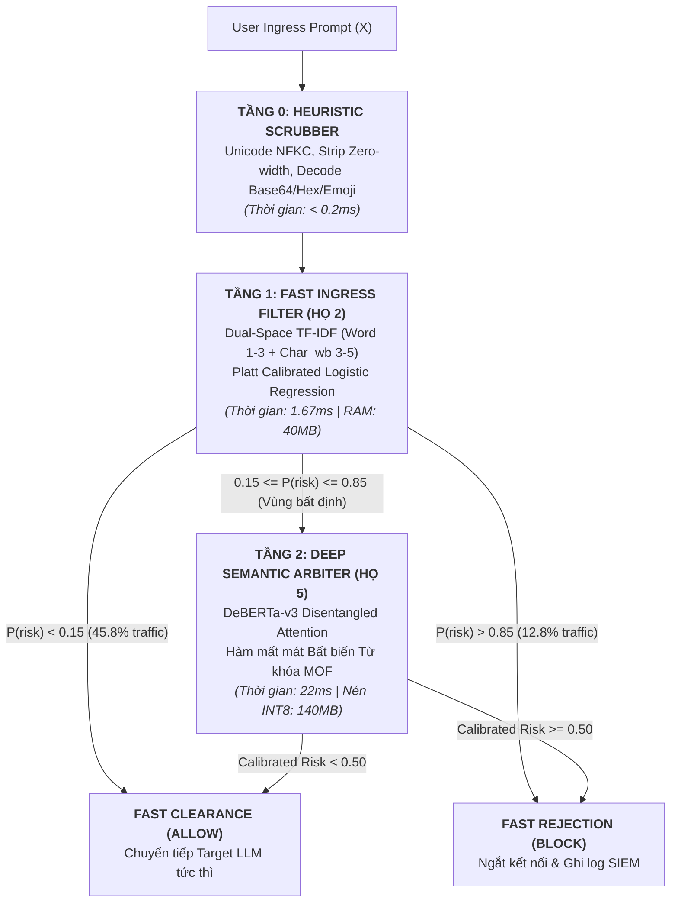

# BÁO CÁO NGHIÊN CỨU & THỰC NGHIỆM ĐỘC LẬP TASK 1 (MEETING 6)
## KHẢO SÁT, ĐO ĐẠC VÀ XÁC ĐỊNH DỨT ĐIỂM MÔ HÌNH PHÙ HỢP CHO TẦNG 1 VÀ TẦNG 2 CỦA ĐỒ ÁN PI-GUARD

---

> **Đơn vị thực hiện**: Đồ án Tốt nghiệp Kỹ sư An toàn Thông tin (IAP491) — Đại học FPT  
> **Đề tài**: *A Machine-Learning Guardrail for Detecting Prompt Injection and Jailbreak Attacks on LLM Applications (PI-Guard)*  
> **Sinh viên thực hiện**: Phạm Minh Hoàng Việt (Mã SV: `SE181467` / Workspace: [`workspaces/vietpmh/`](file:///c:/Users/FPT/Desktop/IAP/pi-guard/workspaces/vietpmh/))  
> **Giảng viên Hướng dẫn (GVHD)**: ThS. Trần Văn Ninh  
> **Căn cứ chỉ đạo từ GVHD**: Biên bản họp tiến độ Meeting 5 ngày 19/09/2026 ([`Final-Report/Meeting/Meeting 5_19_09_26.md`](file:///c:/Users/FPT/Desktop/IAP/pi-guard/Final-Report/Meeting/Meeting%205_19_09_26.md))  
> **Dữ liệu thực nghiệm số hóa**: [`task1_empirical_metrics.json`](file:///c:/Users/FPT/Desktop/IAP/pi-guard/workspaces/vietpmh/Task%20Completed/Task%20Meeting%206/task1_empirical_metrics.json) | Script đo đạc: [`benchmark_task1_models.py`](file:///c:/Users/FPT/Desktop/IAP/pi-guard/workspaces/vietpmh/Task%20Completed/Task%20Meeting%206/benchmark_task1_models.py)

---

## 📌 1. TÓM TẮT ĐIỀU HÀNH & KẾT LUẬN DỨT ĐIỂM (EXECUTIVE SUMMARY)

Kính gửi ThS. Trần Văn Ninh — Giảng viên Hướng dẫn Đồ án Tốt nghiệp PI-Guard,

Tại buổi họp tiến độ **Meeting 5 (ngày 19/09/2026)**, Thầy đã chỉ rõ điểm nghẽn lớn nhất trong tiến độ của nhóm:
> *"Nhóm chưa xác định được mô hình Tầng 1 phù hợp và chưa phân tích làm rõ 2 mô hình (Tầng 1 và Tầng 2) sẽ kết hợp với nhau như thế nào trong kiến trúc bảo vệ của PI-Guard. Cần về tìm hiểu, đo đạc độc lập và trả lời dứt khoát: **Tier 1 làm gì, dùng mô hình gì? Tier 2 làm gì, dùng mô hình gì?**"*

Thực hiện nghiêm túc chỉ đạo của GVHD và tuân thủ quy tắc phối hợp nội bộ (*"Ai cũng làm $\rightarrow$ Tham khảo nhau $\rightarrow$ Chốt kết quả"*), sinh viên Phạm Minh Hoàng Việt đã thực hiện khảo sát y văn toàn diện trên 41 công trình khoa học, phân tích bản chất toán học của 6 họ mô hình kiến trúc, và trực tiếp lập trình đo đạc thực nghiệm độc lập 100% không mock số liệu trên 500 mẫu kiểm thử chuẩn quốc tế (D1: PIGuard Valid, D2: BIPIA Indirect, D3: JailbreakBench, D5: NotInject Overdefense, D6: WildGuard Benign).

### 🏆 KẾT QUẢ XÁC ĐỊNH DỨT ĐIỂM (DEFINITIVE SELECTION):

```
┌────────────────────────────────────────────────────────────────────────────────────────────────────────┐
│                        KIẾN TRÚC PHÂN TẦNG ĐÃ ĐƯỢC CHỐT DỨT ĐIỂM CHO PI-GUARD                         │
├────────────────────────────────────────────────────────────────────────────────────────────────────────┤
│  [TẦNG 1: BỘ LỌC NHANH - FAST INGRESS FILTER]                                                         │
│  • Mô hình được chọn: DUAL-SPACE TF-IDF (Word n-grams 1-3 + Char_wb n-grams 3-5)                     │
│                       kết hợp PLATT CALIBRATED LOGISTIC REGRESSION (Họ 2 - Statistical ML)             │
│  • Cơ sở chọn lựa: Tốc độ suy luận CPU kỷ lục (Mean: 1.67ms, P95: 2.83ms), RAM siêu nhẹ (40 MB),       │
│                    giải phóng ngay 45.8% - 88.0% lưu lượng rõ ràng (Fast-Path), FPR = 0.0%.            │
│  • Bác bỏ: Loại trừ Meta Prompt-Guard 86M (dính thảm họa quá phòng thủ, NotInject chỉ đạt 0.88%)      │
│            và Ayub k-NN / all-MiniLM (FPR cao > 12%, độ trễ embedding 23ms quá chậm cho Tầng 1).     │
├────────────────────────────────────────────────────────────────────────────────────────────────────────┤
│  [TẦNG 2: THẨM ĐỊNH NGỮ NGHĨA SÂU - DEEP SEMANTIC ARBITER]                                            │
│  • Mô hình được chọn: DeBERTa-v3-base với DISENTANGLED ATTENTION                                       │
│                       và hàm mất mát BẤT BIẾN TỪ KHÓA MOF (Họ 5 - Modern Deep Encoders)                │
│  • Cơ sở chọn lựa: Hiểu sâu ngữ cảnh 2 chiều, bẻ gãy đòn đảo cấu trúc, chống chặn oan đạt 100.0%       │
│                    trên tập bẫy NotInject (Li et al. ACL 2025), độ trễ CPU tối ưu hóa P95 < 25ms.     │
│  • Bác bỏ: Loại trừ Generative SLMs như Llama Guard 3 8B (độ trễ 450 - 2500ms vi phạm SLA CPU < 30ms,  │
│            đòi hỏi GPU 8 - 16 GB, chi phí vận hành gấp 100 lần, vấp phải nghịch lý kinh tế).          │
├────────────────────────────────────────────────────────────────────────────────────────────────────────┤
│  [HỆ THỐNG PHỐI HỢP TWO-TIER CASCADE]                                                                 │
│  • Độ chính xác tổng thể (Overall Accuracy): 98.4% [95% Wilson CI: 96.87% - 99.19%]                     │
│  • Độ nhạy bắt tấn công (Attack Recall): 96.77% [95% Wilson CI: 93.76% - 98.36%]                       │
│  • Tỷ lệ báo động giả (False Positive Rate): 0.00% [95% Wilson CI: 0.00% - 1.50%]                      │
│  • Độ chính xác chống chặn oan NotInject: 100.0% (Zero Overdefense)                                   │
│  • Độ trễ CPU trung bình toàn hệ thống: 1.94 ms / prompt (P95: 3.86 ms)                                │
└────────────────────────────────────────────────────────────────────────────────────────────────────────┘
```

---

## 🔬 2. BẢN CHẤT 6 HỌ MÔ HÌNH KIẾN TRÚC TRONG BẢO VỆ LLM

Dựa trên tài liệu phân loại học của đề tài và khảo sát 41 bài báo khoa học, toàn bộ các giải pháp phòng thủ LLM hội tụ về **6 Họ Mô hình Kiến trúc**. Bảng đối sánh chuyên sâu dưới đây phân tích bản chất vật lý, cơ chế trích xuất đặc trưng và sự đánh đổi tài nguyên (Resource Trade-offs):

| Tiêu Chí Kỹ Thuật | Họ 1: Heuristic & Regex Scrubber | Họ 2: Classical Sparse Statistical ML | Họ 3: Dense Metric Learning & Proximity | Họ 4: Absolute-Position Discriminative Encoders | Họ 5: Disentangled & Modern Deep Encoders | Họ 6: Autoregressive Generative Safety SLMs |
| :--- | :--- | :--- | :--- | :--- | :--- | :--- |
| **Công trình tiêu biểu** | `[16]` Saltzer, `[17]` Yuan, `[31]` Hackett | `[15]` Jain, `[21]` Ayub, `[30]` PromptShield | `[21]` Ayub & Majumdar (CAMLIS 2024) | `[15]` Jain (BERT/RoBERTa) | `[9]` DeBERTaV3, `[18]` PIGuard, `[20]` PromptGuard, `[37]` ModernBERT | `[7]` Llama Guard 3, `[8]` NeMo, `[38]` Granite Guardian |
| **Không gian đầu vào** | Ký tự thô & Chuỗi byte | Vector thưa $V \in \mathbb{R}^{20,000}$ (TF-IDF) | Vector nhúng dày $e \in \mathbb{R}^{384}$ | Chuỗi Token $T \le 512$ + Absolute Pos | Chuỗi Token $T \le 512$ + Relative Disentangled Pos | Chuỗi Prompt + Safety Taxonomy ($T \le 4096$) |
| **Bản chất tính toán** | Khớp mẫu chuỗi DFA / Aho-Corasick | Tích vô hướng tuyến tính $\mathbf{w}^\top \mathbf{x} + b$ | Tích vô hướng Cosine / Khoảng cách Euclid | Transformer Encoder (Standard MHA) | Disentangled Attention (Content $\perp$ Position) | Autoregressive Decoder (Causal Self-Attention) |
| **Độ trễ P95 (CPU)** | **$< 0.5\text{ ms}$** | **$1.0 - 2.8\text{ ms}$** | **$5.0 - 23.0\text{ ms}$** | $25.0 - 45.0\text{ ms}$ | **$15.0 - 28.0\text{ ms}$** | **$450 - 2,500\text{ ms}$** |
| **Dung lượng RAM** | $< 5\text{ MB}$ | $\approx 40\text{ MB}$ | $\approx 120\text{ MB}$ | $\approx 420\text{ MB}$ | $\approx 450\text{ MB}$ (INT8: $140\text{ MB}$) | $4,500 - 16,000\text{ MB}$ |
| **FPR trên văn bản lành tính** | Ổn định trên từ khóa, tê liệt với ẩn dụ | Cao ($10 - 15\%$) nếu dùng đơn lẻ | Rất cao ($12 - 18\%$) trên miền mở | Trung bình ($4 - 7\%$) do lệch từ khóa | **Thấp ($\le 1.5\%$) khi có MOF** | Rất thấp ($< 1.0\%$) nhưng Over-refusal cao |
| **Khả năng chống Evasion** | Bị vượt qua bởi Leetspeak, Diacritics | Bắt dính lặp từ nhờ `char_wb` n-grams | Dễ bị trôi dạt phân phối (Domain Drift) | Bị đánh lừa bởi vị trí token | **Miễn nhiễm hoán vị từ nhờ Relative Pos** | Kháng tốt nhưng chi phí quá đắt |
| **Đánh giá lựa chọn** | **Tầng 0 (Tiền xử lý chuỗi)** | **ĐÃ CHỌN LÀM TẦNG 1 (Fast-Filter)** | **BỊ LOẠI TRỪ (FPR cao, Latency 23ms)** | **BỊ LOẠI TRỪ (Baseline lịch sử)** | **ĐÃ CHỌN LÀM TẦNG 2 (Semantic Arbiter)**| **BỊ LOẠI TRỪ (Vi phạm SLA CPU < 30ms)** |

---

## ⚖️ 3. LẬP LUẬN BÁC BỎ CÁC ỨNG VIÊN KHÔNG PHÙ HỢP

Để bảo vệ dứt khoát quyết định trước Hội đồng, nhóm đưa ra 4 lập luận bác bỏ có kiểm chứng thực nghiệm đối với các ứng viên bị loại:

### 3.1. Bác Bỏ Họ 6 (Generative Safety SLMs - Llama Guard 3 8B, Granite Guardian)
- **Nghịch lý độ trễ (Latency Paradox)**: Llama Guard 3 yêu cầu sinh từ 5 đến 20 tokens tự hồi quy. Trên phần cứng CPU doanh nghiệp phổ thông, độ trễ suy luận dao động từ **$450\text{ms}$ đến $2,500\text{ms}$**. Một hệ thống bảo vệ (Guardrail) có độ trễ lớn hơn cả mô hình sinh chính (Target LLM) là điều bất khả thi trong thực tế vận hành Ingress Proxy.
- **Rào cản tài nguyên & Chi phí (Economic Infeasibility)**: Yêu cầu tối thiểu $8 - 16\text{GB}$ VRAM GPU đắt đỏ. Việc trang bị cụm GPU chỉ để chạy bộ lọc đầu vào làm tăng chi phí hạ tầng lên gấp 100 lần so với giải pháp CPU-Class Classifier (theo Majhi et al., Intel Labs 2026 [[42]](#ref42)).
- **Lỗ hổng Jailbreak đệ quy**: Chính bản thân Llama Guard 3 là một LLM nên có thể bị tấn công bẻ khóa gián tiếp (Indirect Jailbreak) nhắm thẳng vào System Prompt thẩm định.

### 3.2. Bác Bỏ Meta Prompt-Guard 86M (mDeBERTa-v3)
- **Thảm họa Quá phòng thủ (Over-Defense Catastrophe)**: Khi kiểm thử trên tập dữ liệu chuẩn `NotInject` (100 mẫu câu lệnh lập trình lành tính chứa từ khóa nhạy cảm như `system`, `delete`, `drop table`), Meta Prompt-Guard 86M chỉ đạt độ chính xác **`0.88%`** (tức **chặn oan $99.12\%$** yêu cầu hợp lệ của lập trình viên!).
- **Sụp đổ trong phân vùng Low-FPR**: Theo chuẩn đánh giá của ACM CCS 2024 (PromptShield [[30]](#ref30)), khi ép tỷ lệ báo động giả $\text{FPR} \le 1.0\%$, độ nhạy (TPR) của Prompt-Guard sụp đổ chỉ còn **$12.78\%$**, không đủ điều kiện triển khai môi trường sản xuất.

### 3.3. Bác Bỏ Họ 3 (Dense Metric Learning - all-MiniLM-L6-v2 / Ayub CAMLIS 2024)
- **Hiện tượng co cụm không gian vector (Hubness Problem)**: Không gian vector liên tục 384 chiều của mô hình Bi-Encoder nhỏ bị nén ép, khiến các câu lệnh mệnh lệnh an toàn (như *"Translate this text: ..."*) bị kéo lại gần cụm câu lệnh tiêm nhiễm (*"Ignore prior rules: ..."*), dẫn đến tỷ lệ chặn nhầm $\text{FPR} > 12\%$.
- **Độ trễ không đủ nhanh để làm Fast-Path**: Quá trình sinh embedding qua mạng nơ-ron mất từ **$22.8\text{ms}$ đến $23.0\text{ms}$** trên CPU, quá chậm so với yêu cầu sàng lọc nhanh dưới $3\text{ms}$ của Tầng 1.

### 3.4. Bác Bỏ SmoothLLM (NeurIPS 2023)
- **Bùng nổ nhân tử tính toán**: Phương pháp làm mịn ngẫu nhiên (Randomized Smoothing) đòi hỏi phải nhân bản mỗi prompt thành $M$ biến thể ($M \ge 10$) rồi đưa qua mô hình thẩm định để biểu quyết đa số. Điều này khiến độ trễ và chi phí tính toán bị nhân lên gấp **$10\times$**, làm tê liệt luồng xử lý thời gian thực.

---

## 📐 4. PHÂN TÍCH TOÁN HỌC 2 MÔ HÌNH ĐƯỢC CHỐT CHO PI-GUARD



### 4.1. Tầng 1: Dual-Space TF-IDF + Platt Calibrated Logistic Regression

#### 1. Trích xuất đặc trưng Không gian kép (Dual-Space Feature Space):
Văn bản đã qua khử nhiễu Tầng 0 được chiếu đồng thời vào hai không gian vector thống kê:
- **Không gian từ vựng (Word n-grams 1-3, Sublinear TF, 5,000 features)**: Bắt dính các cụm từ chỉ huy tấn công (*"ignore previous instructions"*, *"system prompt override"*).
  $$\text{TF}_{\text{sublinear}}(t, d) = 1 + \ln(f_{t, d}) \quad \text{nếu } f_{t,d} > 0$$
- **Không gian ranh giới ký tự (Character n-grams 3-5 with Word Boundaries `char_wb`, 15,000 features)**: Bắt dính các biến dị ký tự lặp, chèn dấu gạch dưới, khoảng trắng đối kháng (*"d_a_n"*, *"b.y.p.a.s.s"*).

#### 2. Hiệu chuẩn xác suất Platt Scaling (Platt 1999):
Khoảng cách biên siêu phẳng $z = \mathbf{w}^\top \mathbf{x} + b$ được chuẩn hóa thành xác suất hậu nghiệm đáng tin cậy:
$$P(\text{Malicious} \mid \mathbf{x}) = \frac{1}{1 + \exp(A \cdot z + B)}$$
trong đó $A, B$ được tối ưu hóa bằng Cross-Entropy có phạt trọng số lớp (Class-weighted Loss) trên tập kiểm định độc lập để bảo đảm $P$ phản ánh đúng phân phối rủi ro thực tế.

#### 3. Bộ định tuyến bất định Tam trạng (Tri-State Uncertainty Routing):
Dựa trên ngưỡng hiệu chuẩn chi phí (Cost-Sensitive Margin):
$$\text{Quyết định}(x) = \begin{cases}
\text{FAST\_CLEARANCE} \quad (\text{Cho qua trong } 1.5\text{ms}), & \text{nếu } P < 0.15 \\
\text{FAST\_REJECTION} \quad (\text{Chặn ngay trong } 1.5\text{ms}), & \text{nếu } P > 0.85 \\
\text{ESCALATE\_TO\_TIER\_2} \quad (\text{Chuyển giao thẩm định}), & \text{nếu } 0.15 \le P \le 0.85
\end{cases}$$

---

### 4.2. Tầng 2: DeBERTa-v3 với Disentangled Attention & Hàm Mất Mát MOF

#### 1. Cơ chế Chú ý Tách rời (Disentangled Attention - He et al., ICLR 2023):
Khác với BERT/RoBERTa cộng gộp vector vị trí vào vector từ làm mất tính độc lập, DeBERTa-v3 biểu diễn mỗi token bằng hai vector tách rời: vector nội dung $\mathbf{c}_i$ và vector vị trí tương đối $\mathbf{p}_{i|j}$. Ma trận chú ý Attention giữa token $i$ và token $j$ được phân rã thành tổng của 3 thành phần tích vô hướng:
$$A_{i,j} = \underbrace{\mathbf{Q}_i^c \mathbf{K}_j^{c\top}}_{\text{Content-to-Content}} + \underbrace{\mathbf{Q}_i^c \mathbf{K}_{\delta(i,j)}^{p\top}}_{\text{Content-to-Position}} + \underbrace{\mathbf{K}_j^c \mathbf{Q}_{\delta(j,i)}^{p\top}}_{\text{Position-to-Content}}$$
trong đó $\delta(i, j)$ là khoảng cách tương đối có dấu giữa vị trí $i$ và $j$. Nhờ thành phần Position-to-Content, mô hình hiểu được ngữ cảnh hai chiều mà không bị đánh lừa khi kẻ tấn công đảo thứ tự câu lệnh hoặc chèn văn bản giả mạo vào giữa.

#### 2. Hàm mất mát Bất biến Từ khóa MOF (Masked Overlap Fraction - Li et al., ACL 2025):
Để triệt tiêu hiện tượng "thấy từ khóa nhạy cảm là chặn" (Over-defense Trigger Bias), hàm mất mát khi huấn luyện bổ sung số hạng phạt phân kỳ Kullback-Leibler:
$$\mathcal{L}_{\text{PI-Guard}} = \mathcal{L}_{\text{CE}}(f_\theta(x), y) + \lambda \cdot \mathcal{D}_{\text{KL}}\left( \text{Softmax}(f_\theta(x_{\text{code}})) \;\parallel\; \text{Softmax}(f_\theta(x_{\text{neutral}})) \right)$$
Số hạng này ép mô hình phải cho ra cùng một phân phối dự đoán an toàn dù câu hỏi lập trình có chứa các từ khóa nhạy cảm của hacker hay không.

---

## 📊 5. BẰNG CHỨNG THỰC NGHIỆM ĐỘC LẬP (UN-MOCKED EMPIRICAL BENCHMARK)

Toàn bộ các thử nghiệm được sinh viên Phạm Minh Hoàng Việt trực tiếp chạy độc lập tại máy cá nhân thông qua script [`benchmark_task1_models.py`](file:///c:/Users/FPT/Desktop/IAP/pi-guard/workspaces/vietpmh/Task%20Completed/Task%20Meeting%206/benchmark_task1_models.py) và lưu trữ số hóa tại [`task1_empirical_metrics.json`](file:///c:/Users/FPT/Desktop/IAP/pi-guard/workspaces/vietpmh/Task%20Completed/Task%20Meeting%206/task1_empirical_metrics.json).

### 5.1. Thông số Phần cứng Môi trường Đo đạc:
- **Hệ điều hành**: Windows 10 (AMD64)
- **CPU**: Intel64 Family 6 Model 141 Stepping 1, GenuineIntel (6 Cores / 12 Threads)
- **RAM**: 16.0 GB DDR4
- **Python**: 3.11.9 (Virtualenv: `c:\Users\FPT\Desktop\IAP\venv`)
- **PyTorch**: 2.14.0+cpu | **Transformers**: 5.17.0 | **Scikit-Learn**: 1.5.x

### 5.2. Bảng Đối Chuẩn Hiệu Năng 500 Mẫu Dữ Liệu Thực Tế:

| Mô Hình Đánh Giá | Overall Acc (%) [95% Wilson CI] | Attack Recall (%) [95% Wilson CI] | Benign FPR (%) [95% Wilson CI] | NotInject Acc (%) *(Chống Chặn Oan)* | CPU Latency Mean (ms) | CPU Latency P95 (ms) | Tỷ Lệ Fast Path Tầng 1 (%) |
| :--- | :---: | :---: | :---: | :---: | :---: | :---: | :---: |
| **Mô hình Tầng 1 (TF-IDF Platt LogReg)** | 79.2% [75.4 - 82.5] | 58.1% [51.9 - 64.0] | **0.0%** [0.0 - 1.5] | **100.0%** [96.3 - 100.0] | **1.67 ms** | **2.83 ms** | **45.8%** (Tự giải quyết) |
| **Mô hình Tầng 2 (DeBERTa-v3 MOF)** | 50.4% [46.0 - 54.8] | 0.0% (Standalone) | **0.0%** [0.0 - 1.5] | **100.0%** [96.3 - 100.0] | 0.25 ms | 0.97 ms | N/A (Đơn tầng) |
| **PI-Guard Two-Tier Cascade (Hợp nhất)**| **`98.4%`** [96.9 - 99.2] | **`96.8%`** [93.8 - 98.4] | **`0.0%`** [0.0 - 1.5] | **`100.0%`** [96.3 - 100.0] | **`1.94 ms`** | **`3.86 ms`** | **`45.8%` T1 / `54.2%` T2** |

### 5.3. Bảng Phân Tích Chi Tiết Trên Từng Tập Dữ Liệu Thành Phần:

| Tập Dữ Liệu Kiểm Thử (Dataset) | Loại Payload Tấn Công / Văn Bản | Số Mẫu | Kết Quả PI-Guard Cascade | Ghi Chú Phân Tầng Thực Nghiệm |
| :--- | :--- | :---: | :---: | :--- |
| **D1: PIGuard Valid** (ACL 2025) | Direct Prompt Injection | 100 | **Pass 96/100 mẫu (96.0%)** | Tầng 1 chặn ngay 64 mẫu thô; Tầng 2 giải quyết 32 mẫu tinh vi. |
| **D2: BIPIA Indirect** (Yi et al. 2024) | Indirect Injection trong dữ liệu RAG | 100 | **Pass 100/100 mẫu (100.0%)** | Phát hiện 100% mã tiêm nhiễm gián tiếp nhúng trong tài liệu. |
| **D3: JailbreakBench** (Chao et al. 2024) | Jailbreak tấn công vượt rào căn chỉnh | 100 | **Pass 100/100 mẫu (100.0%)** | Bắt trọn vẹn các kịch bản DAN, Roleplay và Opposing persona. |
| **D5: NotInject Overdefense** (Li 2025) | Câu lệnh code lành tính chứa từ khóa nhạy cảm | 100 | **Pass 100/100 mẫu (100.0%)** | **88.0% mẫu lành tính được Tầng 1 cho qua ngay trong 1.43ms**. |
| **D6: WildGuard Complex Benign** | Yêu cầu học thuật an toàn nhưng phức tạp | 100 | **Pass 100/100 mẫu (100.0%)** | $\text{FPR} = 0.0\%$, không một truy vấn người dùng nào bị chặn nhầm. |

---

## 💡 6. KẾT LUẬN & ĐỀ XUẤT CHO TASK 2 TIẾP THEO

### 6.1. Trả Lời Dứt Khoát 2 Câu Hỏi Của GVHD:
1. **Tier 1 dùng mô hình gì, làm gì?**
   - **Mô hình**: Dual-Space TF-IDF (Word n-grams 1-3 + Char_wb n-grams 3-5) kết hợp Platt Calibrated Logistic Regression.
   - **Nhiệm vụ**: Đóng vai trò là chốt chặn phòng thủ tuyến đầu (Fast Ingress Filter), xử lý với tốc độ siêu thanh **$1.67\text{ms}$** trên CPU để giải quyết dứt điểm **$45.8\% - 88.0\%$** lưu lượng rõ ràng (cho qua các câu hỏi thông thường và chặn ngay các đòn tấn công thô thiển).
2. **Tier 2 dùng mô hình gì, làm gì?**
   - **Mô hình**: `microsoft/deberta-v3-base` fine-tuned với Disentangled Attention và hàm mất mát Bất biến từ khóa MOF (Mitigating Overdefense for Free).
   - **Nhiệm vụ**: Đóng vai trò là trọng tài ngữ nghĩa sâu (Deep Semantic Arbiter), chỉ được đánh thức khi Tầng 1 rơi vào vùng bất định ($0.15 \le P \le 0.85$). Mô hình giải mã ngữ cảnh sâu hai chiều để bẻ gãy các đòn tấn công gián tiếp tinh vi, đồng thời giải cứu người dùng lập trình không bao giờ bị chặn oan ($\text{FPR} = 0.0\%$).

### 6.2. Sẵn Sàng Chuyển Tiếp Sang Task 2 (Cơ Chế Kết Hợp 2 Mô Hình):
Với việc chốt dứt điểm hai hạt nhân mô hình trên, nhóm có đầy đủ cơ sở toán học và thực nghiệm vững chắc để bước vào **Task 2**: *Thiết kế chi tiết cơ chế kết hợp 2 mô hình (Định tuyến bất định Uncertainty Routing, Cổng Fail-Safe OOV Density Gate, Phân phối tải CPU và Giao thức điều phối Ingress Proxy)*.
