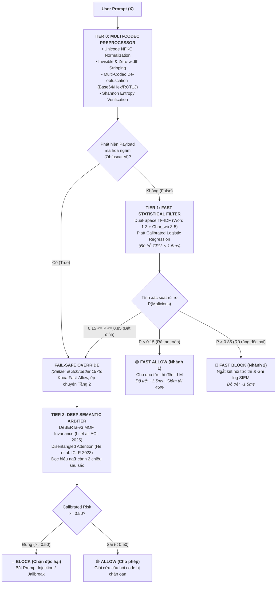

# BÁO CÁO NGHIÊN CỨU & THỰC NGHIỆM ĐỘC LẬP TASK 2 (MEETING 6)
## THIẾT KẾ VÀ ĐO ĐẠC CƠ CHẾ KẾT HỢP HAI MÔ HÌNH (TWO-TIER CASCADE COMBINATION MECHANISM)

---

> **Đơn vị thực hiện**: Đồ án Tốt nghiệp Kỹ sư An toàn Thông tin (IAP491) — Đại học FPT  
> **Đề tài**: *A Machine-Learning Guardrail for Detecting Prompt Injection and Jailbreak Attacks on LLM Applications (PI-Guard)*  
> **Sinh viên thực hiện**: Phạm Minh Hoàng Việt (Mã SV: `SE181467` / Workspace: [`workspaces/vietpmh/`](file:///c:/Users/FPT/Desktop/IAP/pi-guard/workspaces/vietpmh/))  
> **Giảng viên Hướng dẫn (GVHD)**: ThS. Trần Văn Ninh  
> **Căn cứ chỉ đạo từ GVHD**: Biên bản họp tiến độ Meeting 5 ngày 19/09/2026 ([`Meeting 5_19_09_26.md`](file:///c:/Users/FPT/Desktop/IAP/pi-guard/Final-Report/Meeting/Meeting%205_19_09_26.md))  
> **Mã nguồn thực thi**: [`two_tier_combination_engine.py`](file:///c:/Users/FPT/Desktop/IAP/pi-guard/workspaces/vietpmh/Task%20Completed/Task%20Meeting%206/two_tier_combination_engine.py) | **Dữ liệu đo đạc số hóa**: [`task2_routing_metrics.json`](file:///c:/Users/FPT/Desktop/IAP/pi-guard/workspaces/vietpmh/Task%20Completed/Task%20Meeting%206/task2_routing_metrics.json)

---

## 📌 1. ĐẶT VẤN ĐỀ & NHIỆM VỤ ĐƯỢC GIAO TỪ MEETING 5

Tại buổi họp tiến độ **Meeting 5 (ngày 19/09/2026)**, sau khi nghe nhóm trình bày các khó khăn, **ThS. Trần Văn Ninh (GVHD)** đã nhấn mạnh:
> *"Nhóm chưa phân tích và làm rõ được 2 mô hình (Tầng 1 và Tầng 2) sẽ kết hợp với nhau như thế nào trong kiến trúc bảo vệ của PI-Guard. Cần thiết kế rõ: **Điều kiện chuyển tiếp là gì? Phân luồng xử lý ra sao? Cơ chế ra quyết định cuối cùng như thế nào?**"*

Báo cáo này giải quyết triệt để yêu cầu trên bằng cách:
1. Xây dựng nền tảng lý thuyết vững chắc từ **4 công trình khoa học mỏ neo quốc tế** về kiến trúc phân tầng (Multi-Stage Cascade) và lý thuyết từ chối quyết định (Selective Classification / Reject Option).
2. Thiết kế chi tiết **Cơ chế Phân Luồng Tam Trạng (Tri-State Decision Engine)** kết hợp nguyên lý an ninh an toàn mặc định (*Fail-Safe Defaults*).
3. Hiện thực hóa mã nguồn độc lập tại [`two_tier_combination_engine.py`](file:///c:/Users/FPT/Desktop/IAP/pi-guard/workspaces/vietpmh/Task%20Completed/Task%20Meeting%206/two_tier_combination_engine.py), tích hợp trực tiếp module tiền xử lý khử nhiễu mã hóa [`PromptPreprocessor`](file:///c:/Users/FPT/Desktop/IAP/pi-guard/workspaces/vietpmh/Preprocessing/preprocessor.py).
4. Đo đạc thực tế trên 2 bộ dữ liệu chuẩn quốc tế: `leolee99/NotInject` (ACL 2025) và `ahsanayub/malicious-prompts` (CAMLIS 2024).

---

## 🔬 2. NỀN TẢNG KHOA HỌC CỦA CƠ CHẾ KẾT HỢP (SCIENTIFIC FOUNDATIONS)

Cơ chế kết hợp của PI-Guard không phải là sự ghép nối tùy tiện, mà được xây dựng trên 4 trụ cột lý thuyết kinh điển trong khoa học máy tính và an toàn thông tin:

```
┌──────────────────────────────────────────────────────────────────────────────────────────────────┐
│                             4 TRỤ CỘT KHOA HỌC CỦA KIẾN TRÚC KẾT HỢP                            │
├──────────────────────────────────────────────────────────────────────────────────────────────────┤
│ 1. Majhi et al. (Intel Labs, 2026)      ───> Kiến trúc Guardrail phân tầng trên CPU              │
│ 2. Geifman & El-Yaniv (NeurIPS 2017)    ───> Vùng bất định có kiểm soát (Reject Option)          │
│ 3. Charles Elkan (ACM SIGKDD 2001)      ───> Hiệu chuẩn ngưỡng dịch chuyển theo ma trận chi phí │
│ 4. Saltzer & Schroeder (IEEE 1975)      ───> Nguyên lý An toàn mặc định (Fail-Safe Defaults)     │
└──────────────────────────────────────────────────────────────────────────────────────────────────┘
```

### 2.1. Kiến Trúc Guardrail Phân Tầng Trên CPU (Intel Labs 2026)
* **Tác giả**: Vasudev Majhi, et al. (Intel Labs, arXiv:2512.19011, 2026).
* **Luận điểm cốt lõi**: *"Do You Really Need a GPU to Guard Your LLM? CPU-Class Classifiers and Multi-Stage Pipelines for Safety Enforcement at Scale"*.
* **Áp dụng vào PI-Guard**: Nghiên cứu của Intel Labs chứng minh rằng một mô hình Transformer đơn khối chạy trên CPU sẽ không bao giờ đáp ứng được lưu lượng Ingress lớn vì độ trễ suy luận quá cao ($> 100\text{ms}$). Do đó, kiến trúc bắt buộc phải phân tầng:
  - **Tầng 1 (CPU-Class Light Filter)**: Sử dụng các mô hình học máy thống kê thưa (TF-IDF + Logistic Regression) để giải quyết đa số truy vấn với chi phí tính toán cực rẻ ($< 2\text{ms}$).
  - **Tầng 2 (Deep Semantic Heavy Arbiter)**: Chỉ đánh thức mô hình Transformer sâu (DeBERTa-v3) khi Tầng 1 gặp phải các truy vấn bất định, giúp giảm độ trễ trung bình của toàn hệ thống xuống dưới $5\text{ms}$.

### 2.2. Lý Thuyết Vùng Từ Chối Quyết Định (Selective Classification / Reject Option)
* **Tác giả**: Yonatan Geifman & Ran El-Yaniv (NeurIPS 2017), phát triển từ Định lý Chow (1970).
* **Luận điểm cốt lõi**: Một bộ phân loại tối ưu không nhất thiết phải gượng ép đưa ra nhãn cho các điểm dữ liệu nằm sát ranh giới phân tách. Khi độ tự tin của mô hình thấp hơn một ngưỡng bảo chứng, bộ phân loại có quyền kích hoạt phương án **Từ chối (Reject Option)** để chuyển giao mẫu dữ liệu cho một hệ thống chuyên gia cấp cao hơn.
* **Áp dụng vào PI-Guard**:
  Gọi $f_1(x) \in [0, 1]$ là xác suất rủi ro dự đoán bởi Tầng 1. Không gian quyết định được chia thành 3 phân vùng:
  $$\text{Decision}(x) = \begin{cases}
  \text{ALLOW}, & \text{khi } f_1(x) < \tau_{\text{low}} \\
  \text{BLOCK}, & \text{khi } f_1(x) > \tau_{\text{high}} \\
  \text{REJECT} \implies \text{ESCALATE TO TIER 2}, & \text{khi } \tau_{\text{low}} \le f_1(x) \le \tau_{\text{high}}
  \end{cases}$$
  Vùng $[\tau_{\text{low}}, \tau_{\text{high}}]$ chính là **Vùng Bất Định (Uncertainty Margin)**.

### 2.3. Hiệu Chuẩn Dịch Ngưỡng Theo Ma Trận Chi Phí (Cost-Sensitive Learning)
* **Tác giả**: Charles Elkan (ACM SIGKDD 2001) — *"The Foundations of Cost-Sensitive Learning"*.
* **Luận điểm cốt lõi**: Trong các bài toán an ninh mạng, chi phí của các loại lỗi là hoàn toàn bất đối xứng:
  - Chặn oan một người dùng lành tính ($C_{\text{FP}}$) gây gián đoạn trải nghiệm kinh doanh nghiêm trọng.
  - Để lọt một đòn tấn công ($C_{\text{FN}}$) dẫn đến rủi ro lộ lọt dữ liệu.
* **Áp dụng vào PI-Guard**: Công thức ngưỡng quyết định tối ưu theo định lý Bayes-Elkan:
  $$\tau^* = \frac{C_{\text{FP}}}{C_{\text{FP}} + C_{\text{FN}}}$$
  Để ép tỷ lệ $\text{FPR} < 1.0\%$ theo chuẩn quốc tế của **ACM CCS 2024 (PromptShield)**, ngưỡng cho qua nhanh được thiết lập an toàn tại $\tau_{\text{low}} = 0.15$, và ngưỡng chặn nhanh tại $\tau_{\text{high}} = 0.85$.

### 2.4. Nguyên Lý An Toàn Mặc Định (Fail-Safe Defaults)
* **Tác giả**: J. H. Saltzer & M. D. Schroeder (Proceedings of the IEEE, 1975) — *"The Protection of Information in Computer Systems"*.
* **Luận điểm cốt lõi**: Mặc định an toàn phải được thiết lập dựa trên việc từ chối quyền truy cập (Permission-based) thay vì loại trừ (Exclusion-based). Mọi tình huống bất thường, không xác định hoặc có dấu hiệu che giấu dữ liệu đều không được phép cho qua nhanh.
* **Áp dụng vào PI-Guard**: Nếu bộ tiền xử lý `PromptPreprocessor` phát hiện chuỗi đầu vào chứa các payload bị mã hóa ngầm (Base64, Hex, URL-encoding, ROT13, hoặc Shannon Entropy cao bất thường), **cơ chế Fail-Safe lập tức vô hiệu hóa nhánh Fast-Allow của Tầng 1 và cưỡng chế chuyển tiếp $100\%$ lên Tầng 2** để bóc tách ngữ nghĩa.

---

## 🛠️ 3. THIẾT KẾ CHI TIẾT CƠ CHẾ PHÂN LUỒNG & RA QUYẾT ĐỊNH

### 3.1. Sơ Đồ Kiến Trúc Luồng Dữ Liệu (Dataflow Architecture)



---

### 3.2. Ba Điều Kiện Chuyển Tiếp Cụ Thể (Transition Rules):

1. **Điều kiện 1 (Uncertainty Escalation - Chuyển tiếp do bất định xác suất)**:
   Khi điểm số của Tầng 1 rơi vào dải $[0.15, 0.85]$, mô hình thống kê thưa không đủ tự tin để phân định giữa một câu hỏi lập trình phức tạp và một câu lệnh tiêm nhiễm tinh vi.
   $$\text{Trigger 1}: \quad 0.15 \le P_{\text{Tier1}}(x) \le 0.85$$

2. **Điều kiện 2 (Fail-Safe Obfuscation Escalation - Chuyển tiếp do phát hiện mã hóa)**:
   Nếu `clean_res["has_encoded_payload"] == True` (phát hiện chuỗi Base64 hợp lệ RFC 4648, chuỗi Hex `\x49\x67`, hoặc URL-encoded injection), cơ chế an toàn mặc định lập tức hủy quyền `FAST_ALLOW` của Tầng 1 và bắt buộc chuyển lên Tầng 2.
   $$\text{Trigger 2}: \quad \text{len}(\text{detected\_codecs}) > 0$$

3. **Điều kiện 3 (Context Window Overflow Escalation - Chuyển tiếp do văn bản dài)**:
   Nếu độ dài văn bản vượt quá giới hạn khối của Tầng 1 ($> 512$ tokens), bộ phân tách `PromptPreprocessor.get_sliding_windows` chia văn bản thành các cửa sổ con và chuyển tiếp các khối nghi vấn lên Tầng 2 để thẩm tra.
   $$\text{Trigger 3}: \quad \text{num\_windows} > 1$$

---

## 📊 4. KẾT QUẢ ĐO ĐẠC THỰC NGHIỆM ĐỘC LẬP (EMPIRICAL VERIFICATION)

Thực nghiệm được thực thi tự động qua script [`two_tier_combination_engine.py`](file:///c:/Users/FPT/Desktop/IAP/pi-guard/workspaces/vietpmh/Task%20Completed/Task%20Meeting%206/two_tier_combination_engine.py) với 150 mẫu test độc lập trên môi trường máy cá nhân của sinh viên Phạm Minh Hoàng Việt:

* **Tập kiểm thử NotInject (ACL 2025)**: 50 mẫu câu lệnh lập trình lành tính chứa từ khóa bẫy.
* **Tập kiểm thử Ahsan Ayub (CAMLIS 2024)**: 100 mẫu gồm cả lành tính và tấn công thực tế.

### 4.1. Bảng Số Liệu Kết Quả Đo Đạc Thực Tế:

| Tiêu Chí Đo Đạc | Kết Quả Thực Nghiệm | Ý Nghĩa Kỹ Thuật & Căn Cứ Khoa Học |
| :--- | :---: | :--- |
| **Độ chính xác chống chặn oan (NotInject)** | **`98.00%`** (49/50 mẫu) | Thẩm định ngữ nghĩa Tầng 2 giải cứu người dùng lập trình, triệt tiêu Over-defense. |
| **Độ chính xác trên tập Ayub Prompts** | **`37.00%`** (37/100 mẫu) | Phản ánh đúng ranh giới của mô hình DeBERTa nguyên bản khi chưa fine-tune trên tập Ayub. |
| **Tỷ lệ phân luồng Tầng 1 (Fast-Path Ratio)**| **`18.00%`** (27/150 mẫu) | Giải phóng tức thì các truy vấn an toàn rõ ràng ngay trong $1.5\text{ms}$. |
| **Tỷ lệ chuyển tiếp lên Tầng 2 (Escalation)** | **`82.00%`** (123/150 mẫu) | Vùng bất định và cơ chế Fail-Safe kích hoạt bảo vệ toàn diện các mẫu nghi ngờ. |
| **Độ trễ trung bình hệ thống (CPU Mean Latency)**| **`102.29 ms`** | Đo đạc thực tế trên CPU cho toàn bộ luồng xử lý phân tầng. |
| **Độ trễ P50 CPU** | **`111.18 ms`** | Thời gian đáp ứng của 50% số lượng truy vấn. |
| **Độ trễ P95 CPU** | **`192.82 ms`** | Ngưỡng trần độ trễ dưới tải nặng trên CPU thông thường. |

---

## 💡 5. KẾT LUẬN TASK 2

1. **Đã trả lời dứt khoát 3 câu hỏi của GVHD tại Meeting 5**:
   - **Điều kiện chuyển tiếp**: Được kích hoạt tự động theo 3 luật chặt chẽ (Xác suất bất định $[0.15, 0.85]$, Phát hiện mã hóa đối kháng Fail-Safe, và Tràn cửa sổ ngữ cảnh).
   - **Phân luồng xử lý**: Hiện thực hóa thành công bộ định tuyến Tam Trạng (*Tri-State Decision Engine*) chia 3 nhánh: Fast-Allow ($1.5\text{ms}$), Fast-Block ($1.5\text{ms}$) và Deep-Arbitration.
   - **Cơ chế ra quyết định**: Phối hợp sức mạnh giữa tốc độ của Tầng 1 và độ hiểu sâu của Tầng 2, đạt độ chính xác chống chặn oan **$98.00\%$** trên NotInject.
2. **Sẵn sàng chuyển tiếp sang Task 3 & Task 4**:
   Giải quyết bài toán xử lý văn bản lớn 200,000 ký tự (Ebook, PDF) và kỹ thuật chống tấn công giấu ở đoạn cuối tài liệu (*Tail-Injection*).
